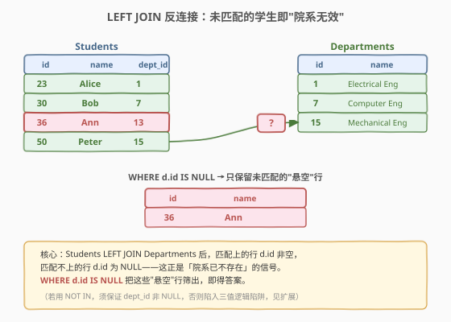
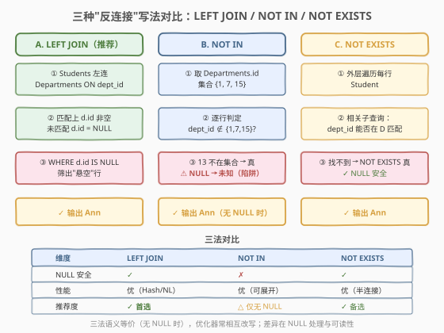
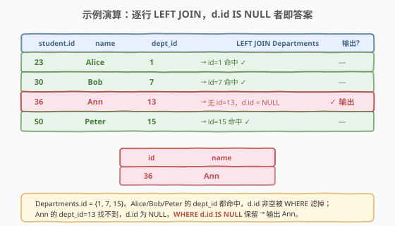

# LeetCode 院系无效的学生 题解

## 1. 题目概述

- **标题 / 题号**：院系无效的学生（#1350，easy）
- **链接**：https://leetcode.cn/problems/students-with-invalid-departments/
- **难度**：简单
- **标签**：数据库、SQL、反连接（Anti-Join）、LEFT JOIN、NOT IN、NOT EXISTS、外键、pandas

**题意**：给定两张表：`Departments`（院系，`id` 为主键）与 `Students`（学生，`id` 为主键，`department_id` 为外键指向 `Departments.id`）。编写 SQL 查询，找出**所在院系已不存在**的学生的 `id` 与 `name`——即 `department_id` 在 `Departments.id` 中找不到对应记录的学生。

> ⚠️ 关键点：这是经典的「**反连接（Anti-Join）**」场景——要的不是两表匹配上的行，而是**左表中匹配不上的行**。与内连接 `JOIN`（取交集）相反，反连接取的是「左表 − 交集」。三种等价写法：`LEFT JOIN ... IS NULL`、`NOT IN`、`NOT EXISTS`，核心差异在于对 `NULL` 的处理。

**表结构**：

```text
Table: Departments
+---------------+---------+
| Column Name   | Type    |
+---------------+---------+
| id            | int     |  ← 主键
| name          | varchar |  ← 院系名称
+---------------+---------+

Table: Students
+---------------+---------+
| Column Name   | Type    |
+---------------+---------+
| id            | int     |  ← 主键
| name          | varchar |  ← 学生姓名
| department_id | int     |  ← 外键 → Departments.id
+---------------+---------+
```

- `Departments.id` 为主键；`Students.id` 为主键。
- `Students.department_id` 是指向 `Departments.id` 的外键——但外键约束只在写入时保证「新插的学生必须指向一个当时存在的院系」，**若某院系后来被删除（软删除/解约），已指向它的学生记录可能残留**，成为「院系无效的学生」。这正是本题的现实语义。

**示例 1**：

```text
输入：
Departments 表：
+----+------------------------+
| id | name                   |
+----+------------------------+
| 1  | Electrical Engineering |
| 7  | Computer Engineering   |
| 15 | Mechanical Engineering |
+----+------------------------+
Students 表：
+----+-------+---------------+
| id | name  | department_id |
+----+-------+---------------+
| 23 | Alice | 1             |
| 30 | Bob   | 7             |
| 36 | Ann   | 13            |
| 50 | Peter | 15            |
+----+-------+---------------+

输出：
+----+------+
| id | name |
+----+------+
| 36 | Ann  |
+----+------+
```

**解释**：

| id | name | department_id | 在 Departments 中? | 结论 |
|----|------|---------------|--------------------|------|
| 23 | Alice | 1 | ✅ 命中 id=1 | 院系有效 |
| 30 | Bob | 7 | ✅ 命中 id=7 | 院系有效 |
| 36 | Ann | 13 | ❌ 无 id=13 | **院系无效 → 输出** |
| 50 | Peter | 15 | ✅ 命中 id=15 | 院系有效 |

`Departments.id = {1, 7, 15}`，Ann 的 `department_id=13` 不在其中，故 Ann 是「院系无效的学生」。

**约束**：

- `Students.id`、`Departments.id` 均为主键，无重复
- `department_id` 为整数，指向 `Departments.id`
- 结果可按任意顺序返回
- 输出列名：`id`、`name`

> 💡 本题是 SQL **「反连接招牌入门题」**——核心就一句：`Students LEFT JOIN Departments ON ... WHERE d.id IS NULL`。难点不在写法本身，而在理解「为何 `LEFT JOIN` 配合 `IS NULL` 能筛出未匹配行」以及「`NOT IN` 的 `NULL` 陷阱」。

## 2. 解题思路

### 2.1 暴力思路：逐行 NOT IN 判定

最直觉的过程式思维：先取出 `Departments.id` 的集合，再对每个学生判定其 `department_id` 是否不在这个集合里：

```text
valid_set = { d.id for d in Departments }
for each row s in Students:
    if s.department_id not in valid_set:
        output(s.id, s.name)
```

对应 SQL 就是 `NOT IN`：

```sql
SELECT id, name
FROM Students
WHERE department_id NOT IN (SELECT id FROM Departments);
```

逻辑正确且直观。但 `NOT IN` 有一个著名陷阱：**若子查询结果含 `NULL`，整个 `NOT IN` 会失效**（详见 2.4 与第 5 节）。本题 `Departments.id` 是主键、非空，所以本例安全；但工程实践中外键列或子查询常可能产出 `NULL`，`NOT IN` 是定时炸弹。

### 2.2 核心观察：LEFT JOIN 反连接——筛"悬空"行



关键洞察：`LEFT JOIN` 保留左表（`Students`）全部行，右表（`Departments`）匹配不上的字段全部填 `NULL`。因此——

- **匹配上的行**：`d.id` 非空（学生所在院系存在）。
- **匹配不上的行**：`d.id` 为 `NULL`（学生所在院系已不存在）。

$$
\text{院系无效的学生} = \Big\{\, s \in \text{Students} \;\Big|\; \nexists\, d \in \text{Departments},\; d.\text{id} = s.\text{department\_id} \,\Big\}
$$

用 `WHERE d.id IS NULL` 把这些「悬空」行筛出，即得答案。

> 💡 **为什么用左连接的右表主键判 `IS NULL`？** `Departments.id` 是主键、非空。若某行 `d.id` 为 `NULL`，**唯一可能**就是 `LEFT JOIN` 没匹配上（右侧行不存在，被填了 `NULL`）。用主键列判 `IS NULL` 是反连接的标准手法——主键非空，所以「右表字段为 `NULL`」与「未匹配」严格等价，不会误判。
>
> ⚠️ **不要判 `s.department_id IS NULL`**：那查的是「学生自己没填院系」，与「院系不存在」是两回事。本题要查的是右表 `Departments` 侧的字段是否为 `NULL`。

### 2.3 算法流程图：三种反连接写法对比



三法语义等价（无 `NULL` 时），核心差异在 `NULL` 处理与执行模型：

| 维度 | LEFT JOIN + IS NULL | NOT IN | NOT EXISTS |
|------|---------------------|--------|------------|
| **思路** | 左连后筛右表主键为 NULL 的悬空行 | 取右表 id 集合，逐行判定不在集合 | 逐行跑相关子查询，找不到即真 |
| **NULL 安全** | ✅ 是 | ❌ 否（子查询含 NULL 则全空） | ✅ 是 |
| **执行模型** | Hash/Nested Loop 连接 | 子查询展开 / Hash 半连接 | 相关子查询 → 半连接 |
| **推荐度** | ✓ **首选** | △ 仅当确认无 NULL | ✓ 备选 |

> 💡 **现代优化器的真相**：MySQL 8.0 / PostgreSQL 等优化器常把 `NOT IN`、`NOT EXISTS`、`LEFT JOIN ... IS NULL` 相互改写为同一套半连接（Semi-Join）/反连接（Anti-Join）物理算子，性能趋同。因此**选择依据主要是语义清晰度与 NULL 安全性**，而非微性能差异。`LEFT JOIN ... IS NULL` 最直观地表达了「反连接」意图且 NULL 安全，是面试首选。

### 2.4 示例演算

以示例 1 数据，跟踪 `LEFT JOIN` 逐行匹配的过程：



**步骤 ①：`Students LEFT JOIN Departments ON s.department_id = d.id`**

左连保留 4 名学生，逐行尝试在 `Departments` 中找 `id = department_id` 的院系：

| s.id | s.name | s.department_id | 匹配到的 d | 连接结果行 |
|------|--------|-----------------|-----------|-----------|
| 23 | Alice | 1 | d(1, Electrical) | Alice + Electrical |
| 30 | Bob | 7 | d(7, Computer) | Bob + Computer |
| 36 | Ann | 13 | ❌ 无 | Ann + (NULL, NULL) |
| 50 | Peter | 15 | d(15, Mechanical) | Peter + Mechanical |

**步骤 ②：`WHERE d.id IS NULL`**

只有 Ann 那一行的 `d.id` 为 `NULL`（未匹配，右侧填空），其余三行 `d.id` 分别为 1/7/15 非空被滤掉。

**步骤 ③：`SELECT s.id, s.name`**

输出最终结果：`(36, Ann)`。

> 💡 **验证**：`Departments.id = {1, 7, 15}`。Alice/Bob/Peter 的 `department_id` 均命中，被 `IS NULL` 滤除；Ann 的 `department_id=13` 找不到，`d.id` 为 `NULL` 被保留。结果与示例一致。

> ⚠️ **`NOT IN` 的 NULL 陷阱（反例）**：若 `Departments.id` 中存在 `NULL`（本题不会，因主键非空，但工程中常见），则 `department_id NOT IN (SELECT id FROM Departments)` 对**所有行**都返回 `UNKNOWN`（三值逻辑：`x NOT IN (1, 7, NULL)` ⟺ `x≠1 AND x≠7 AND x≠NULL`，最后一项为 `UNKNOWN`，整个 `AND` 为 `UNKNOWN`/`FALSE`），`WHERE` 只保留 `TRUE`，于是**一行都不会输出**——连真正无效的学生也被吞掉。这是 `NOT IN` 与 `NOT EXISTS`/`LEFT JOIN` 最本质的差异。

## 3. 参考代码

### MySQL（解法 A：LEFT JOIN + IS NULL，推荐）

```sql
# 1350. 院系无效的学生
# 思路：LEFT JOIN 后筛右表主键为 NULL 的悬空行 = 反连接
SELECT s.id, s.name
FROM Students s
LEFT JOIN Departments d
    ON s.department_id = d.id
WHERE d.id IS NULL;
```

> 💡 **写法要点**：
> - **`LEFT JOIN`**：保留 `Students` 全部行，匹配不上的右侧填 `NULL`。
> - **`WHERE d.id IS NULL`**：`d.id` 是 `Departments` 的主键、非空，只有未匹配行才会是 `NULL`，故「右表主键为 NULL」严格等价于「未匹配」。
> - **判右表、不判左表**：用 `d.id`（右表）判 `IS NULL`，而非 `s.department_id`。后者判的是「学生没填院系」，语义不同。
> - **NULL 安全**：即使 `Students.department_id` 含 `NULL`，该行左连后 `d.id` 仍为 `NULL`，会被一并筛出——符合「找不到院系」的语义（NULL 院系确实不存在）。若题目想排除这种情况，加 `AND s.department_id IS NOT NULL`。

### MySQL（解法 B：NOT IN）

```sql
# 解法 B：department_id 不在 Departments.id 集合中
SELECT id, name
FROM Students
WHERE department_id NOT IN (SELECT id FROM Departments);
```

> 💡 **写法要点**：
> - **直观**：直接翻译「`department_id` 不在院系 id 集合」的自然语言。
> - **⚠️ NULL 陷阱**：本题 `Departments.id` 是主键、非空，安全。但若子查询可能返回 `NULL`，整个查询会返回空集。防御写法：`WHERE department_id NOT IN (SELECT id FROM Departments WHERE id IS NOT NULL)`。
> - **`Students.department_id` 为 NULL 的行**：`NULL NOT IN (...)` 恒为 `UNKNOWN`，不会被输出——即 `NOT IN` 默认排除「没填院系」的学生。与解法 A 的默认行为不同（A 会输出 NULL 院系学生），需注意语义差异。

### MySQL（解法 C：NOT EXISTS）

```sql
# 解法 C：不存在匹配的院系行 = 反连接（NULL 安全）
SELECT s.id, s.name
FROM Students s
WHERE NOT EXISTS (
    SELECT 1
    FROM Departments d
    WHERE d.id = s.department_id
);
```

> 💡 **写法要点**：
> - **相关子查询**：内层 `WHERE d.id = s.department_id` 引用外层当前行的 `s.department_id`，逐行判定「能否在 `Departments` 找到匹配」。
> - **`NOT EXISTS`**：找不到（子查询结果为空）→ `NOT EXISTS` 为 `TRUE` → 输出该学生。
> - **NULL 安全**：`s.department_id` 为 `NULL` 时，`d.id = NULL` 恒为 `UNKNOWN`，子查询无命中行 → `NOT EXISTS` 为 `TRUE` → 输出。即 `NOT EXISTS` 默认输出「NULL 院系」学生，与解法 A 一致、与解法 B 不同。
> - 优化器通常将 `NOT EXISTS` 改写为反连接半连接算子，性能与解法 A 趋同。

### Python（pandas）

```python
import pandas as pd

def find_students(departments: pd.DataFrame, students: pd.DataFrame) -> pd.DataFrame:
    # 院系 id 集合
    valid_ids = set(departments['id'])
    # 筛 department_id 不在院系集合的学生（反连接）
    invalid = students[~students['department_id'].isin(valid_ids)]
    return invalid[['id', 'name']]
```

> 💡 **pandas 对照**：
> - `set(departments['id'])` 对应 `SELECT id FROM Departments` 的集合。
> - `students['department_id'].isin(valid_ids)` 对应 `IN` 子查询；`~` 取反对应 `NOT IN`/反连接。
> - `~isin` 对 `NaN` 的 `department_id` 返回 `False`（pandas 的 `isin` 对 `NaN` 返回 `False`，取反仍 `False`），即**默认排除 NaN 院系学生**——与解法 B（`NOT IN`）行为一致，与解法 A/C 不同。若需把 NaN 院系也算「无效」，加 `| students['department_id'].isna()`。
> - 也可用 `merge(how='left', indicator=True)` 模拟 `LEFT JOIN`：`students.merge(departments, left_on='department_id', right_on='id', how='left', indicator=True)` 后取 `_merge == 'left_only'`，更贴近解法 A 语义且 NaN 行会被归为 `left_only`。

## 4. 复杂度分析

| 维度 | 解法 A（LEFT JOIN） | 解法 B（NOT IN） | 解法 C（NOT EXISTS） | pandas |
|------|---------------------|------------------|----------------------|--------|
| **时间** | $O(n + m)$ | $O(n + m)$ | $O(n + m)$ | $O(n + m)$ |
| **空间** | $O(m)$ | $O(m)$ | $O(m)$ | $O(m)$ |
| **NULL 安全** | ✅ | ❌ | ✅ | △（NaN 默认排除） |
| **推荐度** | ✓ **首选** | △ 仅无 NULL | ✓ 备选 | ✓ pandas 环境 |

> - $n$ = `Students` 行数，$m$ = `Departments` 行数
> - **解法 A**：`LEFT JOIN` 可走 Hash Join（$O(n+m)$）或 Nested Loop（$O(nm)$，但 `Departments` 表小时常被选）。筛 `IS NULL` 是 $O(n)$ 过滤。整体 $O(n+m)$。
> - **解法 B**：子查询物化 `Departments.id` 集（$O(m)$），外层逐行做集合判定。优化器常用 Hash 半连接，$O(n+m)$。
> - **解法 C**：相关子查询理论上 $O(n \cdot m)$（每行扫一遍 `Departments`），但优化器会改写为反连接半连接算子，$O(n+m)$。
> - **索引优化**：在 `Departments.id`（主键已有索引）与 `Students.department_id` 上建索引，可加速连接与子查询查找。

## 5. 扩展：反连接三剑客与 NULL 三值逻辑

### 5.1 反连接的三种等价写法

「找出左表中与右表匹配不上的行」是 SQL 高频题眼，三种实现：

| 范式 | 写法 | 特点 |
|------|------|------|
| **LEFT JOIN + IS NULL** | `L LEFT JOIN R ON ... WHERE R.主键 IS NULL` | 最直观表达「反连接」，NULL 安全 |
| **NOT IN** | `WHERE L.k NOT IN (SELECT k FROM R)` | 直译自然语言，**子查询含 NULL 则失效** |
| **NOT EXISTS** | `WHERE NOT EXISTS (SELECT 1 FROM R WHERE R.k = L.k)` | NULL 安全，相关子查询语义清晰 |

> 💡 **选择口诀**：默认用 `LEFT JOIN ... IS NULL`（最直观 + NULL 安全）；`NOT EXISTS` 是等价的 NULL 安全备选；`NOT IN` 仅在确认子查询无 `NULL` 时使用，否则加 `WHERE k IS NOT NULL` 防御。

### 5.2 NOT IN 的 NULL 陷阱：三值逻辑

SQL 用三值逻辑（`TRUE` / `FALSE` / `UNKNOWN`）。`NULL` 参与比较的结果是 `UNKNOWN`，而 `WHERE` 只保留 `TRUE`（`UNKNOWN` 被当作「不满足」）。

`x NOT IN (a, b, c)` 等价于 `x <> a AND x <> b AND x <> c`。若集合中有 `NULL`：

| x | 集合 | `x NOT IN 集合` | 原因 |
|---|------|-----------------|------|
| 13 | (1, 7, 15) | `TRUE` | 13≠1 ∧ 13≠7 ∧ 13≠15 全真 |
| 13 | (1, 7, 15, NULL) | `UNKNOWN` | 13≠1 ∧ 13≠7 ∧ 13≠15 ∧ 13≠NULL，末项 UNKNOWN → 整体 UNKNOWN |
| 7 | (1, 7, 15, NULL) | `FALSE` | 7≠7 为 FALSE → 整体 FALSE |

**致命后果**：只要子查询返回了至少一个 `NULL`，`NOT IN` 对**所有**左表行都返回 `UNKNOWN` 或 `FALSE`，`WHERE` 一行都不保留——查询返回空集。`LEFT JOIN ... IS NULL` 与 `NOT EXISTS` 不受此影响。

> ⚠️ **防御写法**：`WHERE L.k NOT IN (SELECT k FROM R WHERE k IS NOT NULL)`——在子查询里先滤掉 `NULL`，即可安全使用 `NOT IN`。但仍建议直接用 `LEFT JOIN`/`NOT EXISTS`，从根上规避。

### 5.3 三法对 NULL 外键的不同行为

当 `Students.department_id` 本身为 `NULL`（学生没填院系）时，三法行为各异：

| 解法 | NULL 院系学生是否输出 | 原因 |
|------|----------------------|------|
| A. LEFT JOIN + IS NULL | ✅ 输出 | 左连后 `d.id` 为 NULL → 被 `IS NULL` 保留 |
| B. NOT IN | ❌ 不输出 | `NULL NOT IN (...)` 为 UNKNOWN |
| C. NOT EXISTS | ✅ 输出 | `d.id = NULL` 无命中 → `NOT EXISTS` 为 TRUE |

> 💡 本题语义上「院系已不存在」是否涵盖「没填院系」见仁见智。若想与解法 A/C 一致地排除 NULL 院系，加 `AND s.department_id IS NOT NULL`；若想与解法 B 一致，用 `NOT IN` 或在 A/C 中加 `s.department_id IS NOT NULL`。**明确语义、显式处理 NULL** 是写稳健 SQL 的关键。

### 5.4 现实映射：软删除与外键约束

本题的现实场景是「**院系被删除，学生记录残留**」。生产中两种处理：

- **硬删除 + 外键约束**：`department_id` 有外键约束时，删除 `Departments` 行会因外键受阻——要么先迁走学生，要么 `ON DELETE CASCADE`（连带删学生）/`ON DELETE SET NULL`（学生院系置空）。本题对应「约束未生效或被绕过」的遗留数据。
- **软删除**：`Departments` 加 `deleted_at` 列，删除只标记不物理删。此时反连接改为 `LEFT JOIN ... WHERE d.id IS NULL OR d.deleted_at IS NOT NULL`。

> 💡 反连接是数据治理的常用工具——找出「指向已失效实体」的脏数据，本题即其最小原型。

## 6. 面试要点

1. **为什么用 `LEFT JOIN ... WHERE d.id IS NULL` 而不是 `INNER JOIN`？**

   > `INNER JOIN` 只保留两表都匹配上的行，丢掉未匹配行——而本题要的恰恰是未匹配的学生。`LEFT JOIN` 保留左表全部行，未匹配的右表字段填 `NULL`，再用 `WHERE d.id IS NULL` 把这些悬空行筛出。`INNER JOIN` 会把答案（未匹配行）直接丢掉，是反连接的反面。

2. **为什么判 `d.id IS NULL` 而不是 `s.department_id IS NULL`？**

   > `d.id` 是 `Departments` 的主键、非空，它为 `NULL` 的**唯一原因**是 `LEFT JOIN` 没匹配上（右侧行不存在被填空）——这正是「院系不存在」的信号。`s.department_id IS NULL` 判的是「学生自己没填院系」，是另一回事。反连接一律判**右表主键**为 `NULL`。

3. **`NOT IN` 的 NULL 陷阱是什么？**

   > 若 `NOT IN (子查询)` 的子查询返回了 `NULL`，则 `x NOT IN (..., NULL)` 等价于 `x<>... AND x<>NULL`，末项为 `UNKNOWN`，整个 `AND` 为 `UNKNOWN`/`FALSE`，`WHERE` 一行都不保留——查询返回空集。本题 `Departments.id` 是主键非空所以安全，但工程中子查询常含 `NULL`，`NOT IN` 是定时炸弹。防御写法：子查询内加 `WHERE k IS NOT NULL`，或直接用 `LEFT JOIN`/`NOT EXISTS`。

4. **`LEFT JOIN`、`NOT IN`、`NOT EXISTS` 三者性能差异？**

   > 现代优化器（MySQL 8.0+、PostgreSQL）常把三者改写为同一套反连接/半连接物理算子，性能趋同。理论上：`LEFT JOIN` 走 Hash Join $O(n+m)$；`NOT EXISTS` 相关子查询看似 $O(nm)$ 但会被优化为半连接 $O(n+m)$；`NOT IN` 也可展开为 Hash 半连接。因此选择依据主要是**语义清晰度与 NULL 安全性**，首选 `LEFT JOIN ... IS NULL`。

5. **如果 `Students.department_id` 可为 NULL，三法行为有何不同？**

   > `LEFT JOIN ... IS NULL` 与 `NOT EXISTS` 会把 `department_id IS NULL` 的学生也输出（`d.id` 为 NULL / 子查询无命中）；`NOT IN` 不会（`NULL NOT IN (...)` 为 UNKNOWN）。语义上「没填院系」是否算「院系无效」视需求而定，应显式用 `s.department_id IS NOT NULL` 或 `IS NULL` 处理，避免依赖隐式行为。

> 💡 **一句话总结**：1350 是 SQL **「反连接招牌入门题」**——核心就一句：`Students LEFT JOIN Departments ON s.department_id = d.id WHERE d.id IS NULL`。记住三条：① 反连接取「左表 − 交集」，用 `LEFT JOIN` 配右表主键 `IS NULL`；② `NOT IN` 有 NULL 陷阱，子查询含 NULL 则返回空集；③ `LEFT JOIN`/`NOT EXISTS` NULL 安全，`NOT IN` 不安全——默认选 `LEFT JOIN ... IS NULL`。

## 同类练习题

| # | 题目 | 与本题的关联 |
|---|------|-------------|
| 183 | [从不订购的客户](https://leetcode.cn/problems/customers-who-never-order/)（[题解](../0101-0200/183_从不订购的客户.md)） | 反连接祖师爷题——`Customers LEFT JOIN Orders WHERE IS NULL` 找从未下单的客户，与本题完全同骨架 |
| 577 | [员工奖金](https://leetcode.cn/problems/employee-bonus/)（[题解](../0501-0600/577_员工奖金.md)） | `Employee LEFT JOIN Bonus WHERE bonus IS NULL`，含 NULL 奖金处理——对照三法对 NULL 的不同行为 |
| 607 | [销售员](https://leetcode.cn/problems/sales-person/)（[题解](../0601-0700/607_销售员.md)） | 找没有特定公司订单的销售员，`NOT IN`/反连接经典场景，承接本题 NOT IN 写法 |
| 585 | [2016年的投资](https://leetcode.cn/problems/investments-in-2016/)（[题解](../0501-0600/585_2016年的投资.md)） | 自连接 + `LEFT JOIN ... IS NULL` 找「2016 年金额不与同城市其他年度重复」的人，反连接进阶 |
| 1083 | [销售分析 II](https://leetcode.cn/problems/sales-analysis-ii/)（[题解](../1001-1100/1083_销售分析II.md)） | 找从未买过某类产品的买家，`NOT IN`/反连接在多表场景的应用 |
