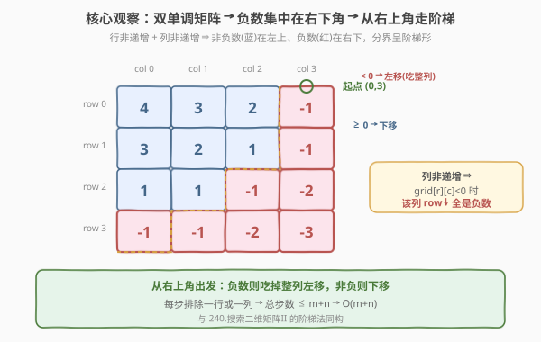
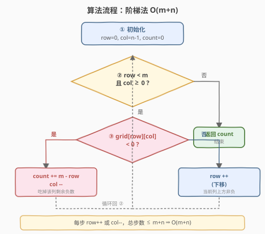
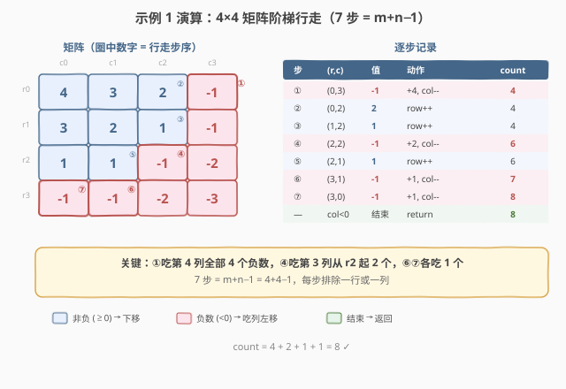

# 统计有序矩阵中的负数

- **题目名称**：统计有序矩阵中的负数
- **链接**：[1351. 统计有序矩阵中的负数](https://leetcode.cn/problems/count-negative-numbers-in-a-sorted-matrix/)
- **难度**：简单
- **标签**：数组、二分查找、矩阵

## 1. 题目概述

给你一个 `m × n` 的矩阵 `grid`，矩阵中的元素无论是按行还是按列，都以**非严格递减**顺序排列（即每行从左到右不增、每列从上到下不增）。请你统计并返回 `grid` 中**负数**的数目。

**示例 1**：

```text
输入：grid = [[4,3,2,-1],[3,2,1,-1],[1,1,-1,-2],[-1,-1,-2,-3]]
输出：8
解释：矩阵中共有 8 个负数。
```

**示例 2**：

```text
输入：grid = [[3,2],[1,0]]
输出：0
```

**约束条件**：

- `m == grid.length`，`n == grid[i].length`
- `1 <= m, n <= 100`
- `-100 <= grid[i][j] <= 100`

**进阶**：你可以设计一个时间复杂度为 $O(n + m)$ 的解决方案吗？

> 💡 本题的灵魂是「**行和列双单调**」——非严格递减意味着负数集中在矩阵的右下角，形成一条「阶梯形」分界线。从右上角出发沿这条阶梯行走，每遇到负数就能一次性「吃掉」整列剩余的负数，这就是 $O(m+n)$ 阶梯法的核心。

---

## 2. 解题思路

### 2.1 暴力思路：逐元素扫描

最直观的做法：遍历矩阵每一个元素，遇到 `< 0` 就计数加一。

- **正确但浪费单调性**：题目保证行、列双单调，暴力扫描 $O(mn)$ 完全没有利用这一结构；
- **数据量小能过**：$m, n \le 100$，$mn \le 10^4$，毫秒级通过，但当矩阵变大时线性扫描成为瓶颈。

> ⚠️ 暴力不是错，只是把「双单调」这把钥匙闲置了。利用列单调性，一次判定就能排除一整列——这是从 $O(mn)$ 到 $O(m+n)$ 的关键跨越。

### 2.2 核心观察：阶梯法（从右上角出发的 $O(m+n)$ 遍历）



**关键洞察**：矩阵每行、每列都非严格递减，所以负数必然聚集在右下角，非负数聚集在左上角，二者之间存在一条「阶梯形」分界线。从**右上角** `(row=0, col=n-1)` 出发：

1. **若 `grid[row][col] < 0`**：当前格是负数。由于**列非递增**，该列中 `row` 及以下的所有格子都 $\le$ `grid[row][col] < 0`，即**整列从当前行起全是负数**。一次性计数 `m - row` 个，然后**左移** `col--`（去探索左边的列）；
2. **若 `grid[row][col] >= 0`**：当前格非负。由于**行非递增**，同行更左的格子可能更小（可能为负），但当前列在当前行及以上都是非负的，所以**下移** `row++`（去探索下面的行）；
3. 重复直到 `row >= m` 或 `col < 0`。

> 以示例 1 的第 4 列 `[-1, -1, -2, -3]` 为例：站在 `(0, 3)` 发现 `-1 < 0`，由于列非递增，`(-1, -1, -2, -3)` 全是负数——直接 `count += 4`，然后左移到第 3 列。一次操作吃掉一整列 4 个负数，而非逐个扫描。

> ⚠️ **为什么从右上角出发？** 右上角是「最右的行首」与「最上的列尾」的交汇——往左走值更大（行非递增的反方向），往下走值更小（列非递增）。这恰好让「负数在右下」的结构每次移动都能排除一行或一列，是 $O(m+n)$ 的几何基础。与 [240. 搜索二维矩阵 II](https://leetcode.cn/problems/search-a-2d-matrix-ii/) 从右上角搜索目标值的阶梯法同构。

### 2.3 算法流程图



**完整步骤**：

1. **初始化**：`row = 0, col = n - 1, count = 0`；
2. **循环**（`row < m` 且 `col >= 0`）：
   - `grid[row][col] < 0` → `count += m - row`，`col--`；
   - `grid[row][col] >= 0` → `row++`；
3. **返回** `count`。

> 💡 每次循环要么 `row++` 要么 `col--`，`row` 最多增 `m` 次、`col` 最多减 `n` 次，总步数 $\le m + n$，故时间 $O(m+n)$，空间 $O(1)$。这是「**每步排除一行或一列**」的经典不变量分析。

### 2.4 示例演算

以示例 1 的 `4×4` 矩阵为例：



矩阵如下（负数标红，阶梯路径标蓝）：

| 步 | 位置 `(row,col)` | 值 | 判定 | 动作 | 累计 count |
|----|------------------|------|------|------|-----------|
| 1 | `(0, 3)` | -1 | < 0 | count += 4-0=4，左移 | 4 |
| 2 | `(0, 2)` | 2 | >= 0 | 下移 | 4 |
| 3 | `(1, 2)` | 1 | >= 0 | 下移 | 4 |
| 4 | `(2, 2)` | -1 | < 0 | count += 4-2=2，左移 | 6 |
| 5 | `(2, 1)` | 1 | >= 0 | 下移 | 6 |
| 6 | `(3, 1)` | -1 | < 0 | count += 4-3=1，左移 | 7 |
| 7 | `(3, 0)` | -1 | < 0 | count += 4-3=1，左移 | 8 |
| — | `(3, -1)` | — | col<0 | 结束 | **8** |

> 💡 第 1 步是关键：站在 `(0,3)` 发现 `-1 < 0`，第 4 列 `[-1,-1,-2,-3]` 全是负数，一次 `count += 4`。第 4 步同理吃掉第 3 列从行 2 起的 2 个负数。7 步走完（$m+n-1=7$），正好 $O(m+n)$。

---

## 3. 参考代码

### C++

```cpp
// 统计有序矩阵中的负数.cpp —— 阶梯法，O(m + n)
// 编译: g++ -O2 -std=c++17 统计有序矩阵中的负数.cpp -o countneg
#include <vector>
using namespace std;

class Solution {
public:
    int countNegatives(vector<vector<int>>& grid) {
        int m = grid.size(), n = grid[0].size();
        int row = 0, col = n - 1, count = 0;
        while (row < m && col >= 0) {
            if (grid[row][col] < 0) {
                count += m - row;     // 该列从 row 起全是负数
                col--;                // 左移探索下一列
            } else {
                row++;                // 当前列上方非负，下移
            }
        }
        return count;
    }
};
```

### Python

```python
class Solution:
    def countNegatives(self, grid: list[list[int]]) -> int:
        m, n = len(grid), len(grid[0])
        row, col, count = 0, n - 1, 0
        while row < m and col >= 0:
            if grid[row][col] < 0:
                count += m - row      # 该列从 row 起全是负数
                col -= 1              # 左移
            else:
                row += 1              # 下移
        return count
```

> 💡 两版等价，核心是「**负数吃列左移，非负下移**」。`count += m - row` 是利用列单调性一次性吞掉整列负数的关键，避免了逐个计数。注意 `col` 从 `n-1` 起（右上角），不是 `0`。

---

## 4. 复杂度分析

| 维度 | 阶梯法 $O(m+n)$（推荐） | 二分法 $O(m\log n)$ | 暴力 $O(mn)$ |
|------|------------------------|---------------------|-------------|
| 时间复杂度 | $O(m + n)$ | $O(m\log n)$ | $O(mn)$ |
| 空间复杂度 | $O(1)$ | $O(1)$ | $O(1)$ |
| 实际运算量 | `m=n=100` 约 200 步 | 约 $100\times 7=700$ 次 | 约 $10^4$ 次 |

- **阶梯法**：每步排除一行或一列，总步数 $\le m+n$，最优。$m, n \le 100$ 时约 200 步。
- **二分法**：每行非递增，二分找首个负数下标，该行负数个数 $= n - \text{pos}$，合计 $O(m\log n)$。当 $n \gg m$ 时二分可能更优，但本题量级下两者皆可。
- **暴力**：$O(mn)$，数据小能过，但不体现对单调结构的利用。

> ⚠️ 阶梯法是**进阶要求** $O(m+n)$ 的正解。它同时利用了行单调与列单调——二分法只利用了行单调，暴力两者都没用。面试中写出阶梯法是加分点。

---

## 5. 扩展：二分法（每行找首个负数）

若仅利用「每行非递增」，可对每行二分找**首个负数**的下标 `pos`，该行负数个数 $= n - pos$。

```python
class Solution:
    def countNegatives(self, grid: list[list[int]]) -> int:
        m, n = len(grid), len(grid[0])
        count = 0
        for row in grid:
            lo, hi = 0, n            # hi 取 n 覆盖「全非负」行
            while lo < hi:
                mid = (lo + hi) // 2
                if row[mid] < 0:
                    hi = mid          # 可能是首个负数，收右界
                else:
                    lo = mid + 1      # 非负，首个负数在右
            count += n - lo           # lo == 首个负数下标
        return count
```

> 💡 这是 [704. 二分查找](../0701-0800/704_二分查找)「找下界」模板的谓词版（谓词为 `< 0`），`hi` 取 `n` 覆盖「全非负行」（首个负数虚拟落在 `n`，负数个数 $= 0$）。与 [1337. 矩阵中战斗力最弱的 K 行](../1301-1400/1337_矩阵中战斗力最弱的K行.md)「二分找首个 0」结构完全同构——都是「单调序列找首个满足谓词的位置」。区别在于 1337 每行非递增（`1…1, 0…0`），本题每行非递增（大…小），方向一致。

---

## 6. 面试要点

1. **如何想到从右上角出发？**

   > 矩阵行、列双单调（非递减），负数聚集右下角、非负聚集左上角，分界线呈阶梯形。右上角是「行的最右端」与「列的最上端」的交汇——往左值更大（行方向）、往下值更小（列方向），每次移动都能排除一行或一列。这是「双单调矩阵遍历」的标准起手式，与 240 搜索二维矩阵 II 同源。

2. **为什么 `grid[row][col] < 0` 时能 `count += m - row`？**

   > 列非递增保证 `grid[row][col] >= grid[row+1][col] >= ... >= grid[m-1][col]`。既然 `grid[row][col] < 0`，该列从 `row` 到 `m-1` 全是负数，共 `m - row` 个。一次性计数后左移，无需逐个扫描——这是把 $O(mn)$ 压到 $O(m+n)$ 的关键。

3. **为什么时间复杂度是 $O(m+n)$ 而非 $O(mn)$？**

   > 不变量分析：每次循环要么 `row++`（最多 `m` 次）要么 `col--`（最多 `n` 次），两者互斥且不可逆。总步数 $\le m + n$，与矩阵元素数 $mn$ 无关。这是「每步排除一行或一列」的典型复杂度论证。

4. **阶梯法和二分法怎么选？**

   > 阶梯法 $O(m+n)$ 同时利用行、列双单调，是进阶正解；二分法 $O(m\log n)$ 只利用行单调。当 $m \approx n$ 时阶梯法更优（$2n$ vs $n\log n$）；当 $n \gg m$（行极长）时二分可能更优。本题 $m, n \le 100$ 两者皆可，面试优先写阶梯法展示对双单调的充分利用。

5. **能否从左下角出发？**

   > 可以，方向对称。从左下角 `(m-1, 0)` 出发：若 `grid[row][col] >= 0` 则右移（同行更右更小，可能变负）；若 `< 0` 则该行从 `col` 起往右... 不对——左下角出发的逻辑是：`>= 0` 右移，`< 0` 时该行 `col` 及以右全是负数，`count += n - col`，然后上移 `row--`。与右上角对称，复杂度同样 $O(m+n)$。选右上角是仓库与 240 题一致的惯例。

> 💡 **一句话总结**：1351 的灵魂是「**双单调矩阵的阶梯遍历**」——从右上角出发，负数吃整列左移、非负下移，每步排除一行或一列，$O(m+n)$ 完成。看到「行和列都有序」就条件反射想阶梯法。

---

## 7. 同类练习题

- [240. 搜索二维矩阵 II](https://leetcode.cn/problems/search-a-2d-matrix-ii/)：同为「行、列双单调矩阵」从右上角出发的阶梯法母题，本题数负数、240 找目标值，起手式与不变量分析完全一致
- [1337. 矩阵中战斗力最弱的 K 行](../1301-1400/1337_矩阵中战斗力最弱的K行.md)：矩阵每行单调（`1…1, 0…0`），用二分找首个 0，与本题第 5 节「二分找首个负数」结构同构，对照 `hi = n` 的边界处理
- [704. 二分查找](../0701-0800/704_二分查找.md)：二分母题，本题第 5 节「每行二分找首个负数」即其「找下界」模板的谓词版
- [74. 搜索二维矩阵](../0001-0100/74_搜索二维矩阵.md)：矩阵每行有序且行首大于上行行尾（可一维化二分），对比 240/1351 的「双单调但不可一维化」——三种矩阵有序结构的不同利用方式
- [378. 有序矩阵中第 K 小的元素](https://leetcode.cn/problems/kth-smallest-element-in-a-sorted-matrix/)：行列双单调矩阵的第 K 小，二分值域 + 阶梯计数（承接本题的阶梯遍历思想升级为值域二分验证）
