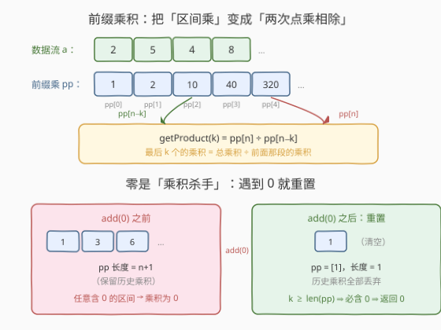
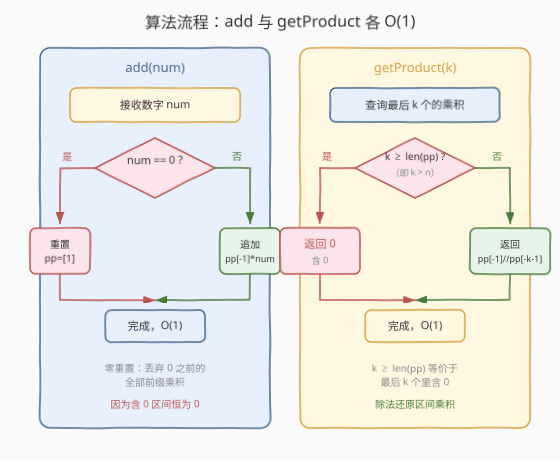
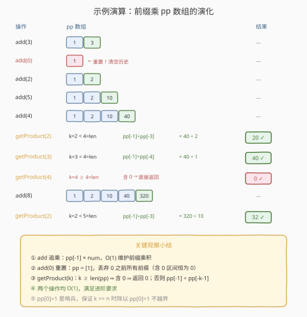

# LeetCode 最后 K 个数的乘积 题解

## 1. 题目概述

- **标题 / 题号**：最后 K 个数的乘积（#1352，medium）
- **链接**：https://leetcode.cn/problems/product-of-the-last-k-numbers/
- **难度**：中等
- **标签**：设计、队列、前缀和、数学

**题意**：设计一个算法，接受一个整数流并检索该流中最后 `k` 个整数的乘积。实现 `ProductOfNumbers` 类：

- `ProductOfNumbers()`：用空的流初始化对象。
- `void add(int num)`：将数字 `num` 添加到当前数字列表的最后面。
- `int getProduct(int k)`：返回当前数字列表中最后 `k` 个数字的乘积。保证当前列表中始终至少包含 `k` 个数字。

**题目数据保证**：任何时候，任一连续数字序列的乘积都在 32 位整数范围内，不会溢出。

**示例**：

```text
输入：
["ProductOfNumbers","add","add","add","add","add","getProduct","getProduct","getProduct","add","getProduct"]
[[],[3],[0],[2],[5],[4],[2],[3],[4],[8],[2]]

输出：
[null,null,null,null,null,null,20,40,0,null,32]

解释：
ProductOfNumbers p = new ProductOfNumbers();
p.add(3);        // 列表：[3]
p.add(0);        // 列表：[3,0]
p.add(2);        // 列表：[3,0,2]
p.add(5);        // 列表：[3,0,2,5]
p.add(4);        // 列表：[3,0,2,5,4]
p.getProduct(2); // 返回 20。最后 2 个的乘积 5 * 4 = 20
p.getProduct(3); // 返回 40。最后 3 个的乘积 2 * 5 * 4 = 40
p.getProduct(4); // 返回  0。最后 4 个的乘积 0 * 2 * 5 * 4 = 0
p.add(8);        // 列表：[3,0,2,5,4,8]
p.getProduct(2); // 返回 32。最后 2 个的乘积 4 * 8 = 32
```

**约束**：

- $0 \le \text{num} \le 100$
- $1 \le k \le 4 \times 10^4$
- `add` 和 `getProduct` 最多被调用 $4 \times 10^4$ 次
- 在任何时间点，流的乘积都在 32 位整数范围内

> 💡 本题的进阶要求是 `add` 和 `getProduct` **均为 $O(1)$**。直接遍历最后 `k` 个数求乘积是 $O(k)$，在 $4 \times 10^4$ 次调用下会退化到 $O(k \times q) \approx 1.6 \times 10^9$，不可接受。需要用**前缀乘积**把区间乘降为 $O(1)$ 查询，同时处理好「乘积杀手」——数字 0。

## 2. 解题思路

### 2.1 暴力思路：遍历最后 k 个数

最直白的做法：用一个数组（或队列）存储所有已加入的数字。`add(num)` 直接 `append`，$O(1)$。`getProduct(k)` 取数组最后 `k` 个元素逐一相乘，$O(k)$。

在 $q = 4 \times 10^4$ 次调用、$k$ 最大 $4 \times 10^4$ 的极端情况下，总时间可达 $O(q \cdot k) \approx 1.6 \times 10^9$，会超时。而且每次 `getProduct` 都重复计算相同的乘积，存在大量冗余。

> ⚠️ 注意 `num` 可以是 `0`，遍历乘法遇到 0 会立刻得到 0，但暴力法并没有利用这一点优化——它仍需遍历到那个 0 才知道。

### 2.2 核心观察：前缀乘积 + 零重置



**前缀乘积**是前缀和的乘法对偶。定义前缀乘积数组 `pp`，其中：

$$\text{pp}[i] = a_1 \times a_2 \times \cdots \times a_i$$

并设哨兵 $\text{pp}[0] = 1$（空乘积）。那么最后 `k` 个数的乘积为：

$$\text{getProduct}(k) = a_{n-k+1} \times \cdots \times a_n = \frac{\text{pp}[n]}{\text{pp}[n-k]}$$

这样 `getProduct` 只需一次除法，$O(1)$。`add(num)` 只需追乘 `pp[-1] * num`，也是 $O(1)$。

**但有一个致命问题：数字 0**。乘法遇到 0 就「归零」，而且 0 会污染之后所有前缀乘积（`pp` 全变成 0，除法无法还原任何区间）。解决方法是**遇到 0 就重置前缀乘积数组**：

- `add(num)` 时，若 `num == 0`：把 `pp` 重置为 `[1]`（清空历史，因为 0 之前的乘积不再有用——任何跨越这个 0 的区间乘积必为 0）。
- 若 `num != 0`：追加 `pp[-1] * num`。

**为什么重置是安全的？** 因为 0 之后的查询分两种：

1. **查询区间完全在 0 之后**（`k < len(pp)`）：这些数字里没有 0，前缀乘积正常工作，除法还原区间乘积。
2. **查询区间跨越了 0**（`k >= len(pp)`，即 `k > n`，其中 `n = len(pp) - 1` 是自上次重置后加入的非零数字个数）：说明最后 `k` 个数里必然包含那个 0，乘积直接返回 `0`。

> 💡 **关键不变式**：`pp` 数组中**只存自最近一次 0 之后的非零前缀乘积**。`len(pp) - 1` 恰好等于「自最近 0 后加入的非零数字个数」。`k >= len(pp)` 等价于「最后 k 个数中含 0」。

### 2.3 算法流程图



**add(num)** 完整步骤：

1. 若 `num == 0`：重置 `pp = [1]`（丢弃 0 之前的全部前缀乘积）。
2. 否则：`pp.append(pp[-1] * num)`。
3. 返回。时间 $O(1)$。

**getProduct(k)** 完整步骤：

1. 若 `k >= len(pp)`（即 `k > n`）：说明最后 `k` 个数中含 0，返回 `0`。
2. 否则：返回 `pp[-1] // pp[-(k+1)]`（即 `pp[n] / pp[n-k]`）。时间 $O(1)$。

> ⚠️ 除法用整除 `//` 即可——题目保证乘积在 32 位整数范围内，且 `pp` 中每个元素都是若干非零整数的乘积，`pp[n]` 必然是 `pp[n-k]` 的整数倍，整除无精度问题。哨兵 `pp[0] = 1` 保证 `k == n` 时除以 `pp[0] = 1` 不越界。

### 2.4 示例演算

以官方示例为例，逐步追踪 `pp` 数组的演化与每次查询的结果：



| 操作 | pp 数组 | 判定 | 结果 |
|------|---------|------|------|
| `add(3)` | `[1, 3]` | — | — |
| `add(0)` | `[1]` ← 重置 | — | — |
| `add(2)` | `[1, 2]` | — | — |
| `add(5)` | `[1, 2, 10]` | — | — |
| `add(4)` | `[1, 2, 10, 40]` | — | — |
| `getProduct(2)` | `[1, 2, 10, 40]` | $k=2 < 4=\text{len}$，$40 \div 2$ | $20$ ✓ |
| `getProduct(3)` | `[1, 2, 10, 40]` | $k=3 < 4=\text{len}$，$40 \div 1$ | $40$ ✓ |
| `getProduct(4)` | `[1, 2, 10, 40]` | $k=4 \ge 4=\text{len}$，含 0 | $0$ ✓ |
| `add(8)` | `[1, 2, 10, 40, 320]` | — | — |
| `getProduct(2)` | `[1, 2, 10, 40, 320]` | $k=2 < 5=\text{len}$，$320 \div 10$ | $32$ ✓ |

全部与预期输出一致。注意 `getProduct(4)` 这一步：虽然列表实际是 `[3,0,2,5,4]`（5 个元素），但 `pp` 在 `add(0)` 时被重置为 `[1]`，之后只追了 4 个非零数（`2,5,4` 加上 `add(8)` 前的 3 个），故 `len(pp) = 4`，`k = 4 >= 4` 判定含 0，返回 0。这正是「零重置」的精髓——**不需要记住 0 之前有什么，只需知道 0 存在过**。

## 3. 参考代码

### C++

```cpp
class ProductOfNumbers {
    vector<int> pp; // 前缀乘积，pp[0] = 1 为哨兵
public:
    ProductOfNumbers() {
        pp = {1};
    }

    void add(int num) {
        if (num == 0) {
            pp = {1}; // 重置：丢弃 0 之前的全部前缀乘积
        } else {
            pp.push_back(pp.back() * num);
        }
    }

    int getProduct(int k) {
        if (k >= (int)pp.size()) {
            return 0; // 最后 k 个数中含 0
        }
        return pp.back() / pp[pp.size() - k - 1];
    }
};
```

### Python

```python
class ProductOfNumbers:

    def __init__(self):
        self.pp = [1]  # 前缀乘积，pp[0] = 1 为哨兵

    def add(self, num: int) -> None:
        if num == 0:
            self.pp = [1]  # 重置：丢弃 0 之前的全部前缀乘积
        else:
            self.pp.append(self.pp[-1] * num)

    def getProduct(self, k: int) -> int:
        if k >= len(self.pp):
            return 0  # 最后 k 个数中含 0
        return self.pp[-1] // self.pp[-k - 1]
```

> 💡 **实现细节**：① `pp` 初始化为 `[1]`，这个哨兵保证 `k == n`（查询全部非零数字）时 `pp[n] / pp[0]` 即 `pp[n] / 1`，无需特判越界。② `add(0)` 时用 `pp = {1}` / `self.pp = [1]` 直接重建，比 `clear()` + `append(1)` 更简洁。③ `getProduct` 中 `k >= len(pp)` 等价于 `k > n`（`n = len(pp) - 1`），即查询范围超过了非零段长度，必含 0。④ 除法用整数除法 `//`，因为 `pp[n]` 是 `pp[n-k]` 的整数倍，无精度损失。

## 4. 复杂度分析

| 维度 | 复杂度 | 说明 |
|------|--------|------|
| `add` 时间 | $O(1)$ | 追乘一次或重置数组（重置为 `[1]` 也是常数） |
| `getProduct` 时间 | $O(1)$ | 一次长度比较 + 一次除法 |
| 空间 | $O(q)$ | `pp` 数组最多存储 $q$ 个前缀乘积（$q$ 为 `add` 调用次数，最坏无 0 时全部保留） |

> ⚠️ 空间最坏 $O(q) = O(4 \times 10^4)$，每个元素是 32 位整数，约 160 KB，完全可接受。若流中频繁出现 0，`pp` 会被反复重置为 `[1]`，实际空间远小于上界。

## 5. 扩展：前缀乘积的局限与替代方案

**为什么不能用前缀和那种「容斥」直接套？** 前缀和的区间和 $S[l..r] = \text{ps}[r] - \text{ps}[l-1]$，减法对任何值都成立。但前缀乘积的区间乘 $P[l..r] = \text{pp}[r] / \text{pp}[l-1]$，**除法在遇到 0 时失效**（除以 0 无定义，且 0 之后乘积全为 0 无法还原）。这就是本题必须「零重置」的根本原因——把除法的不定义域规避掉。

**替代方案：对数累加（避免除法）**。若题目不保证「乘积在 32 位范围内」（即可能溢出或为浮点），可以用 $\log$ 把乘法转加法：维护前缀对数和 $\text{lp}[i] = \sum_{j=1}^{i} \log a_j$，则 $\log P[l..r] = \text{lp}[r] - \text{lp}[l-1]$，乘积 $= \exp(\text{lp}[r] - \text{lp}[l-1])$。但浮点精度有误差，且 0 的 $\log$ 为 $-\infty$ 仍需特殊处理，实战中不如整数前缀乘 + 重置干净。

**替代方案：线段树 / 树状数组**。用线段树维护区间乘积，`add` 在叶子节点更新（$O(\log q)$），`getProduct` 查询最后 `k` 个的区间乘（$O(\log q)$）。优点是天然处理 0（区间乘直接算出 0），无需重置；缺点是 $O(\log q)$ 而非 $O(1)$，且实现更重。本题数据规模下前缀乘 + 重置是最优选择。

> 💡 **一句话总结**：前缀乘积把区间乘降到 $O(1)$，零重置巧妙规避了「除以 0」的不定义域——不需要记住 0 之前的历史，只需用 `k >= len(pp)` 判定查询是否跨越了 0。

## 6. 面试要点

1. **为什么 `add(0)` 要重置整个 `pp` 数组？不重置会怎样？**

   > 不重置的话，0 之后的 `pp` 元素全部变成 0（`pp[-1] * 0 = 0`，再往后 `0 * num = 0`），所有前缀乘积都塌缩为 0，`getProduct` 用除法 `pp[n] / pp[n-k]` 会变成 `0 / 0`，无意义。重置为 `[1]` 相当于「从 0 之后重新开始记前缀」，保证 `pp` 中只含非零乘积。

2. **`k >= len(pp)` 为什么就一定含 0？**

   > `len(pp) - 1 = n` 是自最近一次 0 之后加入的非零数字个数。`k >= len(pp)` 即 `k > n`，意味着查询的 `k` 个数超出了非零段，必然包含了那个 0（或更早的 0）。反之 `k < len(pp)` 即 `k <= n`，查询完全落在非零段内，可以安全用除法。

3. **哨兵 `pp[0] = 1` 的作用是什么？**

   > 保证 `k == n`（查询自重置后全部非零数字）时，`pp[n] / pp[0] = pp[n] / 1 = pp[n]`，不会越界。如果没有哨兵，`pp[n-k] = pp[0]` 不存在，需要特判。哨兵是前缀和/前缀乘积的通用技巧，把边界条件统一进公式。

4. **题目保证「乘积在 32 位范围内」，如果取消这个保证怎么处理？**

   > 需要大数运算或取模。取模方案：维护前缀乘积对某质数 $M$ 取模，`getProduct` 用乘法逆元还原 `pp[n] * inv(pp[n-k]) % M`。但 0 的处理仍需重置（0 没有逆元）。大数方案：用 Python 的任意精度整数或 C++ 的大数类，但 `pp` 元素会膨胀，空间和单次乘法时间增长。实战中取模 + 逆元是竞赛常见做法。

5. **前缀乘积和前缀和有什么本质区别？**

   > 前缀和用减法还原区间和，减法对任何值都成立；前缀乘积用除法还原区间乘，但除法在除数为 0 时不定义，且乘以 0 后无法「撤销」（信息丢失）。所以前缀和不需要特殊处理 0，而前缀乘积必须靠「零重置」来规避这个数学缺陷。这是「乘法群 vs 加法群」结构的差异——加法总可逆，乘法对 0 不可逆。

## 同类练习题

| # | 题目 | 与本题的关联 |
|---|------|-------------|
| 303 | [区域和检索 - 数组不可变](https://leetcode.cn/problems/range-sum-query-immutable/)（[题解](../0301-0400/303_区域和检索%20-%20数组不可变.md)） | 前缀和的模板题，本题前缀乘积的加法对偶，对照学习「哨兵 + 区间公式」通用范式 |
| 304 | [二维区域和检索 - 数组不可变](https://leetcode.cn/problems/range-sum-query-2d-immutable/)（[题解](../0301-0400/304_二维区域和检索%20-%20数组不可变.md)） | 前缀和的二维扩展（四角容斥），巩固前缀思想在更高维度与不同运算上的迁移 |
| 239 | [滑动窗口最大值](https://leetcode.cn/problems/sliding-window-maximum/)（[题解](../0201-0300/239_滑动窗口最大值.md)） | 同为「查询最后/窗口内 k 个元素的聚合」的设计题，对照单调队列 $O(k)$ 退化为 $O(1)$ 前缀的思路差异 |
| 152 | [乘积最大子数组](https://leetcode.cn/problems/maximum-product-subarray/)（[题解](../0101-0200/152_乘积最大子数组.md)） | 同样处理「乘积中的 0 与负数」难题，对照「零分段 + 正负滚动」与本题「零重置」处理 0 的不同策略 |
| 739 | [每日温度](https://leetcode.cn/problems/daily-temperatures/)（[题解](../0701-0800/739_每日温度.md)） | 同为「对历史数据做查询」的设计场景，对照单调栈与前缀积两种预处理范式的适用条件 |
