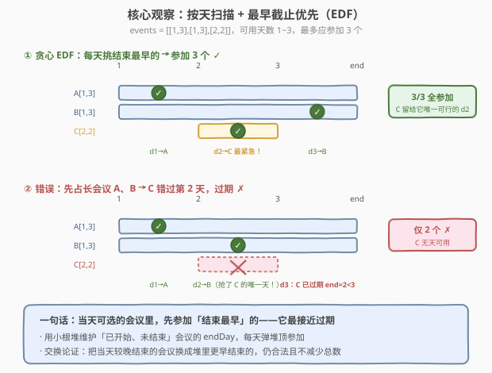
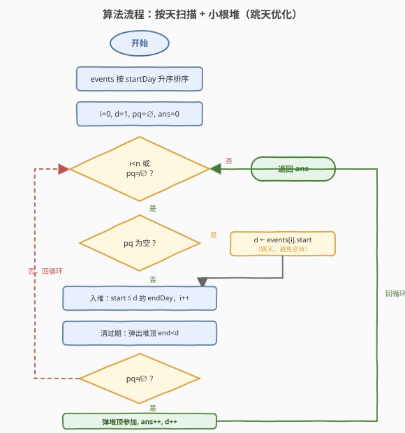
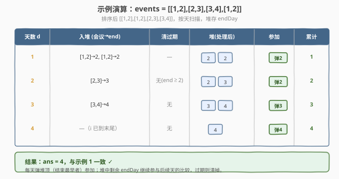

# 最多可以参加的会议数目

- **题目名称**：最多可以参加的会议数目
- **链接**：[1353. 最多可以参加的会议数目](https://leetcode.cn/problems/maximum-number-of-events-that-can-be-attended/)
- **难度**：中等
- **标签**：贪心、堆、优先队列、排序

## 1. 题目概述

给定一个数组 `events`，其中 `events[i] = [startDay_i, endDay_i]`。每个会议 `i` 从 `startDay_i` 开始，到 `endDay_i` 结束。你可以在 `startDay_i <= d <= endDay_i` 中的**任意一天** `d` 参加会议 `i`，但**每天最多只能参加一个会议**。返回你能参加的**最多会议数目**。

**示例 1**：

```text
输入：events = [[1,2],[2,3],[3,4],[1,2]]
输出：4
解释：一种最优方案：第 1 天参加第 4 个会议 [1,2]，第 2 天参加第 2 个会议 [2,3]，第 3 天参加第 3 个会议 [3,4]，第 4 天…… 共参加 4 个。
```

**示例 2**：

```text
输入：events= [[1,2],[1,2],[3,3],[1,5],[1,5]]
输出：5
```

**约束条件**：

- `1 <= events.length <= 10^5`
- `events[i].length == 2`
- `1 <= startDay_i <= endDay_i <= 10^5`

> 💡 本题与经典的「**会议安排**」(区间调度) 问题同源，但有一个关键差异：传统区间调度每个区间占满整段、问最多选多少个**互不重叠**的区间（[435 无重叠区间](../0401-0500/435_无重叠区间.md) 的对偶）；本题每个会议只需占用其窗口内**任意一天**，因此不能套用「按右端点排序 + 贪心选不重叠」的模板，而要**按天扫描 + 优先队列**动态选「当前最紧急的会议」。

---

## 2. 解题思路

### 2.1 暴力思路：枚举每天配对

最朴素的做法：对每一天 `d`，在所有满足 `start_i <= d <= end_i` 且尚未参加的会议里挑一个参加。难点在于「挑哪一个」——若随意挑，可能把后面唯一能参加某天的会议挤掉，导致总数不是最优。

例如 `events = [[1,3],[1,3],[2,2]]`，共 3 个会议、可用天数 1~3：

- 若第 1 天参加 `[1,3]`、第 2 天参加 `[1,3]`，则第 3 天 `[2,2]` 早已过期（它的窗口只有第 2 天），只能参加 2 个；
- 若第 1 天参加 `[1,3]`、第 2 天**留给** `[2,2]`（它只能第 2 天）、第 3 天参加另一个 `[1,3]`，则能参加 3 个。

可见「**先参加谁**」直接决定能否取到最大值。暴力枚举所有匹配方案是指数级的，不可行。

### 2.2 核心观察：最早截止优先（EDF）+ 优先队列



关键直觉：**当天可参加的会议里，应该优先参加「结束最早」的那个**——因为它最接近过期，拖到后面就没机会了；而结束晚的会议还有更多天数可选，可以往后让。

这就是经典的 **Earliest Deadline First（EDF）** 贪心策略。具体做法：

1. **按开始日排序**：把会议按 `startDay` 升序排好，用一个指针 `i` 顺序扫描。
2. **按天推进**：维护当前天数 `d`，以及一个**小根堆** `pq`，堆里存「**已经开始但尚未参加**」的会议的**结束日** `endDay`。
3. **每到一天 `d` 做三件事**：
   - **入堆**：把所有 `startDay == d`（更精确地 `startDay <= d`）的会议的 `endDay` 压入堆；
   - **清过期**：弹出堆顶所有 `endDay < d` 的会议（它们已经没法参加了）；
   - **参加一个**：若堆非空，弹出堆顶（结束最早者），`ans++`，然后 `d++` 进入下一天。
4. **跳天优化**：若某轮堆空了但还有会议没入堆，直接把 `d` 跳到下一个未入堆会议的 `startDay`，避免空转。

> 💡 **为什么 EDF 是对的？** 用**交换论证**：设某最优解在第 `d` 天参加了会议 `A`（结束日 `eA`），而堆顶是结束更早的会议 `B`（`eB <= eA`）。由于 `B` 此时也处于「已开始未结束」状态，把 `B` 安排到第 `d` 天、把 `A` 顺延到 `A` 原本被安排的某个后续可行天（或与 `A` 等价的方案），仍然合法且不减少总数。反复交换可把任何最优解调整成「每天取最早截止」的方案，故贪心解即最优解。

### 2.3 算法流程图



### 2.4 示例演算

以示例 1 `events = [[1,2],[2,3],[3,4],[1,2]]` 为例，排序后仍为 `[[1,2],[1,2],[2,3],[3,4]]`：



| 天数 d | 入堆(会议→end) | 清过期 | 堆(处理后) | 参加 | 累计 |
|--------|----------------|--------|------------|------|------|
| 1 | [1,2]→2, [1,2]→2 | 无 | {2,2} | 弹 2 | 1 |
| 2 | [2,3]→3 | 无(end≥2) | {2,3} | 弹 2 | 2 |
| 3 | [3,4]→4 | 无 | {3,4} | 弹 3 | 3 |
| 4 | 无 | 无 | {4} | 弹 4 | 4 |

最终返回 `4`，与示例一致。注意第 1 天堆里有 `{2,2}` 两个相同的结束日，弹哪一个都行——这正是「同截止日可任选」的体现。

---

## 3. 参考代码

### 方法一：按天扫描 + 小根堆（跳天优化，推荐）

### C++

```cpp
class Solution {
  public:
    int maxEvents(vector<vector<int>>& events) {
        sort(events.begin(), events.end()); // 按 startDay 升序
        int n = events.size();
        priority_queue<int, vector<int>, greater<int>> pq; // 小根堆，存 endDay
        int i = 0, ans = 0;
        int d = 1;
        while (i < n || !pq.empty()) {
            if (pq.empty()) {
                d = events[i][0]; // 堆空：跳到下一个会议的开始日，避免空转
            }
            while (i < n && events[i][0] <= d) {
                pq.push(events[i][1]); // 所有已开始的会议入堆
                ++i;
            }
            while (!pq.empty() && pq.top() < d) {
                pq.pop(); // 弹出已过期会议
            }
            if (!pq.empty()) {
                pq.pop(); // 参加结束最早的那个
                ++ans;
                ++d;
            }
        }
        return ans;
    }
};
```

### Python

```python
class Solution:
    def maxEvents(self, events: List[List[int]]) -> int:
        events.sort(key=lambda x: x[0])  # 按 startDay 升序
        n = len(events)
        import heapq
        pq = []  # 小根堆，存 endDay
        i = ans = 0
        d = 1
        while i < n or pq:
            if not pq:
                d = events[i][0]  # 堆空：跳到下一个会议的开始日，避免空转
            while i < n and events[i][0] <= d:
                heapq.heappush(pq, events[i][1])  # 所有已开始的会议入堆
                i += 1
            while pq and pq[0] < d:
                heapq.heappop(pq)  # 弹出已过期会议
            if pq:
                heapq.heappop(pq)  # 参加结束最早的那个
                ans += 1
                d += 1
        return ans
```

### 方法二：朴素逐天扫描（不跳天，更直观）

当 `maxEnd` 不大时（本题 `endDay <= 10^5`），可直接用 `for d in range(1, maxEnd+1)` 逐天推进，省去跳天逻辑，时间 $O(D \log n)$，$D$ 为最大结束日。

### Python

```python
class Solution:
    def maxEvents(self, events: List[List[int]]) -> int:
        events.sort(key=lambda x: x[0])
        import heapq
        pq = []
        i = ans = 0
        n = len(events)
        last = max(e[1] for e in events)
        for d in range(1, last + 1):
            while i < n and events[i][0] <= d:
                heapq.heappush(pq, events[i][1])
                i += 1
            while pq and pq[0] < d:
                heapq.heappop(pq)
            if pq:
                heapq.heappop(pq)
                ans += 1
        return ans
```

> ⚠️ 朴素版在 `endDay` 上界很大（如 `10^9`）时会超时，因此**面试推荐方法一的跳天优化**，它对任意上界都是 $O(n \log n)$。

---

## 4. 复杂度分析

| 维度 | 方法 | 复杂度 | 说明 |
|------|------|--------|------|
| 时间复杂度 | 跳天优化 | $O(n \log n)$ | 每个会议入堆/出堆各一次，单次 $O(\log n)$；跳天使总天数推进不超过 $n$ 次 |
| 空间复杂度 | 跳天优化 | $O(n)$ | 堆最多存 $n$ 个 endDay |
| 时间复杂度 | 朴素逐天 | $O(D \log n)$ | $D$ = 最大 endDay，逐天循环 $D$ 次，每次堆操作 $O(\log n)$ |
| 空间复杂度 | 朴素逐天 | $O(n)$ | 同上 |

> 💡 跳天优化的关键：当堆为空时直接把 `d` 设为下一个会议的 `startDay`，于是 `d` 的取值次数被「参加次数 + 跳天次数」控制，总数不超过 $n$，避免了对 `endDay` 上界的依赖。

---

## 5. 扩展：相关变体

- **带价值的会议（1751. 最多可以参加的会议数目 II）**：每个会议参加后有收益 `value`，最多参加 `k` 个，问最大收益。窗口内可任选一天的特性不变，但目标变为「选至多 `k` 个使总价值最大」——贪心不再适用，需**按 endDay 排序 + DP** `dp[i][j]` 表示前 `i` 个会议选了 `j` 个的最大收益，用二分找上一个不冲突的会议。
- **必须占满区间（253. 会议室 II / 2406. 将区间分为最少组数）**：此时每个会议占满 `[start, end]` 全部时段，问最少几间会议室/几组才能不冲突——是「**最大同时重叠**」问题，用差分计数或小根堆维护当前会议的结束时间即可。

---

## 6. 面试要点

1. **为什么不能套用「按右端点排序 + 贪心选不重叠」的模板？**
   - 那个模板适用于「每个区间占满整段、互不重叠」的区间调度（如 435/646）。本题每个会议**只需占用窗口内任意一天**，并非整段占用，因此「重叠」的定义不同，必须改为按天扫描 + 优先队列。

2. **为什么贪心选「结束最早」是正确的？**
   - 交换论证：把任意最优解中「当天参加的较晚结束会议」与「堆里更早结束的会议」对调，仍合法且不减少总数。反复交换即得贪心解，故贪心解 ≤ 最优解，又因贪心解是可行解，故等于最优解。

3. **跳天优化为什么是 $O(n \log n)$？**
   - `d` 只在两种情况下推进：参加一个会议（`d++`，至多 `n` 次）或堆空时跳到下一个 `startDay`（至多 `n` 次）。故外层循环总轮数 $O(n)$，每轮堆操作 $O(\log n)$，总计 $O(n \log n)$，与 `endDay` 上界无关。

4. **堆里存 `endDay` 而非会议编号有什么好处？**
   - 我们只关心「最早结束」，`endDay` 本身就是比较键，直接存 `endDay` 让堆的插入/弹出最简洁。若题目需记录「参加了哪些会议」，再存编号并在比较器里按 `endDay` 比较即可。

5. **如果把约束改成「每个会议必须参加连续 `k` 天」呢？**
   - 不再是「占一天」问题，需改为区间长度为 `k` 的区间调度，本质回到「按右端点排序 + 贪心」或差分 + 并查集找空位，与本题思路分道扬镳。

---

## 7. 同类练习题

- [1751. 最多可以参加的会议数目 II](https://leetcode.cn/problems/maximum-number-of-events-that-can-be-attended-ii/)：本题的「带价值 + 最多 k 个」版，贪心升级为 DP + 二分
- [253. 会议室 II](https://leetcode.cn/problems/meeting-rooms-ii/)：每个会议占满整段，求最少会议室数（最大重叠），小根堆维护结束时间
- [435. 无重叠区间](https://leetcode.cn/problems/non-overlapping-intervals/)（[题解](../0401-0500/435_无重叠区间.md)）：经典区间调度贪心，按右端点排序，对照本题理解「占满 vs 占一天」的差异
- [502. IPO](https://leetcode.cn/problems/ipo/)（[题解](../0601-0700/502_IPO.md)）：贪心 + 大根堆，按「可解锁」逐轮取最大利润，与本题「按天解锁会议」同骨架
- [2406. 将区间分为最少组数](https://leetcode.cn/problems/divide-intervals-into-minimum-number-of-groups/)：本质同 253 会议室 II，差分计数或堆解最大重叠
