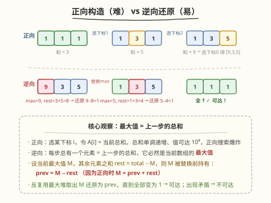
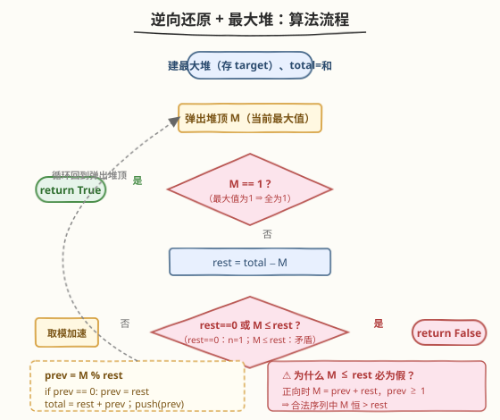

# 多次求和构造目标数组

- **题目名称**：多次求和构造目标数组
- **链接**：[1354. 多次求和构造目标数组](https://leetcode.cn/problems/construct-target-array-with-multiple-sums/)
- **难度**：困难
- **标签**：数组、堆（优先队列）、贪心、数学、逆向思维

## 1. 题目概述

给定一个整数数组 `target`。一开始你有一个数组 `A`，所有元素均为 `1`。你可以执行以下操作任意次：

- 令 $x$ 为 `A` 中所有元素的和；
- 选择任意下标 $i$（$0 \le i < \text{target.length}$），令 $A[i] = x$。

如果能从 `A` 出发构造出 `target`，返回 `True`，否则返回 `False`。

**示例 1**：

```text
输入：target = [9,3,5]
输出：true
解释：从 [1, 1, 1] 开始
[1, 1, 1], 和为 3，选择下标 1 → [1, 3, 1]
[1, 3, 1], 和为 5，选择下标 2 → [1, 3, 5]
[1, 3, 5], 和为 9，选择下标 0 → [9, 3, 5] 完成
```

**示例 2**：

```text
输入：target = [1,1,1,2]
输出：false
解释：不可能从 [1,1,1,1] 出发构造目标数组。
```

**示例 3**：

```text
输入：target = [8,5]
输出：true
```

**约束条件**：

- $N == \text{target.length}$
- $1 \le \text{target.length} \le 5 \times 10^4$
- $1 \le \text{target[i]} \le 10^9$

> ⚠️ 注意三点：① 数组元素只会**增大**（被替换成当前总和，总和 $\ge n \ge 1$），所以正向走是单调膨胀的；② 每一步可选下标有 $n$ 个，正向搜索是 $n$ 叉树、指数爆炸；③ `target[i]` 可达 $10^9$，即便不爆栈，按值逐步构造也必然超时。这三点共同指向——**不能正向构造，必须逆向还原**。

---

## 2. 解题思路

### 2.1 暴力思路：正向搜索

最直白的做法：从全 `1` 数组出发，每步枚举 $n$ 个下标，把该位置替换成当前总和，DFS/BFS 搜索直到命中 `target` 或总和超过目标。

问题：

- 每步 $n$ 个分支，深度可能极大，搜索树指数膨胀；
- `target[i]` 高达 $10^9$，即便沿着一条链逐步构造，步数也可能达到 $10^9$ 量级（例如 `target = [1, 10^9]`，需要 $10^9$ 步把第二个元素从 $1$ 一路加到 $10^9$）。

> 💡 正向搜索的失败提示我们：这题**不该正向走**。正向「$n$ 叉分支」对应着**逆向的唯一确定**——从 `target` 倒推时，每一步被替换的位置是**唯一**的（它必然是当前数组的最大值）。这一「正向发散、逆向收敛」的不对称是破题关键，与 [780. 到达终点](../0701-0800/780_到达终点.md) 如出一辙。

### 2.2 核心观察：逆向还原 + 最大堆



**关键不变式**：正向每一步把某个 $A[i]$ 替换成「当前总和」。替换后，$A[i]$ 等于「替换前的自己」加上「其余所有元素之和」，因此 $A[i]$ **严格大于**其余每一个元素——也就是说，**每一步替换后，被替换的位置必然是数组的最大值**。

于是逆向还原极为自然：

- 设当前数组最大值为 $M$，其余元素之和 $\text{rest} = \text{total} - M$；
- 由于 $M$ 是上一步的总和，它由「替换前该位置的值 $\text{prev}$」+「其余元素之和 $\text{rest}$」构成：$M = \text{prev} + \text{rest}$；
- 故 $\text{prev} = M - \text{rest}$，把 $M$ 还原为 $\text{prev}$ 即得到上一步的数组。

反复取出**最大值**还原，直到全部变成 $1$（可达），或出现矛盾（不可达）。

> 💡 **为什么一定要取最大值？** 正向替换后该位置严格最大，所以逆向时「谁是上一步被替换的」唯一确定为当前最大值。若误取非最大值还原，会得到一个该位置 $\le$ 某个其它元素的状态——这种状态在正向过程中不可能出现（被替换的位置恒为最大），等价于走入歧路。用最大堆保证每次取的就是唯一合法的还原目标。

**合法性判定**：正向替换后 $M = \text{prev} + \text{rest}$ 且 $\text{prev} \ge 1$，故 $M > \text{rest}$ 恒成立。因此逆向时若发现 $M \le \text{rest}$（且 $M \ne 1$），说明当前状态不可能由任何正向步骤产生，直接返回 `False`。

### 2.3 算法流程图



**完整步骤**：

1. **建最大堆**：把 `target` 所有元素入堆，并记录 `total = sum(target)`。
2. **循环还原**：
   - 弹出堆顶 $M$（当前最大值）。
   - **终止判定**：若 $M = 1$，因为所有元素 $\le M = 1$ 且 $\ge 1$，全为 $1$，返回 `True`。
   - 计算 $\text{rest} = \text{total} - M$。
   - **矛盾判定**：若 $\text{rest} = 0$（即 $n = 1$ 且 $M > 1$）或 $M \le \text{rest}$，返回 `False`。
   - **取模加速**：$\text{prev} = M \bmod \text{rest}$；若 $\text{prev} = 0$ 则令 $\text{prev} = \text{rest}$（保证 $\ge 1$）。
   - 更新 $\text{total} = \text{rest} + \text{prev}$，把 $\text{prev}$ 推回堆中。
3. 循环内必返回（堆大小恒定，状态严格收敛，不会空转）。

### 2.4 示例演算

以示例 1 `target = [9, 3, 5]` 为例（`total = 17`）：

![示例演算：[9,3,5] 逆向还原三步到位](../images/cmtms_example_walkthrough.svg)

| 轮次 | 堆中元素 | total | $M$ / $\text{rest}$ | $\text{prev} = M \bmod \text{rest}$ |
|------|----------|-------|---------------------|--------------------------------------|
| 0 | [9, 5, 3] | 17 | 9 / 8 | $9 \bmod 8 = 1$ |
| 1 | [5, 3, 1] | 9 | 5 / 4 | $5 \bmod 4 = 1$ |
| 2 | [3, 1, 1] | 5 | 3 / 2 | $3 \bmod 2 = 1$ |
| 3 | [1, 1, 1] | 3 | $M = 1$ | → 返回 `True` ✓ |

三步还原到全 $1$，与示例 1 一致。

> 💡 **示例 2 为什么 false？** `target = [1,1,1,2]`，`total = 5`。弹出 $M = 2$，$\text{rest} = 5 - 2 = 3$，$M = 2 \le \text{rest} = 3$ 且 $M \ne 1$ → 矛盾，返回 `False`。正向视角：四个 $1$ 的和为 $4$，第一步只能把某位置变成 $4$，不可能产生 $2$。

### 2.5 取模加速：避免 TLE 的关键

朴素逆向每次只做一次 $\text{prev} = M - \text{rest}$，当 $M \gg \text{rest}$ 时会退化。例如 `target = [1, 10^9]`：$M = 10^9$，$\text{rest} = 1$，朴素做法要反复减 $1$ 共 $10^9$ 次，必然 TLE。

**优化原理**：当 $M$ 远大于 $\text{rest}$ 时，同一位置会**连续多次**成为最大值（因为 $M - \text{rest}$ 仍 $> \text{rest}$），而此期间 $\text{rest}$ 不变（其它元素没动）。于是等价于反复执行 $M \leftarrow M - \text{rest}$，直到 $M$ 落入 $[1, \text{rest}]$。这正是**辗转相减**，可一次取模等价：

$$\text{prev} = M \bmod \text{rest}, \quad \text{若为 0 则取 } \text{rest}$$

> ⚠️ **`M % rest == 0` 时为何取 `rest` 而非 `0`？** 还原后的值必须 $\ge 1$（数组元素恒 $\ge 1$）。若 $M$ 恰是 $\text{rest}$ 的整数倍，反复减 $\text{rest}$ 会依次经过 $M, M-\text{rest}, \dots, \text{rest}, 0$，最后一个 $\ge 1$ 的是 $\text{rest}$。取 $\text{rest}$ 既能保证合法，又能让后续判定正确归约（要么继续向全 $1$ 收敛，要么因 $M \le \text{rest}$ 被判矛盾）。对 `target = [1, 10^9]`：$10^9 \bmod 1 = 0 \Rightarrow \text{prev} = 1$，一步到位全 $1$，仅需 $2$ 次堆操作。

---

## 3. 参考代码

### C++

```cpp
// 多次求和构造目标数组.cpp —— 逆向还原 + 最大堆 + 取模加速
// 编译: g++ -O2 -std=c++17 多次求和构造目标数组.cpp -o cmtms
class Solution {
public:
    bool isPossible(vector<int>& target) {
        long long total = 0;
        priority_queue<long long> pq;          // 最大堆
        for (int x : target) {
            total += x;
            pq.push((long long)x);
        }

        while (!pq.empty()) {
            long long M = pq.top(); pq.pop();
            if (M == 1) return true;           // 最大值为 1 ⇒ 全为 1
            long long rest = total - M;
            if (rest == 0 || M <= rest) return false;   // n=1 或矛盾
            long long prev = M % rest;
            if (prev == 0) prev = rest;        // 保证 ≥ 1
            total = rest + prev;               // = total - M + prev
            pq.push(prev);
        }
        return true;                           // 不可达（循环内必返回）
    }
};
```

### Python

```python
class Solution:
    def isPossible(self, target: List[int]) -> bool:
        import heapq
        total = sum(target)
        heap = [-x for x in target]            # Python 无最大堆，取负模拟
        heapq.heapify(heap)

        while True:
            M = -heapq.heappop(heap)
            if M == 1:                         # 最大值为 1 ⇒ 全为 1
                return True
            rest = total - M
            if rest == 0 or M <= rest:         # n=1 或矛盾
                return False
            prev = M % rest
            if prev == 0:
                prev = rest                    # 保证 ≥ 1
            total = rest + prev                # = total - M + prev
            heapq.heappush(heap, -prev)
```

> 💡 **实现细节**：① `target[i]` 可达 $10^9$、$n$ 达 $5\times10^4$，`total` 最高约 $5\times10^{13}$，**C++ 必须用 `long long`**（`int` 会溢出）；Python 天然大整数无此虑。② Python 用取负模拟最大堆，弹出后取负还原。③ 堆大小在循环中**恒定**（弹一个推一个），循环内必返回，`while True` 不会因空堆异常。④ `M == 1` 判定放最前——全 $1$ 基态时 $M = 1 \le \text{rest}$，若先判矛盾会误返回 `False`。

---

## 4. 复杂度分析

| 维度 | 取模加速版（推荐） | 朴素逆向（仅 $M-\text{rest}$） |
|------|-------------------|-------------------------------|
| **时间** | $O((n + \log C)\log n)$ | $O(\sum \text{target}\cdot \log n)$，TLE |
| **空间** | $O(n)$ | $O(n)$ |
| **说明** | 建堆 $O(n)$；每次取模还原 $O(\log n)$；还原总次数 $O(n + \log C)$ | 当 $M \gg \text{rest}$ 时需线性次减法，$10^9$ 必超时 |

> 其中 $C = \max(\text{target}[i])$。取模令被处理的最大值呈**辗转相减式**下降：每次把 $M$ 直接压到 $< \text{rest}$，因此同一位置连续作为最大值的减法被压缩为一次取模，总还原次数从「值域级」降到「对数级」$O(\log C)$；加上每个元素初始入堆的 $O(n)$，总计 $O(n + \log C)$ 次堆操作，每次 $O(\log n)$。

> ⚠️ **朴素逆向为何 TLE？** 它每次只减一个 $\text{rest}$，对 `[1, 10^9]` 这类数据要执行 $10^9$ 次循环。取模把这一连串减法等价为一次 $M \bmod \text{rest}$，是本题从「超时」到「AC」的分水岭。

---

## 5. 扩展：与辗转相减 / 欧几里得算法的同构

本题的逆向还原本质是**多变量版的辗转相减**。当 $n = 2$ 时，逆向过程 `prev = M % rest` 恰好是欧几里得算法求 $\gcd(M, \text{rest})$ 的一步：

- `target = [a, b]` 可达 $\Leftrightarrow$ 反复用大数对小数取模能归约到 $[1, 1]$ $\Leftrightarrow$ $\gcd(a, b) = 1$ 且归约过程不提前出现矛盾。

更一般地，$n \ge 2$ 时逆向每一步把「最大值 $M$」对「其余之和 $\text{rest}$」取模，与欧几里得算法「大数对小数取模」完全同构，只是「另一个数」变成了「其余所有数之和」。这也是该算法天然具有 $O(\log C)$ 收敛性的根源——欧几里得算法的步数上界即 $O(\log C)$（Lamé 定理）。

> 💡 由此可得到一个快速直觉：若 $\gcd$ 视角下整体无法归约到全 $1$（例如某步出现 $M \le \text{rest}$ 的矛盾），则不可达。这与 [1250. 检查「好数组」](https://leetcode.cn/problems/check-if-it-is-a-good-array/) 用「整体 $\gcd = 1$」判定可达性异曲同工。

---

## 6. 面试要点

1. **为什么不能正向构造？怎么想到逆向？**

   > 正向每步有 $n$ 个分支、数组单调膨胀、`target[i]` 可达 $10^9$，搜索树与步数都爆炸。正向「$n$ 叉发散」对应逆向「唯一收敛」——每步被替换的位置在替换后**严格最大**，所以逆向时最大值唯一确定了上一步被改的位置。这种「正向发散 / 逆向唯一」的不对称是触发逆向思维的信号，与 780、[青蛙过河] 类问题同源。

2. **为什么最大值一定对应上一步被替换的位置？**

   > 正向替换令 $A[i] = \text{总和} = \text{prev} + \text{rest}$，其中 $\text{prev} \ge 1$，故 $A[i] = \text{prev} + \text{rest} > \text{rest} \ge$ 其余任一元素。因此被替换位置严格最大，逆向取最大值还原即唯一合法。

3. **取模加速为什么正确？会不会跳过合法状态？**

   > 当 $M > \text{rest}$ 且 $M - \text{rest} > \text{rest}$ 时，同一位置会连续多次作为最大值，期间 $\text{rest}$ 不变（其它元素未动），等价于反复执行 $M \leftarrow M - \text{rest}$。这是一连串确定的减法，中间状态唯一，不会分叉。取模 $M \bmod \text{rest}$ 一次性等价这串减法，落点必然是 $[1, \text{rest}]$ 内的合法值，故不跳过任何状态。

4. **`M % rest == 0` 时为什么取 `rest` 而不是 `0`？**

   > 数组元素恒 $\ge 1$，还原值不能为 $0$。反复减 $\text{rest}$ 到最后一个 $\ge 1$ 的值正是 $\text{rest}$。取 $\text{rest}$ 后，要么它是 $1$（全 $1$ 基态，返回 `True`），要么下一步因 $M \le \text{rest}$ 被判矛盾——两种结局都与朴素逐次减完全一致。

5. **为什么 `M <= rest`（且 `M != 1`）就能判 `False`？**

   > 合法正向步骤保证 $M = \text{prev} + \text{rest} > \text{rest}$。若逆向某步出现 $M \le \text{rest}$，说明当前状态不可能由任何正向步骤产生（最大值不够大），即不可达。注意必须先判 `M == 1`：全 $1$ 基态时 $M = 1 \le \text{rest}$ 但它是合法终点。

6. **C++ 为什么要用 `long long`？**

   > $n \le 5\times10^4$、`target[i]` $\le 10^9$，总和最高约 $5\times10^{13}$，远超 32 位 `int` 上界（约 $2.1\times10^9$）。`total`、堆元素、`M`、`rest`、`prev` 都需 `long long`，否则中间计算溢出会得到错误判定。

---

## 7. 同类练习题

- [780. 到达终点](https://leetcode.cn/problems/reaching-points/)（[题解](../0701-0800/780_到达终点.md)）：逆向 + 取模的母题，把 $(x,y)\to(x+y,y)$ 的正向构造反过来用 $x\bmod y$ 加速，与本题同源，二变量版
- [1250. 检查「好数组」](https://leetcode.cn/problems/check-if-it-is-a-good-array/)：用整体 $\gcd = 1$ 判定可达性，与本题「辗转相减能否归约到全 1」的数论视角呼应
- [2543. 判断一个点是否可以到达](https://leetcode.cn/problems/check-if-point-is-reachable/)：$(x,y)\to(x-y,y)$ 反向归约到 $(1,1)$ 的可达性判定，辗转相减/ $\gcd$ 思路
- [502. IPO](https://leetcode.cn/problems/ipo/)（[题解](../0501-0600/502_IPO.md)）：最大堆贪心招牌题，对照本题对最大堆的基本使用与「排序解锁 + 堆取最大」范式
- [692. 前 K 个高频单词](https://leetcode.cn/problems/top-k-frequent-words/)（[题解](../0601-0700/692_前K个高频单词.md)）：Top-K 最小堆，对照最大堆/最小堆的方向选择与自定义比较器
