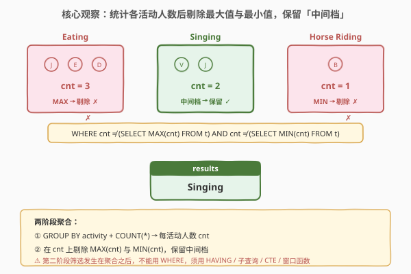
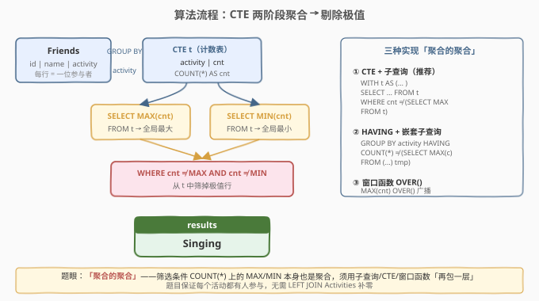
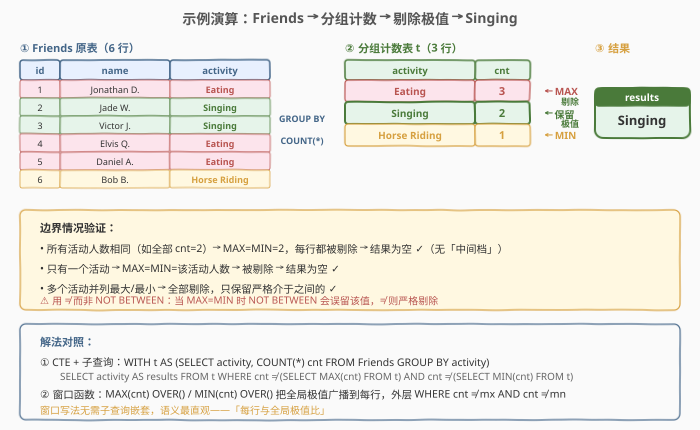

# 活动参与者

- **题目名称**：活动参与者
- **链接**：[1355. 活动参与者](https://leetcode.cn/problems/activity-participants/)
- **难度**：中等
- **标签**：数据库、SQL、GROUP BY、聚合、CTE、子查询、窗口函数、HAVING、pandas

## 1. 题目概述

给定两张表：`Friends`（每位朋友及其参与的活动）和 `Activities`（活动清单）。请编写解决方案找出**参与人数既不是最多、也不是最少**的活动名称。

> ⚠️ 题眼是「**聚合的聚合**」：先 `GROUP BY` 算出每个活动的参与人数，再在这组人数上找出全局 `MAX` 和 `MIN`，最后剔除等于极值的活动。由于 `MAX(cnt)` / `MIN(cnt)` 本身也是聚合，不能直接写进 `WHERE COUNT(*) <> MAX(...)`，必须用**子查询 / CTE / 窗口函数**「再包一层」。

**表结构**：

```text
Table: Friends
+---------------+---------+
| Column Name   | Type    |
+---------------+---------+
| id            | int     |  ← 主键，朋友 id
| name          | varchar |  ← 朋友姓名
| activity      | varchar |  ← 参与的活动名称
+---------------+---------+

Table: Activities
+---------------+---------+
| Column Name   | Type    |
+---------------+---------+
| id            | int     |  ← 主键，活动 id
| name          | varchar |  ← 活动名称
+---------------+---------+
```

- `Friends.id` 是主键，每行代表一位朋友参与某项活动。
- `Friends.activity` 存的是活动**名称**（与 `Activities.name` 对应），故可直接按 `activity` 分组计数。
- 题目保证 `Activities` 中的每个活动都**至少有一人参与**，因此从 `Friends` 分组计数即可覆盖全部活动，无需 `LEFT JOIN Activities` 补零。

**示例 1**：

```text
输入：
Friends 表：
+------+--------------+---------------+
| id   | name         | activity      |
+------+--------------+---------------+
| 1    | Jonathan D.  | Eating        |
| 2    | Jade W.      | Singing       |
| 3    | Victor J.    | Singing       |
| 4    | Elvis Q.     | Eating        |
| 5    | Daniel A.    | Eating        |
| 6    | Bob B.       | Horse Riding  |
+------+--------------+---------------+
Activities 表：
+------+--------------+
| id   | name         |
+------+--------------+
| 1    | Eating       |
| 2    | Singing      |
| 3    | Horse Riding |
+------+--------------+

输出：
+--------------+
| results      |
+--------------+
| Singing      |
+--------------+
```

**解释**：

| activity | 参与者 | cnt | 判定 |
|----------|--------|-----|------|
| Eating | Jonathan D., Elvis Q., Daniel A. | 3 | MAX → 剔除 |
| Singing | Jade W., Victor J. | 2 | 中间档 → 保留 |
| Horse Riding | Bob B. | 1 | MIN → 剔除 |

- `Eating` 有 3 人参与（最多），`Horse Riding` 有 1 人参与（最少），二者均被剔除。
- `Singing` 有 2 人参与，既非最大也非最小，是唯一保留的活动。

**约束条件**：

- `Activities.name` 与 `Friends.activity` 均为活动名称，一一对应。
- 每个活动至少有一人参与（无需处理 0 人活动）。
- 输出列名：`results`，结果顺序任意。

---

## 2. 解题思路

### 2.1 暴力思路：HAVING + 嵌套子查询

最直觉的写法是一段 `GROUP BY` 走到底，把「人数」和「最大/最小人数」的比较都塞进 `HAVING`：

- `GROUP BY activity` → 每活动一行。
- `HAVING COUNT(*) <> (最大人数) AND COUNT(*) <> (最小人数)`。

问题在于「最大/最小人数」要从分组结果里再算一次 `MAX`/`MIN`，于是得在 `HAVING` 的子查询里**再嵌套一层 `SELECT COUNT(*) FROM Friends GROUP BY activity`**，写成 `SELECT MAX(c) FROM (SELECT COUNT(*) AS c FROM Friends GROUP BY activity) tmp`。这种三层嵌套在可读性上很差，但逻辑正确、兼容所有 SQL 版本。

### 2.2 核心观察：两阶段聚合 + 剔除极值



关键洞察分三层：

**第一层：问题是「聚合的聚合」**。`COUNT(*)` 是第一层聚合（每活动人数），`MAX(cnt)` / `MIN(cnt)` 是第二层聚合（全局极值）。SQL 的 `WHERE` 只能作用于原始行、不能作用于聚合结果，因此「与全局极值比较」这一步**必须发生在第一层聚合之后**——要么把聚合结果存进 CTE/子查询再筛，要么用窗口函数把极值广播回每行。

**第二层：剔除边界 = 保留中间档**。把每个活动的 `cnt` 与全局 `MAX`、`MIN` 比较，`cnt ≠ MAX AND cnt ≠ MIN` 者保留。这是一个「裁掉首尾」的操作，与排序取 Top-1 的思路不同——这里不关心谁最大/最小，只关心谁**不**是极端值。

**第三层：三种等价实现**。同一个「聚合的聚合」有三种写法，区别只在「如何把全局极值送到每行旁边做比较」：

| 写法 | 机制 | 优点 | 缺点 |
|------|------|------|------|
| **CTE + 子查询** | 先 `WITH t AS (...)` 存聚合结果，再 `WHERE cnt <> (SELECT MAX(cnt) FROM t)` | 两阶段清晰、可读性最佳 | 需 MySQL 8.0+（CTE） |
| **HAVING + 嵌套子查询** | 不用 CTE，子查询直接嵌在 `HAVING` 里 | 兼容老版本 MySQL | 三层嵌套、可读性差 |
| **窗口函数 `OVER()`** | `MAX(cnt) OVER()` 把全局极值广播到每行，外层 `WHERE` 筛 | 无子查询嵌套、语义最直观 | 需 MySQL 8.0+ |

> 💡 **窗口函数 `OVER()` 的精髓**：`MAX(cnt) OVER()`（注意 `OVER()` 括号内**无参数**）表示「对整个结果集算一次 `MAX`，再把这个标量值**广播**到每一行」。这把「全局聚合」降维成「每行旁边多两列 `mx`、`mn`」，于是外层就能用普通的 `WHERE cnt <> mx AND cnt <> mn` 筛选——无需任何子查询。这是处理「每行与全局聚合比较」最优雅的范式。

### 2.3 算法流程图



**以推荐解法（CTE + 子查询）为例的流水线**：

1. **第一阶段聚合**：`Friends` → `GROUP BY activity` + `COUNT(*) AS cnt` → 得到计数表 `t`（每活动一行，附 `cnt`）。
2. **算全局极值**：对 `t` 做 `SELECT MAX(cnt) FROM t` 和 `SELECT MIN(cnt) FROM t`，得到两个标量。
3. **第二阶段筛选**：从 `t` 中 `WHERE cnt <> MAX AND cnt <> MIN`，剔除极值行。
4. **输出**：`SELECT activity AS results`。

> ⚠️ **为何不用 `NOT BETWEEN`？** `cnt NOT BETWEEN min AND max` 在 `min = max`（所有活动人数相同）时**会误留该值**——因为 `x NOT BETWEEN a AND a` 等价于 `x <> a`，而此时 `x = a`，结果为 false，看似正确。但真正的问题在于 `BETWEEN` 是闭区间，当极值唯一时 `NOT BETWEEN [min, max]` 会把**等于 min 或 max 的行也排除**，语义上与 `<>` 相同；可一旦 `min = max`，`BETWEEN` 的闭区间退化成单点，`NOT BETWEEN` 反而把所有行都排除——这恰好也正确。所以两种写法在本题结论一致，但 `<>` 语义更明确地表达「不等于极值」，推荐用 `<>`。

### 2.4 示例演算

以示例 1 数据，跟踪 CTE 解法的执行过程：



**第一阶段：分组计数**

`Friends` 6 行按 `activity` 分组，`COUNT(*)` 得计数表 `t`：

| activity | cnt |
|----------|-----|
| Eating | 3 |
| Singing | 2 |
| Horse Riding | 1 |

**第二阶段：算极值并筛选**

- `MAX(cnt) = 3`（Eating），`MIN(cnt) = 1`（Horse Riding）。
- 筛选 `cnt <> 3 AND cnt <> 1`：Eating(3) 剔除，Horse Riding(1) 剔除，**Singing(2) 保留**。
- 输出 `results = [Singing]`。

> 💡 **边界验证**：若所有活动人数相同（如全部 `cnt=2`），则 `MAX=MIN=2`，每行 `cnt` 都等于极值，全部剔除，结果为空——正确，因为此时不存在「中间档」。若只有一个活动，同理为空。

---

## 3. 参考代码

### MySQL（解法 A：CTE + 子查询，推荐）

```sql
# 1355. 活动参与者
# 思路：两阶段聚合——先用 CTE 算每活动人数，再用子查询取全局 MAX/MIN 剔除极值
WITH t AS (
    SELECT activity, COUNT(*) AS cnt
    FROM Friends
    GROUP BY activity
)
SELECT activity AS results
FROM t
WHERE cnt <> (SELECT MAX(cnt) FROM t)
  AND cnt <> (SELECT MIN(cnt) FROM t);
```

> 💡 **写法要点**：
> - **CTE `t` 复用三次**：主查询 `FROM t` 读计数表，两个子查询 `(SELECT MAX(cnt) FROM t)` / `(SELECT MIN(cnt) FROM t)` 各扫一次 `t` 取极值。CTE 让两阶段逻辑清晰分离。
> - **`COUNT(*)` 而非 `COUNT(DISTINCT name)`**：`Friends.id` 是主键，每行唯一，同一活动下不会出现重复朋友，`COUNT(*)` 即参与人数。
> - **`<>` 而非 `!=`**：`<>` 是 SQL 标准写法，跨数据库兼容；`!=` 在 MySQL/PostgreSQL 也支持但不通用。
> - **不涉及 `Activities` 表**：题目保证每个活动都有人参与，`Friends.activity` 已覆盖全部活动名，`GROUP BY activity` 即得全部活动计数。

### MySQL（解法 B：HAVING + 嵌套子查询）

```sql
# 解法 B：不用 CTE，把极值子查询嵌在 HAVING 里（兼容老版本 MySQL 5.7）
SELECT activity AS results
FROM Friends
GROUP BY activity
HAVING COUNT(*) <> (
        SELECT MAX(c) FROM (SELECT COUNT(*) AS c FROM Friends GROUP BY activity) tmp
    )
   AND COUNT(*) <> (
        SELECT MIN(c) FROM (SELECT COUNT(*) AS c FROM Friends GROUP BY activity) tmp
    );
```

> 💡 **写法要点**：
> - **三层嵌套**：`HAVING COUNT(*) <> (SELECT MAX(c) FROM (SELECT COUNT(*) FROM ... GROUP BY ...) tmp)`——最内层算每活动人数，中层取极值，外层 `HAVING` 比较。逻辑等价于解法 A，但 `Friends` 被扫了三遍（主查询 + 两个子查询各一遍），可读性也差。
> - **适用场景**：目标数据库不支持 CTE / 窗口函数（如 MySQL 5.7 及更早）时的兜底写法。
> - **派生表必须起别名**：`(... ) tmp` 中的 `tmp` 不可省略，否则 MySQL 报语法错误（`Every derived table must have its own alias`）。

### MySQL（解法 C：窗口函数 OVER() 广播全局极值）

```sql
# 解法 C：用 MAX(cnt) OVER() / MIN(cnt) OVER() 把全局极值广播到每行，外层 WHERE 筛选
WITH t AS (
    SELECT activity, COUNT(*) AS cnt
    FROM Friends
    GROUP BY activity
)
SELECT activity AS results
FROM (
    SELECT activity, cnt,
           MAX(cnt) OVER () AS mx,
           MIN(cnt) OVER () AS mn
    FROM t
) ranked
WHERE cnt <> mx AND cnt <> mn;
```

> 💡 **写法要点**：
> - **`OVER()` 空参 = 全局窗口**：`MAX(cnt) OVER ()` 不带 `PARTITION BY` 和 `ORDER BY`，表示对 `t` 的**全部行**算一次 `MAX`，再把这个标量值拼到每行旁边。于是 `ranked` 表每行都多了 `mx`、`mn` 两列。
> - **外层 `WHERE` 无需子查询**：极值已变成普通列，`WHERE cnt <> mx AND cnt <> mn` 就是普通行级筛选，不再需要嵌套子查询——语义最直观。
> - **与解法 A 的对比**：解法 A 用子查询「现用现算」极值（扫 `t` 两次），解法 C 用窗口函数「一次广播」（扫 `t` 一次但多一次排序）。优化器层面两者性能接近，可读性上 C 更胜一筹。
> - **需 MySQL 8.0+**：窗口函数是 8.0 引入的特性。

### Python（pandas）

```python
import pandas as pd

def activity_participants(friends: pd.DataFrame, activities: pd.DataFrame) -> pd.DataFrame:
    # 第一阶段：按 activity 分组计数
    cnt = (friends.groupby('activity')
                  .size()
                  .reset_index(name='cnt'))
    # 第二阶段：剔除全局最大与最小
    mx, mn = cnt['cnt'].max(), cnt['cnt'].min()
    res = cnt[(cnt['cnt'] != mx) & (cnt['cnt'] != mn)]
    return res[['activity']].rename(columns={'activity': 'results'})
```

> 💡 **pandas 对照**：
> - `groupby('activity').size()` 对应 `GROUP BY activity, COUNT(*)`——`size()` 返回每组行数（含重复），等价于 `COUNT(*)`；`reset_index(name='cnt')` 把 Series 转回带列名的 DataFrame。
> - `cnt['cnt'].max()` / `.min()` 对应 `SELECT MAX(cnt) FROM t` / `SELECT MIN(cnt) FROM t`。
> - 布尔掩码 `(cnt['cnt'] != mx) & (cnt['cnt'] != mn)` 对应 `WHERE cnt <> MAX AND cnt <> MIN`——pandas 的 `&` 是逐元素逻辑与，需用括号包裹每个条件（运算符优先级）。
> - `rename(columns={'activity': 'results'})` 对应 `SELECT activity AS results`。
> - `activities` 参数未使用：与 SQL 解法一致，题目保证全覆盖，无需关联。

---

## 4. 复杂度分析

| 维度 | 解法 A（CTE + 子查询） | 解法 B（HAVING 嵌套） | 解法 C（窗口 OVER()） | pandas |
|------|----------------------|----------------------|----------------------|--------|
| **时间** | $O(n)$ | $O(n)$ | $O(n \log n)$ | $O(n \log n)$ |
| **空间** | $O(m)$ | $O(m)$ | $O(m)$ | $O(m)$ |
| **扫描次数** | 3 次 `t` | 3 次 `Friends` | 1 次 `t` + 窗口排序 | 1 次 |
| **依赖** | MySQL 8.0+ | 通用 | MySQL 8.0+ | pandas |
| **推荐度** | ✓ **首选** | △ 老版本兜底 | ✓ 语义最佳 | ✓ pandas 环境 |

> - $n$ = `Friends` 表行数，$m$ = 不同活动数（$m \le n$）。
> - **解法 A**：`GROUP BY` 哈希聚合 $O(n)$，CTE `t` 有 $m$ 行；两个子查询各扫 `t` 一次 $O(m)$，主查询扫 `t` 一次 $O(m)$。整体 $O(n)$，常数因子取决于 CTE 物化策略。
> - **解法 B**：`Friends` 被扫三遍（主查询 + 两个子查询），每遍 $O(n)$ 哈希聚合，整体 $O(n)$ 但常数大于 A。
> - **解法 C**：`GROUP BY` $O(n)$ 后 `t` 有 $m$ 行，窗口 `MAX/MIN OVER()` 需对 `t` 做一次排序 $O(m \log m)$（无 `ORDER BY` 时部分优化器可退化为单趟扫描 $O(m)$）。整体仍 $O(n)$ 主导。
> - **索引优化**：在 `Friends(activity)` 上建索引可让 `GROUP BY activity` 走索引扫（有序分组免排序），从 $O(n)$ 哈希聚合降为索引顺序扫 $O(n)$ 但常数更小。

---

## 5. 扩展：「聚合的聚合」三种范式与极值剔除

### 5.1 「聚合的聚合」三种范式

「先 `GROUP BY` 算指标，再在指标上做二次聚合/筛选」是 SQL 高频题眼，本题的 `MAX(COUNT(*))` 就是典型。三种实现范式的适用边界：

| 范式 | 写法骨架 | 何时首选 |
|------|----------|----------|
| **CTE + 子查询** | `WITH t AS (SELECT ..., AGG() FROM ... GROUP BY ...)` → `SELECT ... FROM t WHERE col <> (SELECT MAX(col) FROM t)` | 两阶段逻辑清晰可读，**大多数情况首选** |
| **HAVING + 嵌套子查询** | `SELECT ... FROM ... GROUP BY ... HAVING AGG() <> (SELECT MAX(c) FROM (...) tmp)` | 目标库不支持 CTE/窗口函数时兜底 |
| **窗口函数 `OVER()`** | `SELECT ..., MAX(col) OVER () AS mx FROM t` → 外层 `WHERE col <> mx` | 需把全局聚合「铺」到每行做逐行比较时最优雅 |

> 💡 **选择口诀**：能写 CTE 就别写嵌套子查询（可读性），能用窗口广播就别写相关子查询（性能）。三者逻辑等价，区别在表达力与优化器友好度。

### 5.2 极值剔除 vs 排序取 Top-K

「剔除最大/最小」与「取最大/最小」是同一枚硬币的两面，但实现范式不同：

| 任务 | 范式 | 代表题 |
|------|------|--------|
| **取最大/最小** | `ORDER BY 指标 DESC LIMIT 1` 或 `MAX()/MIN()` | 184 部门最高薪、619 最大单次数字 |
| **取第 K 大** | `ORDER BY DESC LIMIT 1 OFFSET K-1` 或 `DENSE_RANK` | 176 第二高薪、177 第 N 高薪 |
| **剔除极值保留中间** | `WHERE cnt <> MAX AND cnt <> MIN`（本题） | 1355 活动参与者 |

> 💡 本题不能用 `ORDER BY ... LIMIT` 简化，因为要保留的是「**所有**非极值行」（可能多行），而非某一行 Top-K。`<>` 极值是唯一正确范式。

### 5.3 `<>` vs `NOT BETWEEN` 的边界陷阱

| 写法 | `min < max` 时 | `min = max` 时 | 推荐 |
|------|----------------|----------------|------|
| `cnt <> mx AND cnt <> mn` | 正确剔除两端 | 全部剔除（每行都等于极值） | ✓ **推荐** |
| `cnt NOT BETWEEN mn AND mx` | 正确剔除闭区间内两端 | 全部剔除（退化为单点） | △ 语义模糊 |

> ⚠️ 当 `min = max`（所有活动人数相同）时，两种写法结论一致（全部剔除）。但 `NOT BETWEEN` 的语义是「不在闭区间 `[mn, mx]` 内」，当极值不唯一时可能误删中间值之外的合理行；而 `<>` 明确表达「不等于任一极值」。**一律用 `<>` 表达极值剔除，语义无歧义**。

---

## 6. 面试要点

1. **为什么不能直接写 `WHERE COUNT(*) <> MAX(COUNT(*))`？**

   > `WHERE` 在 `GROUP BY` 之前执行，只能作用于原始行；`COUNT(*)` 是聚合函数，其结果在 `GROUP BY` 之后才产生。而 `MAX(COUNT(*))` 更是「聚合的聚合」，连 `HAVING` 都不能直接接受（`HAVING` 只能比一次聚合）。必须先用 CTE/子查询把 `COUNT(*)` 物化成普通列 `cnt`，再在其上做第二次 `MAX`/`MIN`——即「再包一层」。

2. **CTE 解法中 `t` 被扫描了几次？性能如何？**

   > 三次：主查询 `FROM t` 一次，`(SELECT MAX(cnt) FROM t)` 一次，`(SELECT MIN(cnt) FROM t)` 一次。但 `t` 只有 $m$ 行（活动数，通常远小于 $n$），三次扫描 $O(m)$ 的开销可忽略，瓶颈在第一阶段的 `GROUP BY` $O(n)$。若 `Friends(activity)` 有索引，分组可走索引顺序扫，进一步降低常数。

3. **窗口函数 `MAX(cnt) OVER()` 的 `OVER()` 为何是空参？**

   > `OVER()` 不带 `PARTITION BY` 和 `ORDER BY` 表示**窗口覆盖整个结果集**——对全部行算一次 `MAX`，再把该标量广播到每一行。若加 `PARTITION BY x` 则按 `x` 分组各自广播；若加 `ORDER BY` 则变成累计算（运行聚合）。本题要的是全局极值，故用空参 `OVER()`。

4. **如果某个活动没人参与（`Friends` 中无该活动行），会怎样？**

   > 从 `Friends` 出发的 `GROUP BY activity` 不会产生该活动的行，它直接「消失」。但题目保证「每个活动都至少有一人参与」，所以无需处理。若题目改不保证，则需 `Activities LEFT JOIN Friends ... GROUP BY` 并用 `COUNT(f.id)`（计数非空关联列）让无参与活动计为 0，再纳入极值比较——此时 0 可能成为 `MIN` 被剔除。

5. **所有活动人数都相同时结果是什么？合理吗？**

   > 结果为空集。此时 `MAX(cnt) = MIN(cnt)`，每个活动的 `cnt` 都等于极值，`cnt <> mx AND cnt <> mn` 对所有行为 false，全部剔除。这符合题意——「既不是最多也不是最少」在全员相同时不存在这样的活动。若题目改要求「人数等于中位数的活动」，则需换用 `MEDIAN` 或排序取中段，但本题不涉及。

> 💡 **一句话总结**：1355 是 SQL **「聚合的聚合」招牌题**——先 `GROUP BY` 算每活动人数，再剔除全局 `MAX`/`MIN` 保留中间档。核心坑：`MAX(COUNT(*))` 不能直接写进 `WHERE`/`HAVING`，须用 CTE/子查询/窗口函数「再包一层」。推荐 CTE + 子查询（可读性最佳）或窗口 `OVER()`（语义最直观）。用 `<>` 而非 `NOT BETWEEN` 表达极值剔除，避免边界歧义。

---

## 7. 同类练习题

- [176. 第二高的薪水](https://leetcode.cn/problems/second-highest-salary/)（[题解](../0001-0100/176_第二高的薪水.md)）：`ORDER BY DESC LIMIT 1 OFFSET 1` 取次大——本题「剔除最大保留中间」的单边版，对照「排首尾」与「≠ 极值」两种范式
- [184. 部门工资最高的员工](https://leetcode.cn/problems/department-highest-salary/)（[题解](../0101-0200/184_部门工资最高的员工.md)）：`GROUP BY 部门 + MAX(薪资)`——本题的「分组计数」是 184「分组取最高薪」的计数变体，对照 `GROUP BY` + 聚合取极值
- [619. 只出现一次的最大数字](https://leetcode.cn/problems/biggest-single-number/)（[题解](../0601-0700/619_只出现一次的最大数字.md)）：`GROUP BY + HAVING COUNT=1` 后取 `MAX`——「先分组聚合再取全局极值」的两阶段聚合，承接本题的 CTE 套子查询
- [1174. 即时食物配送 II](https://leetcode.cn/problems/immediate-food-delivery-ii/)（[题解](../1101-1200/1174_即时食物配送II.md)）：`GROUP BY customer + MIN(order_date)` 后算首单占比——分组聚合后再做全局统计，承接「聚合的聚合」延伸
- [550. 游戏玩法分析 IV](https://leetcode.cn/problems/game-play-analysis-iv/)（[题解](../0501-0600/550_游戏玩法分析IV.md)）：`GROUP BY player + MIN(event_date)` 求首日，再算首次登录占比——多步聚合 + 全局比例，对照「先分组聚合再二次筛选」
