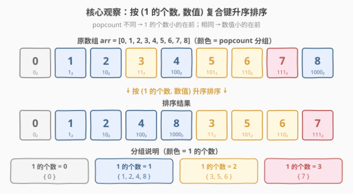
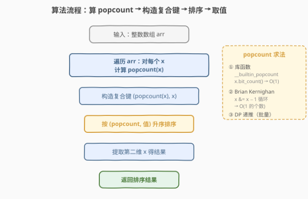
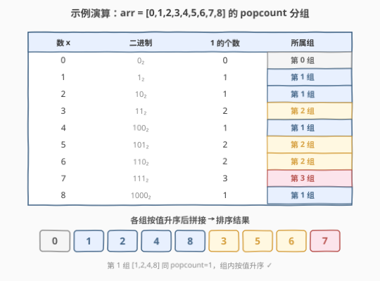

# LeetCode 根据数字二进制下 1 的数目排序 题解

## 1. 题目概述

- **标题 / 题号**：根据数字二进制下 1 的数目排序（#1356，easy）
- **链接**：https://leetcode.cn/problems/sort-integers-by-the-number-of-1-bits/
- **难度**：简单
- **标签**：位运算、排序、计数

**题意**：给你一个整数数组 `arr`。请将数组中的数字按照其二进制表示中 **1 的数目**升序排序；若 1 的数目相同，则按**数字本身**升序排序。返回排序后的数组。

**示例 1**：

```text
输入：arr = [0,1,2,3,4,5,6,7,8]
输出：[0,1,2,4,8,3,5,6,7]
解释：
 0 的二进制为 0₂        ，1 的个数为 0 → 第 0 组
 1,2,4,8 二进制 1₂/10₂/100₂/1000₂，1 的个数为 1 → 第 1 组（组内按值升序）
 3,5,6 二进制 11₂/101₂/110₂       ，1 的个数为 2 → 第 2 组（组内按值升序）
 7 的二进制为 111₂       ，1 的个数为 3 → 第 3 组
 各组按值升序后拼接 → [0, 1, 2, 4, 8, 3, 5, 6, 7]
```

**示例 2**：

```text
输入：arr = [1024,512,256,128,64,32,16,8,4,2,1]
输出：[1,2,4,8,16,32,64,128,256,512,1024]
解释：所有数都是 2 的幂，1 的个数均为 1，故直接按值升序。
```

**示例 3**：

```text
输入：arr = [10000,10000]
输出：[10000,10000]
```

**约束**：

- $1 \le \text{arr.length} \le 500$
- $0 \le \text{arr}[i] \le 10^4$

> 💡 本题本质是「**自定义排序键**」：把每个数映射为二元组 $(\text{popcount}(x), x)$，按字典序升序。难点不在排序，而在高效计算 1 的个数（popcount）；值域小（$\le 10^4$）还隐藏着线性预处理 + 桶排序的进阶解法。

## 2. 解题思路

### 2.1 暴力思路：每个数单独数 1 + 排序

最直白的做法：对每个 `x` 用循环数其二进制 1 的个数（反复 `x &= x - 1` 清最低位 1，直到为 0），把 `(popcount, x)` 存下来，再排序取 `x`。

- **正确但计数可优化**：单个数 popcount 需 $O(\text{1 的个数})$，整体 $O(n \log V)$（$V$ 为值域）；对 $n \le 500$、$V \le 10^4$ 完全够用，但没利用「值域小」的特点。
- **排序 $O(n \log n)$**：比较排序无法省，但计数可以——用库函数把单次查询降到 $O(1)$，或用 DP 把整张值域表一次性预处理。

> ⚠️ 数 1 的方法很多，本题重点是选对工具：单点查询用 `__builtin_popcount` / `x.bit_count()` 即可；批量预处理整张值域表则用 DP 递推（见 2.2 / 第 5 节）。

### 2.2 核心观察：复合排序键 (popcount, 值)



关键洞察：

- **排序键 = $(\text{popcount}(x), x)$**：题目要求「先按 1 的个数升序，相同则按数值升序」，这恰好是二元组的**字典序**。把比较规则编码进复合键，无需手写比较器，直接 `sorted(arr, key=lambda x: (x.bit_count(), x))`。
- **popcount 的三种求法**：
  1. **库函数**：C++ `__builtin_popcount(x)`、Python `x.bit_count()`、Java `Integer.bitCount(x)`——单指令级，最快；
  2. **Brian Kernighan**：`while x: x &= x - 1; cnt += 1`，每次消去最低位 1，循环次数 = 1 的个数，适合手写；
  3. **DP 递推**（批量）：$\text{cnt}[i] = \text{cnt}[i \gg 1] + (i \mathbin{\&} 1)$，即「右移一位的计数 + 当前最低位」——$O(V)$ 一次性预处理整张值域表，承接 [338. 比特位计数](../0301-0400/338_比特位计数.md)。

> 💡 DP 递推的正确性：$i \gg 1$ 去掉最低位，其 popcount 与 $i$ 仅差最低位 $i \mathbin{\&} 1$。故 `cnt[i] = cnt[i >> 1] + (i & 1)`。边界 `cnt[0] = 0`。这是「**低位贡献 + 高位复用**」的递推范式，与 [70. 爬楼梯](../0001-0100/70_爬楼梯.md) 的 `dp[i] = dp[i-1] + dp[i-2]` 同构——都是「当前状态由更小状态转移」。

> 以 $i = 6 = 110_2$ 为例：$i \gg 1 = 3 = 11_2$，$\text{cnt}[3] = 2$；$i \mathbin{\&} 1 = 0$；故 $\text{cnt}[6] = 2 + 0 = 2$ ✓（$110_2$ 含两个 1）。

### 2.3 算法流程图



**完整步骤**（复合键排序法）：

1. **计数**：对每个 `x ∈ arr` 计算 `pc = popcount(x)`（库函数或 DP 表查询）；
2. **构造键**：把 `x` 映射为 `(pc, x)`；
3. **排序**：按二元组字典序升序；
4. **取值**：提取各二元组的第二维 `x`，即为答案。

> 💡 Python 的 `sorted` / C++ 的 `std::sort` 默认对 `pair/tuple` 按字典序比较，故 `(pc, x)` 复合键无需自定义比较器——「相等看次要键」由字典序天然保证。这与 [1337. 矩阵中战斗力最弱的 K 行](../1301-1400/1337_矩阵中战斗力最弱的K行.md) 的 `(战斗力, 行号)` 复合键同源。

### 2.4 示例演算

以 `arr = [0,1,2,3,4,5,6,7,8]` 为例：



| 数 $x$ | 二进制 | 1 的个数 | 所属组 |
|--------|--------|----------|--------|
| 0 | $0_2$ | 0 | 第 0 组 |
| 1 | $1_2$ | 1 | 第 1 组 |
| 2 | $10_2$ | 1 | 第 1 组 |
| 3 | $11_2$ | 2 | 第 2 组 |
| 4 | $100_2$ | 1 | 第 1 组 |
| 5 | $101_2$ | 2 | 第 2 组 |
| 6 | $110_2$ | 2 | 第 2 组 |
| 7 | $111_2$ | 3 | 第 3 组 |
| 8 | $1000_2$ | 1 | 第 1 组 |

各组按值升序排列后拼接：

| 组 | 1 的个数 | 成员（按值升序） |
|----|----------|------------------|
| 0 | 0 | `[0]` |
| 1 | 1 | `[1, 2, 4, 8]` |
| 2 | 2 | `[3, 5, 6]` |
| 3 | 3 | `[7]` |

拼接得 `[0, 1, 2, 4, 8, 3, 5, 6, 7]`。

> 💡 注意第 1 组 `[1,2,4,8]`：四个数 popcount 同为 1，组内按值升序——这正是「相同看数值」的体现，由复合键 `(pc, x)` 的第二维自动处理。示例 2 中所有数 popcount 均为 1，故整体退化为按值升序。

## 3. 参考代码

### C++

```cpp
// 写法一：库函数 popcount + 复合键排序
#include <vector>
#include <algorithm>
using namespace std;

class Solution {
public:
    vector<int> sortByBits(vector<int>& arr) {
        sort(arr.begin(), arr.end(), [](int a, int b) {
            int ca = __builtin_popcount(a), cb = __builtin_popcount(b);
            if (ca != cb) return ca < cb;   // 先按 1 的个数
            return a < b;                   // 再按数值
        });
        return arr;
    }
};
```

```cpp
// 写法二：DP 预处理 popcount 表 + 复合键排序（值域 ≤ 10^4 时一次预处理）
class Solution {
public:
    vector<int> sortByBits(vector<int>& arr) {
        int mx = *max_element(arr.begin(), arr.end());
        vector<int> cnt(mx + 1, 0);                 // cnt[i] = i 的 popcount
        for (int i = 1; i <= mx; ++i)
            cnt[i] = cnt[i >> 1] + (i & 1);
        sort(arr.begin(), arr.end(), [&](int a, int b) {
            if (cnt[a] != cnt[b]) return cnt[a] < cnt[b];
            return a < b;
        });
        return arr;
    }
};
```

### Python

```python
class Solution:
    def sortByBits(self, arr: list[int]) -> list[int]:
        return sorted(arr, key=lambda x: (x.bit_count(), x))
```

```python
# 写法二：DP 预处理 popcount 表
class Solution:
    def sortByBits(self, arr: list[int]) -> list[int]:
        mx = max(arr)
        cnt = [0] * (mx + 1)
        for i in range(1, mx + 1):
            cnt[i] = cnt[i >> 1] + (i & 1)
        return sorted(arr, key=lambda x: (cnt[x], x))
```

> 💡 **实现细节**：① Python 3.10+ 的 `int.bit_count()` 即 popcount，单行解题；低版本可用 `bin(x).count('1')`。② C++ 用 `__builtin_popcount`（GCC/Clang）或 C++20 `<bit>` 的 `std::popcount`。③ 写法二适合 `arr[i]` 值域小但个数多时反复查 popcount——本题值域 $10^4$、$n \le 500$，DP 表仅 $10^4$ 项，预处理 $O(V)$ 后每次查询 $O(1)$。

## 4. 复杂度分析

| 维度 | 库函数 + 排序（推荐） | DP 预处理 + 排序 | 桶排序（第 5 节） |
|------|----------------------|------------------|-------------------|
| 时间复杂度 | $O(n \log n + n \log V)$ | $O(V + n \log n)$ | $O(V + n)$ |
| 空间复杂度 | $O(\log n)$（排序栈） | $O(V)$（popcount 表） | $O(V + n)$ |
| 适用场景 | 通用，$n$ 任意 | 值域 $V$ 小、查询多 | 追求线性、$V$ 小 |

- **库函数法**：排序 $O(n \log n)$ 主导；`__builtin_popcount` 为单指令，查询 $O(1)$。$n \le 500$ 时毫秒级。
- **DP 预处理**：建表 $O(V)$，$V \le 10^4$ 极小；之后查询 $O(1)$，排序仍 $O(n \log n)$。优势在「值域小但 $n$ 大」时省去重复 popcount 计算。
- **$V$** 指 $\max(\text{arr})$，本题 $\le 10^4$，二进制至多 14 位。

> ⚠️ $O(n \log V)$ 的来源：若用手写 Brian Kernighan 数 1，单个数需 $O(\text{1 的个数}) \le O(\log V)$ 步，$n$ 个数合计 $O(n \log V)$。库函数与 DP 表把这个 $O(\log V)$ 摊到 $O(1)$。

## 5. 扩展：线性时间——popcount 表 + 桶排序

题目 follow-up 问能否 $O(n)$ / 原地 $O(1)$ 额外空间。利用「值域 $V \le 10^4$」极小，可做到**线性时间**（不计输出）：

1. **DP 预处理 popcount 表**：`cnt[i] = cnt[i>>1] + (i&1)`，$O(V)$；
2. **统计 `arr` 中各值出现次数**：`freq[v]`，$O(n)$；
3. **按 popcount 分桶 + 桶内天然有序**：遍历值域 $v$ 从 $0$ 到 $V$ **升序**，若 `freq[v] > 0` 则把 $v$ 连同重复次数加入 `bucket[cnt[v]]`——由于 $v$ 递增，每个桶内天然按值升序，**无需再排**；
4. **按 $p = 0, 1, \dots$ 依次倒出**各桶，即得答案。

```python
class Solution:
    def sortByBits(self, arr: list[int]) -> list[int]:
        mx = max(arr)
        cnt = [0] * (mx + 1)
        for i in range(1, mx + 1):
            cnt[i] = cnt[i >> 1] + (i & 1)
        freq = [0] * (mx + 1)
        for x in arr:
            freq[x] += 1
        P = mx.bit_length() + 1               # popcount 至多 bit_length(mx)
        buckets = [[] for _ in range(P)]
        for v in range(mx + 1):               # v 升序 → 桶内天然按值升序
            if freq[v]:
                buckets[cnt[v]].extend([v] * freq[v])
        res = []
        for b in buckets:                     # 按 popcount 升序倒出
            res.extend(b)
        return res
```

> 💡 这是「**值域小用桶，值域大用比较排序**」的选型判据：$V \le 10^4$ 时 $O(V)$ 表 + 桶排总开销 $\approx 10^4$，在 $n$ 大时远小于 $O(n \log n)$。代价是 $O(V)$ 额外空间。与 [1365. 有多少小于当前数字的数字](https://leetcode.cn/problems/how-many-numbers-are-smaller-than-the-current-number/) 的值域前缀和、[1337. 矩阵中战斗力最弱的 K 行](../1301-1400/1337_矩阵中战斗力最弱的K行.md) 的「按战斗力分桶」同源——值域小就别用比较，用计数/分桶。

> ⚠️ 严格原位 $O(1)$ 额外空间较难（需在原数组上操作），一般面试到「线性时间 + $O(V)$ 空间」已足够。若一定要原位，可改造为「按 popcount 做稳定分区」但实现复杂，性价比低。

## 6. 面试要点

1. **如何把「先按 A 后按 B」的排序规则落到代码？**

   > 编码为复合键 `(A, B)`，依赖语言默认的字典序比较。Python 用 `key=lambda x: (A(x), B(x))`；C++ 用 `pair` 或 lambda 比较器先比 A 再比 B。避免在比较器里写嵌套 `if` 也能达成，但复合键更简洁、不易错。这是「**把比较规则编码进排序键**」的通用技巧，与 1337 的 `(战斗力, 行号)` 同源。

2. **popcount 有哪些求法？各自复杂度？**

   > ① 库函数 `__builtin_popcount` / `bit_count`——CPU 单指令（POPCNT），$O(1)$；② Brian Kernighan `x &= x-1` 循环——$O(\text{1 的个数}) \le O(\log V)$；③ DP 递推 `cnt[i]=cnt[i>>1]+(i&1)`——$O(V)$ 预处理，$O(1)$ 查询。单点查询用 ①/②，批量查询用 ③。

3. **DP 递推 `cnt[i] = cnt[i>>1] + (i&1)` 为什么对？**

   > $i \gg 1$ 把 $i$ 右移一位（去掉最低位），其 popcount 与 $i$ 相比只差被去掉的那一位。被去掉的位是 $i$ 的最低位，值为 $i \mathbin{\&} 1$。故 `cnt[i] = cnt[i>>1] + (i&1)`。边界 `cnt[0]=0`。这是 [338. 比特位计数](../0301-0400/338_比特位计数.md) 的核心递推。

4. **何时值得用 DP 预处理 + 桶排序而非直接 `sorted`？**

   > 当值域 $V$ 小（如 $\le 10^5$）且 $n$ 很大时，DP 表 $O(V)$ + 桶排 $O(n)$ 优于比较排序 $O(n \log n)$。本题 $V \le 10^4$、$n \le 500$，两者皆可，`sorted` 更简洁；桶排的价值在体现「值域小用计数」的选型思维，是面试加分点。

5. **示例 2 为何所有数 popcount 都是 1？**

   > 示例 2 全是 2 的幂（$1,2,4,\dots,1024$），二进制形如 $10\dots0_2$，恰一个 1。故 popcount 全为 1，排序退化为按值升序。这与 [231. 2 的幂](../0201-0300/231_2的幂.md) 的判定 `n & (n-1) == 0`（单 1）呼应——2 的幂 popcount 恒为 1。

> 💡 **一句话总结**：1356 的灵魂是「**复合排序键 $(\text{popcount}, x)$**」——把「先按 1 的个数、再按数值」编码进二元组字典序；popcount 用库函数或 DP 递推 `cnt[i]=cnt[i>>1]+(i&1)`，值域小时可进一步用桶排序做到线性。

## 同类练习题

| # | 题目 | 与本题的关联 |
|---|------|-------------|
| 338 | [比特位计数](https://leetcode.cn/problems/counting-bits/)（[题解](../0301-0400/338_比特位计数.md)） | DP 递推 `cnt[i]=cnt[i>>1]+(i&1)` 批量预处理 0~n 的 popcount，正是本题写法二 / 第 5 节的预处理模板 |
| 191 | [位 1 的个数](https://leetcode.cn/problems/number-of-1-bits/)（[题解](../0001-0100/191_位1的个数.md)） | 用 `n & (n-1)` 消最低位 1 数 1，本题单点 popcount 的手写解法 |
| 231 | [2 的幂](https://leetcode.cn/problems/power-of-two/)（[题解](../0201-0300/231_2的幂.md)） | `n & (n-1) == 0` 判单 1，呼应示例 2「2 的幂 popcount 恒为 1」 |
| 1337 | [矩阵中战斗力最弱的 K 行](https://leetcode.cn/problems/the-k-weakest-rows-in-a-matrix/)（[题解](../1301-1400/1337_矩阵中战斗力最弱的K行.md)） | `(战斗力, 行号)` 复合键排序 + 值域小用桶，与本题「复合键 + popcount + 桶排」三件套完全同源 |
| 1365 | [有多少小于当前数字的数字](https://leetcode.cn/problems/how-many-numbers-are-smaller-than-the-current-number/) | 值域小用计数/前缀和替代比较排序，巩固「值域小用桶，值域大用比较」的选型判据 |
| 179 | [最大数](https://leetcode.cn/problems/largest-number/)（[题解](../0101-0200/179_最大数.md)） | 自定义比较函数的经典题，对照本题「复合键」与 179「拼接字符串比较」两种比较器设计思路 |
