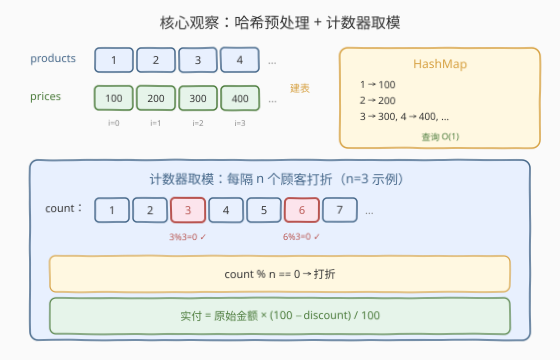
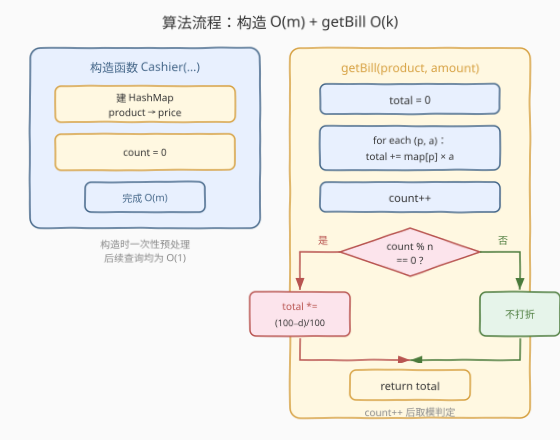
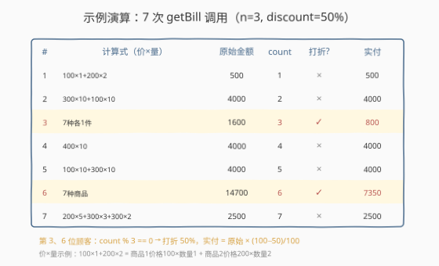

# 每隔 n 个顾客打折

- **题目名称**：每隔 n 个顾客打折
- **链接**：[1357. 每隔 n 个顾客打折](https://leetcode.cn/problems/apply-discount-every-n-orders/)
- **难度**：中等
- **标签**：设计、哈希表、模拟

## 1. 题目概述

超市里正在举行打折活动，每隔 `n` 个顾客会得到 `discount` 的折扣。超市有若干商品，第 `i` 种商品为 `products[i]`，每件单品的价格为 `prices[i]`。

结账系统会统计顾客数目，每隔 `n` 个顾客结账时，该顾客的账单打折，折扣为 `discount`（即原本账单为 $x$，实际金额变成 $x - \text{discount} \times x / 100$），然后系统重新开始计数。

请实现 `Cashier` 类：

- `Cashier(int n, int discount, int[] products, int[] prices)`：初始化实例，参数为打折频率 `n`、折扣大小 `discount`、商品列表 `products` 和价格 `prices`。
- `double getBill(int[] product, int[] amount)`：返回账单实际金额（若有打折则返回打折后结果）。返回结果与标准答案误差在 $10^{-5}$ 以内视为正确。

**示例 1**：

```text
输入：
["Cashier","getBill","getBill","getBill","getBill","getBill","getBill","getBill"]
[[3,50,[1,2,3,4,5,6,7],[100,200,300,400,300,200,100]],
 [[1,2],[1,2]],[[3,7],[10,10]],[[1,2,3,4,5,6,7],[1,1,1,1,1,1,1]],
 [[4],[10]],[[7,3],[10,10]],[[7,5,3,1,6,4,2],[10,10,10,9,9,9,7]],[[2,3,5],[5,3,2]]]

输出：
[null,500.0,4000.0,800.0,4000.0,4000.0,7350.0,2500.0]

解释：
Cashier cashier = new Cashier(3,50,[1,2,3,4,5,6,7],[100,200,300,400,300,200,100]);
cashier.getBill([1,2],[1,2]);                        // 500.0,  1×100 + 2×200 = 500
cashier.getBill([3,7],[10,10]);                      // 4000.0, 3×300 + 7×100 = 4000
cashier.getBill([1,2,3,4,5,6,7],[1,1,1,1,1,1,1]);    // 800.0,  原始1600，第3位顾客打50%折 → 800
cashier.getBill([4],[10]);                           // 4000.0
cashier.getBill([7,3],[10,10]);                      // 4000.0
cashier.getBill([7,5,3,1,6,4,2],[10,10,10,9,9,9,7]); // 7350.0, 原始14700，第6位顾客打50%折 → 7350
cashier.getBill([2,3,5],[5,3,2]);                    // 2500.0
```

**约束条件**：

- $1 \le n \le 10^4$
- $0 \le \text{discount} \le 100$
- $1 \le \text{products.length} \le 200$
- $1 \le \text{products[i]} \le 200$，`products` 中无重复元素
- $\text{prices.length} = \text{products.length}$，$1 \le \text{prices[i]} \le 1000$
- $1 \le \text{product.length} \le \text{products.length}$，`product[i]` 在 `products` 中出现过
- $\text{amount.length} = \text{product.length}$，$1 \le \text{amount[i]} \le 1000$
- 最多 1000 次 `getBill` 调用
- 返回结果误差在 $10^{-5}$ 以内视为正确

> 💡 本题是一道**模拟 + 设计**题。核心有两个点：① 如何高效查价——直接遍历 `products` 数组找价是 $O(m)$，用哈希表预处理可降到 $O(1)$；② 如何判定打折——用一个自增计数器取模 `n` 即可天然实现「每隔 n 个」的周期判定。

---

## 2. 解题思路

### 2.1 暴力思路：线性查找价格

最直白的做法：构造函数直接保存 `products` 和 `prices` 数组。`getBill` 时，对顾客购买的每件商品 `product[j]`，遍历 `products` 数组找到对应下标 `i`，再取 `prices[i]` 乘以 `amount[j]` 累加。

- 构造：$O(m)$（仅保存引用）
- `getBill`：$O(k \cdot m)$，其中 $k$ = 单次账单商品种类数，$m$ = 商品总数
- 最坏总时间：$O(q \cdot k \cdot m) \approx 1000 \times 200 \times 200 = 4 \times 10^7$，虽不超时但每次调用都重复搜索，效率低下

> ⚠️ 暴力法的问题在于**查询结构未预处理**——`products → price` 的映射关系在构造时就已知，却在每次 `getBill` 中反复线性查找。这是典型的「能用哈希表 $O(1)$ 查询却退化到 $O(m)$ 遍历」的反模式。

### 2.2 核心观察：哈希表预处理 + 计数器取模



**观察一：构造时建哈希表，查价 $O(1)$**

`products` 和 `prices` 是平行数组（同下标对应），构造时遍历一次建立 `HashMap<product_id, price>`，之后 `getBill` 中每件商品的查价只需 $O(1)$：

$$\text{total} = \sum_{j=0}^{k-1} \text{map}[\text{product}[j]] \times \text{amount}[j]$$

- 构造：$O(m)$ 一次建表
- `getBill`：$O(k)$，$k$ 为单次账单商品种类数

**观察二：计数器取模判定打折**

用一个成员变量 `count`（初始为 0），每次 `getBill` 先 `count++`，再判定 `count % n == 0`：

- 第 $n$ 位顾客：`count = n`，$n \bmod n = 0$ → 打折
- 第 $2n$ 位顾客：`count = 2n`，$2n \bmod n = 0$ → 打折
- 其余顾客：`count % n != 0` → 不打折

取模运算天然实现「每隔 $n$ 个」的周期判定，**无需显式重置计数器**——题目说「系统重新开始计数」，但 `count % n` 在数学上等价于周期重置，无需额外操作。

**折扣公式**：若触发打折，实付金额为：

$$\text{final} = \text{total} \times \frac{100 - \text{discount}}{100}$$

用 `double` 存储即可满足 $10^{-5}$ 精度要求。

### 2.3 算法流程图



**构造函数**完整步骤：

1. 遍历 `products` 和 `prices`，建立 `HashMap`：`map[products[i]] = prices[i]`。$O(m)$
2. 初始化 `count = 0`，保存 `n` 和 `discount`。

**getBill**完整步骤：

1. `total = 0`
2. 遍历 `(product[j], amount[j])`：`total += map[product[j]] * amount[j]`。$O(k)$
3. `count++`
4. 若 `count % n == 0`：`total *= (100 - discount) / 100.0`
5. 返回 `total`

> 💡 **实现细节**：① 建表用 `zip(products, prices)` 一次完成，简洁高效。② `count` 从 0 开始，先自增再取模，保证第 1 位顾客 `count=1`（$1 \bmod n \ne 0$），第 $n$ 位顾客 `count=n`（$n \bmod n = 0$）。③ 折扣乘以 `(100 - discount) / 100.0`，注意用浮点除法 `100.0` 避免整数除法截断。

### 2.4 示例演算

以官方示例为例（$n=3$，$\text{discount}=50$），逐步追踪 7 次 `getBill` 调用：



| # | 计算式（价×量） | 原始金额 | count | count%3 | 打折 | 实付 |
|---|----------------|---------|-------|---------|------|------|
| 1 | $100 \times 1 + 200 \times 2$ | 500 | 1 | 1 | × | 500 |
| 2 | $300 \times 10 + 100 \times 10$ | 4000 | 2 | 2 | × | 4000 |
| 3 | 7 种各 1 件 | 1600 | 3 | 0 | ✓ | 800 |
| 4 | $400 \times 10$ | 4000 | 4 | 1 | × | 4000 |
| 5 | $100 \times 10 + 300 \times 10$ | 4000 | 5 | 2 | × | 4000 |
| 6 | 7 种商品 | 14700 | 6 | 0 | ✓ | 7350 |
| 7 | $200 \times 5 + 300 \times 3 + 300 \times 2$ | 2500 | 7 | 1 | × | 2500 |

> 💡 注意第 3 位顾客：原始金额 $100+200+300+400+300+200+100 = 1600$，`count=3`，$3 \bmod 3 = 0$ 触发打折，$1600 \times 50 / 100 = 800$。第 6 位顾客：原始金额 $14700$，`count=6`，$6 \bmod 3 = 0$ 触发打折，$14700 \times 50 / 100 = 7350$。两次打折后 `count` 继续自增，无需重置。

---

## 3. 参考代码

### C++

```cpp
class Cashier {
    unordered_map<int, int> priceMap; // 商品ID → 价格
    int n, discount;
    int count = 0;                    // 顾客计数器
public:
    Cashier(int n, int discount, vector<int>& products, vector<int>& prices) {
        this->n = n;
        this->discount = discount;
        for (int i = 0; i < (int)products.size(); i++) {
            priceMap[products[i]] = prices[i]; // 建哈希表，O(m)
        }
    }

    double getBill(vector<int> product, vector<int> amount) {
        double total = 0;
        for (int i = 0; i < (int)product.size(); i++) {
            total += priceMap[product[i]] * amount[i]; // O(1) 查价
        }
        count++;
        if (count % n == 0) { // 每隔 n 个顾客打折
            total *= (100 - discount) / 100.0;
        }
        return total;
    }
};
```

### Python

```python
class Cashier:

    def __init__(self, n: int, discount: int, products: List[int], prices: List[int]):
        self.n = n
        self.discount = discount
        self.price_map = {p: pr for p, pr in zip(products, prices)}  # 建哈希表，O(m)
        self.count = 0

    def getBill(self, product: List[int], amount: List[int]) -> float:
        total = 0.0
        for p, a in zip(product, amount):
            total += self.price_map[p] * a  # O(1) 查价
        self.count += 1
        if self.count % self.n == 0:  # 每隔 n 个顾客打折
            total *= (100 - self.discount) / 100.0
        return total
```

> 💡 **实现细节**：① 建表用字典推导式 `{p: pr for p, pr in zip(products, prices)}` 一行完成。② `count` 从 0 开始，先 `+= 1` 再取模，保证第 1 位顾客不触发、第 $n$ 位顾客触发。③ 折扣乘以 `(100 - discount) / 100.0`，用浮点除法避免整数截断（Python 3 中 `/` 本身是浮点除法，C++ 需写 `100.0`）。④ 返回 `double` / `float`，精度满足 $10^{-5}$。

---

## 4. 复杂度分析

| 维度 | 复杂度 | 说明 |
|------|--------|------|
| 构造时间 | $O(m)$ | 遍历 `products` 和 `prices` 建哈希表，$m$ 为商品总数 |
| `getBill` 时间 | $O(k)$ | $k$ 为单次账单商品种类数，每件 $O(1)$ 哈希查价 + $O(1)$ 计数取模 |
| 总时间 | $O(m + q \cdot k)$ | $q$ 为 `getBill` 调用次数，预处理一次 + 每次线性遍历账单 |
| 空间 | $O(m)$ | 哈希表存储 $m$ 个商品的价格映射 |

> ⚠️ 对比暴力法 $O(q \cdot k \cdot m)$，哈希预处理将总时间从 $O(q \cdot k \cdot m)$ 降到 $O(m + q \cdot k)$。本题数据规模下暴力也能过（$4 \times 10^7$ 在现代 CPU 上约 0.1 秒），但哈希预处理是设计题的**标准范式**——构造时做重活，查询时尽量轻量。

---

## 5. 扩展：数组替代哈希表与动态商品

**数组替代哈希表**：题目约束 $\text{products[i]} \in [1, 200]$，值域小且稠密。可以用一个大小 201 的数组 `int price[201]` 代替 `HashMap`，以商品 ID 为下标直接索引：

```cpp
int price[201] = {};
for (int i = 0; i < products.size(); i++)
    price[products[i]] = prices[i];
// 查询：price[product[j]]
```

同样是 $O(1)$ 查询，但常数更小（无哈希计算和冲突处理），且内存连续缓存友好。这是「值域小且稠密时数组优于哈希表」的经典场景。

**动态商品**：若题目扩展为运行时可以添加或修改商品价格，只需增加一个 `addProduct(int product, int price)` 方法，在哈希表中 `map[product] = price` 即可。`getBill` 逻辑完全不变。哈希表天然支持动态增删，这是它相比「构造时固定数组」的灵活性优势——数组方案在商品 ID 超出预设范围时需要扩容或改用哈希。

**浮点精度**：原始金额是整数（`prices` 和 `amounts` 均为整数），唯一的小数来源是折扣除法。`double` 有约 15-16 位有效数字，远超 $10^{-5}$ 精度要求。极端情况如 $\text{discount} = 33$、$\text{total} = 100$ 时结果为 $67.0$，仍为精确表示。若题目要求更高精度，可用 `BigDecimal`（Java）或 `decimal.Decimal`（Python）。

> 💡 **一句话总结**：构造时建哈希表把查价降到 $O(1)$，计数器取模天然实现「每隔 $n$ 个打折」的周期判定——无需重置，`count % n == 0` 即可。

---

## 6. 面试要点

1. **为什么用哈希表而不是直接遍历 `products` 数组查找价格？**

   > 构造时建一次哈希表 $O(m)$，之后每次 `getBill` 查价 $O(1)$。若每次遍历 `products`，单件查价 $O(m)$，$k$ 件商品 $O(k \cdot m)$，1000 次调用最坏 $4 \times 10^7$ 次比较。哈希表把总复杂度从 $O(q \cdot k \cdot m)$ 降到 $O(m + q \cdot k)$，是设计题「构造时预处理、查询时 $O(1)$」的标准范式。

2. **`count % n == 0` 为什么能正确实现「每隔 n 个顾客打折」？不需要重置吗？**

   > `count` 从 0 开始，每次 `getBill` 先 `count++`。第 $n$ 位顾客 `count=n`，$n \bmod n = 0$ 触发打折；第 $2n$ 位顾客 `count=2n`，$2n \bmod n = 0$ 再次触发。取模运算的周期性天然等价于「计数到 $n$ 后重置」，数学上 `count % n` 的周期就是 $n$，无需显式重置。

3. **折扣公式 `total * (100 - discount) / 100` 有精度问题吗？**

   > 原始金额是整数，折扣后可能产生小数（如 `discount=33` 时出现 $0.67$ 的因子）。用 `double` 存储并返回，`double` 有约 15-16 位有效数字，远超题目要求的 $10^{-5}$ 精度。注意 C++ 中除法至少一个操作数是浮点（`100.0`），否则整数除法会截断。

4. **题目说 `products[i] ≤ 200`，能否用数组代替哈希表？**

   > 可以。用 `int price[201]`，以商品 ID 为下标直接索引，同样 $O(1)$ 但常数更小（无哈希计算、内存连续缓存友好）。这是值域小且稠密时数组优于哈希表的经典场景。若商品 ID 范围很大或稀疏，则哈希表更优。

5. **如果 `n` 非常大（比如 $10^4$），计数器会溢出吗？**

   > 不会。最多 1000 次 `getBill` 调用，`count` 最大 $1000$，远小于 `int` 上界 $2^{31}-1 \approx 2.1 \times 10^9$。即使调用次数达到 $10^9$，`int` 仍够用。若调用次数无上限，可用 `long long` 防溢出，取模运算对大数同样有效。

---

## 7. 同类练习题

- [1352. 最后 K 个数的乘积](https://leetcode.cn/problems/product-of-the-last-k-numbers/)（[题解](../1301-1400/1352_最后K个数的乘积.md)）：同为设计题，构造时预处理（前缀乘积）把查询降到 $O(1)$，对照「预处理 + $O(1)$ 查询」的通用范式
- [981. 基于时间的键值存储](https://leetcode.cn/problems/time-based-key-value-store/)（[题解](../0901-1000/981_基于时间的键值存储.md)）：HashMap + 有序数组预处理，对照不同查询结构（哈希 vs 二分）的选型
- [528. 按权重随机选择](https://leetcode.cn/problems/random-pick-with-weight/)（[题解](../0501-0600/528_按权重随机选择.md)）：构造时建前缀和数组，查询时二分，对照「预处理 + $O(\log n)$ 查询」的设计模式
- [232. 用栈实现队列](https://leetcode.cn/problems/implement-queue-using-stacks/)（[题解](../0201-0300/232_用栈实现队列.md)）：经典设计题，构造时初始化数据结构，对照不同数据结构组合的设计思路
