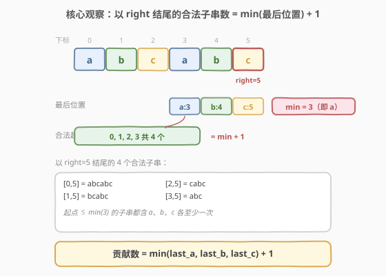
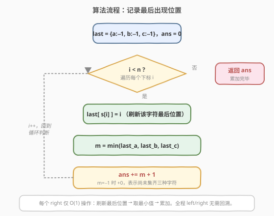
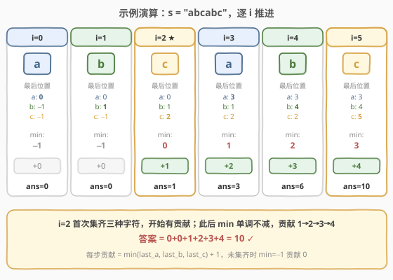

# 包含所有三种字符的子字符串数目

- **题目名称**：包含所有三种字符的子字符串数目
- **链接**：[1358. 包含所有三种字符的子字符串数目](https://leetcode.cn/problems/number-of-substrings-containing-all-three-characters/)
- **难度**：中等
- **标签**：字符串、滑动窗口、双指针

## 1. 题目概述

给你一个字符串 `s`，它只包含三种字符 `a`、`b` 和 `c`。请你返回 `a`、`b`、`c` 都**至少**出现过一次的子字符串数目。

**示例 1**：

```text
输入：s = "abcabc"
输出：10
解释：包含 a、b、c 各至少一次的子字符串为 "abc"、"abca"、"abcab"、"abcabc"、
      "bca"、"bcab"、"bcabc"、"cab"、"cabc" 和 "abc"（相同字符串算多次）。
```

**示例 2**：

```text
输入：s = "aaacb"
输出：3
解释：包含 a、b、c 各至少一次的子字符串为 "aaacb"、"aacb" 和 "acb"。
```

**示例 3**：

```text
输入：s = "abc"
输出：1
```

**约束条件**：

- `3 <= s.length <= 5 * 10^4`
- `s` 只包含字符 `'a'`、`'b'` 和 `'c'`

> 💡 **只关心"是否齐全"，不关心数量**：题目只问子串里 `a/b/c` 是否各至少出现一次，多余出现完全无所谓。这决定了只需跟踪每种字符"最近一次出现在哪"，而不必精确计数。

---

## 2. 解题思路

### 2.1 暴力思路

枚举所有子串 `[i, j]`，逐个统计是否同时含 `a`、`b`、`c`。两重循环 + 检查共 `O(n^2)`（检查可滚动累成 `O(1)`，但枚举仍是 `O(n^2)`），在 `n = 5 * 10^4` 时约 `2.5 * 10^9` 量级，超时。

### 2.2 核心观察：以每个 right 结尾的合法子串数 = min(最后位置) + 1



**固定右端点 `right`**，问：以 `right` 结尾的子串里，有多少个含 `a`、`b`、`c` 各至少一次？

设 `last_a`、`last_b`、`last_c` 分别是 `a`、`b`、`c` 在 `≤ right` 范围内**最后一次出现的下标**。那么：

- 子串 `[left, right]` 含全部三种字符 $\iff$ `left ≤ min(last_a, last_b, last_c)`。
  - 因为 `left` 只要不超过三个"最后位置"中的最小值，就一定能把 `a`、`b`、`c` 的最后一次出现都包进窗口。
- 反之，`left = min + 1` 时，恰好把那个"最晚才凑齐的字符"的最后一次出现排除在外，子串就缺一种字符。

因此以 `right` 结尾的合法子串数为：

$$
\text{贡献} = \min(\text{last}_a, \text{last}_b, \text{last}_c) + 1
$$

> ⚠️ **初始值用 −1**：尚未出现过的字符，`last` 设为 `−1`。此时 `min = −1`，贡献 `−1 + 1 = 0`，自然表示"还没集齐三种字符，没有合法子串"。无需特判。

> 💡 **与 [1248. 统计优美子数组](../1201-1300/1248_统计优美子数组.md) 的对照**：1248 求"恰好 K 个"难以直接滑窗，需转化为 `atMost(K) − atMost(K−1)`；本题是"**至少各一个**"，属于单调条件——窗口越左扩越容易满足，因此能直接求，无需做差。

### 2.3 算法流程图



整体只有一重循环，每个 `right` 做 `O(1)` 工作：刷新该字符最后位置 → 取三者最小值 → 累加 `min + 1`。

> 也可写成**滑动窗口**形式：维护窗口 `[left, right]`，当窗口内 `a/b/c` 都出现时不断收缩 `left`，直到刚好不满足；此时 `[0, left-1]` 作为起点都合法，贡献即为 `left`。这与"最后位置"法等价——收缩停止时 `left` 恰好等于 $\min(\text{last}_a, \text{last}_b, \text{last}_c) + 1$。

### 2.4 示例演算

以 `s = "abcabc"` 为例，逐 `i` 推进：



| i | s[i] | last_a | last_b | last_c | min | 贡献 | ans |
|---|------|--------|--------|--------|-----|------|-----|
| 0 | a    | 0      | −1     | −1     | −1  | +0   | 0   |
| 1 | b    | 0      | 1      | −1     | −1  | +0   | 0   |
| 2 | c    | 0      | 1      | 2      | 0   | +1   | 1   |
| 3 | a    | 3      | 1      | 2      | 1   | +2   | 3   |
| 4 | b    | 3      | 4      | 2      | 2   | +3   | 6   |
| 5 | c    | 3      | 4      | 5      | 3   | +4   | 10  |

> 💡 `i=2` 首次集齐三种字符，开始有贡献；此后随着 `right` 右移，`min` 只增不减，贡献 `1→2→3→4` 累加。最终答案 $0+0+1+2+3+4 = 10$，与示例一致。

---

## 3. 参考代码

### 方法一：记录最后出现位置

#### C++

```cpp
class Solution {
  public:
    int numberOfSubstrings(string s) {
        int last[3] = {-1, -1, -1};
        int ans = 0;
        for (int i = 0; i < s.size(); i++) {
            last[s[i] - 'a'] = i;
            ans += min({last[0], last[1], last[2]}) + 1;
        }
        return ans;
    }
};
```

#### Python

```python
class Solution:
    def numberOfSubstrings(self, s: str) -> int:
        last = {'a': -1, 'b': -1, 'c': -1}
        ans = 0
        for i, ch in enumerate(s):
            last[ch] = i
            ans += min(last.values()) + 1
        return ans
```

### 方法二：滑动窗口

#### C++

```cpp
class Solution {
  public:
    int numberOfSubstrings(string s) {
        int cnt[3] = {0, 0, 0};
        int left = 0, ans = 0;
        for (int right = 0; right < s.size(); right++) {
            cnt[s[right] - 'a']++;
            while (cnt[0] > 0 && cnt[1] > 0 && cnt[2] > 0) {
                cnt[s[left] - 'a']--;
                left++;
            }
            ans += left;
        }
        return ans;
    }
};
```

#### Python

```python
class Solution:
    def numberOfSubstrings(self, s: str) -> int:
        cnt = [0, 0, 0]
        left = ans = 0
        for right, ch in enumerate(s):
            cnt[ord(ch) - 97] += 1
            while cnt[0] > 0 and cnt[1] > 0 and cnt[2] > 0:
                cnt[ord(s[left]) - 97] -= 1
                left += 1
            ans += left
        return ans
```

> ⚠️ **方法二的 `ans += left` 不要写成 `left + 1`**：`while` 循环收缩到"刚好不满足"才退出，此时 `[left, right]` 已缺一种字符，合法起点是 `0 .. left-1`，共 `left` 个。这与方法一的 `min + 1` 数值相等（`left = min(last) + 1`）。

---

## 4. 复杂度分析

| 方法 | 时间复杂度 | 空间复杂度 | 说明 |
|------|-----------|-----------|------|
| 记录最后出现位置 | `O(n)` | `O(1)` | 一次遍历，仅维护 3 个下标 |
| 滑动窗口 | `O(n)` | `O(1)` | `left`/`right` 各至多遍历一次，计数数组大小恒为 3 |

> 💡 两种方法同为 `O(n)` / `O(1)`。方法一代码更短、无需内层 `while`，面试推荐先写方法一；方法二更具迁移性，能套到"覆盖型"滑窗的通用模板上。

---

## 5. 扩展：两种方法的等价性与推广

**等价性**。方法二收缩停止时，`left` 指向"使窗口刚好缺一种字符的最小下标"，即 `left = min(last_a, last_b, last_c) + 1`。因此 `ans += left` 与方法一的 `ans += min(last) + 1` 完全一致——两者只是同一不变量的两种表达。

**推广到 k 种字符**。若题目改为"含 `k` 种指定字符各至少一次"：

- 方法一：维护 `k` 个最后位置，每步取最小值，`O(n·k)`（取 min 可用堆优化到 `O(n log k)`）。
- 方法二：维护 `k` 个计数与"已集齐种类数"，窗口收缩条件改为"已集齐 `k` 种"，仍是 `O(n)`。

> 当字符集很小（如本题 `k = 3`）时，方法一用定长数组即可，常数极小；当 `k` 较大时方法二的"种类数"计数更稳妥。

---

## 6. 面试要点

1. **为什么"以 right 结尾的合法子串数 = min(最后位置) + 1"？**

   - `left ≤ min(last_a, last_b, last_c)` 时，三种字符的最后一次出现都在 `[left, right]` 内，子串合法；`left` 一旦越过该 `min`，就排除了那个"最后位置最小的字符"，子串立刻缺一种。合法起点恰为 `0 .. min`，共 `min + 1` 个。

2. **`last` 初始值为什么用 −1？**

   - 用 `−1` 表示"尚未出现"。未集齐时 `min = −1`，`min + 1 = 0` 自动给出零贡献，避免特判。若用 `0` 作初值会和真实下标 `0` 混淆，导致首字符误判。

3. **本题与 [1248. 统计优美子数组](../1201-1300/1248_统计优美子数组.md) 的关键区别？**

   - 1248 是"**恰好 K 个**"，不满足单调性（窗口满足时既可扩也可缩），需用 `atMost(K) − atMost(K−1)` 做差；本题是"**至少各一个**"，是单调条件（窗口越左扩越满足），可直接对每个 `right` 求贡献，无需做差。

4. **方法二的 `while` 会不会让总复杂度退化到 `O(n^2)`？**

   - 不会。`left` 全程只增不减，累计右移不超过 `n` 次；`right` 也遍历 `n` 次。两者摊还后总移动 `O(n)`，与 [3. 无重复字符的最长子串](../0001-0100/3_无重复字符的最长子串.md) 同属同向双指针。

5. **如果字符串含超过三种字符（如全字母表）会怎样？**

   - "最后位置"法需为每个目标字符维护下标，目标字符多时改用方法二 + 种类计数更通用；若问"至少含全部出现过的字符"，则退化为类似 [76. 最小覆盖子串](https://leetcode.cn/problems/minimum-window-substring/) 的覆盖型滑窗。

---

## 7. 同类练习题

- [1248. 统计「优美子数组」](https://leetcode.cn/problems/count-number-of-nice-subarrays/)（[题解](../1201-1300/1248_统计优美子数组.md)）：对照"恰好 K"需 `atMost` 做差，而本题"至少"可直接求
- [76. 最小覆盖子串](https://leetcode.cn/problems/minimum-window-substring/)：同为"覆盖全部所需字符"的滑窗，求最短长度而非计数
- [992. K 个不同整数的子数组](https://leetcode.cn/problems/subarrays-with-k-different-integers/)：「至多 K」技巧的另一种应用，把"最后位置"换成"种类数"
- [3. 无重复字符的最长子串](https://leetcode.cn/problems/longest-substring-without-repeating-characters/)（[题解](../0001-0100/3_无重复字符的最长子串.md)）：同向双指针 + 哈希记录位置的母题
- [713. 乘积小于 K 的子数组](https://leetcode.cn/problems/subarray-product-less-than-k/)（[题解](../0701-0800/713_乘积小于K的子数组.md)）：同为"以 right 结尾合法子串数 = right − left + 1"的滑窗计数
