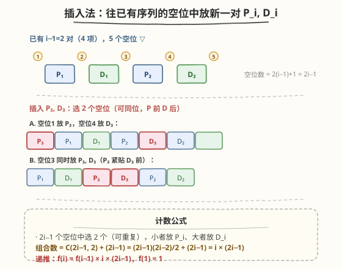
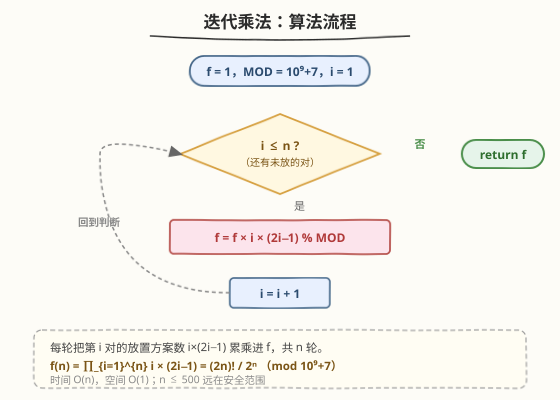
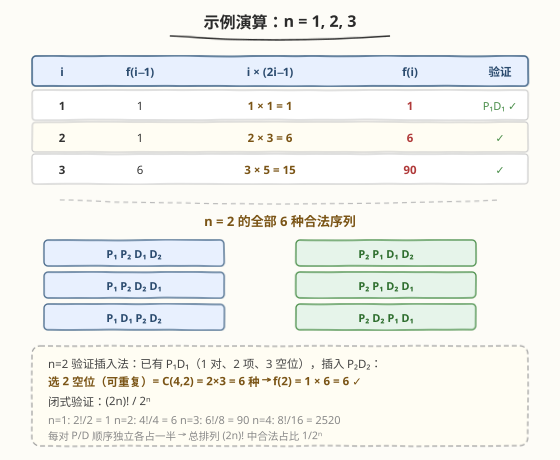

# LeetCode 有效快递配送数目 题解

## 1. 题目概述

- **标题 / 题号**：有效快递配送数目（#1359，hard）
- **链接**：https://leetcode.cn/problems/count-all-valid-pickup-and-delivery-options/
- **难度**：困难
- **标签**：数学、组合计数、动态规划、乘法递推

**题意**：给定 `n` 个订单，每个订单包含一次取货（Pickup）和一次送货（Delivery）服务。将所有 $2n$ 个事件排成一列，要求**对每个订单，取货必须排在送货之前**。问共有多少种合法排列，答案对 $10^9 + 7$ 取模。

**示例 1**：

```text
输入：n = 1
输出：1
解释：只有一种排列 [P₁, D₁]
```

**示例 2**：

```text
输入：n = 2
输出：6
解释：所有合法排列如下：
[P₁,P₂,D₁,D₂]、[P₁,P₂,D₂,D₁]、[P₁,D₁,P₂,D₂]
[P₂,P₁,D₁,D₂]、[P₂,P₁,D₂,D₁]、[P₂,D₂,P₁,D₁]
```

**示例 3**：

```text
输入：n = 3
输出：90
```

**约束**：

- $1 \le n \le 500$

> ⚠️ 注意三点：① $2n$ 个事件互不相同，是排列而非组合；② 唯一约束是「每对内部 P 在 D 前」，对与对之间没有先后限制；③ $n$ 可达 $500$，最终答案极大，必须全程取模。

## 2. 解题思路

### 2.1 暴力思路：枚举全排列

最直白的做法：生成 $2n$ 个事件的所有 $(2n)!$ 种排列，逐一检查每对是否满足「P 在 D 前」。

问题：

- $(2n)!$ 增长极快：$n=3$ 时 $6! = 720$ 尚可，$n=4$ 时 $8! = 40320$，$n=10$ 时 $20! \approx 2.4 \times 10^{18}$，完全不可行；
- 即使加剪枝回溯，状态空间仍然是指数级。

> 💡 暴力枚举的失败提示我们：这题不该「逐个枚举排列」，而应**从结构上直接计数**。关键观察是——所有约束都是「成对内部」的，对与对之间完全对称，可以用**递推**逐对累乘。

### 2.2 核心观察：插入法 + 乘法递推



**关键思路**：逐对构建序列。假设前 $i-1$ 对已经合法排好（共 $2(i-1)$ 项），现在把第 $i$ 对 $P_i, D_i$ 插入其中。

**空位计数**：$2(i-1)$ 个已排好的项把序列分成 $2(i-1) + 1 = 2i - 1$ 个「空位」（首部、项与项之间、尾部）。

**放置方案**：在 $2i-1$ 个空位中选 2 个放 $P_i$ 和 $D_i$，要求 $P_i$ 在 $D_i$ 前（可放同一空位，此时 $P_i$ 紧贴 $D_i$ 前面）。方案数为：

$$
\underbrace{\binom{2i-1}{2}}_{\text{选两个不同空位}} + \underbrace{(2i-1)}_{\text{选同一空位}} = \frac{(2i-1)(2i-2)}{2} + (2i-1) = i \times (2i-1)
$$

> 💡 **为什么对之间不互相干扰？** 前 $i-1$ 对的内部相对顺序在插入第 $i$ 对后完全不变——新元素只是「挤进」空位，不会打乱已有项的先后。因此前 $i-1$ 对的每一种合法排列都独立地乘以 $i(2i-1)$，递推成立。

**递推公式**：

$$
f(i) = f(i-1) \times i \times (2i-1), \quad f(1) = 1
$$

展开即 $f(n) = \prod_{i=1}^{n} i \times (2i-1)$。

### 2.3 算法流程图



**完整步骤**：

1. 初始化 `f = 1`，`MOD = 10^9 + 7`。
2. 循环 `i` 从 $1$ 到 $n$：
   - `f = f * i * (2*i - 1) % MOD`
3. 返回 `f`。

> 💡 只有一层循环、一次乘法取模，是本题的最优解。$n \le 500$ 远在安全范围内，无溢出风险（C++ 中间用 `long long` 即可）。

### 2.4 示例演算

以 $n = 1, 2, 3$ 为例：



| $i$ | $f(i-1)$ | $i \times (2i-1)$ | $f(i)$ |
|-----|----------|-------------------|--------|
| 1 | 1 | $1 \times 1 = 1$ | 1 |
| 2 | 1 | $2 \times 3 = 6$ | 6 |
| 3 | 6 | $3 \times 5 = 15$ | 90 |

以 $n=2$ 验证插入法：已有 $P_1D_1$（1 对、2 项、3 个空位），插入 $P_2D_2$：选 2 个空位（可重复）$= \binom{4}{2} = 2 \times 3 = 6$ 种，$f(2) = 1 \times 6 = 6$ ✓。

## 3. 参考代码

### C++

```cpp
// 有效快递配送数目.cpp —— 插入法乘法递推
// 编译: g++ -O2 -std=c++17 有效快递配送数目.cpp -o capdo
class Solution {
public:
    int countOrders(int n) {
        const int MOD = 1e9 + 7;
        long long f = 1;
        for (int i = 1; i <= n; i++) {
            f = f * i % MOD * (2 * i - 1) % MOD;
        }
        return (int)f;
    }
};
```

### Python

```python
class Solution:
    def countOrders(self, n: int) -> int:
        MOD = 10**9 + 7
        f = 1
        for i in range(1, n + 1):
            f = f * i * (2 * i - 1) % MOD
        return f
```

> 💡 **实现细节**：① C++ 中 `f * i * (2*i-1)` 三个 `int` 相乘可能溢出，故 `f` 声明为 `long long`，先 `% MOD` 再乘下一项分步取模；② Python 天然大整数无溢出，写法更简洁；③ 也可以从 $i=2$ 开始循环（$f$ 初始化为 $1$ 即 $f(1)$），效果相同。

## 4. 复杂度分析

| 维度 | 插入法递推（推荐） | 二维 DP（见扩展） | 暴力枚举 |
|------|-------------------|-------------------|----------|
| **时间** | $O(n)$ | $O(n^2)$ | $O((2n)! \cdot n)$ |
| **空间** | $O(1)$ | $O(n^2)$（可滚动到 $O(n)$） | $O(n)$ |
| **说明** | 一层循环、一次乘法取模 | 状态 $(p, d)$ 逐格递推 | 枚举全排列 + 检查 |

> 其中 $n \le 500$，插入法仅需 $500$ 次乘法，远在安全范围。二维 DP 的 $250000$ 个状态也能通过，但不如 $O(n)$ 优雅。

## 5. 扩展：闭式公式与二维 DP

### 5.1 闭式公式：$(2n)! \,/\, 2^n$

从组合角度可直接得到闭式：

- $2n$ 个不同事件的全排列数为 $(2n)!$；
- 对每一对 $(P_i, D_i)$，在全排列中恰好**一半**满足 $P_i$ 在 $D_i$ 前（交换 $P_i, D_i$ 是「P前」与「D前」之间的一一对应）；
- $n$ 对的约束互相独立（交换任意子集的 P/D 都是一一对应），故合法占比为 $1/2^n$。

$$
f(n) = \frac{(2n)!}{2^n}
$$

验证：$n=1$: $2!/2 = 1$ ✓；$n=2$: $4!/4 = 6$ ✓；$n=3$: $6!/8 = 90$ ✓。

将闭式拆开：$(2n)!/2^n = \prod_{i=1}^{n} \frac{(2i-1)(2i)}{2} = \prod_{i=1}^{n} i(2i-1)$，正是插入法递推的累乘形式——两种方法殊途同归。

### 5.2 二维 DP：逐位填充

换一种视角：从左到右逐个填 $2n$ 个位置，每步要么放一个新取货，要么放一个待送货。

**状态**：$dp[p][d]$ = 已放 $p$ 个取货、$d$ 个送货时，填完剩余位置的方案数（$d \le p \le n$）。

**转移**：
- 若 $p < n$：放一个新取货，有 $n - p$ 个订单可选 → $(n-p) \times dp[p+1][d]$；
- 若 $d < p$：放一个送货，有 $p - d$ 个「已取未送」订单可选 → $(p-d) \times dp[p][d+1]$。

**基准**：$dp[n][n] = 1$（全部放完）。**答案**：$dp[0][0]$。

```python
class Solution:
    def countOrders(self, n: int) -> int:
        MOD = 10**9 + 7
        dp = [[0] * (n + 1) for _ in range(n + 1)]
        dp[n][n] = 1
        for p in range(n, -1, -1):
            for d in range(n, -1, -1):
                if p == n and d == n:
                    continue
                if p < n:
                    dp[p][d] = (dp[p][d] + (n - p) * dp[p + 1][d]) % MOD
                if d < p:
                    dp[p][d] = (dp[p][d] + (p - d) * dp[p][d + 1]) % MOD
        return dp[0][0]
```

> 💡 这个 $O(n^2)$ DP 把「选哪一对」的乘法因子拆进了状态转移，本质上与插入法等价：把 $i(2i-1)$ 拆成「$n-p$ 个取货选择」和「$p-d$ 个送货选择」分步累乘。插入法是对这个过程做了闭式合并，直接得到 $O(n)$。

## 6. 面试要点

1. **怎么想到用插入法而不是 DFS 枚举？**

   > 全排列数 $(2n)!$ 指数爆炸，但约束是「成对内部」的、对间无交叉限制。这种结构提示可以**逐对累乘**：每加一对，合法方案数乘以一个仅依赖 $i$ 的因子。从「枚举排列」转向「计数结构」是关键一步。

2. **插入第 $i$ 对时为什么是 $i(2i-1)$ 种方案？**

   > 前 $i-1$ 对排好后有 $2(i-1)$ 项、$2i-1$ 个空位。选 2 个空位放 $P_i, D_i$（$P_i$ 在前，可同位）：选不同空位 $\binom{2i-1}{2}$ 种 + 选同一空位 $2i-1$ 种 $= i(2i-1)$。

3. **为什么对之间的插入不互相干扰？**

   > 插入新元素只是把已有项「挤开」，不改变已有项之间的相对顺序。因此前 $i-1$ 对的每一种合法排列都独立地乘以 $i(2i-1)$，递推 $f(i) = f(i-1) \cdot i(2i-1)$ 成立。

4. **闭式 $(2n)!/2^n$ 怎么理解？**

   > 全排列 $(2n)!$ 中，每一对 $P_i, D_i$ 的相对顺序各占一半（交换即翻转），$n$ 对独立，合法占比 $1/2^n$。展开后 $\prod i(2i-1)$ 与插入法递推完全一致。

5. **C++ 中 `f * i * (2*i-1)` 为什么要用 `long long`？**

   > `f` 取模后 $\le 10^9$，$i \le 500$，$2i-1 \le 999$，三者乘积最大约 $5 \times 10^{14}$，超出 32 位 `int` 上界（约 $2.1 \times 10^9$）。用 `long long` 并分步取模（先 `% MOD` 再乘下一项）即可避免溢出。

6. **二维 DP 与插入法的关系？**

   > 二维 DP 把「选哪一对」拆进状态转移，每步乘以 $(n-p)$ 或 $(p-d)$，本质是对 $i(2i-1)$ 的分步展开。插入法直接合并成闭式累乘，把 $O(n^2)$ 优化到 $O(n)$。

## 同类练习题

| # | 题目 | 与本题的关联 |
|---|------|-------------|
| 96 | [不同的二叉搜索树](https://leetcode.cn/problems/unique-binary-search-trees/)（[题解](../0001-0100/96_不同的二叉搜索树.md)） | 卡塔兰数计数 DP，同样是「计数组合结构 + 乘法递推」，$f(n) = \sum f(i)f(n{-}1{-}i)$ |
| 1259 | [不相交的握手](https://leetcode.cn/problems/handshakes-that-dont-cross/) | 卡塔兰数应用，计数合法的不交叉配对方案，与本题「排列约束计数」同属组合计数族 |
| 1641 | [统计元音字母序列的数目](https://leetcode.cn/problems/count-vowels-permutation/) | 按位置逐个填充、状态转移计数，与本题二维 DP 的「逐位填充」思路一致 |
| 1639 | [通过给定词典构造目标字符串的方案数](https://leetcode.cn/problems/number-of-ways-to-form-a-target-string-given-a-dictionary/) | 二维计数 DP，逐字符累乘方案数，取模处理大数 |
| 62 | [不同路径](https://leetcode.cn/problems/unique-paths/)（[题解](../0001-0100/62_不同路径.md)） | 最经典的网格计数 DP，$C(m{+}n{-}2, m{-}1)$ 闭式与递推两种视角，与本题「递推 vs 闭式」对照 |
