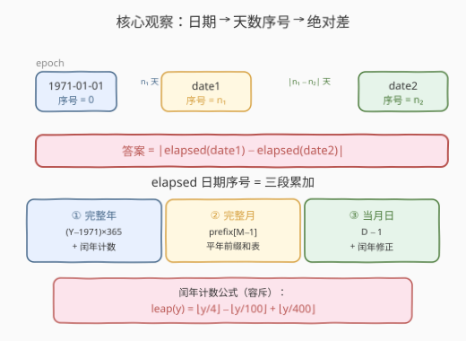
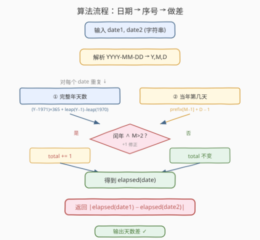
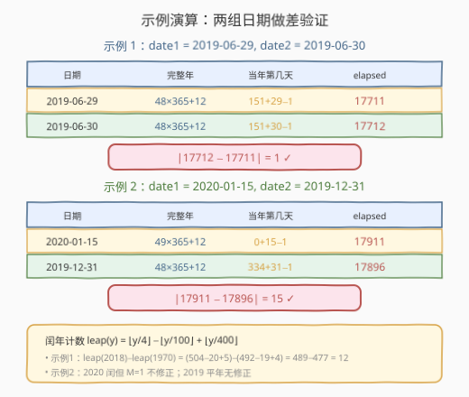

# 日期之间隔几天

- **题目名称**：日期之间隔几天
- **链接**：[1360. 日期之间隔几天](https://leetcode.cn/problems/number-of-days-between-two-dates/)
- **难度**：简单
- **标签**：数学、字符串、日期

## 1. 题目概述

请你编写一个程序来计算两个日期之间隔了多少天。日期以字符串形式给出，格式为 `YYYY-MM-DD`。

**示例 1**：

```text
输入：date1 = "2019-06-29", date2 = "2019-06-30"
输出：1
```

**示例 2**：

```text
输入：date1 = "2020-01-15", date2 = "2019-12-31"
输出：15
```

**约束条件**：

- 给定的日期是 `1971` 年到 `2100` 年之间的有效日期。

> 💡 本题是「日期数学」家族的基础题：核心是把每个日期换算成「距固定起点的天数序号」，再对两个序号做绝对差。这个 `elapsed` 子例程已在 [1185. 一周中的第几天](../1101-1200/1185_一周中的第几天.md) 中完整推导过——1360 只是去掉最后的 `% 7` 取余，改为 `|n₁ − n₂|` 做差。

---

## 2. 解题思路

### 2.1 暴力思路：逐日累加

最直觉的做法：从较早的日期开始，**逐天向较晚的日期推进**，每过一天计数器加一，直到两日期相等。

```text
count = 0
while date1 != date2:
    date1 = next_day(date1)   # 当前日期 +1 天
    count += 1
return count
```

这种写法正确但极慢——最坏情况下两个日期相隔近 **47000 天**（1971-01-01 与 2100-12-31 全跨度），时间 $O(N)$ 其中 $N$ 为间隔天数。虽然在本题约束下勉强可过，但完全没必要逐日推进：**每个日期到起点的天数可以一次性算出来**。

> ⚠️ `next_day` 本身也不平凡：要处理月末（28/29/30/31）、闰年二月、年末跨年等边界，逐日法不仅慢还容易在日期推进逻辑里出错。

> 💡 另一种「暴力」是直接调用标准库——Python 的 `datetime.date.fromisoformat(date1) - datetime.date.fromisoformat(date2)`，C++ 的 `tm` + `mktime` 算时间戳做差。一行搞定且正确，但面试中无法展示对日期计算的理解，适合作为对照而非主解（见 3.3）。

### 2.2 核心观察：日期序号 + 绝对差 O(1)



关键观察：选定一个固定起点（epoch），把每个日期换算成「距起点的天数」`elapsed`，则两日期间隔即两个序号的绝对差：

$$\text{answer} = \big|\,\text{elapsed}(\text{date1}) - \text{elapsed}(\text{date2})\,\big|$$

取绝对值的好处是**无需判断谁早谁晚**——题目只问「隔几天」，不问方向。

#### elapsed 的三段分解

沿用 [1185. 一周中的第几天](../1101-1200/1185_一周中的第几天.md) 已建立的 `elapsed` 公式，以 `1971-01-01` 为 epoch（序号 0），一个日期的序号分解为三段累加：

$$\text{elapsed}(Y, M, D) = \underbrace{(\text{完整年天数})}_{①} + \underbrace{(\text{当年完整月天数})}_{②} + \underbrace{(D - 1)}_{③}$$

**① 完整年天数**（1971 到 $Y-1$）：

$$\text{days\_years} = (Y - 1971) \times 365 + \text{leap\_count}(Y-1) - \text{leap\_count}(1970)$$

其中**闰年计数公式**（容斥原理，计数 $1$ 到 $y$ 年中的闰年个数）：

$$\text{leap\_count}(y) = \left\lfloor\frac{y}{4}\right\rfloor - \left\lfloor\frac{y}{100}\right\rfloor + \left\lfloor\frac{y}{400}\right\rfloor$$

减去 `leap_count(1970)` 是因为只计 1971 年起的闰年。`leap_count(1970) = 492 - 19 + 4 = 477`。

**② 当年完整月天数**（复用 [1154. 一年中的第几天](../1101-1200/1154_一年中的第几天.md) 的平年前缀和表）：

$$\text{prefix} = [0, 31, 59, 90, 120, 151, 181, 212, 243, 273, 304, 334]$$

`prefix[M-1]` 即 1 月到 $M-1$ 月的累计天数（平年）。

**③ 当月日**：$D - 1$（当月已过去的天数，1 号为 0 天）。

**闰年修正**：若 $Y$ 是闰年且 $M > 2$，则 2 月多 1 天，`elapsed += 1`。闰年判定复用 [1118. 一月有多少天](../1101-1200/1118_一月有多少天.md) 的三规则：

$$\text{isLeap}(Y) = (Y \bmod 4 = 0 \wedge Y \bmod 100 \neq 0) \vee (Y \bmod 400 = 0)$$

> ⚠️ **世纪年陷阱**：在 1971–2100 范围内，**2000 是闰年**（÷400=0），**2100 不是闰年**（÷100=0 但 ÷400≠0）。只记「÷4 即闰」会把 2100 误判为闰年，导致 elapsed 多算 1 天，最终答案差 1。

> 💡 **为什么选 1971-01-01 作为 epoch？** 题目约束年份范围为 1971–2100，1971-01-01 是范围内最早的有效日期，作为序号 0 的锚点最自然。选 epoch 的原则是：在约束范围内、尽量靠前，使所有日期的序号非负。Unix 时间戳起点 1970-01-01 也可用，但需多算 1970 一年的天数（含 1970 平年 365 天），不如直接从 1971 起简洁。

### 2.3 算法流程图



流程对每个日期执行同一套 `elapsed` 计算（解析 → 三段累加 → 闰年修正），最后对两个序号取绝对差。每步 $O(1)$。

### 2.4 示例演算



**示例 1**：`date1 = "2019-06-29"`, `date2 = "2019-06-30"`

| 日期 | 完整年 | 当年第几天 | elapsed |
|------|--------|-----------|---------|
| 2019-06-29 | $48 \times 365 + 12 = 17532$ | $151 + 29 - 1 = 179$ | 17711 |
| 2019-06-30 | $48 \times 365 + 12 = 17532$ | $151 + 30 - 1 = 180$ | 17712 |

- 完整年：`leap(2018) - leap(1970) = (504-20+5) - (492-19+4) = 489 - 477 = 12` 个闰年。
- 当年第几天：6 月对应 `prefix[5] = 151`；2019 平年，无需闰年修正。
- 间隔：$|17712 - 17711| = 1$ ✓

**示例 2**：`date1 = "2020-01-15"`, `date2 = "2019-12-31"`

| 日期 | 完整年 | 当年第几天 | elapsed |
|------|--------|-----------|---------|
| 2020-01-15 | $49 \times 365 + 12 = 17897$ | $0 + 15 - 1 = 14$ | 17911 |
| 2019-12-31 | $48 \times 365 + 12 = 17532$ | $334 + 31 - 1 = 364$ | 17896 |

- 2020 完整年：`leap(2019) - leap(1970) = 489 - 477 = 12`（注意 2020 本身是闰年，但完整年只算到 2019，所以闰年计数不含 2020）。
- 2020-01-15 闰年修正：2020 闰年但 $M=1 \le 2$，不加修正（1 月在 2 月前，不受 2 月 29 日影响）。
- 2019-12-31：12 月对应 `prefix[11] = 334`；2019 平年，无修正。
- 间隔：$|17911 - 17896| = 15$ ✓

> 💡 **闰年修正的边界**：闰年的 2 月 29 日只影响 $M > 2$ 的日期——1、2 月在 2 月 29 日之前，不受其影响。因此修正条件是 `isLeap(Y) && M > 2`，不是单纯 `isLeap(Y)`。示例 2 中 2020-01-15 虽是闰年但 1 月不修正，正是这条边界的体现。

---

## 3. 参考代码

### C++（手撕 elapsed + 绝对差）

```cpp
class Solution {
public:
    int daysBetweenDates(string date1, string date2) {
        return abs(elapsed(date1) - elapsed(date2));
    }
private:
    int elapsed(const string& s) {
        int y = stoi(s.substr(0, 4));
        int m = stoi(s.substr(5, 2));
        int d = stoi(s.substr(8, 2));
        static const int prefix[] = {0,31,59,90,120,151,181,212,243,273,304,334};
        int total = (y - 1971) * 365
                  + (leapCount(y - 1) - leapCount(1970))
                  + prefix[m - 1] + d - 1;
        if (isLeap(y) && m > 2) total += 1;
        return total;
    }
    int leapCount(int y) {
        return y / 4 - y / 100 + y / 400;
    }
    bool isLeap(int y) {
        return (y % 4 == 0 && y % 100 != 0) || (y % 400 == 0);
    }
};
```

### Python（手撕 elapsed + 绝对差）

```python
class Solution:
    def daysBetweenDates(self, date1: str, date2: str) -> int:
        return abs(self._elapsed(date1) - self._elapsed(date2))

    def _elapsed(self, s: str) -> int:
        y, m, d = map(int, s.split('-'))
        prefix = [0, 31, 59, 90, 120, 151, 181, 212, 243, 273, 304, 334]
        total = ((y - 1971) * 365
                 + (self._leap_count(y - 1) - self._leap_count(1970))
                 + prefix[m - 1] + d - 1)
        if self._is_leap(y) and m > 2:
            total += 1
        return total

    def _leap_count(self, y: int) -> int:
        return y // 4 - y // 100 + y // 400

    def _is_leap(self, y: int) -> bool:
        return (y % 4 == 0 and y % 100 != 0) or (y % 400 == 0)
```

### Python（标准库一行流，对比用）

```python
import datetime

class Solution:
    def daysBetweenDates(self, date1: str, date2: str) -> int:
        d1 = datetime.date.fromisoformat(date1)
        d2 = datetime.date.fromisoformat(date2)
        return abs((d1 - d2).days)
```

> ⚠️ **两种写法的对比**：`datetime` 写法简洁且不易出错，适合工程脚本；但手撕 `elapsed` 法是面试中期望的「手撕日期计算」解法，展示了对闰年规则、容斥计数和前缀和的精确控制。面试时建议先写手撕法，再提及 `datetime` 作为对照。`datetime.date.fromisoformat` 在 Python 3.7+ 可用；3.7 以下用 `datetime.date(*map(int, date1.split('-')))`。

---

## 4. 复杂度分析

| 维度 | 复杂度 | 说明 |
|------|--------|------|
| 时间复杂度（手撕） | $O(1)$ | 字符串解析 $O(1)$（定长 10 字符）+ 闰年计数 6 次整除 + 前缀和 1 次查表 + 闰年判定 3 次取模，全部常数操作 |
| 时间复杂度（标准库） | $O(1)$ | `fromisoformat` 解析定长字符串 + 内部序号做差，常数时间 |
| 空间复杂度 | $O(1)$ | 12 元素定长前缀和数组 + 几个整型变量，常数空间 |

> ⚠️ 时间严格 $O(1)$：无论日期如何，操作次数固定，不随输入规模增长。逐日累加法最坏需遍历近 47000 天，虽也能 AC 但远非最优。

---

## 5. 扩展：日期差的其他问法

**跨越 epoch 的日期差**：若题目允许日期早于 1971（如 1900-01-01），则 `elapsed` 可能为负。绝对差 `|n₁ - n₂|` 仍然成立（负序号照样可做差），但闰年计数公式 `leap_count(1900)` 需正确处理 1900 这个世纪年陷阱（1900 不是闰年，公式 `1900/4 - 1900/100 + 1900/400 = 475 - 19 + 4 = 460` 已正确扣除）。说明 `leap_count` 公式对任意公元年份都成立，无需额外调整。

**工作日天数**：若改为求两日期之间的「工作日天数」（排除周末），则在逐 7 天段内统计 5 个工作日，余数段按起始星期逐日判定。需要先像 [1185](../1101-1200/1185_一周中的第几天.md) 那样算出起始日星期，再按 7 取余分段计数，是 1360 与 1185 的综合应用。

**含节假日的天数**：若进一步排除法定节假日，需引入节假日表（如中国农历节日，每年不同），无法用纯公式解决，需预处理一张「日期 → 是否工作日」的查表，退化为 $O(N)$ 查询或借助离线节假日库。

> 💡 **一句话总结**：1360 的核心是「日期 → 序号 → 绝对差」——以 1971-01-01 为 epoch，用闰年计数公式算完整年天数、用前缀和算当年第几天、用 `isLeap && M>2` 做闰年修正，三段相加得序号，两序号做绝对差即答案。`elapsed` 子例程与 1185 完全共享，1360 只是去掉了 `% 7`。

---

## 6. 面试要点

1. **为什么用绝对差而不是判断谁早谁晚？**

   > 题目问「隔几天」，不关心方向，`|n₁ - n₂|` 直接给出无向间隔。若先比较大小再做减法，多一次分支且易在日期比较时出错（字符串比较需保证 `YYYY-MM-DD` 格式下字典序等于时间序，本题格式恰好满足，但绝对差更稳健）。

2. **闰年计数公式 `leap_count(y) = y/4 - y/100 + y/400` 的原理是什么？**

   > 这是容斥原理：`y/4` 计数所有 4 的倍数年（闰年候选），`y/100` 减去 100 的倍数年（非闰年），`y/400` 加回 400 的倍数年（又是闰年）。`leap_count(Y-1) - leap_count(1970)` 即得 [1971, Y-1] 区间内的闰年个数，避免了逐年循环判定。

3. **为什么闰年修正条件是 `isLeap(Y) && M > 2` 而不是 `isLeap(Y)`？**

   > 闰年的 2 月 29 日只影响 3 月及之后的日期——1、2 月在 2 月 29 日之前，累计天数不受影响。因此只有 `M > 2` 时才需加 1 修正。示例 2 中 2020-01-15 虽是闰年但 1 月不修正，正是这条边界的体现。

4. **2100 年是闰年吗？对答案有何影响？**

   > 2100 **不是**闰年。格里高利历规则：能被 4 整除且不能被 100 整除，或能被 400 整除。2100 能被 100 整除但不能被 400 整除 → 平年。2000 能被 400 整除 → 闰年。在 1971–2100 范围内，2100 是唯一的世纪年陷阱。若误判 2100 为闰年，2100-03-01 及之后的日期 elapsed 会多算 1 天，导致答案差 1。

5. **如果题目改为求两个日期间的「完整天数」（不含端点），怎么调整？**

   > 「之间隔几天」一般指端点之差，即 `|n₁ - n₂|`。若改为「之间有多少天」（不含两端），则减 1：`|n₁ - n₂| - 1`（两日期相邻时为 0）。若改为「含两端的天数」，则加 1：`|n₁ - n₂| + 1`。需在面试时与面试官确认端点语义。

> 💡 **一句话总结**：1360 = 1185 的 `elapsed` 子例程 + 绝对差。以 1971-01-01 为 epoch，闰年计数公式（容斥）算完整年、前缀和算完整月、`isLeap && M>2` 修正闰日，三段相加得序号，两序号做 `abs` 即答案，全程 $O(1)$。

---

## 7. 同类练习题

- [1185. 一周中的第几天](https://leetcode.cn/problems/day-of-the-week/)（[题解](../1101-1200/1185_一周中的第几天.md)）：本题 `elapsed` 子例程的直接来源——1185 算 elapsed 后 `% 7` 映射星期，1360 算两个 elapsed 后做绝对差，核心日期数学完全共享
- [1154. 一年中的第几天](https://leetcode.cn/problems/day-of-the-year/)（[题解](../1101-1200/1154_一年中的第几天.md)）：本题「当年第几天」的母题——前缀和表 + 闰年修正在 1360 中作为 elapsed 的第二段复用
- [1118. 一月有多少天](https://leetcode.cn/problems/number-of-days-in-a-month/)（[题解](../1101-1200/1118_一月有多少天.md)）：格里高利历闰年三规则的母题，1360 的 `isLeap` 与闰年计数均基于此规则
- [1363. 最大多边形面积](https://leetcode.cn/problems/largest-multiple-of-three/)：同为 1301-1400 区间数学题，但思路无关（数位贪心），可作为对照——并非所有数学题都靠公式降维，1360 用公式 $O(1)$，1363 用贪心 $O(n)$
- [172. 阶乘后的零](https://leetcode.cn/problems/factorial-trailing-zeroes/)（[题解](../0101-0200/172_阶乘后的零.md)）：同为「数学公式降维」——用勒让德公式 $v_5(n!) = \sum\lfloor n/5^i \rfloor$ 替代逐个枚举，与 1360 用闰年计数公式替代逐年循环思路同源
