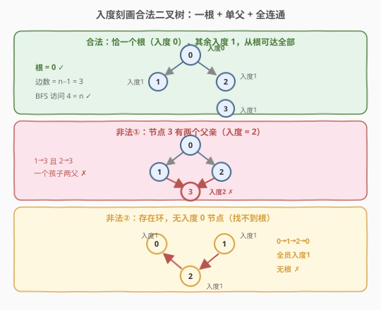
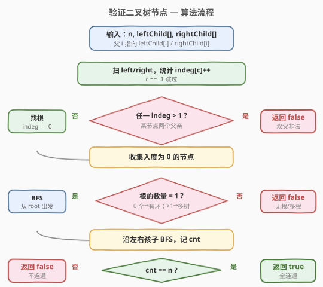
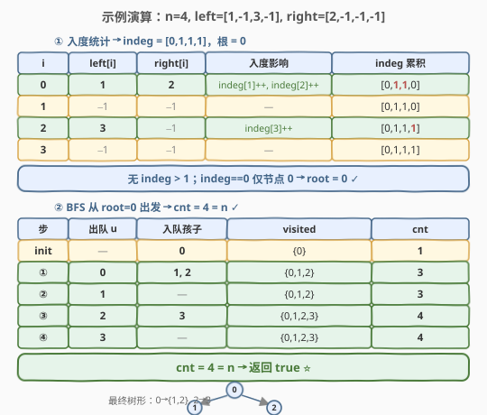

# LeetCode 验证二叉树节点 题解

## 1. 题目概述

- **标题 / 题号**：验证二叉树节点（#1361，medium）
- **链接**：https://leetcode.cn/problems/validate-binary-tree-nodes/
- **难度**：中等
- **标签**：树、二叉树、广度优先搜索（BFS）、图、入度

**题意**：有 `n` 个二叉树节点，编号从 `0` 到 `n - 1`。每个节点 `i` 有左孩子 `leftChild[i]` 和右孩子 `rightChild[i]`，若为 `-1` 表示没有对应的孩子。

只有当所有给定的节点**恰好构成一棵合法的二叉树**时，返回 `true`；否则返回 `false`。

**示例 1**：

```text
输入：n = 4, leftChild = [1,-1,3,-1], rightChild = [2,-1,-1,-1]
输出：true
解释：节点 0 为根，左孩子 1、右孩子 2；节点 2 的左孩子为 3。
```

**示例 2**：

```text
输入：n = 4, leftChild = [1,-1,3,-1], rightChild = [2,3,-1,-1]
输出：false
解释：节点 3 同时是节点 1 的右孩子和节点 2 的左孩子，有两个父亲。
```

**示例 3**：

```text
输入：n = 4, leftChild = [3,-1,1,-1], rightChild = [-1,-1,0,-1]
输出：true
解释：节点 2 为根，左孩子 1、右孩子 0；节点 0 的左孩子为 3。
```

**约束**：

- `n == leftChild.length == rightChild.length`
- `1 <= n <= 10^4`
- `-1 <= leftChild[i], rightChild[i] <= n - 1`

> 💡 本题的灵魂是「**把二叉树看作有向图，用入度刻画树的结构性质**」——一棵合法二叉树等价于：恰一个入度为 0 的根、其余节点入度恰为 1（每个节点最多一个父亲）、从根出发能不重复地访问到全部 `n` 个节点（连通且无环）。

## 2. 解题思路

### 2.1 暴力思路：枚举根 + 全排列验证

枚举每个节点当根，再枚举所有父子关系的排列组合验证是否构成二叉树。时间复杂度指数级，完全不可行。问题在于**没有利用二叉树的结构性质**——一棵树的有向图刻画有非常硬性的入度条件，根本不需要搜索。

### 2.2 核心观察：入度刻画 + BFS 连通性



把每个节点看作有向图中的顶点，`i → leftChild[i]`、`i → rightChild[i]` 为有向边（父指向子）。一棵合法的二叉树在入度上必须满足三个充要条件：

1. **恰一个根**：入度为 0 的节点**有且仅有一个**。若没有，说明存在环（每个节点都有人指向它，必成环）；若多于一个，说明有多棵树。
2. **单父约束**：每个非根节点入度**恰为 1**。若某节点入度 ≥ 2，说明它有两个父亲——二叉树中一个节点只能有一个父节点，立即非法。
3. **全连通无环**：从根出发 BFS，能不重复地访问到全部 `n` 个节点。若访问数 `< n`，说明存在与根不连通的环或孤立子树。

> 💡 关键直觉：条件 ①② 是**结构硬约束**（入度直接判定，$O(n)$ 扫一遍即可），条件 ③ 是**连通性验证**（BFS 一趟）。三者合起来恰好等价于「一棵合法二叉树」，无需搜索任何排列。

> ⚠️ **为什么条件 ①② 满足后还要 BFS？** 因为可能存在「与根不连通的环」。例如根 `0 → 1`，另有 `2 ↔ 3` 互为父子：入度 `0:0、1:1、2:1、3:1`，恰一个根、其余入度 1，结构条件全过——但 `2、3` 自成环、与根不连通，并非一棵树。BFS 访问数 $= 2 < 4$ 即可识破。

### 2.3 算法流程图



**完整步骤**：

1. **统计入度**：扫一遍 `leftChild` / `rightChild`，对每个不为 `-1` 的孩子 `c` 执行 `indeg[c]++`；若 `indeg[c] > 1`，立即返回 `false`。
2. **找根**：扫一遍 `indeg`，收集入度为 0 的节点；若数量 ≠ 1，返回 `false`，否则记为 `root`。
3. **BFS 连通验证**：从 `root` 出发，沿左右孩子 BFS，标记访问；若遇到已访问节点则返回 `false`（防御性，结构条件满足时不会触发）。
4. **返回**：`visited 数 == n`。

### 2.4 示例演算

以示例 1 `n=4, leftChild=[1,-1,3,-1], rightChild=[2,-1,-1,-1]` 为例：



**入度统计**：

| 节点 i | leftChild[i] | rightChild[i] | 影响 | indeg 累积 |
|--------|--------------|---------------|------|------------|
| 0 | 1 | 2 | indeg[1]++, indeg[2]++ | [0,1,1,0] |
| 1 | -1 | -1 | — | [0,1,1,0] |
| 2 | 3 | -1 | indeg[3]++ | [0,1,1,1] |
| 3 | -1 | -1 | — | [0,1,1,1] |

得 `indeg = [0, 1, 1, 1]`，无入度 > 1 者；入度为 0 的节点仅 `0`，故 `root = 0`。

**BFS 访问**：

| 步 | 出队 u | 入队孩子 | visited | cnt |
|----|--------|----------|---------|-----|
| init | — | 0 | {0} | 1 |
| ① | 0 | 1, 2 | {0,1,2} | 3 |
| ② | 1 | — | {0,1,2} | 3 |
| ③ | 2 | 3 | {0,1,2,3} | 4 |
| ④ | 3 | — | {0,1,2,3} | 4 |

`cnt = 4 = n` → 返回 `true`。✓

## 3. 参考代码

### C++

```cpp
class Solution {
   public:
    bool validateBinaryTreeNodes(int n, vector<int>& leftChild, vector<int>& rightChild) {
        vector<int> indeg(n, 0);
        for (int i = 0; i < n; i++) {
            for (int c : {leftChild[i], rightChild[i]}) {
                if (c != -1 && ++indeg[c] > 1) return false;   // 两个父亲
            }
        }
        int root = -1;
        for (int i = 0; i < n; i++) {
            if (indeg[i] == 0) {
                if (root != -1) return false;                  // 多于一个根
                root = i;
            }
        }
        if (root == -1) return false;                          // 无根（存在环）

        vector<int> visited(n, false);
        queue<int> q;
        q.push(root);
        visited[root] = true;
        int cnt = 1;
        while (!q.empty()) {
            int u = q.front();
            q.pop();
            for (int c : {leftChild[u], rightChild[u]}) {
                if (c == -1) continue;
                if (visited[c]) return false;                  // 二次访问 → 有环
                visited[c] = true;
                q.push(c);
                cnt++;
            }
        }
        return cnt == n;                                       // 全连通
    }
};
```

### Python

```python
class Solution:
    def validateBinaryTreeNodes(self, n: int, leftChild: List[int], rightChild: List[int]) -> bool:
        indeg = [0] * n
        for i in range(n):
            for c in (leftChild[i], rightChild[i]):
                if c != -1:
                    indeg[c] += 1
                    if indeg[c] > 1:                  # 两个父亲
                        return False

        root = -1
        for i in range(n):
            if indeg[i] == 0:
                if root != -1:                        # 多于一个根
                    return False
                root = i
        if root == -1:                                # 无根（存在环）
            return False

        visited = [False] * n
        q = collections.deque([root])
        visited[root] = True
        cnt = 1
        while q:
            u = q.popleft()
            for c in (leftChild[u], rightChild[u]):
                if c == -1:
                    continue
                if visited[c]:                        # 二次访问 → 有环
                    return False
                visited[c] = True
                q.append(c)
                cnt += 1
        return cnt == n                               # 全连通
```

> 💡 两版等价。核心三步：① 扫入度，遇 `>1` 即 `false`；② 找入度 0 的根，数量 ≠ 1 即 `false`；③ BFS 数访问数，`== n` 即 `true`。`if visited[c]: return False` 是防御性写法——结构条件满足时不会触发，但能兜住任何遗漏的环。

## 4. 复杂度分析

| 维度 | 复杂度 | 说明 |
|------|--------|------|
| 时间复杂度 | $O(n)$ | 入度统计、找根、BFS 各扫一次，每节点入队出队各一次 |
| 空间复杂度 | $O(n)$ | `indeg`、`visited`、队列各 $O(n)$ |

> 💡 三趟线性扫描，常数级开销。本题 $n \le 10^4$，毫无压力；即使放大到 $10^6$ 仍是线性。

## 5. 扩展：并查集解法

也可用并查集验证「无环 + 单连通」，但**仍需先做入度检查**——并查集的 `union` 只能识别「同属一个集合时加边成环」，却无法识别「一个节点有两个父亲」（两个父亲与该节点不在同集合时 `union` 会成功，但二叉树不允许）。因此并查集版需配合入度判定，不如 BFS 直观：

```python
class Solution:
    def validateBinaryTreeNodes(self, n, leftChild, rightChild):
        indeg = [0] * n
        for i in range(n):
            for c in (leftChild[i], rightChild[i]):
                if c != -1:
                    indeg[c] += 1
                    if indeg[c] > 1:
                        return False
        root = -1
        for i in range(n):
            if indeg[i] == 0:
                if root != -1:
                    return False
                root = i
        if root == -1:
            return False

        parent = list(range(n))

        def find(x):
            while parent[x] != x:
                parent[x] = parent[parent[x]]
                x = parent[x]
            return x

        for i in range(n):
            for c in (leftChild[i], rightChild[i]):
                if c == -1:
                    continue
                ri, rc = find(i), find(c)
                if ri == rc:                       # 成环
                    return False
                parent[rc] = ri
        rr = find(root)
        return all(find(i) == rr for i in range(n))
```

> 💡 **BFS vs 并查集**：两者都 $O(n\,\alpha(n)) \approx O(n)$。BFS 一趟遍历即可同时验证无环与连通，且能自然复用入度判定；并查集需要额外的 `find/all` 扫描确认连通，代码更长。本题推荐 BFS。

## 6. 面试要点

1. **为什么入度条件满足后还要 BFS？**

   > 入度的「恰一个根 + 其余入度 1」只保证**结构**合法，不保证**连通**。可能存在与根不连通的独立环（如根 `0→1`，另有 `2↔3` 互为父子），此时入度全合格却不是一棵树。BFS 的 `cnt == n` 正是补上连通性这一刀。

2. **为什么 `indeg > 1` 就一定非法？**

   > 二叉树中每个节点至多一个父节点。入度 ≥ 2 意味着至少两个节点把它当孩子，违反二叉树的父子一对一关系。这是二叉树区别于一般有向图的最硬性约束，扫一遍入度即可判定。

3. **`if visited[c]: return False` 会不会误判？**

   > 不会。结构条件（入度 ≤ 1、恰一个根）满足后，从根可达的部分必是树（无环），不会二次访问。该判断只是**防御性兜底**——即便去掉入度检查，它也能捕获「可达的环」和「双父」两种情况。真正决定连通的是末尾的 `cnt == n`。

4. **没有入度 0 的节点意味着什么？**

   > 意味着每个节点都至少有一个父亲，`n` 个节点至少 `n` 条入边，必然存在环（树应有 $n-1$ 条边）。无根即非法。类似 [207 课程表](../0201-0300/207_课程表.md) 中「无入度为 0 节点 → 存在循环依赖」。

5. **和 684 冗余连接、207 课程表的入度思想有何联系？**

   > [684](../0601-0700/684_冗余连接.md) 用并查集在「树 + 一条边」中找成环边；[207](../0201-0300/207_课程表.md) 用入度做拓扑排序判环。本题把「入度 = 0 的根」与「入度 = 1 的非根」作为二叉树的入度指纹——是入度思想在树结构判定上的直接应用，与 207 的「入度 0 入队」同源。

> 💡 **一句话总结**：1361 的灵魂是「**入度刻画二叉树**」——恰一个入度 0 的根 + 其余入度 1 + 从根 BFS 访问到全部 `n` 节点。三趟线性扫描把「是否合法二叉树」化为简单的入度计数与连通性验证。

## 同类练习题

| # | 题目 | 与本题的关联 |
|---|------|-------------|
| 684 | [冗余连接](https://leetcode.cn/problems/redundant-connection/)（[题解](../0601-0700/684_冗余连接.md)） | 并查集在「树 + 一条边」中找成环边，与本题「BFS 识环」对照 |
| 207 | [课程表](https://leetcode.cn/problems/course-schedule/)（[题解](../0201-0300/207_课程表.md)） | 入度 + 拓扑排序判环，入度思想的母题 |
| 1319 | [连通网络的操作次数](https://leetcode.cn/problems/number-of-operations-to-make-network-connected/)（[题解](./1319_连通网络的操作次数.md)） | 并查集数连通分量，与本题「连通性验证」同源 |
| 547 | [省份数量](https://leetcode.cn/problems/number-of-provinces/)（[题解](../0501-0600/547_省份数量.md)） | 连通分量计数，理解「单连通」判定的基础 |
| 200 | [岛屿数量](https://leetcode.cn/problems/number-of-islands/) | BFS/DFS 求连通分量，可与本题的 BFS 连通验证对照 |
