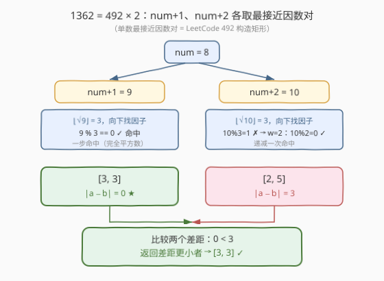
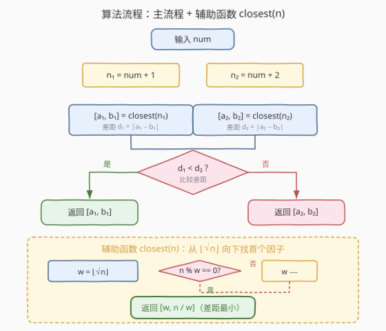
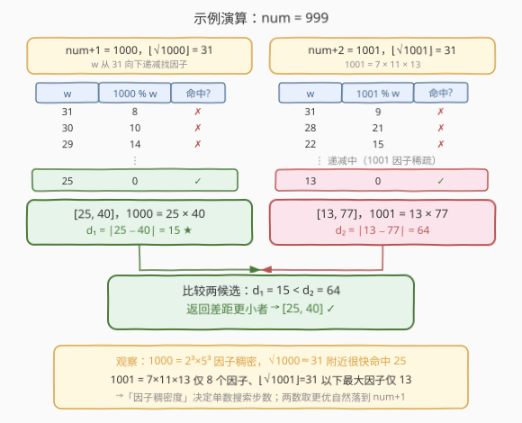

# LeetCode 最接近的因数 题解

## 1. 题目概述

- **标题 / 题号**：最接近的因数（#1362，medium）
- **链接**：https://leetcode.cn/problems/closest-divisors/
- **难度**：中等
- **标签**：数学、枚举、因数

**题意**：给定整数 `num`，找到两个**正整数** `a`、`b`，满足：

- $a \times b = \text{num} + 1$ **或** $a \times b = \text{num} + 2$；
- $|a - b|$ 尽可能小。

返回 `[a, b]`，顺序任意。题目保证有解（任何 $n \ge 1$ 至少有因子对 $(1, n)$，故 `num+1`、`num+2` 必有候选）。

**示例 1**：

```text
输入：num = 8
输出：[3,3]
解释：num+1 = 9，最接近因数对 [3,3]，差距 0；
      num+2 = 10，最接近因数对 [2,5]，差距 3。
      0 < 3，故返回 [3,3]。
```

**示例 2**：

```text
输入：num = 123
输出：[5,25]
解释：num+1 = 124 = 4×31，差距 27；
      num+2 = 125 = 5×25，差距 20。
      20 < 27，故返回 [5,25]。
```

**示例 3**：

```text
输入：num = 999
输出：[40,25]
解释：num+1 = 1000 = 25×40，差距 15；
      num+2 = 1001 = 13×77，差距 64。
      15 < 64，故返回 [40,25]（顺序任意）。
```

**约束**：

- $1 \le \text{num} \le 10^9$

> 💡 关键在于「乘积被锁定为 `num+1` 或 `num+2` 之一」——这是两个**独立**的数，各自求最接近因数对，再取差距更小者。而「单数最接近因数对」正是 [492. 构造矩形](../0401-0500/492_构造矩形.md) 的原题套路。本题 = 492 做两次。

## 2. 解题思路

### 2.1 暴力思路

对 `num+1` 和 `num+2` 分别枚举所有因子对：从 $w = 1$ 到 $n$ 检查 $n \bmod w == 0$，记录每对 $(w, n/w)$ 的差距，取最小。两数各做一遍，再取二者中更小的。

问题：$n \le 10^9 + 2$，线性枚举到 $n$ 是 $10^9$ 次，超时。和 492 一样，因子是**成对且关于 $\sqrt{n}$ 对称**的，无需扫到 $n$。

### 2.2 核心观察：单数最接近因数对 = 492，做两次取更优



**① 单数 $n$ 的最接近因数对如何求？**

固定积 $a \times b = n$，要 $|a - b|$ 最小，等价于让 $a, b$ 尽可能贴近 $\sqrt{n}$（乘积固定时，二者越接近平方根，差越小）。由于因子成对且关于 $\sqrt{n}$ 对称，**从 $w = \lfloor\sqrt{n}\rfloor$ 向下递减，第一个满足 $n \bmod w == 0$ 的 $w$ 就是 $\le \sqrt{n}$ 的最大因子**，此时 $[w,\ n/w]$ 差距最小。这正是 492 的核心结论（详见 [492 题解 2.2 节](../0401-0500/492_构造矩形.md)）。

> 💡 **为何"首个命中即最优"？** 从 $\sqrt{n}$ 向下递减，$w$ 按从大到小试探；首个因子即「$\le \sqrt{n}$ 的最大因子」，对应 $b = n/w$ 最小、二者最贴近 $\sqrt{n}$，差距最小。命中即返回，无需比较其余因子对。

**② 本题 = 上述过程做两次**

`num+1` 与 `num+2` 是两个独立的数，各自的最接近因数对互不影响：

- 候选 1：$\text{closest}(\text{num}+1) = [a_1, b_1]$，差距 $d_1 = |a_1 - b_1|$；
- 候选 2：$\text{closest}(\text{num}+2) = [a_2, b_2]$，差距 $d_2 = |a_2 - b_2|$。

最终答案即 $d_1 < d_2$ 时取候选 1，否则取候选 2。

> ⚠️ **为什么只看 `num+1` 和 `num+2`，不联合搜索？** 题目把乘积**严格限定**为这两个值之一，不存在「跨两数混合」的因子对。故两次独立搜索已是完整覆盖，无需也无法合并。

### 2.3 算法流程图



**主流程**：

1. 令 $n_1 = \text{num}+1$，$n_2 = \text{num}+2$。
2. 计算 $[a_1, b_1] = \text{closest}(n_1)$，$[a_2, b_2] = \text{closest}(n_2)$。
3. 比较 $d_1 = |a_1 - b_1|$ 与 $d_2 = |a_2 - b_2|$，返回差距更小者（相等任取）。

**辅助函数 `closest(n)`**（即 492 的算法）：

1. $w = \lfloor\sqrt{n}\rfloor$（用整数平方根，避免浮点误差）。
2. 当 $n \bmod w \ne 0$ 时，$w \mathrel{-}= 1$。
3. 返回 $[w,\ n/w]$。

> 💡 循环必终止：$w$ 递减到 $1$ 时 $n \bmod 1 == 0$ 恒成立。最坏情况 $n$ 为质数，循环 $\lfloor\sqrt{n}\rfloor$ 次。

### 2.4 示例演算

以 `num = 999` 为例（官方示例 3，能体现「两数因子稠密度不同」的典型场景）：



**候选 1：$n_1 = 1000$，$\lfloor\sqrt{1000}\rfloor = 31$**

| $w$ | $1000 \bmod w$ | 命中？ |
|-----|----------------|--------|
| 31 | 8 | ✗ |
| 30 | 10 | ✗ |
| 29 | 14 | ✗ |
| ⋮ | ⋮ | ⋮ |
| 25 | 0 | ✓ |

命中 $w = 25$，得 $[25, 40]$，$d_1 = 15$。$1000 = 2^3 \times 5^3$ 因子稠密，$\sqrt{1000} \approx 31.6$ 附近很快命中。

**候选 2：$n_2 = 1001$，$\lfloor\sqrt{1001}\rfloor = 31$**

$1001 = 7 \times 11 \times 13$，仅有 8 个因子，$\le 31$ 的最大因子是 $13$，需从 $31$ 一路递减到 $13$ 才命中：

| $w$ | $1001 \bmod w$ | 命中？ |
|-----|----------------|--------|
| 31 | 9 | ✗ |
| 28 | 21 | ✗ |
| 22 | 15 | ✗ |
| ⋮ | ⋮ | ⋮ |
| 13 | 0 | ✓ |

得 $[13, 77]$，$d_2 = 64$。

**比较**：$d_1 = 15 < d_2 = 64$，返回 $[25, 40]$（顺序任意，官方输出 `[40,25]`）。

> 💡 此例揭示一个直觉：**因子稠密的数更容易给出小差距**。$1000$ 高度合数、靠近 $\sqrt{}$ 即有因子 $25$；$1001$ 半质数性质强、最大小因子仅 $13$。两数取更优时，自然落到 `num+1`。

## 3. 参考代码

### C++

```cpp
class Solution {
public:
    vector<int> closestDivisors(int num) {
        auto closest = [](int n) -> vector<int> {
            int w = (int)sqrt((double)n);
            // 修正浮点平方根可能的下取整误差（如 n 恰为完全平方数）
            while ((long long)(w + 1) * (w + 1) <= n) ++w;
            while (n % w != 0) --w;
            return {w, n / w};
        };
        vector<int> a = closest(num + 1);
        vector<int> b = closest(num + 2);
        return abs(a[0] - a[1]) < abs(b[0] - b[1]) ? a : b;
    }
};
```

### Python

```python
import math

class Solution:
    def closestDivisors(self, num: int) -> list[int]:
        def closest(n: int) -> list[int]:
            w = math.isqrt(n)      # 整数平方根，精确无浮点误差
            while n % w != 0:
                w -= 1
            return [w, n // w]
        a = closest(num + 1)
        b = closest(num + 2)
        return a if abs(a[0] - a[1]) < abs(b[0] - b[1]) else b
```

> 💡 **两个实现细节**：
> 1. **整数平方根避免浮点误差**：$n$ 恰为完全平方数时，`(int)sqrt(n)` 可能因浮点下取整得到 $\sqrt{n}-1$，导致漏掉最优因子（如 $n=9$ 得 $w=2$，递减到 $1$ 返回 $[1,9]$ 而非 $[3,3]$）。C++ 用 `while ((w+1)*(w+1) <= n) ++w;` 修正；Python 直接用 `math.isqrt`（精确整数平方根，3.8+）。
> 2. **比较用绝对差**：单数内部「$w$ 最大」已保证该数差距最小，故两候选间只需直接比 $|a-b|$，无需再回到 $\sqrt{}$ 比较。

## 4. 复杂度分析

| 维度 | 复杂度 | 说明 |
|------|--------|------|
| **时间** | $O(\sqrt{\text{num}})$ | 两次 `closest` 各至多 $\lfloor\sqrt{\text{num}+2}\rfloor$ 次取模；$\sqrt{10^9} \approx 31623$，总计约 $6.3 \times 10^4$ 次 |
| **空间** | $O(1)$ | 仅常数个整型变量，无额外数据结构 |

> 💡 $\text{num} \le 10^9$ 下 $\sqrt{} \le 31623$，两次搜索总开销在微秒级。若约束放大到 $10^{14}$（$\sqrt{} = 10^7$），需改用质因数分解 + 因子枚举（见第 5 节）。

## 5. 扩展：大数场景与「为何不联合搜索」

**① 大数下 $O(\sqrt{n})$ 不够用怎么办？**

若 `num` 放大到 $10^{14}$ 甚至 $10^{18}$，$\sqrt{}$ 达 $10^7 \sim 10^9$，逐次取模会超时。此时对 `num+1`、`num+2` 分别做**质因数分解**（Pollard-Rho，$O(n^{1/4})$），再由质因数幂积**生成所有因子**，最后在因子集合中二分找最接近 $\sqrt{n}$ 的因子。复杂度降至 $O(n^{1/4})$，但实现复杂度高，仅作延伸。本题 $10^9$ 规模无需此优化。

**② 能否联合 `num+1`、`num+2` 一次搜索？**

不能。两数乘积被严格限定为各自的具体值，因子分别属于两个不同的数，没有「跨数」的因子对。两次独立 `closest` 已是完整解空间覆盖。唯一可微优化：若 `num+1` 命中差距为 $0$（即 `num+1` 是完全平方数），可立即返回、跳过 `num+2` 的搜索——但最坏复杂度不变。

**③ 为何答案常落在 `num+1`？**

并非必然（示例 2 就落在 `num+2 = 125`）。但相邻两整数中，含更多小质因子的那个往往因子更稠密、靠近 $\sqrt{}$ 的因子更大、差距更小。两个连续整数必有一偶（含因子 2），通常比相邻奇数更「合数」。这是经验观察，非保证，算法仍需两数都比。

> 💡 **一句话总结**：1362 是 492 的「两倍剂量」——把单数最接近因数对（从 $\lfloor\sqrt{n}\rfloor$ 向下找首个因子）对 `num+1`、`num+2` 各做一次，取差距更小者即可。

## 6. 面试要点

1. **本题和 492 构造矩形是什么关系？**

   > 492 求「给定 $n$ 的最接近因数对」；本题求「`num+1` 或 `num+2` 的最接近因数对」。把 492 的算法封装成 `closest(n)`，对两个候选数各调一次、比差距，即为完整解。本质是 492 的复用 + 一次比较。

2. **为什么从 $\sqrt{n}$ 向下找，而不是从 1 向上？**

   > 差距最小要求两因子最贴近 $\sqrt{n}$。从 $\sqrt{n}$ 向下递减，首个命中因子是「$\le \sqrt{n}$ 的最大因子」，对应 $n/w$ 最小、二者最贴近，差距最小。从 1 向上找到的则是最小因子（差距最大），方向相反。

3. **`(int)sqrt(n)` 的浮点误差会带来什么 bug？如何避免？**

   > $n$ 为完全平方数时，浮点 `sqrt` 可能返回 $\sqrt{n} - \epsilon$，强转得 $\sqrt{n}-1$，随后向下递减会**漏掉 $w = \sqrt{n}$ 这个最优解**，返回错误的大差距答案（如 $n=9$ 错返 $[1,9]$）。避免：C++ 用 `while ((w+1)*(w+1) <= n) ++w;` 修正，或用 `(long long)round(sqrt(n))` 配合校验；Python 用 `math.isqrt` 精确整数平方根。

4. **循环会死循环吗？边界如何保证？**

   > 不会。$w$ 从 $\lfloor\sqrt{n}\rfloor$ 递减，最坏到 $1$；而 $n \bmod 1 == 0$ 恒成立，循环最迟在 $w=1$ 终止。无需额外 `w > 0` 判定。最坏情况 $n$ 为质数，循环 $\lfloor\sqrt{n}\rfloor$ 次。

5. **若 `num` 放大到 $10^{18}$，本算法还够用吗？**

   > 不够。$\sqrt{10^{18}} = 10^9$，逐次取模超时。改用 Pollard-Rho 质因数分解（$O(n^{1/4})$）+ 因子枚举 + 二分找接近 $\sqrt{n}$ 的因子。但本题 $10^9$ 下 $\sqrt{} \le 31623$，$O(\sqrt{n})$ 完全够用。

## 同类练习题

| # | 题目 | 与本题的关联 |
|---|------|-------------|
| 492 | [构造矩形](https://leetcode.cn/problems/construct-the-rectangle/)（[题解](../0401-0500/492_构造矩形.md)） | 本题的直接母题——单数最接近因数对，从 $\lfloor\sqrt{n}\rfloor$ 向下找首个因子；1362 即将其做两次取更优 |
| 507 | [完美数](https://leetcode.cn/problems/perfect-number/) | 枚举真因子求和，同样利用「因子成对、只需搜到 $\sqrt{n}$」的对称性优化，巩固因子枚举模板 |
| 367 | [有效的完全平方数](https://leetcode.cn/problems/valid-perfect-square/) | 判定 $n$ 是否完全平方数，对应本题「$n$ 为完全平方数时差距为 0 可立即返回」的特例与整数平方根写法 |
| 69 | [x 的平方根](https://leetcode.cn/problems/sqrtx/) | 求 $\lfloor\sqrt{n}\rfloor$，是本题起始点 $w$ 的计算基础，对照二分/牛顿法与 `isqrt` 的整数平方根实现 |
| 252 | [会议室](https://leetcode.cn/problems/meeting-rooms/) | 虽非因数题，但同为「区间/排序后贪心比较」范式，可对照「多候选取最优」的比较结构 |
