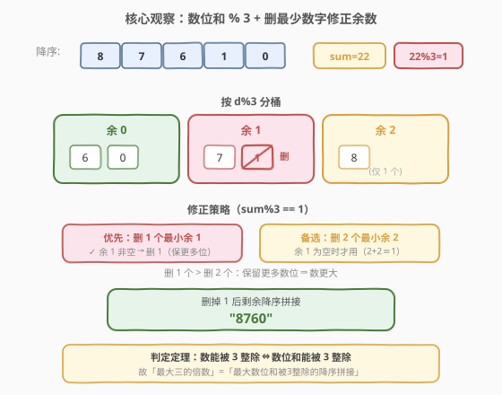
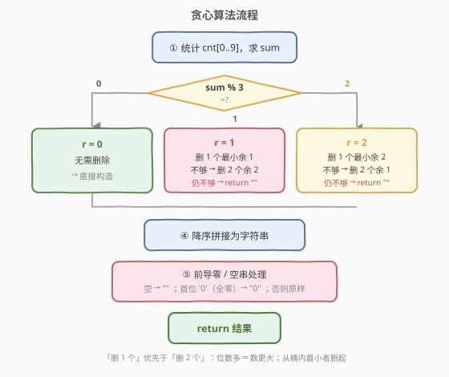
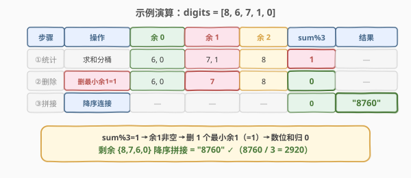

# 形成三的最大倍数

- **题目名称**：形成三的最大倍数
- **链接**：[1363. 形成三的最大倍数](https://leetcode.cn/problems/largest-multiple-of-three/)
- **难度**：困难
- **标签**：贪心、数组、数学、计数排序

## 1. 题目概述

给定一个整数数组 `digits`（每个元素是 `0`–`9` 的数字），你可以**按任意顺序**连接其中某些数字，形成一个 **3 的倍数**。请返回能得到的**最大** 3 的倍数。由于答案可能超出整型范围，请以**字符串**返回；若无法形成任何 3 的倍数，返回空字符串 `""`。结果**不应包含前导零**。

**示例 1**：

```text
输入：digits = [8,1,9]
输出："981"
解释：9+8+1=18，18%3==0，降序拼接 "981"。
```

**示例 2**：

```text
输入：digits = [8,6,7,1,0]
输出："8760"
解释：数位和 22%3==1，删掉最小的「余1」数字 1 后和为 21%3==0，降序拼接 "8760"。
```

**示例 3**：

```text
输入：digits = [1]
输出：""
解释：仅 1，1%3≠0，且无法凑出 3 的倍数。
```

**示例 4**：

```text
输入：digits = [0,0,0,0,0,0]
输出："0"
解释：全为 0，结果是 "0"（去前导零）。
```

**约束条件**：

- `1 <= digits.length <= 10^4`
- `0 <= digits[i] <= 9`

> 💡 **数位和判定定理**：一个十进制数能被 3 整除 **当且仅当** 其各位数字之和能被 3 整除。于是「能否被 3 整除」只取决于**数位和** `% 3`，与数字的排列无关——这把问题从「构造数字」降维为「选/删数字使数位和 % 3 == 0」。

---

## 2. 解题思路

### 2.1 暴力思路

枚举每个数位的「选/不选」，共 $2^n$ 个子集，对每个子集求和判 `% 3 == 0`，再在所有合法子集中取「降序拼接」字典序最大者。$n = 10^4$ 时 $2^n$ 完全不可行。

### 2.2 核心观察：贪心——全选后删最少数字修正余数



> 💡 **贪心直觉**：要使结果**最大**，首先**数位要尽量多**（位数多的数严格大于位数少的数，无前导零前提下）；其次在位数相同时**高位要尽量大**。因此最优策略是：
>
> 1. **先全选所有数位**（这样位数最多），求和 `sum`；
> 2. 若 `sum % 3 == 0`，直接用全部数位降序拼接；
> 3. 否则**删掉尽量少的数字**让余数归零——删 1 个优先于删 2 个。

把数位按 $d \bmod 3$ 分三桶：余 0（`{0,3,6,9}`）、余 1（`{1,4,7}`）、余 2（`{2,5,8}`）。余 0 的数位不影响整除性，**只需处理余 1 / 余 2**。设 $m = \text{sum} \bmod 3$：

- **$m = 1$**：需要「减去一个余 1 的量」抵消。两种修法：
  - 删 **1 个**最小余 1 数字（首选，删得少）；或
  - 删 **2 个**最小余 2 数字（因 $2+2=4\equiv 1\pmod 3$，等价抵消）。
- **$m = 2$**：需要「减去一个余 2 的量」抵消。两种修法：
  - 删 **1 个**最小余 2 数字（首选）；或
  - 删 **2 个**最小余 1 数字（因 $1+1=2\equiv 2\pmod 3$）。

> ⚠️ **为何「删 1 个」恒优于「删 2 个」？** 设全选共 $n$ 个数位：删 1 个保留 $n-1$ 位，删 2 个保留 $n-2$ 位。只要保留集首位非零，$n-1$ 位的数严格大于 $n-2$ 位的数（$10^{n-2} \le \text{n-2位最大} < 10^{n-1} \le \text{n-1位最小}$）。唯一「删 1 个后首位为零」的情况是「唯一非零数位恰为待删的余 1/余 2 数字」——此时另一桶必空、删 2 方案不可行，故不冲突。**因此：优先删 1 个，仅当对应桶为空才退而删 2 个。**

> 💡 **同余抵消原理**：$2\times 2 \equiv 1 \pmod 3$，$2\times 1 \equiv 2 \pmod 3$——所以「删 2 个余 2」等价于「删 1 个余 1」对余数的修正效果，反之亦然。这正是 [1262「可被三整除的最大和」](../1201-1300/1262_可被三整除的最大和.md)贪心解法里相同的同余配对。

### 2.3 算法流程图



文字流程：

1. 统计 `cnt[0..9]`（各数字频次），求 `sum`。
2. 令 $m = \text{sum} \bmod 3$。
3. 按 $m$ 分支删除：
   - $m=0$：不删。
   - $m=1$：若余 1 桶非空，删 1 个最小余 1；否则若余 2 桶 $\ge 2$，删 2 个最小余 2；否则返回 `""`。
   - $m=2$：若余 2 桶非空，删 1 个最小余 2；否则若余 1 桶 $\ge 2$，删 2 个最小余 1；否则返回 `""`。
4. 将剩余数字**降序拼接**成字符串。
5. 前导零处理：若串空返回 `""`；若首位为 `'0'`（即全零）返回 `"0"`；否则原样返回。

### 2.4 示例演算

以 `digits = [8,6,7,1,0]` 为例：



| 步骤 | 操作 | 余0桶 | 余1桶 | 余2桶 | sum%3 | 说明 |
|------|------|-------|-------|-------|-------|------|
| ①统计 | 求和分桶 | {6,0} | {7,1} | {8} | 22→**1** | 数位和 22，余 1 |
| ②删除 | 删最小余1 | {6,0} | {7} | {8} | 21→**0** | 余1非空→删 1（删最小的 1） |
| ③拼接 | 降序连接 | — | — | — | 0 | "8760"（8>7>6>0） |

最终返回 `"8760"`，$8760 / 3 = 2920$ ✓。

---

## 3. 参考代码

### C++

```cpp
class Solution {
  public:
    string largestMultipleOfThree(vector<int>& digits) {
        int cnt[10] = {0};
        int sum = 0;
        for (int d : digits) { cnt[d]++; sum += d; }

        // 从小到大删除 k 个 d%3==r 的数字，返回是否删够
        auto removeK = [&](int r, int k) {
            for (int d = 0; d <= 9 && k > 0; d++) {
                if (d % 3 == r) {
                    int take = min(k, cnt[d]);
                    cnt[d] -= take;
                    k -= take;
                }
            }
            return k == 0;
        };

        if (sum % 3 == 1) {
            if (!removeK(1, 1)) {              // 先试删 1 个余1
                if (!removeK(2, 2)) return ""; // 不够则删 2 个余2
            }
        } else if (sum % 3 == 2) {
            if (!removeK(2, 1)) {              // 先试删 1 个余2
                if (!removeK(1, 2)) return ""; // 不够则删 2 个余1
            }
        }

        string res;
        for (int d = 9; d >= 0; d--)            // 降序拼接
            res.append(cnt[d], char('0' + d));

        if (res.empty()) return "";
        if (res[0] == '0') return "0";          // 全零去前导零
        return res;
    }
};
```

### Python

```python
class Solution:
    def largestMultipleOfThree(self, digits: List[int]) -> str:
        cnt = [0] * 10
        s = 0
        for d in digits:
            cnt[d] += 1
            s += d

        def remove_k(r: int, k: int) -> bool:
            d = 0
            while d <= 9 and k > 0:
                if d % 3 == r:
                    take = min(k, cnt[d])
                    cnt[d] -= take
                    k -= take
                d += 1
            return k == 0

        if s % 3 == 1:
            if not remove_k(1, 1):
                if not remove_k(2, 2):
                    return ""
        elif s % 3 == 2:
            if not remove_k(2, 1):
                if not remove_k(1, 2):
                    return ""

        res = "".join(str(d) * cnt[d] for d in range(9, -1, -1))
        if not res:
            return ""
        if res[0] == "0":
            return "0"
        return res
```

---

## 4. 复杂度分析

| 方法 | 时间复杂度 | 空间复杂度 | 说明 |
|------|-----------|-----------|------|
| 计数贪心 | $O(n)$ | $O(1)$ | 一次遍历统计 `cnt`/`sum`；删除最多扫 10 个桶；拼接遍历 `cnt`。额外空间仅 `cnt[10]` |

> 💡 用「频次数组 `cnt[10]`」代替排序，把 $O(n\log n)$ 降为 $O(n)$——因为数字取值仅 0–9，值域常数小，计数排序天然适配。删除「最小」也只需从 `d=0` 向上扫到删够为止。

---

## 5. 扩展：排序贪心变体

另一种等价实现：先**升序排序**，再「从头删最小的符合余数者」。排序后第一个满足 `d%3==r` 的即为该桶最小值，直接 `erase`。

#### C++

```cpp
class Solution {
  public:
    string largestMultipleOfThree(vector<int>& digits) {
        sort(digits.begin(), digits.end());            // 升序
        int sum = accumulate(digits.begin(), digits.end(), 0);
        if (sum % 3 == 1) {
            if (!removeOne(digits, 1)) removeTwo(digits, 2);
        } else if (sum % 3 == 2) {
            if (!removeOne(digits, 2)) removeTwo(digits, 1);
        }
        string res;
        for (int i = (int)digits.size() - 1; i >= 0; i--)  // 降序拼接
            res.push_back(char('0' + digits[i]));
        if (res.empty()) return "";
        return res[0] == '0' ? "0" : res;
    }
  private:
    bool removeOne(vector<int>& d, int r) {            // 删最小一个 d%3==r
        for (int i = 0; i < (int)d.size(); i++)
            if (d[i] % 3 == r) { d.erase(d.begin() + i); return true; }
        return false;
    }
    void removeTwo(vector<int>& d, int r) {            // 从头删两个 d%3==r
        int need = 2;
        for (int i = 0; i < (int)d.size() && need > 0; ) {
            if (d[i] % 3 == r) { d.erase(d.begin() + i); need--; }
            else i++;
        }
    }
};
```

| 方法 | 时间复杂度 | 空间复杂度 | 说明 |
|------|-----------|-----------|------|
| 排序贪心 | $O(n \log n)$ | $O(\log n)$（排序栈） | 排序主导；`erase` 是 $O(n)$ 但最多删 2 次 |

> 💡 **计数法 vs 排序法**：二者贪心逻辑完全相同（删最少、删最小），区别仅在数据结构。值域 0–9 的计数法把排序 $O(n\log n)$ 压成 $O(n)$，且无需 `erase`，面试更推荐。排序法胜在直观、易讲解。

> 💡 **对比 1262「可被三整除的最大和」**：1262 求最大**和**、元素是任意正整数（不可「全选」贪心），故以**余数状态 DP**为主、贪心为辅；1363 的「数字」值域 0–9 且目标是「最大数」（位数优先），「全选 + 删最少」贪心天然最优，无需 DP。两题共享同余抵消（$2+2\equiv 1$、$1+1\equiv 2$）的修余数配对。

---

## 6. 面试要点

1. **为什么能用「数位和 % 3」判定整除？**

   - 十进制下 $10 \equiv 1 \pmod 3$，故 $d_k 10^k \equiv d_k \pmod 3$，整个数 $\equiv$ 数位和 $\pmod 3$。因此「数能被 3 整除 ⇔ 数位和被 3 整除」，排列无关。

2. **为何「删 1 个」一定比「删 2 个」更优？**

   - 位数优先：$n-1$ 位的数（首位非零）严格大于任意 $n-2$ 位数。删 1 个保留更多数位 ⇒ 结果更大。仅在「删 1 后全零」时退化为 `"0"`，但该情况下另一桶必空、删 2 不可行，不冲突。

3. **删除时为什么从「最小」的删？**

   - 位数已定（删 1 或删 2 固定位数），要让结果最大就保留大数字，故删桶内**最小**者。计数法从 `d=0` 上扫、排序法从头扫，都是在取最小。

4. **前导零如何处理？**

   - 降序拼接后若首位是 `'0'`，说明剩余全是 0（因为降序），直接返回 `"0"`；若串为空返回 `""`。注意 `[0,0,0]` 应返回 `"0"` 而非 `""`，因为 0 本身是 3 的倍数。

5. **若把「3 的倍数」换成「K 的倍数」还能贪心吗？**

   - 仅当 $K$ 与 10 互质（如 3、9）时「数位和判定」才成立；且 $K=3$ 时余数桶少（仅 3 类）、修余数的配对简单。$K$ 较大或与 10 不互质时（如 7、13）数位和无能为力，贪心失效，需转 DP / 数论。$K=9$ 可直接推广（桶 9 类）。

---

## 7. 同类练习题

- [1262. 可被三整除的最大和](https://leetcode.cn/problems/greatest-sum-divisible-by-three/)（[题解](../1201-1300/1262_可被三整除的最大和.md)）：同余抵消配对母题，求最大**和**（DP/贪心），对比 1363 的最大**数**（贪心删最少）
- [179. 最大数](https://leetcode.cn/problems/largest-number/)（[题解](../0101-0200/179_最大数.md)）：自定义比较器「降序拼接最大」，同为「拼接成最大数」家族，但无整除约束
- [1323. 6 和 9 组成的最大数字](https://leetcode.cn/problems/maximum-69-number/)（[题解](1323_6和9组成的最大数字.md)）：贪心改一位使数最大，最简的「拼最大数」入门
- [258. 各位相加](https://leetcode.cn/problems/add-digits/)（[题解](../0201-0300/258_各位相加.md)）：数位和反复求到一位数，呼应「数位和」与模 9 性质
- [1295. 统计位数为偶数的数字](https://leetcode.cn/problems/find-numbers-with-even-number-of-digits/)（[题解](../1201-1300/1295_统计位数为偶数的数字.md)）：数位计数基础题，巩固数位视角
