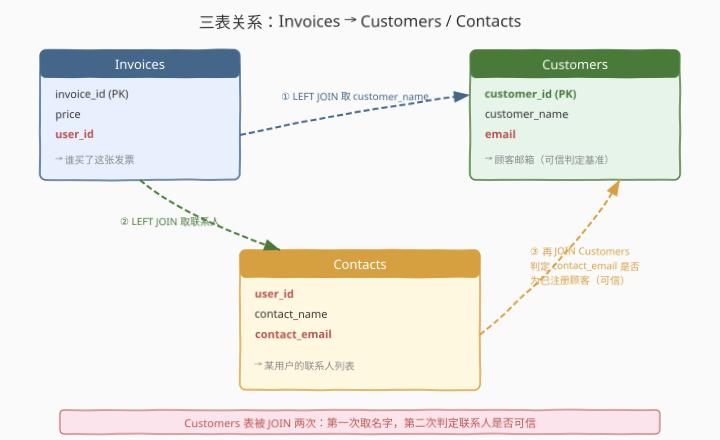
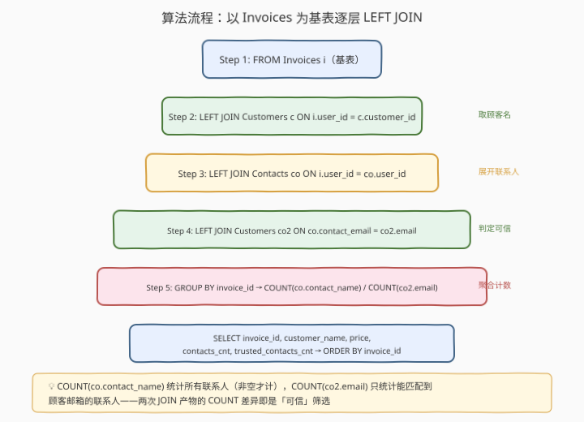
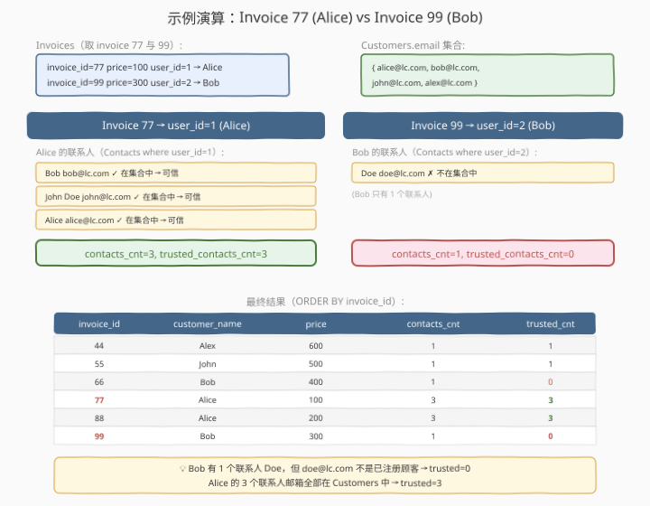

# 顾客的可信联系人数量

- **题目名称**：顾客的可信联系人数量
- **链接**：[1364. 顾客的可信联系人数量](https://leetcode.cn/problems/number-of-trusted-contacts-of-a-customer/)
- **难度**：中等
- **标签**：数据库、SQL、LEFT JOIN、多表关联、GROUP BY、条件聚合、COUNT、自连接、pandas

## 1. 题目概述

给定三张表：`Customers`（顾客）、`Contacts`（联系人）和 `Invoices`（发票）。请编写解决方案，为**每张发票**返回以下信息：

- `invoice_id`：发票编号
- `customer_name`：购买该发票的顾客姓名（若顾客不存在则输出 `"Unknown"`）
- `price`：发票价格
- `contacts_cnt`：该顾客的联系人总数
- `trusted_contacts_cnt`：该顾客的**可信联系人**数量——即联系人邮箱出现在 `Customers` 表中的联系人个数

> ⚠️ 题眼是「**Customers 表被 JOIN 两次**」：第一次以 `customer_id` 关联取顾客姓名，第二次以 `email` 关联判定联系人是否可信。两次 JOIN 的键不同，角色不同——这正是本题区别于普通三表 JOIN 的核心。

**表结构**：

```text
Table: Customers
+---------------+---------+
| Column Name   | Type    |
+---------------+---------+
| customer_id   | int     |  ← 主键，顾客 id
| customer_name | varchar |  ← 顾客姓名
| email         | varchar |  ← 顾客邮箱
+---------------+---------+

Table: Contacts
+---------------+---------+
| Column Name   | Type    |
+---------------+---------+
| user_id       | int     |  ← 关联 Customers.customer_id
| contact_name  | varchar |  ← 联系人姓名
| contact_email | varchar |  ← 联系人邮箱
+---------------+---------+
(user_id, contact_email) 为联合主键。

Table: Invoices
+--------------+---------+
| Column Name  | Type    |
+--------------+---------+
| invoice_id   | int     |  ← 主键，发票 id
| price        | int     |  ← 发票价格
| user_id      | int     |  ← 关联 Customers.customer_id
+--------------+---------+
```

- `Contacts.user_id` 指向 `Customers.customer_id`，即某顾客的联系人列表。
- `Contacts.contact_email` 若出现在 `Customers.email` 中，则该联系人是**已注册顾客**，即"可信联系人"。
- `Invoices.user_id` 指向购买该发票的顾客。

**示例 1**：

```text
输入：
Customers 表：
+-------------+---------------+--------------------+
| customer_id | customer_name | email              |
+-------------+---------------+--------------------+
| 1           | Alice         | alice@leetcode.com |
| 2           | Bob           | bob@leetcode.com   |
| 13          | John          | john@leetcode.com  |
| 6           | Alex          | alex@leetcode.com  |
+-------------+---------------+--------------------+

Contacts 表：
+-------------+--------------+--------------------+
| user_id     | contact_name | contact_email      |
+-------------+--------------+--------------------+
| 1           | Bob          | bob@leetcode.com   |
| 1           | John Doe     | john@leetcode.com  |
| 1           | Alice        | alice@leetcode.com |
| 2           | Doe          | doe@leetcode.com   |
| 6           | Alex         | alex@leetcode.com  |
| 13          | John         | john@leetcode.com  |
+-------------+--------------+--------------------+

Invoices 表：
+------------+-------+---------+
| invoice_id | price | user_id |
+------------+-------+---------+
| 77         | 100   | 1       |
| 88         | 200   | 1       |
| 99         | 300   | 2       |
| 66         | 400   | 2       |
| 55         | 500   | 13      |
| 44         | 600   | 6       |
+------------+-------+---------+

输出：
+------------+---------------+-------+--------------+----------------------+
| invoice_id | customer_name | price | contacts_cnt | trusted_contacts_cnt |
+------------+---------------+-------+--------------+----------------------+
| 44         | Alex          | 600   | 1            | 1                    |
| 55         | John          | 500   | 1            | 1                    |
| 66         | Bob           | 400   | 1            | 0                    |
| 77         | Alice         | 100   | 3            | 3                    |
| 88         | Alice         | 200   | 3            | 3                    |
| 99         | Bob           | 300   | 1            | 0                    |
+------------+---------------+-------+--------------+----------------------+
```

**解释**：

| invoice_id | 顾客 | 联系人列表 | 联系人邮箱是否在 Customers | contacts_cnt | trusted_cnt |
|------------|------|-----------|--------------------------|--------------|-------------|
| 77 / 88 | Alice (id=1) | Bob, John Doe, Alice | bob@✓, john@✓, alice@✓ | 3 | 3 |
| 66 / 99 | Bob (id=2) | Doe | doe@✗ | 1 | 0 |
| 55 | John (id=13) | John | john@✓ | 1 | 1 |
| 44 | Alex (id=6) | Alex | alex@✓ | 1 | 1 |

- Alice 有 3 个联系人，其邮箱全部是已注册顾客 → `trusted=3`。
- Bob 有 1 个联系人 Doe，但 `doe@leetcode.com` 不在 Customers 表中 → `trusted=0`。

**约束条件**：

- 结果按 `invoice_id` 升序排列。
- 若发票的 `user_id` 在 Customers 中无匹配，`customer_name` 输出 `"Unknown"`，`contacts_cnt` 和 `trusted_contacts_cnt` 均为 0。

---

## 2. 解题思路

### 2.1 暴力思路：逐发票子查询

最直觉的写法是对每张发票逐一查顾客、查联系人、再逐个联系人判定可信——相当于在 `SELECT` 里嵌套三层相关子查询。逻辑正确但 `Invoices` 每行都触发多次子查询扫描，且 SQL 极冗长。正确做法是用 **JOIN 一次铺平所有数据**，再用 `GROUP BY` 聚合。

### 2.2 核心观察：三表 LEFT JOIN + 条件聚合



关键洞察分三层：

**第一层：以 Invoices 为基表**。题目要求"每张发票一行"，因此 `FROM Invoices` 是天然的驱动表。用 `LEFT JOIN` 而非 `INNER JOIN`，保证即使某发票的 `user_id` 在 Customers 中无匹配（或该顾客无联系人），发票也不会丢失——对应列为 `NULL`，计数为 0。

**第二层：Customers 表被 JOIN 两次，键不同**。这是本题的灵魂：

| JOIN | 关联键 | 目的 | 别名 |
|------|--------|------|------|
| 第一次 | `i.user_id = c.customer_id` | 取购买发票的顾客姓名 | `c` |
| 第二次 | `co.contact_email = co2.email` | 判定联系人是否为已注册顾客 | `co2` |

第一次 JOIN 沿 `customer_id`（整数主键）走，回答"**谁买了这张发票**"；第二次 JOIN 沿 `email`（字符串）走，回答"**这个联系人是不是顾客**"。两次 JOIN 的键完全不同，因为它们回答的是两个独立的问题。

**第三层：COUNT 的非空语义天然区分"总数"与"可信数"**。LEFT JOIN 后：

- `COUNT(co.contact_name)`：统计所有联系人行（非空才计）→ `contacts_cnt`。
- `COUNT(co2.email)`：只有 `contact_email` 能匹配到某顾客邮箱时，`co2.email` 才非空 → `trusted_contacts_cnt`。

> 💡 **COUNT 的精髓**：`COUNT(col)` 只统计 `col IS NOT NULL` 的行。LEFT JOIN 未匹配时右表列全为 `NULL`，`COUNT` 自动跳过。因此"可信联系人计数"无需 `CASE WHEN` 或 `IF`——第二次 LEFT JOIN 的匹配结果本身就是一个隐式的布尔过滤：匹配则 `co2.email` 非空（计 1），不匹配则为 `NULL`（计 0）。这是用 JOIN 语义替代条件判断的优雅范式。

### 2.3 算法流程图



**以推荐解法（三层 LEFT JOIN + GROUP BY）为例的流水线**：

1. **基表**：`FROM Invoices i`——每张发票一行，作为驱动表。
2. **第一次 LEFT JOIN**：`LEFT JOIN Customers c ON i.user_id = c.customer_id`——获取 `customer_name`（无匹配则 `NULL`）。
3. **第二次 LEFT JOIN**：`LEFT JOIN Contacts co ON i.user_id = co.user_id`——展开该顾客的所有联系人，一行联系人 × 一行发票。
4. **第三次 LEFT JOIN**：`LEFT JOIN Customers co2 ON co.contact_email = co2.email`——判定每个联系人是否为已注册顾客（匹配则 `co2.email` 非空）。
5. **聚合**：`GROUP BY invoice_id`，`COUNT(co.contact_name)` 得联系人总数，`COUNT(co2.email)` 得可信联系人数。
6. **输出**：`ORDER BY invoice_id`。

> ⚠️ **为何必须 LEFT JOIN 而非 INNER JOIN？** 若某顾客没有联系人（Contacts 无行），`INNER JOIN Contacts` 会让该发票整行消失。LEFT JOIN 保留发票行，`co.*` 列为 `NULL`，`COUNT` 结果为 0——这正是"无联系人"的正确语义。

### 2.4 示例演算

以示例 1 数据，跟踪 Invoice 77 (Alice) 和 Invoice 99 (Bob) 两条路径：



**Invoice 77 (user_id=1, Alice, price=100)**：

- JOIN Customers `c`：`user_id=1` → Alice。
- JOIN Contacts `co`：Alice 有 3 个联系人 → 展开为 3 行。
- JOIN Customers `co2`：
  - `bob@leetcode.com` → 匹配 Bob → `co2.email` 非空 ✓
  - `john@leetcode.com` → 匹配 John → 非空 ✓
  - `alice@leetcode.com` → 匹配 Alice → 非空 ✓
- `COUNT(co.contact_name) = 3`，`COUNT(co2.email) = 3`。

**Invoice 99 (user_id=2, Bob, price=300)**：

- JOIN Customers `c`：`user_id=2` → Bob。
- JOIN Contacts `co`：Bob 有 1 个联系人 Doe → 展开为 1 行。
- JOIN Customers `co2`：`doe@leetcode.com` → 无匹配 → `co2.email` 为 `NULL` ✗
- `COUNT(co.contact_name) = 1`，`COUNT(co2.email) = 0`。

> 💡 **同一顾客多张发票**：Alice 有发票 77 和 88，每张发票独立 GROUP BY，各算一次 `COUNT`——结果相同（3, 3），但行独立。GROUP BY 的粒度是 `invoice_id` 而非 `user_id`，因为输出要求每张发票一行。

---

## 3. 参考代码

### MySQL（解法 A：三层 LEFT JOIN + GROUP BY，推荐）

```sql
# 1364. 顾客的可信联系人数量
# 思路：以 Invoices 为基表，LEFT JOIN 三次——取顾客名、展开联系人、判定可信
SELECT
    i.invoice_id,
    IFNULL(c.customer_name, 'Unknown') AS customer_name,
    i.price,
    COUNT(co.contact_name) AS contacts_cnt,
    COUNT(co2.email) AS trusted_contacts_cnt
FROM Invoices i
LEFT JOIN Customers c  ON i.user_id = c.customer_id
LEFT JOIN Contacts co  ON i.user_id = co.user_id
LEFT JOIN Customers co2 ON co.contact_email = co2.email
GROUP BY i.invoice_id, c.customer_name, i.price
ORDER BY i.invoice_id;
```

> 💡 **写法要点**：
> - **Customers 起两个别名 `c` 与 `co2`**：同一张表在一条查询中被 JOIN 两次，必须用不同别名区分角色——`c` 负责"顾客身份"，`co2` 负责"可信判定"。这是 SQL 中"同表多角色"的标准手法，与自连接（Self-JOIN）同源。
> - **`IFNULL(c.customer_name, 'Unknown')`**：若发票的 `user_id` 在 Customers 无匹配，LEFT JOIN 使 `c.customer_name` 为 `NULL`，`IFNULL` 将其替换为 `'Unknown'`。
> - **`COUNT(co.contact_name)` 而非 `COUNT(*)`**：`COUNT(*)` 会统计所有行（含 NULL 行），而 `COUNT(col)` 只统计 `col IS NOT NULL` 的行。当顾客无联系人时，LEFT JOIN 产生一行 `co.*` 全 NULL 的行，`COUNT(co.contact_name)` 正确返回 0，而 `COUNT(*)` 会错误返回 1。
> - **`GROUP BY` 列表完整**：`GROUP BY i.invoice_id, c.customer_name, i.price` 列出所有非聚合列，兼容 `ONLY_FULL_GROUP_BY` 严格模式。由于 `invoice_id` 是主键，其余列函数依赖于它，部分 MySQL 版本允许只写 `GROUP BY i.invoice_id`，但完整写法更可移植。

### MySQL（解法 B：CTE 预聚合 + 子查询）

```sql
# 解法 B：先用 CTE 预算每用户的联系人统计，再 JOIN Invoices
WITH contact_stats AS (
    SELECT
        co.user_id,
        COUNT(co.contact_name) AS contacts_cnt,
        COUNT(c.email) AS trusted_contacts_cnt
    FROM Contacts co
    LEFT JOIN Customers c ON co.contact_email = c.email
    GROUP BY co.user_id
)
SELECT
    i.invoice_id,
    IFNULL(c.customer_name, 'Unknown') AS customer_name,
    i.price,
    IFNULL(cs.contacts_cnt, 0) AS contacts_cnt,
    IFNULL(cs.trusted_contacts_cnt, 0) AS trusted_contacts_cnt
FROM Invoices i
LEFT JOIN Customers c ON i.user_id = c.customer_id
LEFT JOIN contact_stats cs ON i.user_id = cs.user_id
ORDER BY i.invoice_id;
```

> 💡 **写法要点**：
> - **CTE `contact_stats` 把"每用户的联系人统计"预算一次**：先对 `Contacts` 做 `GROUP BY user_id`，每用户一行，附带 `contacts_cnt` 和 `trusted_contacts_cnt`。再 LEFT JOIN 到 Invoices——每张发票直接读到该用户的统计值，无需在发票维度展开多行再聚合。
> - **`IFNULL(cs.contacts_cnt, 0)`**：若顾客无联系人，`contact_stats` 中无该 `user_id` 的行，LEFT JOIN 使 `cs.*` 为 `NULL`，`IFNULL` 补 0。
> - **性能优势**：解法 A 中 Alice 有 3 个联系人，则 Alice 的 2 张发票各展开为 3 行（共 6 行），再 GROUP BY 收回 2 行；解法 B 中 `contact_stats` 只对 Contacts 聚合一次（Alice 3 行 → 1 行），Invoices 直接 JOIN 读结果，不产生乘积膨胀。当联系人数量大、发票数量多时，解法 B 的中间结果更小。
> - **需 MySQL 8.0+**：CTE 是 8.0 引入的特性。

### Python（pandas）

```python
import pandas as pd

def count_trusted_contacts(
    customers: pd.DataFrame,
    contacts: pd.DataFrame,
    invoices: pd.DataFrame,
) -> pd.DataFrame:
    # 第一阶段：预算每用户的联系人统计
    # trusted = contact_email 是否出现在 Customers.email 中
    customer_emails = set(customers['email'])
    contacts = contacts.copy()
    contacts['is_trusted'] = contacts['contact_email'].isin(customer_emails)

    stats = (
        contacts.groupby('user_id')
        .agg(
            contacts_cnt=('contact_name', 'count'),
            trusted_contacts_cnt=('is_trusted', 'sum'),
        )
        .reset_index()
    )

    # 第二阶段：Invoices LEFT JOIN Customers 取名字，LEFT JOIN stats 取计数
    result = invoices.merge(
        customers[['customer_id', 'customer_name']],
        left_on='user_id',
        right_on='customer_id',
        how='left',
    ).merge(
        stats,
        left_on='user_id',
        right_on='user_id',
        how='left',
    )

    # 填充缺失值
    result['customer_name'] = result['customer_name'].fillna('Unknown')
    result['contacts_cnt'] = result['contacts_cnt'].fillna(0).astype(int)
    result['trusted_contacts_cnt'] = result['trusted_contacts_cnt'].fillna(0).astype(int)

    # 输出
    result = result[['invoice_id', 'customer_name', 'price',
                     'contacts_cnt', 'trusted_contacts_cnt']]
    result = result.sort_values('invoice_id').reset_index(drop=True)
    return result
```

> 💡 **pandas 对照**：
> - `contacts['contact_email'].isin(customer_emails)` 对应 `LEFT JOIN Customers co2 ON co.contact_email = co2.email`——`isin` 返回布尔 Series，等价于"能否匹配到顾客邮箱"。
> - `groupby('user_id').agg(contacts_cnt=('contact_name', 'count'), ...)` 对应 CTE 中的 `GROUP BY user_id, COUNT(co.contact_name)`——`count` 只统计非空值，与 SQL `COUNT(col)` 语义一致。
> - `trusted_contacts_cnt=('is_trusted', 'sum')`：布尔值 `True=1, False=0`，`sum` 即可信联系人数，对应 `COUNT(co2.email)`（只计非空匹配行）。
> - `merge(..., how='left')` 对应 `LEFT JOIN`——保留 Invoices 全部行，无匹配则 `NaN`。
> - `fillna('Unknown')` / `fillna(0)` 对应 SQL 的 `IFNULL`。

---

## 4. 复杂度分析

| 维度 | 解法 A（三层 LEFT JOIN） | 解法 B（CTE 预聚合） | pandas |
|------|--------------------------|---------------------|--------|
| **时间** | $O(n \cdot k)$ | $O(n + m + k)$ | $O(n + m + k)$ |
| **空间** | $O(n \cdot k)$ | $O(m + n)$ | $O(m + n)$ |
| **中间行膨胀** | 有（发票 × 联系人） | 无 | 无 |
| **依赖** | 通用 MySQL | MySQL 8.0+ | pandas |

> - $n$ = `Invoices` 行数，$m$ = `Contacts` 行数，$k$ = 每顾客平均联系人数。
> - **解法 A**：LEFT JOIN 展开后中间结果为 $n \times k$ 行（每张发票 × 每个联系人），GROUP BY 在膨胀后的行上聚合。当 $k$ 较大时中间结果膨胀明显，但 GROUP BY 后收回 $n$ 行。优化器可能将 `GROUP BY` 下推到 JOIN 前执行（即自动转为解法 B 的计划），取决于数据库实现。
> - **解法 B**：CTE 先在 $m$ 行 `Contacts` 上聚合（$O(m)$），产出 $u$ 行（$u$ = 不同用户数），再 JOIN $n$ 行 Invoices（$O(n + u)$）。无行膨胀，中间结果最精简。
> - **索引优化**：在 `Customers(customer_id)`（主键已有）、`Customers(email)`、`Contacts(user_id)`、`Contacts(contact_email)` 上建索引，可使各 JOIN 走索引查找而非全表扫描。

---

## 5. 扩展：「同表多角色 JOIN」与 COUNT 非空语义

### 5.1 同表被 JOIN 多次的两种范式

本题中 `Customers` 被 JOIN 两次，键不同（`customer_id` vs `email`）。这与"自连接"（Self-JOIN）形似但神不同：

| 范式 | 特征 | 代表题 |
|------|------|--------|
| **同表多角色 JOIN**（本题） | 同一张表以**不同键**被 JOIN 多次，每次回答不同问题 | 1364 顾客可信联系人 |
| **自连接 Self-JOIN** | 同一张表以**同键**与自身 JOIN，用于层级/比较 | 181 超过经理收入的员工、184 部门最高薪 |

> 💡 **判断口诀**：若两次 JOIN 同表但**关联键不同**→「多角色 JOIN」（各取所需字段）；若**关联键相同或为同表内关系**→「自连接」（通常用于同表行间比较）。

### 5.2 COUNT(col) vs COUNT(*) vs COUNT(1)

LEFT JOIN 场景下三种 COUNT 的行为差异是 SQL 高频考点：

| 写法 | 统计对象 | LEFT JOIN 未匹配行 | 本题适用 |
|------|----------|-------------------|----------|
| `COUNT(*)` | 所有行（含全 NULL 行） | 计 1 ❌ | ✗ 会多算 |
| `COUNT(1)` | 所有行（等价 `COUNT(*)`） | 计 1 ❌ | ✗ 会多算 |
| `COUNT(col)` | `col IS NOT NULL` 的行 | 计 0 ✓ | ✓ 正确 |

> ⚠️ 本题若误用 `COUNT(*)`，当顾客无联系人时 LEFT JOIN 产生一行 `co.*` 全 NULL 的行，`COUNT(*)` 返回 1 而非 0——结果错误。**LEFT JOIN + COUNT 的黄金组合是 `COUNT(右表非空列)`**。

### 5.3 用 JOIN 语义替代 CASE WHEN

"可信联系人计数"有两种实现：

| 写法 | 机制 | 风格 |
|------|------|------|
| `COUNT(co2.email)`（本题） | 第二次 LEFT JOIN 匹配则非空、不匹配则 NULL，COUNT 自动筛选 | JOIN 语义驱动 |
| `SUM(IF(co.contact_email IN (SELECT email FROM Customers), 1, 0))` | 逐行判定 + 求和 | 条件表达式驱动 |

> 💡 JOIN 写法把"是否可信"编码进 NULL/非 NULL，由 COUNT 的非空语义自动过滤，无需显式条件判断——更简洁且优化器友好（JOIN 可走索引，`IN` 子查询可能退化）。

---

## 6. 面试要点

1. **为什么 Customers 表要 JOIN 两次？能用一次吗？**

   > 两次 JOIN 回答两个不同问题：第一次沿 `customer_id` 取"谁买了发票"，第二次沿 `email` 判定"联系人是否为顾客"。关联键不同，无法合并为一次 JOIN。若强行用 `CASE WHEN co.contact_email IN (SELECT email FROM Customers)` 替代第二次 JOIN，则退化为相关子查询，性能更差。

2. **为什么用 LEFT JOIN 而不是 INNER JOIN？**

   > 保证每张发票都在结果中。若某发票的 `user_id` 无对应顾客，或某顾客无联系人，INNER JOIN 会使该发票丢失。LEFT JOIN 保留发票行，右表列为 NULL，COUNT 自然返回 0，`IFNULL` 将顾客名补为 `'Unknown'`。

3. **`COUNT(co.contact_name)` 和 `COUNT(*)` 的区别是什么？**

   > LEFT JOIN 未匹配时产生一行右表全 NULL 的行。`COUNT(*)` 统计所有行（含 NULL 行），会错误计 1；`COUNT(co.contact_name)` 只统计非空行，正确计 0。LEFT JOIN + COUNT 的标准写法是 `COUNT(右表某非空列)`。

4. **解法 A 和解法 B 的性能差异？**

   > 解法 A 在 JOIN 后产生 $n \times k$ 行中间结果（发票 × 联系人），再 GROUP BY 收回；解法 B 先在 Contacts 上预聚合（$m$ 行 → $u$ 行），再 JOIN Invoices，无行膨胀。当联系人数量大时 B 更优；但优化器可能将 A 的 GROUP BY 下推，实际执行计划可能等价。面试中解法 A 更直观（一气呵成），解法 B 更工程化（关注中间结果大小）。

5. **如果 Invoices 的 user_id 在 Customers 中不存在会怎样？**

   > LEFT JOIN 使 `c.customer_name` 为 NULL，`IFNULL` 替换为 `'Unknown'`。该顾客在 Contacts 中也无联系人（`Contacts.user_id` 指向 `Customers.customer_id`），故第二次 LEFT JOIN `co.*` 也全 NULL，`COUNT` 返回 0。`contacts_cnt=0, trusted_contacts_cnt=0`，符合预期。

> 💡 **一句话总结**：1364 是 SQL **「同表多角色 JOIN」招牌题**——Customers 被 JOIN 两次（`customer_id` 取名字 / `email` 判可信），核心技巧是第三次 LEFT JOIN 把"是否可信"编码为 NULL/非 NULL，由 `COUNT(co2.email)` 的非空语义自动计数。推荐三层 LEFT JOIN + GROUP BY（直观）或 CTE 预聚合（无行膨胀）。切记 LEFT JOIN + COUNT 用 `COUNT(右表非空列)` 而非 `COUNT(*)`。

---

## 7. 同类练习题

- [181. 超过经理收入的员工](https://leetcode.cn/problems/employees-earning-more-than-their-managers/)：自连接招牌题——同一张 `Employee` 表 JOIN 自身比较薪资，对照本题「同表 JOIN 两次」但键不同的区别
- [184. 部门工资最高的员工](https://leetcode.cn/problems/department-highest-salary/)（[题解](../0101-0200/184_部门工资最高的员工.md)）：`Employee JOIN Department` 取部门名 + 分组取最高薪——多表 JOIN + 聚合取极值的经典组合
- [1068. 产品销售分析 I](https://leetcode.cn/problems/product-sales-analysis-i/)：`Sales JOIN Product` 取产品名——最基础的多表 JOIN 入门，对照本题的 JOIN 层次递进
- [550. 游戏玩法分析 IV](https://leetcode.cn/problems/game-play-analysis-iv/)（[题解](../0501-0600/550_游戏玩法分析IV.md)）：`GROUP BY player + MIN(event_date)` 后再算比例——分组聚合 + 二次统计，承接「先聚合再 JOIN」的预聚合思想
- [1174. 即时食物配送 II](https://leetcode.cn/problems/immediate-food-delivery-ii/)（[题解](../1101-1200/1174_即时食物配送II.md)）：`GROUP BY customer + MIN(order_date)` 求首单后算占比——CTE 预聚合 + JOIN 主表的范式，对照解法 B 的工程化写法
