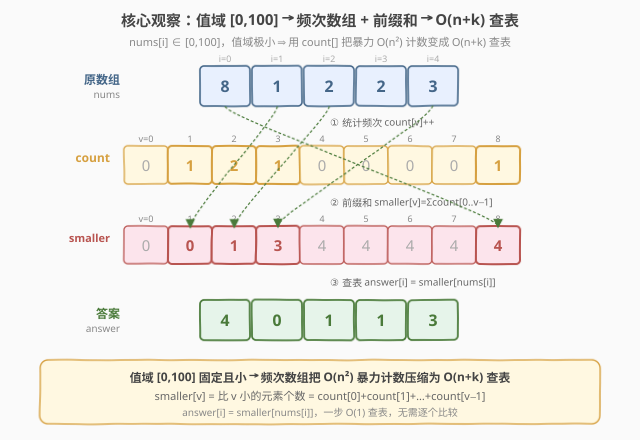
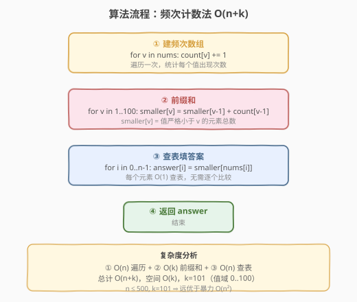
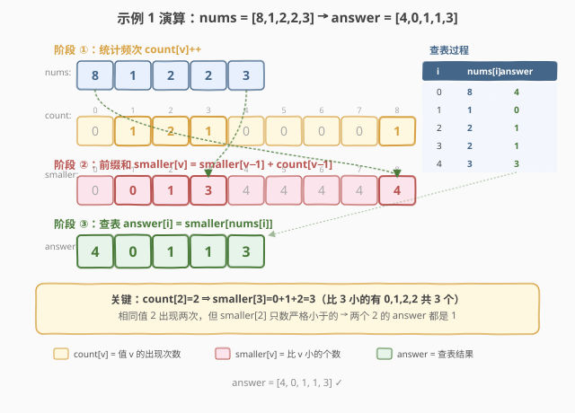

# LeetCode 有多少小于当前数字的数字 题解

## 1. 题目概述

- **标题 / 题号**：有多少小于当前数字的数字（#1365，easy）
- **链接**：https://leetcode.cn/problems/how-many-numbers-are-smaller-than-the-current-number/
- **难度**：简单
- **标签**：数组、哈希表、计数排序

**题意**：给你一个数组 `nums`，对于其中每个元素 `nums[i]`，请你统计数组中**比它小的所有数字的数目**（即满足 `j != i` 且 `nums[j] < nums[i]` 的 `j` 的个数）。将所有结果组成一个数组返回。

**示例 1**：

```text
输入：nums = [8,1,2,2,3]
输出：[4,0,1,1,3]
解释：
  对于 nums[0]=8，有 4 个比它小的数（1, 2, 2, 3）
  对于 nums[1]=1，没有比它小的数
  对于 nums[2]=2，有 1 个比它小的数（1）
  对于 nums[3]=2，有 1 个比它小的数（1）
  对于 nums[4]=3，有 3 个比它小的数（1, 2, 2）
```

**示例 2**：

```text
输入：nums = [6,5,4,8]
输出：[2,1,0,3]
```

**示例 3**：

```text
输入：nums = [7,7,7,7]
输出：[0,0,0,0]
```

**约束**：

- `2 <= nums.length <= 500`
- `0 <= nums[i] <= 100`

> 💡 本题的灵魂是「**值域极小**」——`nums[i] ∈ [0, 100]`，值域大小 $k = 101$ 远小于 $n^2$。这让暴力 $O(n^2)$ 的逐个比较可以被「频次数组 + 前缀和」替代：先用 $O(n)$ 统计每个值出现几次，再用 $O(k)$ 算出「比每个值小的元素总数」，最后 $O(1)$ 查表填答案。整体 $O(n + k)$，是计数排序思想在「查询型」问题上的经典应用。

## 2. 解题思路

### 2.1 暴力思路：逐个比较

最直观的做法：对每个 `nums[i]`，遍历整个数组数有多少个元素比它小。

- **正确但低效**：对每个元素都要扫一遍数组，共 $n$ 个元素，总比较次数 $n \times (n-1) = O(n^2)$；
- **数据小能过**：$n \le 500$，$n^2 \le 2.5 \times 10^5$，毫秒级通过；
- **浪费值域信息**：题目保证 `nums[i] ∈ [0, 100]`，值域仅 101 种可能，却用通用的两两比较，完全没利用这一结构。

> ⚠️ 暴力不是错，只是把「值域极小」这把钥匙闲置了。看到 `0 <= nums[i] <= 100` 这种约束，就应该条件反射想到计数排序——用值域数组替代逐个比较。

### 2.2 核心观察：频次数组 + 前缀和（计数排序思想）



**关键洞察**：「比 `nums[i]` 小的元素个数」等价于「值在 `[0, nums[i]-1]` 范围内的元素总数」。如果预先知道每个值出现了几次（频次数组 `count`），那么「比 `v` 小的元素总数」就是 `count[0] + count[1] + ... + count[v-1]`——这正是 `count` 的**前缀和**。

三步走：

1. **统计频次**：遍历 `nums`，对每个值 `v` 执行 `count[v]++`，得到值域 `[0, 100]` 上每个值的出现次数；
2. **前缀和**：`smaller[v] = smaller[v-1] + count[v-1]`，即 `smaller[v]` = 值严格小于 `v` 的元素总数；
3. **查表填答案**：`answer[i] = smaller[nums[i]]`，每个元素 $O(1)$ 查表。

> 以示例 1 的 `nums = [8,1,2,2,3]` 为例：`count[1]=1, count[2]=2, count[3]=1, count[8]=1`（其余为 0）。前缀和 `smaller[2] = count[0]+count[1] = 0+1 = 1`，即比 2 小的只有 1 个（就是那个 1）。而 `smaller[8] = 0+1+2+1+0+0+0+0 = 4`，即比 8 小的有 4 个。相同的两个 2 共享同一个 `smaller[2]=1`，无需重复计算。

> ⚠️ **为什么 `smaller[v]` 用 `count[v-1]` 而非 `count[v]`？** 因为题目要求「严格小于」，`count[v]` 是等于 `v` 的元素个数，不应计入。前缀和递推 `smaller[v] = smaller[v-1] + count[v-1]` 恰好累加的是 `[0, v-1]` 的频次，即严格小于 `v` 的总数。

### 2.3 算法流程图



**完整步骤**：

1. **建频次数组**：`count = [0] * 101`，遍历 `nums` 执行 `count[v]++`；
2. **前缀和**：`smaller = [0] * 101`，从 `v=1` 到 `100` 执行 `smaller[v] = smaller[v-1] + count[v-1]`；
3. **查表**：遍历 `nums`，`answer[i] = smaller[nums[i]]`；
4. **返回** `answer`。

> 💡 三阶段复杂度分别为 $O(n)$、$O(k)$、$O(n)$，总计 $O(n + k)$。其中 $k = 101$ 是常数，实际中 $k \ll n^2$（$n=500$ 时 $n^2 = 2.5 \times 10^5$，而 $k = 101$），这是从 $O(n^2)$ 到 $O(n)$ 的关键跨越。

### 2.4 示例演算

以示例 1 的 `nums = [8,1,2,2,3]` 为例：



**阶段 ①：统计频次**

| 值 `v` | 0 | 1 | 2 | 3 | 4 | 5 | 6 | 7 | 8 |
|--------|---|---|---|---|---|---|---|---|---|
| `count[v]` | 0 | 1 | 2 | 1 | 0 | 0 | 0 | 0 | 1 |

遍历 `nums`：`8→count[8]++`，`1→count[1]++`，`2→count[2]++`，`2→count[2]++`，`3→count[3]++`。

**阶段 ②：前缀和 `smaller[v] = smaller[v-1] + count[v-1]`**

| 值 `v` | 0 | 1 | 2 | 3 | 4 | 5 | 6 | 7 | 8 |
|--------|---|---|---|---|---|---|---|---|---|
| `smaller[v]` | 0 | 0 | 1 | 3 | 4 | 4 | 4 | 4 | 4 |

递推过程：`smaller[1] = smaller[0] + count[0] = 0+0 = 0`；`smaller[2] = smaller[1] + count[1] = 0+1 = 1`；`smaller[3] = smaller[2] + count[2] = 1+2 = 3`；`smaller[4] = 3+1 = 4`；之后 `count[5..7]` 全为 0，`smaller` 维持 4 不变；`smaller[8] = 4+0 = 4`。

**阶段 ③：查表 `answer[i] = smaller[nums[i]]`**

| `i` | `nums[i]` | `answer[i] = smaller[nums[i]]` |
|-----|-----------|-------------------------------|
| 0 | 8 | `smaller[8] = 4` |
| 1 | 1 | `smaller[1] = 0` |
| 2 | 2 | `smaller[2] = 1` |
| 3 | 2 | `smaller[2] = 1` |
| 4 | 3 | `smaller[3] = 3` |

**结果**：`answer = [4, 0, 1, 1, 3]` ✓

> 💡 注意 `i=2` 和 `i=3` 的 `nums[i]` 都是 2，它们查到同一个 `smaller[2]=1`——相同的值共享相同的答案，这正是「查表」比「逐个比较」高效的根本原因：相同值只需算一次。而暴力法对两个 2 各扫一遍数组，重复计算了。

## 3. 参考代码

### C++

```cpp
// 有多少小于当前数字的数字.cpp —— 频次计数法，O(n + k)
// 编译: g++ -O2 -std=c++17 有多少小于当前数字的数字.cpp -o smaller
#include <vector>
using namespace std;

class Solution {
public:
    vector<int> smallerNumbersThanCurrent(vector<int>& nums) {
        int n = nums.size();
        vector<int> count(101, 0);
        for (int v : nums) count[v]++;              // ① 统计频次

        vector<int> smaller(101, 0);
        for (int v = 1; v <= 100; v++) {            // ② 前缀和
            smaller[v] = smaller[v - 1] + count[v - 1];
        }

        vector<int> answer(n);
        for (int i = 0; i < n; i++) {               // ③ 查表
            answer[i] = smaller[nums[i]];
        }
        return answer;
    }
};
```

### Python

```python
class Solution:
    def smallerNumbersThanCurrent(self, nums: list[int]) -> list[int]:
        count = [0] * 101
        for v in nums:
            count[v] += 1                            # ① 统计频次

        smaller = [0] * 101
        for v in range(1, 101):                      # ② 前缀和
            smaller[v] = smaller[v - 1] + count[v - 1]

        return [smaller[v] for v in nums]            # ③ 查表
```

> 💡 两版等价，核心是「**频次 → 前缀和 → 查表**」三步。Python 版最后一步用列表推导式一步完成查表填答案，更简洁。注意 `count` 和 `smaller` 的大小都是 101（覆盖值 0..100），`smaller[0]` 恒为 0（没有比 0 更小的非负数）。

## 4. 复杂度分析

| 维度 | 频次计数法 $O(n+k)$（推荐） | 排序+哈希 $O(n\log n)$ | 暴力 $O(n^2)$ |
|------|---------------------------|----------------------|--------------|
| 时间复杂度 | $O(n + k)$ | $O(n\log n)$ | $O(n^2)$ |
| 空间复杂度 | $O(k)$ | $O(n)$ | $O(1)$ |
| 实际运算量 | `n=500,k=101` 约 1100 步 | 约 $500 \times 9 = 4500$ | 约 $2.5 \times 10^5$ |

- **频次计数法**：利用值域 $k=101$ 极小的特性，把逐个比较变成查表。$n=500$ 时约 1100 步，比暴力快 200 倍。$k$ 是常数，实际时间 $O(n)$。
- **排序+哈希**：排序后，每个值的**首次出现下标**即为比它小的元素个数。用哈希表记录首次下标，查表 $O(1)$。不依赖值域大小，通用性更强。
- **暴力**：$O(n^2)$，数据小能过，但不体现对值域结构的利用。

> ⚠️ 频次计数法是**值域约束 $0 \le nums[i] \le 100$ 下的最优解**。若去掉值域约束（值域无上限），则退化为排序+哈希 $O(n\log n)$。面试中应先指出值域特性，再选择计数法。

## 5. 扩展：排序 + 哈希表（通用解法）

若值域没有上界约束（`nums[i]` 可为任意整数），频次数组不可用。此时用**排序 + 哈希表**：排序后，每个值的首次出现下标 = 比它严格小的元素个数。

```python
class Solution:
    def smallerNumbersThanCurrent(self, nums: list[int]) -> list[int]:
        sorted_nums = sorted(nums)
        smaller = {}
        for i, v in enumerate(sorted_nums):
            if v not in smaller:       # 只记录首次出现下标
                smaller[v] = i         # i = 排序后该值首次位置 = 比它小的个数
        return [smaller[v] for v in nums]
```

> 💡 排序后 `sorted_nums = [1,2,2,3,8]`，首次下标：`1→0, 2→1, 3→3, 8→4`。`smaller[2]=1` 表示比 2 小的有 1 个（首个 2 前面只有 1 个元素）。`if v not in smaller` 保证只记首次出现——相同值的 answer 相同，后续出现的同值不覆盖。与 [1331. 数组序号转换](../1301-1400/1331_数组序号转换.md)「排序后去重映射到排名」的思路同构。

> ⚠️ **两种解法的适用边界**：频次计数法要求值域 $k$ 已知且 $k \ll n^2$（本题 $k=101$ 完美满足）；排序+哈希不受值域限制但多了 $\log n$ 因子。看到 `nums[i]` 有小范围约束时优先计数法，否则用排序+哈希。

## 6. 面试要点

1. **如何想到用频次数组？**

   > 看到约束 `0 <= nums[i] <= 100`——值域仅 101 种可能，这是计数排序的信号。「比 `v` 小的元素个数」= 值在 `[0, v-1]` 的频次之和 = 频次数组的前缀和。一旦意识到这点，$O(n^2)$ 的逐个比较就可以被 $O(n+k)$ 的「统计+前缀和+查表」替代。

2. **为什么 `smaller[v] = smaller[v-1] + count[v-1]` 而不是 `+ count[v]`？**

   > 题目要求「严格小于」，`count[v]` 是等于 `v` 的个数，不应计入。递推式累加的是 `count[0..v-1]`，恰好是严格小于 `v` 的总数。若题目改为「小于等于」，则递推式变为 `smaller[v] = smaller[v-1] + count[v-1] + count[v]`，或直接用 `smaller[v] + count[v]` 查询。

3. **相同值的元素答案相同吗？为什么？**

   > 相同。两个 2 的 `answer` 都是 `smaller[2]=1`，因为「比 2 小的元素个数」与 2 在数组中的位置无关，只取决于值本身。这正是查表法的优势——相同值共享一次计算，而暴力法对每个 2 各扫一遍数组，重复劳动。

4. **频次计数法和排序+哈希怎么选？**

   > 频次计数法 $O(n+k)$ 依赖值域 $k$ 小（本题 $k=101$）；排序+哈希 $O(n\log n)$ 不受值域限制。$k \ll n\log n$ 时计数法更优（$101 < 500 \times 9$）；值域无界或极大时用排序+哈希。面试中先指出值域约束，再选计数法，展示对数据特性的敏感度。

5. **前缀和 `smaller` 数组的边界怎么处理？**

   > `smaller[0] = 0`（没有比 0 小的非负数），这是天然基准。递推从 `v=1` 开始：`smaller[1] = smaller[0] + count[0]`。`count` 和 `smaller` 数组大小都取 101，覆盖值 `0..100`，访问 `count[nums[i]]` 和 `smaller[nums[i]]` 不会越界。

> 💡 **一句话总结**：1365 的灵魂是「**值域极小 → 计数排序思想**」——频次统计 + 前缀和把 $O(n^2)$ 逐个比较压缩为 $O(n+k)$ 查表。看到 `nums[i]` 有小范围值域约束，就条件反射想计数数组。

## 同类练习题

| # | 题目 | 与本题的关联 |
|---|------|-------------|
| 1331 | [数组序号转换](https://leetcode.cn/problems/rank-transform-of-an-array/) | 将数组元素按大小映射到排名，与本题「值→比它小的个数」的映射同构；排序后首次下标即为排名，是本题第 5 节排序+哈希解法的直接推广 |
| 274 | [H 指数](https://leetcode.cn/problems/h-index/) | 同样利用「值域有界」用计数排序替代排序，`count[h]` 统计被引次数，从高到低累加找最大 h——与本题频次+前缀和的结构镜像对称 |
| 347 | [前 K 个高频元素](https://leetcode.cn/problems/top-k-frequent-elements/) | 先用哈希表统计频次（与本题阶段 ① 同构），再用堆或桶排选 Top-K，是频次统计思想的下游应用 |
| 1200 | [最小绝对差](https://leetcode.cn/problems/minimum-absolute-difference/) | 排序后相邻元素差最小，与本题排序+哈希解法共享「排序暴露相邻关系」的思路，对照计数法对值域的利用 |
| 704 | [二分查找](../0701-0800/704_二分查找.md) | 本题第 5 节排序后找首次下标可用二分优化（`bisect_left`），是二分「找下界」模板的谓词版应用 |
