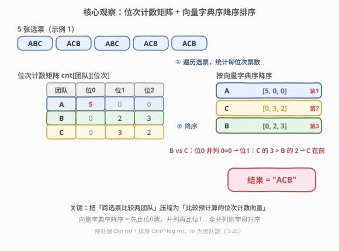
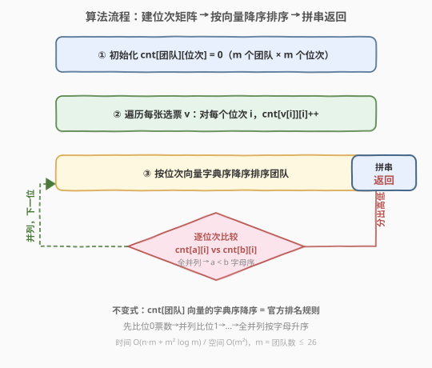
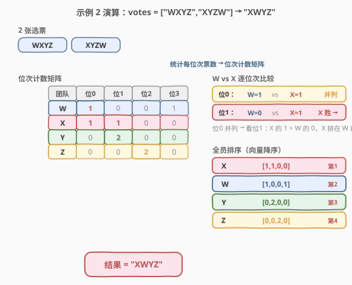

# LeetCode 通过投票对团队排名 题解

## 1. 题目概述

- **标题 / 题号**：通过投票对团队排名（#1366，medium）
- **链接**：https://leetcode.cn/problems/rank-teams-by-votes/
- **难度**：中等
- **标签**：数组、哈希表、字符串、排序、计数

**题意**：现在有一个特殊的排名系统，依据参赛团队在投票人心中的次序进行排名。每个投票者都需要按从高到低的顺序对参与排名的所有团队进行排位。排名规则如下：

- 参赛团队的排名次序依照其所获「排位第一」的票的多少决定。如果存在多个团队并列的情况，将继续考虑其「排位第二」的票的数量。以此类推，直到不再存在并列的情况。
- 如果在考虑完所有投票情况后仍然出现并列现象，则根据团队字母的字母顺序进行排名。

给你一个字符串数组 `votes` 代表全体投票者给出的排位情况，请你根据上述排名规则对所有参赛团队进行排名，返回能表示按排名系统**排序后**的所有团队排名的字符串。

**示例 1**：

```text
输入：votes = ["ABC","ACB","ABC","ACB","ACB"]
输出："ACB"
解释：
A 队获得五票「排位第一」，没有其他队获得「排位第一」，所以 A 队排名第一。
B 队获得两票「排位第二」，三票「排位第三」。
C 队获得三票「排位第二」，两票「排位第三」。
由于 C 队「排位第二」的票数较多，所以 C 队排第二，B 队排第三。
```

**示例 2**：

```text
输入：votes = ["WXYZ","XYZW"]
输出："XWYZ"
解释：
X 队在并列僵局打破后成为排名第一的团队。X 队和 W 队的「排位第一」票数一样，
但是 X 队有一票「排位第二」，而 W 没有获得「排位第二」。
```

**示例 3**：

```text
输入：votes = ["ZMNAGUEDSJYLBOPHRQICWFXTVK"]
输出："ZMNAGUEDSJYLBOPHRQICWFXTVK"
解释：只有一个投票者，所以排名完全按照他的意愿。
```

**约束**：

- $1 \le \text{votes.length} \le 1000$
- $1 \le \text{votes[i].length} \le 26$
- $\text{votes[i].length} = \text{votes[j].length}$（所有选票长度相同）
- `votes[i][j]` 是英文**大写**字母
- `votes[i]` 中的所有字母都是唯一的
- `votes[0]` 中出现的所有字母**同样也**出现在 `votes[j]` 中（$1 \le j < \text{votes.length}$）

> 💡 本题的灵魂是「**多关键字排序**」——每个团队的「排名依据」不是一个数，而是一个**位次计数向量** $[\text{位0票数}, \text{位1票数}, \ldots]$。比较两个团队就是比较这两个向量的字典序（高位优先，大者在前），全并列再按字母序兜底。核心在于把这个「跨所有选票的统计」**预计算成一张矩阵**，把「比较时即时扫选票」的重复劳动压缩为「查表比向量」。

## 2. 解题思路

### 2.1 暴力思路：比较时即时统计位次票数

最直观的做法：直接写一个比较函数比较两个团队 `a`、`b`。比较时，对每个位次 `pos`，遍历**所有选票**统计 `a` 和 `b` 在该位次的出现次数，找到第一个两者不同的位次定高低。

```text
compare(a, b):
    对 pos = 0, 1, ..., m-1:
        ca = 统计 a 在 pos 位次的出现次数（遍历 n 张选票）
        cb = 统计 b 在 pos 位次的出现次数（遍历 n 张选票）
        若 ca != cb：返回 cb - ca   # 票多者在前
    返回 a - b                     # 全并列，字母升序
```

- **正确但重复**：排序过程中，同一个团队 `a` 参与约 $O(\log m)$ 次比较，每次比较都要**重新统计** `a` 在所有位次的出现次数——`a` 的位次计数被反复计算；
- **时间复杂度**：每次比较 $O(n \cdot m)$（$m$ 个位次 × 每次 $n$ 张选票），排序 $O(m \log m)$ 次比较，总计 $O(n \cdot m^2 \cdot \log m)$。$n=1000, m=26$ 时约 $10^7$ 量级，能过但浪费明显；
- **可优化点**：位次计数是**全局不变**的——一个团队在每位次的出现次数与「在和谁比较」无关，完全可以预先算好。

> ⚠️ 暴力的根本问题是「**用空间换时间的机会被忽略了**」——位次计数是只读的全局统计量，却在每次比较时即时重算。预计算一次，比较时只查表，就能把 $O(n \cdot m)$ 的单次比较压到 $O(m)$。

### 2.2 核心观察：位次计数矩阵 + 向量字典序排序



**关键洞察**：两个团队 `a`、`b` 的相对名次**完全由各自的位次计数向量决定**，与具体是哪些选票无关。比较 `a`、`b` 等价于比较两个向量 $\text{cnt}[a]$ 与 $\text{cnt}[b]$ 的**字典序**：

- 第一个分量的较大者排前（位0票多者领先）；
- 若第一个分量相等，看第二个分量（位0并列则比位1）；
- 依此类推，直到分出高低；
- 若所有分量都相等（全并列），按字母升序。

因此只需**预计算一张位次计数矩阵** $\text{cnt}[\text{团队}][\text{位次}]$，再按向量字典序降序排序团队即可。这是一次典型的**空间换时间**：用 $O(m^2)$ 的矩阵存储，把每次比较的 $O(n \cdot m)$ 即时统计压成 $O(m)$ 的向量比较。

> 以示例 1 的 `votes = ["ABC","ACB","ABC","ACB","ACB"]` 为例：统计得 `A=[5,0,0]`、`B=[0,2,3]`、`C=[0,3,2]`。`A` 的位0票 5 最大 → 排第一；`B` 与 `C` 比：位0并列 `0=0`，位1 `C 的 3 > B 的 2` → `C` 排第二，`B` 排第三。结果 `"ACB"`。

> ⚠️ **为什么向量字典序等价于官方排名规则？** 官方规则是「先比位0票数，并列再比位1，……，全并列按字母序」。这恰好是「以位0票数为第一关键字（降序）、位1票数为第二关键字（降序）、……、字母为末位关键字（升序）」的多关键字排序。把每个团队的位次计数排成向量，按向量字典序降序比较，第一关键字就是向量的第 0 个分量——完全同构。

### 2.3 算法流程图



**完整步骤**：

1. **初始化矩阵**：`m = len(votes[0])`（团队数 = 位次数），为每个团队开一个长度 `m` 的零向量 `cnt[团队]`；
2. **遍历选票累加**：对每张选票 `v`，对每个位次 `i`，执行 `cnt[v[i]][i] += 1`（团队 `v[i]` 在第 `i` 位次多一票）；
3. **按向量字典序降序排序**：对所有团队排序，比较器为「逐位次比较 `cnt[a][i]` 与 `cnt[b][i]`，大者在前；全并列则 `a < b` 字母升序」；
4. **拼串返回**：把排序后的团队字符顺序拼接成字符串。

> 💡 **三阶段解耦**：阶段 1-2 是「统计预处理」$O(n \cdot m)$，阶段 3 是「按预计算向量排序」$O(m^2 \log m)$（每次比较最坏比 $m$ 个分量），阶段 4 拼串 $O(m)$。预处理与排序解耦，排序时不再碰选票，是降复杂度的关键。

### 2.4 示例演算

以示例 2 的 `votes = ["WXYZ","XYZW"]` 为例，$m = 4$ 个团队：



**阶段 ①：统计位次计数矩阵**

遍历两张选票，对每个团队统计它在每位次（0/1/2/3）的出现次数：

| 团队 | 位0 | 位1 | 位2 | 位3 | 向量 |
|------|-----|-----|-----|-----|------|
| W | 1 | 0 | 0 | 1 | `[1,0,0,1]` |
| X | 1 | 1 | 0 | 0 | `[1,1,0,0]` |
| Y | 0 | 2 | 0 | 0 | `[0,2,0,0]` |
| Z | 0 | 0 | 2 | 0 | `[0,0,2,0]` |

统计过程：选票 `"WXYZ"` 贡献 `W→位0`、`X→位1`、`Y→位2`、`Z→位3`；选票 `"XYZW"` 贡献 `X→位0`、`Y→位1`、`Z→位2`、`W→位3`。累加得上表。

**阶段 ②：按向量字典序降序排序**

- **W vs X**：位0 `1 = 1` 并列 → 位1 `W 的 0 < X 的 1` → **X 胜**，X 排在 W 前；
- **W vs Y**：位0 `1 > 0` → W 胜（Y 位0 票为 0，落后于 W）；
- **Y vs Z**：位0 `0 = 0` 并列 → 位1 `Y 的 2 > Z 的 0` → Y 胜；
- 全员顺序：`X → W → Y → Z`。

**阶段 ③：拼串返回**

**结果**：`"XWYZ"` ✓

> 💡 注意 `W` 与 `X` 的位0票数都是 1（各拿一张第一选票），单看「排位第一」无法分高低。规则要求继续看「排位第二」：`X` 在 `"WXYZ"` 中排第二位（位1），故 `X` 的位1票数为 1；`W` 从未排第二，位1票数为 0。这一票之差决定了 `X` 领先 `W`——这正是「多关键字排序」逐级打破并列的体现。

## 3. 参考代码

### C++

```cpp
// 通过投票对团队排名.cpp —— 位次计数矩阵 + 向量字典序降序排序
// 编译: g++ -O2 -std=c++17 通过投票对团队排名.cpp -o rank_teams
#include <vector>
#include <string>
#include <unordered_map>
#include <algorithm>
using namespace std;

class Solution {
public:
    string rankTeams(vector<string>& votes) {
        int m = votes[0].size();
        // ① 初始化位次计数矩阵：cnt[团队][位次]
        unordered_map<char, vector<int>> cnt;
        for (char c : votes[0]) cnt[c] = vector<int>(m, 0);

        // ② 遍历选票累加：团队 v[i] 在位次 i 多一票
        for (const string& v : votes)
            for (int i = 0; i < m; i++)
                cnt[v[i]][i]++;

        // ③ 按向量字典序降序排序：逐位次比较，大者在前；全并列字母升序
        string ans = votes[0];
        sort(ans.begin(), ans.end(), [&](char a, char b) {
            for (int i = 0; i < m; i++) {
                if (cnt[a][i] != cnt[b][i])
                    return cnt[a][i] > cnt[b][i];   // 降序：票多在前
            }
            return a < b;                            // 全并列：字母升序
        });
        return ans;                                  // ④ 拼串返回
    }
};
```

### Python

```python
class Solution:
    def rankTeams(self, votes: list[str]) -> str:
        m = len(votes[0])
        # ① 初始化位次计数矩阵
        cnt = {t: [0] * m for t in votes[0]}

        # ② 遍历选票累加
        for v in votes:
            for i, t in enumerate(v):
                cnt[t][i] += 1

        # ③ 按向量字典序降序排序：负计数实现降序，末位追加字母升序兜底
        return ''.join(sorted(
            votes[0],
            key=lambda t: tuple(-c for c in cnt[t]) + (t,),
        ))
```

> 💡 **两版等价，语言差异体现排序表达方式**：C++ 用自定义比较器 `sort`，逐位次比较 `cnt[a][i]` 与 `cnt[b][i]`，直观还原「字典序降序 + 字母兜底」的规则；Python 用 `sorted` 的 `key` 函数——把每个团队的位次计数**取负**拼成元组（`-c` 让大计数排前），末位追加团队字母 `(t,)` 作字母序兜底。取负技巧把「降序」转成 Python 默认的「升序」，无需自定义比较器，更简洁。
>
> ⚠️ **Python 为何用 `tuple(-c for c in cnt[t])` 而非直接传 `cnt[t]`？** `sorted` 的 `key` 只支持单次映射（按 key 升序），无法表达「主关键字降序、末位关键字升序」的混合方向。把计数取负后，大计数变成小负数排在前面（升序自然实现降序效果）；字母不取负保持升序。两者拼成一个元组，元组按字典序比较恰好实现「先比位0（降序）→ 并列比位1（降序）→ …→ 全并列比字母（升序）」。

## 4. 复杂度分析

| 维度 | 位次矩阵 + 向量排序（推荐） | 暴力即时统计 |
|------|---------------------------|--------------|
| 时间复杂度 | $O(n \cdot m + m^2 \log m)$ | $O(n \cdot m^2 \log m)$ |
| 空间复杂度 | $O(m^2)$ | $O(1)$ 额外空间 |
| 实际运算量 | $n=1000, m=26$ 约 $2.6 \times 10^4 + 760$ | 约 $10^7$ |

- **时间**：预处理 $O(n \cdot m)$（遍历所有选票的所有字符，共 $n \cdot m$ 个），排序 $O(m^2 \log m)$（$O(m \log m)$ 次比较，每次最坏比 $m$ 个分量）。由于 $m \le 26$，$m^2 \log m$ 是常数级，瓶颈在预处理的 $O(n \cdot m)$。
- **空间**：位次计数矩阵 $m$ 个团队 × $m$ 个位次 = $O(m^2)$，$m \le 26$ 时仅 $676$ 个整数，可忽略。
- **暴力**：每次比较 $O(n \cdot m)$ 即时统计，排序 $O(m \log m)$ 次比较，总计 $O(n \cdot m^2 \log m)$。$n=1000, m=26$ 时约 $10^7$，仍能通过，但比预计算版慢约 400 倍。

> ⚠️ **$m \le 26$ 让两种解法都能过**：团队数被字母表大小限制在 26 以内，$m^2 \log m \le 676 \times 5 \approx 3380$，排序开销近乎常数。预计算的优势在于把 $n$ 因子从排序里挪到预处理——当 $n$ 更大（如 $10^6$ 张选票）时，预计算版 $O(n \cdot m)$ 远优于暴力 $O(n \cdot m^2 \log m)$。

## 5. 扩展：多关键字排序的通用范式

本题是**多关键字排序**的典型应用：排序依据不是一个标量，而是多个有优先级的分量。这类问题有两类通用解法：

**解法一：自定义比较器（逐分量比较）**

适用于「分量方向不一致」或分量长度可变的场景。如本题：位次计数降序、字母升序，方向混合，用比较器逐分量判断最直观。C++ 的 `sort` + lambda 比较器、Java 的 `Comparator`、Python 的 `cmp_to_key` 都属此类。

**解法二：拼成元组作 key（方向统一时取负/反转）**

当所有分量方向一致（全降序或全升序）时，直接把分量拼成元组作 `key` 即可。方向不一致时用「取负」把降序转升序（如本题 Python 版把计数取负、字母不取负），或对字符串分量用反转映射。

> 💡 **典型多关键字排序场景**：
> - [692. 前 K 个高频单词](../0601-0700/692_前K个高频单词.md)：频率降序 + 同频字典序升序，方向混合，与本题的「计数降序 + 字母升序」结构同构，同样可用取负 key 或自定义比较器；
> - [1636. 按照频率将数组升序排序](https://leetcode.cn/problems/sort-array-by-increasing-frequency/)：频率升序 + 同频值降序，方向混合的多关键字排序；
> - [1338. 数组大小减半](../1301-1400/1338_数组大小减半.md)：频率统计后贪心累加，与本题共享「先统计频次再排序」的预处理模式，但下游用途不同（贪心累加 vs 多关键字排序）。

> ⚠️ **何时用比较器，何时用 key？** 分量方向统一且数量固定 → 用 key（更简洁，且 Python 元组比较为 $O(\text{分量数})$，比 `cmp_to_key` 少一层包装）；方向混合或分量长度可变 → 用比较器更清晰。本题 $m$ 可变（最多 26），Python 用 `tuple(-c for c in cnt[t])` 动态生成元组，兼顾简洁与通用。

## 6. 面试要点

1. **如何想到用位次计数矩阵？**

   > 排名规则是「先比位0票数，并列比位1，……」——每个团队的排名依据是一个**向量**而非标量。比较两个团队就是比这两个向量。而向量里的每个分量（某位次的票数）是**全局统计量**，与「在和谁比」无关。预计算成矩阵后，比较时只查表，把即时统计的 $O(n \cdot m)$ 压成查表的 $O(m)$。

2. **为什么向量字典序等价于官方排名规则？**

   > 官方规则「位0票多者领先，并列看位1，……，全并列字母序」=「以位0票数为主关键字（降序）、位1为次关键字（降序）、……、字母为末位（升序）」的多关键字排序。把位次计数排成向量按字典序降序比较，第一分量就是位0票数——逐分量比较天然实现「主关键字优先、并列降级」的语义，完全同构。

3. **全并列时为什么是字母升序而非降序？**

   > 题面明确：「如果在考虑完所有投票情况后仍然出现并列现象，则根据团队字母的字母顺序进行排名」。字母顺序即字典序升序（A 在 B 前）。这在比较器里体现为 `return a < b`，在 Python key 里体现为末位追加不取负的 `(t,)`。若误写成降序，示例中并列团队的相对顺序会反掉。

4. **Python 版为什么要对计数取负？**

   > `sorted` 的 `key` 默认按升序排。要让「票数多的团队排前面」（降序），又想让「字母小的排前面」（升序），方向混合无法用一个 `reverse` 参数统一。把计数取负后，大计数变成小负数排在前面（升序天然实现降序），字母不取负保持升序。两者拼成一个元组，元组字典序比较恰好实现混合方向。

5. **位次计数矩阵的空间为什么是 $O(m^2)$？**

   > 有 $m$ 个团队，每个团队需记录 $m$ 个位次的票数（位次数 = 团队数，因每张选票对所有团队排位），共 $m \times m$ 个整数。$m \le 26$ 时仅 676 个整数，可忽略。若团队数无上界，矩阵空间随 $m^2$ 增长，需注意——但本题字母表限制保证了 $m \le 26$。

> 💡 **一句话总结**：1366 的灵魂是「**位次计数矩阵 + 向量字典序降序排序**」——把「跨选票比较两团队」压缩为「比较预计算的位次计数向量」，用 $O(m^2)$ 空间把单次比较的 $O(n \cdot m)$ 即时统计压到 $O(m)$ 查表。这是多关键字排序的经典范式：当排序依据是多个有优先级的分量时，预计算向量 + 字典序比较是通用解法。

## 同类练习题

| # | 题目 | 与本题的关联 |
|---|------|-------------|
| 692 | [前 K 个高频单词](../0601-0700/692_前K个高频单词.md) | 同为「计数降序 + 字母升序」方向混合的多关键字排序，与本题比较器结构同构；区别在输出 Top-K 而非全排序，用堆而非 `sort` |
| 1338 | [数组大小减半](../1301-1400/1338_数组大小减半.md) | 共享「哈希计数 + 按频率排序」的预处理模式，但下游是贪心累加而非多关键字排序——对照排序结果的不同用途 |
| 1331 | [数组序号转换](../1301-1400/1331_数组序号转换.md) | 排序 + 哈希映射建名次，与本题同为「排序确定名次」家族，但关键字是标量（值大小）而非向量 |
| 451 | [根据字符出现频率排序](https://leetcode.cn/problems/sort-characters-by-frequency/) | 频率统计后按频率降序重排字符串，是本题「位次计数」在单关键字场景的退化（只有频率一个分量，无并列降级） |
| 1636 | [按照频率将数组升序排序](https://leetcode.cn/problems/sort-array-by-increasing-frequency/) | 频率升序 + 同频值降序，方向混合的多关键字排序，与本题取负 key 技巧同构 |
