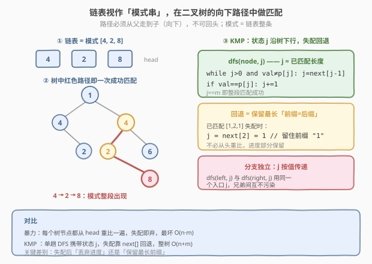
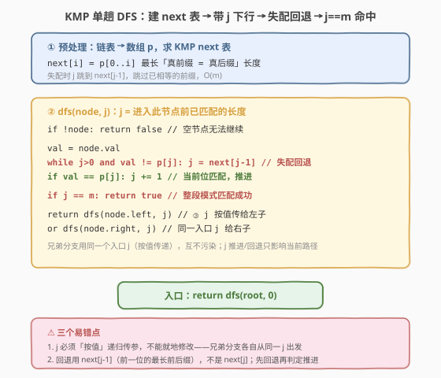

# LeetCode 二叉树中的链表 题解

## 1. 题目概述

- **标题 / 题号**：二叉树中的链表（#1367，medium）
- **链接**：https://leetcode.cn/problems/linked-list-in-binary-tree/
- **难度**：中等
- **标签**：树、二叉树、链表、深度优先搜索（DFS）、KMP 模式匹配

**题意**：给一棵以 `root` 为根的二叉树和一条以 `head` 为首的单向链表。判断链表中的**所有元素**是否按顺序出现在树的某条**向下路径**上。

> **向下路径**：从树中某节点出发，沿父→子方向连续下行的一段；可从任意节点开始，不可回头、不可横向。

**示例 1**：

```text
输入：head = [4,2,8], root = [1,4,4,null,2,2,null,1,null,6,8,null,null,null,null,1,3]
输出：true
解释：路径 4 → 2 → 8 在树中存在（根的右子 4 → 其左子 2 → 其右子 8）。
```

**示例 2**：

```text
输入：head = [1,4,2,6], root = [1,4,4,null,2,2,null,1,null,6,8,null,null,null,null,1,3]
输出：true
解释：路径 1 → 4 → 2 → 6 在树中存在（根 1 → 右子 4 → 左子 2 → 左子 6）。
```

**示例 3**：

```text
输入：head = [1,4,4,null,2,2,null,1,null,6,8,null,null,null,null,1,3], root 同上
输出：false
解释：不存在与该链表完全一致的向下路径。
```

**约束**：

- 树中节点数目在范围 $[1,\, 2500]$ 内
- 链表中节点数目在范围 $[1,\, 100]$ 内
- 树节点和链表节点的值均在 $[1,\, 100]$ 之间

> 💡 把链表看成一条**模式串**，把二叉树的每条「根到叶方向」看成一条**文本串**——问题等价于：模式串是否作为某条文本串的**连续子串**出现。既是「树上路径匹配」，自然联想到 [28. 实现 strStr()](../0001-0100/28_实现strStr.md) 的串匹配思路：暴力可过，KMP 更优雅。

## 2. 解题思路

### 2.1 暴力思路：每个树节点都从 head 重比一遍

最直白的做法：枚举树中每个节点作为**匹配起点**，从 `head` 开始沿向下路径逐位比对——

```text
dfs(tree_node, list_node):
    if list_node 为空: return true        // 链表比完了，成功
    if tree_node 为空: return false
    if tree_node.val != list_node.val: return false
    return dfs(tree_node.left,  list_node.next)
        or dfs(tree_node.right, list_node.next)

isSubPath(head, root):
    if root 为空: return false
    return dfs(root, head)               // 从 root 起比
        or isSubPath(head, root.left)    // 或换起点
        or isSubPath(head, root.right)
```

问题在于——

- **进度全丢弃**：一旦在某层失配，`dfs` 直接返回 `false`，已比过的若干位**全部作废**；外层 `isSubPath` 又从 `head` 第一位重新比。例如模式 `[1,2,1,3]` 走到 `[1,2,1]` 后失配，暴力把「1,2,1」整段扔掉重头再来；
- **重复比较**：同一棵子树会被不同起点反复扫。最坏每个树节点都要比满 $m$ 位，总计 $O(n\cdot m)$，$n=2500,\,m=100$ 时约 $2.5\times10^5$——本题规模下虽能过，但思路未利用「**失配后已匹配前缀可部分保留**」的性质。

> ⚠️ 暴力把「换起点」做成显式的第二层递归，本质上每次失配都让状态归零。KMP 的核心正是把这件事交给 `next` 表自动处理，**单趟扫描**即可。

### 2.2 核心观察：链表当模式建 KMP next 表，单趟 DFS 携状态 j 下行



**关键洞察**：把链表转成数组 $p[0..m-1]$ 并预处理 KMP 失败函数 $\text{next}$，其中

$$
\text{next}[i] = p[0..i]\text{ 的最长「真前缀 = 真后缀」长度}
$$

在树上做**单趟 DFS**，递归参数携带「进入此节点前已匹配的长度 $j$」。在节点处：

1. **失配回退**：当 $j>0$ 且 $\text{node.val} \neq p[j]$ 时，令 $j = \text{next}[j-1]$，反复回退直到能接上或 $j=0$；
2. **推进**：若 $\text{node.val} = p[j]$，则 $j \mathrel{+}= 1$；
3. **命中**：若 $j = m$，整段模式已匹配，返回 `true`；
4. **下行**：以**当前的 $j$** 分别递归左右子树，两者命中其一即可。

> ⚠️ **$j$ 必须按值传递**。左右子树是两条**独立的向下路径**，进入它们时的「已匹配前缀」应当相同——都是父节点处的 $j$。若把 $j$ 当成共享变量就地修改，左子树回退会污染右子树入口，逻辑就错了。所以递归签名是 `dfs(node, j)`，$j$ 作为形参逐层拷贝。

**为什么回退能省力？** 模式 $p$ 在位置 $i$ 失配时，$p[0..\text{next}[i]-1]$ 与刚才比过的后缀相等，无需重比这段前缀，直接把 $j$ 跳到 $\text{next}[i]$ 继续即可。树上的「向下路径」天然是一条线性文本，KMP 的线性匹配性质完整迁移过来：整树每条边只走一次，均摊 $O(n+m)$。

> 💡 与经典串匹配唯一的区别是：文本不再是单链，而是**带分叉的树**。KMP 状态 $j$ 在分叉处「复制」一份给每个孩子——这正是把 `dfs(node, j)` 设计成「$j$ 随路径携带」的妙处，无需对每个起点重跑。

### 2.3 算法流程图



**完整流程**：

1. **预处理**：链表转数组 $p$，用标准 KMP 双指针求 $\text{next}$ 表，$O(m)$；
2. **入口** `isSubPath(root)`：`return dfs(root, 0)`；
3. **`dfs(node, j)` 前序递归**：
   - `node` 为空 → 返回 `false`；
   - 取 `val = node.val`；
   - **回退**：`while j>0 and val != p[j]: j = next[j-1]`；
   - **推进**：`if val == p[j]: j += 1`；
   - **命中判定**：`if j == m: return true`；
   - **下行**：`return dfs(node.left, j) or dfs(node.right, j)`；
4. 返回 DFS 结果。

> 💡 **空节点返回 false 而非 true**：本题要求模式**整段**出现，空节点上模式不可能比完（$j$ 未触顶 $m$），故返回 `false`。这与「子序列判定」里「模式比完即 true」的基准不同——命中判定放在 $j=m$ 处，而非递归边界。

### 2.4 示例演算

以示例 1 为例：模式 $p = [4,2,8]$，$m=3$，$\text{next}=[0,0,0]$（三位互异，无真前后缀）。树结构如下：

```text
            1
          /   \
         4     4
          \   /
          2  2
         /  / \
        1  6   8
```

![示例演算：模式 [4,2,8]，单趟 DFS 携 j 下行，节点 8 处 j=3 命中](../images/1367_example_walkthrough.svg)

按 DFS 前序逐节点追踪 $j$（“入 j” 为进入该节点时父层传下来的已匹配长度，“出 j” 为本节点处理后的值）：

| 节点 | val | 入 j | 动作 | 出 j |
|------|-----|------|------|------|
| 1（根） | 1 | 0 | $1 \neq p[0]=4$，不推进 | 0 |
| 4（左） | 4 | 0 | $4 = p[0]$，$j \to 1$ | 1 |
| 2 | 2 | 1 | $2 = p[1]$，$j \to 2$ | 2 |
| 1（叶） | 1 | 2 | $1 \neq p[2]=8$，回退 $j=\text{next}[1]=0$；$1\neq p[0]$ | 0 |
| 4（右） | 4 | 0 | $4 = p[0]$，$j \to 1$ | 1 |
| 2 | 2 | 1 | $2 = p[1]$，$j \to 2$ | 2 |
| 6（叶） | 6 | 2 | $6 \neq p[2]=8$，回退 $j=0$；$6\neq p[0]$ | 0 |
| **8** | 8 | 2 | $8 = p[2]$，$j \to 3 = m$ | **3 ✓** |

$j=3=m$，命中，返回 `true`。匹配路径为 $4 \to 2 \to 8$（根的右子 4 起）。

> 💡 注意根节点 $1$ 与 $p[0]=4$ 不等，$j$ 保持 $0$——KMP 不需要「显式换起点」，状态会在下行过程中**自动**从合适的位置起跳（此处右子 4 处 $j$ 才开始增长）。这正是单趟扫描的由来。本例 $\text{next}$ 全零，回退直接归零；若模式含重复前缀（如 $[1,2,1,3]$，$\text{next}=[0,0,1,0]$），失配时 $j$ 会跳到 $1$ 而非 $0$，保留前缀「1」，省力更明显。

## 3. 参考代码

### C++

```cpp
// 二叉树中的链表.cpp —— KMP 单趟 DFS，O(n + m)
// 编译: g++ -O2 -std=c++17 二叉树中的链表.cpp -o sublist
#include <vector>
using namespace std;

struct ListNode {
    int val;
    ListNode* next;
    ListNode() : val(0), next(nullptr) {}
    ListNode(int x) : val(x), next(nullptr) {}
    ListNode(int x, ListNode* n) : val(x), next(n) {}
};

struct TreeNode {
    int val;
    TreeNode* left;
    TreeNode* right;
    TreeNode() : val(0), left(nullptr), right(nullptr) {}
    TreeNode(int x) : val(x), left(nullptr), right(nullptr) {}
    TreeNode(int x, TreeNode* l, TreeNode* r) : val(x), left(l), right(r) {}
};

class Solution {
public:
    bool isSubPath(ListNode* head, TreeNode* root) {
        // 链表转数组 p，并求 KMP next 表
        vector<int> p;
        for (ListNode* cur = head; cur; cur = cur->next) p.push_back(cur->val);
        int m = p.size();
        vector<int> nxt(m, 0);
        for (int i = 1, j = 0; i < m; ++i) {
            while (j > 0 && p[i] != p[j]) j = nxt[j - 1];
            if (p[i] == p[j]) ++j;
            nxt[i] = j;
        }
        return dfs(root, 0, p, nxt, m);
    }

private:
    // j = 进入 node 前已匹配的长度（按值传递，兄弟分支互不污染）
    bool dfs(TreeNode* node, int j, const vector<int>& p, const vector<int>& nxt, int m) {
        if (!node) return false;
        int v = node->val;
        while (j > 0 && v != p[j]) j = nxt[j - 1];   // 失配回退
        if (v == p[j]) ++j;                          // 当前位匹配，推进
        if (j == m) return true;                     // 整段命中
        return dfs(node->left, j, p, nxt, m) || dfs(node->right, j, p, nxt, m);
    }
};
```

### Python

```python
class Solution:
    def isSubPath(self, head: ListNode | None, root: TreeNode | None) -> bool:
        # 链表转数组 p，并求 KMP next 表
        p: list[int] = []
        cur = head
        while cur:
            p.append(cur.val)
            cur = cur.next
        m = len(p)
        nxt = [0] * m
        j = 0
        for i in range(1, m):
            while j > 0 and p[i] != p[j]:
                j = nxt[j - 1]
            if p[i] == p[j]:
                j += 1
            nxt[i] = j

        def dfs(node: TreeNode | None, j: int) -> bool:
            # j = 进入 node 前已匹配的长度（按值传递，兄弟分支互不污染）
            if not node:
                return False
            v = node.val
            while j > 0 and v != p[j]:
                j = nxt[j - 1]            # 失配回退
            if v == p[j]:
                j += 1                    # 当前位匹配，推进
            if j == m:
                return True               # 整段命中
            return dfs(node.left, j) or dfs(node.right, j)

        return dfs(root, 0)
```

> 💡 两版等价，核心只有三步：**建 `next` → `dfs(node, j)` 里先回退再推进 → $j=m$ 即命中**。$j$ 作为形参按值传入左右子树，天然保证兄弟分支独立。若觉得 KMP 不熟，约束 $n\le2500,\,m\le100$ 下暴力 $O(n\cdot m)$ 同样可通过（见第 5 节）。

## 4. 复杂度分析

| 维度 | KMP 单趟 DFS（推荐） | 暴力枚举起点 + 重比 |
|------|----------------------|----------------------|
| 时间复杂度 | $O(n + m)$（建表 $O(m)$，DFS 每条边均摊 $O(1)$） | $O(n \cdot m)$，每个树节点最多比满 $m$ 位 |
| 空间复杂度 | $O(m + h)$（`next` 表 $O(m)$ + 递归栈 $O(h)$，$h$ 为树高） | $O(h)$（递归栈，无额外表） |
| 实际运算量 | $n=2500,\,m=100$ 约 $2.6\times10^3$ 级，毫秒内 | 约 $2.5\times10^5$，亦在毫秒级，仍可通过 |

> ⚠️ **KMP 为何树上均摊 $O(1)$？** 状态 $j$ 每次推进 $+1$，每次回退至少 $-1$，而 $j$ 全程不超过 $m$。整棵树上 $j$ 的总推进次数受「下行路径长度 + 回退后重推进」约束，均摊到每条边为常数。与经典串匹配的势能分析完全一致，只是文本从单链换成树、分叉处 $j$ 被复制而已。

## 5. 扩展：暴力双递归版与 next 表构造演示

### 5.1 暴力双递归版（小规模足够）

约束下暴力同样 AC，且实现更短、面试中先写出来保底再优化是稳妥策略：

```python
class Solution:
    def isSubPath(self, head: ListNode | None, root: TreeNode | None) -> bool:
        # 从某个树节点起，沿向下路径逐位匹配整条链表
        def dfs(node: TreeNode | None, cur: ListNode | None) -> bool:
            if not cur:
                return True                 # 链表比完
            if not node:
                return False
            if node.val != cur.val:
                return False
            return dfs(node.left, cur.next) or dfs(node.right, cur.next)

        if not root:
            return False
        # 要么从 root 起比，要么换起点到子树
        return dfs(root, head) or self.isSubPath(head, root.left) or self.isSubPath(head, root.right)
```

注意 `dfs` 与外层 `isSubPath` 是**两套不同语义**的递归：`dfs(node, cur)` 判定「从 `node` 起能否整段匹配 `cur` 开头的链表」；外层则枚举起点。这种「外层换起点 + 内层逐位比」的双递归是树上子结构匹配的通用写法，对照 [572. 另一棵树的子树](https://leetcode.cn/problems/subtree-of-another-tree/) 的「枚举起点 + 同构判定」同理。

### 5.2 next 表构造：以模式 [1,2,1,3] 为例

当模式含重复前后缀时，`next` 才显出价值。以 $p=[1,2,1,3]$ 为例：

| $i$ | $p[i]$ | 回退前 $j$ | 比对 | $j$ 终值 | $\text{next}[i]$ | 含义 |
|-----|--------|-----------|------|---------|------------------|------|
| 0 | 1 | — | — | 0 | 0 | 单字符无真前后缀 |
| 1 | 2 | 0 | $p[1]\neq p[0]$ | 0 | 0 | 前缀「1」≠ 后缀「2」 |
| 2 | 1 | 0 | $p[2]=p[0]=1$ | 1 | 1 | 前缀「1」= 后缀「1」 |
| 3 | 3 | 1 | $p[3]\neq p[1]=2$，回退 $j=\text{next}[0]=0$；$p[3]\neq p[0]$ | 0 | 0 | 无更长公共前后缀 |

$\text{next}=[0,0,1,0]$。若树上某路径已匹配 `[1,2,1]` 到位 $j=3$，下一节点值为 $2\neq p[3]=3$，则回退 $j=\text{next}[2]=1$——保留前缀「1」，只需再比 $p[1]=2$ 与当前值 $2$，命中后 $j\to2$，不必从 $j=0$ 重头比。这正是 KMP 相对暴力的省力所在；而示例 1 的 $[4,2,8]$ 三位互异、$\text{next}$ 全零，回退与「归零」无异，故未显优势。

> ⚠️ **回退用 $\text{next}[j-1]$ 而非 $\text{next}[j]$**：失配发生在试图匹配 $p[j]$ 时，已确定相等的是 $p[0..j-1]$，故可安全跳到「$p[0..j-1]$ 的最长真前后缀」长度 $\text{next}[j-1]$。写成 $\text{next}[j]$ 是常见笔误，会让 $j$ 越界或回退过头。

## 6. 面试要点

1. **为什么把链表转成数组再建 KMP，而不直接在链表上做？**

   > KMP 的 `next` 表构造需要随机访问 $p[i]$ 与 $p[j]$，链表 $O(n)$ 随机访问会让建表退化到 $O(m^2)$。链表长度 $m\le100$，转数组 $O(m)$ 可忽略，换来建表 $O(m)$ 与匹配期 $O(1)$ 比较，整体更干净。同理，匹配期也要频繁取 $p[j]$，数组比沿链表 `next` 走更直接。

2. **$j$ 为什么必须按值传递？写成共享变量会怎样？**

   > 左右子树是两条独立的向下路径，进入时「已匹配前缀」应相同——都是父节点处的 $j$。若用共享变量，左子树回退会改写 $j$，右子树入口就被污染，可能漏判（本该从 $j=2$ 接续却变成 $0$）或误判。形参 `dfs(node, j)` 让每条路径持有一份独立拷贝，回退只影响当前路径。这是树上 KMP 与串上 KMP 唯一的结构性差异。

3. **失配时为什么用 $\text{next}[j-1]$ 回退？**

   > 失配发生在「试图匹配 $p[j]$」这一步，已确认相等的是 $p[0..j-1]$。$\text{next}[j-1]$ 正是这段已匹配串的「最长真前缀=真后缀」长度，跳到该位置后，前缀部分无需重比即可继续。用 $\text{next}[j]$ 是越界笔误——$p[j]$ 尚未匹配成功，谈不上它的前后缀。

4. **KMP 在树上为什么还是 $O(n+m)$？**

   > 势能分析：$j$ 每次推进 $+1$，每次回退至少 $-1$，全程 $0\le j\le m$。整棵树上「推进」总次数受路径长度与回退重推进约束，均摊每条边 $O(1)$；分叉处 $j$ 被复制给兄弟，不累加。故 DFS 部分为 $O(n)$，建表 $O(m)$，合计 $O(n+m)$。与串匹配唯一的不同是文本从单链换成树、分叉处状态复制。

5. **本题与 [572. 另一棵树的子树] / [28. strStr()] 的异同？**

   > 三者都是「**模式是否在某处出现**」：28 是串中找串（KMP 母题）、572 是树中找同构子树（枚举起点 + 树同构判定）、1367 是树中找向下路径与链表一致。1367 的独特之处是「模式是链表、文本是树的向下路径」——把树视为多条共享前缀的线性文本，KMP 状态在分叉处复制即可线性扫描，是 28 的 KMP 思想到树结构的迁移。

> 💡 **一句话总结**：1367 的灵魂是「**链表当模式、向下路径当文本、KMP 状态沿树下行**」——把 `dfs(node, j)` 设计成「$j$ 随路径按值携带」，失配靠 $\text{next}[j-1]$ 回退保留前缀，单趟 DFS $O(n+m)$ 完成。树上 KMP 与串上 KMP 唯一差别：分叉处 $j$ 复制给每个孩子。

## 同类练习题

| # | 题目 | 与本题的关联 |
|---|------|-------------|
| 28 | [实现 strStr()](https://leetcode.cn/problems/implement-strstr/) | 串中找子串的 KMP 母题；对照 1367 把「文本」从单链换成树的向下路径——`next` 表构造与失配回退完全一致，是理解本题 KMP 部分的前置 |
| 572 | [另一棵树的子树](https://leetcode.cn/problems/subtree-of-another-tree/) | 树中找同构子树，外层枚举起点 + 内层同构判定双递归；对照 1367 暴力版「枚举起点 + 逐位比」——同为「树上子结构匹配」的通用写法，区别在匹配准则（树同构 vs 值序列一致） |
| — | [KMP 算法（串匹配）](https://leetcode.cn/problems/repeated-substring-pattern/) | 459. 重复的子字符串，用 KMP `next` 表判定周期性；对照 1367 的 `next` 构造——体会「最长真前后缀」这一核心量在不同场景的复用 |
| 109 | [有序链表转换二叉搜索树](../0101-0200/109_有序链表转换二叉搜索树.md) | 链表与二叉树交互的另一典型，把升序链表中序填入 BST；对照 1367 把链表视作模式去树中匹配——同为「链表 × 树」组合，但前者是构造、后者是判定 |
| 1372 | [二叉树中的最长交错路径](../1301-1400/1372_二叉树中的最长交错路径.md) | 单趟 DFS 携带状态（返回 $(L,R)$ 一对）求树上路径最值；对照 1367 单趟 DFS 携带 $j$ 求路径匹配——同为「一次遍历带状态下行」的树上线性扫描范式 |
