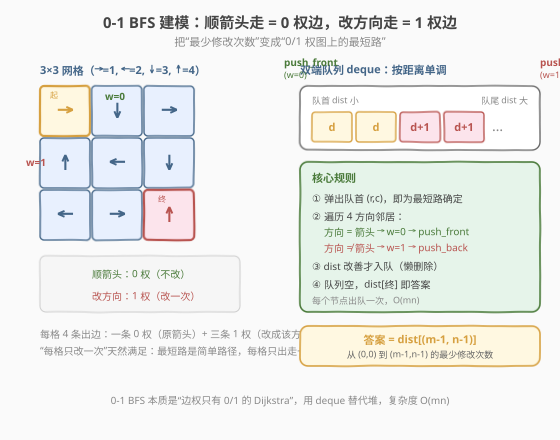
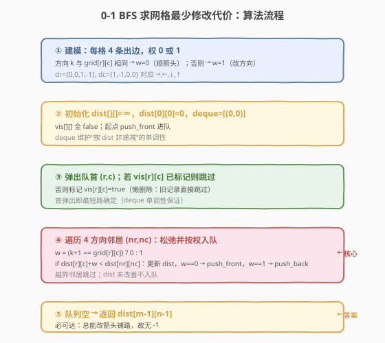
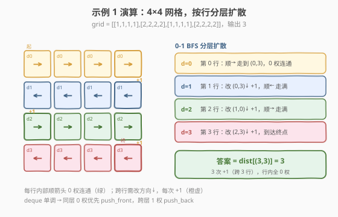

# LeetCode 使网格图至少有一条有效路径的最小代价 题解

## 1. 题目概述

- **标题 / 题号**：使网格图至少有一条有效路径的最小代价（#1368，hard）
- **链接**：https://leetcode.cn/problems/minimum-cost-to-make-at-least-one-valid-path-in-a-grid/
- **难度**：困难
- **标签**：图、最短路径、0-1 BFS、双端队列、Dijkstra

**题意**：给你一个 $m \times n$ 的网格图 `grid`，每个格子里的数字代表从该格出发下一步走的方向：

- `1`：往右走，$(i,j) \to (i, j+1)$
- `2`：往左走，$(i,j) \to (i, j-1)$
- `3`：往下走，$(i,j) \to (i+1, j)$
- `4`：往上走，$(i,j) \to (i-1, j)$

注意数字可能指向网格外（无效）。一条**有效路径**指从 $(0,0)$ 出发，每步顺着数字方向走，最终在 $(m-1, n-1)$ 结束的路径（不必最短）。你可以花费 $cost = 1$ 修改一个格子里的数字（每个格子只能改一次）。返回让网格图**至少有一条有效路径**的最小代价。

> 💡 换句话说：从 $(0,0)$ 走到 $(m-1,n-1)$，顺箭头走免费、逆箭头走（改方向）付费 1，问最少花多少钱。这立刻把题意映射成了**边权只有 0/1 的最短路**。

**示例 1**：

```text
输入：grid = [[1,1,1,1],[2,2,2,2],[1,1,1,1],[2,2,2,2]]
输出：3
解释：(0,0)→(0,1)→(0,2)→(0,3) 改↓ +1 →(1,3)→(1,2)→(1,1)→(1,0) 改↓ +1 →(2,0)→(2,1)→(2,2)→(2,3) 改↓ +1 →(3,3)
总花费 3。
```

**示例 2**：

```text
输入：grid = [[1,1,3],[3,2,2],[1,1,4]]
输出：0
解释：不修改任何数字即可从 (0,0) 到达 (2,2)：顺箭头链路直达终点。
```

**示例 3**：

```text
输入：grid = [[1,2],[4,3]]
输出：1
解释：从 (0,0) 顺→到 (0,1)，把 (0,1) 改成↓ +1 即到 (1,1)。
```

**约束**：

- `m == grid.length`，`n == grid[i].length`
- `1 <= m, n <= 100`
- `1 <= grid[i][j] <= 4`

> 💡 网格最多 $10^4$ 格，每格 4 条出边，边数 $E \le 4 \times 10^4$。边权只有 0/1，正是 **0-1 BFS** 的甜区——用双端队列替代堆，$O(mn)$ 一次扫完。

## 2. 解题思路

### 2.1 暴力思路：Dijkstra（堆优化）

把每个格子看作图中的一个节点。从每格 $(r,c)$ 向 4 个方向的相邻格各连一条**有向边**：若该方向与 `grid[r][c]` 相同，边权为 $0$（顺箭头，免费）；否则边权为 $1$（改方向，付费）。于是原问题变为：求 $(0,0)$ 到 $(m-1,n-1)$ 的**单源最短路**。

套用 [Day 743 网络延迟时间](../0701-0800/743_网络延迟时间.md) 的堆优化 Dijkstra 即可，复杂度 $O(E \log V) = O(mn \log(mn))$，本题 $mn \le 10^4$ 轻松通过。

> ⚠️ 但本题边权**只有 0 和 1**两种——用堆选最小值有点"杀鸡用牛刀"。存在一种更轻量的结构能把"选最小"做到 $O(1)$ 摊还：**双端队列 BFS（0-1 BFS）**。

### 2.2 核心观察：0-1 BFS（双端队列）



核心思路：

- 维护 `dist[r][c]` 表示从 $(0,0)$ 到 $(r,c)$ 的当前最少代价，初始 `dist[0][0] = 0`，其余为 $\infty$。
- 用**双端队列 `deque`** 代替最小堆，始终保持队列**按 dist 非递减**单调。
- 弹出队首 $(r,c)$，遍历 4 方向邻居 $(nr,nc)$，计算边权 $w$：
  - 方向 $k$ 与 `grid[r][c]` 相同 → $w=0$ → 更新后 `push_front`；
  - 方向不同 → $w=1$ → 更新后 `push_back`。
- **正确性**：$w=0$ 的邻居 dist 与当前相同，插队首不破坏单调；$w=1$ 的邻居 dist = 当前 +1，插队尾 ≥ 队尾。故队首永远是未确定节点中 dist 最小者——与 Dijkstra 同样的贪心正确性，但选最小值从 $O(\log V)$ 降到 $O(1)$。

> 💡 **为什么 0-1 BFS 正确？** 它本质是 Dijkstra 在"边权仅 0/1"时的特例。deque 的单调性保证每个节点**首次出队即最短路确定**，用一个 `vis` 数组跳过后续旧记录即可，每个节点只出队一次，总复杂度 $O(V+E) = O(mn)$。

> ⚠️ **“每格只能改一次”怎么保证？** 最短路在非负权图上一定是**简单路径**——每格只从其中走出一次。当某格沿非箭头方向走出时即"改了一次"，绝不会再次经过它再改。故该约束天然满足，建模时无需额外处理。

### 2.3 算法流程图



**完整步骤**：

1. **方向数组**：`dr={0,0,1,-1}`、`dc={1,-1,0,0}`，对应 `→,←,↓,↑`（即编号 1,2,3,4 减 1 的下标）。
2. **初始化**：`dist` 全 $\infty$，`dist[0][0]=0`；`vis` 全 `false`；`deque = [(0,0)]`。
3. **主循环**：弹出队首 $(r,c)$；若 `vis[r][c]` 已标记则跳过（懒删除），否则标记。
4. **松弛 4 方向**：对每个方向 $k \in [0,4)$，计算邻居与边权 $w = (k+1 == \text{grid}[r][c])\ ?\ 0 : 1$；若 `dist[r][c]+w < dist[nr][nc]`，更新 dist，$w=0$ 则 `push_front`，$w=1$ 则 `push_back`。越界跳过。
5. **返回** `dist[m-1][n-1]`（必可达，无需判 -1）。

### 2.4 示例演算

以示例 1 `grid = [[1,1,1,1],[2,2,2,2],[1,1,1,1],[2,2,2,2]]` 为例：每行内部箭头一致，0 权连通整行；跨行需改方向↓，每次 $+1$。



| 阶段 | 出队层 | 0 权连通扩散（顺箭头） | 1 权跨行入队（改↓） | dist 范围 |
|------|--------|----------------------|---------------------|-----------|
| 1 | $(0,0)$，d=0 | 第 0 行 4 格：顺→ 走到 $(0,3)$ | $(1,0..3)$ 各 $+1$ → d=1 | 0 → 1 |
| 2 | 第 1 行，d=1 | 第 1 行 4 格：顺← 走到 $(1,0)$ | $(2,0..3)$ 各 $+1$ → d=2 | 1 → 2 |
| 3 | 第 2 行，d=2 | 第 2 行 4 格：顺→ 走到 $(2,3)$ | $(3,0..3)$ 各 $+1$ → d=3 | 2 → 3 |
| 4 | 第 3 行，d=3 | 含终点 $(3,3)$ | — | 答案 = 3 |

行内 0 权边 `push_front` 让整行瞬间同层扩散；跨行 1 权边 `push_back` 推到下一层。最终 `dist[(3,3)] = 3`。

> 💡 观察到一个优美的结构：本题每行箭头全同，0 权连通块恰为整行，故答案 = 跨行次数 = 行数 − 1 = 3。但 0-1 BFS 不依赖此特例，对任意箭头分布都正确。

## 3. 参考代码

### C++

```cpp
class Solution {
  public:
    int minCost(vector<vector<int>>& grid) {
        int m = grid.size(), n = grid[0].size();
        // 1=右 2=左 3=下 4=上，下标 k = 方向编号 - 1
        const int dr[] = {0, 0, 1, -1};
        const int dc[] = {1, -1, 0, 0};
        const int INF = INT_MAX / 2;

        vector<vector<int>> dist(m, vector<int>(n, INF));
        vector<vector<char>> vis(m, vector<char>(n, 0));
        dist[0][0] = 0;

        deque<pair<int,int>> dq;
        dq.push_front({0, 0});

        while (!dq.empty()) {
            auto [r, c] = dq.front();
            dq.pop_front();
            if (vis[r][c]) continue;          // 懒删除：旧记录跳过
            vis[r][c] = 1;
            for (int k = 0; k < 4; ++k) {
                int nr = r + dr[k], nc = c + dc[k];
                if (nr < 0 || nr >= m || nc < 0 || nc >= n) continue;
                int w = (k + 1 == grid[r][c]) ? 0 : 1;   // 顺箭头 0，改方向 1
                if (dist[r][c] + w < dist[nr][nc]) {
                    dist[nr][nc] = dist[r][c] + w;
                    if (w == 0) dq.push_front({nr, nc}); // 0 权进队首
                    else        dq.push_back({nr, nc});  // 1 权进队尾
                }
            }
        }
        return dist[m - 1][n - 1];
    }
};
```

### Python

```python
class Solution:
    def minCost(self, grid: List[List[int]]) -> int:
        m, n = len(grid), len(grid[0])
        # 1=右 2=左 3=下 4=上，下标 k = 方向编号 - 1
        dr = (0, 0, 1, -1)
        dc = (1, -1, 0, 0)
        INF = float('inf')

        dist = [[INF] * n for _ in range(m)]
        vis = [[False] * n for _ in range(m)]
        dist[0][0] = 0

        from collections import deque
        dq = deque([(0, 0)])
        while dq:
            r, c = dq.popleft()
            if vis[r][c]:
                continue                       # 懒删除：旧记录跳过
            vis[r][c] = True
            d = dist[r][c]
            for k in range(4):
                nr, nc = r + dr[k], c + dc[k]
                if 0 <= nr < m and 0 <= nc < n:
                    w = 0 if k + 1 == grid[r][c] else 1   # 顺箭头 0，改方向 1
                    if d + w < dist[nr][nc]:
                        dist[nr][nc] = d + w
                        if w == 0:
                            dq.appendleft((nr, nc))       # 0 权进队首
                        else:
                            dq.append((nr, nc))           # 1 权进队尾
        return int(dist[m - 1][n - 1])
```

> 💡 **懒删除（`vis` 跳过）**：一个节点可能因多次 dist 改善而被重复入队。deque 单调性保证**首次出队即最短路**，故用 `vis` 标记：已确定的节点再次出队时直接 `continue`。这等价于 Dijkstra 中 `if (d > dist[u]) continue;` 的写法，但 0-1 BFS 借助单调性只需一个布尔标记，无需在队列里存距离。

## 4. 复杂度分析

| 维度 | 复杂度 | 说明 |
|------|--------|------|
| **时间复杂度** | $O(mn)$ | 每格至多出队一次（`vis` 保证），4 条出边各松弛一次，共 $O(4mn)$ |
| **空间复杂度** | $O(mn)$ | `dist`、`vis` 各 $O(mn)$；deque 最坏存 $O(mn)$ 个条目 |

> ⚠️ 若改用堆优化 Dijkstra，时间为 $O(mn \log(mn))$、空间同为 $O(mn)$。本题边权仅 0/1，0-1 BFS 把对数因子省掉，是**理论最优**。注意 0-1 BFS 的正确性**依赖边权只有 0/1**——出现其它权值（如 2、3）则 deque 单调性被破坏，必须退回 Dijkstra。

## 5. 扩展：0-1 BFS 与 Dijkstra 的关系

0-1 BFS 是 Dijkstra 在**边权仅 0/1**时的特例，用 deque 替代优先队列：

| 场景 | 推荐 | 复杂度 |
|------|------|--------|
| 边权只有 0/1 | **0-1 BFS（本题）** | $O(V+E)$ |
| 边权非负、种类 ≥ 3 | 堆优化 Dijkstra | $O(E \log V)$ |
| 边权非负、网格且权值很小 | 也可用桶式 Dijkstra（Dial's algorithm） | $O(V+E+C)$ |
| 有负权 | Bellman-Ford / SPFA | $O(VE)$ |

> 💡 **何时能上 0-1 BFS？** 题目一旦能建模为"某种操作免费、另一种操作代价 1"的最小代价路径，几乎都是 0-1 BFS。典型信号：网格图 + "翻转/移除/修改"计数 + 求最少操作次数。

**与 Dijkstra 的等价视角**：把 deque 看作"按距离分桶"——$w=0$ 入队首即"放进当前桶"，$w=1$ 入队尾即"放进下一桶"，桶间距离差 1，按桶顺序处理。这与 Dial's algorithm（按距离值分桶）同源，只是桶数退化为 2。

## 6. 面试要点

1. **怎么把题目抽象成图？**

   - 每格是节点，4 个方向的相邻格是 4 条出边。边权由"是否顺箭头"决定：顺为 0、逆为 1。最小修改次数 = $(0,0)$ 到 $(m-1,n-1)$ 的最短路。关键一步是识别出"边权只有 0/1"。

2. **0-1 BFS 为什么用双端队列而不是普通队列或堆？**

   - 普通队列（BFS）要求边权全等才保证"层数=距离"；本题有 0 和 1 两种权，普通 BFS 会把 $w=1$ 的邻居错误地当作同层。堆能处理但 $O(\log V)$ 选最小偏重。deque 利用"0 权进队首、1 权进队尾"维持单调，选最小 $O(1)$，是边权 0/1 时的最优选择。

3. **为什么首次出队就是最短路？**

   - deque 始终按 dist 非递减排列：$w=0$ 的邻居 dist 等于当前队首，插队首不破坏单调；$w=1$ 的邻居 dist = 当前 +1，≥ 队尾。故队首恒为未确定节点中 dist 最小者，与 Dijkstra 的贪心前提一致，边权非负保证该最小值不会再被更新。

4. **`vis` 标记和"懒删除"是一回事吗？**

   - 是。一个节点可能被多次入队（每次 dist 改善都入一次），首次出队已是最短路，之后的旧记录用 `vis` 跳过。等价于 Dijkstra 里 `if (d > dist[u]) continue;`，只是 0-1 BFS 借单调性用布尔标记更省事。不加 `vis` 也能对（松弛条件会挡住错误更新），但会做重复功、复杂度退化。

5. **“每个格子只能修改一次”的约束如何满足？**

   - 最短路在非负权图上是简单路径，每格至多被走出一次。沿非箭头方向走出即"改这一次"，绝不会再回到该格改第二次。建模无需显式处理该约束。

6. **为什么不需要判 −1？**

   - 任意网格都能通过修改箭头铺出一条 $(0,0) \to (m-1,n-1)$ 的路径（最坏全改成右/下方向即可），终点恒可达。故直接返回 `dist[m-1][n-1]`，无需检测不可达。

## 同类练习题

| # | 题目 | 与本题的关联 |
|---|------|-------------|
| 743 | [网络延迟时间](https://leetcode.cn/problems/network-delay-time/) | 堆优化 Dijkstra 单源最短路，本题的"通用边权版"对照 |
| 1334 | [阈值距离内邻居最少的城市](https://leetcode.cn/problems/find-the-city-with-the-smallest-number-of-neighbors-at-a-threshold-distance/) | Floyd 全源最短路，与单源 0-1 BFS 互为补充 |
| 2290 | [到达角落需要移除障碍物的最小数量](https://leetcode.cn/problems/minimum-obstacle-removal-to-reach-corner/) | 网格 0-1 BFS 经典题，空格 0 权、障碍 1 权 |
| 1293 | [网格中的最短路径](https://leetcode.cn/problems/shortest-path-in-a-grid-with-obstacles-elimination/) | 网格 BFS + 可消除 k 个障碍，状态含剩余消除次数 |
| 787 | [K 站中转内最便宜的航班](https://leetcode.cn/problems/cheapest-flights-within-k-stops/) | 限制中转次数的 Bellman-Ford / 分层 BFS，对照 0-1 BFS 的"不限中转" |
