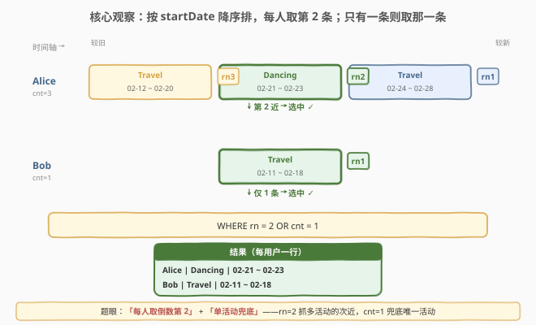
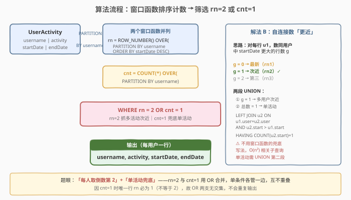
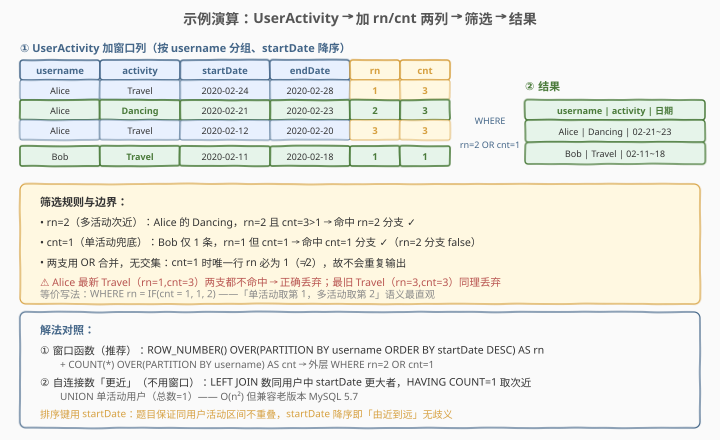

# LeetCode 获取最近第二次的活动 题解

> ⚠️ **注意**：本题是 LeetCode 数据库（SQL）类题目，在 leetcode.cn 上为 **Plus 会员专享题**，[leetcode.com](https://leetcode.com/problems/get-the-second-most-recent-activity/) 同样为付费题。本文代码部分使用 SQL（及 pandas 对照）而非 C++/Python。

## 1. 题目概述

- **标题 / 题号**：获取最近第二次的活动（#1369，hard）
- **链接**：https://leetcode.cn/problems/get-the-second-most-recent-activity/
- **难度**：困难
- **标签**：数据库、SQL、窗口函数、ROW_NUMBER、COUNT OVER、子查询、自连接、UNION、pandas

**题意**：给定 `UserActivity` 表，每行记录某用户在一段时间 `[startDate, endDate]` 内从事的一项活动。请编写 SQL 查询，报告**每个用户的「最近第二次」活动**（即按时间倒序排的第 2 条）。**若某用户只有一条活动记录，则直接返回那一条。** 结果顺序任意。

> 💡 题眼有两条：①「最近第二次」= 按用户分组、按 `startDate` 降序排的第 2 条——这是「每组取第 K 大」的 K=2 版本；②「单活动兜底」——只有一条记录的用户取那一条（即第 1 条），不能用 `rn = 2` 一刀切，需用 `cnt = 1` 兜底。题目保证**同一用户的活动区间不重叠**，故按 `startDate` 排序无歧义。

**表结构**：

```text
Table: UserActivity
+---------------+---------+
| Column Name   | Type    |
+---------------+---------+
| username      | varchar |  ← 用户名
| activity      | varchar |  ← 活动名称
| startDate     | Date    |  ← 活动开始日期
| endDate       | Date    |  ← 活动结束日期
+---------------+---------+
```

- 题目声明此表**无显式主键**，但语义上 `(username, startDate)` 唯一（同一用户在同一开始日期不会有两项活动）。
- 每行表示 `username` 在 `startDate` 至 `endDate` 期间从事 `activity`。
- **同一用户不能同时进行多项活动**（区间互不重叠），因此按 `startDate` 升序/降序即可得到无歧义的时间先后序列。

**示例 1**：

```text
输入：
UserActivity 表：
+------------+--------------+-------------+-------------+
| username   | activity     | startDate   | endDate     |
+------------+--------------+-------------+-------------+
| Alice      | Travel       | 2020-02-12  | 2020-02-20  |
| Alice      | Dancing      | 2020-02-21  | 2020-02-23  |
| Alice      | Travel       | 2020-02-24  | 2020-02-28  |
| Bob        | Travel       | 2020-02-11  | 2020-02-18  |
+------------+--------------+-------------+-------------+

输出：
+------------+--------------+-------------+-------------+
| username   | activity     | startDate   | endDate     |
+------------+--------------+-------------+-------------+
| Alice      | Dancing      | 2020-02-21  | 2020-02-23  |
| Bob        | Travel       | 2020-02-11  | 2020-02-18  |
+------------+--------------+-------------+-------------+
```

**解释**：

| 用户 | 活动时间线（由近到远） | 选择 |
|------|----------------------|------|
| Alice | Travel(02-24~28) → **Dancing(02-21~23)** → Travel(02-12~20) | 取第 2 近：Dancing |
| Bob | Travel(02-11~18)（仅此一条） | 取唯一一条：Travel |

- Alice 有 3 条记录，最近的是 `Travel(02-24~28)`，最近第二次是 `Dancing(02-21~23)`。
- Bob 只有 1 条记录，直接返回 `Travel(02-11~18)`。

**约束**：

- 同一用户的活动区间不重叠（`startDate` 降序即「由近到远」）。
- 用户活动条数不限（≥1），单条与多条皆需正确处理。
- 输出列：`username, activity, startDate, endDate`，顺序任意。

## 2. 解题思路

### 2.1 暴力思路：相关子查询数「更近」的行

最直觉的「不用窗口函数」写法：对每一行 `u1`，用一个相关子查询数「同用户中 `startDate` 比它更大的行数」`g`——`g = 0` 表示它最新，`g = 1` 表示它是第二近。于是「第二近」就是 `g = 1` 的行。但「单活动用户」的唯一行 `g = 0`（没有比它更新的），不满足 `g = 1`，会被漏掉，必须再 `UNION` 一段「该用户总条数 = 1」的查询补回来。

这种写法逻辑正确，但相关子查询逐行触发、复杂度 $O(n^2)$，且单活动兜底要额外一段 `UNION`，可读性差。它是「无窗口函数」时代的兜底方案，也是本题标为「困难」的由来——**在不能使用窗口函数时，优雅地处理「第 K 大 + 单元素兜底」并不简单**。

### 2.2 核心观察：窗口函数「排序 + 计数」双列



关键洞察分三层：

**第一层：「最近第二次」= 每组按 `startDate` 降序的第 2 行**。这是「每组取第 K 大」的 K=2 版本，与 [176. 第二高的薪水](../0001-0100/176_第二高的薪水.md)（全局取第 2 大）同构，只是多了「按用户分组」。`ROW_NUMBER() OVER (PARTITION BY username ORDER BY startDate DESC)` 一行搞定排序编号：`rn = 1` 是最近，`rn = 2` 是最近第二次。

**第二层：单活动用户要兜底**。若只写 `WHERE rn = 2`，只有 1 条记录的用户（`rn` 恒为 1）会被全部漏掉。题目要求「只有一条就返回那一条」，即「单活动时取 `rn = 1`」。于是需要一个**判别条件**区分「单活动」与「多活动」——用 `COUNT(*) OVER (PARTITION BY username)` 算出每组的总条数 `cnt`：

- `cnt = 1` → 取 `rn = 1`（唯一一条）；
- `cnt > 1` → 取 `rn = 2`（最近第二次）。

**第三层：两支用 `OR` 合并，互不重叠**。把上述规则压成一句 `WHERE rn = 2 OR cnt = 1`：

| 情形 | `rn` | `cnt` | `rn=2` | `cnt=1` | `OR` 结果 |
|------|------|------|--------|---------|-----------|
| 多活动的次近行 | 2 | >1 | true | false | **true ✓** |
| 多活动的最近行 | 1 | >1 | false | false | false（丢弃）|
| 多活动的更旧行 | 3,4,… | >1 | false | false | false（丢弃）|
| 单活动的唯一行 | 1 | 1 | false | true | **true ✓** |

> 💡 **为何 `OR` 两支无交集**：`cnt = 1` 时唯一行的 `rn` 必为 1（不等于 2），所以「`cnt=1` 命中」与「`rn=2` 命中」不会同时发生，`OR` 不会让任何行被重复选中。这是该写法最优雅之处——两个条件各管一边，天然互斥。

> ⚠️ **不能用 `rn = 2 OR rn = 1`**：这会选中多活动用户的**最近**行（`rn=1`），错误。必须用 `cnt` 区分「单活动（取 `rn=1`）」与「多活动（取 `rn=2`）」。等价的语义化写法是 `WHERE rn = IF(cnt = 1, 1, 2)`——「单活动取第 1，多活动取第 2」最直观。

### 2.3 算法流程图



**以推荐解法（窗口函数）为例的流水线**：

1. **加 `rn` 列**：`ROW_NUMBER() OVER (PARTITION BY username ORDER BY startDate DESC)` → 每用户内按开始日期降序编号 1,2,3,…。
2. **加 `cnt` 列**：`COUNT(*) OVER (PARTITION BY username)` → 每用户的总条数广播到该用户每一行。
3. **筛选**：外层 `WHERE rn = 2 OR cnt = 1` → 多活动取次近行，单活动取唯一行。
4. **输出**：`SELECT username, activity, startDate, endDate`。

> 💡 **`COUNT(*) OVER (PARTITION BY username)` 的语义**：与 `ROW_NUMBER` 共用同一个 `PARTITION BY username`，但它**不带 `ORDER BY`**，表示对「该用户的全部分区行」算一次 `COUNT`，再把这个标量广播到分区内的每一行。这是「把组级聚合铺回每行」的标准范式（与 [1355. 活动参与者](../1301-1400/1355_活动参与者.md) 的 `MAX(cnt) OVER()` 同理，只是从「全局」缩小到「分区内」）。

### 2.4 示例演算

以示例 1 数据，跟踪窗口函数解法的执行过程：



**第一步：加 `rn`、`cnt` 两列**

`UserActivity` 4 行，按 `username` 分区、`startDate` 降序编号，并广播每组条数：

| username | activity | startDate | endDate | rn | cnt |
|----------|----------|-----------|---------|----|-----|
| Alice | Travel | 2020-02-24 | 2020-02-28 | 1 | 3 |
| Alice | Dancing | 2020-02-21 | 2020-02-23 | 2 | 3 |
| Alice | Travel | 2020-02-12 | 2020-02-20 | 3 | 3 |
| Bob | Travel | 2020-02-11 | 2020-02-18 | 1 | 1 |

**第二步：筛选 `WHERE rn = 2 OR cnt = 1`**

- Alice Dancing：`rn=2, cnt=3` → `rn=2` 命中 → **保留**。
- Alice 两条 Travel：`rn=1/cnt=3` 与 `rn=3/cnt=3` → 两支都不命中 → 丢弃。
- Bob Travel：`rn=1, cnt=1` → `cnt=1` 命中 → **保留**。

输出：`Alice | Dancing | 02-21~23` 与 `Bob | Travel | 02-11~18`。

> 💡 **边界验证**：若某用户有 2 条记录，`rn=1`(cnt=2) 丢弃、`rn=2`(cnt=2) 命中 → 取次近，正确。若全部用户都只有 1 条，每行 `cnt=1` 全部命中 → 各返回唯一一条，正确。若无单活动用户，`cnt=1` 分支全程 false，退化为纯「取 `rn=2`」。

## 3. 参考代码

### MySQL（解法 A：窗口函数，推荐）

```sql
# 1369. 获取最近第二次的活动
# 思路：ROW_NUMBER 按 username 分组、startDate 降序编号取 rn；
#       COUNT(*) OVER 算每组条数 cnt；外层 WHERE rn=2 OR cnt=1 兼顾多活动与单活动
SELECT username, activity, startDate, endDate
FROM (
    SELECT username, activity, startDate, endDate,
           ROW_NUMBER() OVER (
               PARTITION BY username
               ORDER BY startDate DESC
           ) AS rn,
           COUNT(*) OVER (
               PARTITION BY username
           ) AS cnt
    FROM UserActivity
) t
WHERE rn = 2 OR cnt = 1;
```

> 💡 **写法要点**：
> - **两个窗口函数共用 `PARTITION BY username`**：`ROW_NUMBER` 带 `ORDER BY startDate DESC` 做组内排序编号；`COUNT(*)` 不带 `ORDER BY` 做组内计数广播。两者分区一致，`cnt` 准确反映「该用户共几条」。
> - **`WHERE rn = 2 OR cnt = 1`**：`rn=2` 抓多活动用户的次近行，`cnt=1` 兜底单活动用户的唯一行。两支互斥（`cnt=1` 时 `rn` 必为 1），不会重复输出。
> - **排序键用 `startDate`**：题目保证同用户区间不重叠，`startDate` 降序即「由近到远」无歧义。若改用 `endDate` 在不重叠前提下结论相同。
> - **需 MySQL 8.0+**：窗口函数是 8.0 引入的特性。
> - **派生表必须起别名**：`FROM (...) t` 的 `t` 不可省略，否则报 `Every derived table must have its own alias`。

### MySQL（解法 B：自连接数「更近」，不用窗口函数）

```sql
# 解法 B：不依赖窗口函数——自连接统计「同用户中 startDate 更大的行数」
# g=1 即次近（rn2）；单活动用户(g=0 且总数=1)用第二段 UNION 补回
-- ① 多活动用户：恰好有 1 条更近的行 → 最近第二次
SELECT u1.username, u1.activity, u1.startDate, u1.endDate
FROM UserActivity u1
LEFT JOIN UserActivity u2
       ON u1.username = u2.username
      AND u2.startDate > u1.startDate
GROUP BY u1.username, u1.activity, u1.startDate, u1.endDate
HAVING COUNT(u2.startDate) = 1
UNION
-- ② 单活动用户：总条数 = 1，直接返回那一条
SELECT username, activity, startDate, endDate
FROM UserActivity
WHERE username IN (
    SELECT username FROM UserActivity GROUP BY username HAVING COUNT(*) = 1
);
```

> 💡 **写法要点**：
> - **`LEFT JOIN` + `COUNT(u2.startDate)`**：对每行 `u1`，左连接「同用户中 `startDate` 更大」的行 `u2`。`COUNT(u2.startDate)`（计非 NULL）即为「比它更近的行数」`g`。`g=1` 恰好是「最近第二次」（最近 `g=0`、第三 `g=2`）。
> - **为何用 `COUNT(u2.startDate)` 而非 `COUNT(*)`**：`LEFT JOIN` 在无匹配时 `u2` 全为 NULL，`COUNT(*)` 会把 NULL 行也算成 1（恒 ≥1），无法区分「无更近行」与「有 1 条更近行」。`COUNT(u2.startDate)` 只计非 NULL，正确反映「更近的行数」。
> - **单活动兜底用 `UNION` 第二段**：单活动用户的唯一行 `g=0`，不满足第一段 `HAVING COUNT=1`，需用 `UNION` 补「总数=1 的用户」的行。两段无交集（`g=1` 要求总条数 ≥2，第二段要求总条数 =1），`UNION` 自动去重也安全。
> - **`GROUP BY` 列需完整**：`u1` 的四列都要进 `GROUP BY`，因为 `SELECT` 了四列且无聚合包裹——这是「每组取代表行」时 `GROUP BY` 必须覆盖所有非聚合列的标准要求。
> - **适用场景**：目标数据库不支持窗口函数（MySQL 5.7 及更早）时的兜底写法；相关子查询/自连接复杂度 $O(n^2)$，数据量大时不推荐。

### MySQL（解法 C：`IF` 语义化写法）

```sql
# 解法 C：把「单活动取第1、多活动取第2」写成 IF，语义最直观
SELECT username, activity, startDate, endDate
FROM (
    SELECT username, activity, startDate, endDate,
           ROW_NUMBER() OVER (PARTITION BY username ORDER BY startDate DESC) AS rn,
           COUNT(*) OVER (PARTITION BY username) AS cnt
    FROM UserActivity
) t
WHERE rn = IF(cnt = 1, 1, 2);
```

> 💡 **`rn = IF(cnt = 1, 1, 2)`**：直译题意——「若只有 1 条活动，取第 1（唯一）；否则取第 2」。与 `WHERE rn = 2 OR cnt = 1` 完全等价（`cnt=1` 时比 `rn=1`，否则比 `rn=2`），但语义更贴近自然语言描述，面试时更易解释。

### Python（pandas）

```python
import pandas as pd

def second_most_recent_activity(user_activity: pd.DataFrame) -> pd.DataFrame:
    # 按 username 分组、startDate 降序排名；同时算每组条数
    g = user_activity.groupby('username')
    user_activity = user_activity.assign(
        rn=g['startDate'].rank(method='first', ascending=False).astype(int),
        cnt=g['startDate'].transform('size'),
    )
    # 单活动取 rn=1，多活动取 rn=2
    mask = (user_activity['rn'] == 2) | (user_activity['cnt'] == 1)
    return (user_activity[mask][['username', 'activity', 'startDate', 'endDate']]
            .reset_index(drop=True))
```

> 💡 **pandas 对照**：
> - `groupby('username')['startDate'].rank(method='first', ascending=False)` 对应 `ROW_NUMBER() OVER (PARTITION BY username ORDER BY startDate DESC)`——`method='first'` 保证同分时按出现顺序编号（等价于 `ROW_NUMBER` 而非 `RANK`，避免并列名次）。`ascending=False` 即降序。
> - `groupby('username')['startDate'].transform('size')` 对应 `COUNT(*) OVER (PARTITION BY username)`——`transform('size')` 把每组行数广播回每一行。
> - 布尔掩码 `(rn == 2) | (cnt == 1)` 对应 `WHERE rn = 2 OR cnt = 1`——pandas 的 `|` 是逐元素逻辑或，需用括号包裹每个条件。
> - 若需语义化写法，可改为 `mask = user_activity['rn'] == np.where(user_activity['cnt'] == 1, 1, 2)`，对应解法 C 的 `IF`。

## 4. 复杂度分析

| 维度 | 解法 A（窗口函数） | 解法 B（自连接 UNION） | 解法 C（IF 写法） | pandas |
|------|---------------------|------------------------|-------------------|--------|
| **时间** | $O(n \log n)$ | $O(n^2)$ | $O(n \log n)$ | $O(n \log n)$ |
| **空间** | $O(n)$ | $O(n)$ | $O(n)$ | $O(n)$ |
| **扫描次数** | 1 次（窗口排序） | 自连接 $O(n^2)$ + 2 次子查询 | 1 次 | 1 次 |
| **依赖** | MySQL 8.0+ | 通用（MySQL 5.7 可用） | MySQL 8.0+ | pandas |
| **推荐度** | ✓ **首选** | △ 老版本兜底 | ✓ 语义最佳 | ✓ pandas 环境 |

> - $n$ = `UserActivity` 表行数，$m$ = 不同用户数（$m \le n$）。
> - **解法 A/C**：`PARTITION BY username ORDER BY startDate DESC` 需对每用户内活动排序，整体 $O(n \log n)$（每用户内 $O(k \log k)$，$\sum k = n$）；`COUNT(*) OVER (PARTITION BY)` 无 `ORDER BY` 可走哈希分组 $O(n)$。空间 $O(n)$ 存窗口列。
> - **解法 B**：`LEFT JOIN` 自连接在最坏情况下同用户的每两行都配对，$O(n^2)$；两段 `UNION` 各扫表一次。仅推荐数据量小或无窗口函数时使用。
> - **索引优化**：在 `(username, startDate)` 上建复合索引可让 `PARTITION BY username ORDER BY startDate DESC` 走索引顺序扫，免排序，从 $O(n \log n)$ 降为 $O(n)$；解法 B 的自连接同样受益于该复合索引。

## 5. 扩展：「每组取第 K 大」的范式族与单元素兜底

### 5.1 三种范式对照

「每组取第 K 大/第 K 行」是 SQL 高频题眼，本题的 K=2 + 单元素兜底是典型变体。三种实现范式：

| 范式 | 写法骨架 | 何时首选 |
|------|----------|----------|
| **窗口函数 `ROW_NUMBER`** | `ROW_NUMBER() OVER (PARTITION BY g ORDER BY x DESC) AS rn` → `WHERE rn = K` | **大多数情况首选**，语义清晰、$O(n \log n)$ |
| **自连接数「更大者」** | `LEFT JOIN` 数同组中 `x` 更大的行数 `g` → `HAVING COUNT = K-1` | 目标库不支持窗口函数时兜底，$O(n^2)$ |
| **`LIMIT` 子查询** | 相关子查询 `WHERE (SELECT COUNT(*) ... 更大) = K-1` | 单组取 1 行时简洁，取多行/带兜底时繁琐 |

> 💡 **选择口诀**：能用窗口函数就别写自连接（性能 + 可读性）；要兼容老版本 MySQL 才退回自连接。本题因「单活动兜底」让 `LIMIT` 子查询范式变得繁琐（要 `UNION` 两段），窗口函数的 `rn = 2 OR cnt = 1` 优势最明显。

### 5.2 `ROW_NUMBER` vs `RANK`/`DENSE_RANK`

本题排序键 `startDate` 在同用户内**唯一**（区间不重叠），三种函数结论相同。但若排序键可能并列（如同分薪水的「第 K 高薪」），则须谨慎选择：

| 函数 | 并列处理 | 取「第 2 高」时 |
|------|----------|----------------|
| `ROW_NUMBER` | 强制 1,2,3 不重复 | 取 rn=2，可能跳过并列的第 2 名 |
| `RANK` | 并列同号、跳后续 | 取 rk=2，可能漏并列第 1 名之后的真实第 2 |
| `DENSE_RANK` | 并列同号、不跳号 | 取 drk=2，保留所有并列第 2 名 ✓ |

> ⚠️ 本题 `startDate` 唯一故无差异。但写「第 K 高薪」类题目（如 [177. 第 N 高薪](../0101-0200/177_第N高的薪水.md)）若薪水可并列，须用 `DENSE_RANK` 才能正确保留并列名次。面试时说明「排序键是否唯一决定选哪个函数」即可。

### 5.3 单元素兜底的通用化

「每组取第 K 行，但组内不足 K 行时取最后一行」是一个可推广模式。本题是 K=2、不足时取第 1 的特例。通用写法：

```sql
-- 通用：每组取第 K 行，不足 K 行时取最后一行（rn 最大者）
WHERE rn = LEAST(K, cnt)
```

- K=2 时 `WHERE rn = LEAST(2, cnt)`：`cnt=1` → `rn=1`；`cnt≥2` → `rn=2`。与 `WHERE rn = IF(cnt = 1, 1, 2)` 等价但更通用。
- 本题即 `WHERE rn = LEAST(2, cnt)`，`LEAST` 是 MySQL/标准 SQL 的取小函数。

> 💡 若题意改为「不足 K 行时丢弃该组」（即严格要求取第 K 行，不够就空），则只需 `WHERE rn = K`，无 `cnt` 兜底——这是 [176. 第二高的薪水](../0001-0100/176_第二高的薪水.md) 的语义（无第二高时返回 NULL）。两种语义的差别全在「不足时兜底还是丢弃」，需审题确认。

### 5.4 「单活动占位」变体

部分版本/讨论中，本题对「只有一条活动的用户」要求**将该行的 `activity` 字段替换为占位值**（如 `'Grand Reset'`）而非原样返回——即「单活动用户也要返回一行，但活动名占位」。此时只需在解法 A 的 `SELECT` 上加一层 `IF`/`CASE`：

```sql
SELECT username,
       IF(cnt = 1, 'Grand Reset', activity) AS activity,
       startDate, endDate
FROM (
    SELECT username, activity, startDate, endDate,
           ROW_NUMBER() OVER (PARTITION BY username ORDER BY startDate DESC) AS rn,
           COUNT(*) OVER (PARTITION BY username) AS cnt
    FROM UserActivity
) t
WHERE rn = 2 OR cnt = 1;
```

> ⚠️ 请以实际题目描述为准：若要求单活动原样返回，用解法 A；若要求占位替换，则套用本变体的 `IF(cnt = 1, '占位值', activity)`。两者的排序编号与筛选逻辑完全一致，差别仅在 `SELECT` 阶段是否替换 `activity` 列。

## 6. 面试要点

1. **为什么不能只写 `WHERE rn = 2`？**

   > 只有 1 条活动的用户，其唯一行 `rn = 1`，会被 `rn = 2` 漏掉，导致该用户在结果中消失，违反「只有一条就返回那一条」。必须加 `cnt = 1`（或 `IF(cnt=1,1,2)`）兜底——单活动时取 `rn = 1`，多活动时取 `rn = 2`。

2. **`WHERE rn = 2 OR cnt = 1` 会不会让某行被重复输出？**

   > 不会。`cnt = 1` 时唯一行的 `rn` 必为 1（不等于 2），故「`cnt=1` 命中」与「`rn=2` 命中」互斥，`OR` 两支无交集，每行至多命中一支。即便用 `UNION ALL`（而非 `UNION`）也不会重复——这与解法 B 的两段 `UNION` 不同（解法 B 靠两段条件互斥保证不重复）。

3. **为什么用 `startDate` 降序而不是 `endDate`？**

   > 题目保证同一用户活动区间不重叠，`startDate` 升序与 `endDate` 升序一致（后一活动的 `startDate` 必大于前一活动的 `endDate`），两者降序都得「由近到远」，结论相同。选 `startDate` 是因为它是「活动开始」的语义锚点，更贴合「最近的活动」直觉。若题目不保证不重叠，则需先明确「最近」按开始还是结束定义，再选排序键。

4. **解法 B 中 `COUNT(u2.startDate)` 与 `COUNT(*)` 的区别？**

   > `LEFT JOIN` 在无匹配时 `u2` 全为 NULL。`COUNT(*)` 把 NULL 行也计为 1（恒 ≥1），无法区分「无更近行（`g=0`）」与「有 1 条更近（`g=1`）」；`COUNT(u2.startDate)` 只计非 NULL，正确反映更近的行数。这是 `LEFT JOIN` 统计匹配数时的标准坑——一律用 `COUNT(右表非空列)` 而非 `COUNT(*)`。

5. **若题目改为「取每用户最近第三次活动」，如何改？**

   > 把 `rn = 2` 改为 `rn = 3`，兜底条件相应放宽为「不足 3 条时取最后一行」：`WHERE rn = LEAST(3, cnt)`，即 `cnt≤3` 取 `rn=cnt`、`cnt>3` 取 `rn=3`。若改为「严格取第 3、不足则丢弃」，则直接 `WHERE rn = 3` 无兜底。窗口函数范式的优势在此体现——改一个常数即可，自连接范式则要把 `HAVING COUNT = 1` 改成 `= 2` 并重写兜底段，改动更大。

> 💡 **一句话总结**：1369 是 SQL **「每组取第 K 行 + 单元素兜底」**招牌题——`ROW_NUMBER() OVER (PARTITION BY username ORDER BY startDate DESC)` 取次近，`COUNT(*) OVER (PARTITION BY username)` 算组大小，`WHERE rn = 2 OR cnt = 1`（或 `rn = IF(cnt=1,1,2)`）用 `OR` 合并两支互斥条件。灵魂在于识别「`rn=2` 一刀切会漏单活动用户」的陷阱，用 `cnt` 兜底；无窗口函数时退回自连接数「更近者」+ `UNION` 单活动，是本题标为「困难」的由来。

## 同类练习题

| # | 题目 | 与本题的关联 |
|---|------|-------------|
| 176 | [第二高的薪水](https://leetcode.cn/problems/second-highest-salary/)（[题解](../0001-0100/176_第二高的薪水.md)） | 全局取第 2 高薪——本题「每人取第 2 近」的单组退化版，对照 `LIMIT OFFSET` 与窗口函数两种范式 |
| 177 | [第 N 高的薪水](https://leetcode.cn/problems/nth-highest-salary/)（[题解](../0101-0200/177_第N高的薪水.md)） | 全局取第 N 高——本题 K=2 的通用化，对照 `ROW_NUMBER/DENSE_RANK` 与 `LIMIT N-1 OFFSET` 的取舍 |
| 180 | [连续出现的数字](https://leetcode.cn/problems/consecutive-numbers/) | `LEFT JOIN` 自连接三表判连续——承接解法 B 的自连接思维，对照窗口函数 `LAG` 的更优解 |
| 184 | [部门工资最高的员工](https://leetcode.cn/problems/department-highest-salary/)（[题解](../0101-0200/184_部门工资最高的员工.md)） | `GROUP BY 部门 + MAX(薪资)`——本题「按用户分组」的 K=1 版本，对照「分组取最值」与「分组取第 K 行」的范式差异 |
| 1355 | [活动参与者](https://leetcode.cn/problems/activity-participants/)（[题解](../1301-1400/1355_活动参与者.md)） | `GROUP BY` 聚合 + `OVER()` 广播全局极值——承接 `COUNT(*) OVER (PARTITION BY)` 的窗口广播思维，对照「分区内广播」与「全局广播」 |
