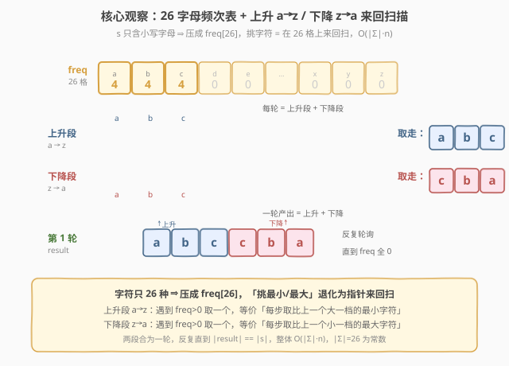
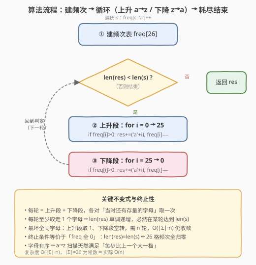
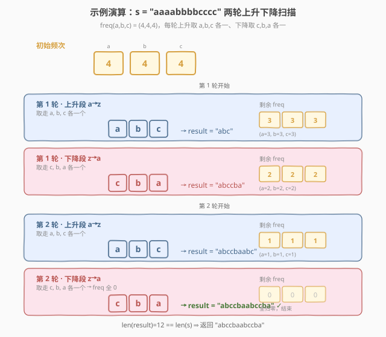

# LeetCode 上升下降字符串 题解

## 1. 题目概述

- **标题 / 题号**：上升下降字符串（#1370，easy）
- **链接**：https://leetcode.cn/problems/increasing-decreasing-string/
- **难度**：简单
- **标签**：字符串、计数、排序

**题意**：给定一个只含小写字母的字符串 `s`，用如下算法将其重排为结果串 `result`，直到 `s` 为空：

1. 从 `s` 中挑出**最小**字符，追加到 `result`，并从 `s` 中删除它；
2. 从 `s` 中挑出比上一个追加字符**更大**的最小字符，追加并删除；
3. 重复步骤 2 直到挑不出这样的字符；
4. 从 `s` 中挑出**最大**字符，追加到 `result`，并删除；
5. 从 `s` 中挑出比上一个追加字符**更小**的最大字符，追加并删除；
6. 重复步骤 5 直到挑不出这样的字符；
7. 重复步骤 1–6，直到 `s` 为空。

返回最终的 `result`。

**示例 1**：

```text
输入：s = "aaaabbbbcccc"
输出："abccbaabccba"
解释：
  第 1 轮：上升段取 a,b,c → 下降段取 c,b,a → 得 "abccba"，各字母各剩 2 个
  第 2 轮：上升段取 a,b,c → 下降段取 c,b,a → 追加 "abccba"
  最终拼接得 "abccbaabccba"
```

**示例 2**：

```text
输入：s = "rat"
输出："art"
```

**示例 3**：

```text
输入：s = "leetcode"
输出："cdelotee"
```

**示例 4**：

```text
输入：s = "gggggg"
输出："gggggg"
```

**示例 5**：

```text
输入：s = "spo"
输出："ops"
```

**约束**：

- $1 \le \text{s.length} \le 500$
- `s` 只含小写英文字母

> 💡 本题的灵魂是「**字符种类极少**」——只含 26 种小写字母。把 `s` 压缩成大小为 26 的**频次数组** `freq` 后，「挑最小/最大且可挑的字符」就退化成「在 `a..z` 或 `z..a` 上线性扫描」：上升段从 `a` 往 `z` 走，每个有存量的字母各取一个；下降段从 `z` 往 `a` 走，每个有存量的字母各取一个。两段合为一**轮**，反复轮询直到 26 个字母的频次全归零，整体 $O(|\Sigma| \cdot n)$，其中 $|\Sigma| = 26$ 为常数。

## 2. 解题思路

### 2.1 暴力思路：模拟原数组

最直白的做法：把 `s` 转成可删除的列表，严格按照步骤 1–6 反复在列表里线性查找「最小 / 比上一个大的最小 / 最大 / 比上一个小的最大」字符。

- **正确但低效**：每挑一个字符都要 $O(n)$ 扫一遍剩余列表，删除还要搬移元素；最坏要挑 $n$ 个字符，总计 $O(n^2)$；
- **挑字符的逻辑繁琐**：「比上一个更大的最小字符」需要边扫边维护候选，容易写错；
- **浪费结构**：`s` 只有 26 种字母，重复字母之间完全等价——逐个在原数组里挑，等于对同一个字母的多次拷贝重复劳动。

> ⚠️ 暴力不是错，但它把「26 种字母」这把钥匙闲置了。一旦意识到「相同字母可互换」，就该把 `s` 压缩成频次数组，让「挑字符」变成「指针在 26 格上来回扫」。

### 2.2 核心观察：频次数组 + 来回扫描



**关键洞察**：

- **字符只 26 种，相同字母完全等价**：`s` 中三个 `a` 谁先被挑无所谓，只要这一轮该轮到 `a` 就取一个。于是把 `s` 压成 `freq[0..25]`，`freq[i]` 表示第 `i` 个字母（`'a'+i`）的剩余个数。
- **「挑最小可挑字符」=「从 `a` 往 `z` 找第一个 `freq>0`」**：步骤 1–3 的上升段，本质是从 `'a'` 到 `'z'` 顺序扫描，遇到 `freq>0` 的字母就取走一个（`freq--`）并追加。扫完一遍后，所有「还能上升」的字母各贡献一次，恰好实现「每步取比上一个大一档的最小字符」。
- **「挑最大可挑字符」=「从 `z` 往 `a` 找第一个 `freq>0`」**：步骤 4–6 的下降段对称——从 `'z'` 到 `'a'` 逆序扫描，遇到存量就取一个。
- **一轮 = 上升段 + 下降段**：两段合起来各取走「当时还存在的字母各一个」。反复执行直到 `freq` 全 0，即 `result` 长度等于原串长度。

> 以 `s = "aaaabbbbcccc"` 为例：`freq[a]=freq[b]=freq[c]=4`。第 1 轮上升段扫 `a→c` 取走 `a,b,c` 各一个（各剩 3），下降段扫 `c→a` 取走 `c,b,a` 各一个（各剩 2），`result` 得 `"abccba"`。第 2 轮同理再得 `"abccba"`，拼成 `"abccbaabccba"`，频次全归零，结束。

> ⚠️ **为什么上升段「顺序扫一遍」就等价于「每步取比上一个更大的最小字符」？** 因为字母本身有序。从 `a` 往 `z` 扫，跳过 `freq=0` 的字母后，下一个 `freq>0` 的字母一定严格大于上一个被取的字母（字母表里更靠后）。每取一个就 `freq--`，扫到 `z` 时这一轮「还能上升」的字母都被取过一次。下降段同理对称。

### 2.3 算法流程图



**完整步骤**：

1. **建频次表**：`freq = [0]*26`，遍历 `s` 执行 `freq[c - 'a']++`；
2. **循环直到 `result` 长度 == `len(s)`**：
   - **上升段**：`for i in 0..25`：若 `freq[i] > 0`，则 `result += chr('a'+i)`，`freq[i]--`；
   - **下降段**：`for i in 25..0`：若 `freq[i] > 0`，则 `result += chr('a'+i)`，`freq[i]--`；
3. **返回** `result`。

> 💡 终止条件用 `len(result) < len(s)` 即可——每轮至少取走一个字母（除非 `s` 已空，但 `len(s)≥1` 时第一轮必取走），故循环必然在有限轮内结束，最多 $\lceil n / 2\rceil$ 轮（极端情况每轮只取走 2 个字母）。也可直接用「`freq` 全 0」作终止判据。

### 2.4 示例演算

以 `s = "aaaabbbbcccc"` 为例：



**初始频次**：

| 字母 | a | b | c |
|------|---|---|---|
| `freq` | 4 | 4 | 4 |

**第 1 轮**：

| 阶段 | 扫描方向 | 取走的字母 | `result` 累积 | 剩余 freq(a,b,c) |
|------|----------|-----------|---------------|-------------------|
| 上升段 | `a→c` | `a, b, c` | `"abc"` | `3, 3, 3` |
| 下降段 | `c→a` | `c, b, a` | `"abccba"` | `2, 2, 2` |

**第 2 轮**：

| 阶段 | 扫描方向 | 取走的字母 | `result` 累积 | 剩余 freq(a,b,c) |
|------|----------|-----------|---------------|-------------------|
| 上升段 | `a→c` | `a, b, c` | `"abccbaabc"` | `1, 1, 1` |
| 下降段 | `c→a` | `c, b, a` | `"abccbaabccba"` | `0, 0, 0` |

频次全归零，`len(result) = 12 == len(s)`，返回 `"abccbaabccba"` ✓

> 💡 注意**示例 4** `s = "gggggg"`：只有一种字母，每轮上升段取一个 `g`、下降段取一个 `g`，三轮后耗尽，得 `"gggggg"`——印证「上升段取走当时最小、下降段取走当时最大」对单一字母退化成「每轮取两个」。**示例 5** `s = "spo"`：`freq[o]=1,p=1,s=1`，第 1 轮上升段 `o,p,s` 得 `"ops"`，下降段无更小字母可取，直接结束，返回 `"ops"`。

## 3. 参考代码

### C++

```cpp
// 上升下降字符串.cpp —— 频次数组 + 来回扫描，O(|Σ|·n)
// 编译: g++ -O2 -std=c++17 上升下降字符串.cpp -o ids
#include <string>
#include <vector>
using namespace std;

class Solution {
public:
    string sortString(string s) {
        int freq[26] = {0};
        for (char c : s) freq[c - 'a']++;          // ① 建频次表
        string res;
        while (res.size() < s.size()) {            // ② 循环到耗尽
            for (int i = 0; i < 26; ++i) {         //   上升段 a→z
                if (freq[i] > 0) {
                    res.push_back('a' + i);
                    --freq[i];
                }
            }
            for (int i = 25; i >= 0; --i) {        //   下降段 z→a
                if (freq[i] > 0) {
                    res.push_back('a' + i);
                    --freq[i];
                }
            }
        }
        return res;
    }
};
```

### Python

```python
class Solution:
    def sortString(self, s: str) -> str:
        freq = [0] * 26
        for c in s:
            freq[ord(c) - 97] += 1                 # ① 建频次表

        res = []
        n = len(s)
        while len(res) < n:                        # ② 循环到耗尽
            for i in range(26):                    #   上升段 a→z
                if freq[i] > 0:
                    res.append(chr(97 + i))
                    freq[i] -= 1
            for i in range(25, -1, -1):            #   下降段 z→a
                if freq[i] > 0:
                    res.append(chr(97 + i))
                    freq[i] -= 1
        return "".join(res)
```

> 💡 两版等价，核心是「**频次表 + a→z / z→a 交替扫描**」。Python 版用 `res` 列表 + 末尾 `"".join` 拼接，避免字符串在循环里反复相加产生的 $O(n^2)$ 拷贝。C++ 的 `string::push_back` 均摊 $O(1)$，无需此优化。终止条件 `len(res) < n` 与「`freq` 全 0」等价——每轮至少取走一个字母，循环必然收敛。

## 4. 复杂度分析

| 维度 | 频次来回扫描（推荐） | 原数组模拟 |
|------|---------------------|------------|
| 时间复杂度 | $O(\lvert\Sigma\rvert \cdot n)$ | $O(n^2)$ |
| 空间复杂度 | $O(\lvert\Sigma\rvert + n)$ | $O(n)$ |
| 实际运算量 | `n=500,Σ=26` 约 $1.3\times10^4$ 步 | 约 $2.5\times10^5$ |

- **频次来回扫描**：每轮做两次 26 格扫描共 $2\lvert\Sigma\rvert$ 步，每轮至少取走 1 个字母（最坏每轮只取 1 个，如 `s` 全是同一个字母时下降段空转、上升段取 1 个，需 $n$ 轮），故上界 $O(\lvert\Sigma\rvert \cdot n)$。本题 $\lvert\Sigma\rvert = 26$ 为常数，实际时间 $O(n)$。$n=500$ 时约 $1.3\times10^4$ 步，比暴力快一个量级。
- **原数组模拟**：每取一个字符要 $O(n)$ 查找并删除，共 $n$ 个字符，$O(n^2)$。

> ⚠️ 严格上界：最坏情况是 `s` 全为同一字母（如示例 4 `"gggggg"`），此时上升段每轮取 1 个、下降段空转，需 $n$ 轮，每轮 $2\lvert\Sigma\rvert$ 步，总计 $O(\lvert\Sigma\rvert \cdot n)$。但即便如此，$n=500$、$\lvert\Sigma\rvert=26$ 也仅约 $1.3\times10^4$ 步，毫秒级。实际平均每轮取走多个字母，轮数远小于 $n$。

## 5. 扩展：桶排序视角与单趟构造

频次来回扫描本质是**桶排序的变体**：26 个桶代表 26 个字母，桶里放该字母的全部副本。普通桶排序只按 `a→z` 倒一次桶，得到升序串；本题要求「升序取一遍、降序取一遍」交替倒桶，故在桶排序外层套一层「来回」循环。

由此可推出一个等价的**单趟构造**写法——把每轮的上升段、下降段合视为「从桶里交替取头尾」：

```python
class Solution:
    def sortString(self, s: str) -> str:
        freq = [0] * 26
        for c in s:
            freq[ord(c) - 97] += 1
        res = []
        n = len(s)
        while len(res) < n:
            for i in range(26):                 # 取所有「还有存量」的桶各一个（升序）
                if freq[i]:
                    res.append(chr(97 + i))
                    freq[i] -= 1
            for i in range(25, -1, -1):         # 再取一遍（降序）
                if freq[i]:
                    res.append(chr(97 + i))
                    freq[i] -= 1
        return "".join(res)
```

> 💡 这与第 3 节代码完全一致，只是换个视角理解：**桶排序倒桶时来回倒**。对比 [1331. 数组序号转换](../1301-1400/1331_数组序号转换.md) 的「排序后去重映射排名」、[1365. 有多少小于当前数字的数字](../1301-1400/1365_有多少小于当前数字的数字.md) 的「频次+前缀和」——三者共享「值域小就压缩成频次/桶，避免比较排序」的选型思维，区别只在「倒桶」的方向与次数。

> ⚠️ 若题目放宽到「字符可重复无限次、要求字典序最小的合法重排」，则需贪心 + 栈（类似 [316. 去除重复字母](../0201-0300/316_去除重复字母.md)），不再是本题的机械来回扫描。本题的「合法」由算法步骤严格定义，无需字典序优化。

## 6. 面试要点

1. **如何想到用频次数组？**

   > 看到 `s` 只含小写字母——字符种类仅 26 种，这是计数/桶排序的信号。题目里「挑最小」「挑最大且比上一个小」等操作，在有序的 26 格表上退化为线性扫描指针，无需在原数组里逐个查找。把 `s` 压成 `freq[26]` 后，挑字符变成 $O(26)$ 扫描，整体 $O(\lvert\Sigma\rvert \cdot n)$。

2. **为什么「a→z 扫一遍」就等价于「每步取比上一个更大的最小字符」？**

   > 字母表本身有序。从 `a` 往 `z` 扫，跳过 `freq=0` 的字母后，下一个 `freq>0` 的字母一定严格大于上一个被取的（在字母表中更靠后）。每取一个 `freq--`，扫到 `z` 时所有「还能上升」的字母各被取一次。下降段从 `z` 往 `a` 扫，对称地实现「每步取比上一个更小的最大字符」。

3. **循环什么时候终止？为什么不会死循环？**

   > 用 `len(result) < len(s)` 判终止。每轮的上升段或下降段至少取走一个字母（除非 `freq` 已全 0，但那时 `len(result) == len(s)` 已退出）。最坏情况（全同一字母）每轮上升段取 1 个、下降段空转，需 $n$ 轮，但每轮必推进，故有限步内必然让 `len(result)` 增长到 `len(s)` 而退出，不会死循环。

4. **最坏时间复杂度是多少？为什么不是 $O(n^2)$？**

   > 最坏 $O(\lvert\Sigma\rvert \cdot n)$。最坏输入是全同一字母，需 $n$ 轮，每轮两次 26 格扫描共 $O(\lvert\Sigma\rvert)$，总计 $O(\lvert\Sigma\rvert \cdot n)$。由于 $\lvert\Sigma\rvert = 26$ 是常数，实际为 $O(n)$。与暴力 $O(n^2)$ 的区别在于：每步「挑字符」是 $O(\lvert\Sigma\rvert)$ 扫描 26 格而非 $O(n)$ 扫原数组，且删除是 `freq--` 的 $O(1)$ 而非搬移元素的 $O(n)$。

5. **示例 4「gggggg」为什么输出仍是「gggggg」？**

   > 只有一种字母时，每轮上升段取一个 `g`、下降段也取一个 `g`（`g` 既是最小也是最大），三轮后六个 `g` 全部取完，结果自然是 `"gggggg"`。这印证「上升段取当时最小、下降段取当时最大」对单一字母退化为「每轮取两个」，且因字母相同，顺序无关。

> 💡 **一句话总结**：1370 的灵魂是「**字符种类极少 → 频次表 + 来回扫描**」——把 `s` 压成 26 格频次表，上升段 `a→z`、下降段 `z→a` 交替取走存量，机械轮询直到耗尽。本质是桶排序的「来回倒桶」变体，看到只含小写字母就条件反射想频次数组。

## 同类练习题

| # | 题目 | 与本题的关联 |
|---|------|-------------|
| 1365 | [有多少小于当前数字的数字](https://leetcode.cn/problems/how-many-numbers-are-smaller-than-the-current-number/)（[题解](../1301-1400/1365_有多少小于当前数字的数字.md)） | 值域极小用频次+前缀和替代逐个比较，与本题「26 字母压频次表」共享「值域小就计数」的选型思维 |
| 1356 | [根据数字二进制下 1 的数目排序](https://leetcode.cn/problems/sort-integers-by-the-number-of-1-bits/)（[题解](../1301-1400/1356_根据数字二进制下1的数目排序.md)） | 值域小用桶排序做到线性，对照本题「频次表来回倒桶」的桶排序变体 |
| 1332 | [删除回文子序列](https://leetcode.cn/problems/remove-palindromic-subsequences/)（[题解](../1301-1400/1332_删除回文子序列.md)） | 同为简单字符串题，利用「只有两种字母」的特殊结构把问题降到 1–2 步，与本题「只 26 种字母」的结构利用呼应 |
| 1331 | [数组序号转换](https://leetcode.cn/problems/rank-transform-of-an-array/)（[题解](../1301-1400/1331_数组序号转换.md)） | 排序后去重映射排名，与本题「频次表/桶排序压缩值域」对照两种值域处理思路 |
| 316 | [去除重复字母](https://leetcode.cn/problems/remove-duplicate-letters/)（[题解](../0201-0300/316_去除重复字母.md)） | 字符串重排求字典序最小的进阶版，贪心+单调栈，对照本题「重排规则由算法机械定义、无需字典序优化」的边界 |
