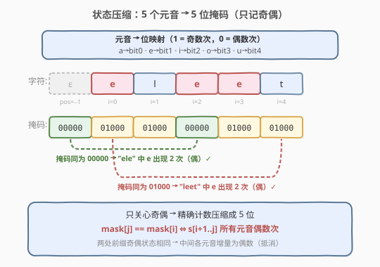
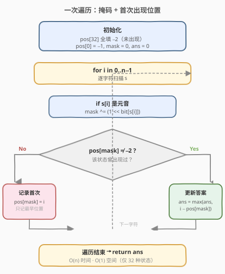
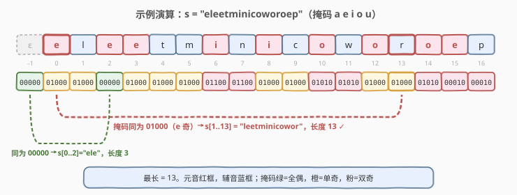

# LeetCode 每个元音包含偶数次的最长子字符串 题解

## 1. 题目概述

- **标题 / 题号**：每个元音包含偶数次的最长子字符串（#1371，medium）
- **链接**：https://leetcode.cn/problems/find-the-longest-substring-containing-vowels-in-even-counts/
- **难度**：中等
- **标签**：位运算、哈希表、字符串、前缀和

**题意**：给定一个字符串 `s`，返回其中**每个元音字母 `a`、`e`、`i`、`o`、`u` 都出现偶数次**的最长非空子字符串的长度。（0 次也算偶数次）

**示例 1**：

```text
输入：s = "eleetminicoworoep"
输出：13
解释：最长子字符串是 "leetminicowor" ，它含有 2 个 e、2 个 i、2 个 o，且没有 a、u，所有元音均出现偶数次。
```

**示例 2**：

```text
输入：s = "leetcodeisgreat"
输出：5
解释：最长子字符串是 "leetc" ，其中含有 2 个 e，其余元音均为 0 次。
```

**示例 3**：

```text
输入：s = "bcbcbc"
输出：6
解释：整个字符串中没有任何元音，所有元音均为 0 次（偶数），故答案为 6。
```

**约束**：

- `1 <= s.length <= 5 * 10^5`
- `s` 仅含小写英文字母

## 2. 解题思路

### 2.1 暴力思路

枚举所有子字符串 `[i, j]`，逐个统计其中 5 个元音的出现次数并判断奇偶。两重循环 + 计数共 $O(n^3)$；用前缀计数优化到 $O(n^2)$，在 $n = 5 \times 10^5$ 时仍会超时。

### 2.2 核心观察：状态压缩 + 前缀奇偶



**关键观察**：我们**不关心每个元音到底出现了几次**，只关心它的**奇偶性**（偶=0，奇=1）。于是 5 个元音的奇偶状态可压缩成一个 **5 位掩码**：

- `a → bit0`、`e → bit1`、`i → bit2`、`o → bit3`、`u → bit4`
- 扫到某个元音时，把对应位**翻转**（`mask ^= (1 << bit)`），即偶↔奇切换。

定义前缀掩码 `mask[i]` 表示 `s[0..i-1]` 中各元音的奇偶状态（`mask[0] = 0` 表示空前缀全偶）。则子字符串 `s[i..j-1]` 中**所有元音都出现偶数次**，当且仅当：

$$
\text{mask}[j] == \text{mask}[i]
$$

> 💡 **为什么？** 两处前缀的奇偶状态相同，意味着中间这段每个元音的增量为**偶数**（奇偶相消），即该子串里每个元音都出现偶数次。这与 [525. 连续数组](https://leetcode.cn/problems/contiguous-array/)（0 当 −1，前缀和相等 → 0/1 数目相等）、[974. 和可被 K 整除的子数组](../0901-1000/974_和可被K整除的子数组.md)（同余 → 区间和被 K 整除）一脉相承：把"区间满足某条件"转化为"两处前缀状态相同"。

于是问题变成：**找两处相同掩码，使其下标距离最大**。因为只有 32 种掩码，用一个大小为 32 的数组记录每种掩码**首次出现的位置**即可。

### 2.3 哈希表优化：一次遍历

不必先算出所有前缀掩码再两两比较，可以**边走边查**：

1. 用数组 `pos[32]` 记录每种掩码首次出现的下标，初始化为 `-2`（哨兵，表示"未出现"）。
2. 特殊处理：`pos[0] = -1`，表示"全偶状态"在串开始前（下标 −1）已出现一次——这样从下标 0 开始的合法子串也能被匹配到。
3. 维护当前 `mask`，每扫到一个元音就翻转对应位。
4. 每个位置 `i` 处理后：
   - 若 `pos[mask] != -2`（该状态出现过）：用 `i - pos[mask]` 更新答案（取最大）。
   - 否则：记录 `pos[mask] = i`（**只记首次**，距离才可能最大）。

> ⚠️ **为什么只记首次出现？** 因为要最大化 `j - i`，对于同一个掩码，左端点越靠左，可能的跨度越大。后续再出现同掩码时只用来当右端点 `j`，不更新左端点。

### 2.4 算法流程图



### 2.5 示例演算

以 `s = "eleetminicoworoep"`（示例 1）为例，掩码按 `a e i o u` 顺序显示：



逐步状态如下（下标从 0 开始，`pos[0] = -1` 为初始）：

| i | char | mask | pos[mask] 首次 | ans 更新 |
|---|------|------|----------------|----------|
| −1 | ε | 00000 | 记录 pos[0]=−1 | — |
| 0 | e | 01000 | 未出现 → pos[01000]=0 | 0 |
| 1 | l | 01000 | 命中 0 → 1−0=1 | 1 |
| 2 | e | 00000 | 命中 −1 → 2−(−1)=3 | 3 |
| 3 | e | 01000 | 命中 0 → 3−0=3 | 3 |
| 4 | t | 01000 | 命中 0 → 4−0=4 | 4 |
| 5 | m | 01000 | 命中 0 → 5−0=5 | 5 |
| 6 | i | 01100 | 未出现 → pos[01100]=6 | 5 |
| 7 | n | 01100 | 命中 6 → 7−6=1 | 5 |
| 8 | i | 01000 | 命中 0 → 8−0=8 | 8 |
| 9 | c | 01000 | 命中 0 → 9−0=9 | 9 |
| 10 | o | 01010 | 未出现 → pos[01010]=10 | 9 |
| 11 | w | 01010 | 命中 10 → 1 | 9 |
| 12 | o | 01000 | 命中 0 → 12−0=12 | 12 |
| 13 | r | 01000 | 命中 0 → 13−0=13 | **13** |
| 14 | o | 01010 | 命中 10 → 4 | 13 |
| 15 | e | 00010 | 未出现 → pos[00010]=15 | 13 |
| 16 | p | 00010 | 命中 15 → 1 | 13 |

最终答案为 `13`，对应子串 `s[1..13] = "leetminicowor"`（`pos[01000]=0` 与 `i=13` 匹配），其中 e、i、o 各出现 2 次。

## 3. 参考代码

### C++

```cpp
class Solution {
  public:
    int findTheLongestSubstring(string s) {
        int pos[32];
        for (int i = 0; i < 32; ++i) pos[i] = -2;   // 哨兵：未出现
        pos[0] = -1;                                 // 全偶状态在串前出现一次

        int mask = 0, ans = 0;
        for (int i = 0; i < (int)s.size(); ++i) {
            char c = s[i];
            if (c == 'a')      mask ^= 1;            // bit0
            else if (c == 'e') mask ^= 2;            // bit1
            else if (c == 'i') mask ^= 4;            // bit2
            else if (c == 'o') mask ^= 8;            // bit3
            else if (c == 'u') mask ^= 16;           // bit4

            if (pos[mask] != -2) {
                ans = max(ans, i - pos[mask]);       // 同掩码取最大跨度
            } else {
                pos[mask] = i;                       // 只记首次出现
            }
        }
        return ans;
    }
};
```

### Python

```python
class Solution:
    def findTheLongestSubstring(self, s: str) -> int:
        pos = [-2] * 32
        pos[0] = -1  # 全偶状态在串前出现一次

        mask = ans = 0
        for i, c in enumerate(s):
            if c in "aeiou":
                mask ^= 1 << "aeiou".index(c)
            if pos[mask] != -2:
                ans = max(ans, i - pos[mask])
            else:
                pos[mask] = i
        return ans
```

> 💡 **优化**：掩码只有 32 种取值，用定长数组 `pos[32]` 比哈希表更快、更省空间。C++ 中用 `if-else` 链翻转位比查表略直观；Python 借 `"aeiou".index(c)` 一行完成位定位。

## 4. 复杂度分析

| 维度 | 复杂度 | 说明 |
|------|--------|------|
| 时间复杂度 | $O(n)$ | 只遍历字符串一次，每次翻转位 + 数组查询均为 $O(1)$ |
| 空间复杂度 | $O(1)$ | `pos` 数组大小恒为 32，与输入规模无关 |

> ⚠️ 本题 `n` 可达 $5 \times 10^5$，$O(n)$ 是必须的；$O(1)$ 额外空间得益于状态数被压缩到常数 32。

## 5. 扩展：前缀状态相等的思想

"两处前缀状态相同 ⇒ 中间区间满足某条件"是一类通用范式，状态可以是：

- **前缀和**（[560. 和为 K 的子数组](../0501-0600/560_和为K的子数组.md)：`prefix[j] - prefix[i] == k`）
- **前缀和模 K**（[974. 和可被 K 整除的子数组](../0901-1000/974_和可被K整除的子数组.md)：`prefix[j] ≡ prefix[i] (mod K)`）
- **0/1 计数差**（[525. 连续数组](https://leetcode.cn/problems/contiguous-array/)：把 0 当 −1，`prefix[j] == prefix[i]`）
- **多维奇偶状态**（本题：5 个元音的奇偶压缩成 5 位掩码）

> 💡 当题目涉及"区间内若干计数满足奇偶/同余/相等"时，优先考虑**前缀状态 + 首次出现位置**。求最长用"只记首次"，求计数用"记出现次数"。

## 6. 面试要点

1. **为什么用位掩码而不是分别记录 5 个计数？**
   - 题目只问奇偶性，精确计数是冗余信息。5 个布尔（奇/偶）压成 5 位整数，状态数从"无限"降到 32，可直接用数组 $O(1)$ 查询，避免哈希开销。

2. **为什么 `pos[0]` 要初始化为 `-1`？**
   - 掩码 0 表示"所有元音都偶数次"。串开始前（下标 −1）的状态就是全偶，若某个前缀 `mask[j] == 0`，则 `s[0..j]` 整段合法，长度 `j - (-1) = j + 1`。不初始化会漏掉"从下标 0 开始的合法子串"。

3. **为什么只记录每种掩码的首次出现？**
   - 求最长子串 → 最大化 `j - i` → 对同一掩码，左端点 `i` 越小跨度越大。因此只记最早出现的位置，后续遇到同掩码只作右端点 `j` 参与更新。

4. **与 525（连续数组）的联系？**
   - 525 把 0 当 −1，化"0/1 数目相等"为"前缀和相等"，本质是 1 维状态相等；本题是 5 维（5 个元音）奇偶状态相等，压缩成 5 位掩码后处理方式完全一致。

5. **如果题目改成"恰好某元音出现奇数次"怎么做？**
   - 仍是前缀状态，但需枚举"目标状态"——例如要求 e 恰好奇数次而其余偶数次，则目标掩码为 `00010`，找 `mask[j] == 00010` 与 `mask[i] == 00000`（或更一般地 `mask[j] ^ mask[i] == 00010`）的最大跨度。

## 同类练习题

| # | 题目 | 与本题的关联 |
|---|------|-------------|
| 525 | [连续数组](https://leetcode.cn/problems/contiguous-array/) | 0 当 −1，前缀和相等 ⇒ 0/1 数目相等，1 维版状态相等 |
| 974 | [和可被 K 整除的子数组](https://leetcode.cn/problems/subarray-sums-divisible-by-k/)（[题解](../0901-1000/974_和可被K整除的子数组.md)） | 前缀和同余 ⇒ 区间和被 K 整除，求计数用"记次数" |
| 560 | [和为 K 的子数组](https://leetcode.cn/problems/subarray-sum-equals-k/)（[题解](../0501-0600/560_和为K的子数组.md)） | 前缀和差等于 k，前缀状态范式的母题 |
| 1915 | [奇妙子数组数目](https://leetcode.cn/problems/number-of-wonderful-substrings/) | 本题的进阶版，至多一个元音奇数次，状态压缩 + 枚举翻转一位 |
| 1371 | [每个元音包含偶数次的最长子字符串](https://leetcode.cn/problems/find-the-longest-substring-containing-vowels-in-even-counts/) | 本题，5 位掩码 + 首次出现位置求最长 |
