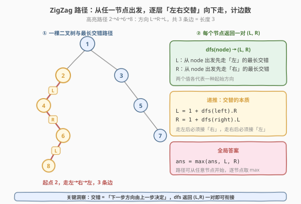
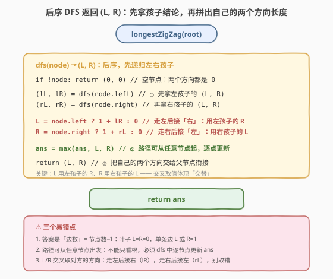
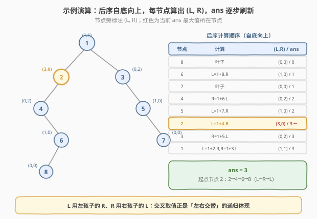

# LeetCode 二叉树中的最长交错路径 题解

## 1. 题目概述

- **标题 / 题号**：二叉树中的最长交错路径（#1372，medium）
- **链接**：https://leetcode.cn/problems/longest-zigzag-path-in-a-binary-tree/
- **难度**：中等
- **标签**：树、二叉树、深度优先搜索（DFS）、后序遍历

**题意**：给你一棵以 `root` 为根的二叉树。**交错路径（ZigZag path）**定义如下：

1. 选择二叉树中**任意**节点和一个方向（左或右）；
2. 按所选方向走到对应子节点；
3. **改变方向**（左变右、右变左）；
4. 重复第 2、3 步，直到无法继续移动。

路径长度 = **访问过的节点数 − 1**（即边数；单节点路径长度为 0）。返回给定树中**最长交错路径**的长度。

**示例 1**：

```text
输入：root = [1,null,1,1,1,null,null,1,1,null,1,null,null,null,1,null,1]
输出：3
解释：蓝色节点构成最长交错路径（右 → 左 → 右），3 条边。
```

**示例 2**：

```text
输入：root = [1,1,1,null,1,null,null,1,1,null,1]
输出：4
解释：最长交错路径（左 → 右 → 左 → 右），4 条边。
```

**示例 3**：

```text
输入：root = [1]
输出：0
```

**约束**：

- 树中节点数目在范围 $[1,\, 5 \times 10^4]$ 内
- 每个节点的值在 $[1,\, 100]$ 之间

> 💡 本题的灵魂是「**下一步方向由上一步决定**」——交错性意味着递归不能只返回一个标量，而要返回**一对** $(L, R)$：从当前节点出发分别先走左、先走右的最长交错长度。走左之后必须接右，所以 $L$ 用的是**左孩子的 $R$**；走右之后必须接左，所以 $R$ 用的是**右孩子的 $L$**——「交叉取值」正是交替的递归体现。

## 2. 解题思路

### 2.1 暴力思路：枚举每个起点 + 每次重新沿路径走

最直观的做法：枚举树中每个节点作为起点，再枚举起始方向（左/右），然后顺着交错规则一步步往下走，统计能走多少条边，取全局最大。

问题在于——

- **重复遍历**：从不同起点出发的路径会大量重叠。例如从父节点 `p` 先走左到孩子 `c`、再走右…… 这条「`c` 出发先走右」的子路径，在枚举起点 `c` 时已经走过一遍了。每个起点 $O(h)$，总计 $O(n \cdot h)$，退化链表时 $O(n^2)$；
- **没有复用子问题结论**：交错路径具有**最优子结构**——「从 `c` 出发先走右的最长长度」是固定值，无论上层从谁来衔接都一样。重算它纯属浪费。

> ⚠️ 这种「枚举起点 + 现场走」的写法完全没利用「**子路径长度只取决于起点和首步方向，与上层如何到达无关**」的性质。一旦让每个节点递归返回 $(L, R)$ 一对值，任何上层节点都能 $O(1)$ 接力。

### 2.2 核心观察：每个节点返回一对 (L, R)，交叉取值接力



**关键洞察**：定义 $\text{dfs}(\text{node})$ 返回一对 $(L, R)$：

- $L$ = 从 `node` 出发、**第一步向左**的最长交错路径长度（边数）；
- $R$ = 从 `node` 出发、**第一步向右**的最长交错路径长度（边数）。

**交替性决定递推关系**：从 `node` 先走左到 `left` 后，下一步**必须走右**——这恰好是 `left` 出发先走右的最长交错，即 $\text{dfs}(\text{left}).R$。所以：

$$
L = \begin{cases} 1 + \text{dfs}(\text{left}).R & \text{若左孩子存在} \\ 0 & \text{否则} \end{cases}
$$

$$
R = \begin{cases} 1 + \text{dfs}(\text{right}).L & \text{若右孩子存在} \\ 0 & \text{否则} \end{cases}
$$

> ⚠️ 注意是**交叉取值**：$L$（先走左）接的是左孩子的 $R$（再走右）；$R$（先走右）接的是右孩子的 $L$（再走左）。若误写成 $L = 1 + \text{dfs}(\text{left}).L$ 就变成了「一直往左走」的单向链，丢掉了交替语义。

**路径可从任意节点出发**：因此不能只看根的返回值。在后序遍历中，每个节点算出自己的 $(L, R)$ 后，立即用 $\max(L, R)$ 更新全局答案 `ans`。最终 `ans` 即所求。

> 💡 **为什么必须后序？** $L$ 依赖左孩子的 $R$、$R$ 依赖右孩子的 $L$——结论依赖孩子子树。前序在访问节点时孩子尚未处理，拿不到 $(L, R)$。后序「先孩子后自己」保证当前节点拼接时孩子结论已就绪——这与 [543. 二叉树的直径](../0501-0600/543_二叉树的直径.md)「后序返回深度拼直径」是同一个模板。

### 2.3 算法流程图



**完整流程**（单趟后序 DFS）：

1. **入口** `longestZigZag(root)`：初始化全局 `ans = 0`，调用 `dfs(root)`；
2. **`dfs(node)` 后序递归**：
   - 空节点返回 $(0, 0)$（不贡献边）；
   - **先递归**：$(l_L, l_R) = \text{dfs}(\text{node.left})$，$(r_L, r_R) = \text{dfs}(\text{node.right})$；
   - **再拼接**：$L = \text{left 存在}\ ?\ 1 + l_R : 0$，$R = \text{right 存在}\ ?\ 1 + r_L : 0$；
   - **更新全局**：$\text{ans} = \max(\text{ans}, L, R)$；
   - **返回** $(L, R)$ 供父节点衔接；
3. **返回** `ans`。

> 💡 **空节点返回 (0, 0) 的妙处**：若让空节点返回 $(-1, -1)$，则 $L = 1 + (-1) = 0$ 可省去 `left 存在` 的条件判断，写法更简洁（见下文 C++ 版）。两种写法等价，本文主流程显式判存在更易读，代码段给出 `-1` 技巧版。

### 2.4 示例演算

以下面这棵树为例（最长交错长度为 3）：

```text
        1
       / \
      2   3
     /     \
    4       5
     \     /
      6   7
     /
    8
```



按后序顺序（8 → 6 → 7 → 4 → 5 → 2 → 3 → 1）逐节点计算：

| 节点 | 左孩子 $(l_L,l_R)$ | 右孩子 $(r_L,r_R)$ | $L = 1+l_R$（若有左） | $R = 1+r_L$（若有右） | 返回 $(L,R)$ | `ans` |
|------|--------------------|--------------------|----------------------|----------------------|--------------|-------|
| 8 | —（空） | —（空） | 0 | 0 | $(0,0)$ | 0 |
| 6 | $(0,0)$ | —（空） | $1+0=1$ | 0 | $(1,0)$ | 1 |
| 7 | —（空） | —（空） | 0 | 0 | $(0,0)$ | 1 |
| 4 | —（空） | $(1,0)$ | 0 | $1+1=2$ | $(0,2)$ | 2 |
| 5 | $(0,0)$ | —（空） | $1+0=1$ | 0 | $(1,0)$ | 2 |
| **2** | $(0,2)$ | —（空） | $1+2=3$ | 0 | $(3,0)$ | **3** |
| 3 | —（空） | $(1,0)$ | 0 | $1+1=2$ | $(0,2)$ | 3 |
| 1 | $(3,0)$ | $(0,2)$ | $1+0=1$ | $1+0=1$ | $(1,1)$ | 3 |

最长交错路径起点为节点 2：$2 \xrightarrow{L} 4 \xrightarrow{R} 6 \xrightarrow{L} 8$，3 条边，`ans = 3`。

> 💡 注意根节点 1 返回 $(1,1)$——从根出发走任一方向只能走 1 条边（因为 2 没有右孩子、3 没有左孩子，无法继续交替）。若只看根就会误判答案为 1，这正是「**路径可从任意节点出发，必须逐节点更新 `ans`**」的体现，与 [543. 二叉树的直径](../0501-0600/543_二叉树的直径.md) 中「直径不一定过根」同理。

## 3. 参考代码

### C++

```cpp
// 二叉树中的最长交错路径.cpp —— 后序 DFS 返回 (L,R)，O(n)
// 编译: g++ -O2 -std=c++17 二叉树中的最长交错路径.cpp -o zigzag
#include <algorithm>
using namespace std;

struct TreeNode {
    int val;
    TreeNode* left;
    TreeNode* right;
    TreeNode() : val(0), left(nullptr), right(nullptr) {}
    TreeNode(int x) : val(x), left(nullptr), right(nullptr) {}
    TreeNode(int x, TreeNode* l, TreeNode* r) : val(x), left(l), right(r) {}
};

class Solution {
    int ans = 0;

    // 返回 (L, R)：从 node 出发分别先走左、先走右的最长交错长度
    // 空节点返回 (-1, -1)，使得 1 + (-1) = 0，省去存在性判断
    pair<int,int> dfs(TreeNode* node) {
        if (!node) return {-1, -1};
        auto [lL, lR] = dfs(node->left);
        auto [rL, rR] = dfs(node->right);
        int L = 1 + lR;              // 走左后接「右」：用左孩子的 R
        int R = 1 + rL;              // 走右后接「左」：用右孩子的 L
        ans = max({ans, L, R});      // 路径可从任意节点起，逐点更新
        return {L, R};
    }

public:
    int longestZigZag(TreeNode* root) {
        ans = 0;
        dfs(root);
        return ans;
    }
};
```

### Python

```python
class Solution:
    def longestZigZag(self, root: TreeNode | None) -> int:
        ans = 0

        def dfs(node: TreeNode | None) -> tuple[int, int]:
            # 返回 (L, R)：从 node 出发分别先走左、先走右的最长交错长度
            # 空节点返回 (-1, -1)，使得 1 + (-1) = 0，省去存在性判断
            nonlocal ans
            if not node:
                return (-1, -1)
            lL, lR = dfs(node.left)
            rL, rR = dfs(node.right)
            L = 1 + lR                # 走左后接「右」：用左孩子的 R
            R = 1 + rL                # 走右后接「左」：用右孩子的 L
            ans = max(ans, L, R)      # 路径可从任意节点起，逐点更新
            return (L, R)

        dfs(root)
        return ans
```

> 💡 两版等价，核心只有一步：**后序拿到孩子的 $(L,R)$，交叉拼出自己的 $(L,R)$，顺手更新 `ans`**。空节点返回 $(-1,-1)$ 是常用技巧——让 `1 + (-1) = 0` 自动处理「无该方向孩子」的情形，省去显式 `if`，代码更紧凑；若觉得 `-1` 不直观，改为判空返回 `(0,0)` 并显式判断孩子存在亦可（见 2.3 流程）。

## 4. 复杂度分析

| 维度 | 后序 DFS 返回 (L,R)（推荐） | 暴力枚举起点 + 现场走 |
|------|----------------------------|----------------------|
| 时间复杂度 | $O(n)$（每个节点访问一次） | $O(n \cdot h)$，退化链表 $O(n^2)$ |
| 空间复杂度 | $O(h)$（递归栈，$h$ 为树高） | $O(h)$ |
| 实际运算量 | $n = 5\times10^4$ 约 $5\times10^4$，毫秒级 | 链式退化约 $2.5\times10^9$，超时 |

> ⚠️ **空间说明**：递归栈深度为树高 $h$，平衡树 $O(\log n)$，退化为链表 $O(n)$。本题 $n \leq 5\times10^4$，即便链式退化也安全；若树深达数十万层存在栈溢出顾虑，可改用显式栈模拟后序。

## 5. 扩展：方向参数版与「最长边数」语义辨析

### 5.1 方向参数版：用单个布尔替代 (L, R) 一对

除「返回一对 $(L, R)$」外，还有一种等价写法：**带方向参数的 DFS**——`dfs(node, dir)` 表示「到达 `node` 时上一步走的是 `dir` 方向，从 `node` 继续向**另一**方向延伸能走多远」。

```python
def longestZigZag(self, root: Optional[TreeNode]) -> int:
    self.ans = 0
    def dfs(node, go_left, length):   # length: 到达 node 已累计的边数
        if not node:
            return
        self.ans = max(self.ans, length)
        if go_left:                   # 本步该走左
            dfs(node.left,  False, length + 1)   # 走左，下一步转右
            dfs(node.right, True,  0)            # 另起一段：从右孩子开始向左
        else:                        # 本步该走右
            dfs(node.right, True,  length + 1)   # 走右，下一步转左
            dfs(node.left,  False, 0)            # 另起一段：从左孩子开始向右
    if root:
        dfs(root.left,  False, 1)    # 根出发先走左，下一步该右
        dfs(root.right, True,  1)    # 根出发先走右，下一步该左
    return self.ans
```

这种写法把「继续接力」与「另起一段」拆成两个递归调用，逻辑直白但调用数翻倍，常数因子略大。**返回 $(L,R)$ 一对的版本**把「另起一段」隐含在「每个节点都更新 `ans`」中，更紧凑，是首选。

### 5.2 「最长边数」与「最长节点数」的差一陷阱

本题定义**长度 = 访问节点数 − 1 = 边数**，单节点为 0。代码中：

- 空节点返回 $(-1, -1)$，于是叶子节点 $L = 1 + (-1) = 0$、$R = 0$——叶子出发无可走边，正确；
- 走一条边到孩子后，$L = 1 + \text{child}.R$，`1` 正是这条新边的计数。

若误把空节点返回 $(0, 0)$ 又不做存在性判断，则叶子会得到 $L = 1 + 0 = 1$，**凭空多算一条不存在的边**，整体偏大 1。这是本题最高频的差一 bug。规避方式二选一：**空节点返回 $(-1,-1)$**（本文代码），或**空节点返回 $(0,0)$ 但显式判断孩子是否存在**（2.3 流程写法）。

> ⚠️ 对照 [543. 二叉树的直径](../0501-0600/543_二叉树的直径.md)：直径也是计边数，空节点深度返回 $0$、叶子深度 $1$，直径 $= \text{left.depth} + \text{right.depth}$（两段深度相加恰为边数）。两题都需小心「节点数 vs 边数」的差一，但 543 用「深度」语义（空=0），1372 用「边数」语义（空=−1）更自然——因为 1372 的 $L/R$ 直接就是「从本节点出发能走的边数」，空节点没出发已是 $0$ 条可衔接边，故返回 $-1$ 让 `1+(-1)=0`。

## 6. 面试要点

1. **为什么递归要返回一对 $(L, R)$ 而不是单个值？**

   > 交错路径的下一步方向由上一步决定。从某节点出发，先走左与先走右是**两条不同的路径**，长度未必相等。父节点衔接时：先走左到本节点后需接右，要用本节点的 $R$；先走右到本节点后需接左，要用本节点的 $L$。若只返回一个标量，父节点无法知道「另一个方向能走多远」，交替性就断了。返回一对正是为了给上层两种衔接方式各提供一条信息。

2. **为什么 $L$ 用左孩子的 $R$、$R$ 用右孩子的 $L$？能写成 $L = 1 + \text{left}.L$ 吗？**

   > 不能。$L$ 表示「先走左」，走到左孩子后**下一步必须改成右**，所以接的是左孩子「先走右」的长度 $R$，即 $L = 1 + \text{left}.R$。若写成 $1 + \text{left}.L$，等于走到左孩子后**继续向左**，变成单向链，丢掉了「交替」语义。这个「交叉取值」是本题最核心也最易写错的一行。

3. **为什么答案不能只看根的返回值，要在 DFS 中逐节点更新 `ans`？**

   > 最长交错路径**可从任意节点出发**，不一定从根开始。例如本文示例中根返回 $(1,1)$，但最长路径起点是节点 2（$(3,0)$）。若只取根的 $\max(L,R)$ 会漏掉所有非根起点。因此在后序遍历中，每个节点算出自己的 $(L,R)$ 后立即用 $\max(L,R)$ 更新全局 `ans`——这与 [543. 二叉树的直径](../0501-0600/543_二叉树的直径.md)「直径不一定过根，需逐节点更新」完全同理。

4. **空节点为什么返回 $(-1, -1)$？返回 $(0, 0)$ 会怎样？**

   > 本题长度按**边数**计，单节点为 0。空节点返回 $(-1,-1)$，于是 `1 + (-1) = 0`，让「无该方向孩子」的情形自动得到 0，省去显式判空。若返回 $(0,0)$ 又不判存在，叶子会得到 $L = 1+0 = 1$，凭空多算一条不存在的边，整体偏大 1——这是最高频的差一 bug。规避方式：要么空节点返回 $(-1,-1)$，要么返回 $(0,0)$ 但显式判断孩子是否存在。

5. **本题与 543（直径）/ 687（最长同值路径）有何异同？**

   > 三者都是「**后序 DFS 返回值 + 全局 `ans` 更新**」模板：孩子返回结论，父节点拼接出候选，`max` 刷新全局最优，且最优解不一定过根。区别在「返回什么、怎么拼」：543 返回深度、候选 $= \text{left.depth}+\text{right.depth}$（拼左右两段）；687 返回同值方向链长、需判值相等；1372 返回**一对** $(L,R)$、候选 $= \max(L,R)$、拼接是**交叉取值**（$L$ 接 $\text{left}.R$）。1372 的独特之处在于「方向交替」迫使返回值从标量升级为序对。

> 💡 **一句话总结**：1372 的灵魂是「**交错 = 交叉取值**」——后序 DFS 让每个节点返回一对 $(L, R)$，$L = 1 + \text{left}.R$、$R = 1 + \text{right}.L$，逐节点用 $\max(L,R)$ 更新 `ans`。这个「后序返回序对驱动全局最优」是「树上带状态路径」问题的通用范式。

## 同类练习题

| # | 题目 | 与本题的关联 |
|---|------|-------------|
| 543 | [二叉树的直径](https://leetcode.cn/problems/diameter-of-binary-tree/) | 同为后序 DFS + 全局 `ans` 更新，孩子返回深度、父节点拼「左右深度之和」刷新直径；对照 1372 返回 $(L,R)$ 一对、拼「交叉方向长度」——「后序返回值驱动全局最优」的经典范式，且最优解都不一定过根 |
| 687 | [最长同值路径](https://leetcode.cn/problems/longest-univalue-path/) | 后序 DFS 返回「从当前节点出发的同值方向链长」，父节点拼左右两段刷新最长同值路径；对照 1372 返回「方向交错链长」——同为「带约束的方向链拼接」，约束从「同值」换成「方向交替」 |
| 124 | [二叉树中的最大路径和](https://leetcode.cn/problems/binary-tree-maximum-path-sum/) | 后序 DFS 返回子树最大贡献值，用「左贡献 + 右贡献 + 节点值」刷新全局最大路径和；对照 1372 的「$\max(L,R)$」刷新——同为「后序聚合 + 全局 max」但聚合方式不同 |
| 1339 | [分裂二叉树的最大乘积](../1301-1400/1339_分裂二叉树的最大乘积.md) | 后序 DFS 返回子树和，用 $S \cdot (\text{total}-S)$ 刷新全局最大乘积；对照 1372 返回 $(L,R)$ 用 $\max(L,R)$ 刷新——同为「后序返回值 + 全局 max 更新」但 1372 返回序对、1339 返回标量 |
