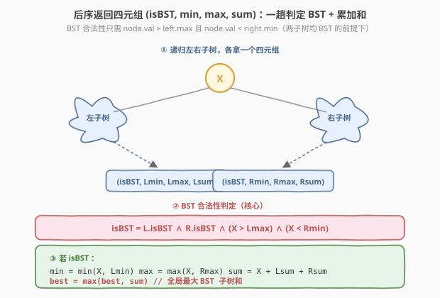
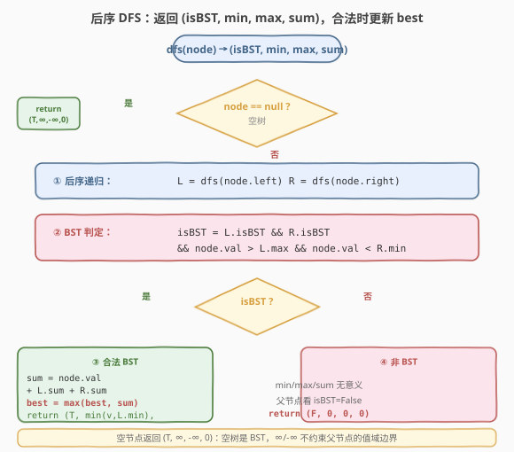
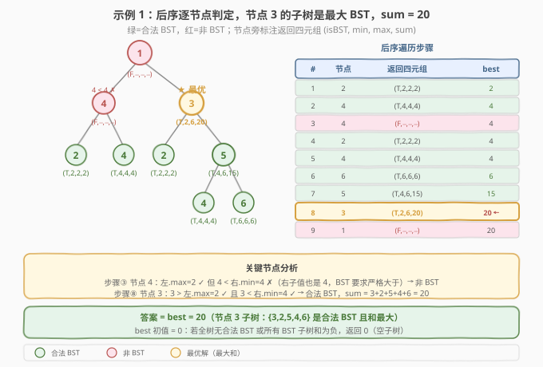

# 二叉搜索子树的最大键值和

- **题目名称**：二叉搜索子树的最大键值和
- **链接**：[1373. 二叉搜索子树的最大键值和](https://leetcode.cn/problems/maximum-sum-bst-in-binary-tree/)
- **难度**：困难
- **标签**：树、二叉树、二叉搜索树（BST）、深度优先搜索（DFS）、后序遍历

## 1. 题目概述

给你一棵以 `root` 为根的**二叉树**，返回**任意**二叉搜索子树的最大键值和。

二叉搜索树（BST）的定义：

- 任意节点的左子树中的键值都**小于**此节点的值
- 任意节点的右子树中的键值都**大于**此节点的值
- 任意节点的左、右子树都是二叉搜索树

**示例 1**：

```text
输入：root = [1,4,3,2,4,2,5,null,null,null,null,null,null,4,6]
输出：20
解释：键值为 3 的子树是和最大的二叉搜索树。

            1
           / \
          4   3
         / \ / \
        2  4 2  5
               / \
              4   6

子树 {3,2,5,4,6} 是合法 BST，和 = 3+2+5+4+6 = 20。
```

**示例 2**：

```text
输入：root = [4,3,null,1,2]
输出：2
解释：键值为 2 的单节点子树是和最大的二叉搜索树。
```

**示例 3**：

```text
输入：root = [-4,-2,-5]
输出：0
解释：所有节点键值都为负数，和最大的二叉搜索子树为空（和 = 0）。
```

**示例 4**：

```text
输入：root = [2,1,3]
输出：6
解释：整棵树就是合法 BST，和 = 2+1+3 = 6。
```

**示例 5**：

```text
输入：root = [5,4,8,3,null,6,3]
输出：7
解释：子树 {4,3} 是合法 BST，和 = 4+3 = 7。

        5
       / \
      4   8
     /   / \
    3   6   3
```

**约束条件**：

- 树中节点数目在范围 $[1,\, 4 \times 10^4]$ 内
- 每个节点的键值在 $[-4 \times 10^4,\, 4 \times 10^4]$ 之间

> 💡 本题的灵魂是「**后序返回四元组**」——一棵子树是否为 BST、其最小/最大键值、键值之和，这三件信息都可以从左右子树的递归结果中 $O(1)$ 拼出。于是只需一趟后序 DFS，边判定边累加和，顺手更新全局最大值。

---

## 2. 解题思路

### 2.1 暴力思路：逐节点独立验证 BST + 求和

最直观的做法：遍历每个节点，对每个节点调用一次 `isBST(node)` 验证以它为根的子树是否为 BST（需要再遍历一次子树检查有序性），若是则再遍历一次求和，取所有合法 BST 子树和的最大值。

问题在于——

- **重复遍历**：验证单个节点是否为 BST 需 $O(n)$，对 $n$ 个节点各做一次，总计 $O(n^2)$。$n = 4 \times 10^4$ 时约 $1.6 \times 10^9$ 次运算，超时；
- **没有复用子树结论**：父节点子树是否为 BST，**取决于**左右子树是否为 BST 以及值域是否满足——这个结论在孩子子树递归时已经算过，却被暴力法丢弃，导致重复验证。

> ⚠️ 这种「逐节点独立验证」的写法完全没利用「**BST 合法性具有最优子结构**」的性质——一棵子树是 BST，当且仅当它的左右子树各自是 BST 且当前节点值大于左子树最大值、小于右子树最小值。一旦把子树的判定结论（是否 BST + 最值 + 和）向上传递，父节点就能 $O(1)$ 完成判定。

### 2.2 核心观察：后序返回四元组 (isBST, min, max, sum)



**关键洞察**：把 `dfs(node)` 的返回值定义为四元组 `(isBST, min, max, sum)`，分别表示：

| 字段 | 含义 |
|------|------|
| `isBST` | 以 `node` 为根的子树是否为合法 BST |
| `min` | 该子树中的**最小**键值（供父节点做上界检查） |
| `max` | 该子树中的**最大**键值（供父节点做下界检查） |
| `sum` | 该子树所有节点值之和（合法时用于更新答案） |

于是 BST 合法性判定只需一步：

$$\text{isBST} = L.\text{isBST} \;\wedge\; R.\text{isBST} \;\wedge\; (\text{node.val} > L.\text{max}) \;\wedge\; (\text{node.val} < R.\text{min})$$

其中 $L$、$R$ 为左右子树的递归返回值。**为什么只需比较 `node.val` 与 `L.max` / `R.min`？** 因为 `L.isBST` 已保证左子树整体是 BST（左子树内部所有节点已满足 BST 性质），所以「左子树所有节点 < `node.val`」只需检查左子树的**最大值** `L.max` 即可——最大值都小于 `node.val`，其余值自然更小。右子树同理，只查 `R.min`。

若合法，则当前子树的最值与和同样 $O(1)$ 拼出：

$$\text{min} = \min(\text{node.val},\, L.\text{min}), \quad \text{max} = \max(\text{node.val},\, R.\text{max}), \quad \text{sum} = \text{node.val} + L.\text{sum} + R.\text{sum}$$

并用 `sum` 更新全局 `best`。若不合法，返回 `(False, 0, 0, 0)`——`isBST=False` 已足够让父节点判定失败，`min/max/sum` 无需有意义。

> ⚠️ **空节点的哨兵值**：`dfs(null)` 返回 `(True, +∞, -∞, 0)`。`isBST=True` 因为空树是 BST（空真为真）；`min=+∞`、`max=-∞` 是哨兵——它们保证「`node.val > L.max`（=−∞）」和「`node.val < R.min`（=+∞）」在对应子树为空时**自动成立**，无需特判空孩子。这与 [250. 统计同值子树](../0201-0300/250_统计同值子树.md) 中「空节点返回 `true`」是同一思想：**让边界条件自动满足，消除特判**。

> ⚠️ **为什么必须后序？** 当前子树是否为 BST、其最值与和，全都**依赖**左右子树的递归结果。前序在访问节点时孩子尚未处理，拿不到这些信息。后序「先孩子后自己」保证当前节点判定时孩子结论已就绪。这与 250（同值子树）、[1339. 分裂二叉树的最大乘积](./1339_分裂二叉树的最大乘积.md)（子树和）同为「**结论依赖孩子子树**」的通用判据。

### 2.3 算法流程图



**`dfs(node)` 完整步骤**：

1. **空节点**：返回 `(True, +∞, -∞, 0)`——空树是 BST，哨兵最值不约束父节点，空子树和为 0；
2. **后序递归**：`L = dfs(node.left)`，`R = dfs(node.right)`——先拿到左右子树的四元组；
3. **BST 判定**：检查 `L.isBST && R.isBST && node.val > L.max && node.val < R.min`；
4. **若合法 BST**：
   - `sum = node.val + L.sum + R.sum`；
   - `best = max(best, sum)`——更新全局最大 BST 子树和；
   - 返回 `(True, min(node.val, L.min), max(node.val, R.max), sum)`；
5. **若不合法**：返回 `(False, 0, 0, 0)`——`isBST=False` 阻断父节点的 BST 判定，其余字段无意义；
6. **入口**：`best` 初始化为 `0`（空子树和为 0，处理全负值场景），调用 `dfs(root)` 后返回 `best`。

> 💡 **`best` 初值为 0 的妙处**：示例 3 中所有节点值为负，虽然某些单节点子树是合法 BST，但其和为负，不如「空子树」（和为 0）大。`best = 0` 自然覆盖这种情况——负和的 BST 子树无法超过 0，无需特判。题目要求「任意二叉搜索子树的最大键值和」，空子树（和为 0）合法地参与比较。

### 2.4 示例演算

以示例 1 的 `[1,4,3,2,4,2,5,null,null,null,null,null,null,4,6]` 为例，后序遍历顺序与各节点返回值：



| 后序序 | 节点 | dfs(左) | dfs(右) | BST 判定 | 返回四元组 | best |
|--------|------|---------|---------|----------|-----------|------|
| ① | 2（4 的左子） | (T,∞,−∞,0) | (T,∞,−∞,0) | 叶子，自动合法 | (T, 2, 2, 2) | 2 |
| ② | 4（4 的右子） | (T,∞,−∞,0) | (T,∞,−∞,0) | 叶子，自动合法 | (T, 4, 4, 4) | 4 |
| ③ | **4**（根左子） | (T,2,2,2) | (T,4,4,4) | $4 > 2$ ✓ 但 $4 < 4$ **✗** | (F, 0, 0, 0) | 4 |
| ④ | 2（3 的左子） | (T,∞,−∞,0) | (T,∞,−∞,0) | 叶子，自动合法 | (T, 2, 2, 2) | 4 |
| ⑤ | 4（5 的左子） | (T,∞,−∞,0) | (T,∞,−∞,0) | 叶子，自动合法 | (T, 4, 4, 4) | 4 |
| ⑥ | 6（5 的右子） | (T,∞,−∞,0) | (T,∞,−∞,0) | 叶子，自动合法 | (T, 6, 6, 6) | 6 |
| ⑦ | 5（3 的右子） | (T,4,4,4) | (T,6,6,6) | $5 > 4$ ✓ 且 $5 < 6$ ✓ | (T, 4, 6, 15) | 15 |
| ⑧ | **3**（根右子） | (T,2,2,2) | (T,4,6,15) | $3 > 2$ ✓ 且 $3 < 4$ ✓ | (T, 2, 6, 20) | **20** |
| ⑨ | 1（根） | (F,0,0,0) | (T,2,6,20) | 左子树非 BST → ✗ | (F, 0, 0, 0) | 20 |

`best = 20`。最优解为节点 3 的子树 $\{3,2,5,4,6\}$，它是合法 BST 且和最大。

> 💡 **步骤③ 的失败是关键**：节点 4（根的左孩子）的左右子树各自是 BST，但 $4 < 4$ 不成立（右子树的根值也是 4，BST 要求右子树**所有**节点严格大于父节点）。这说明「**两子树各自是 BST**」并不保证「合并后仍是 BST」——还必须检查当前节点值与子树最值的边界关系。这正是四元组中 `min/max` 的作用：它们把「子树所有节点的值域」压缩成两个数，供父节点 $O(1)$ 检查。

> 💡 **步骤⑧ 的传递链**：节点 3 的右子树返回 `(T, 4, 6, 15)`——`min=4` 来自节点 5 子树中最左的叶子 4，`max=6` 来自最右的叶子 6，`sum=15` 是整棵子树之和。节点 3 只需检查 $3 < 4$（右子树最小值）即可确认「右子树所有节点 > 3」，无需重新遍历右子树。这就是「**子树信息压缩成四元组向上传递**」的力量。

---

## 3. 参考代码

### C++

```cpp
// 二叉搜索子树的最大键值和.cpp —— 后序 DFS 返回四元组，O(n)
// 编译: g++ -O2 -std=c++17 二叉搜索子树的最大键值和.cpp -o max_bst_sum
#include <algorithm>
#include <climits>
using namespace std;

struct TreeNode {
    int val;
    TreeNode* left;
    TreeNode* right;
    TreeNode() : val(0), left(nullptr), right(nullptr) {}
    TreeNode(int x) : val(x), left(nullptr), right(nullptr) {}
    TreeNode(int x, TreeNode* l, TreeNode* r) : val(x), left(l), right(r) {}
};

class Solution {
    int best = 0;

    struct Info {
        bool isBST;
        int mn, mx, sum;
    };

    Info dfs(TreeNode* node) {
        if (!node)                                     // ① 空节点：哨兵四元组
            return {true, INT_MAX, INT_MIN, 0};

        Info L = dfs(node->left);                      // ② 后序递归左右
        Info R = dfs(node->right);

        if (L.isBST && R.isBST &&
            node->val > L.mx && node->val < R.mn) {    // ③ BST 判定
            int sum = node->val + L.sum + R.sum;
            best = max(best, sum);                     // ④ 更新全局最优
            return {true,
                    min(node->val, L.mn),              // 新最小值
                    max(node->val, R.mx),              // 新最大值
                    sum};
        }
        return {false, 0, 0, 0};                       // ⑤ 非 BST，阻断父节点
    }

public:
    int maxSumBST(TreeNode* root) {
        best = 0;
        dfs(root);
        return best;
    }
};
```

### Python

```python
class Solution:
    def maxSumBST(self, root: Optional[TreeNode]) -> int:
        best = 0

        def dfs(node: Optional[TreeNode]):
            nonlocal best
            if not node:                               # ① 空节点：哨兵四元组
                return (True, float('inf'), float('-inf'), 0)

            l_is, l_min, l_max, l_sum = dfs(node.left)  # ② 后序递归左右
            r_is, r_min, r_max, r_sum = dfs(node.right)

            if l_is and r_is and l_max < node.val < r_min:  # ③ BST 判定
                total = node.val + l_sum + r_sum
                best = max(best, total)                # ④ 更新全局最优
                return (True,
                        min(node.val, l_min),          # 新最小值
                        max(node.val, r_max),          # 新最大值
                        total)
            return (False, 0, 0, 0)                    # ⑤ 非 BST，阻断父节点

        dfs(root)
        return best
```

> 💡 两版等价，核心只有三步：**后序拿四元组 → BST 判定 → 合法则累加和更新 `best`**。空节点返回哨兵 `(True, ±∞, 0)` 消除所有空孩子特判；`best` 初值 0 处理全负值场景。Python 用 `float('inf')` / `float('-inf')`，C++ 用 `INT_MAX` / `INT_MIN`——节点值在 $[-4\times10^4, 4\times10^4]$，哨兵值不会与真实值冲突。

---

## 4. 复杂度分析

| 维度 | 后序四元组（推荐） | 暴力逐节点验证 |
|------|-------------------|----------------|
| 时间复杂度 | $O(n)$（每个节点访问一次，每次 $O(1)$ 拼接） | $O(n^2)$（每节点独立验证 BST + 求和） |
| 空间复杂度 | $O(h)$（递归栈，$h$ 为树高） | $O(h)$ |
| 实际运算量 | $n = 4\times10^4$ 约 $4\times10^4$ 次，毫秒级 | $1.6\times10^9$，超时 |

> ⚠️ **空间说明**：递归栈深度为树高 $h$，平衡树 $O(\log n)$，退化为链表 $O(n)$。本题 $n \leq 4 \times 10^4$，链式退化时递归深度约 $4\times10^4$，一般安全；若树极深存在栈溢出顾虑，可改用显式栈模拟后序（见第 5 节）。

> ⚠️ **暴力法 $O(n^2)$ 的浪费**：验证某节点子树是否为 BST 时已遍历过其子树，但父节点又重新遍历验证。后序四元组法把「子树是否 BST + 最值 + 和」压缩成固定大小的四元组向上传递，避免了重复遍历——本质上是**记忆化思想**在树形结构上的体现，与 [250. 统计同值子树](../0201-0300/250_统计同值子树.md) 中「布尔返回值传递子树同值性」一脉相承。

---

## 5. 扩展：从「布尔返回」到「四元组返回」——后序模板的进化

### 5.1 与 250 题的模板对比

[250. 统计同值子树](../0201-0300/250_统计同值子树.md) 是后序传递模板的招牌题：`dfs` 返回**布尔值**「该子树是否同值」，副作用 `count++` 记录结果。1373 把这个模板从「布尔」升级为「四元组」——因为 BST 的判定不仅需要「子树是否 BST」这个布尔量，还需要子树的**最值**（供父节点做边界检查）和**和**（供答案更新）。这体现了后序传递模板的可扩展性：**返回值可以是任意固定大小的信息包**，只要它能由子问题结果 $O(1)$ 拼出。

| 维度 | 250 同值子树 | 1373 最大 BST 子树和 |
|------|-------------|---------------------|
| 返回值 | `bool`（是否同值） | `(bool, int, int, int)`（是否 BST, min, max, sum） |
| 副作用 | `count++` | `best = max(best, sum)` |
| 子树信息传递 | 仅「性质」 | 「性质 + 值域 + 聚合值」 |
| 判定条件 | `node.val == left.val` 且 `== right.val` | `node.val > left.max` 且 `< right.min` |

### 5.2 与 98 题的 BST 验证对比

[98. 验证二叉搜索树](../0101-0200/98_验证二叉搜索树.md) 验证**整棵树**是否为 BST，采用**自顶向下**的区间约束法：递归时把 `(lower, upper)` 边界下传，检查每个节点值是否在区间内。1373 验证**所有子树**是否为 BST 并取最大和，采用**自底向上**的最值聚合法：递归时把 `(min, max)` 上传，父节点用子树最值检查边界。

| 维度 | 98 验证 BST | 1373 最大 BST 子树和 |
|------|------------|---------------------|
| 方向 | 自顶向下（区间下传） | 自底向上（最值上传） |
| 目标 | 整棵树是否 BST | 所有子树中 BST 的最大和 |
| 传递信息 | `(lower, upper)` 边界 | `(isBST, min, max, sum)` 四元组 |
| 遍历方式 | 前序/中序均可 | 必须后序 |

> 💡 **何时用自顶向下、何时用自底向上？** 如果只需要判定「整棵树」是否满足某性质，且该性质可以拆解为「每个节点满足一个局部约束」（如 98 中「节点值在区间内」），自顶向下更直观。如果需要判定「**每个子树**」是否满足某性质并聚合（如 1373 中「每个子树是否 BST + 最大和」），自底向上（后序）是唯一选择——因为子树的判定结论必须先就绪，父节点才能使用。

### 5.3 显式栈模拟后序（避免递归溢出）

若树极深（如 $n = 4\times10^4$ 的链式退化），递归可能栈溢出。可用显式栈模拟后序，用 `visited` 标记区分「孩子未处理」和「孩子已处理完」：

```python
class Solution:
    def maxSumBST(self, root: Optional[TreeNode]) -> int:
        if not root:
            return 0
        best = 0
        INF = float('inf')
        stack = [(root, False)]
        result = {}                       # id(node) -> 四元组
        result[id(None)] = (True, INF, -INF, 0)

        while stack:
            node, visited = stack.pop()
            if visited:
                L = result[id(node.left)]
                R = result[id(node.right)]
                if L[0] and R[0] and L[2] < node.val < R[1]:
                    total = node.val + L[3] + R[3]
                    best = max(best, total)
                    result[id(node)] = (True,
                                        min(node.val, L[1]),
                                        max(node.val, R[2]),
                                        total)
                else:
                    result[id(node)] = (False, 0, 0, 0)
            else:
                stack.append((node, True))         # 后序：根最后处理
                if node.right:
                    stack.append((node.right, False))
                if node.left:
                    stack.append((node.left, False))
        return best
```

> ⚠️ 显式栈版用 `result` 字典替代递归返回值传递，时间同样 $O(n)$，空间 $O(n)$（栈 + 字典）。逻辑更繁，**面试推荐递归版**——简洁且能体现对后序子结构传递的理解。仅在树极深时才有实际优势。

---

## 6. 面试要点

1. **为什么用后序遍历？前序不行吗？**

   > 当前子树是否为 BST、其最值与和，全都依赖左右子树的递归结果——只有先知道左右子树是否 BST 以及它们的最值，才能判定当前子树是否 BST。前序在访问节点时孩子尚未处理，拿不到这些信息。后序「先孩子后自己」保证当前节点判定时孩子结论已就绪。这是「**结论依赖孩子子树**」类问题的通用判据——与 [250. 统计同值子树](../0201-0300/250_统计同值子树.md)、[1339. 分裂二叉树的最大乘积](./1339_分裂二叉树的最大乘积.md) 完全同构。

2. **为什么返回四元组而不只是布尔值？**

   > BST 的判定不仅需要「子树是否 BST」这个布尔量，还需要子树的**最值**——父节点必须检查 `node.val > left.max` 且 `node.val < right.min`，而 `left.max` / `right.min` 是子树内部所有节点的最值，只能从子树递归结果中获取。同时，为了更新答案，还需子树的**和**。三件信息缺一不可，因此打包成四元组。这体现了后序返回值模板的可扩展性：返回值可以是任意固定大小的信息包。

3. **空节点为什么返回 `(True, +∞, -∞, 0)`？**

   > 四个字段各有用意：`isBST=True` 因为空树是 BST（空真为真）；`min=+∞` 和 `max=-∞` 是哨兵，保证「`node.val > L.max`（=−∞）」和「`node.val < R.min`（=+∞）」在对应子树为空时**自动成立**，无需特判空孩子；`sum=0` 因为空子树和为 0。这与 250 题中「空节点返回 `true`」是同一思想——**让边界条件自动满足，消除特判**。

4. **`best` 为什么初始化为 0 而不是负无穷？**

   > 题目要求「任意二叉搜索子树的最大键值和」，而**空子树**（和为 0）合法地参与比较。当所有合法 BST 子树的和都为负（如示例 3 全负值树）时，空子树的 0 就是最大值。`best=0` 自然覆盖此场景，无需特判。若 `best` 初始化为负无穷，则需在最后 `max(best, 0)` 补救，不如直接初始化为 0 简洁。

5. **为什么只需比较 `node.val` 与 `left.max` / `right.min`，而不用遍历整个子树检查所有节点？**

   > 因为 `left.isBST=True` 已保证左子树整体是 BST——左子树内部所有节点已满足 BST 性质（左子树的左 < 根 < 左子树的右，递归成立）。所以「左子树所有节点 < `node.val`」只需检查左子树的**最大值** `left.max`：最大值都小于 `node.val`，其余值自然更小。右子树同理，只查 `right.min`。这是「**子树信息压缩**」的核心——把「子树所有节点的值域」压缩成 `(min, max)` 两个数，供父节点 $O(1)$ 检查。

> 💡 **一句话总结**：1373 的灵魂是「**后序返回四元组 (isBST, min, max, sum)**」——BST 合法性靠 `left.max < node.val < right.min` 一趟判定，和靠子树和累加，空节点哨兵 `(True, ±∞, 0)` 消除特判，`best=0` 处理全负场景。这是 250「布尔返回 + 副作用」模板的进阶版：返回值从布尔升级为四元组，信息量更大但拼接仍是 $O(1)$。

---

## 7. 同类练习题

- [250. 统计同值子树](../0201-0300/250_统计同值子树.md)：后序返回布尔（子树同值性）+ 副作用计数的招牌题，1373 把布尔升级为四元组——同一「后序传递子结构结论」模板的信息量进化
- [98. 验证二叉搜索树](../0101-0200/98_验证二叉搜索树.md)：验证整棵树是否 BST，用自顶向下的区间约束法，对照 1373 自底向上的最值聚合法——BST 验证的两大方向
- [1339. 分裂二叉树的最大乘积](./1339_分裂二叉树的最大乘积.md)：后序 DFS 求子树和 + 全局 `best` 更新，对照 1373 后序求子树和 + BST 判定——同为「后序聚合 + 全局 max」但 1373 多了一层 BST 合法性约束
- [124. 二叉树中的最大路径和](https://leetcode.cn/problems/binary-tree-maximum-path-sum/)：后序传递子树最大贡献值，在节点处聚合路径和更新全局最优，同套「后序返回值 + 副作用记录最值」模板
- [508. 出现次数最多的子树元素和](https://leetcode.cn/problems/most-frequent-subtree-sum/)：后序求子树和 + 哈希统计频次，对照 1373 后序求子树和 + BST 判定取最大——同一「后序子树和」的不同聚合目标
