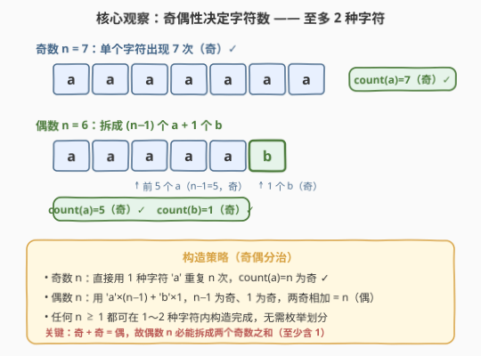
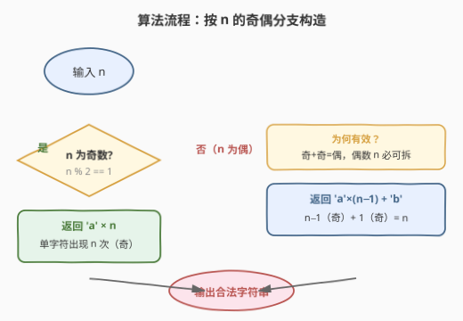
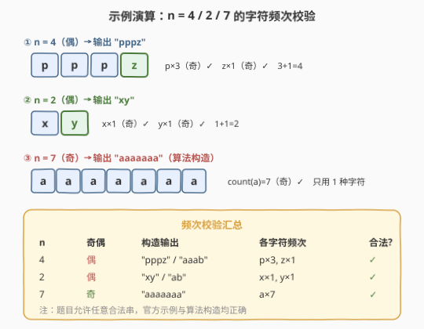

# LeetCode 生成每种字符都是奇数个的字符串 题解

## 1. 题目概述

- **标题 / 题号**：生成每种字符都是奇数个的字符串（#1374，easy）
- **链接**：https://leetcode.cn/problems/generate-a-string-with-characters-that-have-odd-counts/
- **难度**：简单
- **标签**：字符串、数学、构造

**题意**：给你一个整数 `n`，请返回一个长度为 `n` 的字符串，该字符串只包含**小写英文字母**，且其中**每个出现的字符都出现奇数次**。

答案不唯一——只要满足「长度为 `n` + 每个字符频次为奇数」即可，返回**任意**一个合法字符串。

**示例 1**：

```text
输入：n = 4
输出："pppz"
解释："pppz" 合法，因为 'p' 出现 3 次（奇），'z' 出现 1 次（奇）。
      注意还有许多合法串，如 "ohhh"、"love"。
```

**示例 2**：

```text
输入：n = 2
输出："xy"
解释："xy" 合法，因为 'x' 与 'y' 各出现 1 次（奇）。
      还有许多合法串，如 "ag"、"ur"。
```

**示例 3**：

```text
输入：n = 7
输出："holasss"
```

**约束**：

- `1 <= n <= 500`

> 💡 本题是**构造题**：不要求搜索或枚举所有方案，只需利用**奇偶性**系统性地拼出一个合法串。关键观察是「奇 + 奇 = 偶」，因此任何 $n$ 都能用至多 2 种字符构造完成。

## 2. 解题思路

### 2.1 朴素思路：把 n 拆成若干奇数之和

要保证每个字符出现奇数次，等价于把 $n$ 写成**若干奇数之和**（每个奇数对应一个字符的频次，不同字符对应不同奇数）。例如 $n = 7$ 可拆成 $7$、$5+1+1$、$3+3+1$、$3+1+1+1+1$ 等多种。

这种思路能构造出合法串，但面临两个问题：

- **拆法不唯一**：到底选哪种拆分？需要额外决策。
- **字符种数不确定**：拆成 $k$ 个奇数就要用 $k$ 种不同字符，$k$ 随拆法变化，思路绕。

> ⚠️ 其实不必这么复杂。题目只要求「每个**出现的**字符频次为奇」，并未限定要用多少种字符。把字符种数压到最少，构造就极简了。

### 2.2 核心观察：奇偶性决定最少字符数



关键洞察分两种情形：

- **$n$ 为奇数**：直接用 **1 种字符** `'a'` 重复 $n$ 次。此时 `count('a') = n` 本身就是奇数，天然合法。
- **$n$ 为偶数**：单字符出现 $n$ 次是偶数（不合法）。但**奇 + 奇 = 偶**，故可拆成两个奇数之和：用 `'a'` 重复 $n-1$ 次（$n-1$ 为奇）再加 1 个 `'b'`（$1$ 为奇）。`count('a') = n-1`（奇），`count('b') = 1`（奇），总和 $(n-1)+1 = n$。

> ⚠️ **为什么 $n$ 为偶时一定能拆？** 因为 $1$ 本身是奇数，$n - 1$ 与 $n$ 奇偶相反，故 $n$ 偶时 $n-1$ 必为奇。于是「$n-1$ 个 `a` + $1$ 个 `b`」恒成立，无需任何枚举。

因此**至多 2 种字符**即可覆盖所有 $n \ge 1$，构造退化为一个奇偶分支判断。

### 2.3 算法流程图



**完整步骤**：

1. 读取整数 $n$。
2. 若 $n$ 为奇数 → 返回 `'a' * n`（单字符 $n$ 次）。
3. 否则（$n$ 为偶数）→ 返回 `'a' * (n-1) + 'b'`（$n-1$ 个 `a` + $1$ 个 `b`）。

> 💡 **为何不用更多字符？** 题目不限制字符种数，但「能少则少」是最优工程原则：1～2 种字符使代码、校验都最简，且天然满足奇频次约束。多字符方案只是徒增复杂度，没有任何收益。

### 2.4 示例演算

以 $n = 4$、$n = 2$、$n = 7$ 为例校验构造正确性：



| $n$ | 奇偶 | 算法构造输出 | 各字符频次 | 合法? |
|-----|------|--------------|------------|-------|
| 4 | 偶 | `"aaab"` | `a×3, b×1` | ✓（3、1 均奇，和 4） |
| 2 | 偶 | `"ab"` | `a×1, b×1` | ✓（1、1 均奇，和 2） |
| 7 | 奇 | `"aaaaaaa"` | `a×7` | ✓（7 为奇，和 7） |

以 $n = 4$（偶）为例走一遍：

- $n$ 为偶 → 走偶数分支：`'a' * (4-1) + 'b'` = `"aaa" + "b"` = `"aaab"`。
- 频次：`a` 出现 $3$ 次（奇 ✓），`b` 出现 $1$ 次（奇 ✓），$3 + 1 = 4 = n$ ✓。

与官方示例 `"pppz"`（`p×3, z×1`）结构完全同构——都是「3 + 1」拆分，只是字符选了 `p/z` 而非 `a/b`，同样合法。

## 3. 参考代码

### 方法一：奇偶分支构造（推荐）

### C++

```cpp
class Solution {
public:
    string generateTheString(int n) {
        if (n % 2 == 1) return string(n, 'a');
        return string(n - 1, 'a') + "b";
    }
};
```

### Python

```python
class Solution:
    def generateTheString(self, n: int) -> str:
        if n % 2 == 1:
            return 'a' * n
        return 'a' * (n - 1) + 'b'
```

> 💡 `string(n, 'a')` / `'a' * n` 直接生成 $n$ 个相同字符的串，$O(n)$ 一行搞定。偶数分支拼接的 `'b'` 保证与 `'a'` 不同字符，频次各自独立计数。

### 方法二：奇偶三元构造（统一形式）

> 💡 **另一构造**：若想避免分支，可用「$n$ 个 `a` + 按奇偶补 `b`/`c`」的统一形式——$n$ 奇时 `a×n` 即可；$n$ 偶时 `a×(n-1) + b`。与方法一等价，仅写法差异。也可固定输出 `a×(n-1)` 再按 $n$ 奇偶决定末位字符：奇则补 `a`（凑成 `a×n`），偶则补 `b`。

```cpp
class Solution {
public:
    string generateTheString(int n) {
        string res(n - 1, 'a');
        res.push_back(n % 2 == 1 ? 'a' : 'b');
        return res;
    }
};
```

```python
class Solution:
    def generateTheString(self, n: int) -> str:
        return 'a' * (n - 1) + ('a' if n % 2 == 1 else 'b')
```

> ⚠️ **边界 $n = 1$**：方法一走奇数分支返回 `"a"`（合法，`a×1`）；方法二 `'a' * 0 + 'a'` = `"a"`，同样合法。两种写法对 $n = 1$ 都安全。

## 4. 复杂度分析

| 维度 | 复杂度 | 说明 |
|------|--------|------|
| **时间** | $O(n)$ | 构造长度为 $n$ 的字符串需 $O(n)$ 时间，无法更快（输出本身就有 $n$ 个字符） |
| **空间** | $O(n)$ | 返回的字符串占 $O(n)$ 空间，这是题目要求的输出，不计入额外空间 |
| **额外空间** | $O(1)$ | 仅用常数个整型与字符变量，无辅助数据结构 |

> 本题复杂度由输出规模决定，$O(n)$ 已是理论下界。$n \le 500$ 时构造与返回都瞬时完成。

## 5. 扩展：若要求每种字符频次互不相同

本题原版只要求「每个出现的字符频次为奇」。若加一条限制——**每种出现字符的频次互不相同**（即所有奇频次两两相异），构造仍不难：

- 仍以「奇 + 奇 + … = $n$」为基础，但要求各奇数互异。
- 贪心策略：从最小的奇数 $1, 3, 5, \ldots$ 依次累加，直到接近 $n$，最后一个奇数取「$n - \text{已累加和}$」并保证它与之前所有奇数不同且为奇。
- 因为前 $k$ 个不同奇数之和 $1 + 3 + \cdots + (2k-1) = k^2$，所以 $n \ge k^2$ 时一定能用 $k$ 个不同奇数构造。对 $n \le 500$，至多约 $\sqrt{500} \approx 22$ 种字符即可。

> 💡 这类「频次互异 + 奇数」的变体把脑筋急转弯升级为贪心构造，但核心仍是「奇偶性 + 拆和」，可作为面试追问的延伸。

## 6. 面试要点

1. **为什么 $n$ 为奇数时一种字符就够了？**

   > 一种字符 `'a'` 出现 $n$ 次，频次即 $n$。$n$ 为奇数时频次天然为奇，满足条件。无需引入第二种字符。

2. **为什么 $n$ 为偶数时两种字符就够？**

   > 偶数 $n$ 不能用单字符（频次 $n$ 为偶，不合法）。但奇 + 奇 = 偶，故拆成 $(n-1) + 1$：`'a'` 出现 $n-1$ 次（奇），`'b'` 出现 $1$ 次（奇），两者都是奇频次且和为 $n$。$n-1$ 与 $1$ 恒为奇（$n$ 偶时），故恒成立。

3. **为什么不需要更多字符或枚举划分？**

   > 题目只要求「出现的字符频次为奇」，不限制字符种数，也没要求频次互异。把字符数压到 1～2 种即满足全部约束，是最简构造。枚举奇数划分是多此一举。

4. **$n = 1$ 的边界如何处理？**

   > $n = 1$ 为奇，走奇数分支返回 `"a"`，`count('a') = 1`（奇）合法。两种写法都对 $n = 1$ 安全，无需特判。

5. **如果要求返回字典序最小的合法串呢？**

   > 当前构造已接近字典序最优：偶数分支用 `'a'` 为主、末位 `'b'`。但若要严格最小，需让 `'a'` 尽多——$n$ 奇时 `"a"×n` 已是最小；$n$ 偶时 `"a"×(n-1) + "b"` 也是最小的（不能全 `a`，否则频次为偶）。故当前构造即为字典序最小方案。

> 💡 **一句话总结**：1374 的本质是「奇偶性构造」——奇数 $n$ 用 1 种字符，偶数 $n$ 拆成 $(n-1)+1$ 用 2 种字符。核心依据是「奇 + 奇 = 偶」，至多 2 种字符覆盖所有 $n$。

## 同类练习题

| # | 题目 | 与本题的关联 |
|---|------|-------------|
| 1304 | [和为零的 N 个不同整数](https://leetcode.cn/problems/find-n-unique-integers-sum-up-to-zero/)（[题解](../1301-1400/1304_和为零的N个不同整数.md)） | 同为「按奇偶构造」的构造题，利用 $(-k)+k=0$ 对称配对，奇数补 0，思路同源 |
| 1332 | [删除回文子序列](https://leetcode.cn/problems/remove-palindromic-subsequences/)（[题解](../1301-1400/1332_删除回文子序列.md)） | 字符串 + 脑筋急转弯，答案被结构压缩到 $\{1, 2\}$，与本题「至多 2 种字符」的极简构造同味 |
| 922 | [按奇偶排序数组 II](https://leetcode.cn/problems/sort-array-by-parity-ii/)（[题解](../0901-1000/922_按奇偶排序数组II.md)） | 按奇偶性分流放置，同样是「利用奇偶性质构造结果」的典型 |
| 1281 | [整数的各位积和之差](https://leetcode.cn/problems/subtract-the-product-and-sum-of-digits-of-an-integer/)（[题解](../1201-1300/1281_整数各位积和之差.md)） | 简单数学构造题，数位分解后按规则计算，巩固构造思维 |
| 258 | [各位相加](https://leetcode.cn/problems/add-digits/)（[题解](../0201-0300/258_各位相加.md)） | 数学公式 $O(1)$ 构造解，构造思维的延伸 |
