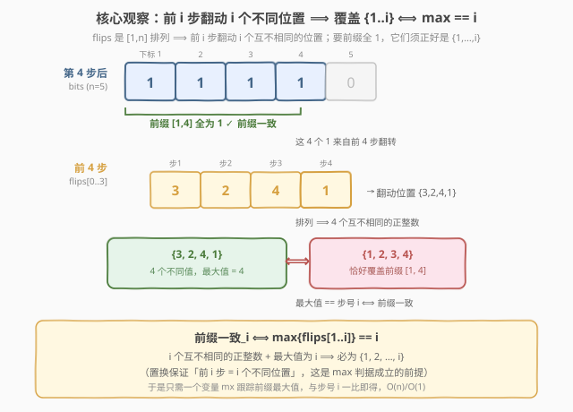
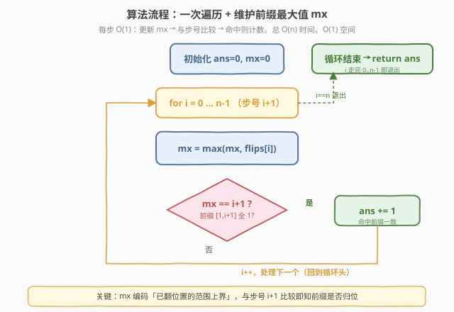
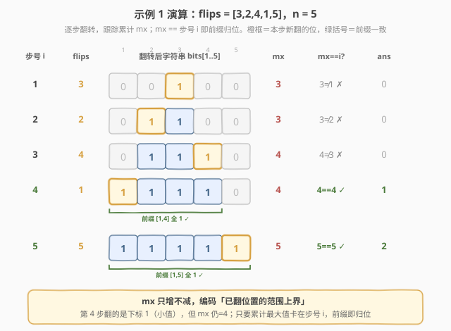

# LeetCode 二进制字符串前缀一致的次数 题解

## 1. 题目概述

- **标题 / 题号**：二进制字符串前缀一致的次数（#1375，medium）
- **链接**：https://leetcode.cn/problems/number-of-times-binary-string-is-prefix-aligned/
- **难度**：中等
- **标签**：数组、贪心、前缀

**题意**：有一个长度为 `n` 的二进制字符串，**所有位初始为 `0`**（下标从 1 开始）。我们将逐位把 `0` 翻转为 `1`。给定一个 **1-indexed** 整数数组 `flips`，其中 `flips[i]` 表示在第 `i` 步会把下标为 `flips[i]` 的那一位翻成 `1`。

> ⚠️ `flips` 是 `[1, n]` 的一个**排列**——每个位置恰被翻转一次，`n` 步后全串变 `1`。

**前缀一致（prefix-aligned）**：在第 `i` 步之后，下标 `[1, i]` 范围内的位**全部为 `1`**，且其余位全部为 `0`。换句话说，此时前 `i` 位刚好是个全 `1` 前缀。

返回整个翻转过程中，字符串「前缀一致」的**次数**。

**示例 1**：

```text
输入：flips = [3,2,4,1,5]
输出：2
解释：n=5，初始 "00000"
  第 1 步翻下标 3 → "00100"，前 1 位 = "0"，非前缀一致
  第 2 步翻下标 2 → "01100"，前 2 位 = "01"，非前缀一致
  第 3 步翻下标 4 → "01110"，前 3 位 = "011"，非前缀一致
  第 4 步翻下标 1 → "11110"，前 4 位 = "1111"，前缀一致 ✓
  第 5 步翻下标 5 → "11111"，前 5 位 = "11111"，前缀一致 ✓
共 2 次。
```

**示例 2**：

```text
输入：flips = [4,1,2,3]
输出：1
解释：n=4，初始 "0000"
  第 1 步翻下标 4 → "0001"，前 1 位 = "0"，非前缀一致
  第 2 步翻下标 1 → "1001"，前 2 位 = "10"，非前缀一致
  第 3 步翻下标 2 → "1101"，前 3 位 = "110"，非前缀一致
  第 4 步翻下标 3 → "1111"，前 4 位 = "1111"，前缀一致 ✓
共 1 次。
```

**约束**：

- `n == flips.length`
- `1 <= n <= 5 * 10^4`
- `flips` 是 `[1, n]` 范围内整数的**排列**

> 💡 本题的灵魂是「**置换 + 前缀归位**」——`flips` 是排列，意味着前 `i` 步恰好翻动了 `i` 个**互不相同**的位置。要使前 `i` 位全为 `1`，这 `i` 个位置必须**正好是** `{1, 2, ..., i}`。而「`i` 个互不相同的正整数、且最大值为 `i`」当且仅当它们就是 `{1, ..., i}`。于是前缀一致 ⟺ `max(flips[0..i-1]) == i`，一次遍历、一个变量即可统计答案。

## 2. 解题思路

### 2.1 暴力思路：模拟翻转 + 逐位扫描

最直观的做法：维护一个布尔数组 `bits[1..n]`，每步把 `bits[flips[i]]` 置 `1`，然后扫描前 `i` 位是否全为 `1`。

- **正确但低效**：第 `i` 步后要扫前 `i` 位，总扫描量 $1 + 2 + \dots + n = O(n^2)$；
- **数据规模过不去**：$n \le 5 \times 10^4$，$n^2 = 2.5 \times 10^9$，必然超时；
- **浪费了「置换」结构**：题目明确 `flips` 是 `[1,n]` 的排列，前 `i` 步翻动的位置两两不同——暴力逐位检查完全没利用这一点。

> ⚠️ 暴力不是错，而是把「置换」这把钥匙闲置了。看到「`flips` 是排列」+「问前缀是否归位」，就该条件反射想到：前 `i` 步翻动的 `i` 个不同位置，是不是恰好凑成了 `{1,...,i}`？

### 2.2 核心观察：前缀一致 ⇔ `max == i`



**关键洞察**：第 `i` 步后，共有 `i` 个位置被翻成 `1`，且由于 `flips` 是排列，这 `i` 个位置**互不相同**。

$$
\text{前缀一致}_i \;\Longleftrightarrow\; \{\text{flips}[1],\dots,\text{flips}[i]\} = \{1,2,\dots,i\}
$$

而「`i` 个互不相同的正整数，最大值恰好为 `i`」**当且仅当**它们就是 $\{1, 2, \dots, i\}$：

- **必要性**：若集合是 $\{1,\dots,i\}$，显然最大值为 $i$；
- **充分性**：`i` 个互不相同的正整数、最大值为 `i`，则它们只能从 $\{1,\dots,i\}$ 中取（不能超过 `i`），又恰好取满 `i` 个，故必为全集 $\{1,\dots,i\}$。

于是得到本题的「一 行 公 式」：

$$
\text{前缀一致}_i \;\Longleftrightarrow\; \max_{1 \le k \le i}\text{flips}[k] \;=\; i
$$

> 以示例 1 的 `flips = [3,2,4,1,5]` 为例：第 4 步时翻动过的位置为 `{3,2,4,1}`，共 4 个不同值、最大值 `4`，故恰好是 `{1,2,3,4}`，前 4 位全 `1` ✓。第 2 步时位置为 `{3,2}`，最大值 `3 ≠ 2`，说明前 2 位里有空洞（位置 1 还没翻），非前缀一致。

> ⚠️ **「置换」条件不可或缺**。若 `flips` 不是排列（某位置被翻多次），「前 `i` 步翻动 `i` 次」就不再等于「翻动了 `i` 个不同位置」，最大值为 `i` 也不能保证覆盖了 $\{1,\dots,i\}$。本题之所以能压缩到 $O(n)$，正是吃满了排列这一约束。

### 2.3 算法流程图



**完整步骤**（0-indexed 实现，步号 `i` 从 0 到 `n-1`，对应第 `i+1` 步）：

1. **初始化**：`ans = 0`（计数），`mx = 0`（前缀最大值）；
2. **遍历**：对 `i = 0, 1, ..., n-1`：
   - 更新 `mx = max(mx, flips[i])`；
   - 若 `mx == i + 1`，则第 `i+1` 步后前缀一致，`ans += 1`；
3. **返回** `ans`。

> 💡 只需维护一个变量 `mx`，无需位图、无需集合、无需前缀和。每步 $O(1)$，总 $O(n)$ 时间、$O(1)$ 空间——这是吃满「置换」结构后的最优解。

### 2.4 示例演算

以示例 1 的 `flips = [3,2,4,1,5]`（`n=5`）为例：



| 步号 `i`（1-indexed） | `flips[i-1]` | 翻转后字符串 | 已翻位置集合 | `mx` | `mx == i`？ | `ans` |
|---|---|---|---|---|---|---|
| 1 | 3 | `00100` | `{3}` | 3 | 3 ≠ 1 ✗ | 0 |
| 2 | 2 | `01100` | `{3,2}` | 3 | 3 ≠ 2 ✗ | 0 |
| 3 | 4 | `01110` | `{3,2,4}` | 4 | 4 ≠ 3 ✗ | 0 |
| 4 | 1 | `11110` | `{3,2,4,1}` = `{1,2,3,4}` | 4 | 4 == 4 ✓ | 1 |
| 5 | 5 | `11111` | `{1,2,3,4,5}` | 5 | 5 == 5 ✓ | 2 |

**结果**：`ans = 2` ✓

> 💡 注意第 4 步：本步翻的是下标 `1`（值很小），但 `mx` 仍保持前几步的 `4` 不变。判定前缀一致看的是「**累计**最大值」而非「本步翻的值」——只要累计最大值卡在 `i`，就说明前 `i` 个位置已凑齐。这解释了为什么一个 `mx` 变量就够：它编码了「已翻位置的范围上界」。

## 3. 参考代码

### C++

```cpp
// 二进制字符串前缀一致的次数.cpp —— 前缀最大值法，O(n)/O(1)
// 编译: g++ -O2 -std=c++17 二进制字符串前缀一致的次数.cpp -o prefix
#include <vector>
using namespace std;

class Solution {
public:
    int numTimesAllBlue(vector<int>& flips) {
        int n = flips.size();
        int ans = 0, mx = 0;
        for (int i = 0; i < n; i++) {
            mx = max(mx, flips[i]);      // 前 i+1 步翻动位置的最大值
            if (mx == i + 1) ans++;      // max == i+1 ⟺ 前缀 [1, i+1] 全为 1
        }
        return ans;
    }
};
```

### Python

```python
class Solution:
    def numTimesAllBlue(self, flips: list[int]) -> int:
        ans = mx = 0
        for i, p in enumerate(flips, 1):   # i 为步号（1-indexed）
            mx = max(mx, p)                # 前 i 步翻动位置的最大值
            if mx == i:                    # max == i ⟺ 前缀 [1, i] 全为 1
                ans += 1
        return ans
```

> 💡 两版等价，核心是「**遍历 + 维护前缀最大值 + 与步号比较**」。Python 版用 `enumerate(flips, 1)` 直接拿到 1-indexed 步号 `i`，与 `mx == i` 的判定式完全对齐题意，可读性最佳。注意 `mx` 比较的是 `flips` 的**值**（位置下标），`i` 是**步号**——两者本是不同维度，正是本题的精妙之处：当「已翻位置的最大下标」追上「步数」时，前缀恰好归位。

## 4. 复杂度分析

| 维度 | 前缀最大值法 $O(n)$（推荐） | 增量计数法 $O(n)$ | 暴力模拟 $O(n^2)$ |
|------|---------------------------|-------------------|------------------|
| 时间复杂度 | $O(n)$ | $O(n)$ | $O(n^2)$ |
| 空间复杂度 | $O(1)$ | $O(n)$ | $O(n)$ |
| 实际运算量 | `n=5e4` 约 5 万次 | 约 5 万次 + 额外数组 | 约 $1.25 \times 10^9$（超时） |

- **前缀最大值法**：吃满「置换」结构，用一个变量 `mx` 编码「已翻位置的范围上界」，与步号 `i` 一比即得。$O(n)$ 时间、$O(1)$ 空间，是该约束下的最优解。
- **增量计数法**：维护 `flipped[1..n]` 布尔表与「当前前缀 `[1,i]` 内 1 的个数 `cnt`」。步号从 `i-1` 推进到 `i` 时先 `cnt += flipped[i]`（前缀右端扩张），再执行本步翻转并按需 `cnt++`；当 `cnt == i` 即前缀一致。同样 $O(n)$，但需要 $O(n)$ 额外空间，且边界处理更繁琐，不如最大值法优雅。
- **暴力模拟**：每步扫前 `i` 位，$O(n^2)$。$n = 5 \times 10^4$ 时约 $1.25 \times 10^9$ 次操作，必然超时。

> ⚠️ 本题 $n \le 5 \times 10^4$，$O(n^2)$ 必超时，$O(n)$ 是硬性要求。最大值法之所以能在 $O(1)$ 空间内完成，关键在于「置换 ⟹ 前 `i` 步翻动 `i` 个不同位置」这一前提——若去掉排列约束，最大值判据失效，需退回增量计数或差分覆盖判定。

## 5. 扩展：增量计数法（不依赖「最大值」视角）

若一时没看出「`max == i`」这层等价，也可用**增量计数**直接模拟「前缀内 1 的个数」。维护布尔表 `flipped[1..n]` 与计数器 `cnt`（当前前缀 `[1, i]` 内已翻为 1 的位数），按步推进：

```python
class Solution:
    def numTimesAllBlue(self, flips: list[int]) -> int:
        n = len(flips)
        flipped = [False] * (n + 1)      # flipped[p]：位置 p 是否已翻为 1
        cnt = 0                          # 当前前缀 [1, i] 内 1 的个数
        ans = 0
        for i in range(1, n + 1):        # 步号 i = 1..n
            cnt += flipped[i]            # 前缀右端从 i-1 扩张到 i：位置 i 若早已翻则计入
            p = flips[i - 1]
            flipped[p] = True
            if p <= i:                   # 本步翻动落在前缀 [1, i] 内
                cnt += 1                 # 注意：若 p == i，上面已加过 flipped[i]（旧值为 False），这里补加
            if cnt == i:                 # 前 i 位全为 1
                ans += 1
        return ans
```

> 💡 这版直白地维护「前缀内 1 的个数」，逻辑贴近题面，但需要 $O(n)$ 空间和更细致的边界（前缀扩张与本步翻转的先后顺序）。它和最大值法殊途同归：当 `cnt == i` 时，前 `i` 步翻动的 `i` 个不同位置恰好填满 `{1,...,i}`，此时也必有 `max == i`。两法互为印证，面试中先讲最大值法展示洞察力，再用增量计数法作兜底说明「不靠灵感也能做对」。

> ⚠️ 增量计数法里 `cnt += flipped[i]` 必须在执行本步翻转**之前**：因为步号从 `i-1` 推到 `i` 时，前缀新纳入的位置 `i` 反映的是「上一轮结束时」的状态。若本步恰翻 `p == i`，则 `flipped[i]` 此时还是 `False`，由后面的 `if p <= i: cnt += 1` 补上；顺序颠倒会重复计数。

## 6. 面试要点

1. **如何想到 `max == i` 这个判据？**

   > 抓住「`flips` 是 `[1,n]` 的排列」这一约束：前 `i` 步翻动了 `i` 个**互不相同**的位置。要前 `i` 位全为 `1`，这 `i` 个位置必须正好是 `{1,...,i}`。而 `i` 个互不相同的正整数、最大值为 `i`，当且仅当它们就是 `{1,...,i}`。于是前缀一致 ⟺ 累计最大值 `mx == i`。从「置换 ⟹ 不同位置 ⟹ 最大值定全集」这条链一路推下来，就自然得到 $O(1)$ 空间的判据。

2. **为什么 `max == i` 是充要条件？**

   > 必要性：若已翻集合为 `{1,...,i}`，最大值显然是 `i`。充分性：`i` 个互不相同的正整数、最大值为 `i`，则每个数 $\le i$，又要在 $\{1,\dots,i\}$ 中取 `i` 个不同的值，只能取满整个集合，故集合恰为 `{1,...,i}`。两边合起来是充要。

3. **暴力为什么会超时？有没有 $O(n)$ 的「朴素」做法？**

   > 暴力每步扫前 `i` 位，总 $O(n^2)$；$n = 5 \times 10^4$ 时约 $1.25 \times 10^9$ 次操作，必然 TLE。即便不想到最大值法，也可用增量计数（维护前缀内 1 的个数 `cnt`，前缀扩张时 `cnt += flipped[i]`，本步落在前缀内再 `cnt++`，`cnt == i` 即一致）做到 $O(n)$，只是空间 $O(n)$、边界更繁。最大值法是同思路的极致压缩。

4. **去掉「排列」约束，`max == i` 还成立吗？**

   > 不成立。若某位置可被翻多次，前 `i` 步「翻 `i` 次」不再等于「翻动 `i` 个不同位置」。例如 `flips = [1,1]`：第 2 步后 `max = 1 == 2`？不成立，且即便 `max` 等于某值也不能保证前缀无空洞（重复翻同一位置会留下别的空洞）。此时需退回增量计数或差分覆盖判定，最大值判据失效——这正是本题把「排列」写进约束的用意。

5. **`mx` 比较的是值（位置下标），`i` 是步号，为什么能直接相等比较？**

   > 两者虽是不同维度，但在「置换」下被等价起来：`mx` 是「已翻位置的最大下标」，`i` 是「已翻次数」。由于每次翻一个新位置，「已翻次数 = 已翻位置个数」。当「最大下标 = 个数 = `i`」时，这 `i` 个位置被夹在 $\{1,\dots,i\}$ 内且取满，前缀归位。所以 `mx == i` 表面在比「值与步号」，本质在比「范围上界与元素个数」——置换让二者可对齐。

> 💡 **一句话总结**：1375 的灵魂是「**置换 ⟹ 前 `i` 步翻动 `i` 个不同位置 ⟹ 最大值为 `i` 即覆盖 `{1..i}`**」。一个 `mx` 变量编码范围上界，与步号一比即得答案，$O(n)$ 时间、$O(1)$ 空间。

## 同类练习题

| # | 题目 | 与本题的关联 |
|---|------|-------------|
| 769 | [最多能完成排序的块](https://leetcode.cn/problems/max-chunks-to-make-sorted/) | **完全同构**——`arr` 是 `[0,n-1]` 的排列，`arr[0..i]` 能独立成块排序 ⟺ `max(arr[0..i]) == i`，与本题判据一字不差，是验证这套「置换 + 最大值定全集」直觉的最佳姐妹题 |
| 768 | [最多能完成排序的块 II](https://leetcode.cn/problems/max-chunks-to-make-sorted-ii/) | 769 的进阶（元素可重复、无排列约束），用单调栈替代「最大值」判据，对照体会「排列」条件被去掉后如何升级数据结构 |
| 1893 | [检查是否区域内所有整数都被覆盖](https://leetcode.cn/problems/check-if-all-the-integers-in-a-range-are-covered/) | 同样问「`[1, i]` 是否被全覆盖」，但用**差分数组**维护覆盖次数，是「区间归位」问题的差分视角解法，与本题的最大值视角互补 |
| 448 | [找到所有数组中消失的数字](../0401-0500/448_找到所有数组中消失的数字.md) | `[1,n]` 排列上「哪些位置缺位」的经典题，用下标原地标记编码存在性，与本题「前缀是否凑齐 `{1..i}`」共享置换位置语义 |
| 41 | [缺失的第一个正数](https://leetcode.cn/problems/first-missing-positive/) | 置换 + 下标归位的鼻祖题，把值 `x` 归位到下标 `x`，再扫首个错位位置——同样是「在 `[1,n]` 排列结构上做位置游戏」，与本题思路同源 |
