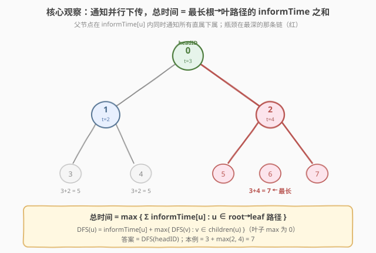
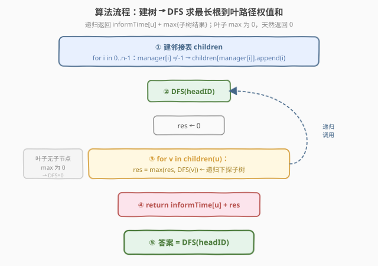
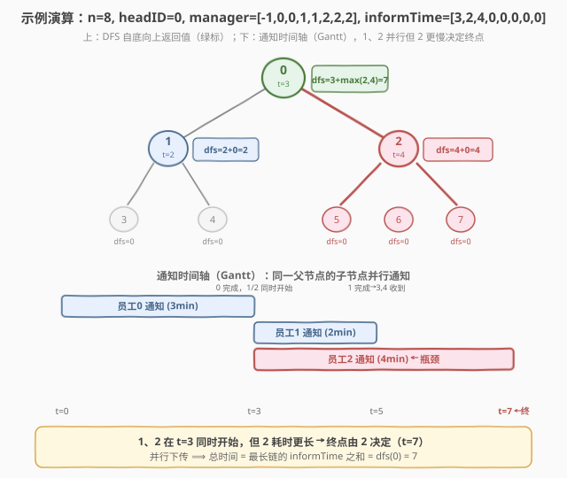

# LeetCode 通知所有员工所需的时间 题解

## 1. 题目概述

- **标题 / 题号**：通知所有员工所需的时间（#1376，medium）
- **链接**：https://leetcode.cn/problems/time-needed-to-inform-all-employees/
- **难度**：中等
- **标签**：树、深度优先搜索、广度优先搜索

**题意**：公司里有 `n` 名员工，编号 `0` 到 `n - 1`，ID 唯一。总负责人由 `headID` 标识。`manager[i]` 是第 `i` 名员工的直属负责人，`manager[headID] = -1`，题目保证从属关系构成一棵**树**。

总负责人要向全员通告紧急消息：他先通知直属下属，下属再通知各自的下属，直到所有人都收到。第 `i` 名员工需要 `informTime[i]` 分钟来通知它的**所有**直属下属（即 `informTime[i]` 分钟后，他的全部直属下属都可以**同时**开始传播消息）。

返回通知所有员工所需的**分钟数**。

**示例 1**：

```text
输入：n = 1, headID = 0, manager = [-1], informTime = [0]
输出：0
解释：公司总负责人是该公司的唯一一名员工，无需通知任何人。
```

**示例 2**：

```text
输入：n = 6, headID = 2, manager = [2,2,-1,2,2,2], informTime = [0,0,1,0,0,0]
输出：1
解释：id = 2 的员工是总负责人，也是其他所有人的直属负责人，他需要 1 分钟通知所有员工。
```

**约束**：

- `1 <= n <= 10^5`
- `0 <= headID < n`
- `manager.length == n`
- `0 <= manager[i] < n`
- `manager[headID] == -1`
- `informTime.length == n`
- `0 <= informTime[i] <= 1000`
- 若员工 `i` 没有下属，则 `informTime[i] == 0`
- 题目**保证**所有员工都能收到通知

> 💡 本题的灵魂是「**并行下传**」——一个父节点在 `informTime[u]` 分钟内**同时**通知所有直属下属，这些下属随后**并行**地各自向下传播。因此消息并非沿一条链串行累加，而是各条分支赛跑：**总时间取决于最慢的那条根到叶路径**。把 `informTime` 当作树上的边/点权，答案就是最长根到叶路径的权值和，一次 DFS 即可。

## 2. 解题思路

### 2.1 暴力思路：逐层模拟时间轴

最直观的做法是按时间步推进：维护一个「已收到消息」的集合，在每个时刻检查哪些已收到消息的员工完成了 `informTime` 的等待，把他们的下属加入集合，直到全员收到。

- **正确但繁琐**：需要维护每个员工「开始接收的时刻」，并按时间排序处理，逻辑容易出错；
- **效率尚可但无必要**：本质是在模拟 BFS 的层序推进，但只要识破「并行 ⟹ 最长路径」，就能跳过时间模拟，直接用一次树形 DFS 求解。

> ⚠️ 暴力不是错，而是把「并行」这把钥匙闲置了。看到「父节点同时通知所有下属」，就该条件反射想到：各分支独立赛跑，瓶颈是最长那条链——问题从「时间模拟」坍缩成「树上最长路径」。

### 2.2 核心观察：总时间 = 最长根到叶路径的 informTime 之和



**关键洞察**：消息从根（`headID`）出发向下传播。对任意节点 `u`，它在收到消息后花费 `informTime[u]` 分钟**同时**通知所有直属下属，之后这些下属各自独立向下传播。因此：

- 节点 `u` 的子树全部通知完毕所需时间 = `informTime[u]` + `max{ 子树通知时间 }`；
- 同一父节点的多个子节点**并行**，故取 `max` 而非求和。

定义 $\text{dfs}(u)$ 为「以 `u` 为根的子树全部收到消息所需时间」，则：

$$
\text{dfs}(u) = \text{informTime}[u] + \max_{v \in \text{children}(u)} \text{dfs}(v)
$$

- **叶子节点**：无子节点，`max` 对空集取 `0`，又 `informTime[叶子] = 0`，故 $\text{dfs}(\text{叶子}) = 0$；
- **答案**：$\text{dfs}(\text{headID})$，即最长根到叶路径上的 `informTime` 之和。

> 以图中构造示例为例：根 `0`（`t=3`）有两个子节点 `1`（`t=2`）和 `2`（`t=4`）。`1` 的子树需 `2` 分钟，`2` 的子树需 `4` 分钟，两者并行但 `2` 更慢，故根处取 `max(2, 4) = 4`，总时间 `3 + 4 = 7`。红色路径 `0→2→{5,6,7}` 即为最长链。

> ⚠️ **「并行」是取 max 的根因**。若题意改为「下属串行通知」（一个通知完再通知下一个），则同一父节点的子树时间应求和而非取 max，本题就退化为整棵树的 `informTime` 总和。理解 max 来自并行，才能在题意变化时正确调整。

### 2.3 算法流程图



**完整步骤**：

1. **建邻接表**：遍历 `i = 0..n-1`，若 `manager[i] != -1`，将 `i` 加入 `children[manager[i]]`（由父指向子）；
2. **DFS**：从 `headID` 出发递归，对节点 `u`：
   - `res = 0`；
   - 遍历每个子节点 `v`，`res = max(res, dfs(v))`；
   - 返回 `informTime[u] + res`；
3. **返回** `dfs(headID)`。

> 💡 不需要显式判断叶子：叶子无子节点时循环不执行，`res` 保持 `0`，返回 `informTime[叶子] + 0 = 0`，天然正确。

### 2.4 示例演算

以构造示例 `n=8, headID=0, manager=[-1,0,0,1,1,2,2,2], informTime=[3,2,4,0,0,0,0,0]` 为例（树形结构：`0` 根，子节点 `1`、`2`；`1` 的子为 `3`、`4`，`2` 的子为 `5`、`6`、`7`）：



**DFS 自底向上计算**：

| 节点 `u` | `informTime[u]` | 子节点 | 各子 `dfs` | `res = max` | `dfs(u) = t + res` |
|---|---|---|---|---|---|
| 3（叶） | 0 | — | — | 0 | 0 |
| 4（叶） | 0 | — | — | 0 | 0 |
| 5（叶） | 0 | — | — | 0 | 0 |
| 6（叶） | 0 | — | — | 0 | 0 |
| 7（叶） | 0 | — | — | 0 | 0 |
| 1 | 2 | 3, 4 | 0, 0 | 0 | 2 + 0 = **2** |
| 2 | 4 | 5, 6, 7 | 0, 0, 0 | 0 | 4 + 0 = **4** |
| 0（根） | 3 | 1, 2 | 2, 4 | 4 | 3 + 4 = **7** |

**结果**：`dfs(0) = 7` ✓

对应时间轴：`t=0` 根 `0` 开始 → `t=3` `0` 完成，`1`、`2` **同时**开始 → `t=5` `1` 完成（叶子 `3`、`4` 收到）→ `t=7` `2` 完成（叶子 `5`、`6`、`7` 收到）。`1`、`2` 并行但 `2` 更慢，终点由 `2` 决定。

> 💡 注意 `dfs(1)=2` 与 `dfs(2)=4` 在根处取 `max` 而非相加——这正是「并行」的体现。若误把两者相加得 `3+2+4=9`，就错把并行当串行了。

## 3. 参考代码

### C++

```cpp
// 通知所有员工所需的时间.cpp —— 建树 + DFS 求最长根到叶路径权值和，O(n)/O(n)
// 编译: g++ -O2 -std=c++17 通知所有员工所需的时间.cpp -o inform
#include <vector>
#include <algorithm>
using namespace std;

class Solution {
public:
    int numOfMinutes(int n, int headID, vector<int>& manager, vector<int>& informTime) {
        // 1. 建邻接表：父 -> 子列表
        vector<vector<int>> children(n);
        for (int i = 0; i < n; ++i) {
            if (manager[i] != -1) {
                children[manager[i]].push_back(i);
            }
        }
        // 2. DFS 求最长根到叶路径的 informTime 之和
        return dfs(headID, children, informTime);
    }
private:
    int dfs(int u, const vector<vector<int>>& children, const vector<int>& informTime) {
        int res = 0;
        for (int v : children[u]) {
            res = max(res, dfs(v, children, informTime));   // 子节点并行，取最长
        }
        return informTime[u] + res;                          // 本节点通知时间 + 最长子树
    }
};
```

### Python

```python
class Solution:
    def numOfMinutes(self, n: int, headID: int,
                     manager: list[int], informTime: list[int]) -> int:
        # 1. 建邻接表：父 -> 子列表
        children = [[] for _ in range(n)]
        for i in range(n):
            if manager[i] != -1:
                children[manager[i]].append(i)

        # 2. 迭代 DFS（避免递归栈溢出，n 可达 1e5）
        #    栈中存 (节点, 累计到该父节点为止的路径时间)
        ans = 0
        stack = [(headID, 0)]            # (u, 从根到 u 的父节点累计 informTime 之和)
        while stack:
            u, acc = stack.pop()
            acc += informTime[u]         # 经过 u 的通知时间
            if not children[u]:          # 叶子：一条根到叶路径完成
                ans = max(ans, acc)
                continue
            for v in children[u]:        # 子节点并行下探
                stack.append((v, acc))
        return ans
```

> 💡 两版等价但实现侧重不同：**C++** 用递归 DFS，返回值自底向上聚合 `max`，逻辑最贴近递推式 $\text{dfs}(u) = \text{informTime}[u] + \max\{\text{dfs}(v)\}$，可读性最佳；**Python** 改用**迭代 DFS**，沿路径累计 `informTime`，到叶子时更新全局 `ans`——这样无需递归返回值，规避了 $n = 10^5$ 时 Python 默认递归深度（1000）的栈溢出风险。两版本质相同：递归版「自底向上取 max」，迭代版「自顶向下累加、到叶取 max」，殊途同归。

> ⚠️ 若 Python 坚持递归写法，须 `sys.setrecursionlimit(200000)` 并注意部分平台对栈大小仍有上限。迭代版无此隐患，更稳妥。

## 4. 复杂度分析

| 维度 | DFS（推荐） | 逐层时间模拟 |
|------|------------|-------------|
| 时间复杂度 | $O(n)$ | $O(n)$ |
| 空间复杂度 | $O(n)$ | $O(n)$ |
| 实现复杂度 | 低（一次遍历） | 中（维护时间戳/优先级） |

- **DFS**：建邻接表 $O(n)$，DFS 访问每个节点恰好一次 $O(n)$；空间为邻接表 $O(n)$ + 递归栈/显式栈 $O(n)$（最坏退化成链）。$n = 10^5$ 时约 10 万次操作，轻松通过。
- **逐层时间模拟**：同样 $O(n)$，但需维护每个员工「收到时刻」并按完成时间推进，边界更多、易错。DFS 把「时间」抽象成「路径权值和」，一步到位。

> ⚠️ 本题 $n \le 10^5$，$O(n)$ 是必须的。好在「并行 ⟹ 最长路径」的转化天然给出 $O(n)$ 解法，无需任何排序或优先队列。

## 5. 扩展：自底向上的记忆化思路

若一时没看出「最长路径」这层转化，也可用**自底向上**的视角：每个员工 `i` 往上追溯 `manager[i]` 即可找到父节点。对任意节点，其「子树通知时间」取决于子节点中最慢者。

由于 `manager[i]` 直接给出父指针，甚至无需显式建邻接表——可用**带记忆化的递推**：对每个节点沿父链向上累积，遇到已计算的结果即复用。但树是单向父指针，自底向上需先定位叶子再回溯，不如自顶向下 DFS 自然。

实践中**自顶向下 DFS/BFS** 始终是最简实现：建好邻接表后从根出发一次遍历即可。下面给出 BFS 版本（层序遍历，同样累计路径权值）：

```python
class Solution:
    def numOfMinutes(self, n: int, headID: int,
                     manager: list[int], informTime: list[int]) -> int:
        children = [[] for _ in range(n)]
        for i in range(n):
            if manager[i] != -1:
                children[manager[i]].append(i)

        from collections import deque
        ans = 0
        q = deque([(headID, 0)])          # (u, 从根到 u 父节点累计时间)
        while q:
            u, acc = q.popleft()
            acc += informTime[u]
            if not children[u]:
                ans = max(ans, acc)        # 叶子：更新答案
            for v in children[u]:
                q.append((v, acc))
        return ans
```

> 💡 BFS 与迭代 DFS 在本题等价：都是「自顶向下累计路径权值，到叶子取 max」。区别仅在于遍历顺序（层序 vs 深度优先），不影响正确性与复杂度。面试中先讲递归 DFS 展示递推直觉，再用 BFS/迭代 DFS 作「避免栈溢出」的工程兜底。

## 6. 面试要点

1. **为什么取 max 而不是求和？**

   > 因为「并行」。一个父节点在 `informTime[u]` 分钟内**同时**通知所有直属下属，这些下属随后**并行**向下传播。各分支独立赛跑，总时间取决于最慢的分支，故同一层取 `max`。若误取求和，就等于假设下属串行通知，与题意相悖。

2. **如何想到「最长根到叶路径」这个转化？**

   > 从根处展开递推：`dfs(u) = informTime[u] + max{dfs(v)}`，展开后每一层都取 `max`，最终答案就是「沿某一条根到叶路径，把沿途 `informTime` 累加」的最大值。max 的结合律让「逐层取 max」等价于「选最长路径」，于是问题从「时间模拟」坍缩成「树上最长路径权值和」。

3. **叶子节点需要特判吗？**

   > 不需要。叶子无子节点，`max` 对空集取 `0`，返回 `informTime[叶子] + 0`；又题目保证 `informTime[叶子] = 0`，故叶子天然返回 `0`。递推式对叶子自洽，无需额外分支。

4. **递归 DFS 在 Python 中会栈溢出吗？怎么处理？**

   > 会。$n$ 可达 $10^5$，而 Python 默认递归深度上限 1000。退化成链时递归深度达 $n$，必然 `RecursionError`。两种处理：(a) `sys.setrecursionlimit(200000)` 改上限（部分平台仍可能受系统栈大小限制）；(b) 改用迭代 DFS 或 BFS，用显式栈/队列替代调用栈，彻底规避。推荐 (b)，更稳妥。

5. **如果题意改成「下属串行通知」（一个通知完再通知下一个），答案会变吗？**

   > 会。串行时同一父节点的子树时间应**求和**而非取 max，递推式变为 `dfs(u) = informTime[u] + Σ dfs(v)`，此时答案 = 整棵树所有节点 `informTime` 之和（每个节点的通知时间恰好被其父等待一次）。这正好反衬出本题取 max 完全来自「并行」假设——理解这一点才能在题意变化时正确调整聚合方式。

> 💡 **一句话总结**：1376 的灵魂是「**并行下传 ⟹ 各分支赛跑 ⟹ 总时间 = 最长根到叶路径的 informTime 之和**」。建树后一次 DFS，递推式 `dfs(u) = informTime[u] + max{dfs(v)}`，$O(n)$ 时间、$O(n)$ 空间。

## 同类练习题

| # | 题目 | 与本题的关联 |
|---|------|-------------|
| 743 | [网络延迟时间](https://leetcode.cn/problems/network-delay-time/)（[题解](../0701-0800/743_网络延迟时间.md)） | 同样是「信号从源点传播到所有节点」，但边带不同权值且是**一般图**（非树），需用 Dijkstra 单源最短路；本题是树结构且同父各边等权，退化为最长路径 |
| 310 | [最小高度树](https://leetcode.cn/problems/minimum-height-trees/) | 在树上找「使最长根到叶路径最短」的根节点，共享「树的最长路径」概念，用拓扑剥叶法找树直径中心 |
| 124 | [二叉树中的最大路径和](https://leetcode.cn/problems/binary-tree-maximum-path-sum/) | 树上路径权值和的经典题，同样用 DFS 后序聚合，但允许路径任意起止（需维护「单臂最大」与「穿过当前节点的最大」两个量），可对照本题「只走根到叶」的简化版 |
| 1514 | [概率最大的路径](https://leetcode.cn/problems/path-with-maximum-probability/) | 求源点到目标的最大概率路径，一般图上用 Dijkstra 变体（max 代替 sum），与本题「最长路径」思想同源但作用在无权树上更简单 |
| 2050 | [并行课程 III](https://leetcode.cn/problems/parallel-courses-iii/) | DAG 上「并行完成所有任务的最短时间」= 最长路径（关键路径法），与本题「并行通知取最长链」完全同构，是本题在有向图上的推广 |
