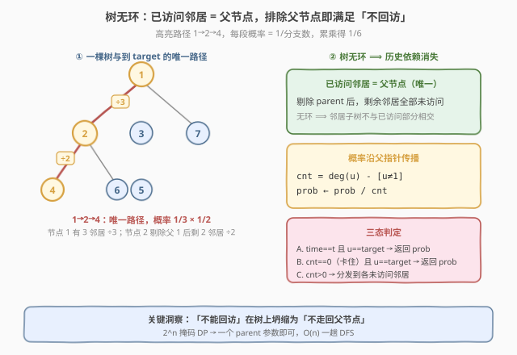
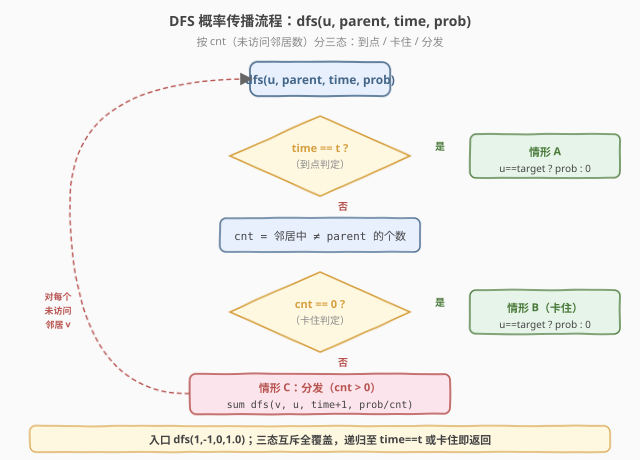
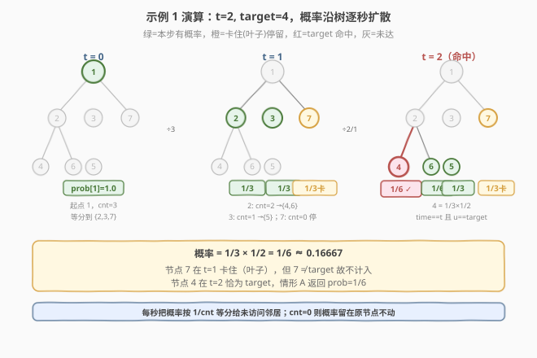

# T 秒后青蛙的位置

- **题目名称**：T 秒后青蛙的位置
- **链接**：[1377. T 秒后青蛙的位置](https://leetcode.cn/problems/frog-position-after-t-seconds/)
- **难度**：困难
- **标签**：树、深度优先搜索（DFS）、广度优先搜索（BFS）、图、概率

## 1. 题目概述

给你一棵由 `n` 个顶点组成的**无向树**，顶点编号从 `1` 到 `n`。青蛙从**顶点 1** 起跳，每秒按以下规则移动：

- 跳到一个**未访问**过的相邻顶点（若有多条可选，**等概率**随机选一条）；
- 若没有未访问的相邻顶点，则**停在原地**（每秒仍算一次跳跃，只是没动）。

树的边由 `edges` 给出，`edges[i] = [ai, bi]` 表示 `ai` 与 `bi` 直接相连。返回 `t` 秒后青蛙位于 `target` 的概率，误差不超过 $10^{-5}$。

**示例 1**：

```text
输入：n = 7, edges = [[1,2],[1,3],[1,7],[2,4],[2,6],[3,5]], t = 2, target = 4
输出：0.16666666666666666
解释：青蛙从 1 起跳，第 1 秒有 1/3 概率跳到 2，
      第 2 秒在 2 处有 2 个未访问邻居 {4,6}，有 1/2 概率跳到 4。
      因此 2 秒后位于 4 的概率 = 1/3 × 1/2 = 1/6。
```

**示例 2**：

```text
输入：n = 7, edges = [[1,2],[1,3],[1,7],[2,4],[2,6],[3,5]], t = 1, target = 7
输出：0.3333333333333333
解释：青蛙从 1 起跳，1 的未访问邻居 {2,3,7} 共 3 个，1 秒后跳到 7 的概率 = 1/3。
```

**约束条件**：

- `1 <= n <= 100`
- `edges.length == n - 1`（保证是一棵树）
- `1 <= t <= 50`
- `1 <= target <= n`

> 💡 本题的灵魂是「**树上无环，'已访问邻居'恰好就是父节点**」——'不能回访'这条看似要记录整个历史的约束，在树上被自动满足：排除父节点后，剩余邻居两两不同且永不会被再次到达。于是概率可沿父指针一路传播，DFS 一趟 $O(n)$ 即得答案，无需维护访问掩码、无需状压 DP。

---

## 2. 解题思路

### 2.1 暴力思路：带访问历史的马尔可夫 DP

最直觉的做法是维护「时刻 `time` 青蛙位于 `node` 的概率」`dp[time][node]`，按时间步推进：

- 每秒，位于 `u` 的青蛙以等概率跳到某个**未访问**邻居，或原地停留。

**致命问题**：「未访问」依赖**历史路径**——同一个 `node` 在不同时刻、经由不同路径到达时，其已访问集合不同，可跳的邻居集合也不同。于是状态必须带上「已访问掩码」：

$$
\text{dp}[\text{time}][\text{node}][\text{visited\_mask}]
$$

- **状态爆炸**：掩码有 $2^n$ 种，$n = 100$ 时 $2^{100}$ 完全不可行；
- **本质困难**：图上'不能回访'把过程变成**非马尔可夫**的——当前状态不足以决定转移，必须知道完整历史。

> ⚠️ 看到概率 + '不能回访'，第一反应往往是'带历史的 DP'。但只要意识到输入是**树**，'已访问邻居'就坍缩成唯一的'父节点'，历史依赖瞬间消失——这正是本题从 $2^n$ 降到 $O(n)$ 的钥匙。

### 2.2 核心观察：树上无环，「已访问邻居」=父节点



**关键洞察**：树没有环。从顶点 1 出发 DFS/BFS，每个节点（除 1 外）有**唯一的父节点**。青蛙从父节点跳到当前节点后：

- 唯一「已访问」的邻居就是父节点；
- 其余邻居全是「未访问」，且由于无环，**这些邻居子树内部也不会与已访问部分相交**——青蛙跳进去后再也回不到当前节点之前的部分。

于是「不能回访」约束在树上**自动成立**：只需把父节点从邻居列表里剔除，剩下的就是合法且互斥的下一步选择。

**概率传播**：设青蛙以概率 `prob` 到达节点 `u`（时刻 `time`，来自父节点 `parent`），则：

- **未访问邻居数**：$\text{cnt} = \deg(u) - [u \neq 1]$（顶点 1 无父节点，不减 1）；
- 若 $\text{cnt} > 0$：青蛙等概率跳到每个未访问邻居，每个分支继承概率 $\text{prob} / \text{cnt}$；
- 若 $\text{cnt} = 0$：青蛙**停在** `u`，此后每秒都不动。

**答案条件**：青蛙在 `t` 秒后位于 `target`，当且仅当下列之一成立：

1. **恰好在 `t` 秒到达** `target`：$\text{time} = t$ 且 $u = \text{target}$，贡献 $\text{prob}$；
2. **早于 `t` 秒到达** `target` 且**此后被卡住**：$\text{time} < t$、$u = \text{target}$、$\text{cnt} = 0$（`target` 是叶子），青蛙停留到 `t` 秒，贡献 $\text{prob}$。

> ⚠️ 若 $\text{time} < t$ 且 $u = \text{target}$ 但 $\text{cnt} > 0$（`target` 非叶子），青蛙**必须继续跳走**且再也无法回到 `target`（无环），故这种情况贡献为 0。这条「早到但非叶则跳走」是本题最易遗漏的边界。

### 2.3 算法流程图



**完整步骤**（单趟 DFS）：

1. **建图**：把 `edges` 转成邻接表 `g[1..n]`（无向）；
2. **入口**：`dfs(1, -1, 0, 1.0)`——青蛙初始在 1、时刻 0、概率 1；
3. **`dfs(u, parent, time, prob)`**：
   - **情形 A**：`time == t` → 若 `u == target` 返回 `prob`，否则返回 `0`；
   - **计算** `cnt` = `u` 的邻居中不等于 `parent` 的个数；
   - **情形 B**：`cnt == 0`（卡住）→ 若 `u == target` 返回 `prob`（停留到 `t`），否则返回 `0`；
   - **情形 C**：`cnt > 0` → 对每个未访问邻居 `v`，累加 `dfs(v, u, time+1, prob/cnt)`；
4. **返回**累加和。

> 💡 三种情形覆盖全部情况：A 是「到点」，B 是「卡住」，C 是「继续跳」。注意 A、B 中 `u == target` 才返回 `prob`——非 `target` 节点无论到点还是卡住都贡献 0。C 的累加体现了「所有可能路径的概率之和」。

### 2.4 示例演算

以示例 1 为例（`n=7`，树形 `1-{2,3,7}, 2-{4,6}, 3-{5}`，`t=2, target=4`）：



| 时刻 | 节点 | 来自 | 未访问邻居数 `cnt` | 概率 `prob` | 去向 |
|------|------|------|---------------------|-------------|------|
| 0 | 1 | —（根） | 3（{2,3,7}） | 1.0 | 等分到 2、3、7 |
| 1 | 2 | 1 | 2（{4,6}） | 1/3 | 等分到 4、6 |
| 1 | 3 | 1 | 1（{5}） | 1/3 | 跳到 5 |
| 1 | 7 | 1 | 0（叶子，卡住） | 1/3 | 停在 7 |
| 2 | 4 | 2 | — | **1/6** | `time==t` 且 `u==target` ✓ 返回 1/6 |
| 2 | 6 | 2 | — | 1/6 | `u != target`，返回 0 |
| 2 | 5 | 3 | — | 1/3 | `u != target`，返回 0 |

- 顶点 7 在时刻 1 卡住（`cnt=0`），但 `7 != target=4`，按情形 B 返回 0；
- 顶点 4 在时刻 2 恰为 `target`，按情形 A 返回 `1/6`。

**结果**：$\frac{1}{3} \times \frac{1}{2} = \frac{1}{6} \approx 0.16667$ ✓

> 💡 验证示例 2（`t=1, target=7`）：时刻 1 时顶点 7 的概率为 `1/3`，`time==t` 且 `u==target`，返回 `1/3` ✓。注意此时 7 是叶子，但 `t` 刚好等于到达时刻，不涉及「停留」判定——情形 A 优先于情形 B。

---

## 3. 参考代码

### C++

```cpp
// T秒后青蛙的位置.cpp —— DFS 概率传播，O(n)
// 编译: g++ -O2 -std=c++17 T秒后青蛙的位置.cpp -o frog
#include <vector>
using namespace std;

class Solution {
    vector<vector<int>> g;
    int T, target;

    // dfs(u, parent, time, prob): 青蛙以概率 prob 在时刻 time 到达 u（来自 parent）
    double dfs(int u, int parent, int time, double prob) {
        if (time == T) return u == target ? prob : 0.0;       // 情形 A：到点
        int cnt = 0;
        for (int v : g[u]) if (v != parent) cnt++;             // 未访问邻居数
        if (cnt == 0) return u == target ? prob : 0.0;        // 情形 B：卡住
        double res = 0.0, np = prob / cnt;                    // 情形 C：分发
        for (int v : g[u]) if (v != parent)
            res += dfs(v, u, time + 1, np);
        return res;
    }

public:
    double frogPosition(int n, vector<vector<int>>& edges, int t, int target) {
        T = t; this->target = target;
        g.assign(n + 1, {});
        for (auto& e : edges) {
            g[e[0]].push_back(e[1]);
            g[e[1]].push_back(e[0]);
        }
        return dfs(1, -1, 0, 1.0);
    }
};
```

### Python

```python
class Solution:
    def frogPosition(self, n: int, edges: list[list[int]], t: int, target: int) -> float:
        g = [[] for _ in range(n + 1)]
        for a, b in edges:
            g[a].append(b)
            g[b].append(a)

        def dfs(u: int, parent: int, time: int, prob: float) -> float:
            if time == t:                      # 情形 A：到点
                return prob if u == target else 0.0
            cnt = sum(1 for v in g[u] if v != parent)   # 未访问邻居数
            if cnt == 0:                       # 情形 B：卡住
                return prob if u == target else 0.0
            np = prob / cnt                    # 情形 C：分发
            return sum(dfs(v, u, time + 1, np) for v in g[u] if v != parent)

        return dfs(1, -1, 0, 1.0)
```

> 💡 两版等价，核心是「**dfs 带 (parent, time, prob) 三参，按 cnt 分三态**」。`parent` 用来剔除已访问的来路；`prob` 沿路径除以 `cnt` 累乘传递；`time` 与 `t` 比较判定是否到点。整个 DFS 实质只遍历了「以 1 为根的树」一遍，每个节点至多访问一次，$O(n)$。

---

## 4. 复杂度分析

| 维度 | DFS 概率传播 $O(n)$（推荐） | 路径法 $O(n)$ | 带掩码 DP $O(n \cdot 2^n)$ |
|------|----------------------------|---------------|----------------------------|
| 时间复杂度 | $O(n)$ | $O(n)$ | $O(n \cdot 2^n)$ |
| 空间复杂度 | $O(n)$（递归栈 + 邻接表） | $O(n)$（邻接表 + parent 数组） | $O(n \cdot 2^n)$ |
| 实际运算量 | $n=100$ 约 100 次 | 约 200 次（BFS + 路径） | $100 \cdot 2^{100}$（不可行） |

- **DFS 概率传播**：一趟遍历，每个节点访问一次，转移 $O(\deg)$ 摊还 $O(1)$。$n \le 100$、$t \le 50$，递归深度不超过 $n$，毫秒级。
- **路径法**（见第 5 节）：先 BFS 求父指针 $O(n)$，再沿唯一路径累乘 $O(n)$，常数更小但不如下文 DFS 直观通用。
- **带掩码 DP**：'不能回访'使过程非马尔可夫，状态须带访问掩码，$2^n$ 不可行——这正是「树」这一约束要被充分利用才能绕开的陷阱。

> ⚠️ 本题 $n \le 100$ 看似允许较大常数，但 $t \le 50$ 配合 $n=100$ 时若用「逐时刻全节点概率扩散」且不剔除已访问，会因路径重复而算错概率。务必利用「树 ⟹ 排除父节点即满足不回访」来保证每条路径只被计算一次。

---

## 5. 扩展：找唯一路径直接累乘（BFS 父指针法）

DFS 通过递归「分发再累加」隐式地枚举了所有路径。但树的特殊性在于：**从 1 到 target 的路径唯一**——青蛙若要到达 target，必须沿这条唯一路径走。于是可直接「定位路径 + 逐段除以分支数」，无需遍历整棵树：

1. **BFS 求 `parent[]` 与 `depth[]`**：从 1 出发，记录每个节点的父节点和深度（即到达时刻）；
2. **判时间**：若 $\text{depth}[\text{target}] > t$，路径太长，返回 0；
3. **沿路径累乘**：青蛙在路径上每个**非 target** 节点处「跳一次」，分支数 $= \deg(u) - [u \neq 1]$（顶点 1 无父节点不减）。从 `target` 回溯到 1，每步对**父节点** `p`（即青蛙跳出的那个节点）除以其分支数——target 本身不除（青蛙到达后不再跳出）；
4. **判停留**：若 $\text{depth}[\text{target}] < t$，需 `target` 是叶子（分支数 $= \deg(\text{target}) - [\text{target} \neq 1] = 0$）青蛙才能停留，否则返回 0。

```python
class Solution:
    def frogPosition(self, n: int, edges: list[list[int]], t: int, target: int) -> float:
        from collections import deque
        g = [[] for _ in range(n + 1)]
        for a, b in edges:
            g[a].append(b); g[b].append(a)
        # BFS 求父指针与深度
        parent = [0] * (n + 1)
        depth = [-1] * (n + 1)
        depth[1] = 0
        q = deque([1])
        while q:
            u = q.popleft()
            for v in g[u]:
                if depth[v] == -1:
                    depth[v] = depth[u] + 1
                    parent[v] = u
                    q.append(v)
        if depth[target] > t or depth[target] == -1:
            return 0.0
        # 沿唯一路径累乘 1/分支数：对每个「跳出节点」p（不含 target）除一次
        prob = 1.0
        cur = target
        while cur != 1:
            p = parent[cur]                       # 青蛙从 p 跳到 cur
            cnt = len(g[p]) - (1 if p != 1 else 0)  # p 的未访问邻居数
            prob /= cnt
            cur = p
        # 早到需 target 为叶子才能停留
        if depth[target] < t:
            leaf_cnt = len(g[target]) - (1 if target != 1 else 0)
            if leaf_cnt > 0:
                return 0.0
        return prob
```

> 💡 路径法把 DFS 的「分发累加」压缩成「定位唯一路径 + 逐段除法」，常数更小。但可读性略逊——DFS 的三态分支（到点 / 卡住 / 分发）与题意逐句对应，面试中更易讲清。两者都依赖同一个核心洞察：**树上排除父节点即满足不回访**。

> ⚠️ 累乘循环里**只对「跳出节点」`p`（即 `parent[cur]`）除以分支数，不对 `target` 本身除**——青蛙到达 target 后不再跳出，target 的分支数只在「早到判停留」时用到。若误写成「从 target 起每个节点都除」，会在 target 为叶子时除以 0。另外 $n=1$（只有顶点 1）时 `depth[1]=0 < t`、`leaf_cnt = 0`，循环不执行、`prob=1.0`，即青蛙始终停在 1 ✓。

---

## 6. 面试要点

1. **为什么'不能回访'在树上不需要额外记录历史？**

   > 树没有环。从 1 出发，每个节点（除 1 外）只有唯一的父节点。青蛙跳到某节点后，已访问的邻居**恰是父节点一个**，剔除它后剩余邻居全部未访问，且这些邻居子树内部与已访问部分无交集（无环保证）。于是「不能回访」等价于「不走回父节点」，一个 `parent` 参数即可，无需访问掩码。

2. **`cnt == 0`（卡住）时为什么要单独判断 `u == target`？**

   > 青蛙到达叶子节点后无法继续跳跃，每秒停在原地。若该叶子正是 `target` 且此时 `time < t`，青蛙会停留到 `t` 秒，贡献 `prob`；若该叶子不是 `target`，无论停多久都不在 `target`，贡献 0。这条「卡住停留」是「早到」情形能命中答案的唯一通道。

3. **`time < t` 且 `u == target` 但 `target` 非叶子时，为什么贡献为 0？**

   > `target` 非叶子意味着它有未访问邻居，青蛙**必须跳走**（规则不允许在有未访问邻居时停留）。一旦跳走，由于树无环，青蛙再也无法回到 `target`。所以「早到但非叶」时，青蛙在 `t` 秒必然不在 `target`，贡献 0。这是本题最高频的漏判点。

4. **顶点 1 的分支数为什么是 $\deg(1)$ 而非 $\deg(1)-1$？**

   > 顶点 1 是起点，**没有父节点**（用 `-1` 或 `0` 作哨兵），所有邻居都是未访问的合法去向，分支数 $= \deg(1)$。其余节点都从父节点跳来，分支数 $= \deg(u) - 1$。若 $n=1$（只有顶点 1 且无邻居），$\deg(1)=0$，青蛙始终停在 1，`target=1` 时答案为 1。

5. **DFS 与路径法哪种更适合面试？**

   > 先讲 DFS：三态分支（到点 / 卡住 / 分发）与题意逐句对应，逻辑直白不易错，且通用——即便图改为 DAG 也只需小改。再提路径法作为优化：利用「树上路唯一」把分发累加压缩为逐段除法，常数更小但边界（根节点分支数、早到判叶）更易写错。面试中 DFS 讲思路、路径法作进阶展示，是较稳的组合。

> 💡 **一句话总结**：1377 的灵魂是「**树无环 ⟹ 已访问邻居 = 父节点 ⟹ 排除父节点即满足不回访**」。一个 `parent` 参数消解了看似需要 $2^n$ 掩码的历史依赖，DFS 沿父指针传播概率，三态判定（到点 / 卡住 / 分发）覆盖全部情形，$O(n)$ 一趟搞定。

---

## 7. 同类练习题

- [310. 最小高度树](https://leetcode.cn/problems/minimum-height-trees/)：同样在无向树上做 BFS/DFS，从叶子向中心逐层剥离求「以哪个节点为根树最矮」——共享「树 + BFS 分层」骨架，对照 1377 从根向叶子传播概率的方向
- [1514. 概率最大的路径](https://leetcode.cn/problems/path-with-maximum-probability/)：图上求起点到终点的最大概率路径，用 Dijkstra 变体（边权是概率，松弛改为相乘取大）——同为「概率传播」但图可含环需最短路框架，对照 1377 树上路唯一故无需松弛
- [743. 网络延迟时间](../0701-0800/743_网络延迟时间.md)：堆优化 Dijkstra 单源最短路，把「边权」换成「概率倒数」即成本题的图上概率版——对照体会「树」省去优先队列的简洁
- [994. 腐烂的橘子](../0901-1000/994_腐烂的橘子.md)：多源 BFS 逐层扩展，与 1377 的 DFS 分层传播同属「树上/网格上按层扩散」家族，区别在于 994 求最远层数、1377 求指定层指定点概率
- [1311. 获取你好友已观看的视频](../1301-1400/1311_获取你好友已观看的视频.md)：无向图上 BFS 分层到指定 level 收集信息——同为「BFS 按距离分层」，对照 1377 把「距离」升级为「概率累乘」
