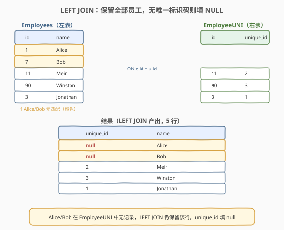
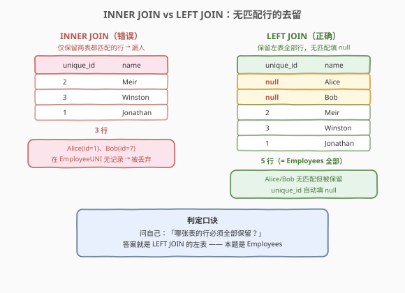
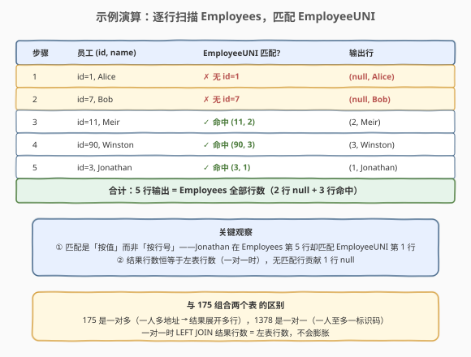

# 使用唯一标识码替换员工ID

- **题目名称**：使用唯一标识码替换员工ID
- **链接**：[1378. 使用唯一标识码替换员工ID](https://leetcode.cn/problems/replace-employee-id-with-the-unique-identifier/)
- **难度**：简单
- **标签**：数据库、SQL、LEFT JOIN、外连接、NULL 填充、pandas

## 1. 题目概述

给定两张表：`Employees`（员工，`id` 为主键）与 `EmployeeUNI`（员工唯一标识码，`(id, unique_id)` 为主键）。编写 SQL 查询，展示**每位员工**的 `unique_id` 与 `name`；若某员工没有唯一标识码，则 `unique_id` 使用 `null` 填充。

> ⚠️ 关键点：这是经典的「**LEFT JOIN 保留左表**」场景——要的不是两表交集，而是**以 `Employees` 为基准**，逐行去 `EmployeeUNI` 取 `unique_id`，取不到就填 `NULL`。与 [1350. 院系无效的学生](1350_院系无效的学生.md) 的「反连接」（`LEFT JOIN + IS NULL` 筛未匹配行）互补：1350 用 `IS NULL` **过滤**未匹配行，1378 用 `NULL` **填充**未匹配行——同一套 `LEFT JOIN`，一个筛、一个留。

**表结构**：

```text
Table: Employees
+---------------+---------+
| Column Name   | Type    |
+---------------+---------+
| id            | int     |  ← 主键
| name          | varchar |  ← 员工姓名
+---------------+---------+

Table: EmployeeUNI
+---------------+---------+
| Column Name   | Type    |
+---------------+---------+
| id            | int     |  ← 指向 Employees.id
| unique_id     | int     |  ← 唯一标识码
+---------------+---------+
  主键：(id, unique_id)
```

- `Employees.id` 为主键；`EmployeeUNI` 的主键是 `(id, unique_id)` 组合键——意味着同一 `id` 理论上可出现多次，但本题语义为「每位员工至多一个唯一标识码」，实际数据是一对一。
- `EmployeeUNI.id` 指向 `Employees.id`：只有**部分员工**在 `EmployeeUNI` 中有记录（被分配了标识码），其余员工的 `unique_id` 应输出 `null`。

**示例 1**：

```text
输入：
Employees 表：
+----+----------+
| id | name     |
+----+----------+
| 1  | Alice    |
| 7  | Bob      |
| 11 | Meir     |
| 90 | Winston  |
| 3  | Jonathan |
+----+----------+
EmployeeUNI 表：
+----+-----------+
| id | unique_id |
+----+-----------+
| 3  | 1         |
| 11 | 2         |
| 90 | 3         |
+----+-----------+

输出：
+-----------+----------+
| unique_id | name     |
+-----------+----------+
| null      | Alice    |
| null      | Bob      |
| 2         | Meir     |
| 3         | Winston  |
| 1         | Jonathan |
+-----------+----------+
```

**解释**：

| id | name | 在 EmployeeUNI 中? | unique_id | 结论 |
|----|------|---------------------|-----------|------|
| 1 | Alice | ❌ 无 | null | 无标识码 → null 填充 |
| 7 | Bob | ❌ 无 | null | 无标识码 → null 填充 |
| 11 | Meir | ✅ 命中 (11, 2) | 2 | 取到标识码 |
| 90 | Winston | ✅ 命中 (90, 3) | 3 | 取到标识码 |
| 3 | Jonathan | ✅ 命中 (3, 1) | 1 | 取到标识码 |

`EmployeeUNI.id = {3, 11, 90}`。Alice(id=1)、Bob(id=7) 不在其中，`unique_id` 输出 `null`。

**约束条件**：

- `Employees.id` 为主键，无重复
- `EmployeeUNI` 主键为 `(id, unique_id)` 组合
- 结果可按任意顺序返回
- 输出列名：`unique_id`、`name`

> 💡 本题是 SQL **「LEFT JOIN 一对一招牌入门题」**——核心就一句：`Employees LEFT JOIN EmployeeUNI ON e.id = u.id`。它是 [175. 组合两个表](../0101-0200/175_组合两个表.md) 的一对一精简版：175 是一对多（一人多地址→结果展开多行），1378 是一对一（一人至多一标识码→结果行数 = 左表行数），骨架完全相同。

---

## 2. 解题思路

### 2.1 错误思路：INNER JOIN 丢人

最直觉但**错误**的写法是默认的 `JOIN`（即 `INNER JOIN`）：

```sql
SELECT unique_id, name
FROM Employees e
JOIN EmployeeUNI u ON e.id = u.id;
```

`INNER JOIN` 只保留两表**都匹配上**的行——Alice(id=1)、Bob(id=7) 在 `EmployeeUNI` 中无记录，会被**直接丢弃**，结果只剩 3 行（Meir/Winston/Jonathan），漏掉了 2 名员工。

> ⚠️ `JOIN` 不写修饰词时**默认是 `INNER JOIN`**，会静默丢弃无匹配行。这是本题最常见的坑：题目明确要求「每位员工」都出现，`INNER JOIN` 恰好违背这一点。看到「无则填 null」「保留全部」这类措辞，条件反射选 `LEFT JOIN`。

### 2.2 核心观察：LEFT JOIN 保留左表，无匹配填 NULL



题目要求「展示**每位**员工」——`Employees` 的全部行都必须出现在结果中，无论是否在 `EmployeeUNI` 中有匹配。这正是 **LEFT JOIN**（左外连接）的语义：

- **LEFT JOIN**：以左表为基准，逐行去右表找匹配；找到则拼接 `unique_id`，找不到则 `unique_id` 填 `NULL`。
- 左表选 `Employees`（因为「每位员工都要出现」），右表选 `EmployeeUNI`。

> 💡 **如何判断用哪种 JOIN**：问自己一个问题——「哪张表的行必须全部保留？」答案就是左表，用 `LEFT JOIN`。本题是「每位员工都要出现」，所以 `Employees` 在左、`LEFT JOIN EmployeeUNI`。这与 [175. 组合两个表](../0101-0200/175_组合两个表.md) 的判定口诀完全一致。

**JOIN 方向选择**：为什么 `Employees` 在左？因为「必须保留全部行」的是 `Employees`。若反过来写 `EmployeeUNI LEFT JOIN Employees`，则保留的是 `EmployeeUNI` 的全部行——那些没被分配标识码的员工（Alice/Bob）依然不会出现，语义错误。

### 2.3 INNER JOIN vs LEFT JOIN 对比



| JOIN 类型 | 保留哪些行 | 本题是否适用 |
|-----------|-----------|-------------|
| **INNER JOIN** | 仅两表都有的交集 | ✗ 漏掉 Alice/Bob |
| **LEFT JOIN** | 左表全部 + 右表匹配 | ✓ **正确选择** |
| **RIGHT JOIN** | 右表全部 + 左表匹配 | ✗ Employees 放右表才等价，不直观 |
| **FULL JOIN** | 两表全部 | ✗ 多出「无员工的标识码」行 |

> ⚠️ 本题数据是一对一（每位员工至多一条 `EmployeeUNI` 记录），`LEFT JOIN` 的结果行数 = `Employees` 行数，不会膨胀。若改为一对多（如 175 的一人多地址），结果会按匹配数展开——见第 5 节对比。

### 2.4 示例演算

以示例 1 数据，跟踪 `LEFT JOIN` 逐行处理的过程：



**步骤**：`Employees LEFT JOIN EmployeeUNI ON e.id = u.id`

| 步骤 | Employees 行 | EmployeeUNI 匹配 | 输出行 |
|------|---------------|-------------------|--------|
| 1 | id=1, Alice | ❌ 无 id=1 | (null, Alice) |
| 2 | id=7, Bob | ❌ 无 id=7 | (null, Bob) |
| 3 | id=11, Meir | ✅ 命中 (11, 2) | (2, Meir) |
| 4 | id=90, Winston | ✅ 命中 (90, 3) | (3, Winston) |
| 5 | id=3, Jonathan | ✅ 命中 (3, 1) | (1, Jonathan) |
| **合计** | 5 行 | 3 条命中 | **5 行输出** |

> 💡 **两个关键观察**：
> - **匹配是「按值」而非「按行号」**——Jonathan 在 `Employees` 第 5 行，却匹配到 `EmployeeUNI` 第 1 行（id=3），因为 `ON e.id = u.id` 按值相等配对，与行顺序无关。
> - **结果行数 = 左表行数**（一对一时）——无匹配行贡献 1 行（`unique_id` 为 null），不会像 `INNER JOIN` 那样被丢弃，也不会像一对多那样膨胀。

---

## 3. 参考代码

### MySQL（LEFT JOIN，推荐）

```sql
# 1378. 使用唯一标识码替换员工ID
# 思路：LEFT JOIN 保留 Employees 全部行，无匹配则 unique_id 填 NULL
SELECT u.unique_id, e.name
FROM Employees e
LEFT JOIN EmployeeUNI u
    ON e.id = u.id;
```

> 💡 **写法要点**：
> - **`Employees` 在左**：`FROM Employees e LEFT JOIN EmployeeUNI u`，左表是「必须全部保留」的表。
> - **`ON e.id = u.id`**：连接条件，按员工 id 匹配。注意 `EmployeeUNI.id` 指向 `Employees.id`，连接方向与外键一致。
> - **`SELECT u.unique_id, e.name`**：`u.unique_id` 无匹配时自动返回 `NULL`，无需手动 `IFNULL`。输出列顺序为 `unique_id, name`，与题目要求一致。
> - **表别名** `e` / `u`：让 `ON` 与 `SELECT` 更简洁，是 SQL 惯例。

### Python（pandas）

```python
import pandas as pd

def replace_employee_id(employees: pd.DataFrame, employee_uni: pd.DataFrame) -> pd.DataFrame:
    return employees.merge(employee_uni, on='id', how='left')[['unique_id', 'name']]
```

> 💡 **pandas 对照**：
> - `merge(..., on='id', how='left')` 等价于 SQL 的 `LEFT JOIN`，`on='id'` 等价于 `ON e.id = u.id`。
> - `how='left'` 表示以左表（`employees`）为基准，无匹配行的 `unique_id` 自动填 `NaN`（pandas 的 `NaN` 对应 SQL 的 `NULL`）。
> - `[['unique_id', 'name']]` 保证输出列顺序与题目要求一致。
> - 若需将 `NaN` 显式转为 `None`（某些判题平台要求），追加 `.where(pd.notnull, None)`。

---

## 4. 复杂度分析

| 维度 | LEFT JOIN | 说明 |
|------|-----------|------|
| **时间复杂度** | $O(n + m)$ ~ $O(n \log m)$ | 取决于优化器：Hash Join 为 $O(n+m)$；Nested Loop + 索引为 $O(n \log m)$。$n$ = Employees 行数，$m$ = EmployeeUNI 行数 |
| **空间复杂度** | $O(n)$ | 结果集 = 左表行数（一对一时），需 $O(n)$ 存输出 |
| **结果行数** | $n$ | 一对一时恒等于左表行数，不膨胀 |

> ⚠️ SQL 查询的复杂度取决于**数据库执行计划**（索引、连接策略）。面试中说明「LEFT JOIN 扫描左表每行并在右表查找匹配，有索引时 $O(\log m)$，无索引退化为 $O(n \cdot m)$」即可。本题 `EmployeeUNI.id` 若有索引，查找效率最高。

---

## 5. 扩展：LEFT JOIN 家族与一对一 vs 一对多

### 5.1 LEFT JOIN 的两种用法：填充 vs 过滤

`LEFT JOIN` 是 SQL 中最灵活的连接，同一套语法可服务两种截然不同的目的：

| 用法 | 模式 | 代表题 | 核心动作 |
|------|------|--------|----------|
| **填充（本题）** | `L LEFT JOIN R` → 直接 SELECT | 1378、175 | 保留左表全部行，右表无匹配填 NULL |
| **过滤（反连接）** | `L LEFT JOIN R ... WHERE R.主键 IS NULL` | 1350、183 | 用 `IS NULL` 筛出**未匹配**的左表行 |

> 💡 **同根异果**：1378 与 1350 共享 `Employees LEFT JOIN EmployeeUNI` 这一连接骨架——1378 把连接结果**全要**（匹配的取 `unique_id`，未匹配的填 null），1350 把连接结果**只留未匹配的**（`WHERE u.id IS NULL`）。一留一筛，是 `LEFT JOIN` 的两面。

### 5.2 一对一 vs 一对多：结果行数差异

本题是**一对一**（每位员工至多一条 `EmployeeUNI` 记录），`LEFT JOIN` 结果行数 = 左表行数。而 [175. 组合两个表](../0101-0200/175_组合两个表.md) 是**一对多**（一人多地址），结果会按匹配数展开：

| 关系类型 | 代表题 | 左表行数 | 匹配情况 | 结果行数 |
|----------|--------|----------|----------|----------|
| 一对一 | 1378 | 5 | 2 无匹配 + 3 命中 | 5（= 左表） |
| 一对多 | 175 | 3 | 1 无匹配 + 1 命中1条 + 1 命中2条 | 4（> 左表） |

> ⚠️ 一对多时 `LEFT JOIN` 结果行数 = $\sum$（左表每行的右表匹配数），无匹配行贡献 1 行。若题目要求「每人只取一条」，需用 `ROW_NUMBER() OVER (PARTITION BY id ORDER BY ...)` 窗口函数去重后再 JOIN。

### 5.3 `ON` 与 `WHERE` 的陷阱

对 `LEFT JOIN` 而言，`ON` 是**连接条件**（决定如何匹配），`WHERE` 是**后过滤**（连接完成后筛行）。若把右表列的过滤条件放 `WHERE`，会**抵消** `LEFT JOIN` 效果：

```sql
SELECT u.unique_id, e.name
FROM Employees e
LEFT JOIN EmployeeUNI u ON e.id = u.id
WHERE u.unique_id > 1;
```

这会把 `unique_id` 为 `NULL` 的行（Alice/Bob）过滤掉——`NULL > 1` 为 `UNKNOWN`，`WHERE` 不保留——退化成 `INNER JOIN`。若需「过滤右表且保留左表全部行」，应把条件放 `ON` 中：`ON e.id = u.id AND u.unique_id > 1`。

> 💡 本题无需过滤右表，`ON e.id = u.id` 足矣。但理解 `ON`/`WHERE` 对 `LEFT JOIN` 的影响是面试高频考点——放错位置会静默改变语义。

---

## 6. 面试要点

1. **为什么用 `LEFT JOIN` 而不是 `INNER JOIN`？**

   > 题目要求「展示每位员工」，即使该员工没有唯一标识码也要出现（`unique_id` 填 null）。`INNER JOIN` 只保留两表都匹配的行，会丢弃 Alice/Bob 这类无标识码的员工。`LEFT JOIN` 保证左表（`Employees`）全部行保留，无匹配时右表列填 `NULL`，正好满足需求。

2. **`Employees` 和 `EmployeeUNI` 谁在左谁在右？**

   > `Employees` 在左。因为「必须保留全部行」的是 `Employees`（题目说「每位员工」），`LEFT JOIN` 保留的是左表。若把 `EmployeeUNI` 放左，则保留的是「所有有标识码的记录」，那些没被分配标识码的员工不会出现——语义错误。判定方法：问「哪张表的行不能丢」→ 那就是 `LEFT JOIN` 的左表。

3. **本题和 175 组合两个表 有什么区别？**

   > 骨架完全相同（都是 `LEFT JOIN` 保留左表），区别在**关系基数**：175 是一对多（一人多地址，结果按匹配数展开多行），1378 是一对一（一人至多一标识码，结果行数 = 左表行数，不膨胀）。1378 是 175 的一对一精简版，适合作为 `LEFT JOIN` 入门的第一题。

4. **`LEFT JOIN` 和 `LEFT OUTER JOIN` 一样吗？**

   > 完全等价。`LEFT JOIN` 是 `LEFT OUTER JOIN` 的简写——`OUTER` 关键字可省略。同理 `RIGHT JOIN` = `RIGHT OUTER JOIN`，`FULL JOIN` = `FULL OUTER JOIN`。SQL 标准中 `JOIN` 默认是 `INNER JOIN`，所以写 `LEFT JOIN` 时 `OUTER` 可省，但 `INNER` 不写时是隐式的。

5. **本题和 1350 院系无效的学生 有什么关系？**

   > 共享 `LEFT JOIN` 骨架，但用法互补：1378 把连接结果**全要**（匹配的取 `unique_id`，未匹配的填 null，输出全部员工）；1350 用 `WHERE u.id IS NULL` **只留未匹配行**（筛出「院系无效」的学生）。一留一筛，是 `LEFT JOIN` 的「填充」与「反连接」两种范式。看到 `LEFT JOIN` 题，先问自己：要全部行（填充）还是只要未匹配行（反连接）？

> 💡 **一句话总结**：1378 是 SQL **「LEFT JOIN 一对一招牌入门题」**——核心就一句 `Employees LEFT JOIN EmployeeUNI ON e.id = u.id`。记住两条：① 看到「无则填 null」「保留全部」→ 选 `LEFT JOIN`，左表放「行不能丢」的表；② 它是 175 的一对一精简版，与 1350 的反连接互补——同一套 `LEFT JOIN`，一个填、一个筛。

---

## 7. 同类练习题

- [175. 组合两个表](https://leetcode.cn/problems/combine-two-tables/)（[题解](../0101-0200/175_组合两个表.md)）：**LEFT JOIN 母题**——`Person LEFT JOIN Address` 保留全部人员，与本题完全同骨架，区别仅在一对多（一人多地址→结果展开）vs 一对一
- [1350. 院系无效的学生](https://leetcode.cn/problems/students-with-invalid-departments/)（[题解](1350_院系无效的学生.md)）：**反连接招牌题**——`Students LEFT JOIN Departments WHERE d.id IS NULL`，与本题共享 `LEFT JOIN` 骨架但用 `IS NULL` 筛未匹配行，一填一筛互为印证
- [183. 从不订购的客户](https://leetcode.cn/problems/customers-who-never-order/)（[题解](../0101-0200/183_从不订购的客户.md)）：反连接祖师爷题——`Customers LEFT JOIN Orders WHERE IS NULL` 找从未下单的客户，与 1350 同类
- [577. 员工奖金](https://leetcode.cn/problems/employee-bonus/)（[题解](../0501-0600/577_员工奖金.md)）：`Employee LEFT JOIN Bonus`，含 NULL 奖金处理——既保留无奖金员工（填充 null），又可筛无奖金员工（反连接），是 1378 与 1350 的中间形态
- [1068. 产品销售分析 I](https://leetcode.cn/problems/product-sales-analysis-i/)：`Sales LEFT JOIN Product` 保留全部销售记录并取产品信息，与本题同为「保留左表 + 取右表列」的基础 `LEFT JOIN`
