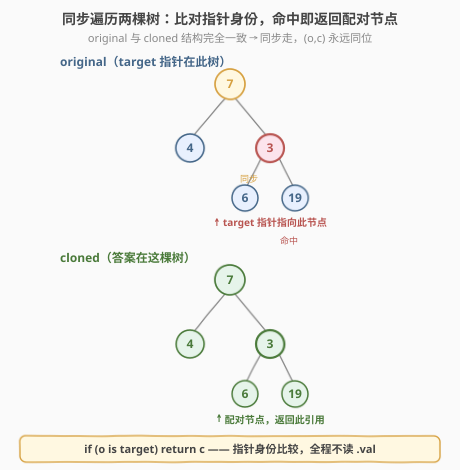
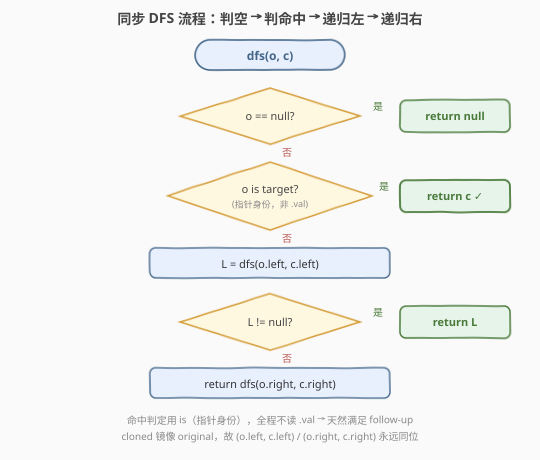
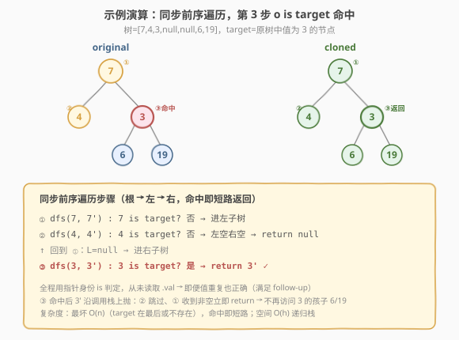

# LeetCode 找出克隆二叉树中的对应节点 题解

## 1. 题目概述

- **标题 / 题号**：找出克隆二叉树中的对应节点（#1379，medium）
- **链接**：https://leetcode.cn/problems/find-a-corresponding-node-of-a-binary-tree-in-a-clone-of-that-tree/
- **难度**：中等
- **标签**：树、二叉树、深度优先搜索（DFS）、广度优先搜索（BFS）

**题意**：给你两棵二叉树 `original` 和 `cloned`，以及一个指向 `original` 中某节点 `target` 的引用。`cloned` 是 `original` 的一份**深拷贝**（结构完全一致，但是另一组独立节点）。请你返回 `cloned` 中与 `target` **同位**（位置对应）的那个节点的引用。

**示例 1**：

```text
输入：tree = [7,4,3,null,null,6,19], target = 3（指向 original 中值为 3 的节点）
输出：3（cloned 中值为 3 的那个节点的引用）

        7                  7
       / \                / \
      4   3     clone    4   3
         / \    ───→       / \
        6  19             6  19
```

**示例 2**：

```text
输入：tree = [7], target = 7
输出：7
解释：单节点树，cloned 的根即答案。
```

**示例 3**：

```text
输入：tree = [8,null,6,null,5,null,4,null,3,null,2,null,1], target = 4
输出：4
解释：一条右倾链，target 在第 4 层。
```

**约束**：

- 树中节点数目在范围 $[1,\, 10^4]$ 内
- 节点值**互不相同**
- `target` 是 `original` 中的节点（保证存在）
- **进阶（follow-up）**：若不允许使用 `target` 的值，你能否求解？

> 💡 本题的灵魂是「**同步遍历 + 指针身份比对**」——既然 `cloned` 是 `original` 的结构镜像，那么把两棵树**配对往下走**，每到一对 `(o, c)`，它们必然同位。当 `o is target`（指针身份，不是值相等）时，配对的 `c` 就是答案。这个写法**全程不读 `.val`**，天然满足 follow-up，且即便树中有重复值也照样正确。

## 2. 解题思路

### 2.1 暴力思路：遍历 cloned 比对值

最直观的做法：因为节点值互不相同，直接遍历 `cloned`，找到 `cloned.val == target.val` 的节点返回即可。

```python
def getTargetCopy(self, original, cloned, target):
    if cloned is None: return None
    if cloned.val == target.val: return cloned          # 值比对
    return self.getTargetCopy(original, cloned.left, target) \
        or self.getTargetCopy(original, cloned.right, target)
```

它能过，但有两个问题——

- **依赖「值唯一」假设**：题目虽保证值互不相同，但 follow-up 明确要求**不得使用 `target` 的值**。一旦值可重复，`cloned.val == target.val` 会匹配到**任意一个**同值节点，未必是同位那个——正确性崩塌；
- **浪费了 `original` 的结构信息**：`cloned` 既然是 `original` 的镜像，两棵树位置一一对应，本可「按图索骥」直接定位，完全无需在 `cloned` 上盲目搜索。

> ⚠️ 这道题的 follow-up 不是刁难，而是点出**正确做法的判据应是「指针身份」而非「值」**。`target` 是一个**对象引用**，比较引用本身（`o is target`）才是不依赖值、且对重复值稳健的唯一途径。

### 2.2 核心观察：同步遍历，指针身份命中即返回配对节点



**关键洞察**：定义 `dfs(o, c)` 表示「**同步**遍历 `original` 的 `o` 与 `cloned` 的 `c`」——因为 `cloned` 镜像 `original` 的结构，所以 `o.left` 与 `c.left` 同位、`o.right` 与 `c.right` 同位，配对关系在递归中天然维持。于是：

1. 若 `o is None`：`c` 也必为 `None`（结构一致），返回 `None`；
2. 若 `o is target`（**指针身份比较**，不是 `o.val == target.val`）：此时 `c` 恰是同位节点，**直接返回 `c`**；
3. 否则先递归左子树 `dfs(o.left, c.left)`，若返回非空（左子树找到了）立即上抛；
4. 否则返回 `dfs(o.right, c.right)`（右子树的结果，可能为空）。

> ⚠️ **`is` vs `==` 的区别**：在 Python 中 `is` 比较对象身份（是否同一对象），`==` 比较值相等。本题必须用 `is`——我们要找的是 `target` 这个**对象**在 `cloned` 里的同位对象，而非任何值相等的节点。C++ 中对应 `o == target`（指针相等），而非 `o->val == target->val`。

> 💡 **为什么配对天然维持？** `cloned` 是 `original` 的深拷贝，结构（左/右孩子的有无与嵌套）逐节点复制。从根开始，`(root_o, root_c)` 同位；递归时 `o.left` 与 `c.left` 是各自左孩子，因结构一致而同位；右同理。只要始终「**同步**」往同方向走，任意时刻的 `(o, c)` 都对应同一位置——这就是「同步遍历」成立的根基，与 [100. 相同的树](../0001-0100/100_相同的树.md) 中「两棵树配对递归」是同一个骨架。

### 2.3 算法流程图



**`dfs(o, c)` 完整步骤**：

1. **空节点**：`o == None` → `return None`（递归基底，结构一致故 `c` 亦空）；
2. **指针命中**：`o is target` → `return c`（同位克隆节点，这就是答案）；
3. **递归左子树**：`L = dfs(o.left, c.left)`——同步进左；
4. **左子树命中即上抛**：若 `L != None` → `return L`（短路，避免无谓的右子树搜索）；
5. **递归右子树**：`return dfs(o.right, c.right)`——同步进右（题目保证 `target` 在树中，故右子树必命中）；
6. **入口**：`return dfs(original, cloned)`——从两棵树的根开始同步。

> 💡 **前序即可，无需后序**：本题在访问节点时立即能判定 `o is target`（指针身份不依赖孩子结论），所以前序「先判自己再递归孩子」最合适——命中即可短路返回，不必走完整棵树。这与 [1325. 删除给定值的叶子节点](./1325_删除给定值的叶子节点.md)「结论依赖孩子故必须后序」形成对照：**判定时机取决于「结论是否依赖孩子子树」**。

### 2.4 示例演算

以示例 1 的树 `[7,4,3,null,null,6,19]`、`target` 指向原树中值为 `3` 的节点为例，同步前序遍历（根→左→右）如下：



| 步骤 | 调用 | `o is target`? | 动作 / 返回 |
|------|------|----------------|-------------|
| ① | `dfs(7, 7')` | 否 | 进左子树 `dfs(4, 4')` |
| ② | `dfs(4, 4')` | 否 | 左空右空 → `return None` |
| — | 回到 ① | — | `L=None` → 进右子树 `dfs(3, 3')` |
| ③ | `dfs(3, 3')` | **是** | `return 3'` ✓ |

最终 `3'`（cloned 中值为 3 的节点引用）沿调用栈上抛：② 被跳过（其返回值无人关心），① 收到非空立即 `return`，**不再访问 3 的孩子 6/19**。

> 💡 **短路的价值**：步骤 ③ 命中后，`target` 已找到，调用栈逐层 `return L` 把答案上抛，**跳过所有未访问的兄弟子树**。最坏情况（`target` 是前序最后一个节点或不存在）才遍历全部 $n$ 个节点；平均更快。题目保证 `target` 在树中，故 `dfs` 必然返回非空。

> ⚠️ **值重复时的正确性**：假设树中有两个值都为 3 的节点，`target` 指向其中**特定一个**。值比对法会返回**先遇到**的那个（可能不是同位），而指针身份法 `o is target` 只在走到 `target` 这个对象本身时才命中——同位的 `c` 与之配对，**唯一确定**。这是 follow-up 的真正考点。

## 3. 参考代码

### C++

```cpp
// 找出克隆二叉树中的对应节点.cpp —— 同步 DFS + 指针身份比对，O(n)
// 编译: g++ -O2 -std=c++17 找出克隆二叉树中的对应节点.cpp -o find_clone
#include <utility>
using namespace std;

struct TreeNode {
    int val;
    TreeNode* left;
    TreeNode* right;
    TreeNode() : val(0), left(nullptr), right(nullptr) {}
    TreeNode(int x) : val(x), left(nullptr), right(nullptr) {}
    TreeNode(int x, TreeNode* l, TreeNode* r) : val(x), left(l), right(r) {}
};

class Solution {
public:
    TreeNode* getTargetCopy(TreeNode* original, TreeNode* cloned, TreeNode* target) {
        return dfs(original, cloned, target);
    }

    TreeNode* dfs(TreeNode* o, TreeNode* c, TreeNode* target) {
        if (!o) return nullptr;                  // ① 空节点（结构一致，c 亦空）
        if (o == target) return c;               // ② 指针身份命中，返回配对 c
        TreeNode* L = dfs(o->left, c->left, target);  // ③ 同步进左
        if (L) return L;                         // ④ 左子树命中即上抛（短路）
        return dfs(o->right, c->right, target);  // ⑤ 同步进右
    }
};
```

### Python

```python
class Solution:
    def getTargetCopy(self, original: TreeNode | None,
                      cloned: TreeNode | None,
                      target: TreeNode | None) -> TreeNode | None:
        def dfs(o: TreeNode | None, c: TreeNode | None) -> TreeNode | None:
            if not o:                  # ① 空节点（结构一致，c 亦空）
                return None
            if o is target:            # ② 指针身份命中，返回配对 c
                return c
            L = dfs(o.left, c.left)    # ③ 同步进左
            if L:                      # ④ 左子树命中即上抛（短路）
                return L
            return dfs(o.right, c.right)  # ⑤ 同步进右

        return dfs(original, cloned)
```

> 💡 两版等价，核心只有两行：**`o is target` 时返回配对的 `c`** + **左右子树同步递归**。`original` 参数其实只在入口用一次（提供根），递归内部完全靠 `(o, c)` 配对推进，不再读 `original`。注意 Python 用 `is`、C++ 用 `==`（指针相等），均为身份比较，不是 `.val` 比较。

## 4. 复杂度分析

| 维度 | 同步 DFS（指针身份，推荐） | 遍历 cloned 比对值（暴力） |
|------|---------------------------|---------------------------|
| 时间复杂度 | $O(n)$ 最坏，命中即短路 | $O(n)$ 最坏，命中即短路 |
| 空间复杂度 | $O(h)$（递归栈，$h$ 为树高） | $O(h)$ |
| 值重复时正确性 | ✅ 指针身份唯一确定 | ❌ 误匹配任意同值节点 |
| 满足 follow-up | ✅ 全程不读 `.val` | ❌ 依赖 `.val` |

> ⚠️ **空间说明**：递归栈深度为树高 $h$，平衡树 $O(\log n)$，退化为链表 $O(n)$。本题 $n \leq 10^4$，即便链式退化也安全。若树深达数十万层存在栈溢出顾虑，可改用显式栈/队列的迭代版（见第 5 节）。两种解法时间同为 $O(n)$，但同步 DFS **不依赖值唯一**且满足 follow-up，是正解；暴力法仅在「值唯一且无 follow-up 限制」时才等价可用。

## 5. 扩展：迭代版与路径回放法

### 5.1 同步 BFS（迭代，规避递归栈深）

若面试官要求避免递归，可用两个队列做**同步层序遍历**——`original` 和 `cloned` 各一个队列，同步入队/出队，出队时比对指针身份。

```python
from collections import deque

class Solution:
    def getTargetCopy(self, original, cloned, target):
        qo, qc = deque([original]), deque([cloned])
        while qo:
            o, c = qo.popleft(), qc.popleft()
            if o is target:            # 指针身份命中
                return c
            if o.left:                 # 同步入队左孩子
                qo.append(o.left); qc.append(c.left)
            if o.right:                # 同步入队右孩子
                qo.append(o.right); qc.append(c.right)
        return None
```

BFS 的空间为 $O(w)$（$w$ 为树的最大宽度，最坏 $O(n)$），略大于 DFS 的 $O(h)$，但能在「极深链式树」下规避递归栈溢出。两种迭代策略（栈做 DFS、队列做 BFS）均成立，按面试场景选取。

### 5.2 路径回放法：另一种满足 follow-up 的思路

除「同步遍历」外，还有一种也满足 follow-up 的解法：**先在 `original` 上记录到 `target` 的路径（一串 L/R 方向），再在 `cloned` 上回放同一路径**。

```python
class Solution:
    def getTargetCopy(self, original, cloned, target):
        # 1) 在 original 上找 target，记录路径（方向序列）
        path = []
        def find(o):
            if not o: return False
            if o is target: return True
            path.append('L')
            if find(o.left): return True
            path.pop()
            path.append('R')
            if find(o.right): return True
            path.pop()
            return False
        find(original)
        # 2) 在 cloned 上按路径回放
        node = cloned
        for d in path:
            node = node.left if d == 'L' else node.right
        return node
```

它同样全程用 `is` 判定、不读 `.val`，满足 follow-up。但需两趟遍历（先找路径、再回放），且要存 $O(h)$ 的路径序列，常数大于「同步遍历」一趟搞定。**同步遍历是首选**，路径回放可作为「换一种思路」的对照展示。

> 💡 **三种解法对比**：同步 DFS（一趟、$O(h)$ 空间，首选）／同步 BFS（迭代、规避栈深，$O(w)$ 空间）／路径回放（两趟、$O(h)$ 存路径，思路对照）。三者都靠**指针身份**而非值判定，都满足 follow-up。

## 6. 面试要点

1. **为什么用指针身份 `is`/`==` 而不是值 `.val` 比较？**

   > `target` 是一个**对象引用**，题目要找的是「这个对象在 `cloned` 里的同位对象」。值比对 (`o.val == target.val`) 依赖「值唯一」假设——一旦值重复，会误匹配到任意同值节点。指针身份 (`o is target`) 只在走到 `target` 这个对象本身时才命中，唯一确定同位的 `c`。这正是 follow-up「不得使用 `target` 的值」的考点：正确判据是身份而非值。

2. **为什么同步遍历能保证 `(o, c)` 始终同位？**

   > `cloned` 是 `original` 的深拷贝，结构逐节点复制。从根开始 `(root_o, root_c)` 同位；递归时 `o.left` 与 `c.left` 是各自左孩子，因结构一致而同位；右同理。只要始终「同步」往同方向走，配对关系在递归中天然维持——这是 [100. 相同的树](../0001-0100/100_相同的树.md)「两棵树配对递归」骨架的直接迁移。

3. **为什么用前序（先判自己再递归孩子）？后序行吗？**

   > 本题判定 `o is target` 是**指针身份比较，不依赖孩子子树的结论**——访问节点时立即能判定。前序「先判自己」命中即可短路返回，无需走完整棵树。后序也能得到正确答案（先遍历孩子再判自己），但会**先访问完左右子树才判定当前节点**，丢掉短路优势、常数更大。这与 [1325. 删除给定值的叶子节点](./1325_删除给定值的叶子节点.md)「结论依赖孩子故必须后序」形成对照：**判定时机取决于结论是否依赖孩子子树**。

4. **`original` 参数在递归里还有用吗？为什么还要传它？**

   > 递归内部不再读 `original`——它只在入口提供根节点 `root_o`，与 `cloned` 的根配对启动同步遍历。之后全靠 `(o, c)` 配对推进。之所以仍传 `original`（而非只用 `cloned` 和 `target`），是因为 `target` 这个指针**存在于 `original` 的节点集合中**，必须遍历 `original` 才能用 `is` 比对命中；只遍历 `cloned` 拿不到 `original` 的节点指针，就无法做身份比较（只能退化为值比对，违反 follow-up）。

5. **若 `target` 不在 `original` 中（题目保证存在，但面试可能追问），算法行为如何？**

   > `dfs` 会遍历完整棵 `original`，所有递归调用都返回 `None`，最终入口返回 `None`。代码无需改动即正确处理「不存在」情形——返回 `None` 表示未找到。这与 [236. 二叉树最近公共祖先](../0201-0300/236_二叉树最近公共祖先.md) 中「搜索树中节点并返回引用」的失败语义一致：用 `None` 表示「子树中无目标」。

> 💡 **一句话总结**：1379 的灵魂是「**同步遍历 + 指针身份**」——`cloned` 镜像 `original` 的结构，把两棵树配对往下走，`(o, c)` 永远同位；当 `o is target` 时返回配对的 `c`。全程不读 `.val`，天然满足 follow-up，且对重复值稳健。这是「两棵树配对递归」骨架在「定位同位节点」场景下的直接应用。

## 同类练习题

| # | 题目 | 与本题的关联 |
|---|------|-------------|
| 100 | [相同的树](../0001-0100/100_相同的树.md) | 同步两树配对递归的招牌题——两棵树一起往下走，逐节点对比结构与值；1379 把「对比值」换成「比对 `original` 节点与 `target` 的指针身份」，是同一骨架在「定位同位节点」场景的应用 |
| 101 | [对称二叉树](https://leetcode.cn/problems/symmetric-tree/) | 同为同步两树配对递归，但配对方向是「左对右、右对左」（镜像）；对照 1379 的「左对左、右对右」（同位）——覆盖配对递归的两种方向模式 |
| 236 | [二叉树最近公共祖先](../0201-0300/236_二叉树最近公共祖先.md) | 在树中搜索目标节点并返回其引用，用 `None` 表示「子树无目标」；对照 1379 同样是「树搜索 + 返回节点引用 + 短路上抛」，但 236 搜两个节点取 LCA、1379 搜一个节点取同位克隆 |
| 1325 | [删除给定值的叶子节点](./1325_删除给定值的叶子节点.md) | 同为 1301-1400 区间的树形 DFS，但 1325 结论依赖孩子子树故**必须后序**，1379 判定不依赖孩子故**前序即可短路**——对照「判定时机如何取决于结论是否依赖孩子」，覆盖树形遍历两大方向 |
