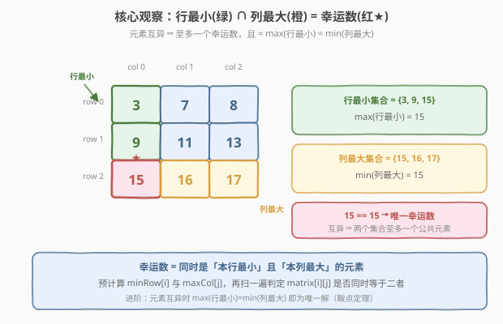
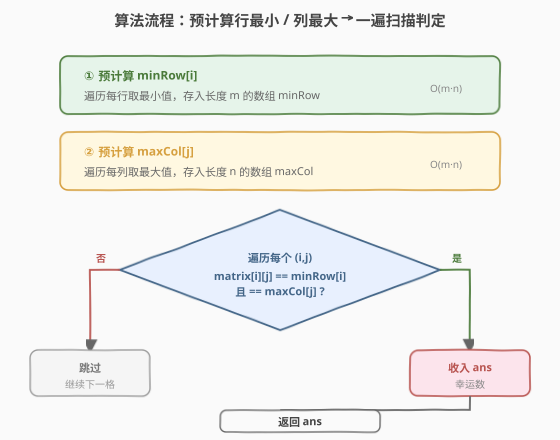
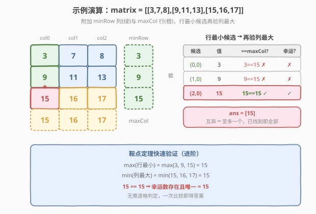

# LeetCode 矩阵中的幸运数 题解

## 1. 题目概述

- **标题 / 题号**：矩阵中的幸运数（#1380，easy）
- **链接**：https://leetcode.cn/problems/lucky-numbers-in-a-matrix/
- **难度**：简单
- **标签**：数组、矩阵

**题意**：给你一个 `m × n` 的矩阵，矩阵中的数字**各不相同**。请你按**任意**顺序返回矩阵中的所有**幸运数**。

**幸运数**是指矩阵中同时满足下列两个条件的元素：

- 在同一行的所有元素中**最小**；
- 在同一列的所有元素中**最大**。

**示例 1**：

```text
输入：matrix = [[3,7,8],[9,11,13],[15,16,17]]
输出：[15]
解释：15 是唯一的幸运数，因为它是其所在行中的最小值，也是所在列中的最大值。
```

**示例 2**：

```text
输入：matrix = [[1,10,4,2],[9,3,8,7],[15,16,17,12]]
输出：[12]
解释：12 是其所在行中的最小值，也是所在列中的最大值。
```

**示例 3**：

```text
输入：matrix = [[7,8],[1,2]]
输出：[7]
解释：7 是行中的最小值，列中的最大值。
```

**约束**：

- `m == matrix.length`，`n == matrix[i].length`
- `1 <= m, n <= 50`
- `1 <= matrix[i][j] <= 10^5`
- 矩阵中的所有元素**互不相同**

> 💡 本题的灵魂是「**行最小 ∩ 列最大**」——幸运数既要当本行的小弟，又要当本列的老大。直接对每个格子现算行最小、列最大会重复扫描；把每行最小、每列最大**预计算**成两张表，判定就退化成两次等值比较。而「元素互异」这一条件还藏着一个更深的结论：幸运数**至多一个**，且恰等于 `max(行最小) = min(列最大)`（鞍点定理）。

## 2. 解题思路

### 2.1 暴力思路：逐元素现算

最直观的做法：遍历每个格子 `(i, j)`，临时扫描第 `i` 行找最小、扫描第 `j` 列找最大，再判断 `matrix[i][j]` 是否同时等于二者。

- **正确但低效**：每个格子都要 $O(m + n)$ 地现算一次，总计 $O(mn(m+n))$；$m, n \le 50$ 时约 $50 \times 50 \times 100 = 2.5 \times 10^5$ 次比较，能过但浪费。
- **重复劳动**：同一行的最小值被反复计算 `n` 次，同一列的最大值被反复计算 `m` 次——这是典型的「**可记忆化消除的重复**」。

> ⚠️ 暴力不是错，只是把「行最小」「列最大」这两件本可一次性算好的事，散到每个格子里重做了一遍。把它们提到外层预计算，复杂度立刻从 $O(mn(m+n))$ 降到 $O(mn)$。

### 2.2 核心观察：预计算行最小与列最大



**关键洞察**：把判定条件拆成两个独立谓词——

- **行最小**：`matrix[i][j] == minRow[i]`，其中 `minRow[i]` 是第 `i` 行的最小值；
- **列最大**：`matrix[i][j] == maxCol[j]`，其中 `maxCol[j]` 是第 `j` 列的最大值。

两者都成立 ⇔ 该格是幸运数。于是分两阶段：

1. **预计算**：一遍扫每行得 `minRow[0..m-1]`，一遍扫每列得 `maxCol[0..n-1]`；
2. **判定**：再扫一遍矩阵，凡 `matrix[i][j] == minRow[i] && matrix[i][j] == maxCol[j]` 者收入答案。

> 以示例 1 为例：`minRow = [3, 9, 15]`、`maxCol = [15, 16, 17]`。只有 `(2,0)=15` 同时满足 `15 == minRow[2]` 与 `15 == maxCol[0]`，故答案是 `[15]`。`3` 和 `9` 虽是行最小，但 `3 != 15`、`9 != 15`，列最大这一关过不了。

> ⚠️ **为什么预计算能省到 $O(mn)$？** 行最小共 `m` 个、列最大共 `n` 个，各扫一遍矩阵即可全部求出（$O(mn)$）；判定再扫一遍（$O(mn)$）。三次 $O(mn)$ 相加还是 $O(mn)$，相较暴力的 $O(mn(m+n))$，省掉的是「每个格子重算行/列极值」的重复——本质是用 $O(m+n)$ 的额外空间换取时间的指数级下降。

### 2.3 算法流程图



**完整步骤**：

1. **求 `minRow`**：`minRow[i] = min(matrix[i])`，长度 `m`；
2. **求 `maxCol`**：`maxCol[j] = max(matrix[i][j] for i in range(m))`，长度 `n`；
3. **扫描判定**：对每个 `(i, j)`，若 `matrix[i][j] == minRow[i]` 且 `matrix[i][j] == maxCol[j]`，加入 `ans`；
4. **返回** `ans`。

> 💡 由于元素互异，`minRow[i]` 在第 `i` 行只会命中**唯一**一个格子（行内无并列最小），`maxCol[j]` 同理。所以内层判定虽写成了双重循环，实际命中数极少——这是第 5 节「至多一个幸运数」的直觉伏笔。

### 2.4 示例演算

以示例 1 的 `3×3` 矩阵为例：



把 `minRow` 作为附加列、`maxCol` 作为附加行拼成「增广矩阵」，判定一目了然：

| 行最小候选 | 值 | `== maxCol[j]`? | 幸运? |
|------------|----|------------------|-------|
| `(0, 0)` | 3 | `3 == 15`? ✗ | ✗ |
| `(1, 0)` | 9 | `9 == 15`? ✗ | ✗ |
| `(2, 0)` | 15 | `15 == 15`? ✓ | ✓ |

> 💡 幸运数必先是行最小（或对称地必先是列最大），所以只需对 `m` 个行最小候选再验列最大即可，无需对全部 `mn` 格逐一双判。示例 1 三个候选只有 `(2,0)=15` 通过，`ans = [15]`。

## 3. 参考代码

### C++

```cpp
// 矩阵中的幸运数.cpp —— 预计算行最小/列最大，O(mn)
// 编译: g++ -O2 -std=c++17 矩阵中的幸运数.cpp -o luckynum
#include <vector>
#include <algorithm>
#include <climits>
using namespace std;

class Solution {
public:
    vector<int> luckyNumbers(vector<vector<int>>& matrix) {
        int m = matrix.size(), n = matrix[0].size();
        vector<int> minRow(m, INT_MAX);     // 每行最小
        vector<int> maxCol(n, INT_MIN);     // 每列最大
        for (int i = 0; i < m; ++i)
            for (int j = 0; j < n; ++j) {
                minRow[i] = min(minRow[i], matrix[i][j]);
                maxCol[j] = max(maxCol[j], matrix[i][j]);
            }
        vector<int> ans;
        for (int i = 0; i < m; ++i)
            for (int j = 0; j < n; ++j)
                if (matrix[i][j] == minRow[i] && matrix[i][j] == maxCol[j])
                    ans.push_back(matrix[i][j]);
        return ans;
    }
};
```

### Python

```python
class Solution:
    def luckyNumbers(self, matrix: list[list[int]]) -> list[int]:
        m, n = len(matrix), len(matrix[0])
        minRow = [min(row) for row in matrix]          # 每行最小
        maxCol = [max(matrix[i][j] for i in range(m))  # 每列最大
                  for j in range(n)]
        ans = []
        for i in range(m):
            for j in range(n):
                if matrix[i][j] == minRow[i] and matrix[i][j] == maxCol[j]:
                    ans.append(matrix[i][j])
        return ans
```

> 💡 两版等价，核心是「**预计算两张极值表，再一遍等值双判**」。也可用 Python 一行式：`set(minRow) & set(maxCol)`——因为元素互异，行最小集合与列最大集合的交集正是全部幸运数（见第 5 节）。

## 4. 复杂度分析

| 维度 | 预计算法 $O(mn)$（推荐） | 鞍点定理 $O(mn)$（进阶） | 暴力 $O(mn(m+n))$ |
|------|------------------------|------------------------|-------------------|
| 时间复杂度 | $O(mn)$ | $O(mn)$ | $O(mn(m+n))$ |
| 空间复杂度 | $O(m + n)$ | $O(n)$（仅存 `maxCol`） | $O(1)$ |
| 实际运算量 | `m=n=50` 约 $7.5\times10^3$ | 同量级，但只比较一次 | 约 $2.5\times10^5$ |

- **预计算法**：预计算两次 + 判定一次，共三轮 $O(mn)$，常数 3；空间存 `minRow`、`maxCol` 共 $O(m+n)$。是工程上最清晰、最易验证的正解。
- **鞍点定理**：利用互异性，只比较 `max(行最小)` 与 `min(列最大)` 一次即得唯一解，省去逐格判定；空间可压到 $O(n)$（只缓存 `maxCol`，行最小边扫边取 max）。
- **暴力**：$O(mn(m+n))$，数据小能过，但不体现对结构的利用。

> ⚠️ 本题数据规模 $m, n \le 50$ 极小，三种方法都能毫秒级通过。面试中写出预计算法即可，鞍点定理作为「洞察加分项」在第 5 节展开。

## 5. 扩展：鞍点定理——幸运数至多一个

利用「**元素互异**」这一条件，可以证明一个漂亮结论：

> **定理**：元素互异的矩阵中，幸运数若存在则**唯一**，且其值恰为 $\max_i(\minRow[i]) = \min_j(\maxCol[j])$。因此只需比较这两个数：相等则返回 `[该值]`，否则返回 `[]`。

**证明（唯一性）**：设存在两个幸运数 $a$、$b$，分别位于 $(r_1, c_1)$、$(r_2, c_2)$。由于元素互异且同行/同列不能同时有两个极值，必有 $r_1 \ne r_2$ 且 $c_1 \ne c_2$。考察交叉格 `matrix[r_1][c_2]`：

- 它在第 $r_1$ 行，故 $\ge$ 该行最小 $= a$；
- 它在第 $c_2$ 列，故 $\le$ 该列最大 $= b$。

从而 $a \le \text{matrix}[r_1][c_2] \le b$，即 $a \le b$。对称地考察 `matrix[r_2][c_1]` 得 $b \le a$。故 $a = b$，与元素互异矛盾。$\square$

**证明（等于公共值）**：设幸运数 $a$ 位于 $(r_1, c_1)$，则 $a = \minRow[r_1] = \maxCol[c_1]$。

- $\max_i \minRow[i] \ge \minRow[r_1] = a$；
- $\min_j \maxCol[j] \le \maxCol[c_1] = a$；
- 又对任意 $i, j$ 有 $\minRow[i] \le \text{matrix}[i][j] \le \maxCol[j]$，故 $\max_i \minRow[i] \le \min_j \maxCol[j]$。

三式合拢：$a \le \max_i \minRow[i] \le \min_j \maxCol[j] \le a$，全取等，故 $\max_i \minRow[i] = \min_j \maxCol[j] = a$。反之若该等式成立，设公共值为 $v$，则 $v$ 既是某行最小（出现在某格）、又是某列最大——元素互异保证这两处是**同一格**（值唯一），故 $v$ 即幸运数。$\square$

**代码**（一行式）：

```python
class Solution:
    def luckyNumbers(self, matrix: list[list[int]]) -> list[int]:
        v = max(min(row) for row in matrix)            # max(行最小)
        if v == min(max(col) for col in zip(*matrix)): # min(列最大)
            return [v]
        return []
```

> 💡 `zip(*matrix)` 把矩阵转置，逐列取 `max` 再取 `min` 即得 $\min_j \maxCol[j]$。这与第 3 节代码里 `set(minRow) & set(maxCol)` 的写法等价——互异条件下，两个集合的交集大小恰为 0 或 1。鞍点定理把「逐格判定」压缩成「一次比较」，是本题最优雅的形态。

> ⚠️ 鞍点定理的**前提是元素互异**。若题目改为允许重复元素，唯一性不再成立（例如全相同矩阵每格都是幸运数），此时必须回到第 3 节的逐格预计算法。

## 6. 面试要点

1. **如何想到预计算？**

   > 幸运数的两个条件分别只依赖「行」和「列」，是两条独立维度。每个格子现算会重复扫描同一行/列 $O(m+n)$ 次。把行最小、列最大提到外层各算一次，判定就退化成两次 $O(1)$ 等值比较——这是「**用空间换时间消除重复计算**」的标准套路，与 [303. 区域和检索](../0301-0400/303_区域和检索_数组不可变.md) 的前缀和同源。

2. **元素互异给本题带来了什么？**

   > 两个好处：一是 `minRow[i]`、`maxCol[j]` 在各自行/列命中**唯一**格子，判定无歧义；二是导出「幸运数至多一个」的鞍点定理，从而把逐格判定压缩成一次 `max(行最小) == min(列最大)` 的比较。若去掉互异条件，这两条都不成立，必须逐格判定并可能返回多个结果。

3. **`set(minRow) & set(maxCol)` 为什么等价于逐格判定？**

   > 元素互异时，一个值在矩阵中只出现一次。若某值既是某行最小又在某列最大，它必然落在「该行最小的格子」与「该列最大的格子」的交点——而这两格因值相同必为同一格。所以「行最小值集合 ∩ 列最大值集合」恰好等于全部幸运数的值集合，交集大小 $\le 1$。

4. **鞍点定理为什么要求互异？能给个反例吗？**

   > 全相同矩阵（如 `[[2,2],[2,2]]`）每个格子都既是行最小又是列最大，有 4 个幸运数，唯一性失效；此时 `max(行最小)=2`、`min(列最大)=2` 虽相等，却只返回 `[2]` 漏掉其余。重复元素破坏了「值到位置的一一映射」，定理的证明中「两处必为同一格」一步不再成立。

5. **能否只对行最小候选做判定？**

   > 可以，且更省。幸运数必是行最小（或对称地必是列最大），故只需对 `m` 个行最小候选 `(i, argmin row i)` 再验 `matrix[i][j] == maxCol[j]`，最坏 $O(mn)$ 不变但常数更小。这与第 2.4 节演算表只列三个候选是一致思路——**先过单维度筛，再过另一维度**。

> 💡 **一句话总结**：1380 的灵魂是「**行最小 ∩ 列最大**」——预计算两张极值表把 $O(mn(m+n))$ 压到 $O(mn)$；元素互异更进一步给出鞍点定理，幸运数至多一个且等于 `max(行最小) = min(列最大)`，一次比较即得。

## 同类练习题

| # | 题目 | 与本题的关联 |
|---|------|-------------|
| 1337 | [矩阵中战斗力最弱的 K 行](../1301-1400/1337_矩阵中战斗力最弱的K行.md) | 同为「矩阵逐行求极值 + 二分/排序」的矩阵预处理题，对照本题「每行取最小」与 1337「每行数 1 的个数」的预处理范式 |
| 1351 | [统计有序矩阵中的负数](../1301-1400/1351_统计有序矩阵中的负数.md) | 矩阵遍历题，对比「无序矩阵预计算极值」与「双单调矩阵阶梯遍历」两类利用矩阵结构的方式 |
| 378 | [有序矩阵中第 K 小的元素](https://leetcode.cn/problems/kth-smallest-element-in-a-sorted-matrix/) | 矩阵 + 极值问题，二分值域 + 阶梯计数，承接本题对「行/列极值」的处理升级为值域二分验证 |
| 766 | [托普利茨矩阵](https://leetcode.cn/problems/toeplitz-matrix/) | 矩阵逐格判定题，对照「每格与左上邻居比较」的单调判定与本题「每格与行/列极值比较」的双维判定 |
| 566 | [重塑矩阵](https://leetcode.cn/problems/reshape-the-matrix/) | 矩阵下标映射基础题，巩固「二维坐标 ↔ 一维编号」的转换，为矩阵遍历类题打底 |
