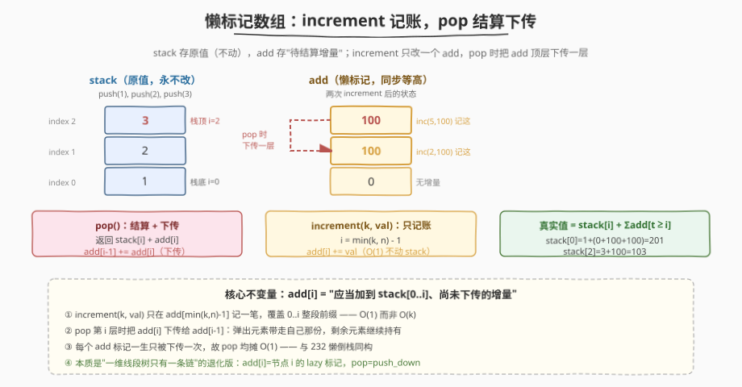
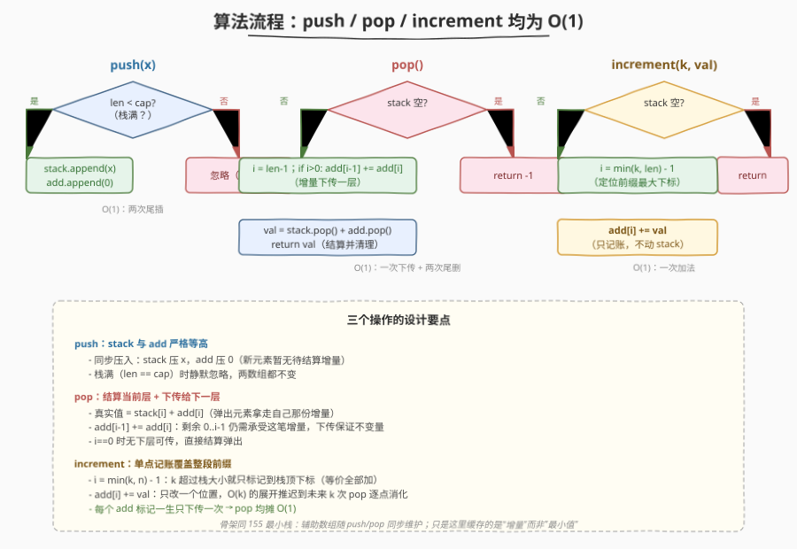
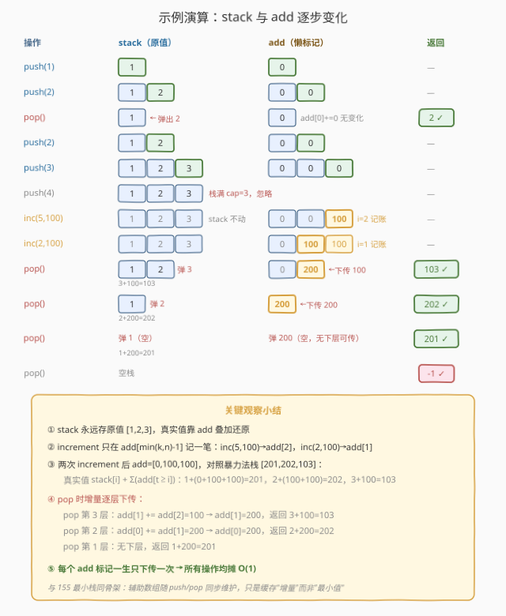

# 设计一个支持增量操作的栈

- **题目名称**：设计一个支持增量操作的栈
- **链接**：[1381. 设计一个支持增量操作的栈](https://leetcode.cn/problems/design-a-stack-with-increment-operation/)
- **难度**：中等
- **标签**：栈、设计、懒标记

## 1. 题目概述

请你设计一个支持下述操作的栈 `CustomStack`：

- `CustomStack(int maxSize)`：用给定的最大容量 `maxSize` 初始化对象，栈最多容纳 `maxSize` 个元素。
- `void push(int x)`：如果栈大小未达 `maxSize`，将 `x` 压入栈顶；否则什么也不做。
- `int pop()`：弹出并返回栈顶元素；若栈为空返回 `-1`。
- `void increment(int k, int val)`：将栈底开始的 `k` 个元素各加 `val`；若栈中元素少于 `k` 个，则全部加 `val`。

**示例 1**：

```text
输入：
["CustomStack","push","push","pop","push","push","push","increment","increment","pop","pop","pop","pop"]
[[3],[1],[2],[],[2],[3],[4],[5,100],[2,100],[],[],[],[]]

输出：
[null,null,null,2,null,null,null,null,null,null,4,103,103]

解释：
CustomStack customStack = new CustomStack(3); // 栈空，maxSize = 3
customStack.push(1);                          // 栈 [1]
customStack.push(2);                          // 栈 [1, 2]
customStack.pop();                            // 返回 2，栈 [1]
customStack.push(2);                          // 栈 [1, 2]
customStack.push(3);                          // 栈 [1, 2, 3]
customStack.push(4);                          // 栈满，仍 [1, 2, 3]
customStack.increment(5, 100);                // 栈底 3 个加 100 → [101, 102, 103]
customStack.increment(2, 100);                // 栈底 2 个加 100 → [201, 202, 103]
customStack.pop();                            // 返回 103，栈 [201, 202]
customStack.pop();                            // 返回 202，栈 [201]
customStack.pop();                            // 返回 201，栈 []
customStack.pop();                            // 返回 -1，栈仍空
```

**约束条件**：

- $1 \le \text{maxSize}, x, k \le 1000$
- $0 \le \text{val} \le 1000$
- 每个方法最多被调用 $1000$ 次

> 💡 难点在 `increment`。朴素做法是遍历栈底 `k` 个元素逐个加 `val`，单次 $O(k)$。如果 `increment` 被频繁调用且 `k` 较大，累计开销不可忽视。能否做到**所有操作均 $O(1)$**？答案是**懒标记**——把"加 `val`"这件事记账而非立即执行，等真正 `pop` 时再连同账目一起结算。

---

## 2. 解题思路

### 2.1 暴力思路：increment 时逐个加

用一个数组 `stack` 直接存数据。`push`/`pop`/`top` 都是数组尾操作，$O(1)$。`increment(k, val)` 取 `i = min(k, len) - 1`，对 `stack[0..i]` 逐个加 `val`，单次 $O(\min(k, n))$。

最坏情况下 $1000$ 次 `increment(1000, val)` 配合 $1000$ 次 `pop`，总开销 $O(q \cdot k) \approx 10^6$——本题数据规模下勉强能过，但不够优雅，且不符合"设计高效数据结构"的初衷。

> ⚠️ 问题的本质：`increment` 作用的是**栈底**一段前缀，而 `pop` 取的是**栈顶**。两者操作的位置不同，导致 `increment` 的累加值被"堆"在底部，每次都要改一串。能否把这个累加值**延迟**到元素出栈时再算？

### 2.2 核心观察：懒标记数组 + 出栈下传



关键洞察：维护一个与 `stack` 等高的辅助数组 `add`，其中 `add[i]` 表示**"应当加到 `stack[0..i]` 这一段但尚未结算的增量"**。`increment(k, val)` 时只在一个位置 `add[min(k, n) - 1]` 上记账（$O(1)$），不真的去改任何 `stack` 元素。

真正的"加法"推迟到 `pop` 时结算：

- `pop` 第 `i` 个元素时，它的真实值 = `stack[i] + add[i]`。
- 但 `add[i]` 这笔增量原本应该作用于 `stack[0..i]` 整段，元素 `i` 出栈后，**剩余的 `0..i-1` 仍应承受这笔增量**。所以把 `add[i]` **下传**给 `add[i-1]`：`add[i-1] += add[i]`。

> 💡 **不变量**：任意时刻，`stack[j]` 的真实值 $= \text{stack}[j] + \sum_{t \ge j} \text{add}[t]$。但因为我们总从栈顶（最大的下标）开始弹，弹出 `i` 时把 `add[i]` 累加到 `add[i-1]`，下传后 `add[i-1]` 就吸收了所有 $t \ge i-1$ 的增量——后续弹 `i-1` 时只需读 `stack[i-1] + add[i-1]` 即可，不必再回看更深的 `add`。这就是"懒"的精髓：**增量沿出栈方向逐层下传，每个 `add` 元素一生只被读取和下传一次**。

### 2.3 算法流程



```
CustomStack(maxSize):
    stack = []           // 存原始值
    add  = []            // 懒标记，与 stack 等高
    cap  = maxSize

push(x):
    if len(stack) < cap:
        stack.append(x)
        add.append(0)    // 新元素暂无待结算增量

pop():
    if stack 为空: return -1
    i = len(stack) - 1
    if i > 0:
        add[i-1] += add[i]   // 把增量下传给下一层
    val = stack.pop() + add.pop()   // 结算并清理
    return val

increment(k, val):
    if stack 为空: return
    i = min(k, len(stack)) - 1
    add[i] += val        // 只在一个位置记账
```

**关键不变量**：`add[i]` 是"应当加到 `stack[0..i]`、但尚未下传的增量"。`pop` 时把 `add[i]` 下传给 `add[i-1]`，保证剩余元素的真实值仍正确。`increment(k, val)` 只改 `add[min(k,n)-1]` 一个位置——因为加到前 `k` 个等价于"标记前 `k` 个的最大下标处有一笔 `val`"，出栈时自顶向下逐层下传，自然会作用到所有应作用的位置。

### 2.4 示例演算

以官方示例为例，逐步追踪 `stack` 与 `add` 的演化（下标从栈底 0 开始，栈顶在下标最大处）：



| 操作 | stack | add | pop 返回 | 说明 |
|------|-------|-----|----------|------|
| `push(1)` | [1] | [0] | — | 入栈，add 同步压 0 |
| `push(2)` | [1, 2] | [0, 0] | — | 入栈 |
| `pop()` | [1] | [0] | **2** | 栈顶 add[1]=0，下传给 add[0]（无变化）；返回 2+0 |
| `push(2)` | [1, 2] | [0, 0] | — | 重新入栈 |
| `push(3)` | [1, 2, 3] | [0, 0, 0] | — | 入栈 |
| `push(4)` | [1, 2, 3] | [0, 0, 0] | — | 栈满（cap=3），忽略 |
| `increment(5, 100)` | [1, 2, 3] | [0, 0, **100**] | — | min(5,3)-1=2，add[2] += 100，前 0..2 都该加 100 |
| `increment(2, 100)` | [1, 2, 3] | [0, **100**, 100] | — | min(2,3)-1=1，add[1] += 100，前 0..1 再加 100 |
| `pop()` | [1, 2] | [0, **200**] | **103** | add[1] += add[2]=100 → 200；返回 stack[2]+add[2]=3+100=103 |
| `pop()` | [1] | [**200**] | **202** | add[0] += add[1]=200 → 200；返回 stack[1]+add[1]=2+200=202 |
| `pop()` | [] | [] | **201** | 仅剩一层，无下层可传；返回 stack[0]+add[0]=1+200=201 |
| `pop()` | [] | [] | **-1** | 空栈返回 -1 |

关键看 `increment(2, 100)` 之后连续三次 `pop`：每次 `pop` 都把当前 `add` 顶层的增量下传一层，保证下层元素在出栈时能拿到累计的全部增量。最终 `stack[0]=1` 出栈时 `add[0]=200`（来自 `increment(5,100)` 的 100 + `increment(2,100)` 的 100），返回 $1 + 200 = 201$——与预期完全一致。

> 💡 对照暴力法：暴力法在两次 `increment` 后栈应为 `[201, 202, 103]`。懒标记法 `stack` 始终是 `[1, 2, 3]`（原值不动），但 `add` 记录了 `[0, 100, 100]`。元素的真实值 $= \text{stack}[i] + \sum_{t \ge i} \text{add}[t]$：`stack[0]=1 + (0+100+100)=201`，`stack[1]=2 + (100+100)=202`，`stack[2]=3 + 100=103`。完全对应。

---

## 3. 参考代码

### C++

```cpp
class CustomStack {
    vector<int> stack;
    vector<int> add;   // 懒标记，与 stack 等高
    int cap;

  public:
    CustomStack(int maxSize) : cap(maxSize) {}

    void push(int x) {
        if ((int)stack.size() < cap) {
            stack.push_back(x);
            add.push_back(0);   // 新元素暂无待结算增量
        }
    }

    int pop() {
        if (stack.empty()) return -1;
        int i = stack.size() - 1;
        if (i > 0) {
            add[i - 1] += add[i];   // 增量下传给下一层
        }
        int val = stack.back() + add.back();
        stack.pop_back();
        add.pop_back();
        return val;
    }

    void increment(int k, int val) {
        if (stack.empty()) return;
        int i = min(k, (int)stack.size()) - 1;
        add[i] += val;   // 只在一个位置记账
    }
};
```

### Python

```python
class CustomStack:

    def __init__(self, maxSize: int):
        self.stack = []
        self.add = []      # 懒标记，与 stack 等高
        self.cap = maxSize

    def push(self, x: int) -> None:
        if len(self.stack) < self.cap:
            self.stack.append(x)
            self.add.append(0)

    def pop(self) -> int:
        if not self.stack:
            return -1
        i = len(self.stack) - 1
        if i > 0:
            self.add[i - 1] += self.add[i]   # 增量下传给下一层
        return self.stack.pop() + self.add.pop()

    def increment(self, k: int, val: int) -> None:
        if not self.stack:
            return
        i = min(k, len(self.stack)) - 1
        self.add[i] += val
```

> 💡 **实现细节**：① `add` 与 `stack` 严格等高，`push` 同步压 0、`pop` 同步弹——保证下标对齐。② `pop` 中 `if i > 0` 是为了避免只剩一个元素时访问 `add[-1]`（虽然 Python 里 `add[-1]` 是自身、C++ 里越界，但语义上"无下层可传"就该跳过）。③ `increment` 的 `i = min(k, n) - 1`：`k` 超过栈大小就只标记到栈顶下标，等价于"全部加 `val`"。④ `add` 数组复用了 [155. 最小栈](../0101-0200/155_最小栈.md) 的"辅助栈同步维护"骨架，只是这里维护的不是最小值而是"待结算增量"。

---

## 4. 复杂度分析

| 维度 | 复杂度 | 说明 |
|------|--------|------|
| `push` 时间 | $O(1)$ | 一次数组尾插（含 `add` 同步压 0） |
| `pop` 时间 | $O(1)$ | 读栈顶、一次下传 `add[i-1] += add[i]`、两次尾删 |
| `increment` 时间 | $O(1)$ | 只改一个 `add[i]`，不动 `stack` |
| 空间 | $O(\text{maxSize})$ | `stack` 与 `add` 各最多 `maxSize` 个元素 |

> ⚠️ **为什么 `pop` 是 $O(1)$ 而非 $O(k)$**：关键在"下传只发生一次"。每次 `pop` 把当前层的 `add` 累加到下一层，这一步是常数操作。`increment` 时虽然作用范围是 `k` 个元素，但我们只在一个位置记账，**把 $O(k)$ 的展开推迟到未来的 $k$ 次 `pop` 中逐个消化**——每次 `pop` 消化一层，均摊 $O(1)$。这与 [232. 用栈实现队列](../0201-0300/232_用栈实现队列.md) 的"懒倒栈"思想同构：把昂贵操作拆散到后续廉价操作里逐点报销。

---

## 5. 扩展：懒标记的通用范式

懒标记（lazy propagation）是数据结构设计中的核心思想，本题是其最简形态。其通用范式可归纳为：

1. **记账而不执行**：把"应当作用于一区间的修改"压缩到代表该区间的一个标记位上，不立即改底层元素。
2. **访问时结算下传**：当需要读取/弹出某个被标记覆盖的元素时，才把标记沿路径下传到子区间，保证读到的值正确。
3. **每个标记只被下传一次**：标记沿出栈/下探方向逐层传递，每个节点一生最多接收并下传一次标记，故均摊 $O(1)$。

这一范式在更复杂数据结构中反复出现：

- **线段树 / 树状数组的懒标记**：区间加、区间赋值等操作打 `lazy` 标记，查询/更新到子节点时才 `push_down`。本题就是"一维线段树只有一条链"的退化版——栈是一条链，`add[i]` 是节点 `i` 的 `lazy` 标记，`pop` 就是 `push_down`。
- **[155. 最小栈](../0101-0200/155_最小栈.md) 的辅助栈**：同样是"维护辅助数组随主数据增量更新"，只是 155 缓存的是最小值（查询型），本题缓存的是增量（修改型）。
- **并查集的路径压缩**：`find` 时把沿途节点挂到根，本质也是"把未来的查找成本提前报销"，与本题"把未来的加法成本提前到 pop 报销"同理。

> 💡 **一句话总结**：把 $O(k)$ 的区间加法压缩成 $O(1)$ 的单点记账，把展开成本均摊到 $k$ 次出栈——每个 `add` 标记一生只下传一次，故 `pop` 均摊 $O(1)$。这就是懒标记的精髓。

---

## 6. 面试要点

1. **`add[i]` 的语义到底是什么？为什么 `increment` 只改一个位置就够？**

   > `add[i]` 表示"应当加到 `stack[0..i]` 这段前缀、但尚未结算的增量"。`increment(k, val)` 作用的是前 `k` 个元素，即下标 `0..min(k,n)-1`，这段的最大下标是 `i = min(k,n)-1`。把 `val` 记在 `add[i]` 上，配合"`pop` 时把 `add[i]` 下传给 `add[i-1]`"的规则，这笔 `val` 会沿出栈方向逐层下传，自然作用到 `0..i` 的每个元素——等价于直接加到前 `k` 个，但记账只需 $O(1)$。

2. **`pop` 时为什么要把 `add[i]` 加到 `add[i-1]`？不传会怎样？**

   > `add[i]` 这笔增量原本作用于 `stack[0..i]` 整段。`stack[i]` 出栈后用掉了它应得的一份（`stack[i] + add[i]`），但剩余的 `stack[0..i-1]` 仍需承受这笔增量。若不下传，后续 `pop` 第 `i-1` 个元素时 `add[i-1]` 不含这笔 `val`，结果就少了——数据错误。下传保证"已弹出元素带走自己的份额，未弹出元素继续持有剩余份额"。

3. **这题和 155 最小栈的辅助栈有什么共同点？**

   > 都是"维护一个与主数据等高的辅助数组，随 `push`/`pop` 同步更新，把昂贵查询/修改压成 $O(1)$"。155 的辅助栈存"到当前位置的最小值"（查询型缓存），本题的 `add` 存"待结算的增量"（修改型缓存）。两者骨架一致：`push` 同步压、`pop` 同步弹，只是辅助数组维护的信息不同。这是"空间换时间 + 辅助状态随主数据增量维护"的通用范式。

4. **如果 `increment` 不是加到栈底前缀，而是加到任意区间 `[l, r]`，还能 $O(1)$ 吗？**

   > 单点记账 + 单向下传的 $O(1)$ 方案依赖"前缀"结构——`add[i]` 天然覆盖 `0..i` 这条链，下传方向唯一。任意区间 `[l, r]` 需要拆成两个前缀差（`[0, r]` 减 `[0, l-1]`），但"减"在懒标记里意味着负增量，且 `l-1` 之后的元素不该受影响——单链下传无法区分。这种情况要用**线段树 + 懒标记**（$O(\log n)$）或**差分数组**（若离线），单链 $O(1)$ 不再适用。本题能 $O(1)$ 正是因为 `increment` 作用的是"从栈底开始的前缀"。

5. **`pop` 空栈时返回 -1，`add` 数组此时是什么状态？**

   > 空栈时 `stack` 和 `add` 都是空数组，`pop` 直接返回 `-1` 不动任何数组。`increment` 在空栈时也直接 `return`——没有元素可加，记账无意义。注意 `push` 受 `cap` 限制：栈满时 `push` 静默失败，`stack`/`add` 都不变。这三个边界（空栈 pop、空栈 increment、满栈 push）都用"早返回"处理，避免下标越界。

---

## 7. 同类练习题

- [155. 最小栈](https://leetcode.cn/problems/min-stack/)（[题解](../0101-0200/155_最小栈.md)）：同样"辅助数组随主数据同步维护"的设计题，对照"缓存最小值（查询型）"与"缓存增量（修改型）"两种辅助数组的用法
- [232. 用栈实现队列](https://leetcode.cn/problems/implement-queue-using-stacks/)（[题解](../0201-0300/232_用栈实现队列.md)）：同为栈的设计题，对照"懒倒栈把 $O(n)$ 搬运均摊到 $O(1)$"与本题"懒标记把 $O(k)$ 加法均摊到 $O(1)$"的均摊思想
- [1352. 最后 K 个数的乘积](https://leetcode.cn/problems/product-of-the-last-k-numbers/)（[题解](./1352_最后K个数的乘积.md)）：同为"对历史数据做聚合查询/修改"的设计题，对照前缀乘积（$O(1)$ 查询）与懒标记（$O(1)$ 修改）两种预处理范式
- [735. 行星碰撞](https://leetcode.cn/problems/asteroid-collision/)：栈模拟题，体会栈"只在一端操作"的特性如何简化问题——本题的 `add` 下传也正是利用了"栈只从顶部弹出"这一约束
