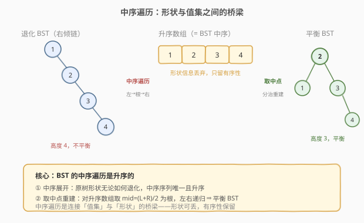
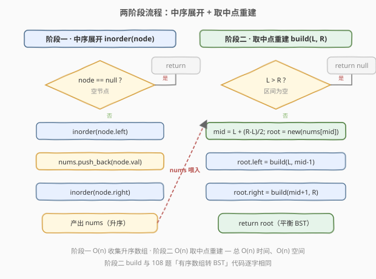

# LeetCode 将二叉搜索树变平衡 题解

## 1. 题目概述

- **标题 / 题号**：将二叉搜索树变平衡（#1382，medium）
- **链接**：https://leetcode.cn/problems/balance-a-binary-search-tree/
- **难度**：中等
- **标签**：树、BST、中序遍历、分治、平衡二叉树

**题意**：给你一棵二叉搜索树（BST）的根节点 `root`，请返回一棵**平衡**的二叉搜索树。新树应与原树具有**相同的节点值集合**，且满足：每个节点的左右两棵子树的高度差不超过 1。返回任意一种合法的平衡 BST 即可。

**示例 1**：

```text
输入：root = [1,null,2,null,3,null,4]
输出：[2,1,3,null,null,null,4]
解释：也可以是 [3,1,4,null,2] 等任意合法平衡 BST
```

原树是一条向右倾斜的链 `1 → 2 → 3 → 4`，高度 4；重平衡后高度降为 3，各节点子树高度差 ≤ 1。

**示例 2**：

```text
输入：root = [2,1,3]
输出：[2,1,3]
解释：已经平衡，原样返回即可
```

**约束**：

- 树中节点数目在范围 $[1,\, 10^4]$ 内
- $1 \le \text{Node.val} \le 10^5$

> 💡 本题的核心矛盾：给定的是一棵**形状可能退化**的 BST，要求在不改变节点值集合的前提下**重塑形状**。关键洞察是——**BST 的节点值集合一旦确定，中序遍历序列就唯一确定（升序）**，而任意一条升序序列都能用「取中点为根」的分治法构造出一棵平衡 BST。于是问题被拆成两步：**中序展开**（94 的本领）+ **有序数组重建**（108 的本领），中序遍历是连接两者的桥梁。

## 2. 解题思路

### 2.1 暴力思路：逐个旋转（AVL 自平衡）

最直觉的做法是套用 AVL 树的插入 + 旋转机制：把原树节点一个个拆下来重新插入一棵空 AVL 树，依靠 LL/RR/LR/RL 四种旋转维持平衡。

问题在于——

- **实现复杂**：需要手写 AVL 的旋转（左旋、右旋、左右双旋、右左双旋）+ 平衡因子维护，代码量大、易出错；
- **大材小用**：AVL 的逐个插入是为「**动态**插入场景」设计的，而本题所有节点一次性给定，完全可以直接整树重建，无需逐个平衡；
- **时间未必更优**：逐个插入每步 $O(\log n)$ 维护，总计 $O(n \log n)$，并非最优。

> ⚠️ 本题给的是**静态**节点集合（一次性全部已知），应当用「整体重建」而非「逐个插入 + 旋转」的动态自平衡思路。这是识别问题类型的要害。

### 2.2 核心观察：中序展开 + 取中点重建



解题钥匙来自 BST 的一个深层性质：

> **BST 的中序遍历是升序的。** 因此，无论原树形状如何（平衡或退化），只要节点值集合相同，中序遍历得到的**升序序列完全一致**。

这意味着原树的形状信息在「中序展开」这一步被**有意识地丢弃**——我们只保留值集的有序性，再用「取中点为根」的分治法重建一棵平衡 BST。整个过程分两阶段：

1. **中序展开**：对原树做一次中序遍历，把节点值收集到数组 `nums`。由于原树是 BST，`nums` 天然升序。$O(n)$
2. **取中点重建**：对升序数组 `nums` 套用 [108. 将有序数组转换为二叉搜索树](../0101-0200/108_将有序数组转换为二叉搜索树.md) 的分治方法——`build(L, R)` 取 `mid = (L+R)/2` 为根，左半递归建左子树，右半递归建右子树。$O(n)$

> 💡 为什么重建后仍是 BST？因为中序遍历的顺序与 `nums` 的顺序一致：左子树取 `nums[L..mid-1]`（均 `< nums[mid]`）、右子树取 `nums[mid+1..R]`（均 `> nums[mid]`），满足 BST 的左小右大性质。又因每次取中点，左右子树节点数最多差 1，递归后每层都平衡，故高度差 ≤ 1。

> ⚠️ 注意「**先新建节点**」与「**复用原节点**」两种实现：朴素做法直接 `new TreeNode(nums[mid])` 新建节点，丢弃原树（简单稳妥，推荐）；进阶可复用原树节点指针以省去 `new` 开销，但需要小心断开旧链接，面试默认写新建版。

### 2.3 算法流程图



**完整流程**：

**阶段一 · 中序展开** `inorder(node)`：

1. **基线**：`node == null` 直接返回；
2. **递归左**：`inorder(node.left)`；
3. **访问根**：`nums.push_back(node->val)`；
4. **递归右**：`inorder(node.right)`。

**阶段二 · 取中点重建** `build(L, R)`：

1. **基线**：`L > R` 返回 `null`（空子树）；
2. **取中点**：`mid = L + (R - L) / 2`（下中点，避免溢出）；
3. **建根**：`root = new TreeNode(nums[mid])`；
4. **递归左**：`root->left = build(L, mid - 1)`；
5. **递归右**：`root->right = build(mid + 1, R)`；
6. **返回** `root`。

> 💡 阶段二的 `build` 与 [108](../0101-0200/108_将有序数组转换为二叉搜索树.md) 的代码**逐字相同**——只要手里有一条升序序列，重建逻辑就不分来源（数组给定 / 链表转换 / BST 展开）。这种「中序序列 = 万能中间表示」的统一性，正是把三道题（94、108、1382）串成一族的关键。

### 2.4 示例演算

以 `root = [1,null,2,null,3,null,4]`（右倾链）为例：

![示例演算：右倾链 1→2→3→4 经中序展开得 [1,2,3,4]，取中点重建得平衡 BST](../images/1382_example_walkthrough.svg)

**阶段一 · 中序展开**：

原树形状（右倾链）：

```text
1
 \
  2
   \
    3
     \
      4
```

中序遍历（左 → 根 → 右）依次访问 `1, 2, 3, 4`，得到 `nums = [1, 2, 3, 4]`。

**阶段二 · 取中点重建**：

| 步骤 | 区间 `[L,R]` | `mid` | 根值 | 左子树区间 | 右子树区间 |
|------|-------------|-------|------|-----------|-----------|
| 1 | `[0,3]` | 1 | 2 | `[0,0]` | `[2,3]` |
| 2 | `[0,0]` | 0 | 1 | — | — |
| 3 | `[2,3]` | 2 | 3 | — | `[3,3]` |
| 4 | `[3,3]` | 3 | 4 | — | — |

重建后的平衡 BST（取下中点）：

```text
      2
     / \
    1   3
         \
          4
```

根 `2` 的左子树高度 1、右子树高度 2，差为 1；节点 `3` 的左右子树高度差也为 1。满足平衡。

> 💡 若取上中点 `mid = (L+R+1)/2`，则根为 `3`，得到 `[3,1,4,null,2]`——另一种合法答案。LeetCode 接受任意平衡 BST，故固定用下中点 `mid = L + (R-L)/2` 即可。

## 3. 参考代码

### C++

```cpp
/**
 * Definition for a binary tree node.
 * struct TreeNode { int val; TreeNode *left; TreeNode *right;
 *                  TreeNode(int x) : val(x), left(nullptr), right(nullptr) {} };
 */
class Solution {
  public:
    TreeNode* balanceBST(TreeNode* root) {
        vector<int> nums;
        inorder(root, nums);                       // 阶段一：中序展开得升序数组
        return build(nums, 0, (int)nums.size() - 1); // 阶段二：取中点重建
    }

  private:
    void inorder(TreeNode* node, vector<int>& nums) {
        if (!node) return;
        inorder(node->left, nums);
        nums.push_back(node->val);
        inorder(node->right, nums);
    }

    TreeNode* build(vector<int>& nums, int L, int R) {
        if (L > R) return nullptr;
        int mid = L + (R - L) / 2;                  // 下中点，避免溢出
        TreeNode* root = new TreeNode(nums[mid]);
        root->left  = build(nums, L, mid - 1);
        root->right = build(nums, mid + 1, R);
        return root;
    }
};
```

### Python

```python
class Solution:
    def balanceBST(self, root: Optional[TreeNode]) -> Optional[TreeNode]:
        nums: list[int] = []
        self._inorder(root, nums)                   # 阶段一：中序展开
        return self._build(nums, 0, len(nums) - 1)  # 阶段二：取中点重建

    def _inorder(self, node: Optional[TreeNode], nums: list[int]) -> None:
        if not node:
            return
        self._inorder(node.left, nums)
        nums.append(node.val)
        self._inorder(node.right, nums)

    def _build(self, nums: list[int], L: int, R: int) -> Optional[TreeNode]:
        if L > R:
            return None
        mid = (L + R) // 2                           # 下中点
        root = TreeNode(nums[mid])
        root.left = self._build(nums, L, mid - 1)
        root.right = self._build(nums, mid + 1, R)
        return root
```

> 💡 阶段二的 `_build` 与 [108](../0101-0200/108_将有序数组转换为二叉搜索树.md) 的 `sortedArrayToBST` 代码完全一致。若面试时被要求「复用原节点而非新建」，可把 `new TreeNode(nums[mid])` 换成从原树中序遍历时保存的节点列表里取 `nodes[mid]`，并置 `nodes[mid]->left = nodes[mid]->right = nullptr` 后再挂接。

## 4. 复杂度分析

| 维度 | 中序展开 + 取中点重建（推荐） | AVL 逐个旋转插入 |
|------|------------------------------|------------------|
| 时间复杂度 | $O(n)$ | $O(n \log n)$ |
| 空间复杂度 | $O(n)$ | $O(n)$ |
| 说明 | 中序遍历 $O(n)$ + 分治重建 $O(n)$；数组占 $O(n)$ | 每次插入 $O(\log n)$ 维护平衡，共 $n$ 次 |

> ⚠️ **空间说明**：$O(n)$ 中含两部分——升序数组 $O(n)$ + 递归栈 $O(\log n)$（重建树平衡，递归深度 $=$ 平衡树高度）。数组是主要开销。若追求 $O(1)$ 额外空间（不计递归栈），需用第 5 节的 DSW 原地旋转算法。

## 5. 扩展：DSW 原地旋转算法 —— O(1) 额外空间

中序展开 + 重建需要 $O(n)$ 数组空间。若面试官追问「能否 $O(1)$ 额外空间」，可用 **Day-Stout-Warren（DSW）算法**——通过两阶段原地旋转，把任意 BST 变平衡，全程只操作原树指针，不开数组。

**阶段一 · 拉成右倾链（vine）**：

从根开始，对每个有左孩子的节点做一次**右旋**（把左孩子提为新的子根），沿右脊逐节点处理，最终得到一条只有右孩子的链（类似链表）。设链长为 $n$。

**阶段二 · 折叠成平衡树**：

平衡 BST 的节点数满足 $n = 2^h - 1 + m$（$h$ 为满树高度，$m$ 为最后一层多出的节点）。先对链的前 $m$ 个节点各做一次**左旋**（把多余节点折到上一层），再对剩余链**每隔一个节点左旋**，共 $h - 1$ 轮，每轮把链长减半，最终得到高度为 $h$ 的平衡 BST。

```cpp
class Solution {
    void rotateRight(TreeNode* parent, TreeNode* node) {
        // 把 node 的左孩子 left 提为新子根
        TreeNode* left = node->left;
        node->left = left->right;
        left->right = node;
        if (parent) parent->right = left;
    }
    void rotateLeft(TreeNode* parent, TreeNode* node) {
        TreeNode* right = node->right;
        node->right = right->left;
        right->left = node;
        if (parent) parent->right = right;
    }
public:
    TreeNode* balanceBST(TreeNode* root) {
        TreeNode dummy(0, nullptr, root);
        // 阶段一：拉成右倾链
        TreeNode* cur = root;
        TreeNode* parent = &dummy;
        while (cur) {
            if (cur->left) {
                rotateRight(parent, cur);
                cur = parent->right;       // 新子根
            } else {
                parent = cur;
                cur = cur->right;
            }
        }
        // 阶段二：折叠成平衡树
        int n = 0;
        for (cur = dummy.right; cur; cur = cur->right) n++;
        int h = 0;
        while ((1 << (h + 1)) - 1 <= n) h++;      // 满树高度 h
        int m = n - ((1 << h) - 1);               // 最后一层多余节点数
        cur = dummy.right;
        parent = &dummy;
        for (int i = 0; i < m; i++) {              // 先折 m 个
            rotateLeft(parent, cur);
            parent = cur;
            cur = parent->right;
        }
        for (int k = (1 << h) - 1; k > 1; k >>= 1) { // 再折 h-1 轮
            cur = dummy.right;
            parent = &dummy;
            for (int i = 0; i < k / 2; i++) {
                rotateLeft(parent, cur);
                parent = cur;
                cur = parent->right;
            }
        }
        return dummy.right;
    }
};
```

> ⚠️ DSW 的优势是 $O(1)$ 额外空间（仅一个哑节点 + 若干临时指针），代价是旋转逻辑复杂、易写错。面试中**先讲清中序展开 + 重建**（$O(n)$ 时间 $O(n)$ 空间，主流解法），被追问空间再提 DSW。LeetCode 数据规模 $n \le 10^4$，$O(n)$ 空间完全够用，DSW 主要作为「理论最优」展示。

## 6. 面试要点

1. **为什么中序展开后重建一定能得到平衡 BST？**

   > 原树是 BST，中序遍历得到升序序列 `nums`。重建时取 `nums[mid]` 为根，左半 `nums[L..mid-1]` 均 `< nums[mid]`、右半 `nums[mid+1..R]` 均 `> nums[mid]`，满足 BST 性质。每次取中点使左右子树节点数最多差 1，递归后每层高度差 ≤ 1，故平衡。两性质同时成立，重建结果既是 BST 又平衡。

2. **为什么不用 AVL 的逐个旋转插入？**

   > AVL 旋转是为「动态插入」设计的——节点逐个到来、需要在线维护平衡。本题节点**一次性全部已知**（静态集合），用整体重建即可，无需逐个旋转。逐个插入每步 $O(\log n)$ 共 $O(n \log n)$，且需手写四种旋转，代码复杂；整体重建 $O(n)$ 时间、代码极简（中序 + 取中点两段递归），是静态场景的更优选择。识别「静态 vs 动态」是本题的破题眼。

3. **新建节点 vs 复用原节点，有何取舍？**

   > 新建节点（`new TreeNode(nums[mid])`）实现简单、不易出错，是面试默认写法；代价是原树节点被丢弃，多一倍内存（原树 + 新树并存，直到原树被 GC/析构）。复用原节点需在中序遍历时把节点指针也存入数组（`vector<TreeNode*>`），重建时取 `nodes[mid]` 并先置 `left = right = nullptr` 再挂接，可省去新建开销但需小心断开旧链接。LeetCode 判题不关心节点身份，两种均 AC。

4. **答案是否唯一？取上中点还是下中点？**

   > 不唯一。偶数长度区间取左中点 `mid = (L+R)/2` 或右中点 `mid = (L+R+1)/2` 会得到不同形状的平衡 BST，均合法。LeetCode 用「中序是否升序 + 是否平衡」校验，接受任意合法答案。固定用下中点 `mid = L + (R-L)/2` 即可稳定构造一种。

5. **DSW 算法相对中序重建的优势是什么？何时值得用？**

   > DSW 的核心优势是 $O(1)$ 额外空间（仅哑节点 + 临时指针），而中序重建需 $O(n)$ 数组。代价是 DSW 的旋转逻辑复杂、实现易错。当 $n$ 极大且内存受限（如嵌入式场景），DSW 有实际价值；普通面试与 LeetCode 判题中 $n \le 10^4$，$O(n)$ 空间无压力，DSW 主要作为「理论最优」展示分析深度。先讲清中序重建，被追问再提 DSW。

> 💡 **一句话总结**：1382 的解法是「**中序展开 + 取中点重建**」——中序遍历把任意形状的 BST 投影为唯一升序序列，再用 108 的分治法取中点重建平衡 BST。中序遍历是连接「值集」与「形状」的桥梁，本题把 94（中序）与 108（有序数组转 BST）两道题串成一族，是「中序序列 = BST 万能中间表示」的最佳示范。

## 同类练习题

| # | 题目 | 与本题的关联 |
|---|------|-------------|
| 108 | [将有序数组转换为二叉搜索树](https://leetcode.cn/problems/convert-sorted-array-to-binary-search-tree/)（[题解](../0101-0200/108_将有序数组转换为二叉搜索树.md)） | 本题阶段二的直接母题，取中点为根的分治重建模板，$O(n)$/$O(\log n)$ |
| 109 | [有序链表转换二叉搜索树](https://leetcode.cn/problems/convert-sorted-list-to-binary-search-tree/)（[题解](../0101-0200/109_有序链表转换二叉搜索树.md)） | 升序序列重建 BST 的链表变体，中序模拟 $O(n)$/$O(\log n)$，与 1382 共享「升序 = BST 中序」核心性质 |
| 94 | [二叉树的中序遍历](https://leetcode.cn/problems/binary-tree-inorder-traversal/)（[题解](../0001-0100/94_二叉树的中序遍历.md)） | 本题阶段一的母题，BST 中序升序的理论基础 |
| 110 | [平衡二叉树](https://leetcode.cn/problems/balanced-binary-tree/) | 判定一棵树是否平衡（只判不改），与 1382 的「构造平衡」互为表里，理解平衡定义 |
| — | [108/109/1382 三题串联](https://leetcode.cn/problems/balance-a-binary-search-tree/) | 三者共享「升序序列 ↔ BST 中序」的深层等价——108 从数组建、109 从链表建、1382 从退化 BST 重建，中序遍历是统一的中间表示 |
