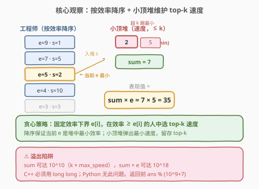
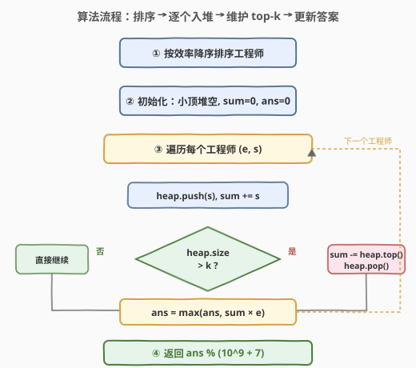
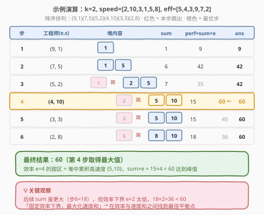

# LeetCode 最大的团队表现值 题解

## 1. 题目概述

- **标题 / 题号**：最大的团队表现值（#1383，hard）
- **链接**：https://leetcode.cn/problems/maximum-performance-of-a-team/
- **难度**：困难
- **标签**：贪心、堆、优先队列、排序

**题意**：给定 `n` 名工程师，第 `i` 名工程师的速度为 `speed[i]`、效率为 `efficiency[i]`。从中**最多选择 `k` 名**不同的工程师组成团队。**团队表现值** = 团队中所有工程师**速度之和** × 团队中**效率的最小值**。求最大团队表现值，结果对 $10^9 + 7$ 取余。

**示例 1**：

```text
输入：n = 6, speed = [2,10,3,1,5,8], efficiency = [5,4,3,9,7,2], k = 2
输出：60
解释：选工程师 2（speed=10, eff=4）和工程师 5（speed=5, eff=7），表现值 = (10+5) × min(4,7) = 60。
```

**示例 2**：

```text
输入：n = 6, speed = [2,10,3,1,5,8], efficiency = [5,4,3,9,7,2], k = 3
输出：68
解释：选工程师 1、2、5，表现值 = (2+10+5) × min(5,4,7) = 68。
```

**示例 3**：

```text
输入：n = 6, speed = [2,10,3,1,5,8], efficiency = [5,4,3,9,7,2], k = 4
输出：72
```

**约束**：

- $1 \leq k \leq n \leq 10^5$
- $1 \leq \text{speed}[i] \leq 10^5$
- $1 \leq \text{efficiency}[i] \leq 10^8$

> 💡 本题的难点在于「速度之和」与「效率最小值」两个目标相互牵制：选高效率的人可能速度低，选高速度的人可能拉低效率。突破口是**固定效率下界，最大化速度和**——这正是 [502. IPO](../0501-0600/502_IPO.md) 「排序 + 堆」模式的变体。

## 2. 解题思路

### 2.1 暴力思路：枚举所有组合

从 `n` 名工程师中选至多 `k` 名，枚举所有 $\sum_{i=1}^{k} \binom{n}{i}$ 种组合，对每种组合计算速度和 × 效率最小值。当 $n = 10^5, k = n$ 时组合数是天文数字，完全不可行。

> ⚠️ 暴力法的瓶颈在于「同时决定选谁和选几个」。但注意到一个关键结构：**团队表现值 = 速度和 × 效率最小值**——如果我们**固定效率最小值是谁**，问题就退化为「在效率 ≥ 该值的人中选至多 k 个使速度和最大」，这是一个可以用堆高效解决的问题。

### 2.2 核心观察：按效率降序 + 小顶堆维护 top-k 速度



关键洞察分两步：

1. **按效率降序排序工程师**。这样从左到右处理时，当前工程师的效率就是堆中所有工程师效率的**最小值**（因为前面的人效率都 ≥ 当前）。

2. **用小顶堆维护「已选工程师的速度」**，堆大小至多为 `k`。每加入一个新速度，若堆超过 `k` 个就弹出**最小的速度**——这样始终保留速度最大的 `k` 个，使速度和最大化。

> 💡 **为什么贪心正确？** 对于固定的效率下界 $e[i]$，我们想在所有效率 $\geq e[i]$ 的工程师中选至多 $k$ 个使速度和最大——这等价于取速度最大的 $k$ 个。按效率降序处理时，到第 $i$ 步堆中恰好包含效率 $\geq e[i]$ 的所有已见工程师，小顶堆弹出最小速度保证了留存的是 top-k 速度。因此 $\text{sum} \times e[i]$ 就是「以 $e[i]$ 为效率下界」的最优表现值，遍历所有 $i$ 取最大即可。

### 2.3 算法流程图



```text
1. 将 n 名工程师按效率降序排序
2. 初始化小顶堆 heap（空）、速度和 sum = 0、答案 ans = 0
3. 对每个工程师 (e, s)（按效率降序）：
   a. heap.push(s)，sum += s
   b. 若 heap.size > k：sum -= heap.pop()  ← 踢掉速度最小的
   c. ans = max(ans, sum * e)  ← e 是当前团队效率最小值
4. 返回 ans % (10^9 + 7)
```

> ⚠️ **溢出陷阱**：`sum` 可达 $k \times \max(\text{speed}) = 10^5 \times 10^5 = 10^{10}$，`sum * e` 可达 $10^{10} \times 10^8 = 10^{18}$，C++ 中必须用 `long long`，`int` 会溢出。Python 无此问题。

### 2.4 示例演算

以示例 1 为例（`k=2`），将工程师按效率降序排列为 $(e=9,s=1),\ (e=7,s=5),\ (e=5,s=2),\ (e=4,s=10),\ (e=3,s=3),\ (e=2,s=8)$：



| 步骤 | 工程师 (e, s) | 堆内容 | sum | perf = sum × e | ans |
|------|---------------|--------|-----|----------------|-----|
| 1 | (9, 1) | {1} | 1 | 9 | 9 |
| 2 | (7, 5) | {1, 5} | 6 | 42 | 42 |
| 3 | (5, 2) | {2, 5} ← 踢 1 | 7 | 35 | 42 |
| 4 | (4, 10) | {5, 10} ← 踢 2 | 15 | **60** | **60** |
| 5 | (3, 3) | {5, 10} ← 踢 3 | 15 | 45 | 60 |
| 6 | (2, 8) | {8, 10} ← 踢 5 | 18 | 36 | 60 |

- 第 4 步达到最优：选速度最大的两个 $\{5, 10\}$（效率 $\geq 4$），表现值 $15 \times 4 = 60$
- 后续虽然速度和更大（步骤 6 的 18），但效率下界 $e=2$ 太低，$18 \times 2 = 36 < 60$

> 💡 **关键转折在第 4 步**：效率 $e=4$ 处于「不太低」的甜区，且此时堆中累积了高速度的工程师 5（$s=5$）和工程师 2（$s=10$），速度和与效率的乘积达到峰值。这正是「固定效率下界，最大化速度和」策略的威力。

## 3. 参考代码

### C++

```cpp
class Solution {
  public:
    int maxPerformance(int n, vector<int>& speed, vector<int>& efficiency,
                       int k) {
        const int MOD = 1e9 + 7;
        vector<pair<int, int>> eng;
        for (int i = 0; i < n; i++)
            eng.push_back({efficiency[i], speed[i]});
        sort(eng.begin(), eng.end(),
             [](const auto& a, const auto& b) { return a.first > b.first; });

        priority_queue<int, vector<int>, greater<int>> heap;
        long long sum = 0, ans = 0;
        for (auto& [e, s] : eng) {
            heap.push(s);
            sum += s;
            if ((int)heap.size() > k) {
                sum -= heap.top();
                heap.pop();
            }
            ans = max(ans, sum * e);
        }
        return ans % MOD;
    }
};
```

### Python

```python
class Solution:
    def maxPerformance(self, n: int, speed: List[int],
                       efficiency: List[int], k: int) -> int:
        MOD = 10**9 + 7
        eng = sorted(zip(efficiency, speed), reverse=True)
        heap = []  # 小顶堆，存速度
        sum_speed = 0
        ans = 0
        for e, s in eng:
            heapq.heappush(heap, s)
            sum_speed += s
            if len(heap) > k:
                sum_speed -= heapq.heappop(heap)
            ans = max(ans, sum_speed * e)
        return ans % MOD
```

> ⚠️ C++ 中 `sum * e` 必须用 `long long`：`sum` 为 `long long` 时，`sum * e` 会自动提升为 `long long` 运算，不会溢出。若 `sum` 误声明为 `int`，$10^{10}$ 直接溢出。Python 整数无上限，无需担心。

> 💡 **堆方向对比**：本题用**小顶堆**弹出最小速度（保留 top-k 大），与 [502. IPO](../0501-0600/502_IPO.md) 用**大顶堆**弹出最大利润恰好相反——方向取决于「要保留什么」：保留大的用小顶堆踢小的，保留利润最大的用大顶堆直接取顶。

## 4. 复杂度分析

| 维度 | 复杂度 | 说明 |
|------|--------|------|
| 时间复杂度 | $O(n \log n + n \log k)$ | 排序 $O(n \log n)$；每个工程师入堆一次 $O(n \log k)$，至多弹出一次 $O(n \log k)$ |
| 空间复杂度 | $O(n + k)$ | 排序后的工程师数组 $O(n)$ + 堆 $O(k)$ |

> 💡 由于 $k \leq n$，时间复杂度上界 $O(n \log n)$，可安全处理 $n = 10^5$ 的数据规模。堆大小始终 $\leq k + 1$（加入后若超过才弹出），空间开销很小。

## 5. 扩展：贪心正确性的形式化论证

### 5.1 枚举效率下界的完备性

任何团队 $T$ 都有一个效率最小值 $e_{\min} = \min_{i \in T} \text{efficiency}[i]$，且这个最小值由团队中某个工程师 $j$ 贡献（$\text{efficiency}[j] = e_{\min}$）。当我们按效率降序处理到工程师 $j$ 时：

- 堆中包含所有已处理的工程师 $0, 1, \dots, j$（效率均 $\geq e[j]$）
- 小顶堆保证留存的是这些工程师中速度最大的 $k$ 个

因此 $\text{sum} \times e[j] \geq \text{speed\_sum}(T) \times e_{\min}$（我们的速度和 $\geq$ 任意以 $e[j]$ 为下界的团队的速度和）。遍历所有 $j$ 即覆盖所有可能的效率下界，保证不遗漏最优解。

### 5.2 小顶堆维护 top-k 的正确性

在处理第 $i$ 个工程师时，堆中应包含「效率 $\geq e[i]$ 的所有工程师中速度最大的 $k$ 个」。归纳证明：

- **基础**：$i=0$ 时堆中只有工程师 0，显然正确。
- **归纳**：假设第 $i-1$ 步堆中是 $[0, i-1]$ 中速度最大的 $k$ 个。第 $i$ 步加入 $s[i]$：
  - 若堆大小 $\leq k$，直接加入，堆中是 $[0, i]$ 中速度最大的 $\leq k$ 个 ✓
  - 若堆大小 $= k+1$，弹出最小的——弹出的必定是 $k+1$ 个中速度最小者，留存的是 top-k ✓

> ⚠️ 注意「最多选 $k$ 名」而非「恰好 $k$ 名」。当 $i < k$ 时堆中不足 $k$ 个，此时速度和虽小但效率可能很高（如示例步骤 1 的 $1 \times 9 = 9$），仍需参与比较——代码中 `ans = max(ans, sum * e)` 在每次加入后都更新，自然处理了这一点。

## 6. 面试要点

1. **为什么要按效率降序排序？**

   - 团队表现值 = 速度和 × 效率最小值。按效率降序处理后，当前工程师的效率就是堆中所有人的效率下界，无需额外求 min。排序把「求最小值」变成「已知量」，是整个贪心策略的基石。

2. **为什么用小顶堆而不是大顶堆？**

   - 我们要保留速度**最大**的 $k$ 个。小顶堆的堆顶是**最小**速度，超出 $k$ 个时弹出堆顶即踢掉最小、保留最大。若用大顶堆，堆顶是最大速度，弹出会踢掉我们想保留的高速度——方向错了。对比 [502. IPO](../0501-0600/502_IPO.md) 用大顶堆取最大利润，方向取决于「要保留什么」。

3. **`long long` 溢出在哪里容易踩坑？**

   - `sum` 可达 $10^{10}$（$k \times 10^5$），`sum * e` 可达 $10^{18}$（$10^{10} \times 10^8$），都超出 `int`（$\approx 2 \times 10^9$）但仍在 `long long`（$\approx 9 \times 10^{18}$）范围内。C++ 中 `sum` 必须声明为 `long long`，否则中间计算溢出。返回时 `ans % MOD` 再转回 `int` 范围。

4. **「最多 k 名」和「恰好 k 名」的区别如何体现？**

   - 「最多」意味着 $i < k$ 时（堆中不足 $k$ 个）也要计算表现值——此时效率可能很高，如示例步骤 1 的 $1 \times 9 = 9$。代码中每次加入后都 `ans = max(ans, sum * e)`，不等到堆满才更新。若题目改为「恰好 $k$ 名」，则只在 `heap.size() == k` 时更新答案。

5. **这题和 502 IPO 的异同？**

   - **同**：都是「排序建立单调性 + 堆高效选择」的贪心模式。502 按资本排序解锁项目、大顶堆取最大利润；1383 按效率排序确定下界、小顶堆保留 top-k 速度。
   - **异**：502 的堆维护「待选池」，每轮弹出最大加入资本；1383 的堆维护「已选集」，超限弹出最小。502 是「增量解锁 + 逐个选取」，1383 是「固定下界 + 批量维护」。

## 同类练习题

| # | 题目 | 与本题的关联 |
|---|------|-------------|
| 502 | [IPO](https://leetcode.cn/problems/ipo/)（[题解](../0501-0600/502_IPO.md)） | 贪心 + 堆的母题，排序解锁 + 大顶堆取最大，对比本题的小顶堆方向 |
| 857 | [雇佣 K 名工人的最低成本](https://leetcode.cn/problems/minimum-cost-to-hire-k-workers/)（[题解](../0801-0900/857_雇佣K名工人的最低成本.md)） | 与本题几乎同构——按效率降序 + 维护 top-k，只是求最小成本而非最大表现 |
| 630 | [课程表 III](https://leetcode.cn/problems/course-schedule-iii/)（[题解](../0601-0700/630_课程表III.md)） | 按截止时间排序 + 小顶堆弹出最长时长，同为「固定一个维度 + 堆维护另一维度」 |
| 253 | [会议室 II](https://leetcode.cn/problems/meeting-rooms-ii/)（[题解](../0201-0300/253_会议室II.md)） | 小顶堆维护正在进行的会议结束时间，巩固堆方向选择 |
