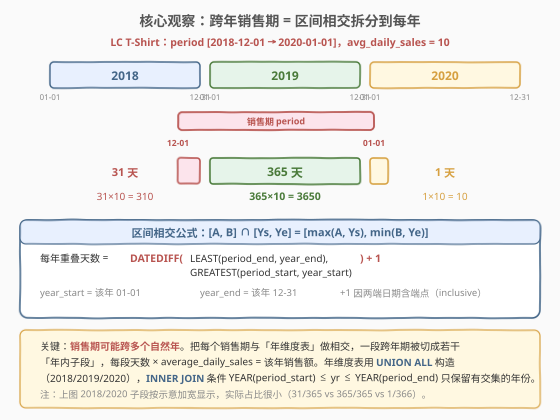
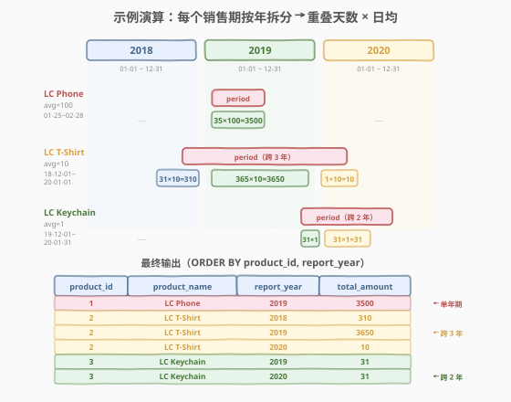

# 按年度列出销售总额

- **题目名称**：按年度列出销售总额
- **链接**：[1384. 按年度列出销售总额](https://leetcode.cn/problems/total-sales-amount-by-year/)
- **难度**：困难
- **标签**：数据库、SQL、区间相交、日期函数、维度表、DATEDIFF、LEAST/GREATEST

## 1. 题目概述

给定 `Product` 表与 `Sales` 表。`Sales` 每行记录某产品在一段**日期区间** `[period_start, period_end]`（含端点）内的**日均销售额** `average_daily_sales`。请编写 SQL，报告**每个产品在每个自然年的销售总额**。

> ⚠️ 关键陷阱：一段销售期可能**跨越多个自然年**。例如 `[2018-12-01, 2020-01-01]` 横跨 2018、2019、2020 三年，需要把它**按年切分**，分别算出每年内的天数，再乘以日均得到该年销售额。这是本题区别于「直接 `SUM + GROUP BY`」的核心难点。

**表结构**：

```text
Table: Product
+-------------+---------+
| Column Name | Type    |
+-------------+---------+
| product_id  | int     |  ← 主键
| product_name| varchar |  ← 产品名
+-------------+---------+

Table: Sales
+---------------------+---------+
| Column Name         | Type    |
+---------------------+---------+
| product_id          | int     |  ← 主键 / 外键
| period_start        | date    |  ← 销售期起始（含）
| period_end          | date    |  ← 销售期结束（含）
| average_daily_sales | int     |  ← 日均销售额
+---------------------+---------+
```

- `period_start` 与 `period_end` 均**含端点**（inclusive）。
- `average_daily_sales` 是该期间内**每天**的平均销售额。
- 题面限定销售年份在 **2018 到 2020** 之间。

**示例 1**：

```text
输入：
Product 表：
+------------+--------------+
| product_id | product_name |
+------------+--------------+
| 1          | LC Phone     |
| 2          | LC T-Shirt   |
| 3          | LC Keychain  |
+------------+--------------+
Sales 表：
+------------+--------------+-------------+---------------------+
| product_id | period_start | period_end  | average_daily_sales |
+------------+--------------+-------------+---------------------+
| 1          | 2019-01-25   | 2019-02-28  | 100                 |
| 2          | 2018-12-01   | 2020-01-01  | 10                  |
| 3          | 2019-12-01   | 2020-01-31  | 1                   |
+------------+--------------+-------------+---------------------+

输出：
+------------+--------------+-------------+--------------+
| product_id | product_name | report_year | total_amount |
+------------+--------------+-------------+--------------+
| 1          | LC Phone     |    2019     | 3500         |
| 2          | LC T-Shirt   |    2018     | 310          |
| 2          | LC T-Shirt   |    2019     | 3650         |
| 2          | LC T-Shirt   |    2020     | 10           |
| 3          | LC Keychain  |    2019     | 31           |
| 3          | LC Keychain  |    2020     | 31           |
+------------+--------------+-------------+--------------+
```

**解释**：

| 产品 | 销售期 | 拆分到每年 | 天数 | total = 天数 × 日均 |
|------|--------|-----------|------|---------------------|
| LC Phone | 2019-01-25 ~ 2019-02-28 | 2019（单年） | 35 | 35 × 100 = 3500 |
| LC T-Shirt | 2018-12-01 ~ 2020-01-01 | 2018 / 2019 / 2020 | 31 / 365 / 1 | 310 / 3650 / 10 |
| LC Keychain | 2019-12-01 ~ 2020-01-31 | 2019 / 2020 | 31 / 31 | 31 / 31 |

> 💡 LC Phone 全程落在 2019 年内，直接 35 × 100 = 3500；LC T-Shirt 横跨三年，需分别算出每年内的天数（31、365、1）；LC Keychain 跨两年（年末到次年初），各 31 天。本题的灵魂是「**区间相交**」——把一段跨年区间与每个自然年做交集，算出重叠天数。

**约束条件**：

- `Sales.product_id` 是 `Product.product_id` 的外键。
- 销售年份在 2018 到 2020 之间。
- 结果按 `product_id`、`report_year` 升序排列。
- 输出列：`product_id`、`product_name`、`report_year`、`total_amount`。

---

## 2. 解题思路

### 2.1 暴力思路：逐日展开

最直觉的做法：把每段销售期展开成**逐日记录**——为 `[period_start, period_end]` 中的每一天生成一行，每行带上 `average_daily_sales`，再按 `(product_id, YEAR(date))` 分组求和。

```sql
-- 伪代码：用递归 CTE 逐日展开（MySQL 8.0+ 支持 WITH RECURSIVE）
WITH RECURSIVE cal(d) AS (
    SELECT period_start FROM Sales
    UNION ALL
    SELECT d + INTERVAL 1 DAY FROM cal, Sales
    WHERE d < Sales.period_end   -- 关联条件写起来很别扭
)
SELECT product_id, YEAR(d), SUM(avg) ...
```

- **正确但低效**：`[2018-12-01, 2020-01-01]` 共 397 天，要生成 397 行；若期间更长，行数爆炸。逐日展开是 $O(\sum \text{天数})$ 的开销，且递归 CTE 关联原表写法繁琐。
- **没必要**：日均是常数，期间内**每一天贡献相同**，逐日展开再 SUM 等价于「天数 × 日均」。我们只需要算出**每年内的天数**，而非真的生成每一天。

> ⚠️ 暴力不是错，而是把「常数日均」这把钥匙闲置了。看到 `average_daily_sales` 是**区间内常数**，就该想到：销售额 = 天数 × 日均，问题归约为「**算出销售期与每个自然年的重叠天数**」。

### 2.2 核心观察：区间相交公式



**关键洞察**：销售期是一段闭区间 $[A, B]$（$A$=`period_start`，$B$=`period_end`），每个自然年也是一段闭区间 $[Y_s, Y_e]$（$Y_s$=该年 01-01，$Y_e$=该年 12-31）。两者的**交集**仍是一段闭区间：

$$
[A, B] \cap [Y_s, Y_e] = \big[\,\max(A, Y_s),\;\min(B, Y_e)\,\big]
$$

交集非空当且仅当 $\max(A, Y_s) \le \min(B, Y_e)$，等价于 $A \le Y_e \;\text{且}\; B \ge Y_s$，即 `YEAR(period_start) ≤ yr ≤ YEAR(period_end)`。

**重叠天数**（两端含端点，所以 +1）：

$$
\text{days} = \min(B, Y_e) - \max(A, Y_s) + 1
$$

对应 SQL：

```sql
DATEDIFF(
    LEAST(period_end,   year_end),    -- min(B, Ye)
    GREATEST(period_start, year_start) -- max(A, Ys)
) + 1
```

> 以 LC T-Shirt `[2018-12-01, 2020-01-01]`（日均 10）为例：
> - **2018**：$[\max(2018\text{-}12\text{-}01, 2018\text{-}01\text{-}01), \min(2020\text{-}01\text{-}01, 2018\text{-}12\text{-}31)] = [2018\text{-}12\text{-}01, 2018\text{-}12\text{-}31]$，31 天 → 310。
> - **2019**：$[\max(\dots, 2019\text{-}01\text{-}01), \min(\dots, 2019\text{-}12\text{-}31)] = [2019\text{-}01\text{-}01, 2019\text{-}12\text{-}31]$，365 天 → 3650。
> - **2020**：$[\max(\dots, 2020\text{-}01\text{-}01), \min(2020\text{-}01\text{-}01, 2020\text{-}12\text{-}31)] = [2020\text{-}01\text{-}01, 2020\text{-}01\text{-}01]$，1 天 → 10。

> ⚠️ **`+1` 不可省**。`DATEDIFF(end, start)` 算的是「两端日期差值」，如 `DATEDIFF('2019-02-28','2019-01-25') = 34`，但实际含端点共 35 天。闭区间天数 = 差值 + 1，与「左闭右闭」的端点语义一致。漏掉 `+1` 会导致每天少算一天。

### 2.3 算法流程图


**三步流水线**：

1. **构造年维度表** `years`：题面限定 2018–2020，用 `UNION ALL` 造 3 行（`yr` 列）。这是与销售期做相交的「另一侧区间」来源。
2. **相交 JOIN + 求重叠天数**：`Sales JOIN years ON YEAR(period_start) ≤ yr AND YEAR(period_end) ≥ yr`，只保留有交集的年份；一行跨年销售期会被复制成多行（每年一行）。再用 `DATEDIFF(LEAST(...), GREATEST(...)) + 1` 算出该年内的重叠天数。
3. **乘日均 + 输出**：`total_amount = average_daily_sales × days`，`JOIN Product` 取 `product_name`，按 `product_id, report_year` 排序输出。

> 💡 **为什么用 `UNION ALL` 而非查原表？** 年份范围是题面**给定常量**（2018–2020），不需要从 `Sales` 里 `DISTINCT YEAR(...)` 推导——直接 `UNION ALL` 三行更简洁、更可控。若年份范围不固定，可改为 `SELECT DISTINCT YEAR(period_start) ...` 配合递归补齐中间年份，但本题不需要。

### 2.4 示例演算

以示例 1 的 3 个产品为例，跟踪「区间相交 → 重叠天数 → 乘日均」全过程：



| 产品 | 日均 | 销售期 | 拆到年 | 相交区间 $[\max, \min]$ | 重叠天数 | total |
|------|------|--------|--------|------------------------|---------|-------|
| LC Phone | 100 | 2019-01-25 ~ 2019-02-28 | 2019 | [2019-01-25, 2019-02-28] | 35 | 3500 |
| LC T-Shirt | 10 | 2018-12-01 ~ 2020-01-01 | 2018 | [2018-12-01, 2018-12-31] | 31 | 310 |
| LC T-Shirt | 10 | | 2019 | [2019-01-01, 2019-12-31] | 365 | 3650 |
| LC T-Shirt | 10 | | 2020 | [2020-01-01, 2020-01-01] | 1 | 10 |
| LC Keychain | 1 | 2019-12-01 ~ 2020-01-31 | 2019 | [2019-12-01, 2019-12-31] | 31 | 31 |
| LC Keychain | 1 | | 2020 | [2020-01-01, 2020-01-31] | 31 | 31 |

**关键验证点**：

- LC Phone 全程在 2019 内 → $\max(A, Y_s) = A$，$\min(B, Y_e) = B$，重叠 = 整段 = 35 天。**单年期是跨年公式的退化情形**（交集就是自身）。
- LC T-Shirt 跨 3 年：2018 段被「右夹」到 12-31、2019 段被「双夹」成整年、2020 段被「左夹」到 01-01。三段天数之和 $31 + 365 + 1 = 397$，恰等于原区间总天数（`DATEDIFF('2020-01-01','2018-12-01') + 1 = 397`）✓。
- LC Keychain 跨 2 年：年末段和次年初段各 31 天，和 $62$ = `DATEDIFF('2020-01-31','2019-12-01') + 1 = 62` ✓。

> 💡 **守恒校验**：跨年拆分后各年天数之和必等于原区间总天数 `DATEDIFF(period_end, period_start) + 1`。这是验证拆分正确性的快捷方法——若和不守恒，说明相交公式或 `+1` 写错。

---

## 3. 参考代码

### MySQL（解法 A：`DATEDIFF` + `LEAST`/`GREATEST`，推荐）

```sql
# 1384. 按年度列出销售总额
# 思路：年维度表(2018-2020) INNER JOIN Sales(按 YEAR 范围相交) → DATEDIFF 算重叠天数 → 乘日均
WITH years AS (
    SELECT 2018 AS yr UNION ALL
    SELECT 2019      UNION ALL
    SELECT 2020
)
SELECT
    s.product_id,
    p.product_name,
    y.yr AS report_year,
    s.average_daily_sales * (
        DATEDIFF(
            LEAST(s.period_end,    DATE(CONCAT(y.yr, '-12-31'))),
            GREATEST(s.period_start, DATE(CONCAT(y.yr, '-01-01')))
        ) + 1
    ) AS total_amount
FROM Sales s
JOIN years y
  ON YEAR(s.period_start) <= y.yr AND YEAR(s.period_end) >= y.yr
JOIN Product p
  ON p.product_id = s.product_id
ORDER BY s.product_id, y.yr;
```

> 💡 **写法要点**：
> - **`years`**：用 `UNION ALL` 构造 3 行年维度表（题面限定 2018–2020），是相交的「年区间」来源。
> - **`JOIN ... ON YEAR(ps) ≤ yr AND YEAR(pe) ≥ yr`**：相交条件，只保留与销售期有交集的年份。一行跨年销售期在此被复制成多行（每年一行）。
> - **`DATE(CONCAT(y.yr, '-01-01'))` / `'-12-31'`**：动态拼出该年的起止日期。`CONCAT` 把整数年份转字符串，`DATE()` 解析为 `DATE` 类型。也可用 `MAKEDATE(y.yr, 1)` 起始、`MAKEDATE(y.yr+1,1) - INTERVAL 1 DAY` 结束，但 `CONCAT` 写法最直观。
> - **`LEAST` / `GREATEST`**：分别取 $\min(B, Y_e)$ 与 $\max(A, Y_s)$，即交集的两端。
> - **`DATEDIFF(...) + 1`**：闭区间天数 = 端点差值 + 1。`+1` 不可省。
> - 需 MySQL 5.7+（`DATEDIFF`/`LEAST`/`GREATEST` 均老版本即支持，无需窗口函数）。

### MySQL（解法 B：`DAYOFYEAR` 法，不拼日期）

```sql
SELECT
    s.product_id,
    p.product_name,
    y.yr AS report_year,
    s.average_daily_sales * (
        IF(YEAR(s.period_end) > y.yr, y.days_of_year, DAYOFYEAR(s.period_end))
        - IF(YEAR(s.period_start) < y.yr, 1, DAYOFYEAR(s.period_start))
        + 1
    ) AS total_amount
FROM Sales s
JOIN (
    SELECT 2018 AS yr, 365 AS days_of_year UNION ALL
    SELECT 2019, 365      UNION ALL
    SELECT 2020, 366
) y ON YEAR(s.period_start) <= y.yr AND YEAR(s.period_end) >= y.yr
JOIN Product p ON p.product_id = s.product_id
ORDER BY s.product_id, y.yr;
```

> 💡 **`DAYOFYEAR` 法的思路**：不显式拼出年边界日期，而是用「**年内第几天**」定位。
> - **结束位**：若销售期在本年之后才结束（`YEAR(pe) > yr`），则本年一直卖到 12-31，取 `days_of_year`（365/366）；否则取 `DAYOFYEAR(period_end)`（period_end 在本年内的第几天）。
> - **起始位**：若销售期在本年之前就开始（`YEAR(ps) < yr`），则本年从 01-01 卖起，取 1；否则取 `DAYOFYEAR(period_start)`。
> - **天数 = 结束位 − 起始位 + 1**。
>
> ⚠️ 此法需**手动维护 `days_of_year`**（闰年 366、平年 365）。2020 是闰年填 366，2018/2019 填 365——填错任一个都会算错跨到该年「整年」的段。解法 A 的 `DATEDIFF` 用真实日期做差，**闰年自动正确**，无需维护天数表，这是推荐解法 A 的核心理由。

### Python（pandas）

```python
import pandas as pd

def total_sales(product: pd.DataFrame, sales: pd.DataFrame) -> pd.DataFrame:
    rows = []
    for _, r in sales.iterrows():
        ps, pe = pd.Timestamp(r['period_start']), pd.Timestamp(r['period_end'])
        for yr in range(ps.year, pe.year + 1):           # 遍历销售期覆盖到的每个自然年
            ys = pd.Timestamp(f'{yr}-01-01')
            ye = pd.Timestamp(f'{yr}-12-31')
            days = (min(pe, ye) - max(ps, ys)).days + 1   # 区间相交天数（含端点）
            rows.append((r['product_id'], yr, r['average_daily_sales'] * days))
    df = pd.DataFrame(rows, columns=['product_id', 'report_year', 'total_amount'])
    df = df.merge(product, on='product_id', how='left')
    df = df[['product_id', 'product_name', 'report_year', 'total_amount']]
    return df.sort_values(['product_id', 'report_year']).reset_index(drop=True)
```

> 💡 **pandas 对照**：
> - `range(ps.year, pe.year + 1)` 对应 `JOIN years ON YEAR(ps) ≤ yr ≤ YEAR(pe)`——只遍历有交集的年份。
> - `min(pe, ye) - max(ps, ys))` 对应 `LEAST/GREATEST + DATEDIFF`；`.days` 取天数差，`+1` 含端点。
> - `merge(product, how='left')` 对应 `JOIN Product` 补 `product_name`。
> - 逻辑与 SQL 解法 A 完全同构，是「区间相交公式」的 pandas 翻译。

---

## 4. 复杂度分析

| 维度 | 解法 A（DATEDIFF+LEAST/GREATEST） | 解法 B（DAYOFYEAR） | 暴力逐日展开 |
|------|----------------------------------|---------------------|-------------|
| **时间** | $O(n \cdot k)$ | $O(n \cdot k)$ | $O(\sum \text{天数})$ |
| **空间** | $O(1)$（years 常数 3 行） | $O(1)$ | $O(\sum \text{天数})$ |
| **闰年处理** | 自动正确（真实日期做差） | 需手填 days_of_year | 自动正确 |
| **推荐度** | ✓ **首选** | △ 旧习惯写法 | ✗ 行数爆炸 |

> - $n$ = `Sales` 表行数，$k$ = 年维度表行数（本题 $k = 3$）。
> - **解法 A/B**：每行销售期 JOIN 后最多裂变为 $k$ 行（跨 $k$ 年），总行数 $O(n \cdot k)$。每行做 $O(1)$ 的日期运算，总时间 $O(n \cdot k)$。`years` 表固定 3 行，空间 $O(1)$。
> - **暴力逐日展开**：`[2018-12-01, 2020-01-01]` 有 397 天，生成 397 行；期间越长行数越多，最坏 $O(\text{天数})$，且递归 CTE 关联原表写法繁琐、性能差。
> - **索引优化**：在 `Sales(period_start, period_end)` 上建索引可加速 `YEAR()` 范围筛选；`Product.product_id` 主键索引加速 JOIN。但本题数据规模小（示例级），索引收益有限。

> ⚠️ 本题数据量小（3 行销售记录），任何正确写法都能过。但「区间相交」思路的价值在于**可扩展性**：若销售期长达数年、记录上万行，逐日展开会爆炸，而相交公式仍是 $O(n \cdot k)$。

---

## 5. 扩展：区间相交公式 vs DAYOFYEAR 法

两种解法本质等价（都算「年内重叠天数」），但实现视角不同：

| 维度 | 区间相交法（解法 A） | DAYOFYEAR 法（解法 B） |
|------|---------------------|----------------------|
| **核心算子** | `DATEDIFF(LEAST(...), GREATEST(...)) + 1` | `IF(... days_of_year, DAYOFYEAR(...)) - IF(... 1, DAYOFYEAR(...)) + 1` |
| **视角** | 闭区间求交 $[\max, \min]$，再做差 | 年内「第几天」定位起止位，做差 |
| **年边界** | `DATE(CONCAT(yr,'-01-01'/'-12-31'))` 动态拼 | 隐含在 `DAYOFYEAR` 与 `days_of_year` 中 |
| **闰年** | 自动正确（用真实日期） | 需手填 `days_of_year`（366/365），填错即错 |
| **可读性** | 公式直观，对应数学定义 | 分支较多，需脑补「年内序号」语义 |
| **通用性** | 适用于任意区间相交问题 | 仅适用于「按自然年切分」场景 |

> 💡 **何时用 DAYOFYEAR 法？** 若数据库不支持 `LEAST`/`GREATEST`（如部分老版 SQLite），或题目已给出每年天数，DAYOFYEAR 是合理替代。但 MySQL/PG 中 `LEAST`/`GREATEST` 是标准函数，解法 A 更简洁、更不易错（闰年自动处理），面试首选。

### 区间相交的泛化模板

「一段区间与一组等长窗口求交」是通用模式，不限于「销售期 × 自然年」：

```sql
-- 泛化模板：区间 [A, B] 与窗口维度表 [ws, we] 求交
WITH windows AS (  -- 窗口维度表（如：每年、每月、每季度）
    SELECT <w_id> AS wid, <w_start> AS ws, <w_end> AS we FROM ...
)
SELECT t.*, w.wid,
       DATEDIFF(LEAST(t.B, w.we), GREATEST(t.A, w.ws)) + 1 AS overlap_days
FROM <fact> t
JOIN windows w
  ON t.A <= w.we AND t.B >= w.ws        -- 相交条件（闭区间）
ORDER BY t.id, w.wid;
```

常见变体：

| 场景 | 区间 A/B | 窗口 ws/we | 重叠语义 |
|------|---------|-----------|---------|
| 销售期 × 年（本题） | period_start/end | 01-01 / 12-31 | 年内销售天数 |
| 请假区间 × 月 | leave_start/end | 月初 / 月末 | 月内请假天数 |
| 订阅期 × 季度 | sub_start/end | 季初 / 季末 | 季度内订阅天数 |
| 会议时段 × 日 | meeting_start/end | 00:00 / 23:59 | 当日会议时长 |

---

## 6. 面试要点

1. **为什么不能直接 `SUM + GROUP BY YEAR`？**

   > 因为一段销售期可能跨年。`[2018-12-01, 2020-01-01]` 横跨三年，若直接按 `YEAR(period_start)` 或 `YEAR(period_end)` 分组，整段只会算进**一个**年，另外两年被漏掉。必须先把跨年区间**按年切分**，让每年各得一行，再算该年内的天数。

2. **如何算出销售期在某一年内的天数？**

   > 用**区间相交公式**：销售期 $[A, B]$ 与自然年 $[Y_s, Y_e]$ 的交集是 $[\max(A, Y_s), \min(B, Y_e)]$，重叠天数 = `DATEDIFF(min(B,Ye), max(A,Ys)) + 1`。SQL 写作 `DATEDIFF(LEAST(period_end, year_end), GREATEST(period_start, year_start)) + 1`。`+1` 因为两端含端点。

3. **JOIN 条件 `YEAR(period_start) ≤ yr AND YEAR(period_end) ≥ yr` 的含义？**

   > 这是「区间相交」的判定条件。$[A, B]$ 与 $[Y_s, Y_e]$ 相交当且仅当 $A \le Y_e$ 且 $B \ge Y_s$。由于 $Y_s$、$Y_e$ 同属一年 `yr`，条件等价于 `YEAR(A) ≤ yr ≤ YEAR(B)`。满足此条件的年份才保留，跨年销售期在此裂变为多行。

4. **`DATEDIFF` 后为什么要 `+ 1`？**

   > `DATEDIFF(end, start)` 返回的是两端日期的**差值**（不含端点本身）。如 `DATEDIFF('2019-02-28','2019-01-25') = 34`，但闭区间 `[01-25, 02-28]` 含端点共 35 天。闭区间天数 = 差值 + 1。漏掉 `+1` 会让每年少算一天的销售额。

5. **解法 A 的 `DATE(CONCAT(y.yr, '-12-31'))` 为什么能正确处理闰年？**

   > 因为它直接拼出该年 12-31 这个**真实日期**，`DATEDIFF` 对真实日期做差，2 月有 28/29 天已被日期本身编码。而解法 B 的 `DAYOFYEAR` 法依赖手填的 `days_of_year`（闰年 366），2020 填成 365 就会算错「跨满 2020 整年」的段。这是推荐解法 A 的核心理由。

6. **如何快速验证拆分正确？**

   > **守恒校验**：跨年拆分后各年天数之和必等于原区间总天数 `DATEDIFF(period_end, period_start) + 1`。如 LC T-Shirt 拆出 $31 + 365 + 1 = 397$，而 `DATEDIFF('2020-01-01','2018-12-01') + 1 = 397` ✓。和不守恒说明公式或 `+1` 写错。

> 💡 **一句话总结**：1384 是 SQL **「区间相交」招牌题**——核心难点不在聚合，而在意识到「销售期跨年」需要切分。解法三步：`UNION ALL` 造年维度表 → `JOIN` 按 `YEAR` 范围相交（一行裂变为多年多行）→ `DATEDIFF(LEAST, GREATEST)+1` 算重叠天数 × 日均。公式 $\text{days} = \min(B, Y_e) - \max(A, Y_s) + 1$ 是所有「区间 × 窗口求交」问题的通用钥匙。

---

## 7. 同类练习题

- [1174. 即时食物配送 II](https://leetcode.cn/problems/immediate-food-delivery-ii/)（[题解](../1101-1200/1174_即时食物配送II.md)）：`GROUP BY + MIN` 两步聚合，对照「分组收缩」与本题「JOIN 裂变」相反方向
- [1308. 不同性别每日分数总计](https://leetcode.cn/problems/running-total-for-different-genders/)（[题解](../1301-1400/1308_不同性别每日分数总计.md)）：`CROSS JOIN` 补齐 (性别×日期) 网格 + 窗口累计，同为「构造维度表 + JOIN」范式，对照「补缺失行」与本题「裂变跨年行」
- [1327. 列出指定时间段内所有的下单产品](https://leetcode.cn/problems/list-the-products-ordered-in-a-period/)（[题解](../1301-1400/1327_列出指定时间段内所有的下单产品.md)）：按时间段过滤 + 聚合，日期范围筛选的简单版，承接「日期区间」语义
- [1454. 活跃用户](https://leetcode.cn/problems/active-users/)：日期窗口内活跃判定，涉及「区间/窗口内计数」的另一种视角
- [56. 合并区间](https://leetcode.cn/problems/merge-intervals/)（[题解](../0001-0100/56_合并区间.md)）：算法侧的区间合并招牌题，与本题「区间相交」互为对偶——合并把多段融一段，相交把一段切多段
