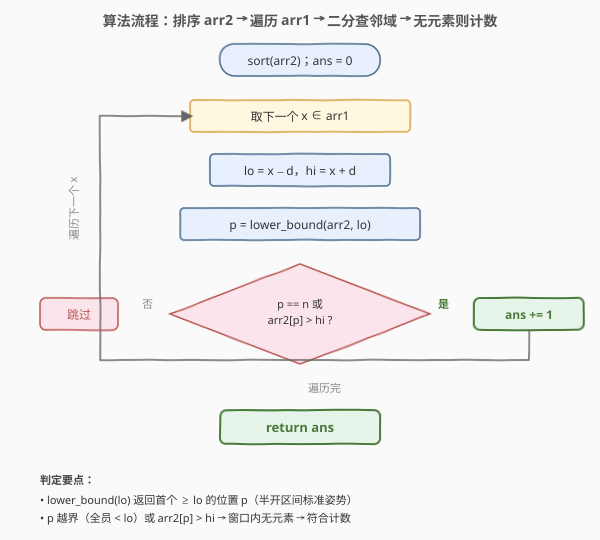

# LeetCode 两个数组间的距离值 题解

## 1. 题目概述

- **标题 / 题号**：两个数组间的距离值（#1385，easy）
- **链接**：https://leetcode.cn/problems/find-the-distance-value-between-two-arrays/
- **难度**：简单
- **标签**：数组、二分查找、排序

**题意**：给你两个整数数组 `arr1`、`arr2` 和一个整数 `d`，返回两个数组之间的**距离值**。

「距离值」定义为符合下列距离要求的元素数目：对于元素 `arr1[i]`，**不存在**任何元素 `arr2[j]` 满足 $|arr1[i] - arr2[j]| \le d$。

换言之，`arr1[i]` 算入距离值当且仅当它到 `arr2` 中**每一个**元素的距离都严格大于 $d$。

**示例 1**：

```text
输入：arr1 = [4,5,8], arr2 = [10,9,1,8], d = 2
输出：2
解释：
arr1[0]=4：|4-10|=6、|4-9|=5、|4-1|=3、|4-8|=4，全部 > 2 → 符合
arr1[1]=5：|5-10|=5、|5-9|=4、|5-1|=4、|5-8|=3，全部 > 2 → 符合
arr1[2]=8：|8-10|=2 ≤ 2 → 存在近邻，不符合
故距离值为 2。
```

**示例 2**：

```text
输入：arr1 = [1,4,2,3], arr2 = [-4,-3,6,10,20,30], d = 3
输出：2
```

**示例 3**：

```text
输入：arr1 = [2,1,100,3], arr2 = [-5,-2,10,-3,7], d = 6
输出：1
```

**约束**：

- $1 \le arr1.length, arr2.length \le 500$
- $-10^3 \le arr1[i], arr2[j] \le 10^3$
- $0 \le d \le 100$

> 💡 本题的灵魂是「**判定 arr1[i] 的邻域 $[arr1[i]-d,\ arr1[i]+d]$ 内是否藏有 arr2 的元素**」。暴力做法对每个 `arr1[i]` 线性扫一遍 `arr2`，$O(mn)$；一旦把 `arr2` 排序，邻域查询就退化成一次二分——找首个 $\ge arr1[i]-d$ 的元素，再看它是否 $\le arr1[i]+d$，单次查询 $O(\log n)$，总复杂度降到 $O(n \log n + m \log n)$。

## 2. 解题思路

### 2.1 暴力思路：双层循环逐对比较

最直白的做法：对每个 `arr1[i]`，遍历整个 `arr2` 逐个算 $|arr1[i] - arr2[j]|$，一旦发现某项 $\le d$ 就判定 `arr1[i]` 不符合、跳出；若整趟都没找到近邻则计数加一。

```text
ans = 0
for x in arr1:
    ok = True
    for y in arr2:
        if abs(x - y) <= d:
            ok = False
            break
    if ok: ans += 1
return ans
```

- **正确但低效**：时间 $O(mn)$。$m, n \le 500$ 时约 $2.5 \times 10^5$ 次比较，能过但没利用 `arr2` 的任何结构。
- **重复劳动**：对每个 `arr1[i]`，都在无序的 `arr2` 上做了一遍「邻域存在性」查询——而这正是排序 + 二分能优化到 $O(\log n)$ 的典型场景。

> ⚠️ 暴力不是错，数据规模小到能过。但「判定某值是否落入给定区间」是二分查找的招牌应用：把 `arr2` 排序后，邻域 $[x-d, x+d]$ 内是否有元素，只需一次 `lower_bound` 即可回答。

### 2.2 核心观察：排序 arr2 + 区间二分查找

![核心观察：在有序 arr2 上判断邻域 [x-d, x+d] 是否落入元素](../images/1385_concept.svg)

**关键转化**：把「$arr1[i]$ 到所有 $arr2[j]$ 的距离都 $> d$」改写为等价的「$arr2$ 中没有任何元素落在区间 $[arr1[i]-d,\ arr1[i]+d]$ 内」。

$$|arr1[i] - arr2[j]| \le d \iff arr2[j] \in [arr1[i]-d,\ arr1[i]+d]$$

于是「`arr1[i]` 符合」$\iff$「区间 $[arr1[i]-d,\ arr1[i]+d]$ 与 `arr2` 无交集」。

**在有序数组上判定区间是否含元素**只需两步：

1. 用 `lower_bound` 找到 `arr2` 中**首个** $\ge arr1[i] - d$ 的元素，设其下标为 `p`；
2. 若 `p` 越界（即所有元素都 $< arr1[i]-d$），或 `arr2[p] > arr1[i] + d`（首个不小于左界的元素已经超过右界），则区间内**无** arr2 元素 → `arr1[i]` 符合；否则不符合。

> 💡 **为什么只需看「首个 $\ge$ 左界」这一个元素？** 因为 `arr2` 已排序，首个 $\ge arr1[i]-d$ 的元素是「最有可能落入区间」的候选——它若都 $> arr1[i]+d$，则它后面更大的元素更不可能落入；它若 $\le arr1[i]+d$，则区间内至少有它一个，`arr1[i]` 即不符合。一个元素一锤定音，无需再看其他。

以示例 1 为例：`arr2` 排序后为 `[1, 8, 9, 10]`，$d=2$。
- `arr1[0]=4`，区间 $[2, 6]$：`lower_bound(2)` 命中 `8`，而 $8 > 6$ → 区间空 → 符合。
- `arr1[2]=8`，区间 $[6, 10]$：`lower_bound(6)` 命中 `8`，而 $8 \le 10$ → 区间内有 `8` → 不符合。

> ⚠️ **别把判定条件写反**：是「区间内**无**元素 → 符合 → 计数」，不是「有元素 → 符合」。题目问的是「距离值」（远离 arr2 的元素个数），与「最近距离 $\le d$ 的元素个数」互补但方向相反。初学者容易把 `<=` 与 `>`、计数与跳过搞混——记住「**无近邻才算**」即可。

### 2.3 算法流程图



**完整步骤**：

1. **排序** `arr2`，升序；
2. **遍历** `arr1` 中每个 `x`：
   - 算邻域左右界 $lo = x - d$、$hi = x + d$；
   - 在 `arr2` 上 `lower_bound(lo)`，得下标 `p`；
   - 若 `p == n`（全员 $< lo$）或 `arr2[p] > hi` → 区间内无 arr2 元素 → `ans += 1`；
3. **返回** `ans`。

> 💡 `lower_bound` 返回「首个 $\ge lo$ 的位置」，它是半开区间 `[arr2.begin(), arr2.begin()+p)` 之外的第一人——也即「从左向右第一个可能进入 $[lo, hi]$ 窗口的候选」。这正是二分判定区间存在性的标准姿势，与 [35. 搜索插入位置](../0001-0100/35_搜索插入位置.md) 同源。

### 2.4 示例演算

以示例 1 `arr1 = [4,5,8]`、`arr2 = [10,9,1,8]`、$d = 2$ 为例，`arr2` 排序后为 `[1, 8, 9, 10]`：

![示例演算：arr1=[4,5,8] 逐元素判定邻域 [x-2, x+2] 是否落入 arr2](../images/1385_example_walkthrough.svg)

| 步 | `x = arr1[i]` | 邻域 $[x-d, x+d]$ | `lower_bound(x-d)` 命中 | 命中值 $\le x+d$? | 符合? |
|----|---------------|-------------------|------------------------|-------------------|-------|
| 1 | 4 | $[2, 6]$ | `8`（首个 $\ge 2$） | $8 \le 6$? ✗ | ✓ 计数 |
| 2 | 5 | $[3, 7]$ | `8`（首个 $\ge 3$） | $8 \le 7$? ✗ | ✓ 计数 |
| 3 | 8 | $[6, 10]$ | `8`（首个 $\ge 6$） | $8 \le 10$? ✓ | ✗ 跳过 |

- 步 1：窗口 $[2,6]$ 落在 `1` 与 `8` 之间的空隙里，`8` 已越过右界 → 无近邻 → `ans = 1`。
- 步 2：窗口 $[3,7]$ 同样夹在空隙中 → `ans = 2`。
- 步 3：窗口 $[6,10]$ 恰好罩住 `8`（也罩住 `9`、`10`），首个候选 `8` 已落入 → 有近邻 → 跳过。

最终 `ans = 2`，与示例输出一致。

> 💡 注意步 3 中 `lower_bound(6)` 命中的是 `8` 而非 `9`、`10`——但只要**任一** arr2 元素落入窗口即判定不符合，所以只需看这一个候选。命中 `8` 足以一锤定音，无需关心窗口里还有几个。

## 3. 参考代码

### C++

```cpp
// 两个数组间的距离值.cpp —— 排序 arr2 + 二分查邻域，O(n log n + m log n)
// 编译: g++ -O2 -std=c++17 两个数组间的距离值.cpp -o distval
#include <vector>
#include <algorithm>
using namespace std;

class Solution {
public:
    int findTheDistanceValue(vector<int>& arr1, vector<int>& arr2, int d) {
        sort(arr2.begin(), arr2.end());           // 升序，便于二分
        int ans = 0;
        for (int x : arr1) {
            int lo = x - d, hi = x + d;           // 邻域 [lo, hi]
            // 首个 >= lo 的位置
            auto it = lower_bound(arr2.begin(), arr2.end(), lo);
            // 越界 或 首个候选已 > hi → 区间内无 arr2 元素 → 符合
            if (it == arr2.end() || *it > hi) ++ans;
        }
        return ans;
    }
};
```

### Python

```python
import bisect

class Solution:
    def findTheDistanceValue(self, arr1: list[int], arr2: list[int], d: int) -> int:
        arr2.sort()                              # 升序
        ans = 0
        for x in arr1:
            lo, hi = x - d, x + d                # 邻域 [lo, hi]
            p = bisect.bisect_left(arr2, lo)     # 首个 >= lo 的下标
            if p == len(arr2) or arr2[p] > hi:   # 越界 或 首个候选 > hi
                ans += 1                         # 区间内无 arr2 元素 → 符合
        return ans
```

> 💡 两版等价，核心是「**排序 arr2 → 对每个 arr1[i] 用 lower_bound 找邻域首个候选 → 一个比较定存亡**」。Python 用 `bisect.bisect_left`，C++ 用 `std::lower_bound`，二者语义完全一致：返回首个 $\ge lo$ 的位置。

> ⚠️ **短路写法对比**：暴力版内层用 `break` 短路——发现一个近邻即跳过；二分版则「一次比较定存亡」，无显式短路但天然 $O(\log n)$。当 $n$ 较大时，二分版即便最坏也比暴力的平均情况快。

## 4. 复杂度分析

| 维度 | 排序+二分 $O(n \log n + m \log n)$（推荐） | 暴力 $O(mn)$ |
|------|------------------------------------------|--------------|
| 时间复杂度 | $O(n \log n + m \log n)$ | $O(mn)$ |
| 空间复杂度 | $O(\log n)$（排序栈空间） | $O(1)$ |
| 实际运算量 | $m=n=500$ 约 $500 \times 9 + 500 \times 9 \approx 9000$ | 约 $2.5 \times 10^5$ |

- **排序+二分**：排序 `arr2` 一次 $O(n \log n)$；每个 `arr1[i]` 一次二分 $O(\log n)$，共 $m$ 次。$m, n \le 500$ 时约 $500 \times 9 = 4500$ 次比较，远低于暴力的 $2.5 \times 10^5$。空间为排序的递归栈 $O(\log n)$（若用堆排可压到 $O(1)$）。
- **暴力**：$O(mn)$，数据小能过，但不体现对「邻域查询」结构的利用。

> ⚠️ 本题 $m, n \le 500$ 极小，两种方法都毫秒级通过。面试中写出排序+二分版即可展现「把无序查询优化为有序二分」的意识；暴力版可作为引出思路的铺垫。

## 5. 扩展：排序双数组 + 归并式双指针

若进一步把 `arr1` 也排序，邻域查询可从「每个 `x` 独立二分」升级为「双指针单调推进」，把 $m$ 次二分 $O(m \log n)$ 压成 $O(m + n)$。

**思路**：`arr1`、`arr2` 均升序后，随着 `x = arr1[i]` 递增，邻域左界 $x - d$ 也单调递增。维护指针 `j` 指向 `arr2` 中首个 $\ge arr1[i] - d$ 的元素——`j` 只前进不回退。再判 `arr2[j] <= arr1[i] + d` 即可。

```cpp
class Solution {
public:
    int findTheDistanceValue(vector<int>& arr1, vector<int>& arr2, int d) {
        sort(arr1.begin(), arr1.end());
        sort(arr2.begin(), arr2.end());
        int ans = 0, j = 0, n = arr2.size();
        for (int x : arr1) {
            int lo = x - d, hi = x + d;
            while (j < n && arr2[j] < lo) ++j;   // 单调推进到首个 >= lo
            if (j == n || arr2[j] > hi) ++ans;   // 越界 或 首个候选 > hi → 符合
        }
        return ans;
    }
};
```

**注意**：`arr1` 排序后丢失原顺序，但本题只**计数**不保序，故无影响。若题目改为返回符合条件的原始 `arr1[i]`，则不能排序 `arr1`，应回到「只排序 `arr2` + 二分」的主解。

**三种解法对比**：

| 解法 | 时间 | 空间 | 适用场景 |
|------|------|------|----------|
| 排序 arr2 + 二分 | $O(n \log n + m \log n)$ | $O(\log n)$ | 通用首选，无需排 arr1 |
| 排序双数组 + 双指针 | $O(m \log m + n \log n)$ | $O(\log m + \log n)$ | $m, n$ 均大时最优，查询线性摊还 |
| 暴力双层循环 | $O(mn)$ | $O(1)$ | 数据极小、追求代码最短 |

> 💡 **如何选择？** 数据小选暴力求快；通用选「排序 arr2 + 二分」最简洁；$m, n$ 均大且需极致优化选双指针。三者的本质都是「**邻域存在性查询**」——排序是把无序查询升级为二分/双指针的通用钥匙，与 [719. 找出第 K 小的数对距离](../0701-0800/719_找出第K小的数对距离.md) 的「排序 + 双指针计数」同源。

## 6. 面试要点

1. **如何把「距离都 $> d$」转化为二分可查的形式？**

   > 关键改写：$|x - y| \le d \iff y \in [x-d, x+d]$。于是「$x$ 到所有 $arr2[j]$ 距离都 $> d$」等价于「$arr2$ 中无元素落入 $[x-d, x+d]$」。区间存在性在有序数组上一次 `lower_bound` 即可判定——这是把绝对值不等式转化为区间查询的标准手法。

2. **为什么只看 `lower_bound(x-d)` 命中的那一个元素就够？**

   > `arr2` 排序后，首个 $\ge x-d$ 的元素是「最可能落入区间 $[x-d, x+d]$」的候选：它若 $> x+d$，则其后更大的元素更不可能落入；它若 $\le x+d$，则区间内至少有一个。一个元素即可一锤定音，无需扫描整段。

3. **「距离值」计数方向容易搞反，如何避免？**

   > 题目问的是「**无**近邻的 arr1 元素个数」，与「有近邻的个数」互补但方向相反。记住口诀「**无近邻才算**」：`lower_bound` 命中值 $> hi$（或越界）时计数，$\le hi$ 时不计。可在脑中用示例 1 的 `arr1[2]=8` 自检——它有近邻故**不**计数。

4. **排序 arr2 破坏了原数组，有无影响？**

   > 无影响。题目只要求返回**个数**，不依赖 `arr2` 的原始顺序，排序后查询结果与原序一致。若题目要求返回 `arr2` 中具体是哪些元素近邻、或 `arr2` 顺序有语义（如下标参与判定），则需先复制再排序，或改用不破坏原序的结构（如有序集合）。

5. **双指针解法为何要把 `arr1` 也排序？不排序行不行？**

   > 双指针依赖「邻域左界 $x-d$ 随 $x$ 单调递增」这一不变式，故 `arr1` 必须有序才能让指针 `j` 只前进不回退。不排序 `arr1` 则 $x$ 跳跃、`j` 需回退，退化为 $O(mn)$。好在题目只计数，排序 `arr1` 不影响答案——若需保留原序则只能用主解的「只排序 arr2 + 二分」。

> 💡 **一句话总结**：1385 的灵魂是「**邻域存在性查询**」——把 $|x-y| \le d$ 改写为 $y \in [x-d, x+d]$，排序 `arr2` 后用 `lower_bound` 一次比较定存亡，$O(mn)$ 降到 $O(n \log n + m \log n)$；规模再大可排序双数组 + 双指针线性摊还。

## 同类练习题

| # | 题目 | 与本题的关联 |
|---|------|-------------|
| 35 | [搜索插入位置](https://leetcode.cn/problems/search-insert-position/)（[题解](../0001-0100/35_搜索插入位置.md)） | `lower_bound` 母题，本题二分查邻域的直接前置 |
| 719 | [找出第 K 小的数对距离](https://leetcode.cn/problems/find-k-th-smallest-pair-distance/)（[题解](../0701-0800/719_找出第K小的数对距离.md)） | 排序 + 二分答案 + 双指针计数数对距离，本题「邻域 + 排序 + 二分」的进阶组合 |
| 475 | [供暖器](https://leetcode.cn/problems/heaters/) | 排序 + 二分找每个房屋最近的供暖器，同为「有序数组上查最近邻」家族 |
| 278 | [第一个错误的版本](https://leetcode.cn/problems/first-bad-version/)（[题解](../0201-0300/278_第一个错误的版本.md)） | 单调布尔序列二分找首个 true，巩固 `lower_bound` 谓词版思维 |
| 2080 | [区间内查询数字的频率](https://leetcode.cn/problems/range-frequency-queries/) | 有序数组上区间计数查询，把本题的「存在性」升级为「频数统计」 |
