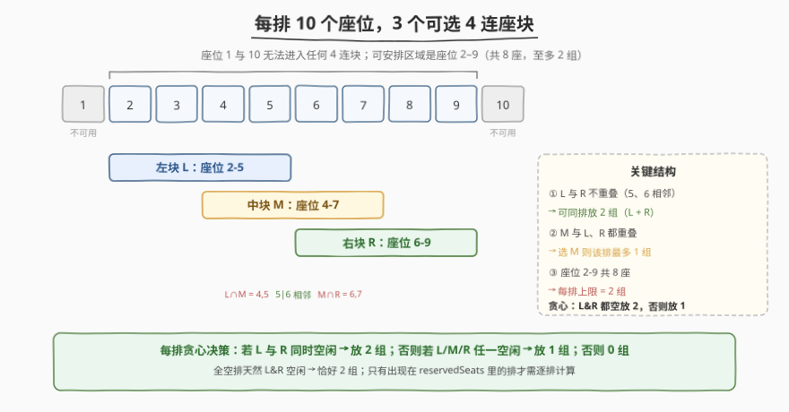
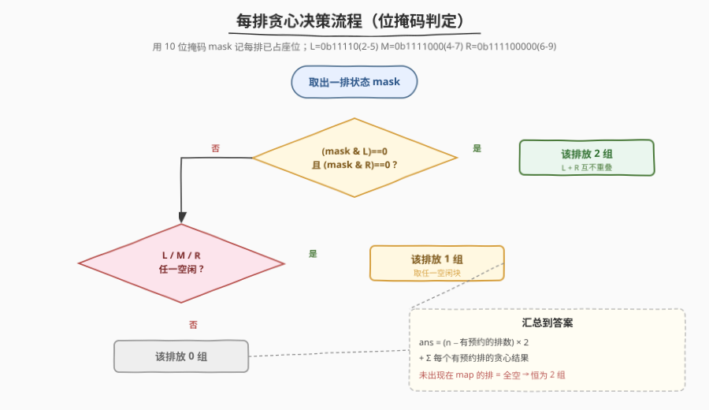
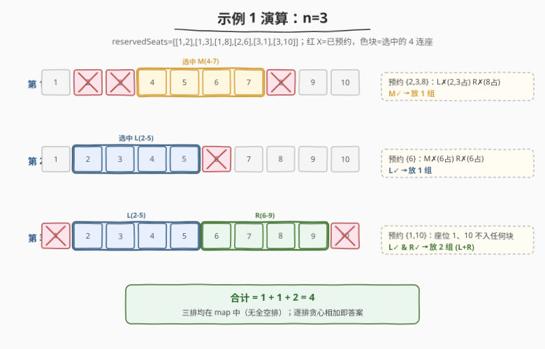

# LeetCode 安排电影院座位 题解

## 1. 题目概述

- **标题 / 题号**：安排电影院座位（#1386，medium）
- **链接**：https://leetcode.cn/problems/cinema-seat-allocation/
- **难度**：中等
- **标签**：贪心、位运算、哈希表

**题意**：电影院的观影厅中有 `n` 行座位，行编号从 1 到 `n`，每一行内有 10 个座位，列编号从 1 到 10。

给定二维数组 `reservedSeats`，其中 `reservedSeats[i] = [rowi, seati]` 表示第 `rowi` 行的座位 `seati` 已被预订。

四人小组必须坐在同一排的四个连续座位上，可选的 4 连座块只有三种：

- 座位 `2, 3, 4, 5`（左块 L）
- 座位 `4, 5, 6, 7`（中块 M）
- 座位 `6, 7, 8, 9`（右块 R）

只有当某块中的 4 个座位**全部空闲**时才能使用，每个座位最多分配给一个小组。返回可分配的**最大**四人小组数量。

**示例 1**：

```text
输入：n = 3, reservedSeats = [[1,2],[1,3],[1,8],[2,6],[3,1],[3,10]]
输出：4
解释：第 1 排放中块(4-7)、第 2 排放左块(2-5)、第 3 排放左块+右块，共 4 组。
```

**示例 2**：

```text
输入：n = 2, reservedSeats = [[2,1],[1,8],[2,6]]
输出：2
```

**示例 3**：

```text
输入：n = 4, reservedSeats = [[4,3],[1,4],[4,6],[1,7]]
输出：4
```

**约束**：

- $1 \le n \le 10^9$
- $1 \le \text{reservedSeats.length} \le \min(10 \cdot n,\ 10^4)$
- `reservedSeats[i] == [rowi, seati]`
- $1 \le \text{rowi} \le n$，$1 \le \text{seati} \le 10$
- 所有 `reservedSeats[i]` 互不相同

> 💡 关键约束在 $n \le 10^9$：**行数远超可遍历范围**，但预约记录至多 $10^4$ 条。这意味着绝大多数排是**完全空的**——它们对答案的贡献恒定，只有"有预约的排"才需要逐排计算。

## 2. 解题思路

### 2.1 暴力思路：逐排扫描

最直白的做法：开一个 $n \times 10$ 的二维数组标记每个座位是否被预约，然后逐排尝试三种块的组合，枚举每排放 $\{0,1,2\}$ 组的所有方案取最大。

问题立刻浮现：$n$ 可达 $10^9$，光是分配数组就内存爆炸，遍历 $10^9$ 排也超时。暴力思路死在"$n$ 太大"上。

> ⚠️ 但暴力思路揭示了一个重要事实：**每排的决策彼此独立**——某排放几组只取决于该排自己的预约情况，与其他排无关。这把问题天然拆成了"每排局部最优 → 全局求和"的结构，是贪心可行的根因。

### 2.2 核心观察：位掩码 + 每排贪心



三个观察把问题压成 $O(\text{预约数})$：

**观察一：每排上限是 2 组。** 可安排区域是座位 2–9（共 8 座），4 连座块每块 4 座，$8 / 4 = 2$，所以无论怎么放，单排不可能超过 2 组。座位 1 和 10 不属于任何块，是"废座"。

**观察二：L 与 R 不重叠，可同排放 2 组。** 左块 L = 2-5，右块 R = 6-9，5 和 6 相邻但不重叠。所以若 L 和 R **同时空闲**，该排直接放 2 组（L + R），达到上限，无需考虑 M。

**观察三：M 与 L、R 都重叠，选 M 则该排最多 1 组。** 中块 M = 4-7，与 L 在 4-5 重叠、与 R 在 6-7 重叠。一旦选了 M，就排除了 L 和 R，该排最多 1 组。

把三者合并成一条**贪心规则**：

- 若 `L 空闲 且 R 空闲` → 放 2 组；
- 否则若 `L / M / R 任一空闲` → 放 1 组；
- 否则 → 放 0 组。

> 💡 为什么这是最优？单排上限 2 组。`L & R 都空`时放 2 组已达上限，必然最优；否则至多 1 组，任选一个空闲块即可。无需回溯、无需枚举组合——贪心一步到位。

**观察四：用位掩码压缩一排状态。** 一排只有 10 个座位，恰好塞进一个整数的低 10 位：座位 `s` 被预约就把第 `s-1` 位置 1。判定某块是否空闲变成一次按位与：

$$
\text{block 空闲} \iff (\text{mask} \,\&\, \text{blockBits}) == 0
$$

三个块对应的位掩码（位 `i` 代表座位 `i+1`）：

| 块 | 座位 | 占用位 | 掩码值 |
|----|------|--------|--------|
| L | 2,3,4,5 | 位 1-4 | `0b000011110` = 30 |
| M | 4,5,6,7 | 位 3-6 | `0b001111000` = 120 |
| R | 6,7,8,9 | 位 5-8 | `0b111100000` = 480 |

**处理 $n$ 很大：** 只用哈希表 `rowMask` 收集"有预约的排"，逐排贪心；**未出现在表中的排视为全空**，每排恒放 2 组，贡献 `(n - len(rowMask)) * 2`。这样总工作量正比于预约数而非行数。

### 2.3 算法流程



```
maxNumberOfFamilies(n, reservedSeats):
    rowMask = 哈希表: row -> 10 位掩码
    for (row, seat) in reservedSeats:
        rowMask[row] |= (1 << (seat - 1))

    ans = (n - len(rowMask)) * 2     # 全空排每排 2 组
    for (row, mask) in rowMask:
        left  = (mask & 0b000011110) == 0
        mid   = (mask & 0b001111000) == 0
        right = (mask & 0b111100000) == 0
        if left and right:       ans += 2
        elif left or mid or right: ans += 1
    return ans
```

> ⚠️ 注意"全空排"的计算用 `n - len(rowMask)`：`rowMask` 只含**有预约**的排。但有一种边界情况——某排在 `reservedSeats` 里出现，预约的却全是座位 1 或 10（如示例 1 第 3 排预约 1、10）。这种排虽然进了哈希表，但其 L/M/R 全空，贪心会判出 `left && right` → 放 2 组，与"全空排"结果一致，不会漏算或多算。

### 2.4 示例演算

以示例 1（`n=3`，三排均有预约）逐步演算，重点看每排的贪心判定：



| 排 | 预约座位 | mask | L 空? | M 空? | R 空? | 贪心结果 | 说明 |
|----|----------|------|-------|-------|-------|----------|------|
| 1 | 2,3,8 | `0b01000110` | ✗(2,3占) | ✓ | ✗(8占) | 1 组 | L、R 都被占，只剩 M |
| 2 | 6 | `0b00100000` | ✓ | ✗(6占) | ✗(6占) | 1 组 | 6 同时属于 M、R，二者全废，只剩 L |
| 3 | 1,10 | `0b100000001` | ✓ | ✓ | ✓ | 2 组 | 1、10 是废座，L&R 都空 → 放 L+R |

三排都在 `rowMask` 中，无全空排，`ans = 0 + (1+1+2) = 4`，与示例一致。

> 💡 第 2 排体现了"M、R 共享座位 6"的耦合：预约 6 一个座位就同时废掉了 M 和 R 两个块。这也是为什么贪心先判 `L & R`——只要 L、R 都空就立刻放 2 组，根本不用关心 M。

## 3. 参考代码

### C++

```cpp
class Solution {
  public:
    int maxNumberOfFamilies(int n, vector<vector<int>>& reservedSeats) {
        unordered_map<int, int> rowMask;
        for (const auto& rs : reservedSeats)
            rowMask[rs[0]] |= (1 << (rs[1] - 1));

        long long ans = (long long)(n - (int)rowMask.size()) * 2;
        for (const auto& [r, mask] : rowMask) {
            bool left  = (mask & 0b000011110) == 0;
            bool mid   = (mask & 0b001111000) == 0;
            bool right = (mask & 0b111100000) == 0;
            if (left && right)            ans += 2;
            else if (left || mid || right) ans += 1;
        }
        return (int)ans;
    }
};
```

### Python

```python
class Solution:
    def maxNumberOfFamilies(self, n: int, reservedSeats: List[List[int]]) -> int:
        from collections import defaultdict

        row_mask = defaultdict(int)
        for r, s in reservedSeats:
            row_mask[r] |= (1 << (s - 1))

        L, M, R = 0b000011110, 0b001111000, 0b111100000
        ans = (n - len(row_mask)) * 2          # 全空排每排 2 组
        for mask in row_mask.values():
            left  = (mask & L) == 0
            mid   = (mask & M) == 0
            right = (mask & R) == 0
            if left and right:
                ans += 2
            elif left or mid or right:
                ans += 1
        return ans
```

> 💡 **实现细节**：① 用 `defaultdict` / `unordered_map` 把同一排的多个预约"或"到一个掩码里，天然去重。② 三块掩码用二进制字面量 `0b...` 直接写出，可读性高于魔数。③ `(n - len(row_mask)) * 2` 中 `n` 可达 $10^9$，乘 2 后接近 $2 \times 10^9$，C++ 里用 `long long` 暂存避免 `int` 溢出（$2 \times 10^9$ 已逼近 `INT_MAX` $\approx 2.147 \times 10^9$），最终答案保证在 `int` 范围内再转回。

## 4. 复杂度分析

| 维度 | 复杂度 | 说明 |
|------|--------|------|
| 时间复杂度 | $O(m)$ | $m = \text{reservedSeats.length}$；遍历预约建表 $O(m)$，再遍历哈希表每排 $O(1)$ 位运算判定 |
| 空间复杂度 | $O(m)$ | 哈希表最多存 $\min(10n,\ 10^4)$ 个排的掩码 |

> ⚠️ 复杂度与**行数 $n$ 无关**——这正是本题设计的精妙处：$n$ 高达 $10^9$ 只是个"纸老虎"，真正决定工作量的是预约数 $m \le 10^4$。全空排用公式 $O(1)$ 批量结算，有预约的排才逐排处理。若不利用这一点、改用数组逐排扫描，会立刻在 $n = 10^9$ 上 TLE/MLE。

## 5. 面试要点

1. **为什么贪心是对的？不需要 DP 或回溯吗？**

   > 每排决策彼此独立（某排放几组只看本排预约），且单排上限 2 组。`L & R 都空`时放 2 组已达上限，必然最优；否则至多 1 组，任选一个空闲块即可。子问题无后效性 + 局部最优即全局最优，贪心成立，无需 DP。

2. **$n = 10^9$ 时怎么办？**

   > 预约数 $m \le 10^4$，说明绝大多数排全空。用哈希表只存"有预约的排"，全空排用公式 $(n - |\text{map}|) \times 2$ 批量结算。总工作量 $O(m)$，与 $n$ 无关。这是"稀疏数据用哈希表索引、稠密部分用公式"的通用套路。

3. **为什么用位掩码？一排 10 个座位是不是巧合？**

   > 一排恰好 10 座，可塞进一个 32 位整数的低 10 位，把"一组座位是否全空"的判定压缩成一次按位与 `mask & blockBits == 0`。即便座位数更多（如 20、30），只要能放进 64 位整数，位掩码仍比 `set` 查询更快更省内存。本题 10 座是"刚好适合位掩码"的甜区。

4. **贪心里为什么先判 `L && R` 而不是先判 `L || M || R`？**

   > 顺序体现"优先取上限"。`L && R` 能放 2 组（单排上限），命中即终止；只有拿不到 2 组时才退而求其次放 1 组。若先判"任一空闲放 1 组"，会在 `L && R` 都空时错误地只放 1 组，少算一半。

5. **预约座位 1 或 10 的排进了哈希表，会不会被多算/少算？**

   > 不会。座位 1、10 不属于任何块，预约它们不改变 L/M/R 的空闲性。这种排进表后贪心仍会判出 `L && R` 都空 → 放 2 组，与"全空排"结果一致。代价只是多了一次哈希表查询，不影响正确性。`(n - len(map)) * 2` 中的 `len(map)` 含这类排，但它们的 2 组贡献已由表内贪心补回，总数仍正确。

## 同类练习题

| # | 题目 | 与本题的关联 |
|---|------|-------------|
| 1349 | [参加考试的最大学生数](https://leetcode.cn/problems/maximum-students-taking-exam/)（[题解](./1349_参加考试的最大学生数.md)） | 同为"座位安排"问题，但排间状态耦合，需用位掩码 + 状态压缩 DP——可看作本题"单排贪心"升级为"多排 DP"的进阶版 |
| 318 | [最大单词长度乘积](https://leetcode.cn/problems/maximum-product-of-word-lengths/) | 用位掩码压缩每个单词的字符集，$O(1)$ 判两单词无公共字母，体会位掩码"压缩集合、按位与判交集"的通用技法 |
| 187 | [重复的 DNA 序列](https://leetcode.cn/problems/repeated-dna-sequences/)（[题解](../0101-0200/187_重复的DNA序列.md)） | 滚动位掩码 + 哈希表检测重复子串，与本题"位掩码做键/值"思想同源 |
| 860 | [柠檬水找零](https://leetcode.cn/problems/lemonade-change/) | 贪心局部决策的入门题，对照"无后效性 + 局部最优即全局最优"的贪心判定范式 |
| 1461 | [检查一个字符串是否包含所有长度为 K 的二进制子串](https://leetcode.cn/problems/check-if-a-string-contains-all-binary-codes-of-size-k/) | 位掩码枚举所有 $K$ 位模式 + 哈希集合判重，体会"位掩码天然编码有限状态空间" |
