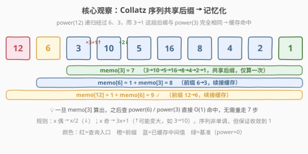
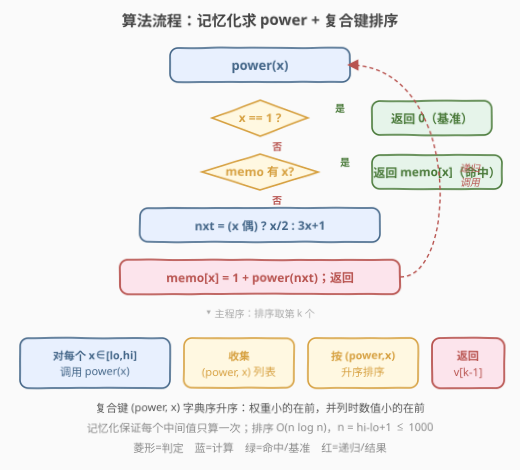
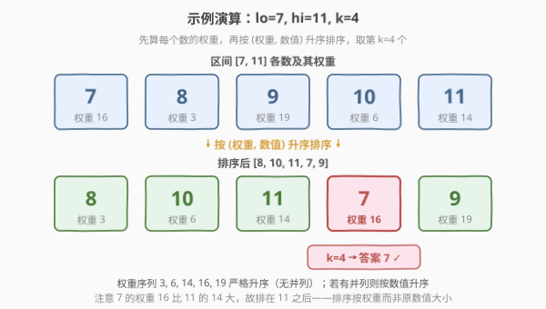

# 将整数按权重排序

- **题目名称**：将整数按权重排序
- **链接**：[1387. 将整数按权重排序](https://leetcode.cn/problems/sort-integers-by-the-power-value/)
- **难度**：中等
- **标签**：记忆化搜索、排序、递归、数学

## 1. 题目概述

将整数 `x` 的 **权重** 定义为按下列规则把 `x` 变成 `1` 所需的步数：

- 如果 `x` 是偶数，则 `x = x / 2`；
- 如果 `x` 是奇数，则 `x = 3 * x + 1`。

例如 `x = 3` 的权重为 `7`，因为 `3 → 10 → 5 → 16 → 8 → 4 → 2 → 1` 共 7 步。

给定三个整数 `lo`、`hi` 和 `k`，把区间 `[lo, hi]` 内的整数按权重**升序**排序；若不少于 2 个整数权重相同，则按数值本身**升序**排序。返回排序后第 `k` 个数（1 下标）。

题目保证：对任意 `x (lo ≤ x ≤ hi)`，它变成 1 的步数可用 32 位有符号整数表示。

**示例 1**：

```text
输入：lo = 12, hi = 15, k = 2
输出：13
解释：12 的权重为 9（12 → 6 → 3 → 10 → 5 → 16 → 8 → 4 → 2 → 1）
     13 的权重为 9
     14 的权重为 17
     15 的权重为 17
     按权重排序后为 [12, 13, 14, 15]。k = 2 → 13
     （12 与 13 权重并列，按数值升序；14 与 15 同理）
```

**示例 2**：

```text
输入：lo = 7, hi = 11, k = 4
输出：7
解释：[7, 8, 9, 10, 11] 的权重分别为 [16, 3, 19, 6, 14]
     按权重排序后为 [8, 10, 11, 7, 9]。第 4 个数为 7
```

**约束条件**：

- $1 \le \text{lo} \le \text{hi} \le 1000$
- $1 \le k \le \text{hi} - \text{lo} + 1$

> 💡 本题是著名的 **Collatz 猜想（$3n+1$ 问题）** 的工程化包装：规则极简，但奇数分支 $3x+1$ 会让值**变大**，序列非单调。难点不在排序，而在高效且不重复地计算每个数的权重——这正是**记忆化搜索**的招牌场景。

---

## 2. 解题思路

### 2.1 暴力思路：每个数独立模拟

最直白的做法：对 `[lo, hi]` 中每个 `x`，从 `x` 出发反复套规则数到 1 的步数，再把 `(权重, x)` 排序取第 `k` 个。

- **正确但低效**：单个 `x` 的步数为 $O(\text{power}(x))$。问题在于 $3x+1$ 会让值飙升——例如 $x = 97$ 的链会尖峰到 $9232$，步数达 $118$。区间内 $n \le 1000$ 个数各自独立模拟，大量**重复计算**：计算 `power(12)` 走过 `12→6→3→10→5→16→8→4→2→1`，而 `power(6)`、`power(3)` 又会重走其中的 `3→…→1` 这一大段。
- **排序 $O(n \log n)$** 无法省，但计数可以——只要让「共享后缀」只算一次，就能把重复的 $O(\text{power})$ 工作摊掉。

> ⚠️ 暴力法在本题 $n \le 1000$、步数有界的前提下其实能 AC，但完全没利用「不同数的 Collatz 链大量重叠」这一结构。面试中写出暴力只是起点，记忆化才是考点。

### 2.2 核心观察：Collatz 序列共享后缀 → 记忆化



关键洞察：

- **权重满足递推**：$\text{power}(1) = 0$；对 $x > 1$，记下一步 $\text{next}(x) = x/2$（$x$ 偶）或 $3x+1$（$x$ 奇），则
  $$\text{power}(x) = 1 + \text{power}(\text{next}(x))$$
  这天然是递归结构。
- **链大量重叠**：`power(12)` 递归到 `power(6)` 再到 `power(3)`；而 `power(6)`、`power(3)` 本身也会被区间内其他数（如 `6`、`3` 自身，或经过它们的 `24`、`48` 等）查询。一旦 `memo[3] = 7` 算出并缓存，之后任何走到 `3` 的链都直接 $O(1)$ 续接，无需重走 7 步。
- **值会越界但无害**：$3x+1$ 可能把值送到 `hi` 之外（如 `3 → 10`，`97 → 9232`）。记忆化表对所有出现过的中间值（不限 `[lo, hi]`）都缓存，越界值同样被复用。

> 💡 **为什么记忆化如此有效？** Collatz 链的本质是「殊途同归」——大量整数最终都会汇入同一条收尾通路（都走向 `… → 16 → 8 → 4 → 2 → 1`）。把这些共享尾段的 `power` 值缓存后，整张表的「不同中间值」总数 $D$ 远小于「各数独立步数之和」。对 $x \le 1000$，$D$ 仅约两千余个（链可尖峰到数十万，如 $x = 703$ 的链峰值达 $250504$），每个值只算一次，摊还 $O(1)$。

> 以 `power(12)` 为例：递归 `12 → 6 → 3 → 10 → 5 → 16 → 8 → 4 → 2 → 1`。首次计算时顺带把 `memo[6]=8`、`memo[3]=7`、`memo[10]=6`、`memo[5]=5`、`memo[16]=4`、`memo[8]=3`、`memo[4]=2`、`memo[2]=1` 全部填好。之后查询 `power(6)` 直接命中 `memo[6]`，$O(1)$。

### 2.3 算法流程图



**完整步骤**：

1. **记忆化求 `power(x)`**：基准 `x == 1 → 0`；命中 `memo[x]` 直接返回；否则按奇偶算 `next`，递归 `power(next)` 并写入 `memo[x] = 1 + power(next)`。
2. **收集复合键**：对每个 $x \in [\text{lo}, \text{hi}]$，构造二元组 $(\text{power}(x),\, x)$。
3. **排序**：按二元组字典序升序——权重小的在前，并列时数值小的在前，由 `(power, x)` 字典序天然保证。
4. **取第 k 个**：返回排序后下标 `k-1` 的数值。

> 💡 复合键 $(\text{power}, x)$ 把「先按权重、再按数值」编码进字典序，无需手写比较器。这与 [1356. 根据数字二进制下 1 的数目排序](../1301-1400/1356_根据数字二进制下1的数目排序.md) 的 `(popcount, x)` 复合键同源。

### 2.4 示例演算

以示例 2 `lo = 7, hi = 11, k = 4` 为例：



| $x$ | Collatz 链（缩写） | 权重 |
|-----|---------------------|------|
| 7 | 7→22→11→34→17→52→26→13→40→20→10→5→16→8→4→2→1 | 16 |
| 8 | 8→4→2→1 | 3 |
| 9 | 9→28→14→7→…→1 | 19 |
| 10 | 10→5→16→8→4→2→1 | 6 |
| 11 | 11→34→17→52→26→13→40→20→10→5→16→8→4→2→1 | 14 |

按 $(\text{power}, x)$ 升序得 `[(3,8), (6,10), (14,11), (16,7), (19,9)]`，即 `[8, 10, 11, 7, 9]`。第 `k = 4` 个为 **7**。

> 💡 注意 `7` 的权重 `16` 比 `11` 的 `14` 更大，所以 `7` 排在 `11` **之后**——排序键是权重而非原数值大小。同时 `9` 的链经过 `7`，记忆化会让 `power(9) = 1 + power(28) = … = 3 + power(7)`，其中 `power(7)` 已在算 `7` 时缓存，避免重走 16 步。

---

## 3. 参考代码

### C++（写法一：递归 + 记忆化）

```cpp
class Solution {
    unordered_map<int, int> memo;
    int power(int x) {
        if (x == 1) return 0;               // 基准
        if (memo.count(x)) return memo[x];  // 命中缓存
        int nxt = (x & 1) ? 3 * x + 1 : x / 2;
        return memo[x] = 1 + power(nxt);    // 边算边存
    }
public:
    int getKth(int lo, int hi, int k) {
        vector<pair<int,int>> v;
        for (int x = lo; x <= hi; ++x)
            v.emplace_back(power(x), x);
        sort(v.begin(), v.end());           // pair 默认按 (first, second) 字典序
        return v[k - 1].second;
    }
};
```

### C++（写法二：迭代 + 记忆化，规避递归栈）

```cpp
class Solution {
public:
    int getKth(int lo, int hi, int k) {
        unordered_map<int, int> memo{{1, 0}};
        auto getPower = [&](int x) {
            if (memo.count(x)) return memo[x];
            vector<int> path;               // 记录未缓存的链上节点
            int cur = x;
            while (!memo.count(cur)) {
                path.push_back(cur);
                cur = (cur & 1) ? 3 * cur + 1 : cur / 2;
            }
            int base = memo[cur];           // 命中已有缓存值
            for (int i = (int)path.size() - 1; i >= 0; --i)
                memo[path[i]] = ++base;     // 回填：逐个 +1
            return memo[x];
        };
        vector<pair<int,int>> v;
        for (int x = lo; x <= hi; ++x)
            v.emplace_back(getPower(x), x);
        sort(v.begin(), v.end());
        return v[k - 1].second;
    }
};
```

### Python（写法一：手写记忆化 + 复合键排序）

```python
class Solution:
    def getKth(self, lo: int, hi: int, k: int) -> int:
        memo = {1: 0}

        def power(x: int) -> int:
            if x not in memo:
                nxt = 3 * x + 1 if x & 1 else x // 2
                memo[x] = 1 + power(nxt)
            return memo[x]

        return sorted(range(lo, hi + 1), key=lambda x: (power(x), x))[k - 1]
```

### Python（写法二：functools.lru_cache，最简洁）

```python
from functools import lru_cache

class Solution:
    def getKth(self, lo: int, hi: int, k: int) -> int:
        @lru_cache(None)
        def power(x: int) -> int:
            if x == 1:
                return 0
            nxt = 3 * x + 1 if x & 1 else x // 2
            return 1 + power(nxt)

        return sorted(range(lo, hi + 1), key=lambda x: (power(x), x))[k - 1]
```

> 💡 **实现细节**：① `pair<int,int>` 与 Python 元组都按字典序比较，`(power, x)` 复合键天然实现「先权重后数值」，无需自定义比较器。② `lru_cache(None)` 把记忆化逻辑完全交给装饰器，`power` 函数体只写递推，最贴近数学定义。③ 奇偶判定用 `x & 1`，除 2 用 `x // 2`（Python 整除）或 `x / 2`（C++ 整数除法），避免浮点。④ 写法二用「沿链走到缓存值，再回填路径」替代递归，彻底规避递归栈深度问题，适合链极长或语言栈受限的场景。

---

## 4. 复杂度分析

| 维度 | 递归 + 记忆化（推荐） | 迭代 + 记忆化 | 暴力模拟 |
|------|----------------------|---------------|----------|
| 时间复杂度 | $O(D + n \log n)$ | $O(D + n \log n)$ | $O(n \cdot \overline{p})$ |
| 空间复杂度 | $O(D + n)$ | $O(D + n)$ | $O(n)$ |
| 适用场景 | 通用，简洁 | 链极长 / 规避递归 | 仅步数极小时 |

- **$D$**：记忆化表中不同中间值的总数。对 $x \le 1000$，Collatz 链触及的不同值约两千余个（链可尖峰到数十万，如 $x = 703$ 峰值 $250504$）。每个值首次计算后 $O(1)$ 命中，故计数总开销 $O(D)$。
- **$n = \text{hi} - \text{lo} + 1 \le 1000$**：排序主导 $O(n \log n)$，约 $10^4$ 次比较。
- **$\overline{p}$**：各数权重的均值。暴力法对每个数独立走完整条链，区间内 $n$ 个数的链大量重叠却不复用，总开销 $O(n \cdot \overline{p})$，常数远大于记忆化。

> ⚠️ 递归深度等于被计算值的权重；$x \le 1000$ 时最大权重为 $178$（$x = 871$），仍远低于 Python 默认递归上限 $1000$，故递归写法安全。若放宽到更大值域，应改用写法二的迭代版。

---

## 5. 扩展：Collatz 猜想与进阶讨论

### 5.1 $3n+1$ 问题的数学背景

本题规则即著名的 **Collatz 猜想**：任意正整数反复执行「偶除 2、奇乘 3 加 1」最终必到达 1。该猜想至今**未被证明**也未被推翻，是数学界最著名的未决问题之一。题目用「保证步数为 32 位有符号整数」一句规避了收敛性争议——在给定值域内链必终止，我们只需工程上正确计算。

### 5.2 与 1342 的对比：单调 vs 非单调

| 维度 | [1342](../1301-1400/1342_将数字变成0的操作步骤数.md)（变成 0） | 1387（变成 1） |
|------|--------------------------------------------------------------|----------------|
| 偶数规则 | $x / 2$ | $x / 2$ |
| 奇数规则 | $x - 1$ | $3x + 1$ |
| 单调性 | 每步严格递减（奇数−1 变偶，偶数÷2 折半） | **非单调**（$3x+1$ 让奇数变大，如 $3 → 10$） |
| 步数上界 | $O(\log x)$，可推闭式 $\text{popcount} + \text{bitlen} - 1$ | 无简单闭式，依赖链的尖峰与回落 |
| 记忆化价值 | 链不重叠（每步减），记忆化无收益 | 链大量重叠，记忆化是核心优化 |

> 💡 这一对比揭示了「何时该用记忆化」的判据：**当递推链存在共享子结构（不同输入会经过相同的中间状态）时，记忆化才有用武之地**。1342 的链是「各自直奔终点」的独占路径，无共享可言；1387 的链则是「百川归海」的汇流结构，记忆化收益巨大。

### 5.3 多次查询：预处理全表

若需对同一值域多次回答不同 `[lo, hi, k]` 的查询，可一次性预处理 $1 \dots \text{MAX}$ 的 `power` 表（`MAX = 1000`），后续每次查询退化为区间排序 $O(n \log n)$，无需重复建表：

```python
MAX = 1000
_power = [0] * (MAX + 1)
for x in range(2, MAX + 1):
    nxt = 3 * x + 1 if x & 1 else x // 2
    _power[x] = 1 + (_power[nxt] if nxt <= MAX else _power_recurse(nxt))
```

> ⚠️ 注意 `3x+1` 可能超过 `MAX`，超出部分仍需递归/记忆化补算，不能只填 $[1, \text{MAX}]$。

---

## 6. 面试要点

1. **为什么需要记忆化？不记忆化会怎样？**

   > 不同整数的 Collatz 链大量重叠（都汇入 `…→16→8→4→2→1` 的收尾通路）。不记忆化时，`power(12)`、`power(6)`、`power(3)` 各自独立走完整条链，重复计算 `3→…→1` 这段。记忆化让每个中间值只算一次，把总计数开销从 $O(n \cdot \overline{p})$ 降到 $O(D)$，$D$ 为不同中间值总数。

2. **$3x+1$ 会让值变大，递归会不会无限进行？**

   > 题目保证给定值域内步数为有限 32 位整数，即链必收敛到 1。数学上 Collatz 猜想尚未被证明，但本题通过约束规避了争议。工程上我们信任该保证，递归必然终止。链的尖峰可能很大（$x = 97$ 时尖峰 $9232$、$x = 703$ 时达 $250504$），但 $x \le 1000$ 时步数至多 $178$（$x = 871$），递归深度安全。

3. **为什么用复合键 `(power, x)` 而不写自定义比较器？**

   > 「先按权重升序，并列按数值升序」恰是二元组字典序。`pair` / Python 元组的默认比较即为字典序，编码进复合键后无需手写比较器，更简洁不易错。这与 1356 的 `(popcount, x)` 同源——把比较规则编码进排序键是通用技巧。

4. **记忆化表里存的值超出 `[lo, hi]` 有问题吗？**

   > 完全无害，反而是优化的关键。$3x+1$ 会把值送到区间外（如 `3 → 10`，`97 → 9232`），这些越界值同样被缓存并在其他链中复用。记忆化表对「所有出现过的中间值」建索引，不受 `[lo, hi]` 限制。空间开销 $O(D)$ 仍是有界的。

5. **递归深度安全吗？换成迭代怎么写？**

   > 递归深度等于所求值的权重；$x \le 1000$ 时最大权重为 $178$（$x = 871$），仍远低于 Python 默认上限 $1000$，安全。若值域放大或栈受限，用写法二的迭代版：沿链走到一个已缓存值，记录路径，再从命中点倒推回填 `memo[path[i]] = ++base`，彻底消除递归。

> 💡 **一句话总结**：1387 的灵魂是「**Collatz 链共享后缀 → 记忆化搜索**」——把 $\text{power}(x) = 1 + \text{power}(\text{next}(x))$ 的递推配上缓存，让大量重叠的收尾通路只算一次；最后用复合键 $(\text{power}, x)$ 字典序排序取第 $k$ 个。

---

## 7. 同类练习题

- [1342. 将数字变成 0 的操作步骤数](https://leetcode.cn/problems/number-of-steps-to-reduce-a-number-to-zero/)（[题解](../1301-1400/1342_将数字变成0的操作步骤数.md)）：同为「数步数归约数字」，但奇数规则是 $-1$（单调递减、有闭式），对照 1387 的 $3x+1$（非单调、需记忆化），揭示「何时该用记忆化」的判据
- [1356. 根据数字二进制下 1 的数目排序](https://leetcode.cn/problems/sort-integers-by-the-number-of-1-bits/)（[题解](../1301-1400/1356_根据数字二进制下1的数目排序.md)）：同样「按计算出的属性 + 复合键 `(属性, 值)` 排序」，巩固复合键排序模板
- [397. 整数替换](https://leetcode.cn/problems/integer-replacement/)（[题解](../0301-0400/397_整数替换.md)）：偶数 $/2$、奇数 $±1$ 求最少步数到 1，同为「归约到 1」家族，用 BFS / 记忆化求最短步数
- [202. 快乐数](https://leetcode.cn/problems/happy-number/)：反复对数位平方求和直到收敛或成环，同为「跟随变换序列」家族，用哈希记忆化 / Floyd 判环检测终止性
