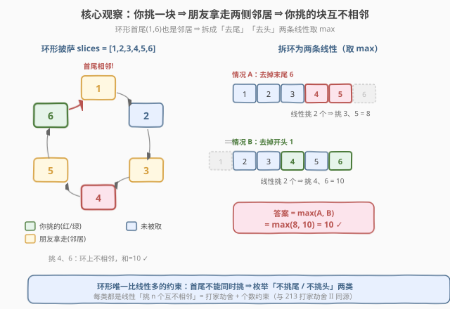
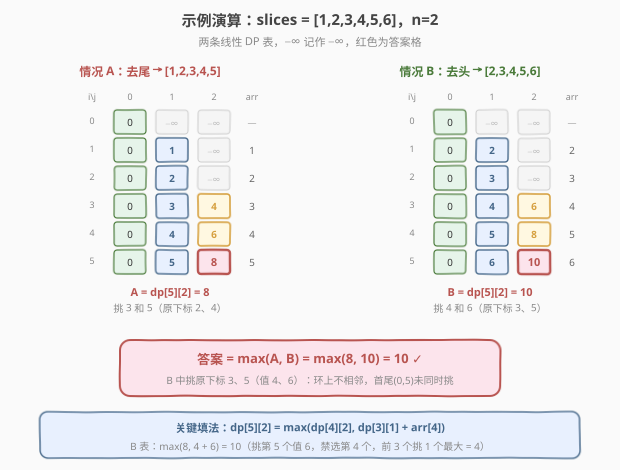

# 3n块披萨

- **题目名称**：3n块披萨
- **链接**：[1388. 3n块披萨](https://leetcode.cn/problems/pizza-with-3n-slices/)
- **难度**：困难
- **标签**：动态规划、环形 DP、打家劫舍

## 1. 题目概述

有一份披萨，由 `3n` 块大小不一的切片组成，切片按**顺时针顺序排成环形**，第 `i` 块大小为 `slices[i]`。你和两个朋友按如下规则依次取切片，直到没有切片剩余：

1. **你**任意挑一块切片；
2. **Alice** 拿走你挑的切片**顺时针方向相邻**的下一块；
3. **Bob** 拿走你挑的切片**逆时针方向相邻**的下一块；
4. 重复上述过程，直至披萨被取完。

每轮三人各拿一块，`3n` 块正好 `n` 轮取完，因此**你恰好拿到 `n` 块**。返回你能拿到切片大小之和的**最大值**。

**示例 1**：

```text
输入：slices = [1,2,3,4,5,6]
输出：10
解释：你挑 4 和 6（顺时针第 4、第 6 块），和为 10。
```

**示例 2**：

```text
输入：slices = [8,9,8,6,1,1]
输出：16
解释：你挑第一块和第三块（大小均为 8），和为 16。
```

**示例 3**：

```text
输入：slices = [9,5,1,7,8,4,4,5,5,8,6,3]
输出：30
```

**约束条件**：

- `1 <= slices.length <= 500`
- `slices.length % 3 == 0`
- `1 <= slices[i] <= 1000`

> 💡 本题表面是「披萨分配」模拟，本质是 [213. 打家劫舍 II](../0201-0300/213_打家劫舍II.md) 的升级版：环形数组中挑若干元素、相邻不能同时挑，但额外加了「**恰好挑 n 个**」的个数约束。把环形拆成两条线性、再套带个数的打家劫舍 DP 即可。

---

## 2. 解题思路

### 2.1 暴力思路：枚举所有选法

从 `3n` 块中挑 `n` 块，组合数为 $\binom{3n}{n}$，还要校验任意两块不相邻（含环形首尾）。`n` 最大为 166 时组合数天文数字，完全不可行。

### 2.2 核心观察：等价于「环形数组中挑 n 个互不相邻元素」



**关键等价**：

> **你挑的任意两块都不相邻（含环形首尾），且恰好挑 n 块。** 反过来，任何「环形上 n 个互不相邻的位置」都能被你通过合适的取餐顺序拿到。

**正向（必要性）**：你挑一块后，它的左右邻居立刻被 Alice/Bob 拿走，所以你永远不可能拿到两块相邻的切片（包括首尾那对邻居）。

**反向（充分性）**：设你选定的 n 个位置为 $p_1 < p_2 < \dots < p_n$（环形意义下）。由于互不相邻，相邻两个被选位置之间至少夹 1 块未被选的切片。把 `3n` 个位置中**未被选的 2n 块**沿环形分配给「每个被选块左侧槽 + 右侧槽」共 2n 个槽，每槽至少 1 块、恰好 2n 块填 2n 槽 ⇒ 每槽正好 1 块。于是存在取餐顺序：每次你挑一个还剩的目标块，Alice/Bob 自然拿走其左右槽中的那一块。归纳可证。

> ⚠️ **环形首尾也是邻居**：下标 `0` 和 `3n-1` 在环上相邻，二者不能同时挑。这是「环形」与「线性」的唯一差别，也是拆环为线的依据。

于是问题归约为：

$$
\text{在环形数组 } slices \text{ 中挑 } n \text{ 个互不相邻元素，求最大和}
$$

**拆环为线**（同 [213. 打家劫舍 II](../0201-0300/213_打家劫舍II.md)）：环形首尾 `slices[0]` 与 `slices[3n-1]` 不能同时挑，分两类讨论取 `max`：

| 情况 | 处理 | 子问题 |
|------|------|--------|
| **不挑 `slices[3n-1]`** | 线性数组 `slices[0..3n-2]` | 挑 n 个互不相邻最大和 |
| **不挑 `slices[0]`** | 线性数组 `slices[1..3n-1]` | 挑 n 个互不相邻最大和 |

两类取最大值即答案。每类都是**线性**「带个数的打家劫舍」。

### 2.3 线性子问题：带个数的打家劫舍 DP

![DP 转移：dp[i][j] = max(不挑 i, 挑 i)](../images/1388_dp_transition.svg)

**定义**：`dp[i][j]` = 在**线性数组前 i 个元素**中挑 **j 个互不相邻元素**的最大和。

**转移**（对第 `i` 个元素 `slices[i-1]` 二选一）：

```text
不挑第 i 个：dp[i][j] = dp[i-1][j]
挑第 i 个 ：dp[i][j] = dp[i-2][j-1] + slices[i-1]   # 第 i-1 个不能挑
dp[i][j] = max(上述两者)
```

**边界**：

```text
dp[i][0] = 0           # 不挑任何元素，和为 0
dp[0][j] = -∞  (j≥1)   # 前 0 个元素挑不了任何
dp[1][1] = slices[0]   # 前 1 个挑 1 个就是它本身
```

> 💡 **为什么挑第 i 个要看 `dp[i-2][j-1]`？** 挑了 `slices[i-1]`，则 `slices[i-2]`（第 i-1 个）被禁选，前缀只能用到第 i-2 个；同时已挑 1 个，剩下 j-1 个要从更短前缀里挑。

**填表顺序**：外层 `i` 从 1 到长度 `L`，内层 `j` 从 1 到 `min(i, n)`。`dp[i-2][...]` 要求 `i-2 ≥ 0`，故 `i=1` 时挑的情况需特判（直接取 `slices[0]`）。

### 2.4 算法流程图

完整步骤：

1. **读入** `m = slices.length`，`n = m / 3`。
2. **拆环**：对两条线性数组分别调用 `linearPick`：
   - `A = linearPick(slices[0..m-2], n)`（去掉末尾）
   - `B = linearPick(slices[1..m-1], n)`（去掉开头）
3. **返回** `max(A, B)`。

`linearPick(arr, k)` 实现：

1. `L = len(arr)`，建 `dp` 为 `(L+1) × (k+1)`，初始化为 `-∞`，`dp[i][0] = 0`。
2. `i` 从 1 到 `L`，`j` 从 1 到 `min(i, k)`：
   - `skip = dp[i-1][j]`
   - `pick = (i == 1) ? arr[0] : dp[i-2][j-1] + arr[i-1]`（`j==1` 且 `i==1` 时直接拿首元素）
   - `dp[i][j] = max(skip, pick)`
3. 返回 `dp[L][k]`。

### 2.5 示例演算

以 `slices = [1,2,3,4,5,6]`（`m=6, n=2`）为例：



**情况 A**：去掉末尾 `6`，线性数组 `[1,2,3,4,5]`，挑 2 个。

| `i\j` | 0 | 1 | 2 |
|-------|---|---|---|
| 0 | 0 | −∞ | −∞ |
| 1 (`1`) | 0 | 1 | −∞ |
| 2 (`2`) | 0 | 2 | −∞ |
| 3 (`3`) | 0 | 3 | 4 |
| 4 (`4`) | 0 | 4 | 6 |
| 5 (`5`) | 0 | 5 | **8** |

`A = dp[5][2] = 8`（挑 `3` 和 `5`，下标 2、4）。

**情况 B**：去掉开头 `1`，线性数组 `[2,3,4,5,6]`，挑 2 个。

| `i\j` | 0 | 1 | 2 |
|-------|---|---|---|
| 0 | 0 | −∞ | −∞ |
| 1 (`2`) | 0 | 2 | −∞ |
| 2 (`3`) | 0 | 3 | −∞ |
| 3 (`4`) | 0 | 4 | 6 |
| 4 (`5`) | 0 | 5 | 8 |
| 5 (`6`) | 0 | 6 | **10** |

`B = dp[5][2] = 10`（挑 `4` 和 `6`，原下标 3、5）。

**答案** $= \max(8, 10) = 10$ ✓

> 💡 **校验环形约束**：B 中挑的是原下标 3、5（值 4、6）。环上 `[1,2,3,4,5,6]`，下标 3 和 5 之间隔下标 4，不相邻；下标 5 与下标 0（值 1）相邻但 0 未被挑，无冲突。这正是「去掉开头」保证首尾不撞的体现。

---

## 3. 参考代码

### C++

```cpp
// 3n块披萨.cpp —— 环形拆线性 + 带个数的打家劫舍 DP
// 编译: g++ -O2 -std=c++17 3n块披萨.cpp -o pizza
class Solution {
public:
    int maxSizeSlices(vector<int>& slices) {
        int m = slices.size();
        int n = m / 3;
        // 拆环为两条线性，取最大值
        // 情况 A：去掉末尾 slices[m-1]
        vector<int> a(slices.begin(), slices.end() - 1);
        // 情况 B：去掉开头 slices[0]
        vector<int> b(slices.begin() + 1, slices.end());
        return max(linearPick(a, n), linearPick(b, n));
    }

private:
    // 线性数组 arr 中挑 k 个互不相邻元素的最大和
    int linearPick(vector<int>& arr, int k) {
        int L = arr.size();
        // dp[i][j] = 前 i 个挑 j 个互不相邻的最大和
        const int NEG = -1e9;
        vector<vector<int>> dp(L + 1, vector<int>(k + 1, NEG));
        for (int i = 0; i <= L; ++i) dp[i][0] = 0;

        for (int i = 1; i <= L; ++i) {
            int lim = min(i, k);
            for (int j = 1; j <= lim; ++j) {
                int skip = dp[i - 1][j];                 // 不挑第 i 个
                int pick;
                if (i == 1) {
                    pick = arr[0];                        // 只有 1 个，挑它
                } else {
                    pick = dp[i - 2][j - 1] + arr[i - 1]; // 挑第 i 个，禁选第 i-1 个
                }
                dp[i][j] = max(skip, pick);
            }
        }
        return dp[L][k];
    }
};
```

### Python

```python
class Solution:
    def maxSizeSlices(self, slices: List[int]) -> int:
        n = len(slices) // 3

        def linear_pick(arr: List[int], k: int) -> int:
            L = len(arr)
            NEG = float("-inf")
            dp = [[NEG] * (k + 1) for _ in range(L + 1)]
            for i in range(L + 1):
                dp[i][0] = 0
            for i in range(1, L + 1):
                for j in range(1, min(i, k) + 1):
                    skip = dp[i - 1][j]                       # 不挑第 i 个
                    if i == 1:
                        pick = arr[0]                         # 只有 1 个，挑它
                    else:
                        pick = dp[i - 2][j - 1] + arr[i - 1]  # 挑第 i 个
                    dp[i][j] = max(skip, pick)
            return dp[L][k]

        # 拆环：去掉末尾 / 去掉开头，取最大值
        return max(linear_pick(slices[:-1], n), linear_pick(slices[1:], n))
```

> 💡 **实现细节**：① `-inf` 表示「不可能状态」，转移时自动被 `max` 淘汰。② `j` 上界取 `min(i, k)`：前 i 个至多挑 i 个，避免无意义计算。③ 两次 `linearPick` 各 `O(m·n)`，`m≤500, n≤166`，约 $1.7\times10^5$ 次，远在限制内。④ 若要省空间，`dp[i]` 只依赖 `dp[i-1]` 与 `dp[i-2]` 两行，可用「滚动数组 + 两个长度 k+1 的一维数组」压到 $O(n)$。

---

## 4. 复杂度分析

| 维度 | 复杂度 | 说明 |
|------|--------|------|
| **时间** | $O(m \cdot n)$ | 两次线性 DP，各 $L \cdot n \approx (m-1) \cdot n$ 次转移，每次 $O(1)$ |
| **空间** | $O(m \cdot n)$ | `dp` 表 `(L+1)×(n+1)`；滚动数组可压到 $O(n)$ |
| **思路** | 环形拆线性 + 带个数的打家劫舍 | 关键是把「你挑一块朋友拿两侧」等价为「挑 n 个互不相邻」 |

> ⚠️ 本题 `m ≤ 500, n ≤ 166`，$m \cdot n \approx 8.3 \times 10^4$，常数极小，C++ 用时 < 10ms。

---

## 5. 扩展：与打家劫舍家族的关系

本题是 **打家劫舍** 系列的环形 + 个数约束变体，三者层层递进：

| 题目 | 数组形态 | 个数约束 | 状态 |
|------|----------|----------|------|
| [198. 打家劫舍](https://leetcode.cn/problems/house-robber/) | 线性 | 无（挑任意多个） | `dp[i] = max(dp[i-1], dp[i-2]+a[i])` |
| [213. 打家劫舍 II](../0201-0300/213_打家劫舍II.md) | **环形** | 无 | 拆两条线性取 max |
| **1388. 3n块披萨** | **环形** | **恰好 n 个** | 拆两条线性 + 二维 `dp[i][j]` |

> 💡 **共性**：①「挑了 i 就禁选 i±1」的相邻互斥；② 环形 ⇒ 首尾冲突 ⇒ 拆「去头」「去尾」两线取 max；③ 个数约束 ⇒ 多一维 `j` 记已挑数。掌握 213 的拆环套路，加一维 `j` 即得 1388。

**空间优化版**（滚动数组）：

```python
def linear_pick_rolling(arr, k):
    L = len(arr)
    NEG = float("-inf")
    prev2 = [NEG] * (k + 1)    # dp[i-2]
    prev2[0] = 0
    prev1 = [0] * (k + 1)      # dp[i-1], dp[i][0]=0
    for i in range(1, L + 1):
        cur = [0] * (k + 1)
        for j in range(1, min(i, k) + 1):
            skip = prev1[j]
            pick = arr[0] if i == 1 else prev2[j - 1] + arr[i - 1]
            cur[j] = max(skip, pick)
        prev2, prev1 = prev1, cur
    return prev1[k]
```

---

## 6. 面试要点

1. **怎么把披萨问题等价为「挑 n 个互不相邻」？**

   > 正向：你挑一块后，Alice/Bob 立刻拿走左右邻居，所以你挑的两块永远不相邻（含环形首尾）。反向：n 个互不相邻的位置把环分成 n 段「被选块 + 右侧连续未选块」的结构，2n 个未选块恰好填满 2n 个邻居槽，存在合法取餐顺序归纳可证。于是问题 = 环形数组挑 n 个互不相邻的最大和。

2. **环形为什么要拆成两条线性？**

   > 环形唯一比线性多的约束是「首尾 `slices[0]` 与 `slices[m-1]` 不能同时挑」。枚举这两种互斥情况：不挑末尾 / 不挑开头，各自变成线性问题，取 max 即覆盖所有合法方案。这与 213 打家劫舍 II 完全一致。

3. **`dp[i][j]` 的转移为什么是 `max(dp[i-1][j], dp[i-2][j-1]+a[i-1])`？**

   > 对第 i 个元素二选一：不挑则前缀到 i-1、仍挑 j 个，即 `dp[i-1][j]`；挑则它本身贡献 `a[i-1]`，且第 i-1 个被禁选，前缀只能到 i-2、已挑 1 个剩 j-1 个，即 `dp[i-2][j-1]+a[i-1]`。取较大值。

4. **边界怎么处理？**

   > `dp[i][0]=0`（挑 0 个和为 0）；`dp[0][j]=-∞`（j≥1，前 0 个挑不了）；`i==1 && j==1` 时 `pick=arr[0]`（避免访问 `dp[-1]`）。`-∞` 自动让不可能状态在 `max` 中被淘汰。

5. **时间空间复杂度？能否优化？**

   > 时间 $O(m \cdot n)$，空间 $O(m \cdot n)$。`dp[i]` 只依赖 `dp[i-1]` 与 `dp[i-2]`，可用两个长度 `n+1` 的一维数组滚动到 $O(n)$ 空间。本题数据量小（$m\cdot n < 10^5$），不优化也轻松通过。

> 💡 **一句话总结**：1388 是「环形 + 个数约束」的打家劫舍——拆环为两条线性，每条跑 `dp[i][j] = max(dp[i-1][j], dp[i-2][j-1]+a[i-1])` 的带个数 DP，两类取 max。本质是 213 打家劫舍 II 加一维 `j`。掌握打家劫舍家族的「相邻互斥 + 拆环」套路即可一通百通。

---

## 7. 同类练习题

- [213. 打家劫舍 II](https://leetcode.cn/problems/house-robber-ii/)（[题解](../0201-0300/213_打家劫舍II.md)）：环形打家劫舍母题，本题「拆环为线」的直接来源，无个数约束
- [198. 打家劫舍](https://leetcode.cn/problems/house-robber/)（[题解](../0101-0200/198_打家劫舍.md)）：线性打家劫舍模板，`dp[i]=max(dp[i-1],dp[i-2]+a[i])`，本题去掉环形与个数约束即退化为此题
- [740. 删除并获得点数](https://leetcode.cn/problems/delete-and-earn/)（[题解](../0701-0800/740_删除并获得点数.md)）：值域建桶后转化为打家劫舍，相邻值互斥，同属「相邻互斥 DP」家族
- [1235. 规划兼职工作](https://leetcode.cn/problems/maximum-profit-in-job-scheduling/)：区间不相交最大收益，`dp[i]=max(dp[i-1],dp[p]+w)`，与本题同为「选/不选」线性 DP 但约束在区间端点
- [410. 分割数组的最大值](https://leetcode.cn/problems/split-array-largest-sum/)（[题解](../0401-0500/410_分割数组的最大值.md)）：另一类带个数约束的 DP / 二分答案，对照「个数约束」的不同建模方式
