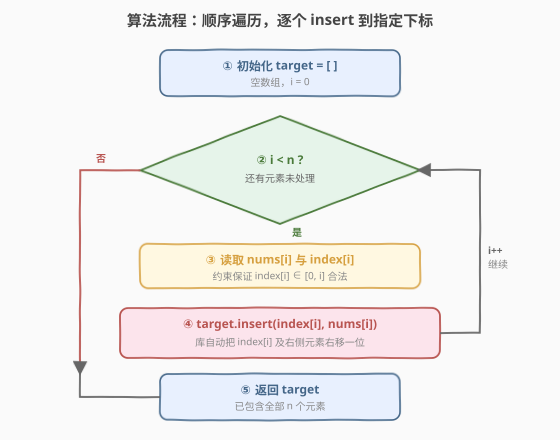

# LeetCode 按既定顺序创建目标数组 题解

## 1. 题目概述

- **标题 / 题号**：按既定顺序创建目标数组（#1389，easy）
- **链接**：https://leetcode.cn/problems/create-target-array-in-the-given-order/
- **难度**：简单
- **标签**：数组、模拟

**题意**：给你两个整数数组 `nums` 和 `index`。你需要按照以下规则创建**目标数组** `target`：

1. `target` 最初为**空**。
2. 按从左到右的顺序依次读取 `nums[i]` 和 `index[i]`，在 `target` 的下标 `index[i]` 处**插入**值 `nums[i]`。
3. 重复上一步，直到 `nums` 和 `index` 中都没有要读取的元素。

返回目标数组。题目保证**数字插入位置总是存在**。

**示例 1**：

```text
输入：nums = [0,1,2,3,4], index = [0,1,2,2,1]
输出：[0,4,1,3,2]
解释：
nums       index     target
0            0        [0]
1            1        [0,1]
2            2        [0,1,2]
3            2        [0,1,3,2]
4            1        [0,4,1,3,2]
```

**示例 2**：

```text
输入：nums = [1,2,3,4,0], index = [0,1,2,3,0]
输出：[0,1,2,3,4]
解释：
nums       index     target
1            0        [1]
2            1        [1,2]
3            2        [1,2,3]
4            3        [1,2,3,4]
0            0        [0,1,2,3,4]
```

**示例 3**：

```text
输入：nums = [1], index = [0]
输出：[1]
```

**约束**：

- `1 <= nums.length, index.length <= 100`
- `nums.length == index.length`
- `0 <= nums[i] <= 100`
- `0 <= index[i] <= i`

> 💡 本题是**纯模拟**题：把题目描述的「逐个插入」过程原样翻译成代码即可。唯一值得注意的是插入的**「挤开」语义**——在中间位置插入时，该位置及其右侧的元素要整体右移一位。而约束 `0 <= index[i] <= i` 恰好保证每次插入位置都合法，无需任何边界特判。

## 2. 解题思路

### 2.1 朴素思路：直接模拟插入

最直观的做法就是**照着题意一步步走**：维护一个动态数组 `target`，从 `i = 0` 到 `n-1`，每步把 `nums[i]` 插入到 `target[index[i]]` 的位置。

- 插入操作由语言内置库直接提供：C++ 的 `vector::insert`、Python 的 `list.insert`，都会在指定下标处插入并把后续元素右移。
- $n \le 100$ 极小，即便每次插入最坏搬移 $O(n)$ 个元素，总工作量 $O(n^2)$ 也只有约 $10^4$ 次操作，毫秒级通过。

> ⚠️ 朴素模拟**就是本题的正解**，没有更「巧」的必要。下文的核心观察不是为了换解法，而是讲清「为什么直接模拟不会出错」以及「插入到底做了什么」。

### 2.2 核心观察：约束保证合法 + 插入的挤开语义

![核心观察：插入挤开右侧元素，约束 0≤index[i]≤i 保证位置合法](../images/1389_concept.svg)

**关键洞察有两点**：

**① 插入 = 挤开**。在下标 `p` 处插入一个值，意味着原 `target[p..]` 的所有元素**整体右移一位**，新值落入空出的 `p` 号位。这就是为什么「后插的元素能排到先插元素的前面」——示例 1 中第 5 步把 `4` 插到下标 `1`，把原本的 `1, 3, 2` 全部向右挤了一位，得到 `[0, 4, 1, 3, 2]`。

**② 约束 `0 <= index[i] <= i` 恰好保证合法**。插入第 `i` 个元素（下标从 0 计）时，`target` 中已有 `i` 个元素，合法下标范围是 `[0, i]`（含末尾追加）。题目约束 `index[i] <= i` 正好落在此范围内，因此**每次插入位置必然存在**，无需做越界检查：

| 步骤 `i` | 插入前 `target` 长度 | 合法下标范围 | 约束 `index[i]` |
|----------|----------------------|--------------|------------------|
| 0 | 0 | `[0, 0]` | `0 <= index[0] <= 0` |
| 1 | 1 | `[0, 1]` | `0 <= index[1] <= 1` |
| 2 | 2 | `[0, 2]` | `0 <= index[2] <= 2` |
| … | … | … | … |
| `i` | `i` | `[0, i]` | `0 <= index[i] <= i` |

> 💡 这张表揭示了约束的设计意图：`index[i] <= i` 不是随意限制，而是**精确对应「插入前数组长度」**。正因如此，题目才敢声明「数字插入位置总是存在」——这是约束与操作的天然吻合，而非需要额外验证的巧合。

### 2.3 算法流程图



**完整步骤**：

1. 初始化空数组 `target = []`。
2. 令 `i` 从 `0` 遍历到 `n - 1`：
   - 读取 `nums[i]` 与 `index[i]`；
   - 执行 `target.insert(index[i], nums[i])`——库自动把 `index[i]` 及右侧元素右移，新值就位。
3. 遍历结束，返回 `target`。

> 💡 整个流程只有一个循环 + 一次插入调用，没有任何分支判断或特判——约束 `0 <= index[i] <= i` 已经替我们消除了所有边界情况。

### 2.4 示例演算

以示例 1 `nums = [0,1,2,3,4]`、`index = [0,1,2,2,1]` 为例逐步推演：

![示例演算：5 步插入得到 [0,4,1,3,2]](../images/1389_example_walkthrough.svg)

| 步骤 `i` | `nums[i]` | `index[i]` | 插入后 `target` | 发生了什么 |
|----------|-----------|------------|------------------|------------|
| 0 | 0 | 0 | `[0]` | 空数组首插，无挤开 |
| 1 | 1 | 1 | `[0,1]` | 末尾追加，无挤开 |
| 2 | 2 | 2 | `[0,1,2]` | 末尾追加，无挤开 |
| 3 | 3 | 2 | `[0,1,3,2]` | 插在下标 2，原 `2` 右移一位 |
| 4 | 4 | 1 | `[0,4,1,3,2]` | 插在下标 1，原 `1,3,2` 整体右移 |

重点看第 4 步：把 `4` 插到下标 `1`，下标 `1` 及其右侧的 `1, 3, 2` **全部右移一位**，`4` 占据空出的 `1` 号位，最终得到 `[0, 4, 1, 3, 2]`。这正是「挤开」语义的体现——后插的 `4` 反而排到了先插的 `1` 前面。

## 3. 参考代码

### C++

```cpp
// 按既定顺序创建目标数组.cpp —— 顺序模拟插入，O(n^2)
// 编译: g++ -O2 -std=c++17 按既定顺序创建目标数组.cpp -o targetarr
#include <vector>
using namespace std;

class Solution {
public:
    vector<int> createTargetArray(vector<int>& nums, vector<int>& index) {
        vector<int> target;
        target.reserve(nums.size());
        for (int i = 0; i < (int)nums.size(); ++i)
            target.insert(target.begin() + index[i], nums[i]);
        return target;
    }
};
```

### Python

```python
class Solution:
    def createTargetArray(self, nums: list[int], index: list[int]) -> list[int]:
        target = []
        for x, p in zip(nums, index):
            target.insert(p, x)
        return target
```

> 💡 两版等价，核心都是「**一次循环 + 一次 insert**」。C++ 的 `target.insert(pos, val)` 在 `pos` 迭代器处插入并把后续元素右移；Python 的 `list.insert(i, x)` 同理。`reserve` 仅做容量预留以减少扩容开销，不影响正确性。

> ⚠️ **别写成 `target[index[i]] = nums[i]`**——下标赋值是「覆盖」而非「插入」，会直接吞掉原位置的值，不右移任何元素。题目要求的是**插入**（挤开右侧），必须用 `insert`。

## 4. 复杂度分析

| 维度 | 模拟插入法（推荐） | 逆序 + 树状数组（进阶，见第 5 节） |
|------|--------------------|------------------------------------|
| **时间** | $O(n^2)$ | $O(n \log n)$ |
| **空间** | $O(n)$（输出本身） | $O(n)$（输出 + 树状数组） |
| **额外空间** | $O(1)$ | $O(n)$ |
| **实际运算量** | $n=100$ 约 $5\times10^3$ 次搬移 | 约 $100 \times 7$ 次树状数组操作 |

- **模拟插入法**：第 $i$ 次插入最坏搬移 $i$ 个元素，总搬移量 $\sum_{i=1}^{n} i = O(n^2)$。但 $n \le 100$ 时 $n^2 = 10^4$，常数极小，是工程上最清晰的正解。
- **逆序 + 树状数组**：用 $O(n)$ 额外空间维护空位，每次「找第 $k$ 个空位 + 标记占用」均为 $O(\log n)$，总 $O(n \log n)$。仅当 $n$ 放大到 $10^5$ 级别时才有必要。

> ⚠️ 本题 $n \le 100$，$O(n^2)$ 与 $O(n \log n)$ 的差距可忽略。面试中写出模拟插入法即可，树状数组版作为「能否优化」的追问储备见第 5 节。

## 5. 扩展：逆序处理 + 树状数组找第 k 个空位（O(n log n)）

模拟插入的瓶颈在于「每次插入都要搬移一段元素」。换一个视角可以**完全消除搬移**：先算出每个元素的**最终位置**，再一次性写入。

**核心思路：从右往左处理**。最后插入的元素不会被任何后续操作挤动，其最终位置就是 `index[n-1]`；倒数第二个元素只可能被最后一个元素「占走」一个位置，因此它的最终位置是**除去最后一个元素所占位置后**的第 `index[n-2]` 个空位……一般地：

> 从右往左处理元素 $i$ 时，比它晚插入的元素（$i+1, \dots, n-1$）已各就各位。元素 $i$ 的最终位置，是剩余 $n - (n-1-i) = i+1$ 个空位中的第 `index[i]` 个（0 索引）。

于是问题归约为：**维护 $n$ 个空位，反复「查询第 $k$ 个空位 + 标记占用」**。用树状数组（BIT）维护每个位置是否为空（空=1，占用=0），前缀和即为「到该位置为止的空位数」；「找第 $k$ 个空位」等价于**在 BIT 上二分找前缀和首次 $\ge k+1$ 的位置**（BIT 的二进制倍增写法，$O(\log n)$）。

以示例 1 验证（空位用下标集合表示）：

| 处理 $i$ | `nums[i]` | `index[i]` | 剩余空位 | 第 `index[i]` 个空位（0 索引） | 落位 |
|----------|-----------|------------|--------------|--------------------------------|------|
| 4 | 4 | 1 | `{0,1,2,3,4}` | 第 1 个 = 下标 1 | `res[1]=4` |
| 3 | 3 | 2 | `{0,2,3,4}` | 第 2 个 = 下标 3 | `res[3]=3` |
| 2 | 2 | 2 | `{0,2,4}` | 第 2 个 = 下标 4 | `res[4]=2` |
| 1 | 1 | 1 | `{0,2}` | 第 1 个 = 下标 2 | `res[2]=1` |
| 0 | 0 | 0 | `{0}` | 第 0 个 = 下标 0 | `res[0]=0` |

最终 `res = [0,4,1,3,2]`，与正序模拟完全一致。

### Python

```python
class Solution:
    def createTargetArray(self, nums: list[int], index: list[int]) -> list[int]:
        n = len(nums)
        bit = [0] * (n + 1)

        def add(i: int, v: int) -> None:
            i += 1
            while i <= n:
                bit[i] += v
                i += i & -i

        def kth(k: int) -> int:
            """最小的 0-indexed pos，使前缀和 >= k（k 从 1 计）。"""
            pos, pw = 0, 1
            while (pw << 1) <= n:
                pw <<= 1
            while pw:
                if pos + pw <= n and bit[pos + pw] < k:
                    k -= bit[pos + pw]
                    pos += pw
                pw >>= 1
            return pos  # 0-indexed

        for i in range(n):
            add(i, 1)                      # 初始全空
        res = [0] * n
        for i in range(n - 1, -1, -1):     # 逆序处理
            p = kth(index[i] + 1)          # 第 (index[i]+1) 个空位
            res[p] = nums[i]
            add(p, -1)                     # 标记占用
        return res
```

### C++

```cpp
#include <vector>
using namespace std;

class Solution {
public:
    vector<int> createTargetArray(vector<int>& nums, vector<int>& index) {
        int n = nums.size();
        vector<int> bit(n + 1, 0);
        auto add = [&](int i, int v) {
            for (i += 1; i <= n; i += i & -i) bit[i] += v;
        };
        auto kth = [&](int k) -> int {  // 最小 0-indexed pos，前缀和 >= k
            int pos = 0, pw = 1;
            while ((pw << 1) <= n) pw <<= 1;
            for (; pw > 0; pw >>= 1)
                if (pos + pw <= n && bit[pos + pw] < k) {
                    k -= bit[pos + pw];
                    pos += pw;
                }
            return pos;
        };
        for (int i = 0; i < n; ++i) add(i, 1);
        vector<int> res(n);
        for (int i = n - 1; i >= 0; --i) {
            int p = kth(index[i] + 1);
            res[p] = nums[i];
            add(p, -1);
        }
        return res;
    }
};
```

> 💡 这套「逆序 + 树状数组找第 $k$ 个空位」的范式是**插入类问题的通用加速器**：凡涉及「按给定位置逐个插入、后续插入会挤动先前元素」的场景（如排队落座、座位预留），都可套用此法把 $O(n^2)$ 降到 $O(n \log n)$。核心是把「动态插入」转成「静态求最终位置」——**反过来想，挤开就消失了**。

> ⚠️ `kth` 的二进制倍增写法要求 BIT 内部以 1 为起始下标，因此 `add`/`kth` 内部都做了 `i += 1` 的偏移。`kth(k)` 返回的是 0-indexed 位置，与 `res` 下标一致。`index[i] + 1` 是因为我们要找「第 `index[i]` 个空位（0 索引）」= 前缀和首次 $\ge \text{index[i]}+1$。

## 6. 面试要点

1. **为什么直接用 `insert` 模拟就是正解？**

   > 题目本质就是把一段「插入指令序列」翻译成结果数组，模拟即忠实执行。$n \le 100$ 时 $O(n^2)$ 完全可接受，且代码极简、不易出错。强行上树状数组反而增加复杂度与出错面，属于过度优化。

2. **约束 `0 <= index[i] <= i` 的作用是什么？**

   > 插入第 `i` 个元素时 `target` 已有 `i` 个元素，合法下标为 `[0, i]`。`index[i] <= i` 恰好保证插入位置始终在此范围内，因此「位置总是存在」是约束**直接保证**的，代码无需任何越界检查或特判。

3. **插入和下标赋值有何区别？**

   > `insert(p, x)` 是**插入**：原 `p` 及右侧元素整体右移一位，`x` 落入 `p`，数组长度 +1。`target[p] = x` 是**覆盖**：直接替换 `p` 处的值，不右移、长度不变。本题要求插入（挤开右侧），必须用 `insert`；用错会丢失原有元素。

4. **时间复杂度为什么是 $O(n^2)$？**

   > 第 $i$ 次插入最坏要搬移 $i$ 个元素（插在头部时全部右移），总搬移量 $\sum_{i=0}^{n-1} i = \frac{n(n-1)}{2} = O(n^2)$。这是顺序模拟的固有代价——每次插入都可能引发大规模搬移。

5. **如何把复杂度优化到 $O(n \log n)$？**

   > 逆序处理：从最后一个元素开始，每个元素的最终位置只受「比它晚插入的元素」影响——它占据剩余空位中的第 `index[i]` 个。用树状数组维护空位（空=1），「找第 $k$ 个空位」用 BIT 二进制倍增二分 $O(\log n)$，「标记占用」更新 $O(\log n)$，共 $n$ 轮，总计 $O(n \log n)$。详见第 5 节。

> 💡 **一句话总结**：1389 的灵魂是「**忠实模拟插入的挤开语义**」——约束 `0 <= index[i] <= i` 替我们兜住所有边界，一次循环 + 一次 `insert` 即得正解；进阶则用「逆序 + 树状数组找第 $k$ 个空位」把搬移消去，从 $O(n^2)$ 降到 $O(n \log n)$。

## 同类练习题

| # | 题目 | 与本题的关联 |
|---|------|-------------|
| 1089 | [复写零](https://leetcode.cn/problems/duplicate-zeros/)（[题解](../1001-1100/1089_复写零.md)） | 同为「数组内插入引发右移」的模拟题，原地复写每个零需把后续元素整体后移，挤开语义与本题完全同源 |
| 27 | [移除元素](https://leetcode.cn/problems/remove-element/)（[题解](../0001-0100/27_移除元素.md)） | 数组原地操作的镜像题——本题是「插入挤开右移」，27 题是「删除左移填空」，对照理解搬移方向 |
| 189 | [旋转数组](https://leetcode.cn/problems/rotate-array/) | 整体移位题，把数组末尾元素搬到头部，涉及大规模元素搬迁，对比本题「逐个局部插入」与「整体轮转」两类移位 |
| 922 | [按奇偶排序数组 II](https://leetcode.cn/problems/sort-array-by-parity-ii/)（[题解](../0901-1000/922_按奇偶排序数组II.md)） | 按规则把元素放到指定下标，同样是「按位置约束重排数组」，双指针就地放置 |
| 1929 | [数组串联](https://leetcode.cn/problems/concatenation-of-array/) | 最简单的数组构造题，按给定顺序拼出新数组，作为本题「顺序构建目标数组」的退化基础 |
