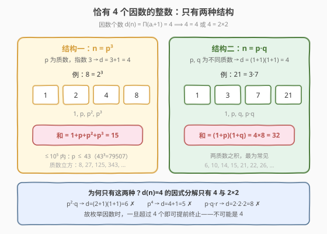
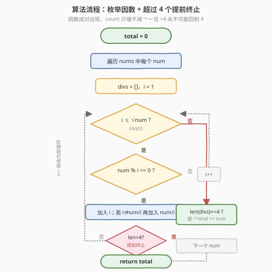
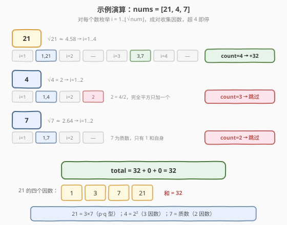

# 四因数

- **题目名称**：四因数
- **链接**：[1390. 四因数](https://leetcode.cn/problems/four-divisors/)
- **难度**：中等
- **标签**：数学、枚举、因数、数论

## 1. 题目概述

给定一个整数数组 `nums`，请你返回该数组中**恰有四个因数**的这些整数的**各因数之和**。如果数组中不存在满足题意的整数，则返回 `0`。

**示例 1**：

```text
输入：nums = [21,4,7]
输出：32
解释：
21 有 4 个因数：1, 3, 7, 21  → 和为 32
4  有 3 个因数：1, 2, 4       → 不计入
7  有 2 个因数：1, 7           → 不计入
答案仅为 21 的所有因数之和 = 32。
```

**示例 2**：

```text
输入：nums = [21,21]
输出：64
解释：两个 21 各贡献 32，合计 64。
```

**示例 3**：

```text
输入：nums = [1,2,3,4,5]
输出：0
解释：1 只有 1 个因数；2/3/5 为质数各 2 个；4 = 2² 有 3 个，均不为 4。
```

**约束条件**：

- $1 \le \text{nums.length} \le 10^4$
- $1 \le \text{nums[i]} \le 10^5$

> 💡 本题两件事：① 判断一个数是否**恰有 4 个因数**；② 若是，求这 4 个因数之和。关键在于「4 个因数」背后的**数论结构**——它极大限制了数的可能形态，从而既能提前剪枝、又能给出求和的封闭公式。

---

## 2. 解题思路

### 2.1 暴力思路

对每个 `num`，从 $1$ 枚举到 $num$ 统计因数个数并累加因数。若恰有 $4$ 个，把和加入答案。

问题：$num \le 10^5$、数组长度 $\le 10^4$，逐数线性扫到 $num$ 是 $10^4 \times 10^5 = 10^9$ 次，超时。和绝大多数因数题一样，因数是**成对且关于 $\sqrt{n}$ 对称**出现的，无需扫到 $num$。

### 2.2 核心观察：4 个因数只有两种结构 + 超过 4 即剪枝



**① 4 个因数的数论结构：只有两种**

设 $n$ 的质因数分解为 $n = p_1^{a_1} p_2^{a_2} \cdots$，则因数个数 $d(n) = \prod_i (a_i + 1)$。要求 $d(n) = 4$，而 $4$ 的整数分解只有两种：

| 结构 | 形式 | 因数 | 因数和（封闭公式） | 示例 |
|------|------|------|--------------------|------|
| **结构一** | $n = p^3$（$p$ 质数） | $1,\ p,\ p^2,\ p^3$ | $1 + p + p^2 + p^3$ | $8 = 2^3$，和 $= 15$ |
| **结构二** | $n = p \cdot q$（$p, q$ 不同质数） | $1,\ p,\ q,\ p q$ | $(1+p)(1+q)$ | $21 = 3 \cdot 7$，和 $= (1+3)(1+7) = 32$ |

> ⚠️ **为何只有这两种？** $d(n) = 4$ 的因式分解只有 $4 = 4$（单个质因数指数 $3$）与 $4 = 2 \times 2$（两个质因数各指数 $1$）。其他结构如 $p^2 q$（$d = 3 \times 2 = 6$）、$p^4$（$d = 5$）、$p q r$（$d = 2 \times 2 \times 2 = 8$）都不等于 $4$。

**② 因数成对出现，count 只增不减 → 一旦超过 4 即可提前终止**

枚举 $i = 1 \ldots \lfloor\sqrt{n}\rfloor$ 时，每个因子 $i$ 配对一个 $n/i$（完全平方时 $i = n/i$ 只算一个）。每命中一对，因数计数 $+2$（或 $+1$）。计数**单调不减**：一旦超过 $4$，后续只会更多，**永远不可能回到恰为 $4$**。故 `count > 4` 时立即 `break`，绝大多数「不合资格」的数在头几步即被剪掉。

> 💡 这正是结构①的实践价值：不需要真的把所有因数找全，只要在搜到第 3 对（count 跳到 6）时果断放弃。质数（只 1 对）、$p^2$（1 对 + 1 个）、$p^2 q$（搜到第 2 对即 count=6 剪枝）都能极早退出。

### 2.3 算法流程图



**主流程**：

1. `total = 0`。
2. 遍历 `nums` 中每个 `num`：维护 `divs`（因数列表）、`i = 1`。
3. 当 $i \le \lfloor\sqrt{num}\rfloor$：
   - 若 `num % i == 0`：加入 $i$；若 $i \ne num/i$ 再加入 $num/i$。
   - 若 `len(divs) > 4`：`break`（提前终止，不可能是 4）。
   - `i += 1`。
4. 若 `len(divs) == 4`：`total += sum(divs)`。
5. 返回 `total`。

> 💡 **为何用 `len(divs) > 4` 而非 `== 4` 作为剪枝条件？** count 单调递增，等于 4 时仍可能后续涨到 6，不能停；只有「超过 4」才确定无望。最终资格判定统一在循环结束后用 `== 4` 收口。

### 2.4 示例演算

以 `nums = [21, 4, 7]` 为例：



**`num = 21`，$\lfloor\sqrt{21}\rfloor = 4$**：

| $i$ | $21 \bmod i$ | 命中因数对 | `divs` | `len` |
|-----|--------------|-----------|--------|-------|
| 1 | 0 | $(1,\ 21)$ | `[1, 21]` | 2 |
| 2 | 1 | — | `[1, 21]` | 2 |
| 3 | 0 | $(3,\ 7)$ | `[1, 21, 3, 7]` | 4 |
| 4 | 1 | — | `[1, 21, 3, 7]` | 4 |

扫描结束 `len == 4`，和 $= 1+3+7+21 = 32$，`total += 32`。$21 = 3 \times 7$ 属结构二。

**`num = 4`，$\lfloor\sqrt{4}\rfloor = 2$**：

| $i$ | $4 \bmod i$ | 命中因数 | `divs` | `len` |
|-----|------------|----------|--------|-------|
| 1 | 0 | $(1,\ 4)$ | `[1, 4]` | 2 |
| 2 | 0 | $2$（$2 = 4/2$，完全平方只算一个） | `[1, 4, 2]` | 3 |

`len == 3 ≠ 4`，跳过。$4 = 2^2$ 只有 $3$ 个因数。

**`num = 7`，$\lfloor\sqrt{7}\rfloor = 2$**：

| $i$ | $7 \bmod i$ | 命中因数对 | `divs` | `len` |
|-----|------------|-----------|--------|-------|
| 1 | 0 | $(1,\ 7)$ | `[1, 7]` | 2 |
| 2 | 1 | — | `[1, 7]` | 2 |

`len == 2 ≠ 4`，跳过。$7$ 为质数，只有 $2$ 个因数。

**最终**：$\text{total} = 32 + 0 + 0 = 32$。

> 💡 此例覆盖了三种典型：$p \cdot q$ 型（21，命中）、$p^2$ 型（4，因完全平方少算一个）、质数（7，仅 1 对）。完全平方的「$i = num/i$ 只算一个」是唯一易错点。

---

## 3. 参考代码

### C++

```cpp
class Solution {
public:
    int sumFourDivisors(vector<int>& nums) {
        int total = 0;
        for (int num : nums) {
            int sum = 0, cnt = 0;
            for (int i = 1; (long long)i * i <= num; ++i) {
                if (num % i == 0) {
                    sum += i;
                    ++cnt;
                    int j = num / i;
                    if (j != i) {       // 完全平方时 i == num/i，只算一个
                        sum += j;
                        ++cnt;
                    }
                    if (cnt > 4) break; // 超过 4 个，提前终止
                }
            }
            if (cnt == 4) total += sum;
        }
        return total;
    }
};
```

### Python

```python
import math

class Solution:
    def sumFourDivisors(self, nums: list[int]) -> int:
        total = 0
        for num in nums:
            divs = []
            for i in range(1, math.isqrt(num) + 1):
                if num % i == 0:
                    divs.append(i)
                    j = num // i
                    if j != i:            # 完全平方时 i == num//i，只算一个
                        divs.append(j)
                    if len(divs) > 4:     # 超过 4 个，提前终止
                        break
            if len(divs) == 4:
                total += sum(divs)
        return total
```

> 💡 **两个实现细节**：
> 1. **循环上界用 `i * i <= num` 而非 `i <= sqrt(num)`**：避免浮点开方的精度误差（参见 [1362 题解](../1301-1400/1362_最接近的因数.md) 第 3 节对 `(int)sqrt` 误差的讨论）。C++ 中 `(long long)i * i` 防止 `i * i` 在 `int` 下溢出；Python 用 `math.isqrt(num)` 精确取整数平方根。
> 2. **完全平方数的判定 `j != i`**：当 $num$ 是完全平方数且 $i = \sqrt{num}$ 时，$i = num/i$，因数只计一次。漏判会多算一个，导致 count 与 sum 都出错（如 $4$ 会错算成 4 个因数）。

---

## 4. 复杂度分析

| 维度 | 复杂度 | 说明 |
|------|--------|------|
| **时间** | $O(n \cdot \sqrt{m})$ | $n = \text{len(nums)}$，$m = \max(\text{nums})$；每数至多扫 $\lfloor\sqrt{m}\rfloor \approx 316$ 次，实际因提前剪枝远小于此；总计约 $10^4 \times 316 \approx 3.2 \times 10^6$ |
| **空间** | $O(1)$ | 仅常数个变量（C++ 版）；Python 版 `divs` 至多存 6 个元素，亦可视 $O(1)$ |

> 💡 $m \le 10^5$ 下 $\sqrt{m} \le 316$，$O(n\sqrt{m})$ 在毫秒级。若 $m$ 放大到 $10^9$（$\sqrt{} \approx 31623$）仍可接受；再大则需改用第 5 节的 SPF 质因数分解法。

---

## 5. 扩展：SPF 最小质因子筛 + 封闭公式求和

利用 2.2 节的结构结论（$p^3$ 或 $p \cdot q$），可把单数判定从 $O(\sqrt{m})$ 降到 $O(\log m)$：预处理**最小质因子筛**（SPF，线性筛/埃氏筛变体），对每个 `num` 取最小质因子 $p$，再用 $rest = num/p$ 的质性与结构判定属于哪种 4-因数形态，直接套封闭公式求和。

**判定逻辑**（$num > 1$，$p = \text{spf}[num]$，$rest = num / p$）：

- $rest = 1$：$num = p$ 为质数，$2$ 个因数，跳过。
- $rest = p$：$num = p^2$，$3$ 个因数，跳过。
- $\text{spf}[rest] = rest$（$rest$ 为质数）且 $rest \ne p$：$num = p \cdot q$（结构二），和 $= (1+p)(1+rest)$。
- $rest = p \cdot p$：$num = p^3$（结构一），和 $= 1 + p + p^2 + p^3$。
- 其余：因数个数 $\ne 4$，跳过。

```python
class Solution:
    def sumFourDivisors(self, nums: list[int]) -> int:
        maxv = max(nums)
        # 最小质因子筛：spf[v] = v 的最小质因数
        spf = list(range(maxv + 1))
        for i in range(2, int(maxv ** 0.5) + 1):
            if spf[i] == i:                       # i 是质数
                for j in range(i * i, maxv + 1, i):
                    if spf[j] == j:
                        spf[j] = i
        total = 0
        for num in nums:
            if num <= 1:
                continue
            p = spf[num]
            rest = num // p
            if rest == 1:          # 质数，2 个因数
                continue
            if rest == p:          # p²，3 个因数
                continue
            if spf[rest] == rest:  # rest 质数 → p·q，4 个因数
                total += (1 + p) * (1 + rest)
            elif rest == p * p:    # p³，4 个因数
                total += 1 + p + p * p + p * p * p
        return total
```

> 💡 **正确性要点**：`rest == p * p` 时 $num = p \cdot p^2 = p^3$，此时 $rest = p^2$ 是合数（$\text{spf}[rest] = p \ne rest$），落在 `elif` 分支，判定唯一。$p$ 是最小质因子保证 $p \le q$，无需担心 $rest$ 含比 $p$ 更小的因子。C++ 中 `p * p` 可能溢出 `int`，应用 `(long long)p * p` 比较（$num \le 10^5$ 时 $p \le 46$，实际不溢出，但大数场景需注意）。
>
> **复杂度**：筛 $O(m \log \log m)$，每数 $O(\log m)$ 分解；$m = 10^5$ 时筛约 $10^5$ 次操作，远优于逐数 $O(\sqrt{m})$。当 $m$ 放大到 $10^{12}$ 时配合 Pollard-Rho 分解仍可工作，是数论题的通用重型武器。

---

## 6. 面试要点

1. **一个数恰有 4 个因数，它一定是什么形态？**

   > 只有两种：$n = p^3$（$p$ 质数）或 $n = p \cdot q$（$p, q$ 不同质数）。由因数个数公式 $d(n) = \prod(a_i+1) = 4$，$4$ 的分解只有 $4$ 与 $2 \times 2$，分别对应单质因数指数 $3$、两质因数各指数 $1$。这是本题一切优化的根基。

2. **为什么枚举到 $\sqrt{n}$ 就能找全因数？**

   > 因数成对出现：$i \mid n$ 则 $n/i \mid n$，且二者分居 $\sqrt{n}$ 两侧（相等时为完全平方）。故只需扫 $1 \ldots \lfloor\sqrt{n}\rfloor$，每命中 $i$ 同步记录 $n/i$，一遍覆盖全部因数。这是 [507 完美数](https://leetcode.cn/problems/perfect-number/)、[492 构造矩形](https://leetcode.cn/problems/construct-the-rectangle/) 共用的对称枚举模板。

3. **提前终止的 `count > 4` 条件为何不能用 `== 4`？**

   > 因数计数单调不减（每对 $+2$ 或 $+1$）。等于 $4$ 时后续仍可能再命中一对涨到 $6$，此时停会误判；只有「超过 $4$」才确定永远回不到 $4$，可以安全 `break`。最终资格判定统一在循环外用 `== 4` 收口。

4. **完全平方数 `$i = num/i$` 的边界如何处理？**

   > 当 $num$ 是完全平方数且 $i = \sqrt{num}$ 时，$i = num/i$，因数只计一次（否则会多算）。代码用 `if (j != i)` 守卫。漏判会让 $p^2$ 型（如 $4$、$9$）被错算成 4 个因数而误加分。

5. **若 `nums[i]` 放大到 $10^9$，本算法还够用吗？**

   > $O(n\sqrt{m})$ 中 $\sqrt{10^9} \approx 31623$，$n = 10^4$ 时约 $3 \times 10^8$，临界偏慢。改用第 5 节 SPF 筛不行（$m=10^9$ 筛表过大）；应改用 Pollard-Rho 质因数分解（$O(m^{1/4})$）后套 $p^3 / p \cdot q$ 判定与封闭公式，单数 $O(m^{1/4}) \approx 178$ 次。

---

## 7. 同类练习题

- [507. 完美数](https://leetcode.cn/problems/perfect-number/)：枚举真因数求和，同样利用「因数成对、只需搜到 $\sqrt{n}$」的对称性，巩固因数枚举模板
- [1362. 最接近的因数](https://leetcode.cn/problems/closest-divisors/)（[题解](../1301-1400/1362_最接近的因数.md)）：因数对枚举 + 从 $\sqrt{n}$ 向下找首个因子，巩固因子对称枚举与整数平方根写法
- [492. 构造矩形](https://leetcode.cn/problems/construct-the-rectangle/)：单数最接近因数对母题，$\sqrt{n}$ 对称枚举的基础范式，1362 的直接前置
- [204. 计数质数](https://leetcode.cn/problems/count-primes/)：埃氏筛 / 线性筛，第 5 节 SPF 最小质因子筛的基底，数论筛法的入门
- [367. 有效的完全平方数](https://leetcode.cn/problems/valid-perfect-square/)：判定完全平方数，对应本题「$i = num/i$ 完全平方只算一个因数」的边界处理与整数平方根实现
