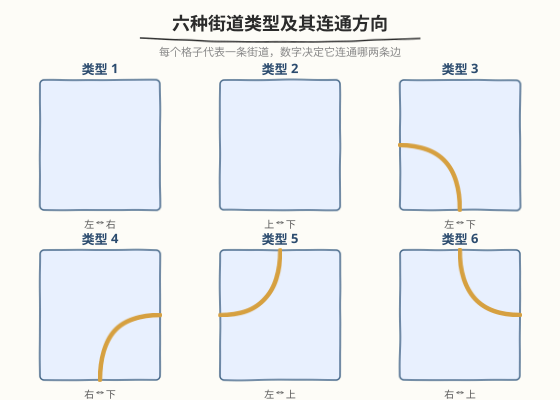
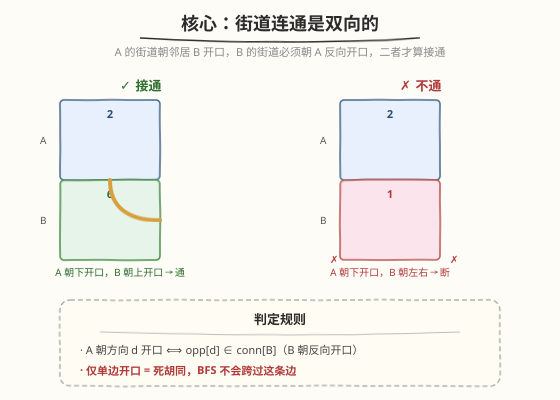
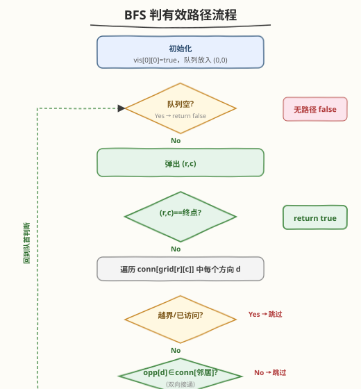
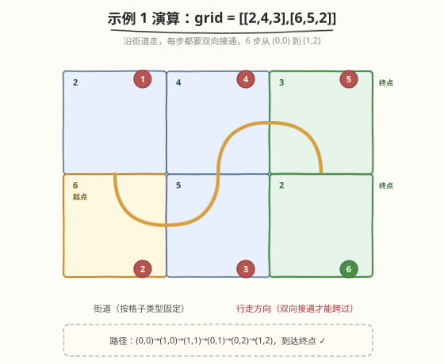

# LeetCode 检查网格中是否存在有效路径 题解

## 1. 题目概述

- **标题 / 题号**：检查网格中是否存在有效路径（#1391，medium）
- **链接**：https://leetcode.cn/problems/check-if-there-is-a-valid-path-in-a-grid/
- **难度**：中等
- **标签**：图、广度优先搜索、深度优先搜索、网格

**题意**：给你一个 $m \times n$ 的网格 `grid`，每个格子代表一条街道，`grid[i][j]` 的取值表示该格子的街道连通哪两个相邻格：

- `1` 表示连接**左**单元格和**右**单元格的街道。
- `2` 表示连接**上**单元格和**下**单元格的街道。
- `3` 表示连接**左**单元格和**下**单元格的街道。
- `4` 表示连接**右**单元格和**下**单元格的街道。
- `5` 表示连接**左**单元格和**上**单元格的街道。
- `6` 表示连接**右**单元格和**上**单元格的街道。

你最开始从左上角 `(0,0)` 出发，**有效路径**指从 `(0,0)` 沿街道走到右下角 `(m-1, n-1)` 的路径。**不能变更街道**（即只能顺着格子已固定的街道走）。存在有效路径返回 `true`，否则 `false`。

**示例 1**：

```text
输入：grid = [[2,4,3],[6,5,2]]
输出：true
解释：可以从 (0,0) 出发： (0,0)→(1,0)→(1,1)→(0,1)→(0,2)→(1,2)，访问所有格子并到达终点。
```

**示例 2**：

```text
输入：grid = [[1,2,1],[1,2,1]]
输出：false
解释：(0,0) 上的街道 1 朝左右开口，左越界、右邻 (0,1)=2 朝上下开口——单向开口不接通，停在 (0,0)。
```

**示例 3**：

```text
输入：grid = [[1,1,2]]
输出：false
解释：(0,0)→(0,1)（同为 1，左右互通），但 (0,1)=1 朝右开口、(0,2)=2 朝上下开口，不接通，停在 (0,1)。
```

**示例 4**：

```text
输入：grid = [[1,1,1,1,1,1,3]]
输出：true
```

**示例 5**：

```text
输入：grid = [[2],[2],[2],[2],[2],[2],[6]]
输出：true
```

**约束**：

- `m == grid.length`，`n == grid[i].length`
- `1 <= m, n <= 300`
- `1 <= grid[i][j] <= 6`

> 💡 网格最多 $9 \times 10^4$ 格，每格至多 2 条出边，边数 $E \le 2mn$。题目只问**能否到达**终点——典型的**图可达性问题**，BFS / DFS 均可，复杂度 $O(mn)$。

## 2. 解题思路

### 2.1 暴力思路：DFS 枚举所有路径不剪枝

从 `(0,0)` 出发递归，每步尝试当前格子街道连通的两个方向走到邻居，到达 `(m-1,n-1)` 即返回 `true`。但若不做「已访问」标记，两个互相连通的格子之间可来回反复走，导致**无法终止**或指数级展开。

> ⚠️ 关键误区和普通迷宫搜索一样：每个格子的出边固定（至多两条），只要加 `visited` 标记保证每格至多入队一次，复杂度立刻降到 $O(mn)$。但本题比一般迷宫多一层约束——**街道是双向的**：A 朝 B 开口还不够，B 必须朝 A 反向开口才算接通。

### 2.2 核心观察：双向连通判定 + BFS



先把 6 种街道的连通方向用「上/右/下/左」编码（方向编号 `0=上, 1=右, 2=下, 3=左`，反方向 `opp = {2,3,0,1}`，即上↔下、左↔右）：

| 类型 | 连通方向 | 形状 |
|------|----------|------|
| 1 | 右、左 | `─` 横向 |
| 2 | 上、下 | `│` 纵向 |
| 3 | 左、下 | `┐` 左下弯 |
| 4 | 右、下 | `┌` 右下弯 |
| 5 | 左、上 | `┘` 左上弯 |
| 6 | 右、上 | `└` 右上弯 |



核心思路：

- 把每个格子看作图的一个**节点**，格子之间能否连边取决于**双向开口**：格子 `A` 朝方向 `d` 开口、邻居 `B` 朝 `opp[d]` 开口，二者同时成立才算接通。
- **问题转化**：从 `(0,0)` 出发能否到达 `(m-1,n-1)`——图的**可达性问题**，BFS + `visited` 一次性访问。
- **为什么只需访问一次？** 本题只问「能否到达」，不问最短步数或路径数。一个格子被访问后，它所有能到达的格子都会在后续 BFS 中被探索；经其它路径再次到达同一格子不会带来新的可达信息。`visited` 布尔标记足以保证 $O(mn)$ 复杂度。

> 💡 **双向判定的本质**：本题的图是**无向图**（街道双向通），但格子的开口信息分散在两端格子里。判定时必须**两端核对**：当前格子朝邻居方向开口 && 邻居朝反方向开口。少任何一端，这条边就不存在——这正是示例 2/3 中「停在半路」的原因。

### 2.3 算法流程图



**完整步骤**：

1. **初始化**：`visited` 全 `false`；队列放入 `(0,0)`，`visited[0][0] = true`。
2. **BFS 循环**：
   - 队列空 → 返回 `false`（所有可达格子探索完，未到终点）。
   - 弹出 `(r,c)`；若 `(r,c) == (m-1, n-1)` → 返回 `true`（命中终点，含 $1 \times 1$ 网格的特例）。
   - 遍历 `conn[grid[r][c]]` 中每个方向 `d`：
     - 计算 `(nr,nc)`，越界 → 跳过。
     - `visited[nr][nc]` 为 `true` → 跳过。
     - **双向核对**：`opp[d]` 不在 `conn[grid[nr][nc]]` 中 → 跳过（邻居没反向开口，死边）。
     - 否则标记 `visited[nr][nc] = true`，`(nr,nc)` 入队。
3. 循环正常结束返回 `false`。

> 💡 **终点判断时机**：在「弹出 `(r,c)` 时检查是否为终点」最稳妥——既覆盖 $1 \times 1$ 网格（起点即终点，入队后立即弹出命中），也避免遗漏。也可以在生成邻居时检查，但需额外处理起点即终点的特判。

### 2.4 示例演算

以示例 1 `grid = [[2,4,3],[6,5,2]]` 为例：



逐段核对双向连通（方向 `0=上,1=右,2=下,3=左`）：

| 步 | 当前格 | 街道 | 走向 d | 邻居 | 邻居街道 | 反向 opp[d] 在邻居? | 通? |
|----|--------|------|--------|------|----------|---------------------|-----|
| 1 | (0,0) | 2 | 下 2 | (1,0) | 6 | 上 0 ∈ {0,1} ✓ | ✓ |
| 2 | (1,0) | 6 | 右 1 | (1,1) | 5 | 左 3 ∈ {0,3} ✓ | ✓ |
| 3 | (1,1) | 5 | 上 0 | (0,1) | 4 | 下 2 ∈ {1,2} ✓ | ✓ |
| 4 | (0,1) | 4 | 右 1 | (0,2) | 3 | 左 3 ∈ {2,3} ✓ | ✓ |
| 5 | (0,2) | 3 | 下 2 | (1,2) | 2 | 上 0 ∈ {0,2} ✓ | ✓ |
| 6 | (1,2) | — | — | — | — | 到达终点 | ✓ return true |

> 💡 **示例 2 为什么 false？** `(0,0)=1` 朝右开口，邻居 `(0,1)=2` 朝上下开口，`opp[右]=左` 不在 `{上,下}` 中——单向开口断开，队列为空返回 `false`。**示例 3** 类似：`(0,1)=1` 朝右、`(0,2)=2` 朝上下，左∉{上,下}，断在 `(0,1)`。

## 3. 参考代码

### C++

```cpp
// 检查网格中是否存在有效路径.cpp —— BFS + 双向连通判定
// 编译: g++ -O2 -std=c++17 检查网格中是否存在有效路径.cpp -o g1391
class Solution {
public:
    bool hasValidPath(vector<vector<int>>& grid) {
        int m = grid.size(), n = grid[0].size();
        // 方向 0=上 1=右 2=下 3=左
        const int dr[] = {-1, 0, 1, 0};
        const int dc[] = {0, 1, 0, -1};
        const int opp[] = {2, 3, 0, 1};          // 上↔下, 左↔右
        // 每种街道连通的方向集合（下标 0 占位）
        const vector<vector<int>> conn = {
            {},        // 0
            {1, 3},    // 1: 左右
            {0, 2},    // 2: 上下
            {2, 3},    // 3: 左下
            {1, 2},    // 4: 右下
            {0, 3},    // 5: 左上
            {0, 1}     // 6: 右上
        };
        vector<vector<char>> vis(m, vector<char>(n, 0));
        queue<pair<int,int>> q;
        q.push({0, 0});
        vis[0][0] = 1;
        while (!q.empty()) {
            auto [r, c] = q.front(); q.pop();
            if (r == m - 1 && c == n - 1) return true;   // 命中终点
            for (int d : conn[grid[r][c]]) {
                int nr = r + dr[d], nc = c + dc[d];
                if (nr < 0 || nr >= m || nc < 0 || nc >= n) continue;
                if (vis[nr][nc]) continue;
                // 邻居必须朝反向开口才算双向接通
                bool ok = false;
                for (int e : conn[grid[nr][nc]]) {
                    if (e == opp[d]) { ok = true; break; }
                }
                if (!ok) continue;
                vis[nr][nc] = 1;
                q.push({nr, nc});
            }
        }
        return false;
    }
};
```

### Python

```python
class Solution:
    def hasValidPath(self, grid: List[List[int]]) -> bool:
        m, n = len(grid), len(grid[0])
        # 方向 0=上 1=右 2=下 3=左
        dr = (-1, 0, 1, 0)
        dc = (0, 1, 0, -1)
        opp = (2, 3, 0, 1)            # 上↔下, 左↔右
        conn = (
            (),        # 0 占位
            (1, 3),    # 1: 左右
            (0, 2),    # 2: 上下
            (2, 3),    # 3: 左下
            (1, 2),    # 4: 右下
            (0, 3),    # 5: 左上
            (0, 1),    # 6: 右上
        )
        from collections import deque
        vis = [[False] * n for _ in range(m)]
        q = deque([(0, 0)])
        vis[0][0] = True
        while q:
            r, c = q.popleft()
            if r == m - 1 and c == n - 1:
                return True                       # 命中终点
            for d in conn[grid[r][c]]:
                nr, nc = r + dr[d], c + dc[d]
                if not (0 <= nr < m and 0 <= nc < n):
                    continue
                if vis[nr][nc]:
                    continue
                if opp[d] not in conn[grid[nr][nc]]:   # 邻居没反向开口
                    continue
                vis[nr][nc] = True
                q.append((nr, nc))
        return False
```

> 💡 **实现细节**：① `conn` 用元组/数组按街道类型直接索引，$O(1)$ 取出两个方向，无需 `if-else` 长链。② `opp[d] not in conn[grid[nr][nc]]` 一行完成双向核对（邻居的连通集最多 2 个元素，线性查找常数极小）。③ `visited` 用 `vector<char>` / `list[bool]` 避免 `vector<bool>` 位压缩的代理引用问题。④ **不需要记录步数**——本题只问可达性。

## 4. 复杂度分析

| 维度 | 复杂度 | 说明 |
|------|--------|------|
| **时间** | $O(mn)$ | 每格至多入队一次、处理一次，每次处理枚举至多 2 个方向、每个方向双向核对 $O(1)$，总计 $O(mn)$ |
| **空间** | $O(mn)$ | `visited` 矩阵 $O(mn)$；队列最坏存全部 $mn$ 个格子 $O(mn)$ |

> ⚠️ 严格时间复杂度是 $O(mn)$ 而非更高：尽管边数至多 $2mn$，但每条边只在源格子被弹出时检查一次，且 `visited` 保证每格只处理一次。$m,n \le 300$ 时约 $9 \times 10^4$ 格，远在限制内。

## 5. 扩展：DFS 递归版本

可达性问题同样可用 DFS 解决，写法更简短，但需注意递归深度。本题 $mn \le 9 \times 10^4$，最坏递归深度可达 $mn$（如全 `2` 纵向街道形成长链），可能触发栈溢出，故**推荐 BFS**。以下是 DFS 版本供对照：

```python
class Solution:
    def hasValidPath(self, grid: List[List[int]]) -> bool:
        m, n = len(grid), len(grid[0])
        dr = (-1, 0, 1, 0)
        dc = (0, 1, 0, -1)
        opp = (2, 3, 0, 1)
        conn = ((), (1, 3), (0, 2), (2, 3), (1, 2), (0, 3), (0, 1))
        vis = [[False] * n for _ in range(m)]

        def dfs(r: int, c: int) -> bool:
            if r == m - 1 and c == n - 1:
                return True
            vis[r][c] = True
            for d in conn[grid[r][c]]:
                nr, nc = r + dr[d], c + dc[d]
                if not (0 <= nr < m and 0 <= nc < n) or vis[nr][nc]:
                    continue
                if opp[d] not in conn[grid[nr][nc]]:
                    continue
                if dfs(nr, nc):
                    return True
            return False

        return dfs(0, 0)
```

```cpp
class Solution {
public:
    bool hasValidPath(vector<vector<int>>& grid) {
        int m = grid.size(), n = grid[0].size();
        const int dr[] = {-1, 0, 1, 0};
        const int dc[] = {0, 1, 0, -1};
        const int opp[] = {2, 3, 0, 1};
        const vector<vector<int>> conn = {
            {}, {1,3}, {0,2}, {2,3}, {1,2}, {0,3}, {0,1}
        };
        vector<vector<char>> vis(m, vector<char>(n, 0));
        function<bool(int,int)> dfs = [&](int r, int c) -> bool {
            if (r == m-1 && c == n-1) return true;
            vis[r][c] = 1;
            for (int d : conn[grid[r][c]]) {
                int nr = r + dr[d], nc = c + dc[d];
                if (nr < 0 || nr >= m || nc < 0 || nc >= n || vis[nr][nc]) continue;
                bool ok = false;
                for (int e : conn[grid[nr][nc]]) if (e == opp[d]) { ok = true; break; }
                if (!ok) continue;
                if (dfs(nr, nc)) return true;
            }
            return false;
        };
        return dfs(0, 0);
    }
};
```

> ⚠️ DFS 用短路求值 `if dfs(nr,nc): return True`，找到终点即停止。最坏仍要遍历全图。若面试官追问「能否改成迭代 DFS」，把 BFS 的 `queue` 换成 `stack` 即可，其余逻辑不变。

## 6. 面试要点

1. **为什么是图问题而不是模拟？**

   > 每个格子是节点，格子间能否连边取决于街道是否双向接通。判断能否从 `(0,0)` 到 `(m-1,n-1)` 就是图的**可达性问题**，BFS/DFS 天然解决。纯模拟「顺着街道方向走」会遗漏「双向核对」——单向开口的格子不能跨过。

2. **为什么需要双向连通判定？**

   > 街道的开口信息分散在两端格子里：`A=1`（左右）朝右开口指向 `B`，但 `B=2`（上下）并不朝左开口，二者实际不接通。必须**两端核对**：当前格子朝方向 `d` 开口且邻居朝 `opp[d]` 开口。这正是示例 2/3 失败的原因。可以理解为无向图建边时两端都要承认这条边。

3. **为什么每个格子只需访问一次？**

   > 本题只问「能否到达」，不问最短路径或路径数。一个格子被访问后，它所有能到达的格子都会在后续 BFS 中被探索；经其它路径再次到达同一格子不会带来新的可达信息。因此 `visited` 布尔标记足以保证 $O(mn)$ 复杂度。

4. **方向编码为什么用 `0/1/2/3` + `opp` 数组？**

   > 用「上右下左」循环编号让反方向满足 `opp[d] = (d+2) % 4`，一行建立映射；街道连通集用元组按类型索引，$O(1)$ 取出。相比 6 个 `if-else` 分支或硬编码 `(dr,dc)` 对，编码统一、扩展容易，且双向核对退化为 `opp[d] in conn[邻居]` 一行。

5. **与 1368 使网格图至少有一条有效路径的最小代价的区别？**

   > 1368 是 1391 的「进阶版」：1368 允许花钱修改格子方向（顺箭头 0 权、改方向 1 权），求最小代价，是 **0-1 BFS 最短路**；1391 不允许修改，只问能否到达，是**朴素 BFS 可达性**。先掌握 1391 的双向连通建图，再叠加 0-1 BFS 即得 1368。

> 💡 **一句话总结**：1391 是「网格隐式图可达性」的招牌题——格子为节点、街道双向连通为边，BFS + `visited` 一次性访问即可 $O(mn)$ 判定能否到达终点。关键细节是**两端核对开口**，避免被单向死边误导。

## 同类练习题

| # | 题目 | 与本题的关联 |
|---|------|-------------|
| 1368 | [使网格图至少有一条有效路径的最小代价](https://leetcode.cn/problems/minimum-cost-to-make-at-least-one-valid-path-in-a-grid/)（[题解](../1301-1400/1368_使网格图至少有一条有效路径的最小代价.md)） | 本题的进阶版，允许改方向付费，0-1 BFS 求最小代价，对照本题的朴素 BFS 可达 |
| 1306 | [跳跃游戏 III](https://leetcode.cn/problems/jump-game-iii/)（[题解](../1301-1400/1306_跳跃游戏%20III.md)） | 隐式图可达性招牌题，下标为节点、`i±arr[i]` 为出边，同「BFS + visited」骨架，对照本题的网格建图 |
| 200 | [岛屿数量](https://leetcode.cn/problems/number-of-islands/)（[题解](../0101-0200/200_岛屿数量.md)） | 网格 BFS/DFS 基础，连通块判定的图搜索母题，巩固 `visited` 一次性访问思想 |
| 994 | [腐烂的橘子](https://leetcode.cn/problems/rotting-oranges/)（[题解](../0901-1000/994_腐烂的橘子.md)） | 多源 BFS 求最短时间，同「网格 BFS + visited」骨架，对照本题单源可达版 |
| 1293 | [网格中的最短路径](https://leetcode.cn/problems/shortest-path-in-a-grid-with-obstacles-elimination/)（[题解](../1201-1300/1293_网格中的最短路径.md)） | 状态增维 BFS，对照本题的「状态即坐标」朴素版，理解何时需要给状态加维度 |
