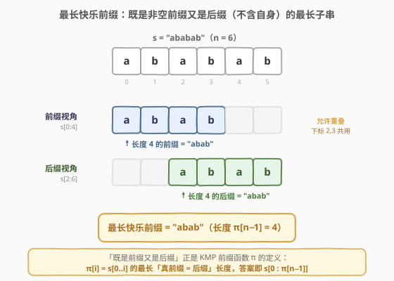
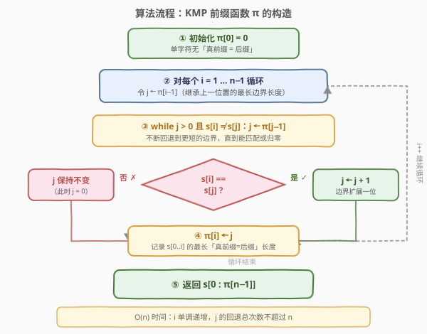
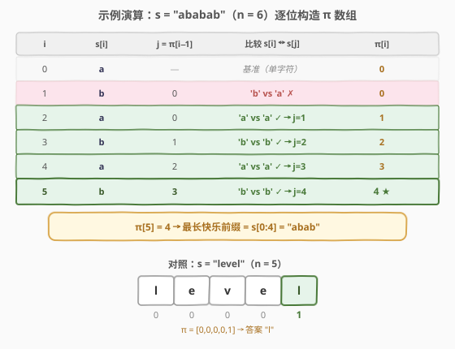

# LeetCode 最长快乐前缀 题解

## 1. 题目概述

- **标题 / 题号**：最长快乐前缀（#1392，hard）
- **链接**：https://leetcode.cn/problems/longest-happy-prefix/
- **难度**：困难
- **标签**：字符串、KMP、前缀函数

**题意**：「快乐前缀」是在原字符串中既是**非空前缀**也是**后缀**（不包括原字符串自身）的字符串。给定字符串 `s`，返回它的**最长快乐前缀**；若不存在则返回 `""`。

**示例 1**：

```text
输入：s = "level"
输出："l"
解释：除 s 自身外有 4 个前缀（"l","le","lev","leve"）与 4 个后缀（"l","el","vel","evel"），最长同时为前后缀的是 "l"。
```

**示例 2**：

```text
输入：s = "ababab"
输出："abab"
解释："abab" 是最长的既是前缀又是后缀的字符串，题目允许前后缀在原串中重叠。
```

**约束**：

- $1 \le \text{s.length} \le 10^5$
- `s` 只含有小写英文字母

> 💡 这正是 KMP **前缀函数** $\pi$ 的定义：$\pi[i]$ 表示 $s[0..i]$ 的最长「真前缀 = 后缀」长度。把 $i$ 取成 $n-1$，$\pi[n-1]$ 就是整个串 $s$ 的最长快乐前缀长度——题目所求与 $\pi$ 数组定义**完全一致**，答案即 $s[0:\pi[n-1]]$。

## 2. 解题思路

### 2.1 暴力思路

从长到短枚举长度 $L = n-1, n-2, \dots, 1$，逐个判断 $s[0:L]$ 是否等于 $s[n-L:n]$，首个相等者即为答案。

```cpp
string longestPrefix(string s) {
    int n = s.size();
    for (int L = n - 1; L >= 1; L--)
        if (s.substr(0, L) == s.substr(n - L, L))
            return s.substr(0, L);
    return "";
}
```

共 $O(n)$ 种长度，每次 `substr` 比较代价 $O(L)$，最坏 $O(n^2)$（如全相同串 `"aaaa...a"`）。$n = 10^5$ 时必然超时。

> ⚠️ 本质瓶颈：每次判等都**从零扫描整个子串**，没有复用「更短的前后缀相等」这一已得信息。

### 2.2 核心观察：KMP 前缀函数（LPS 数组）



定义前缀函数 $\pi$（又称 failure function / LPS 数组）：

$$\pi[i] = \max\{\,k \mid 0 \le k < i+1,\ s[0:k] = s[i+1-k:i+1]\,\}$$

即 $s[0..i]$ 的最长「真前缀同时是后缀」的长度。把定义里的 $i$ 换成 $n-1$，$\pi[n-1]$ 恰是整个串 $s$ 的最长快乐前缀长度——**题目所求与 $\pi$ 定义完全一致**。

**为何能 $O(n)$ 构造？** 两个关键观察：

1. **至多差 1**：$\pi[i] \le \pi[i-1] + 1$。若 $s[0..i]$ 存在长度 $k$ 的边界（真前缀=后缀），去掉末字符后 $s[0..i-1]$ 必有长度 $k-1$ 的边界，故 $k - 1 \le \pi[i-1]$。
2. **嵌套回退**：当 $s[i] \ne s[\pi[i-1]]$ 时，下一个候选长度不是 $0$，而是 $\pi[\pi[i-1]-1]$——把当前已匹配的前缀换成**它自身的最短同义边界**，逐层缩小直到匹配或归零。

由这两条，$j$ 的累计回退次数不超过 $i$ 的累计前进次数，总代价 $O(n)$。

### 2.3 算法流程图



核心递推（$i$ 从 $1$ 到 $n-1$）：

1. 令 $j = \pi[i-1]$（继承上一位置的最长边界）；
2. `while` $j > 0$ 且 $s[i] \ne s[j]$：$j = \pi[j-1]$（沿嵌套边界回退）；
3. 若 $s[i] == s[j]$：$j \mathrel{+}= 1$（边界扩展一位）；
4. $\pi[i] = j$。

最终返回 `s.substr(0, pi[n-1])`。

### 2.4 示例演算



以 $s = $ `"ababab"` 为例，$\pi$ 逐位递推：每步 $j = \pi[i-1]$ 继承，比较 $s[i]$ 与 $s[j]$，匹配则 $j+1$。最终 $\pi[5] = 4$，答案 `"abab"`。

对照 $s = $ `"level"`：前四位 `e/v/e` 均与首字符 `'l'` 不匹配，$\pi[0..3] = 0$；末位 `'l'` 匹配首字符，$\pi[4] = 1$，答案 `"l"`。

## 3. 参考代码

### C++

```cpp
class Solution {
  public:
    string longestPrefix(string s) {
        int n = s.size();
        vector<int> pi(n, 0);
        for (int i = 1; i < n; i++) {
            int j = pi[i - 1];
            while (j > 0 && s[i] != s[j]) j = pi[j - 1];
            if (s[i] == s[j]) j++;
            pi[i] = j;
        }
        return s.substr(0, pi[n - 1]);
    }
};
```

### Python

```python
class Solution:
    def longestPrefix(self, s: str) -> str:
        n = len(s)
        pi = [0] * n
        for i in range(1, n):
            j = pi[i - 1]
            while j > 0 and s[i] != s[j]:
                j = pi[j - 1]
            if s[i] == s[j]:
                j += 1
            pi[i] = j
        return s[: pi[-1]]
```

> 💡 两版骨架一致：逐位递推 $\pi$，失配时用 `while` 沿 $\pi$ 链逐层回退。Python 切片 `s[:pi[-1]]` 在 $\pi[-1] = 0$ 时自然返回空串，无需特判。注意 `j = pi[i-1]` 这步初值不可省——它把「上一位置的最长边界」作为本位起点，是 $O(n)$ 复杂度的关键。

> ⚠️ **C++ 边界**：`while` 中 `j > 0` 先于 `s[i] != s[j]` 判断（短路求值），保证访问 `s[j]` 与 `pi[j-1]` 时 $j \ge 1$，不会越界；`pi[0] = 0` 是天然基准。

## 4. 复杂度分析

| 维度 | 复杂度 | 说明 |
|------|--------|------|
| 时间复杂度 | $O(n)$ | $i$ 单调递增；$j$ 每次匹配 $+1$ 至多累计 $n$ 次，每次回退至少 $-1$ 且 $j \ge 0$，故回退总数 $\le$ 前进总数 $\le n$ |
| 空间复杂度 | $O(n)$ | $\pi$ 数组长度 $n$ |

## 5. 扩展：前缀哈希 O(n) 扫描（无需 KMP）

用前缀哈希预处理后，对每个长度 $L \in [1, n-1]$ 用 $O(1)$ 比较前缀 $s[0:L]$ 与后缀 $s[n-L:n]$ 的哈希，取最大的相等者即可。

> ⚠️ **不能二分**：前后缀相等**不具单调性**。例如 $s = $ `"abab"`：$L=2$ 可行（`"ab"` == `"ab"`），但 $L=1$ 不可行（`"a"` ≠ `"b"`）。故不能二分答案，必须线性扫描所有 $L$。

```cpp
class Solution {
  public:
    string longestPrefix(string s) {
        int n = s.size();
        const long long M = 1e9 + 7, B = 131;
        vector<long long> h(n + 1), p(n + 1);
        p[0] = 1;
        for (int i = 0; i < n; i++) {
            h[i + 1] = (h[i] * B + (s[i] - 'a' + 1)) % M;
            p[i + 1] = p[i] * B % M;
        }
        auto sub = [&](int l, int r) -> long long {
            return ((h[r] - h[l] * p[r - l]) % M + M) % M;
        };
        int best = 0;
        for (int L = 1; L <= n - 1; L++)
            if (sub(0, L) == sub(n - L, n)) best = L;
        return s.substr(0, best);
    }
};
```

$O(n)$ 时间、$O(n)$ 空间。思路直白（直接判前后缀相等），但单模哈希存在极小冲突风险、常数略大于 KMP。两者对照恰是「字符串边界问题」的两种范式：**KMP 确定性 $O(n)$** vs **前缀哈希概率性 $O(n)$**。

## 6. 面试要点

1. **为什么 $\pi[i]$ 与 $\pi[i-1]$ 至多差 1？**

   > 若 $s[0..i]$ 存在长度 $k \ge 1$ 的边界（真前缀=后缀），则两端各去掉末字符后 $s[0..i-1]$ 仍存在长度 $k-1$ 的边界，故 $k - 1 \le \pi[i-1]$，即 $\pi[i] \le \pi[i-1] + 1$。

2. **失配时为何 $j = \pi[j-1]$ 是正确的下一个候选？**

   > 此时已匹配 $s[0..j-1] = s[i-j..i-1]$。要找最大的 $k < j$ 使 $s[0..k-1] = s[i-k..i-1]$，而 $s[i-k..i-1]$ 等于 $s[0..j-1]$ 的长度 $k$ 后缀，即 $s[j-k..j-1]$。于是需求 $s[0..k-1] = s[j-k..j-1]$——这正是 $s[0..j-1]$ 自身的边界定义，最大者即 $\pi[j-1]$。

3. **为何总复杂度是 $O(n)$ 而非 $O(n^2)$？**

   > 摊还分析：$j$ 每次匹配成功 $+1$，累计至多 $n$ 次；`while` 每次回退 $j$ 至少 $-1$，而 $j$ 始终非负，故回退总次数 $\le$ 前进总次数 $\le n$。两者合计 $O(n)$。

4. **$\pi[n-1] = 0$ 时返回什么？**

   > 返回空串 `""`。例如 $s = $ `"abc"`，$\pi = [0,0,0]$，没有任何非空真前缀同时是后缀。

5. **这和 KMP 字符串匹配里的 `next` 数组是同一回事吗？**

   > 是。$\pi$ 数组就是 KMP 的前缀函数（部分匹配表）。匹配时用 $\pi$ 决定失配后模式串右移多少；本题只是「模式串 = 文本串自身」，求它的自匹配边界。

## 同类练习题

| # | 题目 | 与本题的关联 |
|---|------|-------------|
| 28 | [找出字符串中第一个匹配项的下标](https://leetcode.cn/problems/find-the-index-of-the-first-occurrence-in-a-string/)（[题解](../0001-0100/28_找出字符串中第一个匹配项的下标.md)） | KMP 字符串匹配母题，$\pi$ 数组用于失配回退，对照本题的「自匹配」 |
| 459 | [重复的子字符串](https://leetcode.cn/problems/repeated-substring-pattern/)（[题解](../0401-0500/459_重复的子字符串.md)） | 用 $\pi[n-1]$ 判定字符串是否由循环节构成（$n \bmod (n - \pi[n-1]) == 0$），$\pi$ 数组的经典应用 |
| 214 | [最短回文串](https://leetcode.cn/problems/shortest-palindrome/) | 对 $s + \# + \text{reverse}(s)$ 求 $\pi$，$\pi[\text{末}]$ 即 $s$ 的最长回文前缀长度——前缀函数求「前缀=后缀」的跨界应用 |
| 796 | [旋转字符串](https://leetcode.cn/problems/rotate-string/) | 在 $s + s$ 中查找 `goal`，可用 KMP，前后缀匹配思想的延伸 |
