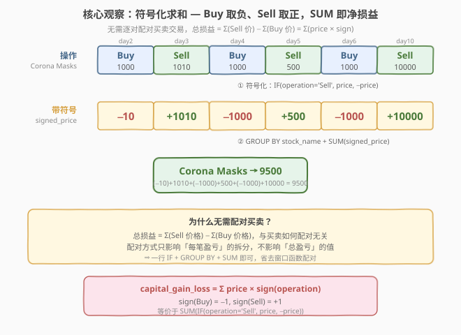
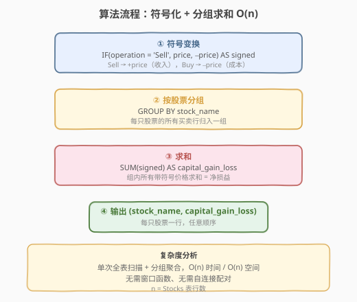
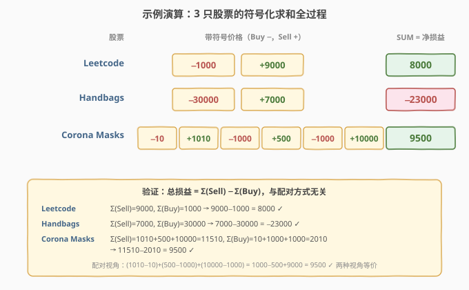

# 股票的资本损益

- **题目名称**：股票的资本损益
- **链接**：[1393. 股票的资本损益](https://leetcode.cn/problems/capital-gainloss/)
- **难度**：中等
- **标签**：数据库、SQL、条件聚合、IF/CASE、GROUP BY、SUM、pandas

## 1. 题目概述

给定 `Stocks` 表，每行记录某支股票在某一天的**买入**或**卖出**操作及其价格。编写 SQL，报告**每只股票的资本损益**（即所有买卖操作后的总收益或损失）。

> ⚠️ 关键陷阱：直觉上会想「把每对 Buy→Sell 配对，算每对的盈亏再求和」。虽然正确，但**完全没必要**——总损益 = Σ(Sell 价格) − Σ(Buy 价格)，与买卖如何配对无关。用一行条件聚合（`IF` + `SUM` + `GROUP BY`）即可，省去窗口函数配对的复杂度。

**表结构**：

```text
Table: Stocks
+---------------+---------+
| Column Name   | Type    |
+---------------+---------+
| stock_name    | varchar |  ← 股票名（主键组成部分）
| operation     | enum    |  ← 操作类型：('Sell','Buy')
| operation_day | int     |  ← 操作日（主键组成部分）
| price         | int     |  ← 操作价格
+---------------+---------+
  主键：(stock_name, operation_day)
```

- `operation` 是枚举类型，只有 `'Sell'` 和 `'Buy'` 两种值。
- 题目保证：每个「卖出」操作前某天都有对应的「买入」操作；每个「买入」操作后某天都有对应的「卖出」操作。即买卖操作**成对出现**，且 Buy 在 Sell 之前。

**示例 1**：

```text
输入：
Stocks 表：
+---------------+-----------+---------------+--------+
| stock_name    | operation | operation_day | price  |
+---------------+-----------+---------------+--------+
| Leetcode      | Buy       | 1             | 1000   |
| Corona Masks  | Buy       | 2             | 10     |
| Leetcode      | Sell      | 5             | 9000   |
| Handbags      | Buy       | 17            | 30000  |
| Corona Masks  | Sell      | 3             | 1010   |
| Corona Masks  | Buy       | 4             | 1000   |
| Corona Masks  | Sell      | 5             | 500    |
| Corona Masks  | Buy       | 6             | 1000   |
| Handbags      | Sell      | 29            | 7000   |
| Corona Masks  | Sell      | 10            | 10000  |
+---------------+-----------+---------------+--------+

输出：
+---------------+-------------------+
| stock_name    | capital_gain_loss |
+---------------+-------------------+
| Corona Masks  | 9500              |
| Leetcode      | 8000              |
| Handbags      | -23000            |
+---------------+-------------------+
```

**解释**：

| 股票 | 买卖配对 | 每对盈亏 | 总损益 |
|------|----------|----------|--------|
| Leetcode | (Buy@1000, Sell@9000) | 9000−1000 = 8000 | 8000 |
| Handbags | (Buy@30000, Sell@7000) | 7000−30000 = −23000 | −23000 |
| Corona Masks | (Buy@10, Sell@1010) + (Buy@1000, Sell@500) + (Buy@1000, Sell@10000) | (1010−10) + (500−1000) + (10000−1000) = 1000−500+9000 | 9500 |

> 💡 Corona Masks 有 3 对买卖，盈亏有正有负，总和 9500。关键观察：总损益 = Σ(Sell 价格) − Σ(Buy 价格) = (1010+500+10000) − (10+1000+1000) = 11510 − 2010 = 9500，**无需逐对配对**，一步条件聚合即可。

**约束条件**：

- `(stock_name, operation_day)` 是主键，无重复。
- 结果可按**任意顺序**返回。
- 输出列：`stock_name`、`capital_gain_loss`。

---

## 2. 解题思路

### 2.1 暴力思路：窗口函数配对买卖

最直觉的做法是**逐对配对**买卖操作，算出每对的盈亏，再按股票分组求和。用 `ROW_NUMBER()` 为每只股票的 Buy 和 Sell 分别编号，然后按编号配对：

```sql
-- 伪代码：用 ROW_NUMBER 配对第 i 次 Buy 与第 i 次 Sell
WITH numbered AS (
    SELECT stock_name, operation, price,
           ROW_NUMBER() OVER (
               PARTITION BY stock_name, operation
               ORDER BY operation_day
           ) AS rn
    FROM Stocks
)
SELECT b.stock_name,
       SUM(s.price - b.price) AS capital_gain_loss
FROM numbered b
JOIN numbered s
  ON b.stock_name = s.stock_name AND b.rn = s.rn
WHERE b.operation = 'Buy' AND s.operation = 'Sell'
GROUP BY b.stock_name;
```

- **正确但过度复杂**：需要 CTE + 窗口函数 + 自连接 + GROUP BY，4 层嵌套。且配对逻辑依赖「第 i 次 Buy ↔ 第 i 次 Sell」的假设——虽然本题数据满足此假设（买卖交替出现），但若数据不保证交替，配对可能出错。
- **没必要**：总损益 = Σ(Sell 价格) − Σ(Buy 价格)，配对方式只影响「每笔盈亏」的拆分，不影响「总盈亏」的值。我们只需要把 Buy 价格取负、Sell 价格取正，一次 `SUM + GROUP BY` 即可。

> ⚠️ 暴力不是错，而是把「总损益与配对无关」这把钥匙闲置了。看到「总收益/总损失」这类措辞，就该想到：**总损益 = 总收入 − 总成本**，归约为条件聚合问题，无需配对。

### 2.2 核心观察：符号化求和



**关键洞察**：股票的资本损益本质是**总收入减去总成本**：

$$
\text{capital\_gain\_loss} = \sum_{\text{Sell}} \text{price} - \sum_{\text{Buy}} \text{price} = \sum_{\text{all}} \text{price} \times \text{sign}(\text{operation})
$$

其中 $\text{sign}(\text{Buy}) = -1$（成本取负），$\text{sign}(\text{Sell}) = +1$（收入取正）。

**为什么无需配对？** 因为求和运算满足**交换律和结合律**——无论怎么把 Buy 和 Sell 配对，所有 Sell 价格之和减去所有 Buy 价格之和的值不变。配对只是把总损益**拆分**成若干笔盈亏，不影响总和。

> 以 Corona Masks 为例：
> - **配对视角**：$(1010-10) + (500-1000) + (10000-1000) = 1000 - 500 + 9000 = 9500$
> - **符号化视角**：$(-10) + 1010 + (-1000) + 500 + (-1000) + 10000 = 9500$
>
> 两种视角结果相同。符号化视角省去了配对步骤，直接对全部行做条件求和。

> ⚠️ **`IF` 的方向不要写反**。`IF(operation = 'Sell', price, -price)` 表示 Sell 取正、Buy 取负。若写成 `IF(operation = 'Buy', price, -price)` 则 Buy 取正、Sell 取负，结果符号全反。记住：**Sell 是收入（正），Buy 是支出（负）**。

### 2.3 算法流程图



**三步流水线**：

1. **符号变换**：对每一行，用 `IF(operation = 'Sell', price, -price)` 将 Buy 价格取负、Sell 价格取正，得到带符号价格 `signed`。
2. **按股票分组**：`GROUP BY stock_name`，将每只股票的所有买卖行归入一组。
3. **组内求和**：`SUM(signed) AS capital_gain_loss`，组内所有带符号价格求和即为该股票的净损益。

> 💡 **为什么不需要 `ORDER BY`？** 题目允许结果按任意顺序返回。`GROUP BY` 后的行顺序不保证，若题目要求排序则追加 `ORDER BY` 子句。

### 2.4 示例演算

以示例 1 的 3 只股票为例，跟踪「符号化 → 分组求和」全过程：



| 股票 | 操作（带符号价格） | SUM | 验证 Σ(Sell)−Σ(Buy) |
|------|-------------------|-----|---------------------|
| Leetcode | −1000, +9000 | 8000 | 9000−1000 = 8000 ✓ |
| Handbags | −30000, +7000 | −23000 | 7000−30000 = −23000 ✓ |
| Corona Masks | −10, +1010, −1000, +500, −1000, +10000 | 9500 | 11510−2010 = 9500 ✓ |

**关键验证点**：

- Leetcode 只有 1 对买卖，符号化结果 = 配对结果 = 8000。**单对买卖是符号化的退化情形**。
- Handbags 同样单对，但卖出价 < 买入价，结果为负（损失 −23000）。符号化自动处理正负。
- Corona Masks 有 3 对买卖，符号化把 6 行压缩成 1 个 SUM，无需配对。两种视角结果一致 ✓。

> 💡 **守恒校验**：符号化 SUM = Σ(Sell 价格) − Σ(Buy 价格)。这是验证正确性的快捷方法——若两个值不等，说明 `IF` 方向写反或漏了某行。

---

## 3. 参考代码

### MySQL（解法 A：`IF` + `GROUP BY` + `SUM`，推荐）

```sql
# 1393. 股票的资本损益
# 思路：Buy 取负（成本）、Sell 取正（收入），GROUP BY stock_name + SUM 即净损益
SELECT
    stock_name,
    SUM(IF(operation = 'Sell', price, -price)) AS capital_gain_loss
FROM Stocks
GROUP BY stock_name;
```

> 💡 **写法要点**：
> - **`IF(operation = 'Sell', price, -price)`**：Sell 时取 `+price`（收入），Buy 时取 `-price`（成本）。`IF(cond, true_val, false_val)` 是 MySQL 的三元表达式。
> - **`SUM(IF(...))`**：条件聚合——在聚合函数内部用 `IF` 对不同行施加不同符号，一步完成「分类求和」。
> - **`GROUP BY stock_name`**：按股票分组，每只股票输出一行。
> - 无需 `ORDER BY`（题目允许任意顺序）、无需窗口函数、无需自连接。

### MySQL（解法 B：`CASE WHEN` 版，跨数据库通用）

```sql
SELECT
    stock_name,
    SUM(
        CASE
            WHEN operation = 'Sell' THEN price
            ELSE -price
        END
    ) AS capital_gain_loss
FROM Stocks
GROUP BY stock_name;
```

> 💡 **`CASE WHEN` vs `IF`**：
> - `IF` 是 MySQL 专有函数，语法简洁但不可移植。
> - `CASE WHEN` 是 SQL 标准语法，所有主流数据库（PostgreSQL、SQL Server、Oracle、SQLite）均支持。
> - 面试中若被问「能否跨数据库」，用 `CASE WHEN`；若明确 MySQL 环境，`IF` 更简洁。

### Python（pandas）

```python
import pandas as pd

def capital_gain_loss(stocks: pd.DataFrame) -> pd.DataFrame:
    df = stocks.copy()
    df['signed'] = df['price'].where(df['operation'] == 'Sell', -df['price'])
    result = df.groupby('stock_name', as_index=False)['signed'].sum()
    result.columns = ['stock_name', 'capital_gain_loss']
    return result
```

> 💡 **pandas 对照**：
> - `df['price'].where(cond, other)` 等价于 `IF(cond, price, other)`——`where` 在条件为 `True` 时保留原值，为 `False` 时用 `other` 替换。这里 Sell 保留 `price`，Buy 替换为 `-price`。
> - `groupby('stock_name', as_index=False)['signed'].sum()` 等价于 `GROUP BY stock_name + SUM(signed)`。`as_index=False` 保持 `stock_name` 为普通列而非索引。
> - 也可用 `np.where(df['operation'] == 'Sell', df['price'], -df['price'])`，与 `IF` 逻辑完全对应。

---

## 4. 复杂度分析

| 维度 | 解法 A/B（条件聚合） | 暴力配对（窗口函数） |
|------|----------------------|---------------------|
| **时间** | $O(n)$ | $O(n \log n)$（窗口排序） |
| **空间** | $O(n)$（分组哈希表） | $O(n)$（CTE + 排序缓冲） |
| **SQL 复杂度** | 1 层 `SELECT + GROUP BY` | 4 层嵌套（CTE + 窗口 + 自连接 + GROUP BY） |
| **正确性依赖** | 无（配对无关） | 依赖买卖交替假设 |
| **推荐度** | ✓ **首选** | ✗ 过度工程 |

> - $n$ = `Stocks` 表行数。
> - **条件聚合**：单次全表扫描，每行做 $O(1)$ 的 `IF` 判断，`GROUP BY` 用哈希表聚合，总时间 $O(n)$。空间 $O(n)$ 存分组结果。
> - **暴力配对**：`ROW_NUMBER()` 需按 `operation_day` 排序，$O(n \log n)$；自连接再 $O(n)$；总时间 $O(n \log n)$。且配对逻辑依赖买卖交替出现，若数据不满足则出错。
> - **索引优化**：在 `Stocks(stock_name)` 上建索引可加速 `GROUP BY`，但本题数据规模小（示例级），索引收益有限。

> ⚠️ 本题数据量小（10 行），任何正确写法都能过。但「条件聚合」思路的价值在于**简洁性与可扩展性**：若交易记录上万行、买卖对数不固定，配对方案会越来越复杂，而条件聚合仍是一行 `SUM(IF(...))`。

---

## 5. 扩展：配对视角 vs 符号化视角

### 5.1 两种视角的等价性

| 维度 | 配对视角 | 符号化视角 |
|------|----------|-----------|
| **核心操作** | 逐对 (Buy, Sell) 算差 → SUM | 全部行取符号 → SUM |
| **公式** | $\sum_i (\text{sell}_i - \text{buy}_i)$ | $\sum_{\text{Sell}} p - \sum_{\text{Buy}} p$ |
| **SQL 工具** | 窗口函数 + 自连接 | `IF`/`CASE` + `GROUP BY` |
| **正确性依赖** | 需保证配对正确 | 无配对，天然正确 |
| **复杂度** | $O(n \log n)$ | $O(n)$ |

**等价证明**：设某股票有 $k$ 对买卖 $(b_1, s_1), \dots, (b_k, s_k)$，则：

$$
\sum_{i=1}^{k} (s_i - b_i) = \sum_{i=1}^{k} s_i - \sum_{i=1}^{k} b_i = \sum_{\text{Sell}} p - \sum_{\text{Buy}} p
$$

配对求和展开后，所有 Sell 价格相加、所有 Buy 价格相减，配对关系被求和的交换律消去。因此两种视角**恒等**。

> 💡 **何时必须配对？** 若题目要求输出**每笔交易的盈亏明细**（而非总损益），则必须配对。例如「报告每只股票每笔买卖的盈亏」需要窗口函数配对。本题只问总损益，符号化足矣。

### 5.2 条件聚合的泛化模板

「在聚合函数内部用 `IF`/`CASE` 对不同行施加不同权重」是 SQL 通用模式，不限于「Buy/Sell 符号化」：

```sql
-- 泛化模板：按条件分类求和
SELECT
    group_col,
    SUM(IF(condition, value, 0)) AS conditional_sum  -- 满足条件的行才累加
FROM table
GROUP BY group_col;
```

常见变体：

| 场景 | 条件 | 聚合 | 语义 |
|------|------|------|------|
| 股票损益（本题） | `operation='Sell'` → +, 否则 − | `SUM` | Buy 取负、Sell 取正求和 |
| 交易统计 | `state='approved'` | `SUM`/`COUNT` | 只统计已批准交易 |
| 部门透视 | `dept='A'`/`'B'`/`'C'` | `SUM` | 行转列透视表 |
| 及格计数 | `score >= 60` | `COUNT`/`SUM` | 统计及格人数 |

---

## 6. 面试要点

1. **为什么不需要配对买卖交易？**

   > 总损益 = Σ(Sell 价格) − Σ(Buy 价格)，由求和的交换律和结合律保证，配对方式只影响「每笔盈亏」的拆分，不影响总和。展开配对求和 $\sum(s_i - b_i) = \sum s_i - \sum b_i$，配对关系被消去。因此直接对全部行做条件聚合即可。

2. **`IF(operation = 'Sell', price, -price)` 的含义？**

   > `IF` 是 MySQL 三元表达式：条件为真时返回 `price`（Sell 是收入，取正），为假时返回 `-price`（Buy 是成本，取负）。嵌在 `SUM` 内部即「条件聚合」——对不同行施加不同符号后求和，一步得到净损益。

3. **`IF` 和 `CASE WHEN` 有什么区别？**

   > `IF` 是 MySQL 专有函数，语法简洁（`IF(cond, a, b)`）但不可移植。`CASE WHEN` 是 SQL 标准（`CASE WHEN cond THEN a ELSE b END`），所有主流数据库都支持。面试中 MySQL 环境用 `IF` 更简洁，跨数据库用 `CASE WHEN`。

4. **如果题目要求输出每笔交易的盈亏明细怎么办？**

   > 必须配对。用 `ROW_NUMBER() OVER (PARTITION BY stock_name, operation ORDER BY operation_day)` 为 Buy 和 Sell 分别编号，再按编号自连接配对，输出 `(stock_name, buy_day, sell_day, profit)`。本题只问总损益，符号化更简洁。

5. **如何快速验证结果正确？**

   > **守恒校验**：符号化 SUM = Σ(Sell 价格) − Σ(Buy 价格)。以 Corona Masks 为例，Σ(Sell) = 1010+500+10000 = 11510，Σ(Buy) = 10+1000+1000 = 2010，11510−2010 = 9500，与符号化 SUM 一致 ✓。若不等，说明 `IF` 方向写反或漏了某行。

> 💡 **一句话总结**：1393 是 SQL **「条件聚合招牌题」**——核心洞察是「总损益与配对无关」，Buy 取负、Sell 取正后 `SUM + GROUP BY` 即可。记住：看到「总收益/总损失」→ 条件聚合 `SUM(IF(...))`，不要陷入配对泥潭。公式 $\text{gain} = \sum p \times \text{sign}(\text{op})$ 是所有「分类加权求和」问题的通用钥匙。

---

## 7. 同类练习题

- [1193. 每月交易 I](https://leetcode.cn/problems/monthly-transactions-i/)：`SUM(IF(state='approved', amount, 0))` 条件聚合统计已批准交易金额，与本题 `IF(operation='Sell', price, -price)` 同套路
- [1174. 即时食物配送 II](https://leetcode.cn/problems/immediate-food-delivery-ii/)（[题解](../1101-1200/1174_即时食物配送II.md)）：`ROUND(AVG(IF(...)) * 100, 2)` 条件聚合求百分比，对照「IF 嵌 AVG」与本题「IF 嵌 SUM」
- [1179. 重新格式化部门表](https://leetcode.cn/problems/reformat-department-table/)（[题解](../1101-1200/1179_重新格式化部门表.md)）：`SUM(IF(month='Jan', revenue, 0))` 行转列透视，条件聚合的经典应用——多列各用一个 `IF` 筛选不同月份
- [534. 游戏玩法分析 III](https://leetcode.cn/problems/game-play-analysis-iii/)（[题解](../0501-0600/534_游戏玩法分析III.md)）：`GROUP BY` + 累计求和，对照「分组聚合」与本题「分组条件聚合」的异同
- [550. 游戏玩法分析 IV](https://leetcode.cn/problems/game-play-analysis-iv/)（[题解](../0501-0600/550_游戏玩法分析IV.md)）：`COUNT(IF(...))` 条件计数求留存率，与本题条件求和互补——一个 `IF` 嵌 `COUNT`、一个 `IF` 嵌 `SUM`
