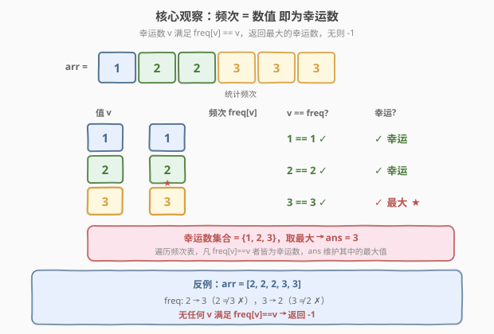
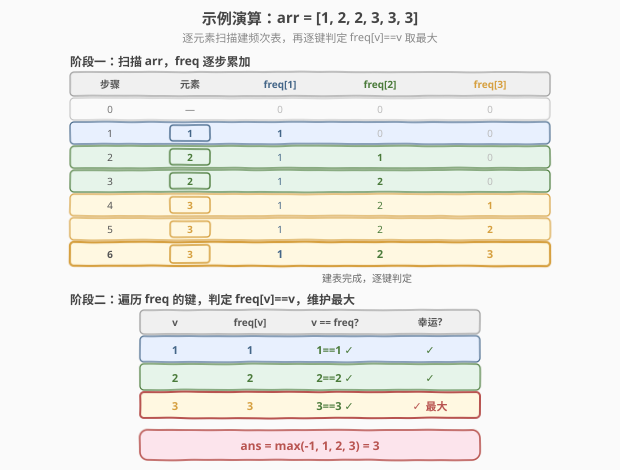

# LeetCode 找出数组中的幸运数 题解

## 1. 题目概述

- **标题 / 题号**：找出数组中的幸运数（#1394，easy）
- **链接**：https://leetcode.cn/problems/find-lucky-integer-in-an-array/
- **难度**：简单
- **标签**：数组、哈希表、计数

**题意**：在整数数组中，如果一个整数的**出现频次**和它的**数值大小相等**，就称这个整数为「**幸运数**」。

给你一个整数数组 `arr`，请你从中找出并返回一个幸运数：

- 如果数组中存在多个幸运数，只需返回**最大**的那个；
- 如果数组中不含幸运数，则返回 **-1**。

**示例 1**：

```text
输入：arr = [2,2,3,4]
输出：2
解释：数组中唯一的幸运数是 2，因为数值 2 的出现频次也是 2。
```

**示例 2**：

```text
输入：arr = [1,2,2,3,3,3]
输出：3
解释：1、2 以及 3 都是幸运数，只需要返回其中最大的 3。
```

**示例 3**：

```text
输入：arr = [2,2,2,3,3]
输出：-1
解释：数组中不存在幸运数。
```

**示例 4**：

```text
输入：arr = [5]
输出：-1
```

**示例 5**：

```text
输入：arr = [7,7,7,7,7,7,7]
输出：7
```

**约束**：

- $1 \le \text{arr.length} \le 500$
- $1 \le \text{arr}[i] \le 500$

> 💡 **关键点**：幸运数的判定条件是「**频次 = 数值**」——值 `v` 恰好出现 `v` 次即为幸运数。题目要的是**最大的**幸运数，而非全部幸运数，因此只需在遍历频次表时滚动维护一个最大值即可，无需收集所有幸运数。

## 2. 解题思路

### 2.1 暴力思路：逐个候选值现数频次

最直观的做法：先找出数组中的所有**不同值**，对每个候选值 `v` 再扫一遍数组数它出现了几次，若次数恰等于 `v` 就把它纳入幸运数候选，最后取候选中的最大值。

- **正确但低效**：设数组有 $d$ 个不同值，每个值都要 $O(n)$ 地现数一遍，总计 $O(n \cdot d)$；最坏情况下 $d \approx n$（所有元素互异），退化为 $O(n^2)$。
- **重复劳动**：同一个值的频次被「为了判定它自己」而数了一遍，却又在判定其他值时被白白忽略——所有「频次信息」本可以**一次性**统计成一张表，之后判定每个值只需 $O(1)$ 查表。

> ⚠️ 暴力法的瓶颈在于「**计数与判定耦合**」：每判定一个值就重新数一遍全数组。破局思路是**把计数提到外层一次性做完**，判定阶段就退化成纯查表——这正是频次表（哈希 / 计数数组）的标准套路。

### 2.2 核心观察：频次表 + 等值判定



**关键洞察**：把判定条件 $\text{freq}[v] == v$ 拆成两步——

1. **建表**：遍历一次 `arr`，用哈希表（或值域计数数组）统计每个值的出现频次 $\text{freq}[v]$；
2. **判定**：遍历频次表的每个键值对 $(v, \text{freq}[v])$，凡 $\text{freq}[v] == v$ 者，`v` 即为幸运数，用 `ans = max(ans, v)` 滚动维护最大值。

两步各自 $O(n)$，合计 $O(n)$。

> 以示例 2 的 `arr = [1,2,2,3,3,3]` 为例：建表得 $\text{freq} = \{1:1,\ 2:2,\ 3:3\}$。三个键都满足 $\text{freq}[v]==v$，故幸运数集合 $= \{1, 2, 3\}$，取最大得 `ans = 3`。

> 以示例 3 的 `arr = [2,2,2,3,3]` 为例：建表得 $\text{freq} = \{2:3,\ 3:2\}$。$2 \ne 3$、$3 \ne 2$，无任何键满足条件，`ans` 保持初值 `-1`。

> 💡 **为什么 `ans` 初值取 `-1`？** 题目规定「无幸运数返回 `-1`」，而数组元素恒 $\ge 1$，任何真实幸运数 $v \ge 1$ 都严格大于 `-1`。用 `-1` 作初值天然区分「未找到」与「找到」，无需额外标志位——这是「**用合法范围外的哨兵值表示空状态**」的常用技巧。

### 2.3 算法流程图

![算法流程：建频次表 → 遍历查 freq[v]==v → 取最大](../images/1394_algorithm_flow.svg)

**完整步骤**：

1. **建频次表** `freq`：遍历 `arr`，对每个元素 `v` 执行 `freq[v]++`；
2. **初始化** `ans = -1`（默认无幸运数）；
3. **遍历判定**：对 `freq` 中每个键 `v`，若 `freq[v] == v`，则 `ans = max(ans, v)`；
4. **返回** `ans`。

> ⚠️ 注意遍历的是**频次表的键**（即不同值集合，规模 $\le n$），而非原数组——否则同一值会被重复判定。哈希表天然去重；若用值域计数数组，则按下标 $1 \ldots 500$ 顺序扫描，每个值只判一次。

### 2.4 示例演算

以示例 2 的 `arr = [1,2,2,3,3,3]` 为例，分两阶段演算：



**阶段一：扫描 `arr`，`freq` 逐步累加**

| 步骤 | 元素 | $\text{freq}[1]$ | $\text{freq}[2]$ | $\text{freq}[3]$ |
|------|------|------------------|------------------|------------------|
| 0 | — | 0 | 0 | 0 |
| 1 | 1 | 1 | 0 | 0 |
| 2 | 2 | 1 | 1 | 0 |
| 3 | 2 | 1 | 2 | 0 |
| 4 | 3 | 1 | 2 | 1 |
| 5 | 3 | 1 | 2 | 2 |
| 6 | 3 | 1 | 2 | 3 |

6 步后建表完成：$\text{freq} = \{1:1,\ 2:2,\ 3:3\}$。

**阶段二：遍历 `freq` 的键，判定 $\text{freq}[v]==v$，维护最大**

| $v$ | $\text{freq}[v]$ | $v == \text{freq}[v]$? | 幸运? | `ans` |
|-----|------------------|------------------------|-------|-------|
| 1 | 1 | $1==1$ ✓ | ✓ | $\max(-1,1)=1$ |
| 2 | 2 | $2==2$ ✓ | ✓ | $\max(1,2)=2$ |
| 3 | 3 | $3==3$ ✓ | ✓ 最大 | $\max(2,3)=3$ |

最终 `ans = 3` ✓。

> 💡 若改为示例 3 的 `arr = [2,2,2,3,3]`，建表得 $\text{freq}=\{2:3,\ 3:2\}$：判 $v=2$ 时 $2 \ne 3$ ✗、判 $v=3$ 时 $3 \ne 2$ ✗，`ans` 始终保持 `-1`，直接返回 `-1`。

## 3. 参考代码

### C++

```cpp
class Solution {
public:
    int findLucky(vector<int>& arr) {
        unordered_map<int, int> freq;
        for (int v : arr) freq[v]++;

        int ans = -1;
        for (auto& [v, c] : freq)
            if (v == c) ans = max(ans, v);
        return ans;
    }
};
```

### Python

```python
class Solution:
    def findLucky(self, arr: List[int]) -> int:
        freq = Counter(arr)
        ans = -1
        for v, c in freq.items():
            if v == c:
                ans = max(ans, v)
        return ans
```

> 💡 **实现要点**：① 用 `Counter` / `unordered_map` 一次遍历建表，键天然去重，遍历键时每个值只判一次。② 结构化绑定 `auto& [v, c]` 让「值」与「频次」配对取出，判定 `v == c` 一目了然。③ `ans` 初值 `-1` 兼任「未找到哨兵」，循环结束直接返回，无需判断是否找到过。

## 4. 复杂度分析

| 维度 | 频次表（哈希） $O(n)$（推荐） | 值域计数数组 $O(n)$（第 5 节） | 暴力现数 $O(n^2)$ |
|------|------------------------------|------------------------------|-------------------|
| **时间复杂度** | $O(n)$ | $O(n)$ | $O(n \cdot d)$，最坏 $O(n^2)$ |
| **空间复杂度** | $O(d)$，$d$ 为不同值个数（$\le 500$） | $O(1)$（固定 501 长数组） | $O(1)$ |
| **常数** | 建表 + 判定两趟，约 $2n$ | 建表 $n$ + 扫 501，常数略大但空间最优 | 每个候选重扫全数组 |
| **是否依赖值域** | 否（通用） | 是（需 $1 \le \text{arr}[i] \le 500$） | 否 |

- **频次表（哈希）**：建表 $O(n)$、判定 $O(d) \le O(n)$，合计 $O(n)$；空间存 $d$ 个键值对。是最通用、最易写的正解，不依赖值域范围。
- **值域计数数组**：利用 $1 \le \text{arr}[i] \le 500$ 的约束，开固定 501 长数组，空间视为 $O(1)$；判定阶段扫 $1 \ldots 500$ 而非 $d$ 个键，常数略大但空间最优。
- **暴力**：$O(n \cdot d)$，最坏 $O(n^2)$，数据小（$n \le 500$）能过，但不体现对结构的利用。

> ⚠️ 本题 $n \le 500$ 极小，三种方法都能毫秒级通过。面试中写出哈希表版即可，值域计数数组作为「**利用值域约束把空间压到常数**」的加分项在第 5 节展开。

## 5. 扩展：值域计数数组（O(1) 空间）

题目给出 $1 \le \text{arr}[i] \le 500$，值域有常数上界。此时可弃用哈希表，改用**定长计数数组**：下标即值，`cnt[v]` 即频次。判定阶段按下标顺序扫 $1 \ldots 500$，每个 $v$ 检查 $\text{cnt}[v] == v$。

### C++

```cpp
class Solution {
public:
    int findLucky(vector<int>& arr) {
        int cnt[501] = {0};
        for (int v : arr) cnt[v]++;

        int ans = -1;
        for (int v = 1; v <= 500; ++v)
            if (cnt[v] == v) ans = max(ans, v);
        return ans;
    }
};
```

### Python

```python
class Solution:
    def findLucky(self, arr: List[int]) -> int:
        cnt = [0] * 501
        for v in arr:
            cnt[v] += 1
        return max((v for v in range(1, 501) if cnt[v] == v), default=-1)
```

> 💡 **Python 一行式**：`max(..., default=-1)` 把「空序列返回 `-1`」的语义内建进 `max`，无需手动维护 `ans` 初值。这比显式循环更简洁，但可读性见仁见智——面试中建议先写显式循环版讲清思路，再提一行式作为收尾。

> ⚠️ **值域计数数组的前提是值域有界且密集**。若题目改为 $\text{arr}[i]$ 可达 $10^9$，开 $10^9$ 长数组不现实，必须回到哈希表。值域计数数组是「**用值域换空间**」的典型：值域越小越划算，值域发散则失效。

| 写法 | 空间 | 适用条件 | 联系 |
|------|------|----------|------|
| 哈希表 `unordered_map` / `Counter` | $O(d)$ | 通用，无值域要求 | 频次统计的通用形态 |
| **值域计数数组 `cnt[501]`** | $O(1)$ | 值域有界（本题 $\le 500$） | [1365](1365_有多少小于当前数字的数字.md) / [387](../0301-0400/387_字符串中的第一个唯一字符.md) 同套计数数组 |

## 6. 面试要点

1. **如何想到用频次表？**

   > 幸运数的判定条件 $\text{freq}[v]==v$ 同时依赖「值 `v`」和「`v` 的频次」两个量。频次是全数组的全局统计量，对每个候选值现数一遍会重复扫描。把「统计频次」提到外层一次性做完（一趟 $O(n)$ 建表），判定阶段就退化成 $O(1)$ 查表——这是「**用空间换时间消除重复计数**」的标准套路，与 [387. 字符串中的第一个唯一字符](../0301-0400/387_字符串中的第一个唯一字符.md) 的频次表查 `freq==1` 同源。

2. **为什么遍历频次表的键而不是原数组？**

   > 原数组中同一值会出现多次，若按原数组遍历判定，同一值会被反复检查 `v == freq[v]`——虽然结果不变（重复取 `max` 无副作用），但做了无用功。频次表的键天然去重，每个值只判一次，遍历规模从 $n$ 降到 $d$（不同值个数）。

3. **`ans` 初值为什么取 `-1`？**

   > 题目规定「无幸运数返回 `-1`」，而数组元素恒 $\ge 1$，任何真实幸运数 $v \ge 1 > -1$。用 `-1` 作初值，循环中 `max(-1, v)` 在找到幸运数时自然被覆盖、未找到时保持 `-1`，无需额外布尔标志判断「是否找到过」——这是「**用合法范围外的哨兵值表示空状态**」的常用技巧。

4. **值域计数数组相比哈希表有什么取舍？**

   > 计数数组把空间从 $O(d)$ 压到 $O(1)$（固定 501 长），代价是**依赖值域有界**（$1 \le \text{arr}[i] \le 500$）。值域小且密集时计数数组更省、查表更快（数组下标访问 vs 哈希散列）；值域发散（如 $\text{arr}[i]$ 可达 $10^9$）时数组不可行，必须用哈希表。面试先写哈希表讲通用解，再提计数数组说明对值域约束的利用。

5. **这题和 [1380. 矩阵中的幸运数](1380_矩阵中的幸运数.md) 有什么区别？**

   > 两者都叫「幸运数」但定义截然不同：1380 的幸运数是矩阵中「**行最小且列最大**」的元素（鞍点），核心是二维极值的交集；1394 的幸运数是数组中「**频次等于数值**」的元素，核心是一维频次的等值判定。1380 借助元素互异可推出「至多一个」的鞍点定理，1394 则可能存在多个幸运数（需取最大）。同名不同义，切忌混淆。

> 💡 **一句话总结**：1394 的灵魂是「**频次 = 数值**」——一趟扫描建频次表，再遍历键查 $\text{freq}[v]==v$ 取最大，$O(n)$ 时间、$O(d)$ 空间。值域有界时可换计数数组把空间压到 $O(1)$。`ans` 初值 `-1` 兼任空状态哨兵，循环结束直接返回。

## 同类练习题

| # | 题目 | 与本题的关联 |
|---|------|-------------|
| 1380 | [矩阵中的幸运数](https://leetcode.cn/problems/lucky-numbers-in-a-matrix/)（[题解](1380_矩阵中的幸运数.md)） | 同名「幸运数」但定义不同（行最小∩列最大），对照两种「幸运」概念，体会同名题的语义差异 |
| 387 | [字符串中的第一个唯一字符](https://leetcode.cn/problems/first-unique-character-in-a-string/)（[题解](../0301-0400/387_字符串中的第一个唯一字符.md)） | 频次表查 `freq==1` 找首个唯一字符，本题查 `freq==v`，同为「建频次表 + 等值查表」范式 |
| 347 | [前 K 个高频元素](https://leetcode.cn/problems/top-k-frequent-elements/)（[题解](../0301-0400/347_前K个高频元素.md)） | 频次表建好后取前 K 高频，对照本题「建表后查等值取最大」与 347「建表后按频次排序取 Top-K」两种建表后处理 |
| 1365 | [有多少小于当前数字的数字](https://leetcode.cn/problems/how-many-numbers-are-smaller-than-the-current-number/)（[题解](1365_有多少小于当前数字的数字.md)） | 值域计数数组 + 前缀和，对照本题「值域计数数组查等值」与 1365「值域计数数组求小于个数」两种值域数组用法 |
| 692 | [前 K 个高频单词](https://leetcode.cn/problems/top-k-frequent-words/)（[题解](../0601-0700/692_前K个高频单词.md)） | 频次表 + 自定义排序取 Top-K，频次统计的进阶应用，对照本题的「等值判定」与 692 的「排序取 Top-K」 |
