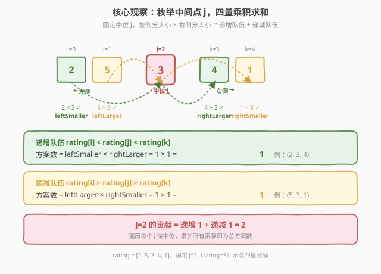
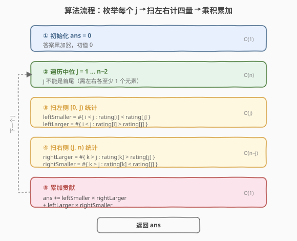
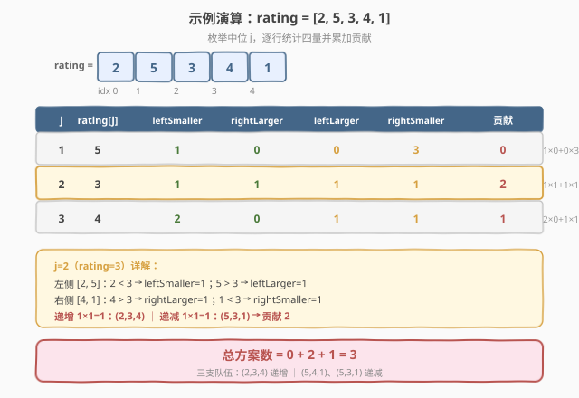

# 统计作战单位数

- **题目名称**：统计作战单位数
- **链接**：[1395. 统计作战单位数](https://leetcode.cn/problems/count-number-of-teams/)
- **难度**：中等
- **标签**：数组、动态规划、树状数组

## 1. 题目概述

`n` 名士兵站成一排，每个士兵都有一个**独一无二**的评分 `rating`。从中选出 **3** 个士兵组成一个作战单位，规则如下：

- 选出下标分别为 `i`、`j`、`k` 的 3 名士兵，满足 $0 \le i < j < k < n$；
- 作战单位需满足：$\text{rating}[i] < \text{rating}[j] < \text{rating}[k]$（**递增**）或者 $\text{rating}[i] > \text{rating}[j] > \text{rating}[k]$（**递减**）。

返回按上述条件组建的作战单位方案数。

**示例 1**：

```text
输入：rating = [2,5,3,4,1]
输出：3
解释：可以组建三个作战单位 (2,3,4)、(5,4,1)、(5,3,1)。
```

**示例 2**：

```text
输入：rating = [2,1,3]
输出：0
解释：唯一的三元组 (2,1,3) 既不递增也不递减，无法组建作战单位。
```

**示例 3**：

```text
输入：rating = [1,2,3,4]
输出：4
解释：四个递增作战单位 (1,2,3)、(1,2,4)、(1,3,4)、(2,3,4)。
```

**约束条件**：

- $n == \text{rating.length}$
- $3 \le n \le 1000$
- $1 \le \text{rating}[i] \le 10^5$
- `rating` 中的元素都是唯一的

> 💡 **关键点**：题目要求三个下标**有序**（$i < j < k$）且评分**单调**（严格递增或严格递减）。三元组的「中位」$j$ 是破局核心——固定 $j$ 后，左侧只需按「比 $\text{rating}[j]$ 小/大」二分计数，右侧同理，再由**乘法原理**组合出方案数，把 $O(n^3)$ 的暴力枚举压缩到 $O(n^2)$。

---

## 2. 解题思路

### 2.1 暴力思路：三重循环枚举

最直观的做法：用三重循环枚举所有下标三元组 $(i, j, k)$（$i < j < k$），对每个三元组检查是否满足递增或递减条件，满足则计数加一。

- **正确但低效**：三元组总数 $\binom{n}{3} = O(n^3)$，每个三元组 $O(1)$ 判定，总计 $O(n^3)$；
- **数据规模致命**：$n \le 1000$ 时 $n^3 \approx 10^9$，**必然超时**；
- **重复劳动**：对每个 $j$，左侧「比 $\text{rating}[j]$ 小的有几个」这一信息被反复重新计算——每个不同的 $i$ 都在重复扫描同样的左侧区间。

> ⚠️ 暴力法的瓶颈在于「**三重循环耦合**」：$i$、$j$、$k$ 三层循环互相牵制，每个三元组独立判定，无法复用中间结果。破局思路是**固定中位 $j$ 一次性算清左右两侧的计数**，用乘法原理把「选 $i$」和「选 $k$」解耦——这正是「枚举中间点」范式。

### 2.2 核心观察：枚举中间点 j + 乘法原理



**关键洞察**：三元组 $(i, j, k)$ 中 $j$ 是中位。固定 $j$ 后，$i$ 只能取自左侧 $[0, j)$、$k$ 只能取自右侧 $(j, n)$。由于 $\text{rating}$ 元素**互异**，左侧每个元素与 $\text{rating}[j]$ 比较只有两种结果（小或大），右侧同理。于是定义四个计数：

| 计数 | 定义 | 含义 |
|------|------|------|
| `leftSmaller` | $\#\{i < j : \text{rating}[i] < \text{rating}[j]\}$ | 左侧比 $j$ **小**的元素个数 |
| `leftLarger` | $\#\{i < j : \text{rating}[i] > \text{rating}[j]\}$ | 左侧比 $j$ **大**的元素个数 |
| `rightLarger` | $\#\{k > j : \text{rating}[k] > \text{rating}[j]\}$ | 右侧比 $j$ **大**的元素个数 |
| `rightSmaller` | $\#\{k > j : \text{rating}[k] < \text{rating}[j]\}$ | 右侧比 $j$ **小**的元素个数 |

由**乘法原理**，固定 $j$ 时：

- **递增队伍**（$\text{rating}[i] < \text{rating}[j] < \text{rating}[k]$）：$i$ 从 `leftSmaller` 中选、$k$ 从 `rightLarger` 中选，方案数 $= \text{leftSmaller} \times \text{rightLarger}$；
- **递减队伍**（$\text{rating}[i] > \text{rating}[j] > \text{rating}[k]$）：$i$ 从 `leftLarger` 中选、$k$ 从 `rightSmaller` 中选，方案数 $= \text{leftLarger} \times \text{rightSmaller}$。

$$\text{contribution}(j) = \text{leftSmaller} \times \text{rightLarger} + \text{leftLarger} \times \text{rightSmaller}$$

遍历每个 $j \in [1, n-2]$（首尾不能做中位），累加贡献即为总方案数。

> 以示例 1 的 $\text{rating} = [2,5,3,4,1]$、$j=2$（$\text{rating}[j]=3$）为例：左侧 $[2,5]$ 中 $2<3$ → `leftSmaller=1`、$5>3$ → `leftLarger=1`；右侧 $[4,1]$ 中 $4>3$ → `rightLarger=1`、$1<3$ → `rightSmaller=1`。贡献 $= 1 \times 1 + 1 \times 1 = 2$，对应递增队伍 $(2,3,4)$ 和递减队伍 $(5,3,1)$。

> ⚠️ **为什么元素互异是前提？** 若存在相同评分，则 $\text{rating}[i] == \text{rating}[j]$ 的元素既不属于 `leftSmaller` 也不属于 `leftLarger`，四量之和不再等于左侧元素总数，乘法原理的「不重不漏」前提被破坏。题目保证互异，故 `leftSmaller + leftLarger == j`、`rightLarger + rightSmaller == n - 1 - j` 恒成立——这也是一种自检手段。

### 2.3 算法流程图



**完整步骤**：

1. **初始化** `ans = 0`；
2. **遍历中位** $j = 1, \ldots, n-2$（$j=0$ 无左侧、$j=n-1$ 无右侧，跳过）；
3. **扫左侧** $[0, j)$：逐个比较 $\text{rating}[i]$ 与 $\text{rating}[j]$，累加 `leftSmaller` 和 `leftLarger`；
4. **扫右侧** $(j, n)$：逐个比较 $\text{rating}[k]$ 与 $\text{rating}[j]$，累加 `rightLarger` 和 `rightSmaller`；
5. **累加贡献**：`ans += leftSmaller * rightLarger + leftLarger * rightSmaller`；
6. **返回** `ans`。

> 💡 每个 $j$ 扫左侧 $O(j)$、右侧 $O(n-j)$，合计 $O(n)$；共 $n$ 个 $j$，总计 $O(n^2)$。$n=1000$ 时约 $10^6$ 次比较，毫秒级通过。第 5 节给出用树状数组把单次查询压到 $O(\log m)$ 的 $O(n \log m)$ 进阶解法。

### 2.4 示例演算

以示例 1 的 $\text{rating} = [2,5,3,4,1]$ 为例：



| $j$ | $\text{rating}[j]$ | leftSmaller | rightLarger | leftLarger | rightSmaller | 贡献 |
|-----|--------------------|-------------|-------------|------------|--------------|------|
| 1 | 5 | 1 | 0 | 0 | 3 | $1 \times 0 + 0 \times 3 = 0$ |
| 2 | 3 | 1 | 1 | 1 | 1 | $1 \times 1 + 1 \times 1 = 2$ |
| 3 | 4 | 2 | 0 | 1 | 1 | $2 \times 0 + 1 \times 1 = 1$ |

**逐行详解**：

- **$j=1$（rating=5）**：左侧 $[2]$ → $2<5$ 故 `leftSmaller=1`、`leftLarger=0`；右侧 $[3,4,1]$ → 全部 $<5$ 故 `rightLarger=0`、`rightSmaller=3`。贡献 $= 1 \times 0 + 0 \times 3 = 0$——rating 5 是最大值，右侧没有更大的元素，无法组成递增队伍；左侧也没有更大的元素，无法组成递减队伍。
- **$j=2$（rating=3）**：左侧 $[2,5]$ → $2<3$ 故 `leftSmaller=1`、$5>3$ 故 `leftLarger=1`；右侧 $[4,1]$ → $4>3$ 故 `rightLarger=1`、$1<3$ 故 `rightSmaller=1`。贡献 $= 1 \times 1 + 1 \times 1 = 2$——递增队伍 $(2,3,4)$、递减队伍 $(5,3,1)$。
- **$j=3$（rating=4）**：左侧 $[2,5,3]$ → $2,3<4$ 故 `leftSmaller=2`、$5>4$ 故 `leftLarger=1`；右侧 $[1]$ → $1<4$ 故 `rightLarger=0`、`rightSmaller=1`。贡献 $= 2 \times 0 + 1 \times 1 = 1$——递减队伍 $(5,4,1)$。

**总方案数** $= 0 + 2 + 1 = 3$ ✓

> 💡 **自检**：每个 $j$ 的 `leftSmaller + leftLarger` 应等于 $j$（左侧元素总数），`rightLarger + rightSmaller` 应等于 $n-1-j$（右侧元素总数）。如 $j=3$：$2+1=3=j$ ✓、$0+1=1=n-1-j=5-1-3=1$ ✓。若不等说明有重复或遗漏，可立即定位 bug。

---

## 3. 参考代码

### C++

```cpp
class Solution {
public:
    int numTeams(vector<int>& rating) {
        int n = rating.size();
        int ans = 0;
        for (int j = 1; j < n - 1; ++j) {
            int leftSmaller = 0, leftLarger = 0;
            for (int i = 0; i < j; ++i) {          // 扫左侧
                if (rating[i] < rating[j]) leftSmaller++;
                else leftLarger++;                 // 互异故无等于
            }
            int rightLarger = 0, rightSmaller = 0;
            for (int k = j + 1; k < n; ++k) {      // 扫右侧
                if (rating[k] > rating[j]) rightLarger++;
                else rightSmaller++;
            }
            ans += leftSmaller * rightLarger       // 递增队伍
                 + leftLarger * rightSmaller;       // 递减队伍
        }
        return ans;
    }
};
```

### Python

```python
class Solution:
    def numTeams(self, rating: list[int]) -> int:
        n = len(rating)
        ans = 0
        for j in range(1, n - 1):
            left_smaller = sum(1 for i in range(j) if rating[i] < rating[j])
            left_larger = j - left_smaller                     # 互异：左侧其余皆更大
            right_larger = sum(1 for k in range(j + 1, n) if rating[k] > rating[j])
            right_smaller = (n - 1 - j) - right_larger         # 互异：右侧其余皆更小
            ans += left_smaller * right_larger + left_larger * right_smaller
        return ans
```

> 💡 **实现要点**：① C++ 版用 `if/else` 而非两个独立 `if`，因为元素互异时 `rating[i] != rating[j]` 恒成立，非小即大，`else` 分支直接累加 `leftLarger`，省一次比较。② Python 版利用互异性做减法：`left_larger = j - left_smaller`、`right_smaller = (n-1-j) - right_larger`，只显式统计一个量，另一个由总数减得，更简洁且天然自洽。③ $j$ 的范围是 $[1, n-2]$，首尾各留至少一个元素给左/右两侧。

---

## 4. 复杂度分析

| 维度 | 枚举中位 $O(n^2)$（推荐） | 树状数组 $O(n\log m)$（第 5 节） | 暴力 $O(n^3)$ |
|------|--------------------------|----------------------------------|---------------|
| **时间复杂度** | $O(n^2)$ | $O(n \log m)$，$m$ 为值域上界 | $O(n^3)$ |
| **空间复杂度** | $O(1)$ | $O(m)$（树状数组） | $O(1)$ |
| **实际运算量** | $n=1000$ 约 $10^6$ | 约 $1000 \times 17 \approx 1.7 \times 10^4$ | 约 $10^9$（超时） |
| **是否依赖值域** | 否 | 是（需 $m$ 有界或离散化） | 否 |

- **枚举中位**：每个 $j$ 扫左 $O(j)$ + 右 $O(n-j) = O(n)$，共 $n$ 个 $j$，总计 $O(n^2)$。$n=1000$ 时约 $10^6$ 次比较，毫秒级通过。空间仅几个计数变量 $O(1)$，是最简洁的正解。
- **树状数组**：用 BIT 维护「已出现值域内的元素个数」，每个 $j$ 查询左/右小于/大于 $\text{rating}[j]$ 的个数各 $O(\log m)$，总计 $O(n \log m)$。$m = 10^5$ 时 $\log m \approx 17$，比 $O(n^2)$ 快约 60 倍，但需额外 $O(m)$ 空间且实现更重。
- **暴力**：$O(n^3)$，$n=1000$ 时 $10^9$ 必然超时，仅作思路对照。

> ⚠️ 本题 $n \le 1000$，$O(n^2)$ 足够高效。面试中写出枚举中位版即可，树状数组作为「**把计数查询从 $O(n)$ 压到 $O(\log m)$**」的进阶展示在第 5 节展开。

---

## 5. 扩展：树状数组 O(n log m)

枚举中位法的瓶颈在于：对每个 $j$，统计左/右小于/大于 $\text{rating}[j]$ 的个数需要 $O(n)$ 线性扫描。若用**树状数组**（Binary Indexed Tree, BIT）维护「已扫过值域内各值是否出现」，则查询「比 $v$ 小的元素个数」变为 $O(\log m)$ 的前缀和查询。

### 5.1 思路

利用元素互异且 $\text{rating}[i] \le 10^5$ 的值域约束，开一棵大小 $m = 10^5 + 2$ 的树状数组 `bit`：

1. **从左到右扫**一遍：对每个 $j$，先查 `bit` 中值域 $[1, \text{rating}[j]-1]$ 的前缀和得 `leftSmaller`，再 `update(rating[j])` 把 $\text{rating}[j]$ 加入 BIT。`leftLarger = j - leftSmaller`。
2. **从右到左扫**一遍：对每个 $j$，先查 `bit` 中值域 $[1, \text{rating}[j]-1]$ 的前缀和得 `rightSmaller`，再 `update(rating[j])`。`rightLarger = (n-1-j) - rightSmaller`。
3. 累加 `leftSmaller[j] * rightLarger[j] + leftLarger[j] * rightSmaller[j]`。

两趟扫描各 $O(n \log m)$，总计 $O(n \log m)$。

### 5.2 代码

```cpp
class Solution {
public:
    int numTeams(vector<int>& rating) {
        int n = rating.size();
        int m = *max_element(rating.begin(), rating.end()) + 2;
        vector<int> bit(m + 1, 0);

        auto update = [&](int i) {
            for (; i <= m; i += i & (-i)) bit[i]++;
        };
        auto query = [&](int i) -> int {          // 前缀和 [1, i]
            int s = 0;
            for (; i > 0; i -= i & (-i)) s += bit[i];
            return s;
        };

        vector<int> leftSmaller(n, 0), leftLarger(n, 0);
        vector<int> rightSmaller(n, 0), rightLarger(n, 0);

        // 从左到右：查左侧比 rating[j] 小的个数
        for (int j = 0; j < n; ++j) {
            leftSmaller[j] = query(rating[j] - 1);
            leftLarger[j]  = j - leftSmaller[j];
            update(rating[j]);
        }

        fill(bit.begin(), bit.end(), 0);          // 重置，扫右侧

        // 从右到左：查右侧比 rating[j] 小的个数
        for (int j = n - 1; j >= 0; --j) {
            rightSmaller[j] = query(rating[j] - 1);
            rightLarger[j]  = (n - 1 - j) - rightSmaller[j];
            update(rating[j]);
        }

        int ans = 0;
        for (int j = 0; j < n; ++j)
            ans += leftSmaller[j] * rightLarger[j]
                 + leftLarger[j] * rightSmaller[j];
        return ans;
    }
};
```

### Python

```python
class Solution:
    def numTeams(self, rating: list[int]) -> int:
        n = len(rating)
        m = max(rating) + 2
        bit = [0] * (m + 1)

        def update(i: int) -> None:
            while i <= m:
                bit[i] += 1
                i += i & -i

        def query(i: int) -> int:
            s = 0
            while i > 0:
                s += bit[i]
                i -= i & -i
            return s

        left_smaller = [0] * n
        left_larger = [0] * n
        right_smaller = [0] * n
        right_larger = [0] * n

        for j in range(n):
            left_smaller[j] = query(rating[j] - 1)
            left_larger[j] = j - left_smaller[j]
            update(rating[j])

        for i in range(len(bit)):       # 重置
            bit[i] = 0

        for j in range(n - 1, -1, -1):
            right_smaller[j] = query(rating[j] - 1)
            right_larger[j] = (n - 1 - j) - right_smaller[j]
            update(rating[j])

        return sum(left_smaller[j] * right_larger[j]
                 + left_larger[j] * right_smaller[j] for j in range(n))
```

> 💡 **为什么 `query(rating[j] - 1)` 得到的是「小于」而非「小于等于」？** 树状数组 `bit` 存的是「已出现且值 $\le i$ 的元素个数」。`query(rating[j]-1)` 查的是值域 $[1, \text{rating}[j]-1]$ 的前缀和，即严格小于 $\text{rating}[j]$ 的个数。由于元素互异，不存在等于的情况，`query(rating[j])` 与 `query(rating[j]-1)` 的差恰为 0（当前 $\text{rating}[j]$ 尚未 `update` 进去）。

> ⚠️ **值域无界时需离散化**。若 $\text{rating}[i]$ 可达 $10^9$，开 $10^9$ 长数组不现实。此时先排序去重建立「值→排名」的映射（离散化），把值域压到 $[1, n]$，再套同一套 BIT。这与 [1331. 数组序号转换](1331_数组序号转换.md) 的离散化思想同源。

| 写法 | 时间 | 空间 | 适用条件 |
|------|------|------|----------|
| 枚举中位（第 3 节） | $O(n^2)$ | $O(1)$ | 通用，无值域要求 |
| **树状数组（本节）** | $O(n \log m)$ | $O(m)$ | 值域有界或离散化后 |
| 离散化 + BIT | $O(n \log n)$ | $O(n)$ | 值域无界（$m$ 极大） |

---

## 6. 面试要点

1. **如何想到枚举中间点？**

   > 三元组 $(i, j, k)$ 有序且要求中间值居中（递增时 $j$ 居中、递减时 $j$ 也居中），这让 $j$ 成为天然的「枢纽」。固定 $j$ 后，$i$ 的选择（左侧）与 $k$ 的选择（右侧）**相互独立**——这是乘法原理适用的前提。一旦意识到「选 $i$」和「选 $k$」可解耦，三重循环就降为「遍历 $j$ × 左右各扫一遍」的 $O(n^2)$。这是「**枚举中间点 + 乘法原理**」的招牌范式，与 [334. 递增的三元子序列] 的「维护双阈值」殊途同归。

2. **为什么用乘法原理而不是直接枚举 $i$ 和 $k$？**

   > 乘法原理要求「各步独立」。固定 $j$ 后，$i$ 取自左侧 `leftSmaller` 个候选、$k$ 取自右侧 `rightLarger` 个候选，两者无交集且各自的选择不影响对方——任选一个 $i$ 配任选一个 $k$ 都构成合法递增队伍，方案数自然为 $|\text{leftSmaller}| \times |\text{rightLarger}|$。若直接枚举 $i$ 和 $k$ 则是 $O(n^2)$ 配对，但乘法原理把这个配对数压缩为 $O(1)$ 的乘法。

3. **元素互异这个条件用在哪里？**

   > 互异保证了 $\text{rating}[i] \ne \text{rating}[j]$，故左侧每个元素要么更小要么更大，`leftSmaller + leftLarger == j` 恒成立。这带来两个好处：① C++ 中用 `if/else` 而非两个 `if`，省一次比较；② Python 中 `left_larger = j - left_smaller`，只显式统计一个量。若元素可重复，则需额外处理「等于」的情况，乘法原理的不重不漏前提被破坏，需改用含等号的前缀和。

4. **枚举中位法和树状数组法怎么选？**

   > 枚举中位 $O(n^2)$ 简洁通用、空间 $O(1)$，$n \le 1000$ 毫秒级通过，是面试首选。树状数组 $O(n \log m)$ 在 $n$ 更大（如 $10^5$）时才显现优势，但需值域有界或离散化，实现更重。面试先写枚举中位版讲清思路，再提 BIT 说明对「**计数查询优化**」的敏感度，展示进阶深度。

5. **$j$ 的遍历范围为什么是 $[1, n-2]$ 而不是 $[0, n-1]$？**

   > $j$ 是中位，左侧至少 1 个元素（$i \ge 0$ 故 $j \ge 1$）、右侧至少 1 个元素（$k \le n-1$ 故 $j \le n-2$）。$j=0$ 无左侧、$j=n-1$ 无右侧，贡献必为 0，跳过即可。这也呼应约束 $n \ge 3$——至少 3 个元素才有合法三元组。

> 💡 **一句话总结**：1395 的灵魂是「**枚举中间点 $j$ + 乘法原理**」——固定 $j$，左侧分大小、右侧分大小，递增队伍 $= \text{leftSmaller} \times \text{rightLarger}$、递减队伍 $= \text{leftLarger} \times \text{rightSmaller}$，$O(n^2)$ 时间、$O(1)$ 空间。元素互异是乘法原理不重不漏的前提，也是 `left_larger = j - left_smaller` 减法技巧的依据。进阶可用树状数组把计数查询压到 $O(\log m)$。

---

## 7. 同类练习题

- [1365. 有多少小于当前数字的数字](https://leetcode.cn/problems/how-many-numbers-are-smaller-than-the-current-number/)（[题解](1365_有多少小于当前数字的数字.md)）：统计比每个元素小的个数，与本题的 `leftSmaller`/`rightSmaller` 同源，对照「值域计数数组 + 前缀和」与「枚举中位 + 乘法原理」两种计数范式
- [300. 最长递增子序列](https://leetcode.cn/problems/longest-increasing-subsequence/)（[题解](../0201-0300/300_最长递增子序列.md)）：递增子序列的经典模型，本题的递增队伍即为长度恰为 3 的递增子序列计数，对照「计数」与「求最长」两种目标下的不同策略
- [15. 三数之和](https://leetcode.cn/problems/3sum/)（[题解](../0001-0100/15_三数之和.md)）：同为三数组合问题且下标有序，但 15 题排序后双指针、本题保序枚举中位，对照「排序破坏下标序」与「保序利用下标序」两种取舍
- [1331. 数组序号转换](https://leetcode.cn/problems/rank-transform-of-an-array/)（[题解](1331_数组序号转换.md)）：将元素按大小映射到排名，与本题按 `rating` 比较分大小同源；树状数组解法中值域无界时的离散化正是排名映射
- [347. 前 K 个高频元素](https://leetcode.cn/problems/top-k-frequent-elements/)（[题解](../0301-0400/347_前K个高频元素.md)）：频次统计的下游应用，对照本题「按值大小分桶计数」与 347「按频次分桶选 Top-K」两种计数后处理
