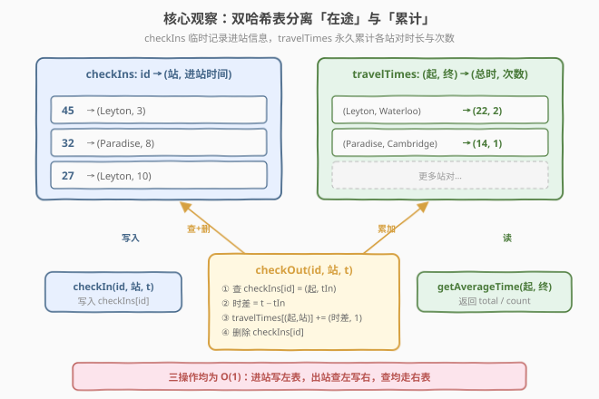
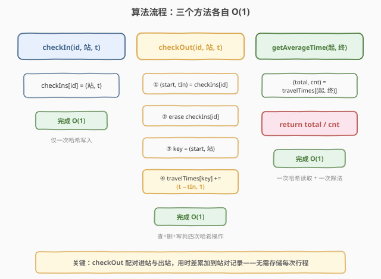
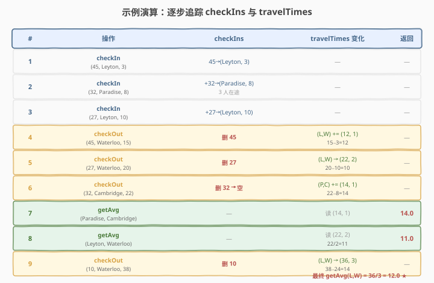

# 设计地铁系统

- **题目名称**：设计地铁系统
- **链接**：[1396. 设计地铁系统](https://leetcode.cn/problems/design-underground-system/)
- **难度**：中等
- **标签**：设计、哈希表

## 1. 题目概述

地铁系统跟踪不同车站之间的乘客出行时间，并据此计算从一站到另一站的平均时间。实现 `UndergroundSystem` 类：

- `void checkIn(int id, string stationName, int t)`：通行卡 ID 为 `id` 的乘客在时间 `t` 从 `stationName` 站进站。乘客一次只能从一个站进入。
- `void checkOut(int id, string stationName, int t)`：通行卡 ID 为 `id` 的乘客在时间 `t` 从 `stationName` 站出站。
- `double getAverageTime(string startStation, string endStation)`：返回从 `startStation` **直接**到 `endStation` 的平均行程时间，根据截至目前所有该方向行程计算。方向不同时间可能不同。调用前至少存在一条对应行程。

**示例 1**：

```text
输入：
["UndergroundSystem","checkIn","checkIn","checkIn","checkOut","checkOut","checkOut","getAverageTime","getAverageTime","checkIn","getAverageTime","checkOut","getAverageTime"]
[[],[45,"Leyton",3],[32,"Paradise",8],[27,"Leyton",10],[45,"Waterloo",15],[27,"Waterloo",20],[32,"Cambridge",22],["Paradise","Cambridge"],["Leyton","Waterloo"],[10,"Leyton",24],["Leyton","Waterloo"],[10,"Waterloo",38],["Leyton","Waterloo"]]

输出：
[null,null,null,null,null,null,null,14.00000,11.00000,null,11.00000,null,12.00000]

解释：
checkIn(45, "Leyton", 3)      // 45 号进站
checkIn(32, "Paradise", 8)    // 32 号进站
checkIn(27, "Leyton", 10)     // 27 号进站
checkOut(45, "Waterloo", 15)  // 45: Leyton→Waterloo，用时 15-3 = 12
checkOut(27, "Waterloo", 20)  // 27: Leyton→Waterloo，用时 20-10 = 10
checkOut(32, "Cambridge", 22) // 32: Paradise→Cambridge，用时 22-8 = 14
getAverageTime("Paradise","Cambridge") // 14 / 1 = 14
getAverageTime("Leyton","Waterloo")    // (10+12) / 2 = 11
checkIn(10, "Leyton", 24)
getAverageTime("Leyton","Waterloo")    // 仍 11（10 号还没出站）
checkOut(10, "Waterloo", 38)           // 10: Leyton→Waterloo，用时 38-24 = 14
getAverageTime("Leyton","Waterloo")    // (10+12+14) / 3 = 12
```

**示例 2**：

```text
输入：
["UndergroundSystem","checkIn","checkOut","getAverageTime","checkIn","checkOut","getAverageTime","checkIn","checkOut","getAverageTime"]
[[],[10,"Leyton",3],[10,"Paradise",8],["Leyton","Paradise"],[5,"Leyton",10],[5,"Paradise",16],["Leyton","Paradise"],[2,"Leyton",21],[2,"Paradise",30],["Leyton","Paradise"]]

输出：
[null,null,null,5.00000,null,null,5.50000,null,null,6.66667]

解释：三条 Leyton→Paradise 行程分别为 5、6、9，均值 (5+6+9)/3 = 6.66667。
```

**约束条件**：

- $1 \le \text{id}, t \le 10^6$
- $1 \le \text{stationName.length} \le 10$
- 所有字符串由大小写英文字母与数字组成
- 总共最多调用 $2 \times 10^4$ 次 `checkIn`、`checkOut`、`getAverageTime`
- 与标准答案误差在 $10^{-5}$ 以内视为正确

> 💡 **关键点**：题目要求的是「平均时间」而非每次行程时间。如果每次 `getAverageTime` 都遍历全部历史行程求均值，$O(n)$ 的查询在高频调用下会变慢。能否做到**所有方法均 $O(1)$**？答案是**用两张哈希表分离「在途」与「累计」**——进站时只记临时信息，出站时把单次行程「折叠」成对站对统计量的增量更新。

---

## 2. 解题思路

### 2.1 暴力思路：存储每次行程，查询时遍历求均值

最直观的做法：用一个列表 `trips` 存储所有已完成的行程 `(startStation, endStation, time)`。`checkOut` 时追加一条；`getAverageTime` 时遍历 `trips`，筛选起终站匹配的行程，累加时间再除以条数。

- **正确但低效**：`getAverageTime` 每次 $O(T)$（$T$ 为历史行程总数）。若同一站对被频繁查询而行程数持续增长，单次查询从 $O(1)$ 退化到 $O(T)$，$2 \times 10^4$ 次调用下总开销可达 $O(T \cdot q) \approx 4 \times 10^8$，可能超时。
- **重复计算**：同一段 `(Leyton, Waterloo)` 的行程被反复求和——这些「部分和」本可以**增量维护**成一对数值（总时间 + 次数），查询时一次除法即可。

> ⚠️ 暴力法的瓶颈在于「**存储粒度太细**」：每条行程单独存放，查询时才聚合。破局思路是**在出站时就把行程折叠成站对统计量的增量**，查询时只读汇总值——这就是「聚合前置」的标准套路。

### 2.2 核心观察：双哈希表分离「在途」与「累计」



关键洞察：乘客的行程分为两个阶段——**进站后、出站前**处于「在途」状态（只有起点和进站时间），**出站时**才形成一条完整行程（起终站 + 用时）。这两个阶段的数据生命周期不同：

| 阶段 | 数据 | 生命周期 | 存储位置 |
|------|------|----------|----------|
| 在途 | `(id → 起点站, 进站时间)` | 临时——出站即删 | `checkIns` 哈希表 |
| 累计 | `(起点, 终点) → (总时间, 行程数)` | 永久——持续累加 | `travelTimes` 哈希表 |

据此设计两张哈希表：

1. **`checkIns`**：`id → (stationName, checkInTime)`。记录当前在途乘客的进站信息。`checkIn` 时写入，`checkOut` 时读取后删除——同一 `id` 在途时只占一条。
2. **`travelTimes`**：`(startStation, endStation) → (totalTime, tripCount)`。累计每个站对的总时长与行程数。`checkOut` 时增量更新，`getAverageTime` 时一次读取做除法。

> 💡 **为什么出站时就能更新均值？** 因为均值 $= \frac{\text{总时间}}{\text{行程数}}$，只要维护这两个标量，新行程到来时 `total += dt; count += 1`，均值自然更新为 `total / count`。无需存储每次行程的明细——这正是「**用累加代替存储**」的精髓，与 [304. 二维区域和检索](../0301-0400/304_二维区域和检索 - 数组不可变.md) 的前缀和思想同构：把查询时的 $O(n)$ 聚合前置到写入时的 $O(1)$ 增量。

### 2.3 算法流程



**三个方法的完整流程**：

```
checkIn(id, stationName, t):
    checkIns[id] = (stationName, t)        // 一条哈希写入

checkOut(id, stationName, t):
    (start, tIn) = checkIns[id]            // ① 查在途记录
    checkIns.erase(id)                     // ② 删除（已出站）
    key = (start, stationName)             // ③ 组站对键
    travelTimes[key].total += t - tIn      // ④ 累加时长
    travelTimes[key].count += 1            //    累加次数

getAverageTime(startStation, endStation):
    (total, cnt) = travelTimes[(startStation, endStation)]
    return total / cnt                     // 一次除法
```

> ⚠️ **站对键的设计**：C++ 中 `pair<string,string>` 可直接作 `unordered_map` 键（需自定义哈希），更简洁的做法是用 `startStation + "," + endStation` 拼接字符串作键——站名长度 $\le 10$，拼接开销极小。Python 直接用元组 `(start, end)` 作字典键，天然可哈希。

### 2.4 示例演算

以示例 1 为例，逐步追踪 `checkIns` 与 `travelTimes` 的演化：



| # | 操作 | checkIns | travelTimes 变化 | 返回 |
|---|------|----------|------------------|------|
| 1 | `checkIn(45, Leyton, 3)` | 45→(Leyton, 3) | — | — |
| 2 | `checkIn(32, Paradise, 8)` | +32→(Paradise, 8) | — | — |
| 3 | `checkIn(27, Leyton, 10)` | +27→(Leyton, 10) | — | — |
| 4 | `checkOut(45, Waterloo, 15)` | 删 45 | (L,W) += (12, 1) · 15−3=12 | — |
| 5 | `checkOut(27, Waterloo, 20)` | 删 27 | (L,W) → (22, 2) · 20−10=10 | — |
| 6 | `checkOut(32, Cambridge, 22)` | 删 32 → 空 | (P,C) += (14, 1) · 22−8=14 | — |
| 7 | `getAvg(Paradise, Cambridge)` | — | 读 (14, 1) | **14.0** |
| 8 | `getAvg(Leyton, Waterloo)` | — | 读 (22, 2) · 22/2=11 | **11.0** |
| 9 | `checkOut(10, Waterloo, 38)` | 删 10 | (L,W) → (36, 3) · 38−24=14 | — |
| 10 | `getAvg(Leyton, Waterloo)` | — | 读 (36, 3) · 36/3=12 | **12.0** |

关键看第 4–6 步的三次 `checkOut`：每次都执行「查 `checkIns` → 算时差 → 累加 `travelTimes` → 删 `checkIns`」四步流水线。第 8 步查询时 `(Leyton, Waterloo)` 已累计 `(22, 2)`，直接 `22/2=11` 返回——无需遍历任何历史行程明细。第 9 步新增一条行程后 `(L,W)` 变为 `(36, 3)`，第 10 步查询 `36/3=12` 即得。

> 💡 **对照暴力法**：暴力法存储了三条 `(Leyton, Waterloo, 12)`、`(Leyton, Waterloo, 10)`、`(Leyton, Waterloo, 14)` 行程记录，查询时遍历求和 `(12+10+14)/3=12`。双哈希表法从未存储单条行程，只维护 `(36, 3)` 这对汇总值——空间从 $O(T)$ 降到 $O(S)$（$S$ 为不同站对数，$\le$ 车站数的平方），查询从 $O(T)$ 降到 $O(1)$。

---

## 3. 参考代码

### C++

```cpp
class UndergroundSystem {
    unordered_map<int, pair<string, int>> checkIns;
    unordered_map<string, pair<long long, int>> travelTimes;

  public:
    void checkIn(int id, string stationName, int t) {
        checkIns[id] = {stationName, t};
    }

    void checkOut(int id, string stationName, int t) {
        auto& [start, tIn] = checkIns[id];
        string key = start + "," + stationName;
        auto& [total, cnt] = travelTimes[key];
        total += t - tIn;
        cnt++;
        checkIns.erase(id);
    }

    double getAverageTime(string startStation, string endStation) {
        string key = startStation + "," + endStation;
        auto& [total, cnt] = travelTimes[key];
        return (double)total / cnt;
    }
};
```

### Python

```python
class UndergroundSystem:
    def __init__(self):
        self.check_ins = {}       # id -> (station, time)
        self.travel_times = {}    # (start, end) -> [total, count]

    def checkIn(self, id: int, stationName: str, t: int) -> None:
        self.check_ins[id] = (stationName, t)

    def checkOut(self, id: int, stationName: str, t: int) -> None:
        start, t_in = self.check_ins.pop(id)
        key = (start, stationName)
        total, cnt = self.travel_times.get(key, (0, 0))
        self.travel_times[key] = (total + t - t_in, cnt + 1)

    def getAverageTime(self, startStation: str, endStation: str) -> float:
        total, cnt = self.travel_times[(startStation, endStation)]
        return total / cnt
```

> 💡 **实现细节**：① C++ 用 `start + "," + stationName` 拼字符串作键，避免自定义 `pair` 哈希的繁琐；Python 直接用元组 `(start, end)` 作字典键，更自然。② C++ 中 `total` 用 `long long` 防溢出——最坏 $2 \times 10^4$ 次行程、每次 $t \le 10^6$，总时长达 $2 \times 10^{10}$，超出 `int` 范围（$\approx 2.1 \times 10^9$）。③ `checkOut` 中先取引用 `auto& [total, cnt] = travelTimes[key]` 再原地累加，利用 `unordered_map` 的 `operator[]` 在键不存在时默认构造的特性——C++ 中 `pair<long long,int>` 默认为 `(0, 0)`，Python 则需 `get(key, (0,0))` 显式处理缺失。④ `checkOut` 最后 `erase`/`pop` 释放在途记录，保证 `checkIns` 只存当前在途乘客，空间不随行程数增长。

---

## 4. 复杂度分析

| 维度 | 复杂度 | 说明 |
|------|--------|------|
| `checkIn` 时间 | $O(1)$ | 一次哈希表写入 |
| `checkOut` 时间 | $O(1)$ | 一次哈希读取 + 一次哈希删除 + 一次哈希写入（站对累加），均为均摊常数 |
| `getAverageTime` 时间 | $O(1)$ | 一次哈希读取 + 一次除法 |
| 空间 | $O(P + S)$ | $P$ 为当前在途乘客数（$\le$ 并发 `checkIn` 数），$S$ 为不同站对数（$\le$ 车站数$^2$） |

> ⚠️ **空间分析**：`checkIns` 的大小等于当前在途乘客数——乘客出站即删除，不会无限增长。`travelTimes` 的大小等于不同站对数，上限为车站数 $C$ 的平方 $C^2$，但实际只存出现过行程的站对。题目车站名长度 $\le 10$，站对键拼接后长度 $\le 21$，哈希开销极低。总空间与行程总数 $T$ **无关**——这是「聚合前置」相比暴力法的核心空间优势。

---

## 5. 扩展：如果需要中位数或其他分位数？

本题维护的是「总和 + 计数」，可直接算均值。若需求改为**中位数**或任意分位数，仅靠两个标量不够——中位数需要排序后的有序序列，无法用 $O(1)$ 增量维护。

**进阶方案**：对每个站对维护两棵**对顶堆**（大根堆存较小半 + 小根堆存较大半），`checkOut` 时插入用时 $O(\log n)$，查询中位数 $O(1)$。这与 [295. 数据流的中位数](https://leetcode.cn/problems/find-median-from-data-stream/) 的设计完全一致。代价是 `checkOut` 从 $O(1)$ 升到 $O(\log n)$——这就是「**查询能力与写入成本的 trade-off**」：维护的信息越丰富，增量更新越昂贵。

| 查询需求 | 维护量 | `checkOut` | `getAverageTime` | 联系 |
|----------|--------|------------|-------------------|------|
| 均值 | `total, count` | $O(1)$ | $O(1)$ | 本题 |
| 中位数 | 对顶堆 | $O(\log n)$ | $O(1)$ | 295 数据流中位数 |
| 任意分位数 | 有序数组 / 桶 | $O(\log n)$ / $O(1)$ | $O(\log n)$ / $O(1)$ | 528 按权重随机选择 |

> 💡 **一句话总结**：均值只需「和 + 计数」两个标量，天然支持 $O(1)$ 增量——这是本题能做到全 $O(1)$ 的根本原因。若查询需求升级到中位数，则必须引入更重的数据结构（对顶堆 / 有序序列），写入代价随之上升。

---

## 6. 面试要点

1. **为什么用两张哈希表而不是一张？**

   > 乘客行程的两个阶段数据生命周期不同：在途信息（进站站 + 时间）是临时的，出站即失效；站对统计量是永久的，持续累加。混在一张表里要么浪费空间（存已完成的行程明细），要么查询低效（每次遍历求均值）。分离后 `checkIns` 只存当前在途乘客（空间 $O(P)$），`travelTimes` 只存站对汇总值（空间 $O(S)$），两者互不干扰，各方法均 $O(1)$。

2. **`checkOut` 的四步顺序能否调换？**

   > 不能随意调换。必须**先读 `checkIns[id]`** 拿到起点和进站时间，**再删除**——否则删了就读不到了。累加 `travelTimes` 必须在拿到起点之后（需要组站对键）。删除 `checkIns[id]` 可以放在累加之前或之后（只要在读之后），但放最后更符合「读取 → 计算 → 更新 → 清理」的直觉流水线。Python 用 `pop` 一步完成读取 + 删除，更简洁。

3. **站对键为什么用字符串拼接而不是 `pair`？**

   > C++ 的 `unordered_map` 对 `pair<string,string>` 没有默认哈希函数，需手写 `struct` 特化 `std::hash`——代码冗长且易错。字符串拼接 `start + "," + end` 只需一行，站名长度 $\le 10$ 拼接开销可忽略，且 `unordered_map<string, ...>` 开箱即用。Python 的元组 `(start, end)` 天然可哈希，无需拼接。这是「**用语言特性选择最自然的数据表示**」的典型实践。

4. **`total` 为什么用 `long long` 而非 `int`？**

   > 最坏情况：$2 \times 10^4$ 次行程，每次用时 $t \le 10^6$，总时长可达 $2 \times 10^{10}$，远超 `int` 上限 $\approx 2.1 \times 10^9$。虽然实际测试用例不一定触达边界，但面试中应主动说明溢出分析——这是区分「能写出代码」与「能写出健壮代码」的标志。Python 的 `int` 无溢出问题，无需操心。

5. **如果同一个乘客进站后还没出站又进站怎么办？**

   > 题目保证「乘客一次只能从一个站进入」，且所有调用逻辑自洽——不会出现同一 `id` 未出站就再次 `checkIn` 的情况。因此 `checkIns[id]` 在被读时一定存在（`checkOut` 必有对应 `checkIn`）。若面试官追问「不保证呢」，可在 `checkIn` 时检查 `checkIns` 是否已有该 `id`，有则先结算旧行程或报错——但本题无需处理。

> 💡 **一句话总结**：双哈希表分离「在途临时数据」与「站对累计统计」，`checkOut` 时把单次行程折叠成 `(total, count)` 的增量更新，三方法均 $O(1)$。核心思想是「**聚合前置**」——把查询时的 $O(n)$ 遍历求和，前置到写入时的 $O(1)$ 累加。

---

## 7. 同类练习题

- [146. LRU 缓存](https://leetcode.cn/problems/lru-cache/)（[题解](../0101-0200/146_LRU缓存.md)）：同为设计题用哈希表做 $O(1)$ 查找，对照 146「哈希 + 双向链表维护顺序」与本题「哈希维护聚合量」两种哈希表在设计题中的用法
- [981. 基于时间的键值存储](https://leetcode.cn/problems/time-based-key-value-store/)（[题解](../0901-1000/981_基于时间的键值存储.md)）：同为「键 → 多条记录」的哈希设计题，对照 981「时间戳有序数组 + 二分」与本题「站对 → 聚合标量」两种值结构的选择
- [1348. 推文计数](https://leetcode.cn/problems/tweet-counts-per-a-time-interval/)（[题解](./1348_推文计数.md)）：同为「按 key 聚合时间序列」的设计题，对照 1348「有序数组 + 二分区间查询」与本题「增量累加 + $O(1)$ 均值」两种聚合策略
- [1352. 最后 K 个数的乘积](https://leetcode.cn/problems/product-of-the-last-k-numbers/)（[题解](./1352_最后K个数的乘积.md)）：同为「设计类 + 增量维护聚合量」的设计题，对照 1352「前缀乘积」与本题「站对累计和」两种把 $O(k)$ 查询前置到 $O(1)$ 写入的范式
- [295. 数据流的中位数](https://leetcode.cn/problems/find-median-from-data-stream/)：本题第 5 节扩展的中位数变体，对照「均值只需两标量 $O(1)$」与「中位数需对顶堆 $O(\log n)$」，体会查询需求如何决定数据结构复杂度
