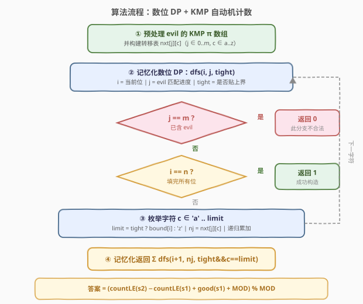
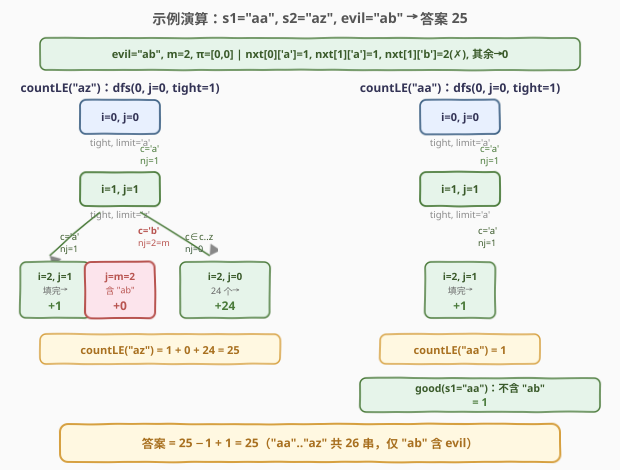

# 找到所有好字符串

- **题目名称**：找到所有好字符串
- **链接**：[1397. 找到所有好字符串](https://leetcode.cn/problems/find-all-good-strings/)
- **难度**：困难
- **标签**：动态规划、数位 DP、KMP、字符串

## 1. 题目概述

给定两个长度均为 $n$ 的字符串 $s1$、$s2$（$s1 \le s2$，字典序）和一个字符串 `evil`。求在字典序区间 $[s1, s2]$ 内、**不包含** `evil` 作为子串的字符串个数，对 $10^9+7$ 取模。

**示例 1**：

```text
输入：n = 2, s1 = "aa", s2 = "az", evil = "ab"
输出：25
解释：[aa, az] 共 26 个串，仅 "ab" 包含 evil="ab"，故答案 26 - 1 = 25。
```

**示例 2**：

```text
输入：n = 3, s1 = "abc", s2 = "xbc", evil = "ac"
输出：12623
```

**约束条件**：

- $1 \le n \le 500$
- $1 \le \text{evil.length} \le 50$
- $s1 \le s2$，三者均只含小写字母
- $s1$、$s2$ 长度均为 $n$

> ⚠️ **关键信号**：$n$ 达 $500$，字典序区间 $[s1, s2]$ 内可能有多达 $26^{500}$ 个串，逐个枚举完全不可行。题目问的是「**在一段字典序区间内、满足位级约束（不含某子串）的串有多少个**」——这是**数位 DP（digit DP）**的标准触发场景。这里的「数位」是字符（a–z），约束「不含 evil」需要追踪 evil 的匹配进度——这正是 **KMP 自动机**的职责。两者结合，状态在 $O(n \cdot m)$ 量级内即可完成计数。

---

## 2. 解题思路

### 2.1 暴力思路：逐串检查

最直白的做法：从 $s1$ 字典序递增枚举到 $s2$，逐个检查是否包含 `evil`：

```text
ans = 0
for s in lex_range(s1, s2):
    if evil not in s:
        ans += 1
return ans % MOD
```

$n = 500$ 时区间长度可达 $26^{500}$，远超任何时限。且即便区间不大，逐串检查子串也需 $O(n)$ 每串。必须利用「字符串是逐位构造出来的」这一结构，把整段区间压缩成按位的状态转移。

> ⚠️ **本质瓶颈**：每次检查都**独立地**从零扫描整个串，没有复用「前缀的 evil 匹配进度」这一已得信息。

### 2.2 核心观察：数位 DP × KMP 自动机


把问题拆成两件可复用的事：

**① 上界约束 → 数位 DP 的 `tight` 标志。** 从高到低逐位填字符，任意时刻只需知道「前缀是否已严格小于上界」——若已严格更小（`tight=0`），当前位可自由选 `a..z`；若仍贴住上界（`tight=1`），当前位上界为 `bound[i]`。这把「$\le$ 某字符串」的计数编进了状态，与 [600. 不含连续 1 的非负整数](../0501-0600/600_不含连续1的非负整数.md) 同源。

**② 不含 evil → KMP 自动机的匹配进度 $j$。** 在逐位填字符的过程中，需要保证填出的串不含 `evil`。把 `evil` 当作 KMP 的**模式串**：状态 $j$ =「当前已匹配 `evil` 的前 $j$ 个字符」。每次填一个字符 $c$，用 KMP 的失配回退机制更新 $j$：

$$\text{nxt}[j][c] = \begin{cases} j+1 & \text{若 } \text{evil}[j] = c \\ \pi[j-1] \text{ 回退后重试} & \text{若 } \text{evil}[j] \ne c \text{ 且 } j > 0 \\ 1 \text{ 或 } 0 & \text{若 } j = 0 \end{cases}$$

一旦 $j$ 达到 $m = |\text{evil}|$，说明 `evil` 已完整出现，该分支**非法**（返回 0）。预处理出 $\text{nxt}$ 表后，转移只需 $O(1)$。

> 💡 **为何用 KMP 而非朴素匹配？** 朴素做法每填一个字符就检查「当前后缀是否出现 evil」，需 $O(m)$ 回看。KMP 把「已匹配多少」压缩成单一状态 $j \in [0, m]$，转移 $O(1)$——这正是 [1392. 最长快乐前缀](../1301-1400/1392_最长快乐前缀.md) 的 $\pi$ 数组在「在线逐字符匹配」场景的应用，与 [28. 找出字符串中第一个匹配项的下标](../0001-0100/28_找出字符串中第一个匹配项的下标.md) 的 KMP 匹配同构。

**区间分解**：定义 $\text{countLE}(X)$ = 字典序 $\le X$ 的长度为 $n$ 的「好串」个数。则：

$$\text{ans} = \text{countLE}(s2) - \text{countLE}(s1) + \text{good}(s1)$$

其中 $\text{good}(s1)$ 为 $1$（若 $s1$ 本身是好串）或 $0$。$\text{countLE}(s1)$ 包含了 $s1$，而我们要的是 $[s1, s2]$ 闭区间，故补回 $\text{good}(s1)$。

### 2.3 算法流程图



**完整流程**：

1. **预处理 KMP**：对 `evil` 求 $\pi$ 数组（前缀函数），再构建转移表 $\text{nxt}[j][c]$（$j \in 0..m-1$，$c \in$ a..z）。用 [1392](../1301-1400/1392_最长快乐前缀.md) 的标准 $\pi$ 递推：$j = \pi[j-1]$ 回退直到匹配或归零。
2. **数位 DP**：$\text{dfs}(i, j, \text{tight})$ 表示从第 $i$ 位起、evil 已匹配 $j$ 位、上界状态 $\text{tight}$ 时的合法串数：
   - 若 $j = m$：已含 evil → 返回 $0$；
   - 若 $i = n$：成功构造好串 → 返回 $1$；
   - 否则枚举 $c \in$ 'a' .. $\text{limit}$（$\text{limit} = \text{bound}[i]$ 当 $\text{tight}$，否则 'z'），累加 $\text{dfs}(i+1,\, \text{nxt}[j][c],\, \text{tight} \land c = \text{limit})$。
3. **区间求差**：$\text{ans} = (\text{countLE}(s2) - \text{countLE}(s1) + \text{good}(s1) + \text{MOD}) \bmod \text{MOD}$。

### 2.4 示例演算



以 $s1 = $ `"aa"`、$s2 = $ `"az"`、`evil = "ab"`（$m=2$）为例。

**预处理**：`evil = "ab"`，$\pi = [0, 0]$。转移表（关键项）：

- $\text{nxt}[0][\text{'a'}] = 1$（首位匹配），$\text{nxt}[0][\text{其余}] = 0$；
- $\text{nxt}[1][\text{'a'}] = 1$（`evil[1]='b'≠'a'` → 回退 $\pi[0]=0$ → `evil[0]='a'=='a'` → $j=1$），$\text{nxt}[1][\text{'b'}] = 2 = m$（非法），$\text{nxt}[1][\text{其余}] = 0$。

**countLE("az")** = $\text{dfs}(0, 0, \text{tight})$：

| 位 $i$ | $j$ | limit | 字符 $c$ | $\text{nxt}[j][c]$ | 结果 | 贡献 |
|--------|-----|-------|----------|---------------------|------|------|
| 0 | 0 | 'a' | 'a' | 1 | 继续 | — |
| 1 | 1 | 'z' | 'a' | 1 | $i=2$ 填完，好串 | $+1$ |
| 1 | 1 | 'z' | 'b' | 2 = $m$ | 含 evil | $+0$ |
| 1 | 1 | 'z' | 'c'..'z' | 0 | $i=2$ 填完，好串 | $+24$ |

合计 $1 + 0 + 24 = 25$。

**countLE("aa")** = $\text{dfs}(0, 0, \text{tight})$：位 0 填 'a'（$j \to 1$）；位 1 limit='a'，只能填 'a'（$\text{nxt}[1][\text{'a'}]=1 \ne m$），$i=2$ 填完 → 返回 $1$。

**good(s1)** = 1（`"aa"` 不含 `"ab"`）。

**答案** $= 25 - 1 + 1 = 25$，与示例一致。`[aa, az]` 共 26 串，仅 `"ab"` 含 evil，验证正确。

---

## 3. 参考代码

### C++

```cpp
class Solution {
  public:
    int findGoodStrings(int n, string s1, string s2, string evil) {
        const int MOD = 1e9 + 7;
        int m = evil.size();

        // ① KMP 前缀函数 π
        vector<int> pi(m, 0);
        for (int i = 1; i < m; i++) {
            int j = pi[i - 1];
            while (j > 0 && evil[i] != evil[j]) j = pi[j - 1];
            if (evil[i] == evil[j]) j++;
            pi[i] = j;
        }

        // ② 转移表 nxt[j][c]：状态 j 填字符 c 后的新匹配长度
        // nxt[j][c] == m 表示完整匹配 evil（非法）
        vector<vector<int>> nxt(m, vector<int>(26, 0));
        for (int j = 0; j < m; j++) {
            for (int c = 0; c < 26; c++) {
                int k = j;
                while (k > 0 && evil[k] - 'a' != c) k = pi[k - 1];
                if (evil[k] - 'a' == c) k++;
                nxt[j][c] = k;
            }
        }

        // ③ 数位 DP 记忆化：dfs(i, j, tight)
        // memo 仅对 tight=0 的子问题有效（tight=1 路径唯一，无需缓存）
        long long memo[501][51];
        memset(memo, -1, sizeof(memo));

        function<long long(int, int, int, const string&)> dfs =
            [&](int i, int j, int tight, const string& bound) -> long long {
            if (j == m) return 0;               // 已含 evil
            if (i == n) return 1;               // 成功构造好串
            if (!tight && memo[i][j] != -1) return memo[i][j];

            int limit = tight ? (bound[i] - 'a') : 25;
            long long total = 0;
            for (int c = 0; c <= limit; c++) {
                int nj = nxt[j][c];
                total += dfs(i + 1, nj, tight && (c == limit), bound);
                total %= MOD;
            }
            if (!tight) memo[i][j] = total;
            return total;
        };

        long long c2 = dfs(0, 0, 1, s2);
        memset(memo, -1, sizeof(memo));         // 清空缓存供 s1 复用
        long long c1 = dfs(0, 0, 1, s1);

        // good(s1)：s1 本身是否含 evil（用 nxt 表扫描一遍即可）
        int g = 1, j = 0;
        for (int i = 0; i < n; i++) {
            j = nxt[j][s1[i] - 'a'];
            if (j == m) { g = 0; break; }
        }

        return ((c2 - c1 + g) % MOD + MOD) % MOD;
    }
};
```

### Python

```python
class Solution:
    def findGoodStrings(self, n: int, s1: str, s2: str, evil: str) -> int:
        MOD = 10**9 + 7
        m = len(evil)

        # ① KMP 前缀函数 π
        pi = [0] * m
        for i in range(1, m):
            j = pi[i - 1]
            while j > 0 and evil[i] != evil[j]:
                j = pi[j - 1]
            if evil[i] == evil[j]:
                j += 1
            pi[i] = j

        # ② 转移表 nxt[j][c]
        nxt = [[0] * 26 for _ in range(m)]
        for j in range(m):
            for c in range(26):
                k = j
                while k > 0 and ord(evil[k]) - 97 != c:
                    k = pi[k - 1]
                if ord(evil[k]) - 97 == c:
                    k += 1
                nxt[j][c] = k

        # ③ 数位 DP 记忆化
        @lru_cache(None)
        def dfs(i: int, j: int, tight: bool, bound_idx: int) -> int:
            # bound_idx: 0→s1, 1→s2；lru_cache 要求可哈希参数
            if j == m:
                return 0
            if i == n:
                return 1
            bound = s2 if bound_idx else s1
            limit = ord(bound[i]) - 97 if tight else 25
            total = 0
            for c in range(limit + 1):
                nj = nxt[j][c]
                total += dfs(i + 1, nj, tight and c == limit, bound_idx)
                total %= MOD
            return total

        c2 = dfs(0, 0, True, 1)
        c1 = dfs(0, 0, True, 0)

        # good(s1)：s1 是否含 evil
        g = 1
        j = 0
        for ch in s1:
            j = nxt[j][ord(ch) - 97]
            if j == m:
                g = 0
                break

        return (c2 - c1 + g) % MOD
```

> 💡 **记忆化的关键**：`tight=1` 的路径**唯一**（每位都被上界钉死），不会重复访问，故只缓存 `tight=0` 的子问题。C++ 版用 `memo[i][j]` 仅在 `!tight` 时读写；Python 版用 `@lru_cache` 直接缓存全部（含 `bound_idx` 区分两个上界）。两种写法状态数均为 $O(n \cdot m)$。

> ⚠️ **Python `lru_cache` 与可变上界**：`dfs` 把 `bound` 编进 `bound_idx`（0/1）而非直接传字符串，否则 `lru_cache` 会因字符串参数产生不必要的缓存键膨胀。两次调用 `dfs(0, 0, True, 0)` 和 `dfs(0, 0, True, 1)` 独立缓存，互不污染。

---

## 4. 复杂度分析

| 维度 | 复杂度 | 说明 |
|------|--------|------|
| **时间复杂度** | $O(n \cdot m \cdot |\Sigma|)$ | 预处理 KMP $\pi$ 数组 $O(m)$；转移表 $\text{nxt}$ 共 $m \times 26$ 项，每项回退至多 $O(m)$，合计 $O(m^2 \cdot |\Sigma|)$；数位 DP 状态 $O(n \cdot m)$（`tight=0`），每状态枚举 $|\Sigma|=26$ 字符 → $O(n \cdot m \cdot |\Sigma|)$；两次调用 + good 检查同阶 |
| **空间复杂度** | $O(n \cdot m)$ | 记忆化表 $n \times m$；转移表 $\text{nxt}$ 为 $O(m \cdot |\Sigma|)$ |

$n = 500$、$m = 50$、$|\Sigma| = 26$ 时，$n \cdot m \cdot |\Sigma| \approx 6.5 \times 10^5$，毫秒级完成。对比暴力的 $26^{500}$，这是「**把指数级区间压成线性状态空间**」的典型胜利。

---

## 5. 扩展：Aho-Corasick 自动机——多模式串的推广

本题只有一个模式串 `evil`，KMP 自动机已足够。若约束升级为「不含多个串 $\text{evil}_1, \text{evil}_2, \dots, \text{evil}_k$ 中任何一个」，则需 **Aho-Corasick（AC）自动机**——它本质是 KMP 在多模式串上的推广：

- 把所有 `evil_i` 插入一棵 Trie；
- 为 Trie 每个节点构建 `fail` 指针（类比 KMP 的 $\pi$），指向「当前匹配路径的最长真后缀对应的 Trie 节点」；
- 数位 DP 状态 $j$ 从「匹配长度」变为「Trie 节点编号」，转移沿 Trie 边走（失配则沿 `fail` 链回退）；
- 标记「某个 `evil_i` 完整匹配」的节点为终止态，DP 中遇到即返回 0。

> 💡 **统一视角**：KMP 自动机 = AC 自动机在「单模式串」时的退化形态。本题的 $\text{nxt}[j][c]$ 表正是 AC 自动机的转移函数 $\text{go}(j, c)$。从单模式到多模式，只是把「线性状态链」换成「Trie 树」，DP 骨架 $\text{dfs}(i, j, \text{tight})$ 完全不变——这正是数位 DP「位级约束可替换」的通用性体现（参见 [600 题解第 5 节](../0501-0600/600_不含连续1的非负整数.md) 的模板讨论）。

---

## 6. 面试要点

1. **为什么想到数位 DP + KMP 的组合？**

   > 三个信号——**字典序区间计数 + 大规模（$n=500$）+ 位级约束（不含某子串）**——指向数位 DP。约束「不含子串」需要在线追踪匹配进度，KMP 自动机把「进度」压缩成 $O(m)$ 个状态，每位转移 $O(1)$。两者正交组合，状态 $O(n \cdot m)$。

2. **`tight` 标志的作用？为何只缓存 `tight=0` 的子问题？**

   > `tight=1` 表示前缀完全等于上界，当前位上界为 `bound[i]`；`tight=0` 表示已严格更小，可自由选 a–z。`tight=1` 的路径**唯一**（每位都被钉死），不会从不同前缀重复到达同一 `(i, j)`，故无需缓存。`tight=0` 的子问题 `(i, j)` 与具体上界无关，会被多次复用，必须缓存。

3. **区间计数为何要 `+good(s1)`？**

   > $\text{countLE}(s2) - \text{countLE}(s1)$ 得到 $(s1, s2]$ 的好串数，排除了 $s1$。但题目要闭区间 $[s1, s2]$，故若 $s1$ 本身是好串需补回 $1$。这是数位 DP「前缀计数之差」做闭区间的标准修正，与 [902. 最大为 N 的数字组合](https://leetcode.cn/problems/numbers-atmost-n-given-digit-set/) 同款处理。

4. **KMP 转移表 `nxt[j][c]` 如何构建？为何预处理而非在线计算？**

   > `nxt[j][c]` = 当前匹配长度 $j$，输入字符 $c$ 后的新匹配长度。算法：若 `evil[j]==c` 则 $j+1$；否则 $j = \pi[j-1]$ 回退重试（$j=0$ 且不匹配则停在 $0$）。预处理成 $m \times 26$ 的表后，DP 中每次转移 $O(1)$ 查表。在线计算每次需 $O(m)$ 回退，总复杂度退化到 $O(n \cdot m^2)$。

5. **`nxt[j][c] == m` 时返回 0，会不会漏掉「evil 跨越当前位之前」的情况？**

   > 不会。KMP 自动机的 $j$ 始终是「当前已匹配的 evil 最长前缀长度」，它已经吸收了所有历史信息。一旦 $j$ 达到 $m$，说明 evil 在**某个位置**完整出现了——无论它是恰好在当前位结尾，还是之前就出现过，自动机都会在它首次完整出现的那一刻把 $j$ 推到 $m$。之后该分支直接返回 0，不再继续。

---

## 7. 同类练习题

- [600. 不含连续 1 的非负整数](https://leetcode.cn/problems/non-negative-integers-without-consecutive-ones/)（[题解](../0501-0600/600_不含连续1的非负整数.md)）：数位 DP 母题，`tight` + 位级约束（无连续 1）的骨架，对照本题把约束升级为「不含子串」
- [1392. 最长快乐前缀](https://leetcode.cn/problems/longest-happy-prefix/)（[题解](../1301-1400/1392_最长快乐前缀.md)）：KMP 前缀函数 $\pi$ 的定义与构造，本题预处理 $\pi$ 与转移表的理论基础
- [28. 找出字符串中第一个匹配项的下标](https://leetcode.cn/problems/find-the-index-of-the-first-occurrence-in-a-string/)（[题解](../0001-0100/28_找出字符串中第一个匹配项的下标.md)）：KMP 字符串匹配母题，对照本题「逐字符在线匹配」的自动机视角
- [902. 最大为 N 的数字组合](https://leetcode.cn/problems/numbers-atmost-n-given-digit-set/)：数位 DP 模板题，`tight` 标记的典型应用，对照体会「上界约束」与「子串约束」的正交组合
- [1012. 至少有 1 位重复的数字](https://leetcode.cn/problems/numbers-with-repeated-digits/)（[题解](../1001-1100/1012_至少有1位重复的数字.md)）：数位 DP 加 `mask` 状态维度追踪历史，对照本题用 KMP 状态 $j$ 追踪匹配进度
