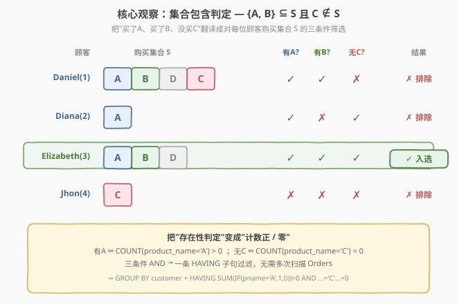
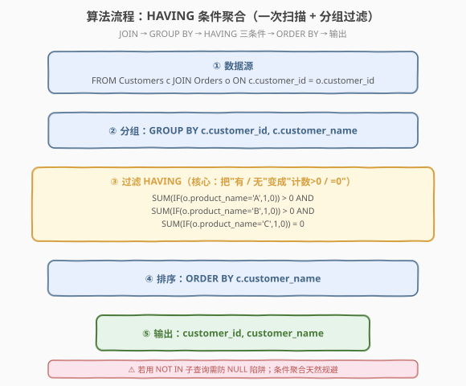
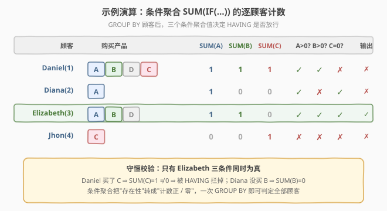

# 购买了产品A和产品B却没有购买产品C的顾客

- **题目名称**：购买了产品 A 和产品 B 却没有购买产品 C 的顾客
- **链接**：[1398. 购买了产品 A 和产品 B 却没有购买产品 C 的顾客](https://leetcode.cn/problems/customers-who-bought-products-a-and-b-but-not-c/)
- **难度**：中等
- **标签**：数据库、SQL、HAVING、条件聚合、GROUP BY、集合包含判定、EXISTS、NOT IN 的 NULL 陷阱、pandas

## 1. 题目概述

给定 `Customers`（顾客）和 `Orders`（订单）两张表。`Orders` 直接记录了某顾客买了哪个产品（`product_name`）。编写 SQL，找出**既买了产品 A、又买了产品 B、却没有买产品 C** 的顾客，返回 `customer_id` 和 `customer_name`。

> ⚠️ 题眼是「**集合包含判定**」：每位顾客的购买行为构成一个产品集合 $S$，要筛选的是 $\{A, B\} \subseteq S$ 且 $C \notin S$ 的顾客。直觉上会想"分别查买 A 的人、买 B 的人、买 C 的人再做交并差"——可行但啰嗦。更优雅的做法是**一次 `GROUP BY` + `HAVING` 条件聚合**，把"有/无"翻译成"计数 $>0$ / $=0$"，单次扫描搞定。

**表结构**：

```text
Table: Customers
+---------------+---------+
| Column Name   | Type    |
+---------------+---------+
| customer_id   | int     |  ← 主键，顾客 id
| customer_name | varchar |  ← 顾客姓名
+---------------+---------+

Table: Orders
+--------------+---------+
| Column Name  | Type    |
+--------------+---------+
| order_id     | int     |  ← 主键，订单 id
| customer_id  | int     |  ← 关联 Customers.customer_id
| product_name | varchar |  ← 产品名（本题直接存名字，无独立 Product 表）
+--------------+---------+
```

- `Customers.customer_id` 为主键；`Orders.order_id` 为主键。
- `Orders.customer_id` 指向购买该产品的顾客。
- 产品名直接出现在 `Orders.product_name` 中（A、B、C、D…），不需要额外的 `Product` 表关联。

**示例 1**：

```text
输入：
Customers 表：
+-------------+---------------+
| customer_id | customer_name |
+-------------+---------------+
| 1           | Daniel        |
| 2           | Diana         |
| 3           | Elizabeth     |
| 4           | Jhon          |
+-------------+---------------+

Orders 表：
+----------+-------------+--------------+
| order_id | customer_id | product_name |
+----------+-------------+--------------+
| 10       | 1           | A            |
| 20       | 1           | B            |
| 30       | 1           | D            |
| 40       | 1           | C            |
| 50       | 2           | A            |
| 60       | 3           | A            |
| 70       | 3           | B            |
| 80       | 3           | D            |
| 90       | 4           | C            |
+----------+-------------+--------------+

输出：
+-------------+---------------+
| customer_id | customer_name |
+-------------+---------------+
| 3           | Elizabeth     |
+-------------+---------------+
```

**解释**：

| 顾客 | 购买集合 S | 有 A？ | 有 B？ | 无 C？ | 入选？ |
|------|-----------|--------|--------|--------|--------|
| Daniel(1) | {A, B, D, C} | ✓ | ✓ | ✗（买了 C） | ✗ |
| Diana(2) | {A} | ✓ | ✗（没买 B） | ✓ | ✗ |
| Elizabeth(3) | {A, B, D} | ✓ | ✓ | ✓（没买 C） | ✓ |
| Jhon(4) | {C} | ✗ | ✗ | ✗（买了 C） | ✗ |

> 💡 只有 Elizabeth 同时满足"有 A、有 B、无 C"三个条件。Daniel 买了 A 和 B 但也买了 C，被"无 C"一票否决；Diana 只买了 A，缺 B；Jhon 只买了 C。三个条件是 **AND** 关系，缺一不可。

**约束条件**：

- `1 <= customer_id, order_id` 均为正整数。
- `product_name` 仅含大写英文字母，长度 ≥ 1。
- 结果按 `customer_name` **升序**返回。
- 输出列：`customer_id`、`customer_name`。

---

## 2. 解题思路

### 2.1 暴力思路：三次子查询 + IN / NOT IN

最直觉的写法是**分别求三个顾客集合**，再做交并差：

- 买 A 的顾客集合 $S_A$：`SELECT customer_id FROM Orders WHERE product_name='A'`
- 买 B 的顾客集合 $S_B$：`... WHERE product_name='B'`
- 买 C 的顾客集合 $S_C$：`... WHERE product_name='C'`

目标 = $(S_A \cap S_B) \setminus S_C$，翻译成 `IN` / `NOT IN`：

```sql
-- 伪代码：三次独立子查询 + IN/NOT IN
SELECT customer_id, customer_name
FROM Customers
WHERE customer_id IN (SELECT customer_id FROM Orders WHERE product_name = 'A')
  AND customer_id IN (SELECT customer_id FROM Orders WHERE product_name = 'B')
  AND customer_id NOT IN (SELECT customer_id FROM Orders WHERE product_name = 'C')
ORDER BY customer_name;
```

- **正确**，逻辑直白、贴近自然语言。但 `Orders` 被**扫描了 3 次**（每个子查询一次），且 `NOT IN` 有 **NULL 陷阱**：若子查询结果含 `NULL`，`x NOT IN (...)` 会恒为 `NULL`/`false`，导致漏行。本题 `customer_id` 非空故无碍，但工程实践脆弱。
- 还可用 `INTERSECT` / `EXCEPT`（PostgreSQL、SQL Server 支持；MySQL 8.0 不支持 `INTERSECT/EXCEPT`，8.0.31 起才支持），语义最干净但可移植性差。

> ⚠️ 暴力不是错，而是把"集合判定"拆成了三次独立扫描。看到"同时满足多个存在/不存在条件"，就该想到：**一次分组 + 条件聚合**能把三次扫描压成一次。

### 2.2 核心观察：集合包含判定 → HAVING 条件聚合



**关键洞察**：把"买 A 且买 B 且不买 C"重新表述为**对每位顾客购买集合的三条存在性断言**：

$$
A \in S \;\land\; B \in S \;\land\; C \notin S
$$

而"存在性"可以用**条件计数**等价改写——这是 SQL 的招牌变换：

$$
A \in S \iff \sum_{o \in S}\mathbb{1}[o = A] > 0, \qquad C \notin S \iff \sum_{o \in S}\mathbb{1}[o = C] = 0
$$

即在 `GROUP BY customer` 后，对组内每一行用 `IF(product_name = 'A', 1, 0)` 取值再 `SUM`，得到该顾客买 A 的次数。**次数 $>0$ ⇔ 买过；次数 $=0$ ⇔ 没买**。三条断言拼成一条 `HAVING`：

```text
HAVING SUM(IF(pname='A',1,0)) > 0   -- 买过 A
   AND SUM(IF(pname='B',1,0)) > 0   -- 买过 B
   AND SUM(IF(pname='C',1,0)) = 0   -- 没买 C
```

> 以 Daniel 为例：购买集合 {A, B, D, C}，条件计数 SUM(A)=1、SUM(B)=1、SUM(C)=1。前两条 $>0$ 通过，但第三条 $=0$ 失败（实际是 1），整行被 `HAVING` 拦掉。Elizabeth 的 SUM(C)=0，三条件全过，入选。

> ⚠️ **`IF` 的判等方向与"正/零"不要写反**。买过用 `> 0`，没买用 `= 0`。若把"没买 C"误写成 `SUM(IF(pname='C',1,0)) > 0`，逻辑就反成"买过 C"了。口诀：**正条件数 $>0$，负条件数 $=0$**。

> 💡 **为什么 `GROUP BY` 要带上 `customer_name`？** SQL 标准要求 `SELECT` 中非聚合列全部出现在 `GROUP BY` 中（ONLY_FULL_GROUP_BY 模式）。`customer_id` 已能唯一决定 `customer_name`，但显式写上 `GROUP BY c.customer_id, c.customer_name` 兼容所有数据库，避免依赖函数依赖推导。

### 2.3 算法流程图



**五步流水线**：

1. **JOIN**：`Customers c JOIN Orders o ON c.customer_id = o.customer_id`，把顾客名挂到每条订单上。
2. **GROUP BY**：`c.customer_id, c.customer_name`，每位顾客的所有订单归入一组。
3. **HAVING**：三个条件聚合 AND 过滤——SUM(A)>0、SUM(B)>0、SUM(C)=0，一步筛出符合条件的顾客。
4. **ORDER BY**：`c.customer_name`，满足题目排序要求。
5. **SELECT**：输出 `customer_id, customer_name`。

> 💡 **为什么用 `JOIN` 而非 `LEFT JOIN`？** 没有任何订单的顾客本就不可能"买过 A 和 B"，必然被排除。`JOIN`（内连接）丢弃无订单顾客，正合题意。若误用 `LEFT JOIN`，无订单顾客会凑出一行 `product_name=NULL` 的组，三个 `SUM` 全为 0，"无 C"条件反而通过——但"有 A""有 B"条件会拦住它，所以结果仍正确，但 `JOIN` 语义更贴切、也省去无意义分组。

### 2.4 示例演算

以示例 1 的 4 位顾客为例，跟踪"条件聚合 → HAVING 过滤"全过程：



| 顾客 | 购买产品 | SUM(A) | SUM(B) | SUM(C) | A>0? B>0? C=0? | 输出 |
|------|---------|--------|--------|--------|----------------|------|
| Daniel(1) | A, B, D, C | 1 | 1 | 1 | ✓ ✓ ✗ | ✗ |
| Diana(2) | A | 1 | 0 | 0 | ✓ ✗ ✓ | ✗ |
| Elizabeth(3) | A, B, D | 1 | 1 | 0 | ✓ ✓ ✓ | ✓ |
| Jhon(4) | C | 0 | 0 | 1 | ✗ ✗ ✗ | ✗ |

**关键验证点**：

- **Daniel**：买了 A、B、D、C 四种，SUM(A)=SUM(B)=SUM(C)=1。前两条件通过，但"无 C"要求 SUM(C)=0，实际为 1 → 拦掉。**一票否决**：买了 C 直接出局，无论 A、B 是否齐全。
- **Diana**：只买了 A，SUM(B)=0 → "有 B"失败 → 拦掉。**缺一不可**：少买 B 一样出局。
- **Elizabeth**：买了 A、B、D，SUM(C)=0（没买 C）→ 三条件全过 → 入选。**D 是无关产品**，不影响判定。
- **Jhon**：只买了 C，SUM(A)=SUM(B)=0，SUM(C)=1 → 三条件全败 → 拦掉。

> 💡 **守恒校验**：条件聚合结果与集合判定结果一致——只有 Elizabeth 的购买集合满足 $\{A,B\}\subseteq S \land C\notin S$。若不一致，说明 `IF` 的产品名写错或 `>0`/`=0` 方向写反。

---

## 3. 参考代码

### MySQL（解法 A：`HAVING` + 条件聚合，推荐）

```sql
# 1398. 购买了产品 A 和产品 B 却没有购买产品 C 的顾客
# 思路：GROUP BY 顾客，HAVING 三条件聚合——买A>0、买B>0、买C=0
SELECT c.customer_id, c.customer_name
FROM Customers c
JOIN Orders o ON c.customer_id = o.customer_id
GROUP BY c.customer_id, c.customer_name
HAVING SUM(IF(o.product_name = 'A', 1, 0)) > 0
   AND SUM(IF(o.product_name = 'B', 1, 0)) > 0
   AND SUM(IF(o.product_name = 'C', 1, 0)) = 0
ORDER BY c.customer_name;
```

> 💡 **写法要点**：
> - **`IF(o.product_name = 'A', 1, 0)`**：该行若是产品 A 则贡献 1，否则贡献 0。`SUM` 后即顾客买 A 的次数。
> - **`SUM(...) > 0`**：次数大于 0 ⇔ 买过；**`SUM(...) = 0`**：次数为零 ⇔ 没买。正条件用 `>0`，负条件用 `=0`。
> - **`GROUP BY` 带上 `customer_name`**：兼容 SQL 标准的 `ONLY_FULL_GROUP_BY`，不依赖函数依赖推导。
> - 一次 `JOIN` + 一次 `GROUP BY`，`Orders` 只扫描一遍。

### MySQL（解法 B：`SUM(布尔表达式)` 简写版）

```sql
SELECT c.customer_id, c.customer_name
FROM Customers c
JOIN Orders o ON c.customer_id = o.customer_id
GROUP BY c.customer_id, c.customer_name
HAVING SUM(o.product_name = 'A') > 0
   AND SUM(o.product_name = 'B') > 0
   AND SUM(o.product_name = 'C') = 0
ORDER BY c.customer_name;
```

> 💡 **MySQL 布尔简写**：在 MySQL 中，布尔表达式 `o.product_name = 'A'` 求值为 `1`（真）或 `0`（假），可直接塞进 `SUM`。等价于 `SUM(IF(...,1,0))`，更简洁。但**这是 MySQL 专有行为**（PostgreSQL 的布尔不能直接 `SUM`，需 `SUM(CASE WHEN ... THEN 1 ELSE 0 END)` 或 `COUNT(*) FILTER (WHERE ...)`），跨库请用解法 A 的 `IF`/`CASE` 版。

### MySQL（解法 C：双 `EXISTS` + `NOT EXISTS`，语义最贴近题意）

```sql
SELECT c.customer_id, c.customer_name
FROM Customers c
WHERE EXISTS (
        SELECT 1 FROM Orders o
        WHERE o.customer_id = c.customer_id AND o.product_name = 'A'
      )
  AND EXISTS (
        SELECT 1 FROM Orders o
        WHERE o.customer_id = c.customer_id AND o.product_name = 'B'
      )
  AND NOT EXISTS (
        SELECT 1 FROM Orders o
        WHERE o.customer_id = c.customer_id AND o.product_name = 'C'
      )
ORDER BY c.customer_name;
```

> 💡 **`EXISTS` vs 条件聚合**：
> - `EXISTS`/`NOT EXISTS` 把题意"买 A 且买 B 且不买 C"逐字翻译成三个相关子查询，**可读性最强**，且 `NOT EXISTS` **天然规避 NULL 陷阱**（不像 `NOT IN` 遇 `NULL` 会失效）。
> - 条件聚合（解法 A）一次扫描 + 分组，**写法最紧凑**，且把"存在性"统一为"计数"，便于扩展更多条件。
> - 性能上：现代优化器对 `EXISTS` 相关子查询会做半连接（semi-join），与 `GROUP BY` 聚合量级相当；本题数据小，任意写法都秒过。**面试推荐解法 A**（条件聚合是 SQL 招牌套路），**工程追求可读性可选解法 C**。

### Python（pandas）

```python
import pandas as pd

def find_customers(customers: pd.DataFrame, orders: pd.DataFrame) -> pd.DataFrame:
    # 每位顾客对各产品的购买次数：groupby 计数后 unstack 成宽表
    cnt = (orders.groupby(['customer_id', 'product_name']).size()
           .unstack(fill_value=0))
    # 题目只关心 A/B/C，确保三列存在（某顾客可能完全没买其中某个）
    for p in ('A', 'B', 'C'):
        if p not in cnt.columns:
            cnt[p] = 0
    # 三条件 AND：买过 A、买过 B、没买 C
    mask = (cnt['A'] > 0) & (cnt['B'] > 0) & (cnt['C'] == 0)
    hit = cnt.index[mask]
    result = (customers[customers['customer_id'].isin(hit)]
              .sort_values('customer_name')[['customer_id', 'customer_name']])
    return result
```

> 💡 **pandas 对照**：
> - `groupby(['customer_id', 'product_name']).size().unstack(fill_value=0)` 等价于 SQL 的 `GROUP BY customer_id, product_name` + 行转列——得到每位顾客对每个产品的购买次数宽表，缺失补 0。这正是 `SUM(IF(...))` 的 pandas 镜像。
> - `(cnt['A'] > 0) & (cnt['B'] > 0) & (cnt['C'] == 0)` 即 `HAVING` 三条件的布尔向量版本，逐顾客 AND。
> - 也可用 `orders.pivot_table(index='customer_id', columns='product_name', aggfunc='size', fill_value=0)` 一步出宽表，逻辑相同。

---

## 4. 复杂度分析

| 维度 | 解法 A/B（条件聚合） | 解法 C（EXISTS） | 暴力（IN/NOT IN） |
|------|----------------------|------------------|-------------------|
| **时间** | $O(n)$ | $O(n)$（半连接） | $O(n)$（3 次扫描） |
| **空间** | $O(n)$（分组哈希表） | $O(1)$（流式判定） | $O(n)$（子查询结果集） |
| **扫描次数** | 1 次 `Orders` | 最多 3 次（可走索引） | 3 次 `Orders` |
| **NULL 安全** | ✓（计数不涉及 NULL） | ✓（`NOT EXISTS` 天然安全） | ✗（`NOT IN` 遇 NULL 失效） |
| **可读性** | 中（条件聚合紧凑） | 高（逐字翻译题意） | 高（直白） |
| **推荐度** | ✓ **首选** | ✓ 并列 | △ 注意 NULL |

> - $n$ = `Orders` 表行数，$m$ = `Customers` 行数。
> - **条件聚合**：`JOIN` + `GROUP BY` 单次扫描 $O(n)$，哈希分组 $O(n)$ 空间。`HAVING` 对每组做 3 次 $O(1)$ 聚合判断。
> - **EXISTS**：每个顾客触发 3 个相关子查询，但优化器走半连接，找到首条匹配即返回，平均仍 $O(n)$。若 `Orders(customer_id, product_name)` 上有联合索引，可降至接近 $O(m \log n)$。
> - **数据规模**：本题示例级数据（9 行订单），任何正确写法都瞬过。复杂度差异的价值在**扩展性**——当条件从 3 个增到 10 个、订单量上千万时，条件聚合仍是"一条 `HAVING` 加几项"，而 `IN` 子查询会膨胀成 10 层嵌套。

> ⚠️ **`NOT IN` 的 NULL 陷阱**：`x NOT IN (SELECT ...)` 中，若子查询结果含 `NULL`，则整个谓词求值为 `NULL`（非 `true`），对应行被过滤掉。本题 `customer_id` 非空故无碍，但生产环境写 `NOT IN` 前应在子查询里加 `WHERE customer_id IS NOT NULL`，或直接改用 `NOT EXISTS`。

---

## 5. 扩展：集合运算的三种写法与选型

### 5.1 三种写法对照

| 维度 | 条件聚合 `HAVING` | `EXISTS` / `NOT EXISTS` | `INTERSECT` / `EXCEPT` |
|------|-------------------|--------------------------|------------------------|
| **核心操作** | 分组后对组内行做条件计数 | 相关子查询逐顾客判定 | 集合交/差运算 |
| **SQL 工具** | `SUM(IF(...))` + `GROUP BY` | `EXISTS` / `NOT EXISTS` | `INTERSECT` / `EXCEPT` |
| **扫描次数** | 1 次 | ≤3 次（半连接优化） | 多次（每个集合一次） |
| **NULL 安全** | ✓ | ✓ | ✓ |
| **可移植性** | `IF` 仅 MySQL；`CASE` 通用 | 全部主流数据库 | PG/SQL Server/Oracle；MySQL 8.0.31+ |
| **扩展性** | 加一个 `AND SUM(...)` 即可 | 加一个 `EXISTS` | 加一个 `INTERSECT/EXCEPT` 子句 |

### 5.2 `INTERSECT` / `EXCEPT` 写法（PostgreSQL / SQL Server）

```sql
-- 买 A 的顾客 ∩ 买 B 的顾客 − 买 C 的顾客
SELECT customer_id FROM Orders WHERE product_name = 'A'
INTERSECT
SELECT customer_id FROM Orders WHERE product_name = 'B'
EXCEPT
SELECT customer_id FROM Orders WHERE product_name = 'C';
```

再 `JOIN Customers` 取 `customer_name` 即可。语义最贴近集合论 $(S_A \cap S_B) \setminus S_C$，但 MySQL 8.0 早期版本不支持 `INTERSECT/EXCEPT`（8.0.31 起才支持），可移植性最差。

### 5.3 条件聚合的泛化模板

「在 `HAVING` 里用 `SUM(IF(...))` 把存在性转成计数正/零」是 SQL 通用模式，不限于"买 A 买 B 不买 C"：

```sql
-- 泛化模板：分组后多条件存在性判定
SELECT group_col, ...
FROM t
GROUP BY group_col, ...
HAVING SUM(IF(condition1, 1, 0)) > 0   -- 满足条件1至少一次
   AND SUM(IF(condition2, 1, 0)) > 0   -- 满足条件2至少一次
   AND SUM(IF(condition3, 1, 0)) = 0;  -- 从不满足条件3
```

常见变体：

| 场景 | 正条件（`>0`） | 负条件（`=0`） | 语义 |
|------|----------------|----------------|------|
| 买 A 且买 B 不买 C（本题） | 买过 A、买过 B | 没买 C | 集合包含 + 排除 |
| 连续登录 N 天 | 有登录 | 无缺勤 | 存在性 + 不存在性 |
| 买了全部商品 | 每种商品都 `>0` | — | 集合相等（除法） |
| 从未退款 | — | 退款次数 `=0` | 纯排除 |

> 💡 **何时必须用 `EXISTS`/`INTERSECT`？** 当条件涉及**跨行相关性**（如"买了比平均价贵的 A"）或**集合除法**（"买了所有商品"需除法/双重 `NOT EXISTS`）时，条件聚合会变笨重，`EXISTS` 系列更自然。本题是纯存在性判定，条件聚合最合适。

---

## 6. 面试要点

1. **为什么用 `HAVING` 而不是 `WHERE` 过滤"买过 A"？**

   > `WHERE` 在分组**前**逐行过滤，无法访问组内聚合值。`SUM(IF(product_name='A',1,0))` 是对组的聚合，必须用 `HAVING` 在分组**后**判定。若想用 `WHERE`，得先写子查询 `WHERE customer_id IN (买A的)` 再外层 `GROUP BY`——多一层嵌套，不如直接 `HAVING`。

2. **`SUM(IF(product_name='A',1,0)) > 0` 的含义？为什么不直接 `COUNT`？**

   > 组内对"产品名是 A"的行贡献 1、其余贡献 0，求和即买 A 的次数；`>0` 表示至少买过一次。等价写法 `COUNT(CASE WHEN product_name='A' THEN 1 END) > 0` 或 `COUNT(*) FILTER (WHERE product_name='A') > 0`（PG）。`SUM(IF)` 是 MySQL 最紧凑的写法。

3. **`NOT IN` 子查询有什么陷阱？如何规避？**

   > 若子查询结果含 `NULL`，`x NOT IN (..., NULL, ...)` 求值为 `NULL` 而非 `true`，对应行被过滤，导致漏行。规避方法：① 子查询加 `WHERE col IS NOT NULL`；② 改用 `NOT EXISTS`，它对 `NULL` 不敏感；③ 用条件聚合 `SUM(...)=0`，根本不涉及 `NULL` 比较。本题 `customer_id` 非空故无碍，但面试提到 `NOT IN` 必须主动说清 NULL 陷阱。

4. **如果题目改成"买了全部产品"，怎么做？**

   > 这是**集合除法**问题。条件聚合要枚举所有产品各写一个 `SUM(...)>0`，产品多了不可行。通用解法是**双重 `NOT EXISTS`**：找出"不存在一个产品，该顾客没买它"的顾客——`NOT EXISTS (SELECT 1 FROM Products p WHERE NOT EXISTS (SELECT 1 FROM Orders o WHERE o.customer_id=c.customer_id AND o.product_id=p.product_id))`。条件聚合适合有限固定条件，集合除法适合用 `NOT EXISTS`。

5. **`GROUP BY` 里为什么要带上 `customer_name`？**

   > SQL 标准 `ONLY_FULL_GROUP_BY` 模式要求 `SELECT` 中非聚合列全部出现在 `GROUP BY` 中。`customer_id` 虽能函数决定 `customer_name`，但并非所有数据库/模式都做函数依赖推导。显式写 `GROUP BY c.customer_id, c.customer_name` 兼容性最好，无副作用。

> 💡 **一句话总结**：1398 是 SQL **「集合包含判定招牌题」**——核心洞察是"买 A 且买 B 且不买 C"可重写为三条存在性断言，再用条件聚合把"有/无"变成"计数 $>0$ / $=0$"，一条 `HAVING` 搞定。记住：看到"同时满足多个存在/不存在条件"→ `GROUP BY` + `HAVING SUM(IF(...))`，不要陷入多次子查询的泥潭。注意 `NOT IN` 的 NULL 陷阱，能用 `NOT EXISTS` 或条件聚合就别用 `NOT IN`。

---

## 7. 同类练习题

- [175. 组合两个表](https://leetcode.cn/problems/combine-two-tables/)（[题解](../0101-0200/175_组合两个表.md)）：`LEFT JOIN` 基础题，对照"为何本题用 `JOIN` 而非 `LEFT JOIN`"——无订单顾客天然排除
- [584. 寻找用户推荐人](https://leetcode.cn/problems/find-customer-referee/)（[题解](../0501-0600/584_寻找用户推荐人.md)）：`NOT IN` / `NOT EXISTS` / `IS NULL` 三种"排除"写法对照，专治 NULL 陷阱
- [1393. 股票的资本损益](https://leetcode.cn/problems/capital-gainloss/)（[题解](./1393_股票的资本损益.md)）：`SUM(IF(...))` 条件聚合的另一经典应用——Buy 取负、Sell 取正求净损益，与本题"条件计数"同源不同用
- [1070. 产品销售分析 III](https://leetcode.cn/problems/product-sales-analysis-iii/)（[题解](../1001-1100/1070_产品销售分析III.md)）：`GROUP BY` + `HAVING` 筛选组内最值行，对照"分组后过滤"的另一种形态
- [603. 连续空余座位](https://leetcode.cn/problems/consecutive-available-seats/)（[题解](../0601-0700/603_连续空余座位.md)）：`WHERE` 逐行条件 + 自连接判定相邻，对照"跨行存在性"何时该用 `JOIN` 而非 `HAVING`
