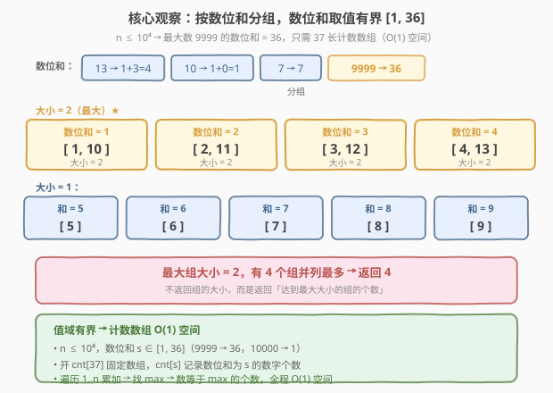
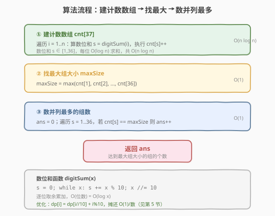
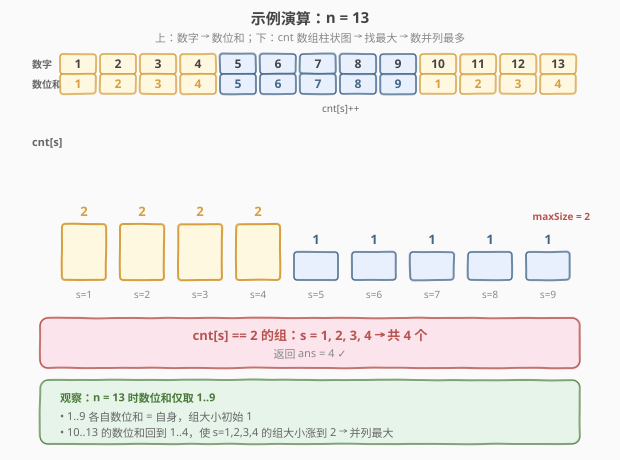

# LeetCode 统计最大组的数目 题解

## 1. 题目概述

- **标题 / 题号**：统计最大组的数目（#1399，easy）
- **链接**：https://leetcode.cn/problems/count-largest-group/
- **难度**：简单
- **标签**：数组、哈希表、数位和、计数

**题意**：给定一个整数 `n`。将 `1` 到 `n` 的每个数字按其**数位和**（各位数字之和）分组。例如 `14` 和 `5` 同组（数位和均为 5），`13` 和 `3` 不同组。

返回**元素数量最多**的组的**个数**——即有多少个组并列达到最大组大小。

**示例 1**：

```text
输入：n = 13
输出：4
解释：1 到 13 按数位和分组后共 9 个组：
[1,10], [2,11], [3,12], [4,13], [5], [6], [7], [8], [9]
大小为 2 的组有 4 个（并列最多），故返回 4。
```

**示例 2**：

```text
输入：n = 2
输出：2
解释：2 个组 [1], [2]，大小均为 1，并列最多，返回 2。
```

**约束**：

- $1 \le n \le 10^4$

> 💡 **关键点**：题目问的不是「最大组有多大」，而是「**有多少个组**达到最大大小」。读题时注意区分「组的大小」与「组的个数」——返回值是后者。

## 2. 解题思路

### 2.1 暴力思路：哈希表存组大小

最直观的做法：遍历 `1..n`，对每个数算数位和 `s`，用哈希表 `freq` 记录每个数位和对应多少个数字（`freq[s]++`）。建表后扫一遍 `freq` 找最大值 `maxSize`，再数有多少个 `s` 满足 `freq[s] == maxSize`。

- **正确**：两趟扫描，建表 $O(n)$、找最大并计数 $O(d)$（$d$ 为不同数位和的个数），合计 $O(n)$。
- **没利用值域**：哈希表能处理任意取值的键，但本题数位和取值范围极小（见 2.2），开哈希表属于「杀鸡用牛刀」——有散列开销、空间不确定。

> ⚠️ 还有一种更浪费的暴力：用 `HashMap<Integer, List<Integer>>` 存下每个组的**全部数字**，再找最长列表。这存了大量不需要的信息（题目只问组大小，不问组内有哪些数），白白多花 $O(n)$ 空间。**只需计数、不需存数**，是本题第一个该有的优化意识。

### 2.2 核心观察：数位和有界 → 定长计数数组



**关键洞察**：$n \le 10^4$，最大数字是 $9999$，其数位和 $= 9+9+9+9 = 36$；$10000$ 的数位和 $= 1$。因此所有数的数位和 $s \in [1, 36]$，是一个**常数级有界值域**。

这带来两个直接好处：

1. **定长计数数组**：开 `cnt[37]`（下标 $1 \ldots 36$），`cnt[s]` 记录数位和为 $s$ 的数字个数。数组下标访问 $O(1)$，无哈希散列开销，空间确定为 $O(1)$（37 个 int，与 $n$ 无关）。
2. **找最大 + 计数均 $O(1)$**：建表后只需扫 $1 \ldots 36$ 这 37 个元素找 `maxSize` 并计数，与 $n$ 无关。

> 以 $n = 13$ 为例：数位和仅取 $1 \ldots 9$。`1..9` 各自数位和 $=$ 自身，组大小初始为 $1$；`10..13` 的数位和回到 $1..4$，使 $s = 1,2,3,4$ 的组大小涨到 $2$。最终 `cnt = [2,2,2,2,1,1,1,1,1]`，`maxSize = 2`，有 $4$ 个组达到 $\to$ 返回 $4$。

> 💡 **「值域有界 → 定长计数数组」是高频套路**：当键的取值范围是常数级（如本题 $\le 36$），用数组替代哈希表可消除散列开销、把空间压到 $O(1)$。与 [1365. 有多少小于当前数字的数字](1365_有多少小于当前数字的数字.md) 的值域计数数组同源。

### 2.3 算法流程图



**完整步骤**：

1. **建计数数组** `cnt[37]`（初始化为 0）：遍历 $i = 1 \ldots n$，算数位和 $s = \text{digitSum}(i)$，执行 `cnt[s]++`；
2. **找最大组大小** `maxSize`：遍历 $s = 1 \ldots 36$，`maxSize = max(maxSize, cnt[s])`；
3. **数并列最多的组数** `ans`：遍历 $s = 1 \ldots 36$，若 `cnt[s] == maxSize` 则 `ans++`；
4. **返回** `ans`。

> ⚠️ 数位和函数 `digitSum(x)`：逐位取余累加，`s += x % 10; x /= 10`，直到 `x == 0`。每位 $O(1)$，总计 $O(\log x)$。对 $n \le 10^4$ 最多 5 位，常数极小。

### 2.4 示例演算

以 $n = 13$ 为例，分阶段演算：



**阶段一：遍历 1..13，求数位和并累计到 `cnt`**

| 数字 $i$ | 数位和 $s$ | 操作 | `cnt` 变化 |
|----------|-----------|------|-----------|
| 1 | 1 | `cnt[1]++` | 0→1 |
| 2 | 2 | `cnt[2]++` | 0→1 |
| 3 | 3 | `cnt[3]++` | 0→1 |
| 4 | 4 | `cnt[4]++` | 0→1 |
| 5 | 5 | `cnt[5]++` | 0→1 |
| 6 | 6 | `cnt[6]++` | 0→1 |
| 7 | 7 | `cnt[7]++` | 0→1 |
| 8 | 8 | `cnt[8]++` | 0→1 |
| 9 | 9 | `cnt[9]++` | 0→1 |
| 10 | 1+0=1 | `cnt[1]++` | 1→2 |
| 11 | 1+1=2 | `cnt[2]++` | 1→2 |
| 12 | 1+2=3 | `cnt[3]++` | 1→2 |
| 13 | 1+3=4 | `cnt[4]++` | 1→2 |

建表完成：`cnt = [2, 2, 2, 2, 1, 1, 1, 1, 1]`（下标 $1 \ldots 9$，$10 \ldots 36$ 全为 $0$）。

**阶段二：找最大 + 计数**

| 步骤 | 遍历 $s$ | `cnt[s]` | `maxSize` | `cnt[s]==maxSize`? | `ans` |
|------|---------|----------|-----------|---------------------|-------|
| 找最大 | $1 \ldots 4$ | 2 | $0 \to 2$ | — | 0 |
| 找最大 | $5 \ldots 36$ | $\le 1$ | 不变（2） | — | 0 |
| 计数 | 1 | 2 | 2 | $2==2$ ✓ | 1 |
| 计数 | 2 | 2 | 2 | $2==2$ ✓ | 2 |
| 计数 | 3 | 2 | 2 | $2==2$ ✓ | 3 |
| 计数 | 4 | 2 | 2 | $2==2$ ✓ | 4 |
| 计数 | $5 \ldots 36$ | $\le 1$ | 2 | $1 \ne 2$ ✗ | 4 |

最终 `ans = 4` ✓。

> 💡 **为什么 $n = 13$ 恰好让 $s = 1,2,3,4$ 并列最大？** 因为 $1 \ldots 9$ 各自独占一个数位和（大小 1），而 $10 \ldots 13$ 的数位和「回绕」到 $1 \ldots 4$，恰好给前 4 个组各加一人。若 $n$ 更大（如 $n = 24$），$10 \ldots 19$ 会让 $s = 1 \ldots 10$ 都涨到 2，$20 \ldots 24$ 又让 $s = 2 \ldots 6$ 涨到 3——最大组随 $n$ 增长而动态变化。

## 3. 参考代码

### C++

```cpp
class Solution {
public:
    int countLargestGroup(int n) {
        int cnt[37] = {0};
        for (int i = 1; i <= n; ++i) {
            int s = 0, x = i;
            while (x) {
                s += x % 10;
                x /= 10;
            }
            cnt[s]++;
        }
        int maxSize = 0;
        for (int s = 1; s <= 36; ++s)
            maxSize = max(maxSize, cnt[s]);
        int ans = 0;
        for (int s = 1; s <= 36; ++s)
            if (cnt[s] == maxSize) ++ans;
        return ans;
    }
};
```

### Python

```python
class Solution:
    def countLargestGroup(self, n: int) -> int:
        cnt = [0] * 37
        for i in range(1, n + 1):
            s = 0
            x = i
            while x:
                s += x % 10
                x //= 10
            cnt[s] += 1
        maxSize = max(cnt)
        return sum(1 for c in cnt if c == maxSize)
```

> 💡 **实现要点**：① 数组大小取 37：下标 $0$ 不用（无正整数数位和为 0），$1 \ldots 36$ 覆盖 $n \le 10^4$ 全部情况。② Python 版 `max(cnt)` 直接对 37 元素取最大，`sum(1 for c in cnt if c == maxSize)` 一行完成计数——`cnt` 固定 37 长，两步都是 $O(1)$。③ 数位和用 `while x: s += x%10; x//=10` 逐位累加，无需转字符串。

## 4. 复杂度分析

| 维度 | 计数数组（推荐） | 哈希表（暴力） |
|------|-----------------|----------------|
| **时间复杂度** | $O(n \log n)$ | $O(n \log n)$ |
| **空间复杂度** | $O(1)$（固定 37 长数组） | $O(d)$，$d$ 为不同数位和个数（$\le 36$） |
| **常数** | 数组下标访问，无散列开销 | 哈希散列 + 动态扩容 |
| **是否依赖值域** | 是（数位和 $\le 36$） | 否（通用） |

- **计数数组**：建表 $n$ 个数 $\times$ 每个数 $O(\log n)$ 求数位和 $= O(n \log n)$；找最大与计数各扫 37 个元素 $= O(1)$。空间固定 37 个 int，与 $n$ 无关 $= O(1)$。
- **哈希表**：时间同为 $O(n \log n)$；空间存 $d$ 个键值对，虽然 $d \le 36$ 也是常数级，但有散列开销且不如数组直接。

> ⚠️ 严格来说数位和求和是 $O(\log n)$（位数），但 $n \le 10^4$ 时 $\log n \le 5$，实际与 $O(n)$ 几乎无差。若用第 5 节的 DP 递推可把每位求和降到摊还 $O(1)$，总时间严格 $O(n)$。

> 💡 本题 $n \le 10^4$ 极小，两种方法都毫秒级通过。面试中写计数数组版即可——它更简洁、空间更优，且体现了对值域约束的利用。

## 5. 扩展：数位和的 DP 递推（摊还 O(1)/数）

上述解法对每个 $i$ 都从头算数位和（`while x` 循环）。可以利用一个递推关系把每位求和降到 $O(1)$：

$$\text{ds}[i] = \text{ds}[i / 10] + (i \bmod 10)$$

**正确性**：$i$ 的数位和 = 去掉个位后的数（$i/10$）的数位和 + 个位数字（$i \% 10$）。$i/10 < i$，故 $\text{ds}[i/10]$ 已在更早时算好，直接查表即可。

### C++

```cpp
class Solution {
public:
    int countLargestGroup(int n) {
        int cnt[37] = {0};
        int ds[10001] = {0};
        for (int i = 1; i <= n; ++i) {
            ds[i] = ds[i / 10] + i % 10;
            cnt[ds[i]]++;
        }
        int maxSize = *max_element(cnt + 1, cnt + 37);
        return (int)count(cnt + 1, cnt + 37, maxSize);
    }
};
```

### Python

```python
class Solution:
    def countLargestGroup(self, n: int) -> int:
        cnt = [0] * 37
        ds = [0] * (n + 1)
        for i in range(1, n + 1):
            ds[i] = ds[i // 10] + i % 10
            cnt[ds[i]] += 1
        maxSize = max(cnt)
        return cnt.count(maxSize)
```

> 💡 **递推的本质**：把「$i$ 的数位和」分解为「$i/10$ 的数位和（已算）+ 个位」，避免重复求高位。这与 [258. 各位相加](../0201-0300/258_各位相加.md) 的数位根思想一脉相承——数位运算可通过 $/10$ 和 $\%10$ 递推拆解。空间多开 $O(n)$ 的 `ds` 数组换时间常数，$n \le 10^4$ 时代价可忽略。

| 写法 | 每位求和代价 | 总时间 | 额外空间 | 适用 |
|------|-------------|--------|----------|------|
| `while x` 逐位累加 | $O(\log n)$ | $O(n \log n)$ | 无 | 通用，代码最简 |
| `ds[i] = ds[i/10] + i%10` 递推 | 摊还 $O(1)$ | $O(n)$ | $O(n)$（`ds` 数组） | $n$ 大时省常数 |

## 6. 面试要点

1. **题目问的是「组的个数」还是「组的大小」？**

   > 问的是**组的个数**——有多少个组并列达到最大组大小。读题务必区分「最大组有多大」（组的大小）与「有几个组达到最大」（组的个数）。示例 1 中最大组大小是 2，但答案是 4（有 4 个大小为 2 的组），不是 2。

2. **为什么数位和取值范围是 $[1, 36]$？**

   > $n \le 10^4$，最大数字 $9999$ 的数位和 $= 9 \times 4 = 36$；$10000$ 的数位和 $= 1$。所有数的数位和都在 $[1, 36]$ 内，是常数级有界值域。这使得定长计数数组 `cnt[37]` 可行，空间 $O(1)$。

3. **为什么用计数数组而非哈希表？**

   > 数位和取值有界（$\le 36$），数组下标直接映射数位和，访问 $O(1)$ 无散列开销，空间确定为 37 个 int。哈希表虽也能做（且 $d \le 36$ 同为常数级），但有散列/扩容开销，不如数组直接。**值域有界时优先计数数组**是通用原则。

4. **只需计数、不需存数的优化意识从何而来？**

   > 题目只问「组的大小」和「组个数」，从不问「组里有哪些数」。因此 `cnt[s]++` 记录大小即可，无需 `List` 存数字。这是「**按需存储**」的意识——只存答案需要的信息，避免冗余。若误存列表，白白多花 $O(n)$ 空间。

5. **数位和的 DP 递推 `ds[i] = ds[i/10] + i%10` 为什么正确？**

   > $i$ 的数位和 = 去掉个位（$i/10$）的数位和 + 个位（$i \% 10$）。$i/10 < i$，其数位和已在更早迭代中算好存入 `ds[i/10]`，直接查表 $O(1)$ 得到。这把每位从头累加的 $O(\log n)$ 降到摊还 $O(1)$，总时间严格 $O(n)$。

> 💡 **一句话总结**：1399 的灵魂是「**数位和有界 → 计数数组**」——遍历 $1..n$ 求数位和累计到 `cnt[37]`，再找最大并数并列最多的组数。$O(n \log n)$ 时间、$O(1)$ 空间。读题分清「组大小」与「组个数」是避免返工的第一步。

## 同类练习题

| # | 题目 | 与本题的关联 |
|---|------|-------------|
| 258 | [各位相加](https://leetcode.cn/problems/add-digits/)（[题解](../0201-0300/258_各位相加.md)） | 数位和的核心原语，反复求数位和直到个位（数位根），本题数位和函数的延伸 |
| 202 | [快乐数](https://leetcode.cn/problems/happy-number/)（[题解](../0201-0300/202_快乐数.md)） | 数位平方和序列 + Floyd 判圈，数位运算的进阶应用，对照本题「数位和分组」与 202「数位平方和判圈」 |
| 1394 | [找出数组中的幸运数](https://leetcode.cn/problems/find-lucky-integer-in-an-array/)（[题解](1394_找出数组中的幸运数.md)） | 同目录，计数 + 取最大范式，对照本题「计数 + 找最大 + 数并列最多」与 1394「计数 + 等值判定取最大」 |
| 1365 | [有多少小于当前数字的数字](https://leetcode.cn/problems/how-many-numbers-are-smaller-than-the-current-number/)（[题解](1365_有多少小于当前数字的数字.md)） | 值域计数数组 + 前缀和，同为「值域有界 → 定长计数数组」套路，对照两种建表后处理 |
| 204 | [计数质数](https://leetcode.cn/problems/count-primes/)（[题解](../0201-0300/204_计数质数.md)） | 值域筛法计数，对照本题「值域计数数组累加」与 204「值域筛法标记」，体会值域有界问题的不同计数手段 |
